# Church History · Lesson 2.1: Nicaea and the imperial Church

> ⏱ ~15 min · Module 2: Councils, empire, and the desert · Builds on: [1.4 Constantine](01-04-constantine.md) · Unlocks: [2.2 Ephesus, Chalcedon, and Leo's Rome](02-02-ephesus-chalcedon-and-leos-rome.md)

## Why this matters

In 325 an emperor called the bishops of his empire to a lakeside town in Bithynia, paid their travel, sat among them, and exiled the few who would not sign. It was the first council later counted as ecumenical, and it did not end the quarrel it was called to end. For fifty-six years emperors made and unmade bishops. By 381 the Nicene faith was imperial law. The question this lesson answers is historical, not doctrinal: what could an emperor do to the Church once he was a Christian, and what could he not do?

## The idea

Before Constantine a Church dispute ended in rival synods, and the losers kept their congregations. After him a third party had a stake in the result. The emperor wanted **concord**: one Church, praying for one empire, with no riots in its great cities. He had tools no bishop had. He could summon a council, carry bishops there on the imperial post, give its decisions the force of law, and remove a bishop from his city by sending him into exile.

The pattern of 325–381 is that these tools worked in the short run and failed in the long run. Emperors could decide who sat in a bishop's chair this year; they could not make a formula stick when the bishops, monks and congregations under it would not accept it. Constantine's son spent two decades imposing a creed that his successors' bishops repudiated. And the side that won in 381 called the losers "Arians", a label that historians now treat with suspicion.

## Source

Constantine's letter to Alexander and Arius, 324, preserved by Eusebius in his *Life of Constantine* 2.68 and 2.70 (NPNF, 2nd series, vol. 1, public domain). Constantine had just defeated Licinius and become master of the East. He sent the letter to Alexandria with his adviser Ossius of Córdoba:

> having made a careful enquiry into the origin and foundation of these differences, I find the cause to be of a truly insignificant character, and quite unworthy of such fierce contention. […] Let therefore both the unguarded question and the inconsiderate answer receive your mutual forgiveness. For the cause of your difference has not been any of the leading doctrines or precepts of the Divine law, nor has any new heresy respecting the worship of God arisen among you. You are in truth of one and the same judgment: you may therefore well join in communion and fellowship.

Read it for what the emperor wants. His test of a dispute is whether it divides "the holy people", and his remedy is mutual forgiveness. He does not say which party is right; he says neither question should have been asked. Within a year he had learned that both sides thought the question was about who Christ is, and he changed his method from mediation to a council.

## What happened

1. **Alexandria, c. 318** (sources allow 318–321). Arius, presbyter of the Baucalis church, taught that the Son had a beginning and was not eternal as the Father is. His bishop Alexander held a synod that excommunicated him. Arius found allies abroad, above all Eusebius of Nicomedia, and rival synods in Palestine and Bithynia backed him. *In words:* other sees took sides, and a local quarrel became an eastern one.
2. **Nicaea, 325.** The letter failed, and Constantine convoked a council, which met in early summer (the conventional opening date is 20 May). Eusebius of Caesarea counted more than 250 bishops; Athanasius said about 300 and later 318, the number that stuck. Nearly all were easterners. Two Roman presbyters represented Bishop Silvester. The creed called the Son *homoousios*, of one substance with the Father; what that defined belongs to [`trinity-and-god`](../../trinity-and-god/syllabus.md) 3.1, and it sits on the top rung of the [ladder of doctrinal authority](../../fundamental-theology/lessons/04-04-the-ladder-of-doctrinal-authority.md). Only two bishops, Secundus of Ptolemais and Theonas of Marmarica, refused to sign; they were exiled with Arius. It also settled the dating of Easter and issued twenty canons.
3. **Constantine reverses course, 328–337.** Eusebius of Nicomedia, exiled soon after the council, was recalled, and so was Arius. Athanasius, Alexander's deacon at Nicaea, became bishop of Alexandria in 328 and refused to readmit Arius. The Council of Tyre (335) deposed him. Constantine exiled him to Trier on a charge that was political, not doctrinal: Athanasius's own account says he was accused of threatening to hold back the grain fleet from Alexandria to the capital. Arius died in 336, before readmission. Constantine was baptized on his deathbed in 337 by Eusebius of Nicomedia.
4. **Constantius II and the Homoians, 337–361.** Constantine's son, emperor in the East from 337 and of the whole empire from 353, pressed for a creed broad enough to unite the East. Bishops who resisted went into exile, among them Liberius of Rome (355) and, for the third time, Athanasius (356). In 359 twin councils met, western bishops at Ariminum (Rimini) and eastern ones at Seleucia, and under imperial pressure both accepted a formula calling the Son "like the Father", with the word *ousia* (substance) banned. A council at Constantinople ratified it in 360. Jerome, looking back about twenty years later: "The whole world groaned, and was astonished to find itself Arian" (*Dialogue against the Luciferians* 19). *In words:* for a few years the imperial Church's official creed was not Nicaea's, and nearly every bishop had signed it.
5. **Julian, 361–363.** The last pagan emperor let all exiled bishops go home in 362. The historian Ammianus Marcellinus says he expected freedom to make the Christians quarrel more. Athanasius returned, and was exiled again within the year.
6. **Valens, 364–378.** The eastern emperor favoured the Homoians and exiled Athanasius a fifth time (365–366). Athanasius died in his see in 373. Valens died fighting the Goths at Adrianople in 378.
7. **Theodosius, 379–395.** On 27 February 380 Theodosius, with his western colleagues Gratian and Valentinian II, issued the law known from its opening words as *Cunctos populos* (Theodosian Code 16.1.2). It ordered its subjects to hold the faith that the apostle Peter had handed to the Romans, as now kept by Bishop Damasus of Rome and Bishop Peter of Alexandria. Those who did were to be called Catholic Christians; the rest were heretics, liable to divine and imperial punishment. The law was addressed to the people of Constantinople, where Theodosius expelled the Homoian bishop in November. In May 381 he convened about 150 eastern bishops at **Constantinople**, with no western bishops and no Roman legates. The creed associated with the council, first attested at Chalcedon in 451, added a confession of the Holy Spirit (`trinity-and-god` 3.3). Its third canon ranked Constantinople second after Rome as "New Rome", a claim that returns in [2.2](02-02-ephesus-chalcedon-and-leos-rome.md). *In words:* Constantine's goal in 325, one faith enforced by law, arrived in 380–381, for the party his son had spent twenty years undermining.
8. **Ambrose and Theodosius, 390.** After a riot at Thessalonica killed the military commander there, troops massacred citizens. The number is not known; Theodoret, writing about sixty years later, reports that 7,000 were said to have died. Ambrose, bishop of Milan, wrote the emperor a private letter refusing to celebrate the Eucharist in his presence until he repented, and Theodosius did public penance before Christmas 390. The famous scene of Ambrose barring the emperor at the church door comes from the church historians of the 440s, Sozomen and, at greatest length, Theodoret. Neil McLynn (*Ambrose of Milan*, 1994) treats it as a pious fiction and reads the penance as a negotiated settlement between court and church. The story became the standard precedent for a bishop judging an emperor.

## Timeline: councils and exiles, 318-381

```mermaid
graph LR
  A["c. 318: Arius vs Alexander"] --> B["325: Nicaea"]
  B --> C["328: Arius recalled"]
  C --> D["335: Tyre deposes Athanasius"]
  D --> E["336-337: exile 1, Trier"]
  E --> F["339-346: exile 2, Rome"]
  F --> G["356-362: exile 3, Egypt"]
  G --> H["359-360: Homoian creed"]
  H --> I["362-363: exile 4, Julian"]
  I --> J["365-366: exile 5, Valens"]
  J --> K["380: Cunctos populos"]
  K --> L["381: Constantinople I"]
```

Read it by emperor: Constantine convenes, then relents toward Arius's allies (B–E); Constantius drives the middle (F–H); Julian and Valens make exile routine (I–J); Theodosius closes it by law and council (K–L).

## Worked examples

**Example 1 (clean: reading Athanasius's exiles as a political record).**

Who sent him, and why? Dates follow Uta Heil's Erlangen chronology.

| Exile | Dates | Sent by | Occasion |
|---|---|---|---|
| 1 | Feb 336 – Nov 337 | Constantine | Tyre's deposition; the grain charge |
| 2 | Apr 339 – Oct 346 | Constantius II | a rival bishop installed; refuge in Rome |
| 3 | Feb 356 – Feb 362 | Constantius II | troops enter his church; hides among the monks |
| 4 | Oct 362 – Aug 363 | Julian | ordered out of Egypt |
| 5 | Oct 365 – Feb 366 | Valens | general order against bishops Constantius had removed |

Months in exile: 21 + 90 + 72 + 10 + 4 = 197, about 16.4 years. His episcopate ran from June 328 to May 373, 539 months, about 45 years. So he spent roughly 37 percent of it in exile. (Older books say seventeen.)

Each exile follows a change in the emperor's policy or person, and each return follows a change of emperor or a western colleague's pressure (his western brother Constans pressed for the return of 346). The stated grounds were mostly about order, not doctrine: the grain charge, resuming his see without a synod's leave, alleged dealings with the usurper Magnentius, a pagan emperor's displeasure, a general order. Emperors removed Athanasius because he disturbed the peace of the empire's second city. His refuge in Rome in 339–346 and Pope Julius's defence of him belong to the primacy record in [2.2](02-02-ephesus-chalcedon-and-leos-rome.md).

**Example 2 (hard: was there an "Arian" party?).**

The older narrative, which begins in Athanasius's polemic, tells 318–381 as one fight: orthodoxy against a heresy founded by Arius and carried on by his party. Lewis Ayres (*Nicaea and its Legacy*, 2004), building on R. P. C. Hanson and Rowan Williams, argues that this picture is Athanasius's construction. On his account there was no continuous Arian party, and the bishops who opposed Athanasius held several different theologies. Nicaea's own creed was little invoked until the 350s, when Athanasius began to make *homoousios* the test. A coherent "pro-Nicene" theology formed only in the 360s–380s.

The evidence strains both ways. For Ayres, at the Dedication Council of Antioch in 341, the eastern bishops wrote "We have not been followers of Arius — how could Bishops, such as we, follow a Presbyter?" (quoted in Athanasius, *De Synodis* 22). The Homoian creed of 359 avoided Arius's signature claims rather than adopting them. For the older view: those same bishops readmitted Arius, deposed his chief opponents, and between 355 and 360 enforced a creed that dropped Nicaea's key word. You can grant that "Arian" was a slur and still see a real alignment against Nicaea. The crux is whether a shared enemy makes a party. The label survives in this course as the period's name, in quotation marks, and the 359 party is called Homoian.

## Watch out

- **Nicaea did not settle the controversy.** It started the imperial phase of it. The decisive settlement was 380–381, and it came with a new emperor, not a new argument.
- **Convening is not defining.** Constantine called the council and enforced its result, but no source has him drafting the creed. "Caesaropapism" fits this period badly: Constantius could exile Liberius but could not make the West keep the 359 creed once he was dead.
- **Don't trust the church-door scene.** Ambrose's letter is private and tactful. The public confrontation comes from Sozomen and Theodoret, writing half a century later. The penance itself is well attested.
- **"Heretic" became a legal status in 380.** After *Cunctos populos*, losing a church dispute could cost you your churches and civil standing as well as your see: the root of the coercion that returns in [5.3](05-03-heresy-inquisition-and-the-jews.md).

## One-liner

> From 325 to 381 emperors could summon councils and exile bishops at will, but a creed held only when bishops and people received it, and the one that held was the one Constantine's son had tried to bury.

## Problems

**P1 (🟢) *(Exegetical.)*** Ambrose to Theodosius, 390 (*Letter* 51.5, 13–14, NPNF 2nd series vol. 10, public domain):

> This vehemence of yours I preferred to commend privately to your own consideration, rather than possibly raise it by any action of mine in public. […] I dare not offer the sacrifice if you intend to be present. Is that which is not allowed after shedding the blood of one innocent person, allowed after shedding the blood of many? I do not think so. Lastly, I am writing with my own hand that which you alone may read.

(a) State exactly what Ambrose says he will do, and on what condition. (b) Quote the words that bear on Theodoret's later account of a public confrontation at the church door, and say what they show. Two sentences per part.

**P2 (🟡) *(Exegetical (a) · Evaluative (b).)*** (a) The older narrative tells 318–381 as orthodoxy against one Arian party; Ayres denies it. Name the single premise Ayres must deny, and give two pieces of evidence from the lesson that he can use. (b) Is "the Arian controversy" still a usable name for the period? Answer either way. 150 words or fewer in total.

**P3 (🔴, optional) *(Exegetical (a) · Evaluative (b).)*** An invented tour-guide script, delivered at the lakeshore in İznik:

> "Right here, in 325, Constantine locked the bishops in until they voted. It was close, but they declared Jesus divine, and while they were at it they chose which gospels went into the Bible. From that day on, whatever the emperor believed, the Church believed."

(a) Correct the script's two factual claims about what the council did. (b) Test the last sentence against the record of 325–390, conceding what is true in it. 150 words or fewer in total.

Solutions

**P1** *(Exegetical.)*

**Must hit, strict (a):** Ambrose will not celebrate the Eucharist ("offer the sacrifice") if Theodosius intends to be present. The condition is repentance for the massacre: the letter argues that what is barred after one innocent death cannot be allowed after many. He does not pronounce a formal sentence of excommunication in these words; he refuses to celebrate in the emperor's presence.
**Must hit, strict (b):** "commend privately … rather than … in public" and "writing with my own hand that which you alone may read". They show the rebuke was delivered as a private, handwritten letter, deliberately kept out of public view. So the letter gives no support to a public confrontation at the door, and it fits McLynn's view that the scene is a later dramatization. It does not by itself prove that no meeting at the church ever happened.
**Wrong turns:** saying Ambrose excommunicated the emperor by name in this letter; claiming the letter disproves the penance, which is attested elsewhere; treating Theodoret, writing about sixty years later, as an equal witness to Ambrose's own letter.
**Model answer:** (a) Ambrose says he will not offer the Eucharistic sacrifice if Theodosius means to attend. The condition is that the emperor repent, since what would bar a man after one innocent death cannot be allowed after many. (b) "Commend privately … rather than … in public" and "you alone may read" show a deliberately private, handwritten rebuke. That tells against Theodoret's public scene at the church door, though it cannot prove no meeting there ever took place.

---

**P2** *(Exegetical (a) · Evaluative (b).)*

**Must hit, strict (a):** the premise that the anti-Nicene bishops formed **one continuous party with a shared theology derived from Arius**. Evidence: Antioch 341's "We have not been followers of Arius"; the Homoian creed of 359 avoided Arius's own claims; Nicaea's creed was little invoked until the 350s, when Athanasius made *homoousios* the test. Any two.
**Must hit, any verdict (b):** say what the name gets right or wrong. It is Athanasius's polemical label, but there was a real alignment that readmitted Arius and enforced the 359 creed. Then say what the name costs or buys: clarity against distortion. Either verdict passes.
**Wrong turns:** saying Ayres denies that the dispute happened or that the Homoians existed; treating Jerome's "find itself Arian" as neutral evidence (it is the winning side's retrospect); answering (b) with no reason.
**Model answer (one of several):** (a) He denies that one Arian party, with a theology inherited from Arius, ran from 318 to 381. Antioch's bishops in 341 disowned being "followers of Arius", and the 359 creed did not adopt Arius's claims. (b) Usable with care. The name records the winners' framing, but the Homoian coalition was real enough to depose Nicaea's defenders and impose its creed, so "Arian controversy" in quotation marks, with "Homoian" for the 359 party, keeps the period's name without pretending it was one sect.

---

**P3** *(Exegetical (a) · Evaluative (b).)*

**Must hit, strict (a):** (i) the vote was not close. Of roughly 250–300 bishops, only two, Secundus and Theonas, refused to sign and were exiled with Arius. The question was not whether to honour Christ as divine at all, but whether the Son was of one substance with the Father (one line; `trinity-and-god` 3.1). (ii) No canon, creed or reliable report has Nicaea deciding which books belonged in the Bible. Its known business was the creed, the date of Easter, the Melitian schism and twenty disciplinary canons. No source reports the bishops being locked in.
**Must hit, any verdict (b):** concede what is true: emperors convened, enforced, exiled, and in 380 made one faith law. Test it against the record: Constantius imposed the 359 creed and it was repudiated after his death; Julian and Valens pulled the other way; Ambrose made Theodosius do penance in 390. Then say whether "whatever the emperor believed" survives.
**Wrong turns:** "correcting" the script by saying the emperor had no influence at all; arguing about whether Nicaea's doctrine was true (not asked); counting the eastern Homoian majority of 359–360 as proof the emperor always won, without noting it collapsed.
**Model answer (one of several):** (a) Only two bishops of about 250–300 refused to sign, so the vote was not close, and the question was how the Son is divine, not whether. No source has Nicaea choosing gospels. Its business was the creed, Easter, a schism in Egypt and twenty canons. (b) Half true. Emperors called councils, exiled bishops and, in 380, made Nicene faith law. But Constantius's 359 creed was his own belief imposed by force, and it was abandoned once he died. Julian and Valens reversed their predecessors, and Ambrose made Theodosius repent. Emperors decided who held a see for a time, not what the Church believed.

## Flashback

**From Lesson [1.3](01-03-persecution-and-martyrdom.md) (Persecution and martyrdom):** *(Exegetical.)* It is about 112, just after Trajan's reply to Pliny. A governor of Bithynia-Pontus faces three cases. (i) An unsigned list naming thirty local Christians is posted in the forum. (ii) A named accuser brings a woman who admits she was a Christian until a few years ago; in court she offers sacrifice. (iii) A named accuser brings a man who confesses he is a Christian and, asked three times, refuses to sacrifice. (a) What does Trajan's rescript direct in each case? One sentence each. (b) Why is the man in (iii) punished? Give Sherwin-White's answer and de Ste. Croix's, one sentence each.

Solution

**Must hit, strict (a):** (i) Nothing: anonymous accusations are to be rejected, and the governor is not to go looking for Christians. (ii) Pardon: anyone who sacrifices is pardoned, whatever their past. (iii) Punishment: he is accused by a named person, convicted by his own confession, and persists.
**Must hit, strict (b):** Sherwin-White: for obstinacy (*contumacia*). Refusing a magistrate's repeated order was defiance of Roman authority, intolerable in itself. De Ste. Croix: for the name. Being a Christian was the offence, and the refusal to sacrifice only revealed it. Behind it lay the religious fear that Christian "atheism" endangered the *pax deorum*.
**Wrong turns:** having the governor investigate the list, which is exactly the hunting Trajan forbids; punishing the woman for having been a Christian; swapping the two historians; citing a general law against Christianity in 112 (there was none until the middle of the third century).
**Model answer:** (a) (i) Ignore the list: anonymous accusations have no place, and Christians are not to be sought out. (ii) Release her: sacrifice earns pardon, whatever she was before. (iii) Punish him: he was properly accused, confessed, and persisted. (b) For Sherwin-White, he is punished for obstinacy, since refusing a magistrate's order three times is defiance of Roman authority. For de Ste. Croix, he is punished for being a Christian, and his refusal only confirms the charge; the underlying fear was that such "atheists" disturbed the peace of the gods.

## Connections

- **Backward:** [1.4](01-04-constantine.md) gave Constantine's conversion and his first imperial council, Arles (314), called over the Donatists. Nicaea used the same method at the scale of the empire. [1.3](01-03-persecution-and-martyrdom.md) is the other half of the reversal: bishops who had been exiled by pagan emperors were now exiled by Christian ones.
- **Forward:** [2.2](02-02-ephesus-chalcedon-and-leos-rome.md) runs the same machinery of emperor, council and exile on the question of Christ's person, and takes up canon 3's "New Rome" and Rome's answer. [2.3](02-03-the-desert-and-the-monastery.md) follows Athanasius into the desert, where he hid in 356–362, and his *Life of Antony*. Coercion of heretics as law returns in [5.3](05-03-heresy-inquisition-and-the-jews.md).
- **Sideways:** what Nicaea and Constantinople defined belongs to [`trinity-and-god`](../../trinity-and-god/syllabus.md) 3.1 and 3.3. Athanasius read as a theologian belongs to [`patristics`](../../patristics/syllabus.md) 3.1. Newman's claim that the laity kept the Nicene faith when bishops wavered, and how historians have qualified it, is in [`fundamental-theology` 5.3](../../fundamental-theology/lessons/05-03-the-sensus-fidei.md). Ambrose and Theodosius as the first precedent in the theory of the two powers is picked up by Gelasius in [2.2](02-02-ephesus-chalcedon-and-leos-rome.md) and by [`history-of-political-thought`](../../history-of-political-thought/syllabus.md).

Terms on the card: [homoousios](../reference.md#homoousios), [Homoians](../reference.md#homoians), [imperial convocation of councils](../reference.md#imperial-convocation-of-councils), [exiles of Athanasius](../reference.md#exiles-of-athanasius), [Cunctos populos](../reference.md#cunctos-populos), ["Arianism" as a label](../reference.md#arianism-as-a-label), [Ambrose and Theodosius](../reference.md#ambrose-and-theodosius).
