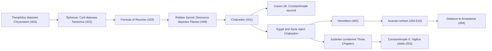

# Church History · Lesson 2.2: Ephesus, Chalcedon, and Leo's Rome

> ⏱ ~15 min · Module 2: Councils, empire, and the desert · Builds on: [2.1 Nicaea and the imperial Church](02-01-nicaea-and-the-imperial-church.md), [1.2 Bishops, canon, and the parting of the ways](01-02-bishops-canon-and-the-parting-of-the-ways.md) · Unlocks: [3.1 Gregory the Great and the conversion of the peoples](03-01-gregory-the-great-and-the-conversion-of-the-peoples.md), [4.2 East and West: the long estrangement](04-02-east-and-west-the-long-estrangement.md)

## Why this matters

Between 431 and 553 the Church held three councils about the person of Christ and ended with more divisions than it began with. Egypt, much of Syria and Armenia never accepted Chalcedon, and their churches, today's Oriental Orthodox, are still separate. In the same century a bishop of Rome, Leo I, set out a theology of his see so clearly that a Protestant historian could call him the first pope in the full sense. The two stories are one story.

## The idea

Read the fifth-century councils as a contest between **sees** as well as between **doctrines**. Alexandria was old, rich, and the see of Athanasius. Constantinople was new, and had been given precedence after Rome in 381 because it was the emperor's city ([2.1](02-01-nicaea-and-the-imperial-church.md)). Three times in fifty years a bishop of Alexandria brought down a bishop of Constantinople: Theophilus deposed John Chrysostom in 403, Cyril deposed Nestorius in 431, and Dioscorus deposed Flavian in 449. Each time the theological charge was real, and each time the rivalry gave it force.

Two further actors decide how each round ends. The **emperor** convenes the council, polices it and enforces its verdict. The **bishop of Rome**, far away and writing in Latin, is the one outside ally both sides want. Leo made that position into a claim: Peter still speaks and acts through his heir. The East valued his letter, but it did not accept his reasons for its authority.

## Source

From the acts of Chalcedon, the session at which Leo's Tome (his 449 letter to Flavian on the two natures of Christ) was read aloud. Translation from *Nicene and Post-Nicene Fathers*, 2nd series, vol. 14 (1900), public domain:

> After the reading of the foregoing epistle, the most reverend bishops cried out: This is the faith of the fathers, this is the faith of the Apostles. So we all believe, thus the orthodox believe. Anathema to him who does not thus believe. Peter has spoken thus through Leo. So taught the Apostles. Piously and truly did Leo teach, so taught Cyril. Everlasting be the memory of Cyril. Leo and Cyril taught the same thing, anathema to him who does not so believe. This is the true faith.

Read it as a historian. These are **acclamations**: rhythmic shouts, written up by the council's notaries in an edited record. In the same breath the bishops say Peter spoke through Leo and that Leo taught what Cyril taught. The acts then record that the Illyrian bishops questioned some passages. A committee under Anatolius of Constantinople examined the Tome against Cyril's writings before the bishops affirmed it one by one. So the acclamation shows that the council honoured Leo's letter in Petrine language. It does not show on what ground the bishops accepted it. One reading is that it was accepted because Peter's heir had spoken. The other is that it was accepted because it matched Cyril. The record supports both.

## What happened

1. **Nestorius and Cyril (428–433).** Nestorius, bishop of Constantinople from 428, objected to calling Mary *Theotokos*, "God-bearer." Cyril of Alexandria had Rome's support, since a Roman synod had condemned Nestorius in 430. Emperor Theodosius II called a council at Ephesus. Cyril opened it on 22 June 431 without waiting for John of Antioch and the Syrian bishops, and deposed Nestorius that day. John arrived days later, held his own council and deposed Cyril. The Roman legates arrived on 10 July and endorsed Cyril's session. The emperor at first confirmed both depositions. Nestorius ended in exile, and in 433 Cyril and John were reconciled on the **Formula of Reunion**. *In words:* the council that became the third ecumenical council was, on the day, one of two rival assemblies. Its authority came from reception and imperial choice, not from clean procedure.
2. **The Robber Synod (449).** Eutyches, a monk of Constantinople who taught that after the union Christ had one nature, was condemned by Flavian in 448. At a second council at Ephesus in August 449, Dioscorus of Alexandria presided, restored Eutyches, refused to have Leo's Tome read, and deposed Flavian, who died soon after, reportedly from ill-treatment. Leo, writing to the empress Pulcheria in July 451, called the meeting a *latrocinium*, a gathering of robbers rather than judges (Letter 95). The name stuck.
3. **Chalcedon (8 October–1 November 451).** Theodosius II died in 450. His successor Marcian, married to Pulcheria, called a new council, near the capital. Several hundred bishops attended, almost all Eastern; Leo's legates, led by Paschasinus of Lilybaeum, held first place, while imperial officials ran the proceedings. The council deposed Dioscorus, received the Tome, and issued a definition: one and the same Christ, known in two natures, without confusion or change, without division or separation. The definition is defined dogma; its content belongs to [`christology`](../../christology/syllabus.md) 2.3, and its authority level is taken from [`fundamental-theology` 4.4](../../fundamental-theology/lessons/04-04-the-ladder-of-doctrinal-authority.md). *In words:* the council reversed 449 and took a middle formula that Leo's letter had helped supply.
4. **Canon 28.** At a late session, with the legates absent, the council gave Constantinople privileges equal to old Rome's and rank second after it. It grounded both sees' privileges in their status as imperial cities, and it gave Constantinople the right to ordain metropolitans in Pontus, Asia and Thrace. The legates protested the next day, and Leo refused to confirm the canon in letters of 452. The East kept the canon in force anyway.
5. **The non-Chalcedonian churches.** Egypt and much of Syria rejected the council as a betrayal of Cyril's formula, "one incarnate nature of God the Word." These churches are best called **miaphysite** ("one nature," *mia physis*). The older label "monophysite" is now avoided because it suggests Eutyches's view that Christ's humanity was absorbed; these churches condemn Eutyches too. Emperors tried to paper over the split. Zeno's *Henotikon* (482) set Chalcedon aside, and Rome answered by excommunicating Acacius of Constantinople, opening the **Acacian schism** (484–519). In that schism Pope Gelasius wrote to Emperor Anastasius in 494 that the world is ruled by two, priestly authority and royal power. The theory is taught in [`history-of-political-thought` 2.5](../../history-of-political-thought/lessons/02-05-marsilius-and-conciliarism.md); here the letter is a move in a quarrel over Chalcedon.
6. **Justinian and Vigilius (543–555).** Justinian (527–565) tried to win the miaphysites by condemning the **Three Chapters**: the person and works of Theodore of Mopsuestia and certain writings of Theodoret and Ibas, which Chalcedon had not condemned. Pope Vigilius was brought to Constantinople, arriving about the start of 547. He condemned the Chapters in his *Iudicatum* (548), withdrew it under Western protest, and took refuge in a church at Chalcedon. In May 553 he refused, in his first *Constitutum*, to condemn the dead. The council met without him (5 May–2 June 553), condemned the Chapters, and struck his name from the diptychs, the lists of bishops prayed for. In December 553, and again in February 554, he gave way. He died at Syracuse on the way home in 555. The miaphysites were not won back, and parts of northern Italy broke with Rome over the Three Chapters for generations.

Meanwhile Rome was sacked by Alaric's Goths (410) and Gaiseric's Vandals (455); with the Western emperor absent, its bishop became the city's leading figure.

## The causal chain

Two branches leave Chalcedon: Rome against Constantinople over rank, and the capital against Egypt and Syria over the definition. Every imperial attempt to heal the second split reopened the first.

## Primacy: what this shows, what it doesn't

Leo stated the Roman claim more fully than any predecessor. In his anniversary sermons he held that Peter's care for all the shepherds lives on in his see, "whose dignity is not abated even in so unworthy an heir" (Sermon 3.4). At Chalcedon his letter shaped the definition, his legates held first place, and the acts record the Petrine acclamation. That much is common ground. Against it: the Tome was examined before it was accepted; canon 28 was passed over the legates' protest and grounded rank in a city's political status, not in Peter; and the East kept the canon. A century later Vigilius was detained, excluded and struck from the diptychs until he signed. Catholic historians read Leo's claim, and the council's deference, as a real primacy of teaching that the East honoured, even if it never theorised it in Rome's terms. Orthodox historians read the same acts as a council that tested Rome's teaching and found it orthodox, with Rome first in honour among sees. The Protestant historian Philip Schaff (*History of the Christian Church*, vol. 3) called Leo the first pope in the proper sense, meaning that the papacy took shape in him rather than descending unchanged from Peter. Which reading the record proves is argued in [`ecclesiology-and-mariology`](../../ecclesiology-and-mariology/syllabus.md) 4.2 and [`apologetics-catholic-claims`](../../apologetics-catholic-claims/syllabus.md), not here.

## Worked examples

**Example 1 (clean: whose council was Ephesus?).** In late June 431 there were two councils at Ephesus, each deposing the other's leader. Ask what made Cyril's the ecumenical one. Procedure does not decide it: Cyril opened without the Syrians, over the protest of the emperor's own official. Numbers help Cyril, who had far more bishops. Rome's legates did too, by endorsing his session. The emperor settled things, first by confirming both depositions and then by abandoning Nestorius. The final step was the reunion of 433, when John of Antioch accepted Nestorius's deposition. The lesson: a fifth-century council's authority was made after the event, by imperial enforcement and by the other sees' acceptance. That is why 449, procedurally no worse than 431, could be undone: it was never received.

**Example 2 (hard: did Leo turn back Attila?).** In 452 Attila's Huns invaded northern Italy and destroyed Aquileia. The popular story says Leo went out, faced him, and Attila turned back, awed. In Raphael's Vatican fresco Peter and Paul appear in the sky with swords. Test it source by source. **Prosper of Aquitaine**, a contemporary with close ties to Leo's circle, reports an embassy of Leo with two senior laymen, Avienus and Trygetius, and credits the outcome to God's help and Leo's role. **Hydatius**, a Spanish chronicler, gives different causes: famine and disease among the Huns, and troops sent by the Eastern emperor Marcian. **Leo himself** never mentions the meeting in his surviving letters or sermons. The apostles with swords come from later medieval tellings. A defensible verdict: the embassy happened, and Leo was in it; that he alone caused the withdrawal cannot be shown, and the evidence points to several causes. Weigh the witnesses: Prosper had reason to magnify Leo, Hydatius had none, and Leo's own silence cuts both ways.

## Watch out

- **"Monophysite" is not a neutral synonym for "non-Chalcedonian."** It names Eutyches's position, which the miaphysite churches reject. Joint declarations with the Coptic (1973) and Syriac (1984) Orthodox Churches treat the old division as largely one of terms; that theology belongs to [`christology`](../../christology/syllabus.md).
- **Don't say "Chalcedon split the Church in 451."** The split was a process. Rejection was immediate in Egypt, but separate hierarchies formed over the next century, through the *Henotikon*, the Acacian schism and Justinian's failed reconciliation.
- **Don't read Gelasius as claiming to rule the emperor's affairs.** In the same letter he concedes the emperor's supremacy in public order and says the clergy obey his laws. He claims the higher weight for priests in *divine* things. Later hierocrats pressed the text further ([`history-of-political-thought` 2.5](../../history-of-political-thought/lessons/02-05-marsilius-and-conciliarism.md)).
- **Acclamations are not votes.** "Peter has spoken through Leo" is a shout on the minutes, not a conciliar decree. It carries no doctrinal weight of its own.

## One-liner

> Alexandria and Constantinople fought over Christ and over rank. Chalcedon settled the doctrine for the empire but lost Egypt and Syria, and Leo's Rome won the argument about the Tome without winning the argument about why it mattered.

## Problems

**P1 (🟢) *(Exegetical.)*** Pope Gelasius I to the Emperor Anastasius, 494 (trans. J. H. Robinson, *Readings in European History*, 1905; public domain):

> There are two powers, august Emperor, by which this world is chiefly ruled, namely, the sacred authority of the priests and the royal power. Of these that of the priests is the more weighty, since they have to render an account for even the kings of men in the divine judgment. [...] If the ministers of religion, recognizing the supremacy granted you from heaven in matters affecting the public order, obey your laws, [...] with what readiness should you not yield them obedience to whom is assigned the dispensing of the sacred mysteries of religion. [...] And if it is fitting that the hearts of the faithful should submit to all priests in general who properly administer divine affairs, how much the more is obedience due to the bishop of that see which the Most High ordained to be above all others.

(a) What does Gelasius concede to the emperor, and on what ground does he claim more weight for priests? (b) The letter was written during the Acacian schism. Name the imperial policy at issue and explain why the final sentence matters for it. Two sentences per part.

**P2 (🟡) *(Exegetical.)*** An invented museum placard beside a Coptic icon:

> "The Monophysite Christians of Egypt, who believed that Christ had only a divine nature and no true humanity, broke away from the Church at the Council of Chalcedon in 451."

(a) Identify what is wrong with the placard's label and its description of the belief, and give the better term with its meaning. (b) Identify what is wrong with "broke away … in 451," naming two later events from the lesson. 150 words or fewer in total.

**P3 (🔴, optional) *(Exegetical (a) · Evaluative (b).)*** A popular claim: "Vigilius shows that by 553 the East no longer cared what the bishop of Rome thought." (a) Put these in order with their years: the council strikes Vigilius from the diptychs; the *Iudicatum*; the first *Constitutum*; Vigilius accepts the condemnation. (b) Evaluate the claim against the record. 150 words or fewer for (b).

Solutions

**P1** *(Exegetical.)*

**Must hit, strict (a):** The concession: the emperor's supremacy "from heaven" in public order, which the clergy recognise by obeying his laws. The ground for priestly weight: priests will answer for kings at the divine judgment, and the emperor receives the sacraments (the "heavenly mysteries") from them.
**Must hit, strict (b):** The policy is Zeno's *Henotikon* (482), which set Chalcedon aside to reconcile the miaphysites and which Anastasius maintained. Rome excommunicated Acacius of Constantinople over it. The final sentence makes the Roman see the highest authority in divine matters, and so implies that the emperor must follow Rome's judgment on Chalcedon, not his own policy or Constantinople's.
**Wrong turns:** Reading (a) as Gelasius claiming authority over civil government; he concedes it. Reading the letter as abstract political theory, detached from the schism. Confusing the *Henotikon* with the Three Chapters, which were Justinian's policy half a century later.
**Model answer:** (a) Gelasius grants that the emperor holds supremacy from heaven in public affairs, and that bishops obey his laws there. He claims more weight for priests because they must answer for kings at God's judgment and administer the sacraments on which the emperor's salvation depends. (b) The issue is the *Henotikon*, Zeno's compromise that set Chalcedon aside and that Anastasius upheld, which led Rome to excommunicate Acacius. By placing the Roman see above all others in divine things, the last sentence tells the emperor that on Chalcedon he must defer to Rome, not to his own formula.

---

**P2** *(Exegetical.)*

**Must hit, strict (a):** "Monophysite" and "only a divine nature, no true humanity" describe Eutyches's position, which these churches condemn. The better term is **miaphysite**: Christ has one incarnate nature out of two, fully divine and fully human, following Cyril's formula ("one incarnate nature of God the Word").
**Must hit, strict (b):** The separation was a process, not a single act in 451. Any two of: the *Henotikon* (482), an imperial attempt to set Chalcedon aside and reunite; the Acacian schism (484–519), a break between Rome and Constantinople over that compromise; Justinian's condemnation of the Three Chapters and Constantinople II (553), a later failed attempt to win the miaphysites. Full credit also notes that "broke away from the Church" takes one side's view of which body was the Church.
**Wrong turns:** Saying miaphysites hold two natures after the union (that is Chalcedon's formula, which they reject). Naming the Robber Synod (449) as a later event.
**Model answer:** "Monophysite," glossed as "only a divine nature," describes Eutyches, whom the Coptic Church itself condemns. The accurate term is miaphysite: one incarnate nature of the Word, formed from divinity and humanity, both complete, as in Cyril's formula. Nor did Egypt simply break away in 451. Rejection of the council began there at once, but emperors kept trying to reunite the parties, through Zeno's *Henotikon* (482) and Justinian's condemnation of the Three Chapters at Constantinople II (553). Separate churches hardened over the following century, as those efforts failed.

---

**P3** *(Exegetical (a) · Evaluative (b).)*

**Must hit, strict (a):** *Iudicatum* (548) → first *Constitutum* (May 553) → struck from the diptychs (during the council, May–June 553) → acceptance of the condemnation (December 553, confirmed in the second *Constitutum*, February 554).
**Must hit, any verdict (b):** State the evidence for the claim: the council proceeded without him, overrode his *Constitutum*, and struck his name. State the evidence against it: Justinian spent years (547–553) extracting his signature, and his assent was needed for the West to receive the council. Name the complication either side must handle: his assent came under coercion, so it shows the emperor's power at least as much as Eastern opinion. Distinguish the emperor's attitude from "the East's."
**Wrong turns:** Placing Vigilius's acceptance before the council's sentence, which hides the fact that the council acted without him. Drawing a lesson about papal infallibility, which is not a historical question here. Taking "the East" as one actor when it was chiefly Justinian.
**Model answer (b), one of several:** The claim is half right. The council met without Vigilius, rejected his refusal and struck him from the diptychs, so his judgment did not bind it. But Justinian had held him in Constantinople for six years to get his signature, which is not the conduct of someone indifferent to Rome. The best reading is that the emperor needed Rome's assent to make the council hold in the West, though not to hold it. The pressure came from Justinian more than from the Eastern bishops as a body. Since the assent was coerced, the episode measures imperial power more than Eastern opinion of Rome.

## Flashback

**From Lesson [1.4](01-04-constantine.md) (Constantine):** *(Exegetical (a) · Evaluative (b).)* A popular claim: "In the Donatist affair, Constantine acted as head of the Church." (a) In two sentences, explain why an African quarrel over who was bishop of Carthage reached the emperor at all. Then list what Constantine did in 313, 314, 316 and 317–321, one line each. (b) Test the claim against that record. Any verdict. 150 words or fewer for (b).

Solution

**Must hit, strict (a):** his own grants of 313 named a beneficiary, the clergy of the catholic Church "over which Cæcilianus presides." So the party that rejected Caecilian, on the charge that his consecrator Felix of Aptunga was a *traditor*, had a material stake as well as a theological one, and only the state could decide who received state privileges. 313: he refers the appeal to a synod at Rome under Miltiades, which finds for Caecilian. 314: on a second appeal he summons the Council of Arles, which also rules against the Donatists. 316: he decides the case himself, for Caecilian. 317–321: Donatist churches are confiscated, with bloodshed; in 321 he gives up and urges Catholics to be patient.
**Must hit, any verdict (b):** (1) Evidence for the claim: he convened synods, heard appeals, gave final judgment and enforced it by confiscation. (2) Evidence against: he referred the question to bishops first, his judgment followed theirs, and he could not make his ruling stick. (3) Separate convening, judging and enforcing from defining what the Church is. (4) Note that he was deciding who received his own benefactions, which is a state question as well as a Church one.
**Wrong turns:** treating the 316 decision as Constantine's own theology rather than a ratification of two episcopal verdicts; assuming the coercion worked (the schism outlived the Western empire in Africa); dating the first appeal before the grants of 313.
**Model answer (b), one of several:** Partly true. Constantine convened the synods, took appeals, judged the case in 316 and used state force against the losers, which is more than any bishop could do. But at every stage he handed the question to bishops first, Rome in 313 and Arles in 314, and his own verdict repeated theirs. When force failed he retreated. He acted less as head of the Church than as a patron who had to decide which church his grants were for, and as its enforcer: he convened and enforced, but did not define.

## Connections

- **Backward:** [2.1](02-01-nicaea-and-the-imperial-church.md) set the pattern this lesson repeats: the emperor convenes and enforces, and Constantinople gains rank in 381. [1.2](01-02-bishops-canon-and-the-parting-of-the-ways.md) gave the earliest evidence for Rome's standing. Leo is the next entry on that record.
- **Forward:** [2.3](02-03-the-desert-and-the-monastery.md) turns to the monks, a force at every council in this lesson. [3.1](03-01-gregory-the-great-and-the-conversion-of-the-peoples.md) takes up the Roman see a century and a half after Leo, and [4.2](04-02-east-and-west-the-long-estrangement.md) follows the Rome–Constantinople rivalry, already visible in canon 28 and the Acacian schism, into the long estrangement.
- **Sideways:** the definition itself, clause by clause, is [`christology`](../../christology/syllabus.md) 2.2–2.3. The Fathers as theologians, including Cyril's letters, are [`patristics`](../../patristics/syllabus.md). Gelasius's two powers as political theory are [`history-of-political-thought` 2.5](../../history-of-political-thought/lessons/02-05-marsilius-and-conciliarism.md). The reference card gathers the [Robber Synod](../reference.md#robber-synod), the [Tome of Leo](../reference.md#tome-of-leo), [canon 28](../reference.md#canon-28-of-chalcedon), [miaphysite](../reference.md#miaphysite), the [Three Chapters](../reference.md#three-chapters) and the [Acacian schism](../reference.md#acacian-schism).
