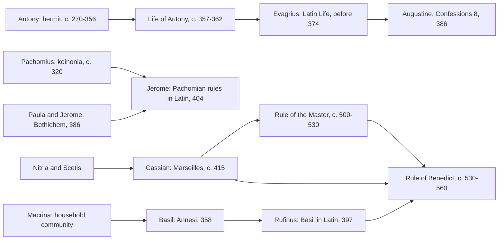

# Church History · Lesson 2.3: The desert and the monastery

> ⏱ ~15 min · Module 2: Councils, empire, and the desert · Builds on: [1.3 Persecution and martyrdom](01-03-persecution-and-martyrdom.md), [2.1 Nicaea and the imperial Church](02-01-nicaea-and-the-imperial-church.md) · Unlocks: [3.1 Gregory the Great and the conversion of the peoples](03-01-gregory-the-great-and-the-conversion-of-the-peoples.md), [4.1 The reform papacy and the investiture contest](04-01-the-reform-papacy-and-the-investiture-contest.md)

## Why this matters

In the same decades that the Church gained emperors, basilicas and bishops at court, thousands of Christians walked away from all of it into the Egyptian desert. Two centuries later their way of life had become an institution: walled houses under a written rule and an abbot. Those houses copied the books, trained Gregory the Great, sent the missionaries of [3.1](03-01-gregory-the-great-and-the-conversion-of-the-peoples.md), and produced Cluny ([4.1](04-01-the-reform-papacy-and-the-investiture-contest.md)). This lesson asks what monasticism was for, how it travelled from Egypt to Italy, and how it became a rule. Under all three runs a fourth question. Almost everything we know comes from texts written to make readers into monks, or to make monks into allies. So how much can we know?

## The idea

Think of three shapes a renouncing life can take.

- **The hermit** (*anchorite*, "one who withdraws"): alone, or nearly so, under no superior but God. Antony is the model.
- **The community** (*cenobite*, from *koinos bios*, "common life"): many monks under a rule and a superior, sharing work, meals and prayer. Pachomius is the model. See [cenobitic monasticism](../reference.md#cenobitic-monasticism).
- **The middle way:** loose settlements of cells around a senior monk, meeting at weekends. Nitria and Scetis, west of the Nile Delta, were like this. Cassian learned his monasticism there.

The movement's motive was the gospel's call to perfection, read literally. Its timing matters too. Once the persecutions ended ([1.3](01-03-persecution-and-martyrdom.md)), the martyr was no longer available as a model of total gift. The ascetic took the martyr's place. Athanasius says it outright: after the last persecution, Antony went back to his cell and was "daily a martyr to his conscience" (*Life of Antony* 47).

What turned a practice into an institution was a genre: the **written life** and the **written rule**. People who never met Antony read about him, and people who never saw Egypt lived by rules translated from it. The West received monasticism mostly through books. So what those books were for matters.

## Source

Athanasius, *Life of Antony* 69 (tr. H. Ellershaw, *Nicene and Post-Nicene Fathers*, 2nd series, vol. 4, 1892). The visit it describes is usually dated to 338:

> And once also the Arians having lyingly asserted that Antony's opinions were the same as theirs, he was displeased and angry against them. Then being summoned by the bishops and all the brethren, he descended from the mountain, and having entered Alexandria, he denounced the Arians, saying that their heresy was the last of all and a forerunner of Antichrist. And he taught the people that the Son of God was not a created being, neither had He come into being from non-existence, but that He was the Eternal Word and Wisdom of the Essence of the Father. And therefore it was impious to say, 'there was a time when He was not,' for the Word was always co-existent with the Father. Wherefore have no fellowship with the most impious Arians.

Read it as a historian would. Its author is the bishop of Alexandria, writing about 357–362 while the Arian crisis of [2.1](02-01-nicaea-and-the-imperial-church.md) was still raging. He addressed it to monks abroad. The desert hero speaks Nicene theology, comes down when the bishops call him, and tells the laity whom to shun. The passage also lets slip something Athanasius did not intend to prove: the other side claimed Antony too. By the 330s the old hermit's name was worth fighting over.

## The record

1. **Antony (c. 251–356).** As a young man of about eighteen to twenty, he heard Matthew 19:21, the call to sell everything and follow Christ, read in church. He gave away his land and apprenticed himself to an old ascetic in the next village (*Life* 2–3). Around 285 he shut himself in an abandoned fort at Pispir for about twenty years. When he came out, disciples settled around him, and cells spread across the mountains until, in the *Life*'s image, the desert was colonised by monks (*Life* 14). He died in 356 at about 105.
   *In words:* Antony wasn't the first ascetic. He was the first famous one to go into the deep desert.
2. **The [Life of Antony](../reference.md#life-of-antony) (c. 357–362).** Before 374 Evagrius of Antioch had translated it into Latin. In *Confessions* 8.6 Augustine reports a story told to him in 386: two imperial officials at Trier found the *Life* in a hermits' cottage, read it, and renounced their careers. Augustine's own conversion in the garden at Milan followed straight after he heard it (8.8–12).
   *In words:* one book carried the desert to the Rhine and to Milan within thirty years.
3. **Pachomius (c. 292–346 or 348).** He founded his first community at Tabennesi between about 318 and 323. His *koinonia* ("fellowship") joined houses under one head, with a written rule, obedience, set hours and manual work. The Catholic Encyclopedia counts nine houses for men and two for women by his death; some modern accounts count fewer. Jerome put the Pachomian rules into Latin in 404.
4. **Basil and Macrina.** In 358 Basil (c. 330–379) gathered disciples on the family estate at Annesi in Pontus. His question-and-answer *Asketikon* put community life under Scripture, and at Caesarea he later tied it to care for the poor and the sick. Rufinus's Latin version of 397 is the "Rule of our holy father Basil" that Benedict would cite. His sister Macrina (c. 327–379 or 380) had already turned the household into an ascetic community. We know her almost entirely from her brother Gregory of Nyssa's *Life of Macrina*. It says that Basil came home from his studies proud of his rhetoric and that Macrina turned him toward the ascetic "philosophy."
5. **Paula (347–404).** A Roman noblewoman and Jerome's patron, she settled at Bethlehem in 386. There she built a monastery for men, a community for women that she governed, and a hostel for pilgrims. Our account is Jerome's memorial letter to her daughter (Letter 108, 404). Like Macrina's, Paula's life reaches us through a male admirer with a purpose.
6. **Cassian (c. 360–c. 435).** He spent about fifteen years among the monks of Egypt. Around 415 he founded two monasteries at Marseilles, one for men and one for women. His *Institutes* (the outward order of the house) and *Conferences* (the inner life, told as dialogues with desert elders) date to the 420s. Written for Gallic bishops and monks, they gave the West Egypt in Latin. There was already Western monasticism (Martin at Ligugé, 361; Lérins, founded around 410); Cassian meant to correct it against the Egyptian standard.
7. **The Gallic sequel on grace.** The Pelagian controversy (411–418) had ended with Pelagius, a lay ascetic teacher, condemned by African councils and by Popes Innocent I (417) and Zosimus (418). Augustine's late writings on predestination then troubled the [Massilians](../reference.md#massilians), the monks of Marseilles and Lérins. Cassian's *Conference* 13 held that a good will sometimes begins from us and that grace then meets and strengthens it. Prosper of Aquitaine wrote to Augustine (428–429) and attacked Cassian about 432, without naming him. Vincent of Lérins's *Commonitorium* (434) is widely read as part of the same quarrel ([`fundamental-theology` 5.1](../../fundamental-theology/lessons/05-01-vincent-of-lerins.md)). The dispute ended at the [Council of Orange](../reference.md#council-of-orange-529) (3 July 529), a regional synod led by Caesarius of Arles, a former monk of Lérins. Pope Boniface II confirmed it in 530 or 531. The doctrine, and the weight Orange carries, belong to [`creation-grace-last-things`](../../creation-grace-last-things/syllabus.md) 3.2.
8. **Benedict (c. 480–c. 547) and the [Rule of Benedict](../reference.md#rule-of-benedict).** Our only account of his life is Book 2 of Gregory the Great's *Dialogues* (c. 593–594). He founded Monte Cassino, traditionally in 529. The Rule is dated anywhere from c. 530 to c. 560, and the date is disputed. Since Augustin Genestout's 1940 argument and Adalbert de Vogüé's editions, specialists hold that Benedict abridged and revised the anonymous, longer [Rule of the Master](../reference.md#rule-of-the-master) (c. 500–530). The Rule's own last chapter points readers to Cassian and Basil.

## Timeline: how the forms travelled West

Read the arrows as "was read by" or "fed into." Almost every arrow into the West is a translation. The Rule of Benedict sits at the end as a synthesis, not a first founding.

## Worked examples

**Example 1 (clean): "Antony was the first monk."** Test it against our main source. The *Life* doesn't make that claim. It says monasteries in Egypt were still few and that ascetics lived near their villages. It says Antony learned from an old man who had been a hermit since youth, and that he placed his sister with a community of virgins (*Life* 3). So the source itself supports a narrower claim: Antony was the first to go into the far desert and the first ascetic whose fame spread across the empire. Here the evidence and a popular claim can be separated cleanly, and our most partisan source is what corrects the myth.

**Example 2 (hard): which Antony?** The *Life* gives us an Antony who never learned his letters (*Life* 72) yet defeated philosophers. He "was not ashamed to bow his head to bishops and presbyters" (*Life* 67), and he shunned Arians and Meletians alike. Seven letters also survive under Antony's name. In *The Letters of St. Antony* (1990), Samuel Rubenson argues that they are genuine. If so, they show a teacher at home in Platonist ideas of self-knowledge and in the allegorical exegesis of the Origenist tradition, which is not the Life's unlettered peasant. David Brakke (*Athanasius and the Politics of Asceticism*, 1995) reads the *Life* as part of Athanasius's campaign to bind Egypt's monks to his episcopate against rival groups.

The evidence strains in two directions. If the letters are genuine, the *Life*'s portrait was shaped for a purpose. Even so, the letters are also a selection, and "unlettered" in Greek hagiography can mean "without rhetorical schooling" rather than illiterate. What the *Life* can still establish is plenty: that Antony existed and was famous, what ascetic practice was admired around 360, and how a bishop wanted monks to relate to bishops. Its limit is the private Antony. Peter Brown's "holy man" thesis runs into the same limit. In "The Rise and Function of the Holy Man in Late Antiquity" (*Journal of Roman Studies*, 1971) he read Syrian holy men as outsiders to village kinship who worked as patrons and arbiters. [The holy man](../reference.md#the-holy-man) had power because he stood outside society. Brown revisited and qualified the thesis in 1998, and his critics pressed the harder point: we meet these men only in hagiography, so the "function" we see may be the one their biographers wanted to show.

## Watch out

- **"Benedict founded Western monasticism."** Martin, Lérins, Cassian, Jerome's Bethlehem and many local rules all come earlier. Benedict's Rule became the Western norm only when Carolingian reformers imposed it at the Aachen synods of 816–817 ([3.3](03-03-popes-franks-and-emperors.md)). Before that, houses commonly followed "mixed rules."
- **"*Ora et labora*" is not in the Rule.** The balance of prayer, reading and work is there (chapter 48 calls idleness the enemy of the soul). The motto is a later summary.
- **"Semi-Pelagian" is a later label.** The ancient name for the Massilians' position was "remnants of the Pelagians." Calling Cassian a Pelagian in any form is a verdict, and Orange's canons name no one. Stating which level of authority Orange's canons carry belongs to the dogmatic course, not this one.
- **Women were not an afterthought.** Pachomius's federation included women's houses. Cassian founded one. Macrina's community came before Basil's. The evidentiary problem is the reverse: we see these women almost only through men who wrote about them.

## One-liner

> The desert became a city and the city got a rule, but nearly everything we know about the journey comes from books written to recruit.

## Problems

**P1 (🟢) *(Exegetical, close reading.)*** From the Rule of Benedict, chapter 73 (tr. Oswald Hunter Blair, 2nd ed., Fort Augustus, 1906):

> We have written this Rule, in order that, by observing it in Monasteries, we may shew ourselves to have some degree of goodness of life, and a beginning of holiness. But for him who would hasten to the perfection of religion, there are the teachings of the holy Fathers, the following whereof bringeth a man to the height of perfection. … Moreover, the Conferences of the Fathers, their Institutes and their Lives, and the Rule of our holy Father Basil — what are these but the instruments whereby well-living and obedient monks attain to virtue? … Whoever, therefore, thou art that hasteneth to thy heavenly country, fulfil by the help of Christ this least of Rules which we have written for beginners.

(a) Identify the works the passage recommends, name the author of each where the lesson allows, and say in what language and through whom Benedict could read Basil. (b) The passage never mentions the Rule of the Master. Say whether that silence counts against the view that Benedict drew on it, and why. Two sentences per part.

**P2 (🟡) *(Exegetical, diagnose.)*** An invented museum placard:

> "Around 529, St Benedict founded Western monasticism at Monte Cassino, writing an entirely original Rule that monasteries across Europe soon adopted. Before him, Christian monks had been solitary hermits in the Egyptian desert."

Identify four distinct claims in the placard that the historical record contradicts or needs qualified, and give the evidence against each. 150 words or fewer.

**P3 (🔴, optional) *(Evaluative, apply to a hard case.)*** Test the popular claim "Monasticism was a protest against the Church's alliance with the empire after Constantine." Weigh the evidence on each side and give a one-line verdict. 150 words or fewer.

Solutions

**P1** *(Exegetical.)*

**Must hit, strict (a):** the *Conferences* and *Institutes*, both by John Cassian; the *Lives* of the Fathers (the desert lives, of which Athanasius's *Life of Antony* in Latin is the best known); and the Rule of Basil. Benedict read Basil in **Latin**, in **Rufinus's** translation of Basil's *Asketikon* (397), not in Greek.
**Must hit, strict (b):** the silence does **not** count against dependence. Chapter 73 is a reading list for monks who want more than the Rule, not a list of the Rule's sources. The case for dependence rests on comparing the two texts (shared and abridged passages, argued by Genestout and de Vogüé), which a silence cannot answer.
**Wrong turns:** taking "Lives" to mean the lives of the monks now living in the house; saying Benedict read Basil in Greek; treating an author's failure to cite a source as proof he didn't use it.
**Model answer:** (a) It recommends Cassian's *Conferences* and *Institutes*, the Lives of the desert Fathers, such as the Latin *Life of Antony*, and the Rule of Basil. Benedict read Basil in Latin, through Rufinus's translation of 397. (b) The silence proves nothing either way, because the chapter recommends further reading for advanced monks and does not list the Rule's sources. The dependence is shown by comparing the texts, which Genestout and de Vogüé did.

---

**P2** *(Exegetical.)*

**Must hit, strict (any four, each with evidence):**
(i) **"Founded Western monasticism":** Martin at Ligugé (361), Lérins (around 410), Cassian's Marseilles houses (c. 415) and Jerome and Paula's Latin communities at Bethlehem (386) all come earlier.
(ii) **"Entirely original Rule":** Benedict abridged and revised the Rule of the Master, and chapter 73 itself points to Cassian and Basil.
(iii) **"Soon adopted across Europe":** mixed rules were normal for centuries, and the Rule became the norm only through the Carolingian reforms of 816–817.
(iv) **"Before him, solitary hermits":** Pachomius's cenobitic *koinonia* goes back to about 320, and Basil's communities to 358. Women's houses existed too.
(v) **Dates:** 529 is the traditional date for Monte Cassino. The Rule itself is dated anywhere from c. 530 to c. 560 and the date is disputed, so "around 529… writing" runs two uncertain dates together.
**Wrong turns:** counting the date of Monte Cassino as simply wrong (it is traditional, not refuted); calling Cassian's houses Benedictine; repeating one error under two labels.
**Model answer:** First, Western monasticism came before Benedict: Martin at Ligugé around 361, Lérins, and Cassian's Marseilles foundations around 415. Second, the Rule wasn't original. It abridges the anonymous Rule of the Master and itself recommends Cassian and Basil (chapter 73). Third, it wasn't "soon adopted." Houses followed mixed rules until the Carolingian synods of 816–817 imposed it. Fourth, monks before Benedict weren't only hermits: Pachomius organized communities from about 320, Basil from 358, and both included or inspired women's houses.

---

**P3** *(Evaluative.)*

**Must hit, any verdict:**
- **Evidence for the claim, stated at full strength:** the mass growth of the movement came after 313. The *Life* presents asceticism as the successor to martyrdom (ch. 47). Withdrawal from cities and from wealth implies a judgment on a comfortable, established Church.
- **Evidence against, stated at full strength:** Antony's withdrawal (c. 270) and the fort at Pispir (c. 285) come before Constantine. The *Life* has Antony defer to bishops (ch. 67) and fight for Nicaea (ch. 69). Basil became a bishop. Athanasius allied himself with the monks.
- **A distinction:** protest against the *world*, or against wealth and status, versus protest against the *Church or its bishops*. Any verdict must say which it means.
- **Source caution:** the pro-episcopal evidence comes from a bishop's text with a purpose. Say how that affects its weight.
**Wrong turns:** citing only the post-313 growth and ignoring the pre-Constantinian start; treating the *Life*'s deference scenes as neutral reporting; giving a verdict with no distinction between world and Church.
**Model answer, one of several:** For the claim: monasticism became a mass movement only after 313, and the *Life* casts the monk as the martyr's successor (ch. 47). That fits a reaction against a Church grown comfortable. Against it: Antony withdrew about 270, decades before Constantine. The *Life* shows him bowing to bishops and defending Nicaea, and Basil went from monk to bishop. The claim merges two targets. A protest against worldliness, including worldliness inside the Church, is well attested. A protest against the Church's alliance with the empire as such isn't, though the pro-bishop evidence comes largely from Athanasius, who had reasons to stress it. Verdict: true of worldliness, unproven as a protest against the imperial Church.

## Flashback

**From Lesson [2.1](02-01-nicaea-and-the-imperial-church.md) (Nicaea and the imperial Church):** *(Exegetical.)* (a) Put these six events in order and give each its year: Julian lets the exiled bishops go home; *Cunctos populos* is issued; the Council of Tyre deposes Athanasius; the twin councils of Ariminum and Seleucia accept a creed calling the Son "like the Father"; the Council of Constantinople meets; Liberius of Rome is exiled. (b) *Cunctos populos* identified the Catholic faith by pointing to two living bishops. Name them, and say in two sentences what that choice shows about the law.

Solution

**Must hit, strict (a):** Tyre deposes Athanasius (335) → Liberius exiled (355) → Ariminum and Seleucia (359) → Julian recalls the exiles (362) → *Cunctos populos* (27 February 380) → Council of Constantinople (May 381).
**Must hit, strict (b):** Damasus of Rome and Peter of Alexandria. The law defined orthodoxy as the faith Peter the apostle handed to the Romans, as those two sees now held it. That put the emperor behind the Nicene side, the side Constantius had driven into exile, and it made the line between Catholic and heretic a legal status that carried punishment.
**Wrong turns:** naming Athanasius, who had died in 373; putting Liberius's exile after 359 (it came four years before); making the Council of Constantinople the source of the law, when the law came first and was addressed to the people of Constantinople.
**Model answer:** (a) Tyre, 335; Liberius exiled, 355; Ariminum and Seleucia, 359; Julian's recall, 362; *Cunctos populos*, 380; Constantinople, 381. (b) Damasus of Rome and Peter of Alexandria. By naming them, the law tied orthodoxy to the Nicene faith of Rome and Alexandria, both sees whose bishops Constantius had exiled, and it turned dissent from that faith into a legal status, heresy, liable to imperial punishment.

## Connections

- **Backward:** [1.3](01-03-persecution-and-martyrdom.md) ended the age of the martyrs whose place the ascetic took. [2.1](02-01-nicaea-and-the-imperial-church.md) supplied the Arian crisis that Athanasius wrote the *Life* into. [1.4](01-04-constantine.md) is the imperial favour the desert is often read as fleeing.
- **Forward:** [3.1](03-01-gregory-the-great-and-the-conversion-of-the-peoples.md): Gregory, a monk-pope, wrote Benedict's only life and sent monks to England. [3.3](03-03-popes-franks-and-emperors.md): the Carolingians made the Rule the norm. [4.1](04-01-the-reform-papacy-and-the-investiture-contest.md): Cluny's monks drove papal reform. [5.2](05-02-friars-and-universities.md): the friars broke with monastic stability. [6.3](06-03-the-english-reformations.md): the dissolution undid a thousand years of houses.
- **Sideways:** [`fundamental-theology` 5.1](../../fundamental-theology/lessons/05-01-vincent-of-lerins.md) reads Vincent of Lérins's canon, written inside the Gallic dispute of item 7. [`patristics`](../../patristics/syllabus.md) 4.5 reads Augustine against Pelagius and the Gallic reaction as texts. [`creation-grace-last-things`](../../creation-grace-last-things/syllabus.md) 3.2 owns what Orange defined and at what weight.
