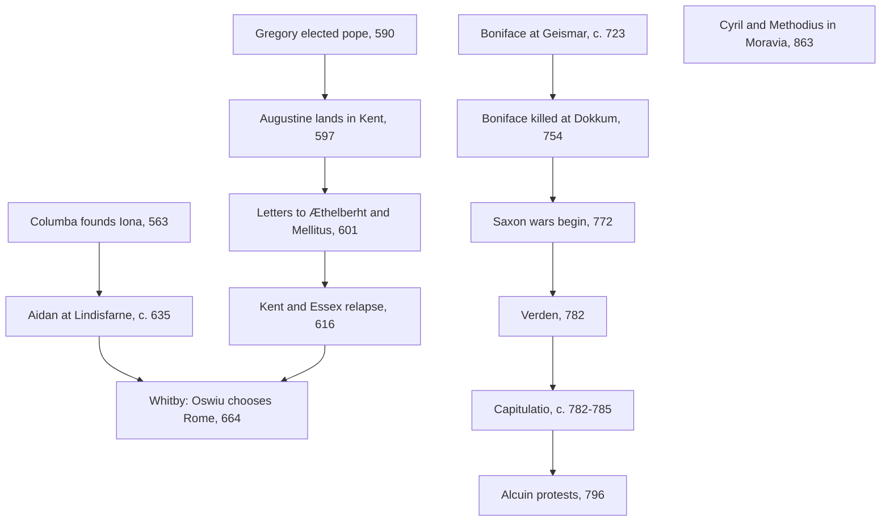

# Church History · Lesson 3.1: Gregory the Great and the conversion of the peoples

> ⏱ ~15 min · Module 3: The early medieval Church · Builds on: [2.2 Ephesus, Chalcedon, and Leo's Rome](02-02-ephesus-chalcedon-and-leos-rome.md), [2.3 The desert and the monastery](02-03-the-desert-and-the-monastery.md) · Unlocks: [3.2 The rise of Islam and the Christian Mediterranean](03-02-the-rise-of-islam-and-the-christian-mediterranean.md), [3.3 Popes, Franks, and emperors](03-03-popes-franks-and-emperors.md)

## Why this matters

In 590 Christianity in the West was a religion of old Roman cities and some of the barbarian kingdoms that had taken them over. By 1000 it was the religion of the English, the Frisians, the Saxons, the Moravians and the Rus', with Scandinavia and Poland under way. How it happened, whether by preaching, by royal decision or by the sword, is still argued. So is a harder question: what did it mean to say a people had "become Christian"? The answer changes how you read everything in the rest of the course, from parish religion on the eve of the Reformation to the missions in the Americas ([7.1](07-01-conquest-and-conscience-in-the-americas.md)).

## The idea

Separate two things the word "conversion" runs together, [conversion and Christianization](../reference.md#conversion-and-christianization).

- **Conversion**, in the narrow sense: a ruler and his people accept baptism, the Church's law and its clergy. This can happen in a year. It is an event, and chronicles record it.
- **Christianization**: belief, prayer, burial, marriage, the calendar and the imagination of ordinary people become Christian. This takes generations, and nobody records it as it happens. Historians reconstruct it from law codes, penitentials, charms, graves and complaints.

Almost every early medieval conversion went top-down. Missionaries went to courts. Kings were baptised first, often with a Christian wife, a Christian ally or a Christian overlord in the picture, and their people followed. Richard Fletcher's survey, *The Conversion of Europe* (1997), makes that the typical pattern across a thousand years, and stresses how slowly the idea of a deliberate mission to the heathen developed at all. Christianization is where the debate lives. Did the countryside stay half-pagan under a Christian veneer for centuries? Or did people make a Christianity of their own that the clergy could live with? Karen Jolly's study of Anglo-Saxon charms (*Popular Religion in Late Saxon England*, 1996) takes the second view. Practices once read as pagan survivals are, she argues, a Christian popular religion, a middle ground between liturgy and folk medicine. Peter Brown's *The Rise of Western Christendom* (1996) gives the whole period a similar shape: many local "micro-Christendoms", each building its own small copy of the wider Church.

## Source

Gregory I (pope 590–604) was a Roman aristocrat who had been prefect of the city, then a monk in his own family house on the Caelian, then papal envoy at Constantinople ([2.3](02-03-the-desert-and-the-monastery.md) showed where monks like him came from). In 596 he sent Augustine, prior of that monastery, with a party of monks, nearly forty men by Bede's count, to the English. In 601 he sent reinforcements, and after them this letter to their leader, the abbot Mellitus, preserved by Bede (*Ecclesiastical History* I.30, trans. A. M. Sellar, 1907):

> the temples of the idols in that nation ought not to be destroyed; but let the idols that are in them be destroyed; let water be consecrated and sprinkled in the said temples, let altars be erected, and relics placed there. … that the nation, seeing that their temples are not destroyed, may remove error from their hearts, and knowing and adoring the true God, may the more freely resort to the places to which they have been accustomed. … to the end that, whilst some outward gratifications are retained, they may the more easily consent to the inward joys. For there is no doubt that it is impossible to cut off every thing at once from their rude natures; because he who endeavours to ascend to the highest place rises by degrees or steps, and not by leaps.

Read it closely. The idols are still to be destroyed; what survives is the *building* and the *feast*. Gregory allows cattle to be killed and eaten at the saints' festivals, but no longer as sacrifices. The reason he gives is teaching by stages ("by degrees or steps"), not respect for the old religion. Now the problem the letter creates. In June 601 Gregory had written to King Æthelberht of Kent urging him to "overthrow the structures of the temples" (Bede I.32). The letter to Mellitus is dated a month later in the corrected manuscript tradition (18 July; Sellar's note, following Plummer). Either Gregory changed his mind, or he told a king to lead from the front and his missionaries to go gently.

## What happened

1. **Kent, 597.** Augustine landed on Thanet. Æthelberht already had a Frankish Christian queen, Bertha, with her own bishop and chapel. He received the monks, was baptised (the year is not certain), and gave them a base at Canterbury. Gregory told Eulogius of Alexandria that more than ten thousand English were *reported* baptised at Christmas 597 (Register VIII.29; VIII.30 in the Schaff translation).
2. **Relapse, 616.** When Æthelberht died, his son Eadbald refused baptism, and Bede says those who had accepted the faith "either for favour or fear of the king" went back (II.5). The East Saxons did the same, and Mellitus, now bishop of London, was driven out. Eadbald was converted within a few years. Kent recovered; London did not for decades.
3. **The Irish.** A second Christianity was already at work, monastic rather than episcopal. Columba founded Iona in 563. Columbanus left Ireland around 590 and founded monasteries in Gaul and at Bobbio in Italy. From Iona, Aidan founded Lindisfarne around 635 and converted much of Northumbria.
4. **[Whitby, 664.](../reference.md#synod-of-whitby)** Roman and Irish Christians in Northumbria kept Easter on different dates. King Oswiu called a synod; Wilfrid argued for Rome, Colman for Iona. Bede has the king decide for Peter, since Peter held the keys of heaven and Columba did not (III.25). A king settled a Church question, and the Roman see was not in the room. What the appeal to Peter shows about primacy is for [3.3](03-03-popes-franks-and-emperors.md).
5. **Boniface.** The West Saxon monk Wynfrith took the name Boniface when Pope Gregory II commissioned him in 719. Around 723 he felled an oak sacred to Donar at Geismar in Hesse, a scene we know from Willibald's *Life*, written c. 768. He organized a German Church loyal to Rome and was killed by Frisians at Dokkum on 5 June 754. In a letter to Daniel of Winchester he admitted that without the Frankish ruler's protection he could neither govern his Church nor stop pagan rites.
6. **Saxony, 772–804.** Charlemagne's war against the Saxons became a war of conversion (Example 2 below).
7. **Moravia, 863.** Prince Rastislav asked Constantinople for teachers who could preach in the Slavs' own tongue. Constantine (who took the name Cyril as a monk shortly before his death in 869) and Methodius came with an alphabet and a [Slavonic liturgy](../reference.md#slavonic-liturgy). Pope Hadrian II approved it; Methodius defended it again before John VIII in 880. Frankish clergy fought it, and after Methodius died in 885 his disciples were expelled from Moravia and carried the Slavonic liturgy to Bulgaria.

## Timeline

Four streams: Roman, Irish, Frankish, Byzantine. Only in the Frankish one does conquest do the work.

## Worked examples

**Example 1 (clean: Kent as the top-down model).** The king comes first, and he is already tied to Christian Francia by marriage. The mission is aimed at the court. The one mass baptism on record is a number passed along second-hand: Gregory is telling a fellow patriarch good news, and he says "reported". The weakness of the model shows in 616. Where people had followed the king "for favour or fear", a new king without the faith could undo it in a season. The conversion of Kent was an event that took place between 597 and about 601. Its Christianization took generations more. Nothing here was forced by law. The pressure is political: a king's favour.

**Example 2 (hard: the Saxons).** Now try the same distinction where the evidence strains it. Charlemagne fought the Saxons from 772 to 804. The Royal Frankish Annals say that after a Saxon rising destroyed a Frankish army in 782, he had 4,500 Saxons put to death at Verden on the Aller in a single day: the [massacre of Verden](../reference.md#massacre-of-verden). The number is disputed. An old emendation that turned "beheaded" into "relocated" is now generally rejected. Some historians, Matthias Becher among them, think a much smaller number of executions came with mass deportations. Others accept the annalist's figure. The [Capitulatio de partibus Saxoniae](../reference.md#capitulatio-de-partibus-saxoniae), usually dated 782 or 785 (Yitzhak Hen has argued for c. 795, which few accept), made it a capital crime to hide unbaptised, to burn the dead, to eat meat in Lent out of contempt, or to be disloyal to the king. It fined parents who put off their infants' baptism and imposed the tithe. The Saxon leader Widukind accepted baptism in 785. The criticism came from inside the court. In letters of about 796 Charlemagne's leading scholar, Alcuin, argued that faith is an act of the will and cannot be compelled, that preaching must come before baptism, and that it was the tithe that had destroyed the Saxons' faith. He urged a different method on the newly conquered Avars.

So what did "conversion" mean in Saxony? The narrow sense clearly happened: baptism, churches, tithes, counts, all enforced by law. It is the clearest case in the period of forced conversion. The long run is what strains the model. Within two generations Saxony had the monastery of Corvey (822) and the *Heliand* (c. 830), a Gospel epic in Old Saxon, and a century later Saxon kings led Latin Christendom (Otto I, [3.3](03-03-popes-franks-and-emperors.md)). One reading: coercion worked, and the lesson is grim. Another: what worked was the later Christianization, carried out by monks, parishes and a vernacular Gospel, *despite* a conversion that Alcuin already thought had failed. The evidence cannot separate these cleanly, since there is no Saxony that went unconquered to compare it with. That is the crux.

Only after the facts, the Church's later judgment. The Second Vatican Council's declaration *Dignitatis Humanae* (1965) teaches that the response of faith must be free and that no one may be forced to embrace the faith (§10). It concedes that the Church's people have at times acted in ways hardly in accord with the Gospel, or opposed to it (§12). For how much weight a conciliar declaration carries, see [`fundamental-theology` 4.5](../../fundamental-theology/lessons/04-05-reading-a-documents-weight.md). The principle was not new in 1965: Gregory himself, in 591, told the bishops of Arles and Marseilles that Jews baptised by force rather than preaching fall back and end worse (Register I.47). The same Gregory told a Sardinian bishop to weigh down peasants who stayed pagan with heavier payments (IV.26), and to punish idol-worshipping slaves with beatings (IX.65). Hold both.

## Watch out

- **Top-down is not the same as forced.** Kent and Moravia were royal decisions with political motives, but no law threatened death for refusing baptism. Saxony is the exception that the popular picture turns into the rule.
- **The letter to Mellitus is not religious tolerance.** It keeps the idols' destruction. What it adapts is place and custom, as a teaching strategy. Reading modern "inculturation" or pluralism into it is anachronism.
- **Beware survivals.** A folk practice under a Christian name is not automatically a pagan relic. Jolly's point is that it may be how a Christian people prayed. Whether a practice is a "survival" is a conclusion to argue for, not a starting point.
- **Hagiography is a source with a purpose.** The Geismar oak comes from Willibald's *Life*, written about forty-five years later to honour a martyr. It is better evidence of what his circle wanted remembered than of the day itself.

## One-liner

> Kings could convert a people in a year; Christianizing it took centuries, and the Saxons, baptised by law under Charlemagne, are the case that makes you choose which one "conversion" means.

## Problems

**P1 (🟢) *(Exegetical.)*** From the *Capitulatio de partibus Saxoniae* (trans. D. C. Munro, *Translations and Reprints* VI.5, 1900):

> 8. If any one of the race of the Saxons hereafter concealed among them shall have wished to hide himself unbaptized, and shall have scorned to come to baptism and shall have wished to remain a pagan, let him be punished by death. …
> 14. If, indeed, for these mortal crimes secretly committed any one shall have fled of his own accord to a priest, and after confession shall have wished to do penance, let him be freed by the testimony of the priest from death.

Chapters 3–13, of which chapter 8 is one, each set the death penalty for an offence.

(a) List the elements that must all be present for a Saxon to fall under chapter 8. (b) Does chapter 14's escape clause reach an offence under chapter 8? Say which words decide it, what the offender must do, and whose word saves him. (c) Chapter 19 of the same law punishes parents who put off an infant's baptism beyond a year, without a priest's leave, with a fine graded by rank. What does the contrast with chapter 8 suggest the capital penalty was aimed at? Two sentences per part.

**P2 (🟡) *(Exegetical.)*** An invented museum placard:

> "THE SWORD AND THE CROSS. Europe did not choose Christianity; it was conquered for it. From the Saxon forests to the Slavic east, missionaries followed the armies, and baptism was the price of peace. The famous 'gentle' missions were the exception that proved the rule."

(a) Name the generalization and the conflation of concepts doing the work. (b) Give two cases from the lesson that the placard cannot fit, and say what it gets right. 150 words or fewer.

**P3 (🔴, optional) *(Evaluative.)*** Evaluate the claim "Gregory the Great's missionary policy was persuasion, not force", using his letters to Mellitus and to Æthelberht (601), to the bishops of Arles and Marseilles (I.47), and to Januarius of Cagliari (IV.26, IX.65), as the lesson describes them. Any verdict. 150 words or fewer.

Solutions

**P1** *(Exegetical.)*

**Must hit, strict (a):** four elements: the person is a Saxon ("of the race of the Saxons"); he is hidden among his people ("concealed among them … hide himself"); he is unbaptised; and he refuses on purpose ("scorned to come to baptism", "wished to remain a pagan"). Being unbaptised is not enough without the concealment and the will to stay pagan.
**Must hit, strict (b):** yes, on the text's own words. "These mortal crimes" refers back to the capital offences just listed, which include chapter 8, and an offence of concealment is by nature "secretly committed". The offender must go to a priest "of his own accord", confess, and be willing to do penance. The priest's "testimony" frees him from death.
**Must hit, strict (c):** delay in baptising an infant, even deliberate delay, costs a fine graded by rank, and a priest can excuse it; only an adult's hidden, wilful refusal is capital. The contrast suggests chapter 8 targets defiance, the choice to stay outside the conquerors' Church and order, rather than the bare fact of being unbaptised.
**Wrong turns:** saying chapter 8 punishes any unbaptised Saxon; reading chapter 14 as an amnesty for crimes committed openly (it covers only those "secretly committed" and confessed voluntarily); missing that a priest, not a judge, is the gatekeeper.
**Model answer:** (a) The person must be a Saxon, hiding among his people, unbaptised, and refusing baptism on purpose: he "scorned" it and "wished to remain a pagan." Lacking baptism is not enough on its own. (b) Yes. "These mortal crimes secretly committed" takes in the capital offences before it, chapter 8 included, and concealment is secret by definition. If he goes to a priest of his own accord, confesses and accepts penance, the priest's testimony saves him from death. (c) An infant's delayed baptism costs a graded fine that a priest can waive, while only an adult's hidden, wilful refusal carries death. So the capital law aims at defiance of the new order, not at being unbaptised as such.

---

**P2** *(Exegetical.)*

**Must hit, strict (a):** the generalization is from Saxony, a real case of conquest plus legally enforced baptism, to the whole conversion of Europe. The conflation is between *top-down* conversion, where kings decide under political pressure, and *forced* conversion, where baptism is compelled by law or arms.
**Must hit, strict (b):** two counter-cases, for example: Kent (597), where a king who already had a Christian queen received unarmed monks, and no one was conquered; Moravia (863), where a Slavic prince *asked* Constantinople for missionaries and got a liturgy in his people's language, which directly contradicts "the Slavic east"; Whitby, where Christians chose between two Christian usages; the Irish monasteries. What it gets right: Saxony was conquered and baptised under pain of death, with Verden and the *Capitulatio*; Boniface admitted he depended on Frankish power; and even royal conversions carried pressure (Bede's "favour or fear").
**Wrong turns:** denying that force was used anywhere; counting Boniface as a purely peaceful counter-example (he worked under Frankish protection); treating the letter to Mellitus as evidence of tolerance.
**Model answer:** The placard generalizes from Saxony, where conquest and a law punishing refusal of baptism with death really did make Christians, to all of Europe, and it runs together top-down conversion (kings choosing, under political pressure) with forced conversion. Kent does not fit: Æthelberht, already married to a Christian, received unarmed monks, and no army came. Neither does Moravia, the placard's own "Slavic east": Rastislav asked Constantinople for teachers and got a Slavonic liturgy. What is true is that Saxony's conversion was compelled, that Boniface relied on Frankish power, and that even royal conversions drew followers by "favour or fear."

---

**P3** *(Evaluative.)*

**Must hit, any verdict:** (1) Separate *what* is compelled: baptism itself (which Gregory rejects in I.47) versus pressure on those who stay pagan, through fines and punishments (IV.26, IX.65). (2) Separate *who* and *where*: a missionary among an independent people (Mellitus), a Christian king (Æthelberht), and a bishop managing Church estates and slaves in imperial Sardinia (Januarius). (3) Notice that the letter to Mellitus justifies its gentleness as teaching by stages, not as a right to refuse, and still has the idols destroyed. (4) Deal with the two 601 letters, a month apart: a change of mind, or a split between what a king should do and what missionaries should do.
**Wrong turns:** reading Mellitus as religious tolerance; treating I.47 as covering pagans (it concerns Jews baptised by force); judging Gregory by *Dignitatis Humanae* without first reconstructing his own distinction; ignoring IV.26, where the aim of the fiscal pressure is conversion.
**Model answer (one of several):** Mostly false as stated, though it has a true core. Gregory consistently rejects *forced baptism*: I.47 says converts made by compulsion relapse. His English letters prefer persuasion by stages. But the reason is pedagogical, and the idols are still destroyed. Where he had power, on Church estates in Sardinia, he used heavier payments to push peasants into conversion and punishment against slaves who worshipped idols. The June letter to Æthelberht asks a king to tear down temples. A fairer statement: Gregory would not compel the sacrament, but he readily used pressure to bring people to it, and he gauged the pressure to how much power he had. A defender of the claim would reply that none of this is the death penalty for refusing baptism, and that on that line Gregory and Charlemagne differ in kind.

## Flashback

**From Lesson [2.3](02-03-the-desert-and-the-monastery.md) (The desert and the monastery):** *(Exegetical.)* Athanasius, bishop of Alexandria, wrote the *Life of Antony* about 357–362, for monks abroad, in the middle of his fight with the Arians. Classify each claim below as **A**, something the *Life* can establish well, or **B**, Athanasius's portrayal, which the *Life* alone cannot establish. Give a one-sentence reason for each. (i) Antony never learned to read. (ii) Antony bowed his head to bishops and presbyters. (iii) Before going to the desert, Antony learned from an old ascetic in the next village and placed his sister with a community of virgins. (iv) By about 360, ascetic withdrawal was admired as a kind of daily martyrdom.

Solution

**Must hit, strict:** (i) **B.** An unlettered saint who defeats philosophers serves the portrait. Seven letters under Antony's name, which Rubenson argues are genuine, show a teacher at home in Platonist and Origenist ideas, and in hagiography "unlettered" can mean without rhetorical schooling. (ii) **B.** It is exactly what a bishop wanted monks to do; Brakke reads the *Life* as part of Athanasius's campaign to bind the monks to his episcopate. (iii) **A.** These details cut against a hagiographer's interest in making his hero the first monk, and Athanasius gains nothing by inventing them. (iv) **A.** A text written to recruit monks is good evidence of the ideals its readers admired around 360, whatever it shows about Antony himself.
**Wrong turns:** classifying everything in a partisan source as B (the *Life* is strong evidence for its own time and for details against its author's interest); taking (i) at face value because the *Life* states it plainly; treating (iv) as a claim about Antony's private motives rather than about what readers admired.
**Model answer:** (i) B: the unlettered sage suits Athanasius's portrait, and the letters Rubenson defends point to a learned Antony. (ii) B: deference to bishops is what the bishop-author needed, so the *Life* cannot confirm it alone. (iii) A: the details make Antony a pupil rather than a pioneer, against the author's interest, so they are likely to be true. (iv) A: whatever the *Life* says about Antony, it shows what a bishop expected monks of about 360 to admire.

## Connections

- **Backward:** Gregory is the monk-bishop that [2.3](02-03-the-desert-and-the-monastery.md) produced, and Augustine's forty were monks of Gregory's own house. Gregory ran Rome's estates and grain supply much as Leo I had defended the city ([2.2](02-02-ephesus-chalcedon-and-leos-rome.md)). The idea that a ruler's conversion brings his people traces back to Constantine ([1.4](01-04-constantine.md)), and Gregory invokes him in the letter to Æthelberht.
- **Forward:** [3.2](03-02-the-rise-of-islam-and-the-christian-mediterranean.md) is the other side of the ledger: while the Church gained the north, it lost half the Mediterranean. [3.3](03-03-popes-franks-and-emperors.md) takes the Frankish alliance that sustained Boniface and conquered Saxony up to the imperial coronation of 800. Forced baptism returns with the Jews of 1096 ([4.3](04-03-the-crusades.md)) and the Americas ([7.1](07-01-conquest-and-conscience-in-the-americas.md)). The accommodation argument returns in the Chinese rites controversy ([7.2](07-02-accommodation-in-asia.md)).
- **Sideways:** Gregory as pastor, exegete and author of the *Pastoral Rule* belongs to [`patristics`](../../patristics/syllabus.md) (its 5.3). The claim that the act of faith is free, which Alcuin argued and *Dignitatis Humanae* teaches, is analysed in [`fundamental-theology` 2.1](../../fundamental-theology/lessons/02-01-the-act-of-faith.md). Baptism's theology and the catechumenate that Alcuin wanted before baptism are in [`sacraments-and-liturgy`](../../sacraments-and-liturgy/syllabus.md) (its 2.1).
