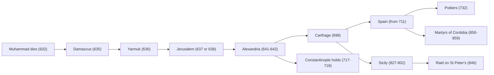

# Church History · Lesson 3.2: The rise of Islam and the Christian Mediterranean

> ⏱ ~15 min · Module 3: The early medieval Church · Builds on: [2.2 Ephesus, Chalcedon, and Leo's Rome](02-02-ephesus-chalcedon-and-leos-rome.md), [3.1 Gregory the Great and the conversion of the peoples](03-01-gregory-the-great-and-the-conversion-of-the-peoples.md) · Unlocks: [3.3 Popes, Franks, and emperors](03-03-popes-franks-and-emperors.md), [4.3 The crusades](04-03-the-crusades.md)

## Why this matters

In 632 every patriarchate of the Church lay inside the Roman Empire, and Christians were the majority from the Euphrates to the Atlantic. By 711 three of the five patriarchal sees, Alexandria, Antioch and Jerusalem, were ruled by a Muslim caliph, and so was the whole southern shore of the Mediterranean. Few events after Constantine changed the Church's map more. It left Rome and Constantinople as the only patriarchates under Christian rulers, it put millions of Christians under a new kind of government for centuries, and it sets up two later arguments of this course: why the papacy turned north to the Franks ([3.3](03-03-popes-franks-and-emperors.md)), and what the crusaders thought they were recovering ([4.3](04-03-the-crusades.md)).

## The idea

Keep two processes apart: **conquest** and **conversion**. The conquest was fast. In about eighty years, Arab armies took Syria, Egypt, North Africa, Persia and most of Spain. Conversion was slow, measured in centuries. For generations after the conquest the conquerors were a ruling minority, living off taxes paid by a Christian, Jewish and Zoroastrian majority.

That arrangement had a legal form. Christians and Jews became [***dhimmi***](../reference.md#dhimmi), protected peoples (*ahl al-dhimma*): their lives, property and existing churches were guaranteed, and in return they paid a poll tax, the [***jizya***](../reference.md#jizya), and accepted a subordinate status. Think of it as a contract between unequal parties: the protection was real, and so was the inequality, and the terms could be tightened when a ruler chose. Islam as a religion is not this course's subject: it belongs to [`apologetics-foundations`](../../apologetics-foundations/syllabus.md) 7.1. This lesson asks what the conquests did to the Church.

The conquest also landed on a divided Church. After Chalcedon ([2.2](02-02-ephesus-chalcedon-and-leos-rome.md)), most Christians of Egypt and many in Syria rejected the council and had been pressured by the emperors to accept it. For them a change of master was not simply a loss.

## Source

Al-Baladhuri, *The Origins of the Islamic State*, trans. P. K. Hitti (1916), on the surrender of Damascus (635). The bishop of the city asks the Arab general Khalid ibn al-Walid for terms, and Khalid writes:

> "In the name of Allah, the compassionate, the merciful. This is what Khalid would grant to the inhabitants of Damascus, if he enters therein: he promises to give them security for their lives, property and churches. Their city-wall shall not be demolished; neither shall any Moslem be quartered in their houses. Thereunto we give to them the pact of Allah and the protection of his Prophet, the caliphs and the 'Believers'. So long as they pay the poll-tax, nothing but good shall befall them."

Read it as a historian. The guarantee covers *existing* churches and says nothing about building new ones. Everything hangs on one condition, the poll tax. And the text reaches us through a Muslim scholar who died around 892, writing some 250 years later at the court of the caliph al-Mutawakkil. Baladhuri himself reports that the document was first undated and later rewritten at the bishop's request. So it is good evidence for the *form* surrender terms took in Muslim memory. Whether these are Khalid's exact words is a separate question.

## What happened

1. **The conquest of the East (634-642).** Damascus fell in 635. The Byzantine field army was destroyed at the Yarmuk in 636. Jerusalem surrendered to the caliph Umar after a siege; the sources give dates from 636 to 638, and most modern histories prefer 637 or 638. Its patriarch, Sophronius, negotiated the terms. Antioch fell in the same years. Alexandria capitulated by treaty in 641, and the Byzantine garrison left in 642. Persia fell over the same decade, bringing the Church of the East under Muslim rule too. *In words:* within ten years of Muhammad's death, three patriarchal sees had changed masters.
2. **The West (647-711).** North Africa, Augustine's Church, took two generations. Carthage fell for good in 698. In 711 an army crossed into Spain and destroyed the Visigothic kingdom within a few years. The advance into Gaul was checked near Poitiers in 732, and an Arab siege of Constantinople failed in 717-718. From 827 Arab forces conquered Sicily, which was complete with the fall of Taormina in 902, and in 846 raiders sacked St Peter's outside the walls of Rome. Leo IV then walled the Vatican hill (the Leonine Wall).
3. **Dhimmi status and its later codification.** The [***Pact of Umar***](../reference.md#pact-of-umar) is the classic statement of dhimmi obligations. It lists no new churches, no public crosses, restrained bells, distinctive dress, and no hindering of conversion to Islam. Muslim tradition attributes it to Umar I (634-644). Most modern scholars doubt that attribution: the earliest surviving texts are much later (Mark Cohen found none earlier than the tenth or eleventh century), and several historians think the rules grew up piecemeal. *In words:* treat it as evidence for what jurists later thought dhimmi status should be, not as a record of 638.
4. **Christians in the caliph's service.** Under the Umayyads (661-750), Christians ran much of the administration they had run for Byzantium. Sarjun ibn Mansur, father of **John of Damascus** (c. 675-c. 749), headed Syria's fiscal administration until the caliph Abd al-Malik dismissed him around 700 as he moved the administration into Arabic. John probably held a similar post before becoming a monk at Mar Saba, near Jerusalem. From there he wrote the defence of icons that the iconoclast emperors could not suppress, because he lived outside their empire. His *On Heresies* ends with a chapter (numbered 100 or 101 depending on the edition) on the "heresy of the Ishmaelites". It is among the earliest Christian treatments of Islam and reads it as a Christian heresy, not a new religion. *In words:* the best Greek theologian of the age was a subject of the caliph, and his family had once served the caliph's treasury.
5. **Pressure, uneven and later.** Conditions varied by ruler. The Abbasid caliph al-Mutawakkil decreed distinctive dress for Christians and Jews in 850 and later ordered new places of worship destroyed. In Córdoba, the emir Muhammad I removed Christians from palace posts after 852.
6. **Slow conversion.** Richard Bulliet (*Conversion to Islam in the Medieval Period*, 1979) counted Muslim names in biographical dictionaries to draw a [***conversion curve***](../reference.md#conversion-curve). On his estimates, Iran became majority Muslim in the ninth century and Egypt, Syria and Iraq around the tenth. Critics note that the dictionaries record urban, educated men, and scholarship has pushed the dates later. Some historians of Egypt place the decisive shift there as late as the fourteenth century. *In words:* the Christian Middle East did not end with the conquest. It shrank over three to seven centuries, and its Coptic, Syriac and other churches survive today.

## Timeline

Read the branches: the westward run along the African coast, the failed thrust at Constantinople that kept a Christian empire in the East, and the ninth-century pressure on Italy that reached Rome itself.

## The Pirenne question

The Belgian historian Henri Pirenne asked what the conquests did to the *West*. His *Mohammed and Charlemagne* (published posthumously in 1937) argued:

1. **The Germanic kingdoms did not end the Roman Mediterranean.** Merovingian Gaul still traded across the sea, minted gold, and wrote on Egyptian papyrus, and eastern merchants still came to its ports. *In words:* the "fall of Rome" in 476 was not the break.
2. **The Arab conquests broke that unity.** In the seventh and eighth centuries papyrus, spices and eastern merchants vanish from Gaul, and gold coinage gives way to silver. *In words:* a hostile southern shore closed the sea.
3. **Cut off, the West turned north and inland.** The Frankish centre moved to the Rhine and a land-based, agrarian economy. *In words:* this made Charlemagne's Europe. His famous slogan, paraphrased: without Muhammad there would have been no Charlemagne.

The [***Pirenne thesis***](../reference.md#pirenne-thesis) has had two main kinds of critic. Richard Hodges and David Whitehouse (*Mohammed, Charlemagne and the Origins of Europe*, 1983) used excavation evidence to argue that the western Mediterranean economy had already decayed badly in the sixth century, before any Arab arrived. That attacks claim 1. Michael McCormick (*Origins of the European Economy*, 2001) assembled the scattered records of travellers, coins and goods. He argued that contact thinned but did not end, and that from the late eighth century trade revived, with European slaves sold into the Islamic world among its main exports. That attacks the "closed sea" in claim 2. Whether anything of the thesis survives is left to the boss problem; notice here that each critique targets a different numbered claim.

## Worked examples

**Example 1 (clean): Egypt changes masters.** Apply the conquest/conversion split. Before 641, Egypt's majority rejected Chalcedon, and the imperial patriarch Cyrus had tried to enforce it; the non-Chalcedonian (Coptic) patriarch Benjamin spent years in hiding. After the treaty, the conqueror Amr ibn al-As issued Benjamin a safe conduct, and he returned to Alexandria around 643-644 and rebuilt his church. The conquest *reversed* the internal balance of Egyptian Christianity: the Chalcedonian church lost imperial backing and the Coptic church gained a toleration Constantinople had denied it. None of this was conversion. Egypt stayed overwhelmingly Christian for generations, now as a taxed dhimmi population. The later Syriac Orthodox patriarch Michael the Syrian (twelfth century) could even describe the conquest as God delivering his people from Roman cruelty. That is a late, partisan voice, but it shows the memory existed. The clean verdict: for the Copts, the conquest meant a change of overlord and a sharp change in which Christians were favoured, not a change of religion.

**Example 2 (hard): the [martyrs of Córdoba](../reference.md#martyrs-of-cordoba) (850-859).** Forty-eight Christians were executed in Córdoba in a decade. Tradition calls it persecution, and on one level it was: the law made blasphemy against the Prophet and apostasy from Islam capital crimes. But look at the charges. Most of the executed had gone before a judge and publicly denounced Muhammad. Others were children of mixed marriages, legally Muslim, who professed Christianity, which the law counted as apostasy. The Christian community itself divided. A council of bishops, convened at the emir's order in 852, discouraged Christians from seeking martyrdom, and the priest Eulogius, the martyrs' champion and chronicler, denounced the bishops for yielding. His ally Paul Albar lamented that young Christians wrote polished Arabic and could hardly compose a Latin letter.

So what were the martyrs protesting? Jessica Coope reads their acts as protest against assimilation into Arabic culture. Kenneth Wolf stresses a penitential ideal of martyrdom and separates the martyrs' motives from Eulogius's purposes in writing them up. Either reading makes Córdoba evidence of a Christian community *under threat of disappearing by accommodation*, not by force. And nearly all we know comes from Eulogius and Albar, the martyrs' partisans. The evidence strains because the only witnesses wrote to prove a case.

## Watch out

- **"Conquered" is not "converted."** Dates of conquest (630s-710s) and dates of Muslim majorities (ninth century at the earliest, often much later) differ by centuries. An answer that merges them misdates the end of Christian Syria and Egypt by centuries.
- **Don't read the Pact of Umar as a document of 638.** It is a later codification under Umar's name. Use it for what dhimmi status became in legal theory, and use the surrender treaties and chronicles for the early practice.
- **"Welcomed the Arabs" and "persecuted by the Arabs" are both too simple.** Some non-Chalcedonian Christians preferred the new rulers to Constantinople, and later writers remembered it that way. But the evidence is late and partisan, and dhimmi status was subordination, whatever it protected.

## One-liner

> The Arabs conquered half of Christendom in eighty years, but conversion took centuries: the Eastern churches lived on as taxed, protected minorities, and what the conquest did to the West is still Pirenne's argument.

## Problems

**P1 (🟢) *(Exegetical.)*** Al-Baladhuri, *The Origins of the Islamic State* (trans. Hitti, 1916), on the eve of the Yarmuk (636). Hims is a Syrian city that had surrendered; *kharaj* here means the tribute; the *'amil* is the Muslim governor.

> "…the Moslems refunded to the inhabitants of Hims the kharaj they had taken from them saying, 'We are too busy to support and protect you. Take care of yourselves.' But the people of Hims replied, 'We like your rule and justice far better than the state of oppression and tyranny in which we were. The army of Heraclius we shall indeed, with your 'amil's help, repulse from the city.' … The inhabitants of the other cities—Christian and Jew—that had capitulated to the Moslems, did the same, saying, 'If Heraclius and his followers win over the Moslems we would return to our previous condition, otherwise we shall retain our present state so long as numbers are with the Moslems.' When … the Moslems won, they opened the gates of their cities … and paid the kharaj."

(a) What does the passage say the tribute paid for, and which words show it? (b) A popular book cites this passage as proof that Syria's Christians "welcomed Muslim rule." Name the words in the passage that most limit that reading, and one fact about the source (from the lesson) that limits it further. Two sentences or fewer per part.

**P2 (🟡) *(Exegetical (a) · Evaluative (b).)*** Pirenne used papyrus as evidence. The last surviving Merovingian royal document on papyrus dates from 692; after that, Frankish documents are on parchment. The papal chancery in Rome, however, went on issuing documents on papyrus into the eleventh century (the latest certain case is 1057), and that papyrus still came from Muslim-ruled lands (Egypt, and later probably Arab Sicily). (a) Set out Pirenne's papyrus inference as two premises and a conclusion. (b) Does the Roman evidence refute the papyrus argument, or can a defender of Pirenne absorb it? Any verdict; say which premise the Roman evidence hits and what alternative explanation of Gaul's switch you would need to test. 150 words or fewer for (b).

**P3 (🔴, optional) *(Exegetical.)*** An invented museum placard:

> "By 750 the Arab armies had swept from Syria to Spain, and with them came Islam. Within a generation the ancient churches of Egypt and Syria had all but vanished, and those who stayed Christian were shut out of public life. Only in Córdoba did Christians resist: the forty-eight martyrs of the 850s died rather than submit to forced conversion."

Name three distinct historical errors in the placard. For each, give the evidence from the lesson that corrects it, and concede anything true in the claim. 150 words or fewer.

Solutions

**P1** *(Exegetical.)*

**Must hit, strict (a):** the tribute paid for **protection**. The words that show it are the Muslims' own reason for refunding it: "We are too busy to support and protect you." Because they could no longer defend the city, they returned the payment. This matches the Damascus treaty's condition in the Source ("so long as they pay the poll-tax").
**Must hit, strict (b):** the limiting words are the other cities' conditional: "If Heraclius and his followers win over the Moslems we would return to our previous condition, otherwise we shall retain our present state so long as numbers are with the Moslems." That is a wait-and-see calculation about the winning side, not a welcome. The source fact: Baladhuri was a Muslim scholar writing around 250 years later (he died c. 892) at the caliph's court, reporting a tradition that flatters the conquerors. Acceptable alternatives are that the story reaches him through a chain of Muslim transmitters, or that Hims speaks for itself only while the other cities hedge.
**Wrong turns:** reading "we like your rule and justice" as the passage's last word, when the next sentence qualifies it; saying the tribute bought exemption from military service (the passage names protection, and the claim goes beyond the text).
**Model answer:** (a) It paid for protection: the Muslims return it because "we are too busy to support and protect you," so payment and defence are two sides of one bargain. (b) The other cities say they will go back to their "previous condition" if Heraclius wins and stay as they are "so long as numbers are with the Moslems," which is prudence about the winner, not welcome. And the whole scene comes from Baladhuri, a Muslim court scholar writing some 250 years later.

---

**P2** *(Exegetical (a) · Evaluative (b).)*

**Must hit, strict (a):** P1: papyrus was made only in Egypt and reached the West by Mediterranean trade. P2: papyrus disappears from Gaul after the seventh century (the last Merovingian royal papyrus is from 692), after Egypt fell to the Arabs. C: the Arab conquest cut the West's Mediterranean trade, and the West had to fall back on local parchment.
**Must hit, any verdict (b):** say that the Roman evidence hits **P1's supply claim**. Papyrus from Muslim-ruled lands still reached a western buyer for centuries after the conquest, so the conquest did not by itself stop supply. Then either (i) absorb it: Rome had routes Gaul lacked, through Byzantine southern Italy, so the sea was closed to Gaul but not to Rome; or (ii) take it as fatal to the papyrus argument: if supply continued, Gaul's switch needs another cause, such as cost, lower demand from a shrinking royal chancery, the durability of parchment in a damp climate, or Gaul's own economic decline before the conquest (Hodges and Whitehouse). Either way, name the test: evidence on whether any papyrus reached Gaul after 692, or when Gaulish parchment use began to rise relative to the conquest of Egypt.
**Wrong turns:** treating the problem as a verdict on the whole Pirenne thesis (it tests one strand); saying papyrus production stopped with the conquest (Rome's documents show it did not); forgetting that "last surviving" is a fact about survival, and more documents may once have existed.
**Model answer (b), one of several:** The Roman evidence hits P1's assumption that the conquest cut supply. Papyrus from Muslim-ruled lands reached the papal chancery until 1057, so the sea was not closed to papyrus as such. A defender can reply that Rome sat on routes Gaul lacked, through Byzantine southern Italy, so only the Frankish West was cut off. But that concedes the argument has moved from "the Arabs closed the sea" to "Gaul lost access," which a decline in Gaul itself explains just as well. My verdict: the papyrus argument is badly weakened. To test it, I would want to know whether Gaul's switch to parchment began before 641 (favouring internal decline) or only after (favouring Pirenne).

---

**P3** *(Exegetical.)*

**Must hit, strict:** three errors from this set, each with evidence. (1) **Conquest is conflated with conversion** ("within a generation … vanished"): Bulliet puts Muslim majorities in Egypt, Syria and Iraq around the tenth century at the earliest, and later scholarship pushes Egypt later still. Benjamin's restored Coptic church shows Christian institutions continuing under Muslim rule. (2) **"Shut out of public life" is false for the early period:** Sarjun ibn Mansur ran Syria's fiscal administration until about 700, and John of Damascus probably served after him. *Concede:* exclusion came later and unevenly, with Abd al-Malik's Arabization, al-Mutawakkil's decrees of 850, and Muhammad I's purge of Christian officials after 852. (3) **Córdoba's martyrs were not resisting forced conversion:** most were executed for publicly denouncing Muhammad (blasphemy) or, as children of mixed marriages, for professing Christianity (apostasy in law). A council of bishops in 852 discouraged seeking martyrdom. The historians' debate is over protest against assimilation (Coope) or penitential ideals (Wolf). *Concede:* the executions were real, and the law made both acts capital.
**Wrong turns:** disputing "Syria to Spain by 750" (roughly right, and Spain was entered in 711); calling the placard wrong because Christians "welcomed" the Arabs (over-correcting with late, partisan evidence); using the Pact of Umar as a seventh-century source for restrictions.
**Model answer:** First, it conflates conquest with conversion. Churches did not vanish within a generation: Bulliet puts Muslim majorities around the tenth century at the earliest, and Egypt's Coptic church was restored under Benjamin. Second, Christians were not shut out at first. John of Damascus's father ran Syria's finances until about 700. Exclusion came later, with Arabization and the decrees of 850 and 852, which is the true part. Third, the Córdoba martyrs were not refusing forced conversion. Most were executed for publicly denouncing Muhammad, or for apostasy as children of mixed marriages. Their own bishops discouraged it in 852, and historians read the movement as protest against assimilation. The executions themselves were real.

## Flashback

**From Lesson [2.2](02-02-ephesus-chalcedon-and-leos-rome.md) (Ephesus, Chalcedon, and Leo's Rome):** *(Exegetical.)* The Egyptian church the Arabs met in 641 had been shaped by two centuries of rivalry between Alexandria and Constantinople. (a) Three times in about fifty years a bishop of Alexandria brought down a bishop of Constantinople. Name each pair, deposer and deposed, with the year, in order. (b) In 451 the pattern reversed: Chalcedon deposed the bishop of Alexandria. Give two changes between 449 and 451 that explain the reversal. (c) Why did Egypt reject Chalcedon? Give one reason about doctrine and one about sees. Two sentences per part.

Solution

**Must hit, strict (a):** Theophilus deposed John Chrysostom (403); Cyril deposed Nestorius (Ephesus, 431); Dioscorus deposed Flavian (the Robber Synod, Ephesus, 449).
**Must hit, strict (b):** any two of: Theodosius II died in 450, and his successor Marcian, married to Pulcheria, called a new council near the capital; the 449 council was never received, and Leo branded it a *latrocinium*; Leo's Tome, which Dioscorus had refused to have read in 449, was read and received in 451, with Leo's legates holding first place.
**Must hit, strict (c):** doctrine: Egypt saw the definition as a betrayal of Cyril's formula, "one incarnate nature of God the Word." Sees: the council deposed Alexandria's own bishop, Dioscorus, in favour of a settlement run from the capital by imperial officials.
**Wrong turns:** counting Chalcedon as a fourth Alexandrian victory; saying Dioscorus deposed Eutyches (he restored Eutyches; Flavian had condemned him); calling the Egyptians "monophysites" who denied Christ's humanity (they were miaphysites and condemned Eutyches too).
**Model answer:** (a) Theophilus deposed Chrysostom in 403, Cyril deposed Nestorius at Ephesus in 431, and Dioscorus deposed Flavian at the Robber Synod in 449. (b) Theodosius II died in 450, and Marcian and Pulcheria called a new council near the capital that reversed 449. Leo's Tome, which Dioscorus had kept from being read in 449, was now read and received, and Leo's legates held first place. (c) Egypt held that the definition betrayed Cyril's "one incarnate nature of God the Word." It also saw its own patriarch deposed by a council run from the emperor's city, so the rivalry of sees and the quarrel over doctrine fed each other.

## Connections

- **Backward:** [2.2](02-02-ephesus-chalcedon-and-leos-rome.md) made the division that shaped how Egypt and Syria met the conquest: Chalcedonians tied to the emperor, a non-Chalcedonian majority pressed by him. [1.3](01-03-persecution-and-martyrdom.md) gives the Roman persecutions to set against Córdoba. There, Christians were punished for refusing the gods; here, a tolerated minority was punished for public denunciation.
- **Forward:** [3.3](03-03-popes-franks-and-emperors.md) picks up a papacy whose Eastern world has shrunk, and asks why it turned to the Franks. Boss problem 3 then asks you to weigh the Pirenne thesis as a whole. [4.2](04-02-east-and-west-the-long-estrangement.md) works with a pentarchy in which three sees were now outside Christian rule. [4.3](04-03-the-crusades.md) returns to Jerusalem and to the question of what Eastern Christians wanted from Western armies.
- **Sideways:** the Arabic translation of Greek philosophy in Baghdad ([`ancient-medieval-philosophy` 6.2](../../ancient-medieval-philosophy/lessons/06-02-avicenna-essence-existence-and-the-necessary-existent.md)) was carried largely by Syriac-speaking Christians under the caliphs, such as Hunayn ibn Ishaq (d. 873). Those were dhimmi scholars, the class this lesson describes. John of Damascus as a theologian is read in [`patristics`](../../patristics/syllabus.md) 5.4, which cedes his life under Muslim rule to this lesson. Islam stated on its own terms, and the Church's teaching on Muslims with its weight marked, belongs to [`apologetics-foundations`](../../apologetics-foundations/syllabus.md) 7.1.
