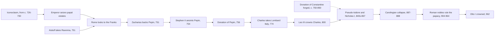

# Church History · Lesson 3.3: Popes, Franks, and emperors

> ⏱ ~15 min · Module 3: The early medieval Church · Builds on: [3.1 Gregory the Great and the conversion of the peoples](03-01-gregory-the-great-and-the-conversion-of-the-peoples.md), [3.2 The rise of Islam and the Christian Mediterranean](03-02-the-rise-of-islam-and-the-christian-mediterranean.md) · Unlocks: [4.1 The reform papacy and the investiture contest](04-01-the-reform-papacy-and-the-investiture-contest.md), [4.2 East and West: the long estrangement](04-02-east-and-west-the-long-estrangement.md)

## Why this matters

In 700 the bishop of Rome was a subject of the emperor in Constantinople. Until 731 he still waited for the emperor's governor at Ravenna to approve his election. By 800 he was crowning a Frankish king as emperor in St Peter's, and he governed a strip of central Italy that his successors held for eleven centuries. By 950 the office had become a prize for Roman noble families. This lesson explains how the papacy got a state and a new protector, and what that protection cost. It also teaches two kinds of source criticism: exposing a forgery from its own words, and weighing a hostile witness.

## The idea

A small power under threat needs a protector, and protectors collect a price. In the eighth century Rome's protector, Byzantium, failed it twice. It pressed a religious policy, iconoclasm, that the popes rejected, and it could not stop the Lombards. So the popes changed patrons. The Franks gave land and armed protection. In return they got legitimacy for a new dynasty and, in 800, an imperial title. The same bargain later swung the other way: an emperor who protects the pope may also expect to approve, or depose, him.

Two kinds of evidence run through the story, and they need different handling. Some documents were **made to support claims**: the forged *Donation of Constantine* and the Pseudo-Isidorean decretals. A forgery says nothing true about the fourth century. It is excellent evidence of what someone in the eighth or ninth century *wanted to be true*. Other evidence is **testimony by an interested witness**. Much of what we "know" about the tenth-century papacy comes from Liutprand of Cremona, a bishop in Otto I's service. You test a forgery by reading its words against its claimed date. You test a witness by asking what he saw, whom he served, and who else confirms him.

## Source

The *Donation of Constantine* ([Donation of Constantine](../reference.md#donation-of-constantine)), in Ernest F. Henderson's translation (*Select Historical Documents of the Middle Ages*, 1910). "Constantine" is speaking, after Pope Sylvester has cured him of leprosy and baptized him:

> And we ordain and decree that he shall have the supremacy as well over the four chief seats Antioch, Alexandria, Constantinople and Jerusalem, as also over all the churches of God in the whole world. … behold we—giving over to the oft-mentioned most blessed pontiff, our father Sylvester the universal pope, as well our palace, as has been said, as also the city of Rome and all the provinces, districts and cities of Italy or of the western regions; and relinquishing them, by our inviolable gift, to the power and sway of himself or the pontiffs his successors—do decree … that it shall be (so) arranged.

Notice that the text makes two different claims. The first is ecclesiastical: Rome is over the other patriarchates and every church. The second is temporal: Rome, Italy and "the western regions" belong to the pope. The forgery is usually dated between about 750 and the mid-ninth century. Where it was made is disputed: Rome in the years of the Frankish alliance is the usual answer, while Johannes Fried argues for ninth-century Francia.

## What happened

1. **Iconoclasm and the break with Constantinople (from about 726–730).** Emperor Leo III turned against the veneration of icons. Modern historians doubt the old story of a formal edict in 726. Gregory II resisted, and Gregory III's Roman synod of 731 condemned iconoclasm. Leo retaliated by confiscating the papal estates in Sicily and Calabria. He also transferred the churches of southern Italy and Illyricum to the patriarch of Constantinople (the date of the transfer is disputed). *In words:* Rome lost its income and its jurisdiction in the East because it refused an imperial doctrine.
2. **The Lombards take Ravenna (751).** King Aistulf ended Byzantine rule in north-central Italy and demanded tribute from Rome. Constantinople sent envoys, not troops.
3. **Zacharias and Pepin (751).** Pepin, mayor of the palace and the real ruler of the Franks, asked the pope whether the powerless Merovingian king should keep the title. The *Royal Frankish Annals* report Zacharias's answer: it was better to call king the man who held the power. Pepin was then elected king and anointed. The Annals were written about forty years later under Pepin's son, so some historians suspect the papal sanction was shaped in hindsight.
4. **Stephen II crosses the Alps (753–754).** Stephen II is sometimes numbered Stephen III. He met Pepin at Ponthion in January 754, where Pepin promised to restore what the Lombards had taken. In July 754, at Saint-Denis, Stephen anointed Pepin and his sons and named them *patricius Romanorum*, protectors of Rome. No pope had anointed a king before.
5. **The Donation of Pepin (756)** ([Donation of Pepin](../reference.md#donation-of-pepin)). After two campaigns against Aistulf, Pepin handed the pope the cities of the exarchate and the Pentapolis. The papal biography says their keys were laid at St Peter's tomb. These lands had legally been Byzantine. The Papal States begin here, and Charlemagne confirmed the grant after he conquered the Lombard kingdom in 774.
6. **Christmas Day 800.** Pope Leo III was assaulted in Rome in 799 and fled to Charles at Paderborn. In December 800 Charles came to Rome and held an assembly, where Leo swore an oath clearing himself of the charges against him. Two days later, at Mass in St Peter's, Leo crowned Charles emperor. The throne at Constantinople was then held by a woman, Irene, and some in the West counted it vacant. Einhard's later report of how Charles took the title is disputed.
7. **Claims enlarged in the ninth century.** The [Pseudo-Isidorean Decretals](../reference.md#pseudo-isidorean-decretals) were forged in the Frankish province of Reims, probably in the 840s. They protected accused bishops by routing their cases to Rome, and they carried the Donation with them. **Nicholas I (858–867)** acted on a large idea of Roman authority. He overruled King Lothar II's attempt to put away his wife, deposed the archbishops of Cologne and Trier who had backed Lothar, and reversed Hincmar of Reims on appeal. He also refused to recognize Photius as patriarch of Constantinople (the [Photian schism](../reference.md#photian-schism)). In 867 a synod at Constantinople declared Nicholas deposed. Historians dispute whether Nicholas knew or used the Pseudo-Isidorian texts.
8. **The [iron century](../reference.md#saeculum-obscurum) and Otto I (904–964).** When Carolingian power collapsed (887–888), no protector remained, and the papacy fell to the Roman nobility. One sign of the collapse came in 897, when Pope Formosus's corpse was put on trial by a later pope. From 904 the family of Theophylact, his wife Theodora and their daughter Marozia dominated elections. Marozia's grandson Octavian became John XII in 955, while still young. Pressed by Berengar II, John called in Otto I and crowned him emperor on 2 February 962. The *Diploma Ottonianum* ([Diploma Ottonianum](../reference.md#diploma-ottonianum)) of 13 February confirmed the papal lands. It also required a newly elected pope to give pledges to the emperor's envoys before his consecration. When John turned against him, Otto had a Roman synod depose John in late 963. John died in May 964.

**Primacy: what this shows, what it doesn't.** The era gives unusually direct evidence of what Rome *claimed*. Nicholas I acted as judge of kings, archbishops and a patriarch. The forgeries show that ninth-century churchmen found Roman authority the most useful authority to invent documents for. They do not show that the claims were accepted. Constantinople deposed Nicholas in return, and Frankish bishops resisted him. In the tenth century the see was controlled by lay families and an emperor. Catholic historians such as Klaus Schatz (*Papal Primacy*) concede that forgeries were used in the claims' service. They add that the claims were older than the forgeries, and that the see's standing survived the iron century. Orthodox historians such as John Meyendorff read Nicholas's claims as a break with the first millennium's conciliar ordering of the sees. Protestant readers since Luther, who read Valla's exposure of the Donation in 1520, have seen the forgeries as the scaffolding of papal power. What the record proves is left to [`ecclesiology-and-mariology`](../../ecclesiology-and-mariology/syllabus.md) 4.2 and [`apologetics-catholic-claims`](../../apologetics-catholic-claims/syllabus.md) 4.2.

## The causal chain

The dashed edge: the forgery fed later claims, but no evidence shows it in the bargains of 754–756.

## Worked examples

**Example 1 (clean: Valla's word test).** Lorenzo Valla wrote his exposure of the Donation in 1440. His method was [internal criticism](../reference.md#internal-criticism): test the words against the date the document claims. Take one word. The Donation has Constantine act together with "all our satraps" and the Senate. Valla's argument runs in three steps. A satrap is a Persian governor. No Roman decree or inscription he knew ever mentions Roman satraps. So a decree of Constantine's chancery would not use the word. Modern scholarship strengthens the point: early medieval Latin *did* use *satrapa* for a great lord. Bede, writing in 731, says the Old Saxons have no king but several satraps. The word therefore points to the forgery's actual date. Valla was secretary to Alfonso of Aragon, who was at war with Pope Eugenius IV, and he had a motive. Does that weaken the argument? It does not, because the argument rests on evidence anyone can check, not on Valla's word. Nicholas of Cusa had doubted the Donation in the 1430s, and Reginald Pecock independently rejected it around 1450.

**Example 2 (hard: John XII and Liutprand).** The popular John XII is a debauched boy-pope who made the Lateran a brothel. The main source is Liutprand's *History of Otto*. Liutprand was Otto's bishop and envoy, he sat in the synod of 963 that deposed John, and he wrote to justify that deposition. His report of the synod separates what the witnesses said they saw (a deacon ordained in a stable, bribes for ordinations) from sexual charges they admitted they had not seen but "knew." Earlier, in the *Antapodosis*, Liutprand calls John XI the son of Pope Sergius III by Marozia. The annalist Flodoard makes John XI the brother of Alberic II, which implies a different father.

So is the story false? Not simply. The political facts do not rest on Liutprand alone. The family's rule of Rome, John's youth at election, his alliance with Otto and his deposition by the emperor appear in other chronicles and documents. Other contemporaries also describe a worldly pope. The method is to sort the claims. The political structure is widely attested; each scandal is testimony, to be weighted by how directly it was seen and whether anyone independent confirms it. Cardinal Baronius, a Catholic historian writing around 1600, named the tenth century iron, leaden and dark. His main source for it was Liutprand.

## Watch out

- **The forged Donation did not create the Papal States.** Pepin's grant of 756 did. No contemporary source shows the forgery in the negotiations of 754–756, and its first explicit use by a pope is Leo IX's letter to the patriarch of Constantinople in 1053–54 ([4.2](04-02-east-and-west-the-long-estrangement.md)).
- **"The pope made Pepin king" overstates it.** The Franks elected Pepin. The papacy gave sanction and, in 754, anointing. The weight each carried is exactly what historians argue over.
- **Pseudo-Isidore was not a papal forgery.** It was made by Frankish clergy to protect bishops against archbishops and kings. Enlarging Rome's jurisdiction was its means, not its aim.
- **A hostile source is not a false source.** Discount Liutprand's testimony, not the facts others confirm.

## One-liner

> Rome traded Byzantine masters for Frankish protectors and got a state and an emperor for it. The forgeries show what it claimed, and the iron century shows how far the practice fell short of the claim.

## Problems

**P1 (🟢) *(Exegetical.)*** Put these six events in order and give each its year: (i) Otto I crowned emperor; (ii) Aistulf takes Ravenna; (iii) Leo III crowns Charles; (iv) the Donation of Pepin; (v) Stephen II anoints Pepin at Saint-Denis; (vi) Gregory III's synod condemns iconoclasm. Then, in one sentence, say why the lands in (iv) were legally awkward for Pepin to give.

**P2 (🟡)** Lorenzo Valla, *Discourse on the Forgery of the Alleged Donation of Constantine* (1440), in C. B. Coleman's translation (1922):

> How in the world—this is much more absurd, and impossible in the nature of things—could one speak of Constantinople as one of the patriarchal sees, when it was not yet a patriarchate, nor a see, nor a Christian city, nor named Constantinople, nor founded, nor planned! For the "privilege" was granted, so it says, the third day after Constantine became a Christian; when as yet Byzantium, not Constantinople, occupied that site. … For toward the end of the "privilege" he writes: "… that in the province of Bizantia, in the most fitting place, a city should be built in our name …" But if he was intending to transfer the empire, he had not yet transferred it; … if he was planning to build a city, he had not yet built it.

(a) *(Exegetical.)* Which sentence of the lesson's Source is Valla attacking? Name the two kinds of argument he combines, and quote the words in the passage that carry each. (b) *(Exegetical.)* A reader objects that Valla worked for a king at war with the pope, so his verdict is suspect. Say whether this objection touches *this* argument, and why. Two sentences or fewer per part.

**P3 (🔴, optional)** An invented documentary voice-over:

> "How low did the papacy sink? We don't have to guess. Liutprand of Cremona was there, in the synod of 963, and he wrote down what the witnesses swore about John XII: a deacon ordained in a stable, bishoprics sold, the Lateran made a brothel. The Church's own council found him guilty. And Liutprand tells us where this began: John XI, Marozia's son, was fathered by a pope."

(a) *(Exegetical.)* Name three distinct problems in how the script uses its source. (b) *(Evaluative.)* How much of the "iron century" picture survives once Liutprand's partisanship is taken into account? 150 words or fewer, any verdict.

Solutions

**P1** *(Exegetical.)*

**Must hit, strict:** (vi) 731 → (ii) 751 → (v) 754 → (iv) 756 → (iii) 800 → (i) 962. The lands (the exarchate of Ravenna and the Pentapolis) had been Byzantine imperial territory taken by the Lombards. Pepin was giving away land that was legally the emperor's, and the emperor wanted it back.
**Wrong turns:** dating the Donation of Pepin to 754 (that is the Ponthion promise and the Saint-Denis anointing; the handover followed the second campaign, in 756); putting the synod against iconoclasm at 726 (726–730 is Leo III's turn, and the Roman synod came in 731); saying the lands were Lombard by right.
**Model answer:** 731, 751, 754, 756, 800, 962, in the order vi, ii, v, iv, iii, i. The cities had belonged to the Byzantine exarchate until Aistulf seized them, so in law they were the emperor's, and Pepin was giving the pope Byzantine territory.

---

**P2** *(Exegetical (a) · Exegetical (b).)*

**Must hit, strict (a):** the target is the supremacy clause, "the four chief seats Antioch, Alexandria, Constantinople and Jerusalem." Valla combines (1) **anachronism**: on the document's own date Constantinople did not exist ("not yet a patriarchate, nor a see … nor founded, nor planned"; "Byzantium, not Constantinople, occupied that site"); and (2) **internal contradiction**: the document itself later speaks of the city as still to be built ("a city should be built in our name"; "he had not yet built it").
**Must hit, strict (b):** the objection does not touch this argument. It rests on evidence anyone can check: the document's claimed date, the founding of Constantinople, and the document's own later sentence. An author's interest matters when a conclusion rests on his testimony, which is not the case here.
**Wrong turns:** answering that Valla shows the Donation was forged "in the eighth century" (this passage shows only that it was not Constantine's; dating it takes other evidence, such as the satraps); treating the motive objection as partly valid "because he might have cherry-picked" (the contradiction is on the page whatever else he left out); naming the grant of Rome and Italy as the target sentence.
**Model answer:** (a) He attacks the clause giving Rome supremacy over "Antioch, Alexandria, Constantinople and Jerusalem." He argues first from anachronism, since Constantinople was "not yet … founded, nor planned" three days after the baptism, and then from self-contradiction, since the same document says a city "should be built," so "he had not yet built it." (b) The objection misses, because the argument rests on facts and a sentence any reader can check, not on Valla's word. His employer's quarrel with Eugenius IV explains why he wrote, but it cannot make the contradiction disappear.

---

**P3** *(Exegetical (a) · Evaluative (b).)*

**Must hit, strict (a):** any three of the following. (1) **Interest:** Liutprand was Otto's bishop and envoy, took part in the deposition, and wrote to justify it, so "he was there" makes him a party, not a neutral witness. (2) **Hearsay:** on his own report, the sexual charges were ones the witnesses said they "knew" but had not seen. The script merges them with the charges witnesses claimed to have seen. (3) **"The Church's own council"** was a synod summoned by the emperor to depose a pope who had turned against him. John's own synod of 964 annulled it, so its verdict is itself a disputed political act. (4) **John XI's paternity** rests on Liutprand's *Antapodosis* and is contradicted by Flodoard, who makes John XI Alberic II's brother. The script presents a contested claim as fact.
**Must hit, any verdict (b):** separate the claims by the evidence behind them. The political structure (family control of elections from 904, Alberic's son made pope young, the switch of sides, deposition by the emperor) is confirmed by sources that do not depend on Liutprand. The personal scandals rest largely on Liutprand and hearsay. Weigh both, name at least one independent source that bears on the question (Flodoard, or other contemporaries on John's worldliness), and say what evidence would move the verdict.
**Wrong turns:** concluding that because Liutprand is partisan the whole iron century is a Protestant invention (Baronius, a cardinal, named it, and the political facts are independent); taking the synod's verdict as proof of the charges; treating "biased" as "false."
**Model answer (b), one of several:** Most of the picture survives in outline. Its lurid detail does not survive intact. That lay families controlled papal elections from 904, that Alberic's young son became pope, and that an emperor then deposed him do not depend on Liutprand. Those facts alone make the century a low point for the office. The sexual charges are another matter. Liutprand wrote for the man who deposed John, and the witnesses admitted they had not seen what they swore to. Where an independent source can be checked, it sometimes disagrees, as Flodoard does on John XI's father. I would call John XII a worldly prince-pope on good evidence and treat the brothel story as unproven. An independent Roman account confirming the specific charges would change that.

## Flashback

**From Lesson [3.1](03-01-gregory-the-great-and-the-conversion-of-the-peoples.md) (Gregory the Great and the conversion of the peoples):** *(Exegetical.)* Four pieces of evidence:

- (i) Gregory tells the patriarch of Alexandria that more than ten thousand English were reported baptised at Christmas 597.
- (ii) The *Heliand* (c. 830), a Gospel epic in Old Saxon.
- (iii) The Saxon leader Widukind accepts baptism in 785.
- (iv) Late Anglo-Saxon charms that combine prayers with folk remedies.

(a) Classify each as evidence of **conversion** (the event: a ruler and people accept baptism, law and clergy) or **Christianization** (the slow process by which belief and custom become Christian), with a reason. (b) For each item you called conversion, say whether it was top-down without force or forced, and why. (c) One item's category is clear but what it shows is disputed. Name it and give the two readings. One or two sentences per item or part.

Solution

**Must hit, strict (a):** (i) conversion: a mass baptism, a datable event at the start of the Kent mission. (ii) Christianization: a vernacular Gospel written for Saxons two generations after their forced baptism, which shows the faith being made their own. (iii) conversion: the submission of a people's leader, a single datable act. (iv) Christianization: everyday practice, reconstructed by historians because no chronicle records it.
**Must hit, strict (b):** (i) top-down without force: the king received unarmed monks, and no law or army compelled anyone; the pressure was royal favour. (iii) forced, or at least made under conquest: it came during Charlemagne's war of conversion, in the years of Verden (782) and of the *Capitulatio*, which made hiding unbaptised a capital crime.
**Must hit, strict (c):** (iv), the charms. Read as pagan survivals, they show Christianization incomplete, with a Christian veneer. On Karen Jolly's reading they are a Christian popular religion, a middle ground between liturgy and folk medicine, and so show Christianization achieved in the people's own terms.
**Wrong turns:** calling (ii) evidence that coercion worked (that is one reading of the Saxon case, not the category of the item); treating (i)'s number as a count, when Gregory says it was reported to him second-hand; calling Kent forced because it was top-down.
**Model answer:** (a) (i) and (iii) are conversions: datable acts of baptism and submission. (ii) and (iv) are Christianization: a vernacular Gospel epic and everyday charms show belief and custom becoming Christian over generations. (b) Kent was top-down without force, since a king already married to a Christian received unarmed monks. Widukind's baptism was forced: it ended a war of conquest, under a law that punished hiding unbaptised with death. (c) The charms: older readings saw pagan survivals under a Christian surface, while Jolly reads them as how a Christian people actually prayed.

## Connections

- **Backward:** [2.2](02-02-ephesus-chalcedon-and-leos-rome.md) gave Leo I's theology of Peter's see and Gelasius's two powers, the ideas the eighth-century popes drew on when they chose a new protector. [3.1](03-01-gregory-the-great-and-the-conversion-of-the-peoples.md) built the Frankish and Anglo-Saxon church (Boniface) that made the Carolingian alliance natural. [3.2](03-02-the-rise-of-islam-and-the-christian-mediterranean.md) is the Mediterranean in which Byzantium could no longer defend Italy.
- **Forward:** [4.1](04-01-the-reform-papacy-and-the-investiture-contest.md) begins where this lesson ends: an imperial papacy reformed by emperors at Sutri (1046) and then turned against them. [4.2](04-02-east-and-west-the-long-estrangement.md) takes up Photius and Leo IX's use of the Donation in 1053–54. [6.1](06-01-the-late-medieval-church-and-luthers-protest.md) is where Valla's treatise, in Hutten's printed edition, reached Luther.
- **Sideways:** the difference between Valla's argument and Liutprand's testimony is the relevant ad hominem of [`philosophical-method` 2.3](../../philosophical-method/lessons/02-03-informal-fallacies-and-when-they-arent.md): an author's interest counts against testimony, not against evidence you can inspect. Where the papal claims of this era go theologically is the subject of [`ecclesiology-and-mariology`](../../ecclesiology-and-mariology/syllabus.md) 4.2. The later theory of pope against emperor is [`history-of-political-thought` 2.5](../../history-of-political-thought/lessons/02-05-marsilius-and-conciliarism.md).
