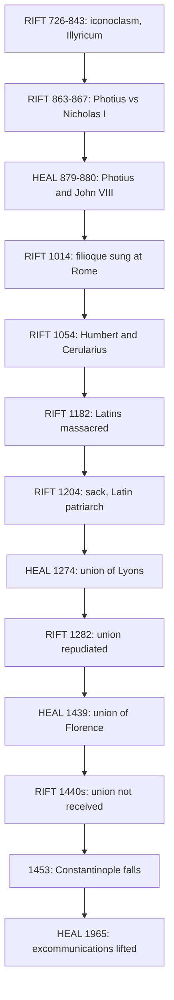

# Church History · Lesson 4.2: East and West: the long estrangement

> ⏱ ~15 min · Module 4: Reform, schism, and crusade · Builds on: [3.3 Popes, Franks, and emperors](03-03-popes-franks-and-emperors.md), [4.1 The reform papacy and the investiture contest](04-01-the-reform-papacy-and-the-investiture-contest.md) · Unlocks: [4.3 The crusades](04-03-the-crusades.md), [5.4 Avignon, the Great Schism, and the councils](05-04-avignon-the-great-schism-and-the-councils.md)

## Why this matters

Every textbook says Christendom split in 1054. The sentence is tidy and misleading. On 16 July 1054 three papal legates excommunicated one patriarch and his supporters, and a few days later a synod in Constantinople excommunicated the legates. Nobody excommunicated a church. Greeks and Latins went on sharing sacraments in many places for generations. What made the split real was slower and worse: quarrels over jurisdiction, an addition to the Creed, a sack, and two reunions that were signed but never took hold. This lesson tells that story, from iconoclasm in 726 to the lifting of the excommunications in 1965. It also carries the primacy thread forward: what the Easterners conceded to Rome, and what they meant by it.

## The idea

Think of the [East-West schism](../reference.md#east-west-schism) as an estrangement rather than a divorce. No single day ends a marriage like this. The partners stop speaking the same language (by 1000, few Latins read Greek and few Greeks read Latin). They come to see authority differently: Rome as the see of Peter with a care for all the churches; Constantinople as one of five patriarchates governing together through councils. Then come injuries that each side remembers and the other forgets.

To date a schism, ask three questions of any event:

1. **Who acted, against whom?** Persons, or churches?
2. **With what authority?** Was the act valid, and was it meant to be final?
3. **Was it received?** Did clergy and people on both sides behave differently afterwards?

1054 fails all three. The excommunications were personal. The legates' commission was doubtful, since Leo IX had died on 19 April. And contemporaries barely noticed. Steven Runciman (*The Eastern Schism*, 1955) showed that intercommunion continued into the twelfth century. Henry Chadwick (*East and West: The Making of a Rift in the Church*, 2003) tells the rift as a process running from apostolic times to Florence, with theological, political, personal and cultural causes tangled together. The same three questions also explain why the reunions failed: the unions of 1274 and 1439 had authority behind them, but they were never received.

## Source

The Council of Florence's decree of union, *Laetentur caeli* (6 July 1439), on primacy. This is the lesson's own translation from the Latin:

> We define that the holy Apostolic See and the Roman Pontiff hold the primacy over the whole world; that the Roman Pontiff is the successor of blessed Peter, prince of the apostles, true vicar of Christ, head of the whole Church, and father and teacher of all Christians; and that to him, in blessed Peter, full power was handed on by our Lord Jesus Christ to feed, rule and govern the universal Church; as is also contained in the acts of the ecumenical councils and in the sacred canons. Renewing, moreover, the order of the other venerable patriarchs handed down in the canons: the patriarch of Constantinople is second after the most holy Roman Pontiff, Alexandria third, Antioch fourth, Jerusalem fifth, saving all their privileges and rights.

Read the two qualifying clauses. "As is also contained in the acts … and canons" can be read as *confirming* the full power (the councils attest it) or as *measuring* it (the power extends only as far as the canons describe). "Saving all their privileges and rights" protects the patriarchs, but it does not say whose reading wins if their rights and the pope's full power collide. The council's historians record that the Greeks bargained over this wording, down to whether the patriarchs' rights were saved with or without "all." The ambiguity was partly deliberate.

## The record

1. **Iconoclasm (726–787, again 815–843).** Between 726 and 730 Emperor Leo III moved against the veneration of icons. Pope Gregory III's Roman synods condemned iconoclasm, and Leo, probably in the early 730s (the date is disputed), transferred Illyricum, Sicily and Calabria from Roman to Constantinopolitan jurisdiction. *In words:* the first lasting quarrel was over territory as much as images, and it pushed Rome toward the Franks ([3.3](03-03-popes-franks-and-emperors.md)).
2. **Photius (858–867, 877–886).** Photius, a layman, was made patriarch after Ignatius was deposed. Pope Nicholas I rejected him in 863. In 867 Photius's encyclical condemned Latin missionaries in Bulgaria and the [filioque](../reference.md#filioque), and his synod excommunicated Nicholas. After a council of 869–870 condemned Photius, a council of 879–880 reconciled him with Pope John VIII. *In words:* the [Photian schism](../reference.md#photian-schism) was a fight over a see and a mission field, and it was healed.
3. **The filioque as a grievance.** The words "and the Son," added to the Creed's line on the Spirit's procession, spread in Spain and Frankish Gaul. Leo III declined to add them to the Creed at Rome and had the Creed without them set up on silver shields. Rome adopted the addition in 1014, when Henry II was crowned. Two questions are at stake: is the doctrine true, and could the West add to a conciliar creed on its own? Both belong to [`trinity-and-god`](../../trinity-and-god/syllabus.md) Module 5 and [`apologetics-catholic-claims`](../../apologetics-catholic-claims/syllabus.md) 5.1. Here it matters as a standing Eastern complaint that the West had changed the common Creed.
4. **1054.** Leo IX's legates were Humbert of Silva Candida, Frederick of Lorraine and Peter of Amalfi. They came to negotiate an alliance against the Normans after Cerularius had closed the Latin churches in Constantinople. On 16 July they laid a bull on the altar of Hagia Sophia excommunicating Cerularius, Leo of Ohrid and their adherents. A synod on 20 July excommunicated the legates. See [excommunications of 1054](../reference.md#excommunications-of-1054).
5. **1182 and 1204.** In 1182 the city's Latin residents, mostly Genoese and Pisans, were massacred; the toll is disputed, from hundreds to thousands. On 12–13 April 1204 the Fourth Crusade, diverted from its goal, took Constantinople and sacked it for three days: churches were stripped, Hagia Sophia included, and there was killing and rape. Innocent III had forbidden attacks on Christians. At first he read the conquest as a providential chance for union, but in July 1205, fully informed, he rebuked his legate and wrote that the Greeks now had reason to detest the Latins "more than dogs." He still confirmed a Venetian, Thomas Morosini, as Latin patriarch. *In words:* Greek clergy were now being replaced by Latin ones in their own cathedrals ([sack of Constantinople 1204](../reference.md#sack-of-constantinople-1204)).
6. **Lyons II (1274).** Michael VIII, having retaken the city in 1261 and fearing a Western crusade to restore the Latins, had his envoys accept Roman faith and primacy. His son Andronikos II repudiated the union after Michael's death in December 1282.
7. **Florence (1439) and 1453.** The emperor John VIII and nearly all the Greek bishops signed the decree above. Mark of Ephesus refused. Back home, clergy, monks and people rallied to Mark, and Moscow rejected the union outright. It was proclaimed in Hagia Sophia only on 12 December 1452. On 29 May 1453 the city fell to the Ottomans. See [Council of Florence](../reference.md#council-of-florence).
8. **1964–1965.** Paul VI and Patriarch Athenagoras met in Jerusalem in January 1964. On 7 December 1965 a joint declaration, read in Rome and in Constantinople, regretted the offences of 1054 and committed the sentences of excommunication to oblivion. *In words:* it removed a barrier; it did not restore communion.

Only after these facts: in Athens on 4 May 2001, John Paul II named the sack of 1204 a tragedy, Christians turning on their own brothers, and asked forgiveness for the sins of Catholics against the Orthodox.

**Primacy: what this era shows, what it doesn't.** The evidence: Nicholas I judging a disputed patriarchal election; Photius needing Rome's recognition in 879–880; Greek signatures at Lyons and Florence on texts affirming Roman primacy and "full power." Against it: Photius's synod deposing a pope; the unions' rejection; Constantinople's claim, from Chalcedon's canon 28 ([2.2](02-02-ephesus-chalcedon-and-leos-rome.md)), to rank second on political grounds. Catholic historians such as Francis Dvornik argue that Byzantium long acknowledged a real Roman role as final court of appeal. Orthodox historians and theologians such as John Meyendorff read the same record as a [primacy of honour](../reference.md#primacy-of-honour-vs-jurisdiction): presidency within a communion of churches, exercised through councils, not jurisdiction over them. Chadwick, an Anglican, traces a slow Western centralization around Rome, built on the West's political situation and on centuries of decretals and canon law, that the East never shared. The joint Catholic-Orthodox Ravenna Document (2007, §41) agrees that Rome held first place among the patriarchs in the first millennium, and records disagreement on how to read the evidence for its prerogatives. What this proves belongs to [`ecclesiology-and-mariology`](../../ecclesiology-and-mariology/syllabus.md) and `apologetics-catholic-claims`.

## Timeline

The chart alternates. Each attempt at healing is followed by a rift, and the healings are acts of rulers and councils while the rifts are felt by clergy and people. That asymmetry is the lesson's argument.

## Worked examples

**Example 1 (clean: dating the schism to 1054).** Run the three questions. *Who, against whom?* Humbert's bull named Cerularius, Leo of Ohrid and their adherents; the synod named the legates. No church excommunicated another. *Authority?* A legate acts for the pope who sent him, and Leo IX had been dead for three months, so canonists have questioned whether the bull had any force; the synod's sentence was likewise aimed at persons. *Reception?* The emperor Constantine IX, who wanted the Norman alliance, stayed on good terms with the legates. Intercommunion continued in many places into the twelfth century. Verdict on the three tests: 1054 is a symbol of the rift, and the decisive breaks lie later.

**Example 2 (hard: was there a union from 1439 to 1453?).** Here the questions pull apart. *Who and authority:* this time the act was not personal. An emperor, the patriarch's delegates and nearly all Greek bishops signed a conciliar decree. Patriarch Joseph II died on 10 June, a month before it was signed. By Western canonical standards the union was complete, and Rome never revoked it. *Reception:* it failed. Many signers withdrew their assent; the proclamation waited thirteen years; the union's main Greek agent, Isidore of Kiev, was imprisoned in Moscow. So did union exist? A Latin canonist says yes, and the Greeks lapsed. An Orthodox historian says a council the Church does not receive was never ecumenical, and can point to a precedent: Nicaea II (787) denied the iconoclast council of 754 that name partly because Rome and the other patriarchs had taken no part in it. The evidence settles what happened. Which criterion of "union" counts, signature or reception, is an ecclesiological question, and the historian should flag it rather than decide it.

## Watch out

- **"In 1054 the pope excommunicated the Orthodox Church."** Leo IX was dead, the target was one patriarch, and the counter-sentence hit three legates.
- **"1965 ended the schism."** The declaration lifted the sentences of 1054 and expressed regret. Communion was not restored, and the dividing questions of primacy and the filioque were left open.
- **A one-sided martyrology.** 1204 is the worst injury in the record, but the massacre of 1182 was remembered in the West. Telling only one side's wounds is how the estrangement reproduced itself.
- **Signed is not received.** A Greek signature under "full power" at Florence documents what a delegation accepted under military pressure; it does not show what the Eastern churches believed.

## One-liner

> 1054 was an exchange of personal sentences; the schism was made by jurisdiction, a creed, a sack and two unions that were signed and never received.

## Problems

**P1 (🟢) *(Exegetical.)*** An invented script from a tour of Hagia Sophia:

> "On this altar, in 1054, Pope Leo IX excommunicated the Orthodox Church, and the Patriarch excommunicated the Catholic Church in return. The two churches have been divided ever since, until 1965, when Pope Paul VI and Patriarch Athenagoras ended the schism."

Identify three factual errors and correct each in one sentence.

**P2 (🟡) *(Exegetical.)*** Using the Source (Florence's primacy clause): (a) quote the two phrases a Greek bishop in 1439 could cite to argue that he had not conceded unlimited papal jurisdiction, and say briefly how each would do that work. (b) State what the Greek signatures establish about the Eastern churches' view of primacy, and what they do not establish, using one fact from the record after 1439. 150 words or fewer in total.

**P3 (🔴, optional) *(Exegetical (a) · Evaluative (b).)*** The older Western account held that Photius was a schismatic whom the papacy condemned more than once, and it counted the council of 869–870, which condemned him, as ecumenical. Francis Dvornik (*The Photian Schism: History and Legend*, 1948) argued that Photius was reconciled with John VIII, and that the council of 879–880 stood in Western lists of councils until eleventh-century canonists replaced it with 869–870. (a) Name the crux between the two accounts and the kind of evidence that decides it. (b) Does Dvornik's result bear on the claim that the schism was a process rather than an event? Two sentences per part, any verdict.

Solutions

**P1** *(Exegetical.)*

**Must hit, strict:** any three of the following ((ii) and (iii) may be counted separately or together): (i) Leo IX had died on 19 April 1054, so he did not excommunicate anyone in July; the bull was laid by his legates, led by Humbert. (ii) The bull excommunicated Cerularius, Leo of Ohrid and their adherents, not the Orthodox Church. (iii) The patriarch's synod excommunicated the three legates, not the Catholic Church. (iv) The churches were not simply divided "ever since": intercommunion continued in many places into the twelfth century, and reunions were signed at Lyons (1274) and Florence (1439). (v) The 1965 declaration lifted the 1054 excommunications and expressed regret; it did not end the schism or restore communion.
**Wrong turns:** "correcting" the date (16 July 1054 is right) or the place (the bull was laid on the altar of Hagia Sophia); saying 1965 was only a "Catholic" act, when it was a joint declaration.
**Model answer:** First, Leo IX was already dead (19 April 1054); his legates, led by Humbert, laid the bull. Second, the bull excommunicated Patriarch Cerularius and his adherents, and the synod replied by excommunicating the legates, so neither church excommunicated the other. Third, 1965 lifted those excommunications and expressed regret, but it did not restore communion, so the schism was not ended.

---

**P2** *(Exegetical.)*

**Must hit, strict (a):** "as is also contained in the acts of the ecumenical councils and in the sacred canons," read as a *measure* that limits the full power to what the canons describe; and "saving all their privileges and rights," which protects the patriarchs' canonical rights from being overridden. (The renewal of the canonical order of the patriarchs is acceptable as a supporting third phrase, but not in place of the first.)
**Must hit, strict (b):** the signatures establish that the emperor and nearly all the Greek bishops at the council accepted a text affirming Roman primacy and full power, however they construed it. They do not establish that the Eastern churches accepted it: the union was repudiated or ignored after the delegates returned (signers withdrew, Mark of Ephesus led the opposition, Moscow rejected it, and it was proclaimed in Hagia Sophia only in December 1452).
**Wrong turns:** reading the phrase about the canons as unambiguous in either direction, when the point is that it can be read both ways; treating the delegates' signatures as proof of Eastern belief; citing 1453 as evidence of rejection, since the city's fall ended the question without showing what the Greeks would have received.
**Model answer:** (a) "As is also contained in the acts of the ecumenical councils and in the sacred canons": he could read this as defining the pope's power by the canons, so it reaches only as far as they allow. "Saving all their privileges and rights": the patriarchs keep their canonical powers, which papal power cannot override. (b) The signatures show that the Greek delegation, under the emperor, accepted a primacy formula in 1439. They do not show that the Eastern churches accepted it: signers withdrew on their return, clergy and monks followed Mark of Ephesus, and the union was proclaimed in Constantinople only in 1452.

---

**P3** *(Exegetical (a) · Evaluative (b).)*

**Must hit, strict (a):** the crux is a factual question about what happened after 877: did John VIII and his successors recognize Photius's second patriarchate and the council of 879–880, or condemn him again? It is decided by the documentary record: the papal letters and their authenticity, the acts of 879–880 as the West received them, and the Western canonical collections that show which council they listed as eighth and when the list changed.
**Must hit, any verdict (b):** state what Dvornik's result changes (a ninth-century quarrel healed rather than a first break never mended; a Western list revised in the eleventh century, during the reform papacy of [4.1](04-01-the-reform-papacy-and-the-investiture-contest.md)), and then say whether that supports or complicates the process reading. Either direction passes if it is argued. A healed quarrel fits a process of alternating rift and repair. Alternatively, the evidence shows ninth-century communion was more robust than the process story assumes, so the decisive estrangement is later.
**Wrong turns:** treating the crux as theological (whether Photius was right about the filioque); saying Dvornik showed Photius never quarrelled with Rome, when the break of 863–867 is not in dispute; answering (b) with a verdict and no reason.
**Model answer (a):** The crux is whether Rome recognized Photius's second patriarchate and the council of 879–880 or condemned him again. It is decided by documents: the authenticity of the papal letters and which council the Western canonical collections listed as eighth, and when that changed.
**Model answer (b), one of several:** It supports the process reading, but not in the obvious way. If Photius was reconciled, the ninth century gives a rift that was healed, and the later Western memory of a "schismatic Photius" is itself evidence that estrangement grew in the eleventh century, when canonists rewrote the past to fit the present quarrel.

## Flashback

**From Lesson [3.2](03-02-the-rise-of-islam-and-the-christian-mediterranean.md) (The rise of Islam and the Christian Mediterranean):** *(Exegetical (a, c) · Evaluative (b).)* A popular history says: "When Jerusalem surrendered, the caliph Umar laid down the Pact of Umar: no new churches, no public crosses, distinctive dress. These terms show how Christians lived under the first caliphs." (a) Give two reasons most modern scholars doubt that the Pact dates from Umar I (634–644). (b) The surrender terms for Damascus (635) guaranteed the city's existing churches and said nothing about new ones. Does that silence support reading the Pact's ban on new churches back into the 630s? Any verdict, but say what you must reckon with about the Damascus text itself. (c) What *can* the Pact be used as evidence for? 150 words or fewer in total.

Solution

**Must hit, strict (a):** the earliest surviving texts are much later (Mark Cohen found none earlier than the tenth or eleventh century), and several historians think the rules grew up piecemeal rather than being issued at once. The attribution to Umar comes from Muslim tradition.
**Must hit, any verdict (b):** (1) Silence about new churches is not a ban on them: the treaty is consistent with the Pact's rule without implying it. (2) The Damascus text is itself late: it reaches us through al-Baladhuri (d. c. 892), about 250 years after the event, and he reports that it was undated at first and later rewritten at the bishop's request. So it is evidence for the form surrender terms took in Muslim memory, and one late text is weak ground for dating another. A "yes" must meet (2); a "no" must concede (1)'s consistency.
**Must hit, strict (c):** what jurists later thought dhimmi status should be, the legal theory of the period of its surviving texts. Later rulers did impose similar rules, for example al-Mutawakkil's dress decree of 850.
**Wrong turns:** calling the Pact a worthless fabrication; treating the Damascus treaty as Khalid's verbatim words; using either text to show that Christians were excluded from early administration (Sarjun ibn Mansur ran Syria's finances until about 700).
**Model answer:** (a) No surviving text is earlier than the tenth or eleventh century, and several historians think the rules accumulated piecemeal rather than in one act of the 630s. (c) It shows what later jurists thought dhimmi status should be, which rulers such as al-Mutawakkil sometimes enforced.
**Model answer (b), one of several:** Only weakly. A treaty that protects existing churches fits a later ban on new ones, but silence is not a rule. And the Damascus text comes from Baladhuri, writing some 250 years on, who admits it was rewritten, so it cannot securely anchor the Pact in the 630s.

## Connections

- **Backward:** [3.3](03-03-popes-franks-and-emperors.md) told how iconoclasm and the Lombards turned Rome toward the Franks, and how Christmas 800 made a rival emperor. [4.1](04-01-the-reform-papacy-and-the-investiture-contest.md) introduced Leo IX and Humbert as reformers; their confidence in Rome's authority is the same confidence they took to Constantinople. The primacy thread runs back through [2.2](02-02-ephesus-chalcedon-and-leos-rome.md) (canon 28).
- **Forward:** [4.3](04-03-the-crusades.md) tells the crusades, including the diversion that ended in 1204. [5.4](05-04-avignon-the-great-schism-and-the-councils.md) sets Florence inside the fight between popes and councils, and [9.2](09-02-the-second-vatican-council.md) places the 1965 declaration on the council's last day but one.
- **Sideways:** the filioque as doctrine is [`trinity-and-god`](../../trinity-and-god/syllabus.md) Module 5. The Orthodox case on primacy and the filioque, argued at full strength, is [`apologetics-catholic-claims`](../../apologetics-catholic-claims/syllabus.md) Module 5. What the primacy record proves theologically, and Vatican I's renewal of the Florence definition (*Pastor Aeternus*, ch. 3), belong to [`ecclesiology-and-mariology`](../../ecclesiology-and-mariology/syllabus.md).
