# Church History · Lesson 5.1: Papal monarchy: Innocent III to Boniface VIII

> ⏱ ~15 min · Module 5: Papal monarchy and its crisis · Builds on: [4.1 The reform papacy and the investiture contest](04-01-the-reform-papacy-and-the-investiture-contest.md), [4.2 East and West](04-02-east-and-west-the-long-estrangement.md) · Unlocks: [5.2 Friars and universities](05-02-friars-and-universities.md), [5.3 Heresy, inquisition, and the Jews](05-03-heresy-inquisition-and-the-jews.md), [5.4 Avignon, the Great Schism, and the councils](05-04-avignon-the-great-schism-and-the-councils.md)

## Why this matters

In 1213 the king of England knelt to a papal envoy and handed over his kingdom. In 1303 French agents burst into a papal palace at Anagni and held the pope prisoner for three days; he died a month later. Ninety years separate the two scenes, and the claims made by popes did not shrink in between. They grew. What changed was the power of kings to ignore them. This lesson is about that gap between what the papacy claimed and what it could enforce, the fact the next century (Avignon, schism, councils) is built on.

## The idea

The Gregorian reformers of [4.1](04-01-the-reform-papacy-and-the-investiture-contest.md) fought to free the Church from lay control. Their thirteenth-century successors ran it as a government: a court that took appeals from all of Latin Europe, a chancery that issued thousands of letters, legates who could depose bishops, a council that legislated for every parish, and a tax on clerical income. The theory behind the machinery was [plenitudo potestatis](../reference.md#plenitudo-potestatis), "fullness of power". Leo I had used the phrase to contrast his own authority with the "share of the care" he gave a delegate; Innocent III was the first pope to use it regularly to describe papal government. He also made "vicar of Christ" the standard papal title.

Two things kept this from being a theocracy in practice. First, the pope's main weapons were spiritual: excommunication of a ruler, and interdict, the suspension of most public sacraments across a territory. They worked only when a ruler's own subjects and rivals cared. Second, even Innocent said the pope acted in temporal matters only "occasionally" (*casualiter*) and for cause. His decretal *Per venerabilem* (1202) conceded that the king of France "recognizes no superior in temporal matters" (the lesson's translation of *superiorem in temporalibus minime recognoscat*). The same letter could be read as a charter of papal reach or of royal independence, and later lawyers read it both ways.

So picture a monarchy whose writ ran everywhere and whose army was other people's. It worked brilliantly against a weak king with enemies, as with John of England. It failed against a strong one with his clergy behind him, as with Philip IV of France.

## Source

Innocent III to the prefect Acerbus and the nobles of Tuscany, 1198 (the "sun and moon" letter, *Sicut universitatis conditor*; tr. Thatcher and McNeal, *A Source Book for Medieval History*, 1905; the ellipses are theirs):

> Just as the founder of the universe established two great lights in the firmament of heaven, the greater light to rule the day, and the lesser light to rule the night, so too He set two great dignities in the firmament of the universal church..., the greater one to rule the day, that is, souls, and the lesser to rule the night, that is, bodies. These dignities are the papal authority and the royal power. Now just as the moon derives its light from the sun and is indeed lower than it in quantity and quality, in position and in power, so too the royal power derives the splendor of its dignity from the pontifical authority....

Read it slowly. Two powers, not one: the king rules bodies and the pope rules souls, each in its own "firmament". What royal power derives from the pope is its *splendor* or dignity, a claim about rank and legitimacy. The letter does not say the king receives his jurisdiction from the pope or governs under papal command. The metaphor pushes hard toward subordination; the words stop short of it. Note also the addressees: officials in central Italy, where the pope was the temporal ruler.

## The record

**Innocent III (elected 8 January 1198, died 16 July 1216).**

1. **The empire.** A disputed German election in 1198 let Innocent judge between candidates. His decision of 1201 backed Otto of Brunswick, on the ground that the empire derived its origin and final authority from the papacy. *In words:* he claimed to vet emperors, and for a time made it stick.
2. **England.** John refused Stephen Langton, Innocent's choice for Canterbury. Innocent laid [an interdict](../reference.md#interdict) on England in March 1208 and excommunicated John in November 1209. Facing a French invasion and restless barons, John accepted the papal terms at Dover on 13 May 1213 and on 15 May resigned England and Ireland to the pope, receiving them back as a vassal for 1,000 marks a year. The interdict was lifted in July 1214.
3. **Magna Carta.** John sealed the charter in June 1215, then appealed to his overlord. On 24 August 1215, in *Etsi carissimus*, Innocent declared it null as extorted by force from a crusader-vassal. The barons ignored him; civil war followed.
4. **The [Fourth Lateran Council](../reference.md#fourth-lateran-council)** (opened 11 November 1215): some 400 bishops and over 800 abbots and priors, with envoys of kings. Among its canons:
   - canon 1 defined the faith, using the term transubstantiation (one line here; the doctrine is [`sacraments-and-liturgy`](../../sacraments-and-liturgy/syllabus.md)'s);
   - canon 3 ordered action against heresy: suspects who could not clear themselves excommunicated, convicted heretics handed to the secular power, rulers who failed to act liable to have their vassals released from allegiance, and bishops to tour suspect parishes at least yearly, taking sworn reports. Its full working-out is [5.3](05-03-heresy-inquisition-and-the-jews.md);
   - canon 5 set the patriarchal order under Rome, with Latin patriarchs now installed at Constantinople after 1204 ([4.2](04-02-east-and-west-the-long-estrangement.md));
   - canon 21 (*Omnis utriusque sexus*) required every Christian past the age of discretion to confess to his own priest at least once a year and receive communion at Easter;
   - canon 67 restrained "heavy and immoderate" Jewish usury (the debt thread: [`history-of-debt` 2.2](../../history-of-debt/lessons/02-02-jewish-lenders-and-the-monti-di-pieta.md));
   - canon 68 required Jews and Muslims to be distinguished from Christians by their dress, and barred Jews from appearing in public in the last days of Holy Week.

**Boniface VIII (elected 24 December 1294, after Celestine V's abdication; died 11 October 1303).**

5. **Taxation.** England and France were at war and both kings taxed their clergy. [*Clericis laicos*](../reference.md#clericis-laicos) (February 1296) excommunicated any cleric who paid, and any ruler who levied, such taxes without papal permission. Philip IV answered in August 1296 by banning the export of money and goods from France, cutting off papal revenue. Meanwhile, in May 1297, Boniface deposed the two Colonna cardinals, who questioned whether Celestine's abdication had been valid, and made war on their family. With enemies at home, he retreated: *Etsi de statu* (31 July 1297) let the king tax his clergy without consulting Rome in case of necessity, the king to judge the necessity. In August he canonized Philip's grandfather, Louis IX.
6. **The second round.** Philip had Bernard Saisset, bishop of Pamiers, arrested and tried for treason (1301). Boniface replied with *Ausculta fili* (5 December 1301), telling Philip that God had set the pope over kings and kingdoms. The king's ministers circulated a forged short version and a rude answer. In April 1302 Philip assembled the three estates of France in Paris, and they backed him, the clergy reluctantly. After a French army was destroyed at Courtrai (July 1302), Boniface issued [*Unam Sanctam*](../reference.md#unam-sanctam) (18 November 1302). Here it matters as a move in this quarrel; as political theory it belongs to [`history-of-political-thought` 2.5](../../history-of-political-thought/lessons/02-05-marsilius-and-conciliarism.md), and the status of its closing sentence to [`ecclesiology-and-mariology`](../../ecclesiology-and-mariology/syllabus.md).
7. **Anagni.** In June 1303 the king's lawyers accused Boniface of heresy and demanded a council to judge him. On 7 September 1303, the eve of the day Boniface meant to excommunicate Philip, Guillaume de Nogaret and Sciarra Colonna seized him at [Anagni](../reference.md#outrage-of-anagni). The townspeople freed him after three days. He returned to Rome and died on 11 October.
8. **Aftermath.** Clement V, a Gascon, declared in *Meruit* (1306) that *Unam Sanctam* had placed France under the Roman Church no differently than before, and in *Rex gloriae* (1311) exonerated Philip's zeal and closed a posthumous heresy trial of Boniface. The road runs straight to Avignon ([5.4](05-04-avignon-the-great-schism-and-the-councils.md)).

## The causal chain

```mermaid
graph LR
  A["Clericis laicos (Feb 1296)"] --> B["Philip bans export of money (Aug 1296)"]
  N["Colonna cardinals deposed (May 1297)"] --> C
  B --> C["Etsi de statu: retreat (Jul 1297)"]
  C --> D["Louis IX canonized (Aug 1297)"]
  D --> E["Saisset arrested (1301)"]
  E --> F["Ausculta fili (Dec 1301)"]
  F --> G["Estates back Philip (Apr 1302)"]
  G --> H["French defeat at Courtrai (Jul 1302)"]
  H --> I["Unam Sanctam (Nov 1302)"]
  I --> J["Heresy charges at the Louvre (Jun 1303)"]
  N --> K
  J --> K["Anagni (7 Sep 1303)"]
  K --> L["Boniface dies (11 Oct 1303)"]
  L --> M["Clement V: Meruit 1306, Rex gloriae 1311"]
```

Two rounds, each opened by a papal claim and closed by royal leverage. The Colonna feud feeds both the 1297 retreat and the raid of 1303.

## Worked examples

**Example 1 (clean: why the weapons worked on John).** Run the mechanism. The claim was spiritual jurisdiction over a disputed election. The weapons were interdict and excommunication. They bit because John had other enemies: Philip Augustus was preparing to invade, claiming to act for the Church, and barons had a religious excuse to withhold loyalty. John's submission turned the pope from an enemy into his feudal protector. The fief was John's move as much as Innocent's.

**Example 2 (hard: the annulment of Magna Carta).** This looks like the height of papal reach: the pope voids a king's charter with his subjects. The evidence strains the reading. Innocent acted at John's request, as the overlord defending his vassal, not on a theory of voiding all royal law. The annulment did not bind: the barons fought on and invited in a French prince. And after John died, the papal legate Guala Bicchieri co-sealed a revised reissue of the charter in the boy Henry III's name (12 November 1216). Rome's interest was a stable, loyal, crusading dynasty, not the charter's clauses. The tribute itself lapsed for decades, and Parliament repudiated it in 1366. Supreme lordship on parchment; a very contingent lordship in practice.

## Primacy: what this shows, what it doesn't

This is the high point of papal jurisdiction in the West. Popes judged imperial elections, held kingdoms in fief, taxed clergy across Europe, took appeals from everywhere, and assembled a council whose canons reached every parish. No earlier era shows Roman primacy exercised so widely or accepted as ordinary by Latin bishops. What it does not show is that rulers conceded papal authority over temporal affairs as of right. Kings used it when it served them (John) and defeated it when it did not (Philip), and Innocent's own *Per venerabilem* granted the French king independence in temporal matters. Nor does it speak for the whole Church. Orthodox historians see the Latin patriarchs of canon 5 as the fruit of 1204's conquest, and the monarchical papacy as the form of primacy the East had long refused. Protestant historians have read the era as the papacy's turn to worldly lordship. Catholic historians such as Eamon Duffy (*Saints and Sinners*) tell it as a zenith that carried the seeds of overreach. What the record proves about primacy itself belongs to [`ecclesiology-and-mariology`](../../ecclesiology-and-mariology/syllabus.md) and [`apologetics-catholic-claims`](../../apologetics-catholic-claims/syllabus.md).

## Watch out

- **"Innocent ruled Europe."** He could judge and pressure; he could not command armies except by persuading rulers. Weigh every intervention by who else wanted the same result.
- **Lateran IV did not invent confession or the "yellow badge."** Canon 21 made annual confession to one's own priest a universal law; the practice was older. Canon 68 required distinctive dress but set no form; specific badges came from later royal decrees (France's *rouelle* in 1269, for example).
- **Boniface did not simply lose to force.** He had already retreated on taxation in 1297, before any violence. Philip won the argument with his own clergy and estates first.
- **Don't grade *Unam Sanctam*'s authority here.** Whether its final sentence is defined teaching is a question for [`fundamental-theology` 4.5](../../fundamental-theology/lessons/04-05-reading-a-documents-weight.md)'s method and `ecclesiology-and-mariology`, not a history lesson.

## One-liner

> From Innocent III to Boniface VIII the papacy's claims only rose; what fell was its power to make kings with their own clergy behind them obey.

## Problems

**P1 (🟢) *(Exegetical.)*** From Boniface VIII, *Clericis laicos* (1296), tr. Henderson, *Select Historical Documents of the Middle Ages* (1910):

> "...whatever prelates, or ecclesiastical persons, monastic or secular, of whatever grade, condition or standing, shall pay, or promise, or agree to pay as levies or talliages to laymen the tenth, twentieth or hundredth part of their own and their churches' revenues or goods ... under the name of an aid, loan, subvention, subsidy or gift, or under any other name, manner or clever pretense, without the authority of that same chair. Likewise emperors, kings, or princes, dukes, counts or barons ... who shall impose, exact or receive such payments ... shall incur, by the act itself the sentence of excommunication."

(a) Who falls under the sentence, and what act triggers it? (b) Does the passage forbid all taxation of the clergy by lay rulers? Name the words that decide it. (c) Name the bull that retreated from this position, and state what it conceded. Two sentences per part.

**P2 (🟡) *(Exegetical.)*** An invented documentary voice-over:

> "In 1215 Pope Innocent III summoned the bishops of Europe and changed Christian life forever. His council invented confession, forced every Jew in Christendom to wear a yellow badge, and created the Inquisition to hunt heretics."

Identify the three claims, and for each say what Lateran IV actually did, with the canon number. 150 words or fewer.

**P3 (🔴, optional) *(Evaluative.)*** "Boniface VIII lost to Philip IV because of his own intransigence." Evaluate the claim in 150 words or fewer, any verdict.

Solutions

**P1** *(Exegetical.)*

**Must hit, strict (a):** two classes: clergy of any rank who pay or promise to pay a share of their revenues to laymen, and lay rulers and officials of any rank who impose, exact or receive such payments. The trigger is the payment or levy itself, whatever it is called ("aid, loan, subvention, subsidy or gift"). The sentence is excommunication "by the act itself", with no trial needed.
**Must hit, strict (b):** no. The prohibition applies to payments made "without the authority of that same chair": the bull reserves consent to the pope and does not declare the clergy untaxable. The long list of names (aid, loan, gift) closes loopholes; it does not widen the ban beyond unauthorized levies.
**Must hit, strict (c):** *Etsi de statu* (July 1297). In a case of necessity the king could tax his clergy without consulting the pope, and the king himself judged whether necessity existed.
**Wrong turns:** reading (b) as a claim of absolute clerical immunity; saying the retreat was forced by Anagni (it came six years earlier); naming *Unam Sanctam* in (c).
**Model answer:** (a) Clergy who pay or promise a share of their revenues to laymen, and any lay ruler or official who levies or receives it, under any label. Doing so incurs excommunication automatically. (b) No: the ban covers payments made "without the authority of that same chair", so what the bull demands is papal consent, not immunity. (c) *Etsi de statu* (1297) let the king tax his clergy without asking Rome in an emergency, and left it to the king to say when an emergency existed.

---

**P2** *(Exegetical.)*

**Must hit, strict:** (1) Confession: canon 21 did not invent it. It made annual confession to one's own priest, with Easter communion, a universal obligation for all past the age of discretion. (2) Badge: canon 68 required Jews and Muslims to be distinguished by dress, without prescribing a badge or colour; badges came from later local and royal decrees. (3) Inquisition: canon 3 set anti-heresy measures (excommunication of suspects who could not clear themselves, handing convicted heretics to the secular power, pressure on rulers, bishops' annual inquiries in suspect parishes). Papal inquisitors came in the 1230s.
**Wrong turns:** denying that canon 68 existed or softening it; it did mandate public marking of Jews and Muslims. Treating canon 3 as harmless because it is not yet "the Inquisition": it did require episcopal inquiry and delivery to secular punishment. Citing canon 67 for the dress rule.
**Model answer:** The voice-over makes three claims. Confession: canon 21 made existing practice a universal law, requiring every adult Christian to confess to his own priest at least yearly and receive communion at Easter. The badge: canon 68 required Jews and Muslims to be marked off by their dress, but set no form; specific badges, such as France's *rouelle* of 1269, came later from kings and local councils. The Inquisition: canon 3 ordered action against heresy, including excommunication of suspects who could not clear themselves, handing the convicted to secular rulers, sanctions on rulers who failed to act, and yearly episcopal inquiries in suspect parishes. The papal inquisitors of 5.3 came in the 1230s. The council was drastic enough without the inventions.

---

**P3** *(Evaluative.)*

**Must hit, any verdict:** (1) State the personal case with evidence: the tone of *Ausculta fili* and *Unam Sanctam*, and the Colonna feud, which gave Philip allies in Rome and supplied Sciarra Colonna at Anagni. (2) State the structural case with evidence: the 1296 export ban, the 1297 retreat before any escalation of tone, the French clergy and estates backing the king in 1302, and Clement V's later accommodation. (3) Weigh them with a counterfactual: would a more conciliatory pope have kept the right to veto clerical taxation?
**Wrong turns:** treating *Unam Sanctam* as the cause of the conflict (it came late, in the second round); using Anagni alone as proof of weakness, when Boniface was freed by the townspeople; grading Boniface's theology instead of his tactics.
**Model answer, one of several:** The claim is half right. Boniface's manner cost him: *Ausculta fili* invited a quarrel over a treason trial, and his war on the Colonna gave Philip Roman allies and the man who led the raid on Anagni. But the decisive facts are structural. In 1297, before any violence, a single French export ban forced Boniface to concede that the king could tax clergy in an emergency of the king's own judging. In 1302 the French clergy stood with their king. A more tactful pope might have avoided Anagni; he would not have regained the veto over taxation, because the money that paid for it now flowed through the king. Intransigence shaped how Boniface lost, not whether he lost.

## Flashback

**From Lesson [4.2](04-02-east-and-west-the-long-estrangement.md) (East and West: the long estrangement):** *(Exegetical.)* Lesson 4.2 dated schisms and unions with three questions: who acted, with or against whom (persons or churches)? With what authority? Was it received? (a) Run the three questions on the union of Lyons (1274). (b) Name one way Florence (1439) scored higher than Lyons on the first two questions, and give the evidence that both failed the third. (c) Use the record of 1204 to explain why reception was so hard for any union in this period. Two sentences per part.

Solution

**Must hit, strict (a):** who: the emperor Michael VIII, through his envoys, who accepted Roman faith and primacy; the record names no Eastern council behind it. Authority: imperial, and politically motivated, since Michael had retaken Constantinople in 1261 and feared a Western crusade to restore the Latins. Reception: none lasting; his son Andronikos II repudiated the union after Michael died in December 1282.
**Must hit, strict (b):** at Florence the emperor John VIII attended in person, and nearly all the Greek bishops signed a conciliar decree. Both failed reception: Lyons was repudiated in 1282; after Florence signers withdrew, clergy, monks and people followed Mark of Ephesus, Moscow rejected the union, and it was proclaimed in Hagia Sophia only in December 1452.
**Must hit, strict (c):** in 1204 the Fourth Crusade sacked Constantinople, and Greek clergy were replaced by Latins in their own cathedrals, under a Venetian Latin patriarch whom Innocent III confirmed. Union with Rome therefore looked, to clergy and people, like submission to the Church whose armies had sacked the city; Innocent himself wrote that the Greeks now had reason to detest the Latins "more than dogs."
**Wrong turns:** treating Lyons as a Greek conciliar act equal to Florence; counting 1453 as evidence that Florence was rejected (the city's fall ended the question without showing what the Greeks would have received); blaming 1204 on Innocent's orders, when he had forbidden attacks on Christians.
**Model answer:** (a) At Lyons the emperor's envoys accepted Roman faith and primacy for Michael VIII, who feared a Western crusade to restore the Latin empire he had ended in 1261. It rested on imperial authority alone and was not received: Andronikos II repudiated it after 1282. (b) Florence was signed by the emperor in person and nearly all the Greek bishops, as a conciliar decree. Yet it too went unreceived: signers withdrew, Mark of Ephesus led the resistance, and the union was proclaimed only in 1452. (c) After 1204 Latin clergy held Greek cathedrals under a Latin patriarch, so union meant accepting the Church of the conquerors. Innocent III admitted the Greeks had reason to detest the Latins "more than dogs."

## Connections

- **Backward:** [4.1](04-01-the-reform-papacy-and-the-investiture-contest.md) built the reform papacy's claim to judge kings; this lesson is that claim turned into a working government. [4.2](04-02-east-and-west-the-long-estrangement.md) gives the 1204 conquest behind Lateran IV's Latin patriarchs.
- **Forward:** [5.2](05-02-friars-and-universities.md) turns to the orders Innocent approved. [5.3](05-03-heresy-inquisition-and-the-jews.md) carries canon 3, canon 68 and the Albigensian Crusade Innocent launched. [5.4](05-04-avignon-the-great-schism-and-the-councils.md) begins where Clement V ends, and Boss problem 5 close-reads *Unam Sanctam*.
- **Sideways:** *Unam Sanctam* and its rivals as political theory are [`history-of-political-thought` 2.5](../../history-of-political-thought/lessons/02-05-marsilius-and-conciliarism.md). Canon 67 and Jewish lending are [`history-of-debt` 2.2](../../history-of-debt/lessons/02-02-jewish-lenders-and-the-monti-di-pieta.md), with the usury doctrine in [`theology-of-debt`](../../theology-of-debt/syllabus.md). Transubstantiation is [`sacraments-and-liturgy`](../../sacraments-and-liturgy/syllabus.md)'s.
