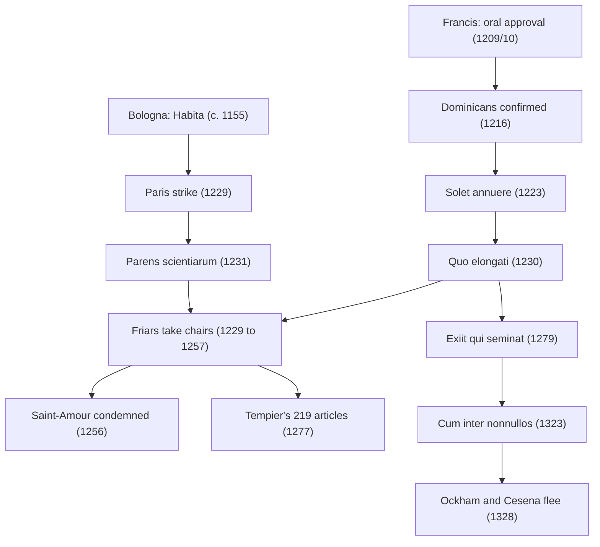

# Church History · Lesson 5.2: Friars and universities

> ⏱ ~15 min · Module 5: Papal monarchy and its crisis · Builds on: [5.1 Papal monarchy: Innocent III to Boniface VIII](05-01-papal-monarchy-innocent-iii-to-boniface-viii.md), [4.1 The reform papacy and the investiture contest](04-01-the-reform-papacy-and-the-investiture-contest.md) · Unlocks: [5.3 Heresy, inquisition, and the Jews](05-03-heresy-inquisition-and-the-jews.md), [5.4 Avignon, the Great Schism, and the councils](05-04-avignon-the-great-schism-and-the-councils.md)

## Why this matters

Two institutions born around 1200 still shape the Church: the orders of friars and the universities. Both grew up in towns, and both escaped the local bishop by being placed directly under the pope. Within a generation they had merged, since the best theologians in Paris were friars. Then the friars' defining ideal, poverty, set a pope against the largest order in Christendom and sent its most famous logician into exile. That arc runs from papal monarchy at its most creative to the quarrels that fed its crisis.

## The idea

By 1200 the towns of Italy, Flanders and southern France were full of people who read the Gospels and saw that the Church did not look like the apostles. Some of them preached poverty without permission. The Waldensians of Lyon asked Rome for leave to preach, were refused except under the bishops' control, kept preaching, and were condemned in 1184. Herbert Grundmann (*Religious Movements in the Middle Ages*, 1935) argued that heretics and new orders grew from the same impulse: apostolic poverty and lay preaching. What decided which a group became was largely how the hierarchy answered it.

Innocent III answered Francis of Assisi differently. Francis and his first companions came to Rome and received oral approval of a short rule in 1209 or 1210 (the sources differ). Dominic of Caleruega, who had spent a decade preaching against the Cathars in Languedoc, founded a house of preachers at Toulouse in 1215. Honorius III confirmed his order on 22 December 1216 (*Religiosam vitam*). These were **[mendicant orders](../reference.md#mendicant-orders)**: they lived by begging rather than on endowed estates, and they moved into towns, not away from them. The Church had taken the poverty movement inside.

The universities were a different kind of creature: **guilds**. Masters and students in a city banded together, like any trade, to bargain with townsmen over rents and with the bishop's chancellor over the licence to teach. Nobody founded Paris or Bologna. They formed, and then they won charters. Their most useful protector was the pope, who could overrule a bishop.

## Source

Francis of Assisi, *Testament* (1226, dictated near his death), trans. Paschal Robinson, *The Writings of Saint Francis of Assisi* (1906), public domain:

> Let the brothers take care not to receive on any account churches, poor dwelling-places, and all other things that are constructed for them, unless they are as is becoming the holy poverty which we have promised in the Rule, always dwelling there as strangers and pilgrims. I strictly enjoin by obedience on all the brothers that, wherever they may be, they should not dare, either themselves or by means of some interposed person, to ask any letter in the Roman curia either for a church or for any other place, nor under pretext of preaching, nor on account of their bodily persecution.

Notice what Francis forbids: not only property but **privileges**, letters from the curia shielding friars from bishops. Four years after his death, Gregory IX's *Quo elongati* (28 September 1230) ruled that the Testament did not bind the order, and let friars use a go-between (*nuntius*) to handle money given to them. The order grew on exactly the papal letters Francis had told it not to seek. The whole century's tension is in that gap.

## What happened

1. **The rule and its interpreters (1223-1230).** Honorius III confirmed the final Franciscan rule in the bull *Solet annuere* (29 November 1223): the friars were to live "without property". Francis died on 3 October 1226; *Quo elongati* followed in 1230. *In words:* the papacy became the rule's official interpreter from the start.
2. **Paris wins its charter (1229-1231).** A tavern brawl in 1229 ended with students killed by the crown's soldiers, and the masters suspended teaching and dispersed. Gregory IX settled the strike with ***[Parens scientiarum](../reference.md#parens-scientiarum)*** (13 April 1231). It confirmed the masters' right to suspend lectures when wronged and to make their own statutes, and it bound the chancellor to license qualified candidates. Bologna, a law school run by student guilds, had imperial protection from Frederick Barbarossa's *Habita* (c. 1155). In 1219 Honorius III gave the archdeacon of Bologna control of its degrees. *In words:* the pope protected the universities' independence from bishop and town, and tied them to Rome.
3. **The friars take chairs (1229-1257).** During the strike the bishop let a Dominican, Roland of Cremona, incept as master of theology, and the order soon held a second chair. Alexander of Hales became a Franciscan around 1236 and brought his chair with him. Friars did not strike, answered to their orders rather than the guild, and drew the best students.
4. **The [secular-mendicant controversy](../reference.md#secular-mendicant-controversy) (1250s).** In 1253 the friar masters would not join a strike, and the secular masters (clergy not in religious orders) expelled them. Innocent IV curbed the friars' pastoral privileges in late 1254 and died weeks later. Alexander IV reversed him and, in *Quasi lignum vitae* (14 April 1255), ordered the friars readmitted. William of Saint-Amour answered with *On the Dangers of the Last Times* (1256), which cast the friars as heralds of Antichrist. Alexander condemned it in 1256 and William was banished from France. The friars Thomas Aquinas and Bonaventure were admitted to the masters' corporation in August 1257. *In words:* the pope settled a university quarrel over the guild's head, in the friars' favour.
5. **1277 as an event.** On 18 January 1277 John XXI asked Bishop Stephen Tempier to investigate errors taught at Paris. On 7 March Tempier, working with theologians, condemned **[219 propositions](../reference.md#condemnation-of-1277)**, some touching positions of Aquinas. After Aquinas's canonization (18 July 1323), Bishop Stephen Bourret revoked the condemnation in 1325 so far as it touched him. What the articles said, and why, is [`ancient-medieval-philosophy` 7.1](../../ancient-medieval-philosophy/lessons/07-01-faith-reason-and-the-paris-crisis.md). *In words:* a bishop policed a university at a pope's prompting, and a later bishop, after a papal canonization, undid part of it.
6. **Poverty as a legal fiction.** Nicholas III's ***[Exiit qui seminat](../reference.md#exiit-qui-seminat)*** (14 August 1279) held that renouncing ownership of everything, singly and in common, was holy and had been taught by Christ. The friars had **[use without ownership](../reference.md#use-and-ownership)**; ownership of their goods lay with the Holy See unless the donor kept it. *In words:* Rome owned the friars' houses and books, so the friars could own nothing.
7. **The [Spiritual Franciscans](../reference.md#spiritual-franciscans).** A rigorist wing (Peter John Olivi, Ubertino da Casale, Angelo Clareno) insisted on *usus pauper*, poor use, not just non-ownership. John XXII demanded obedience in *Quorumdam exigit* (7 October 1317). On 7 May 1318 four friars who refused it were burned at Marseille.
8. **John XXII breaks the fiction (1322-1323).** In 1322 the order's general chapter at Perugia declared that Christ and the apostles had owned nothing. John replied with *Ad conditorem canonum* (8 December 1322), renouncing papal ownership of Franciscan goods. Then ***[Cum inter nonnullos](../reference.md#cum-inter-nonnullos)*** (12 November 1323) declared heretical the "pertinacious" assertion that Christ and the apostles had nothing, individually or in common, or no right to sell or give what they had. *In words:* the thing the Franciscans said made them apostolic was now heresy to assert obstinately.
9. **Ockham at Avignon (1324-1328).** William of Ockham, summoned to Avignon in 1324 to answer charges against his Oxford teaching, studied John's bulls there and concluded the pope was a heretic. On the night of 26 May 1328 he fled with the minister general, Michael of Cesena, to Ludwig of Bavaria, whom John had excommunicated, at Pisa. He followed Ludwig to Munich, where he spent the rest of his life writing against the Avignon popes.

## The chain

Two strands, one hinge. Papal privilege made both the friars and the universities, and put the friars inside the universities. The same power that granted *Exiit* could withdraw it.

## Worked examples

**Example 1 (clean: why Francis, not Valdes).** Run Grundmann's test. Valdes and Francis both gave away their wealth and both wanted to preach. Valdes's followers were told to preach only with the bishops' consent, did not comply, and were condemned in 1184. Francis's first rule came with papal approval, and his *Testament* insists on reverence for priests and on not preaching against a parish priest's will. So the difference lay in the relation to the hierarchy, not in the ideal. The Church's answer turned a movement into an order in one case and a sect in the other.

**Example 2 (hard: did John XXII reverse *Exiit*?).** The Franciscans said yes. *Exiit* praised total renunciation as taught by Christ, and *Cum inter nonnullos* made denying Christ's ownership heretical to assert obstinately. John and his defenders said no. *Exiit* had approved a way of life, the renunciation of *dominium* (ownership), and said nothing binding about Christ's legal rights. *Ad conditorem* added a lawyer's point: with things consumed in use, like food, use cannot be separated from ownership, so the fiction was empty.

Brian Tierney (*Origins of Papal Infallibility, 1150-1350*, 1972) argued that the quarrel helped produce the idea of papal infallibility. Olivi had wanted *Exiit* to be irreversible, and John, who saw such claims as limits on his sovereignty, rejected them in *Quia quorundam* (1324). Critics answer that canonists had held versions of the idea earlier. Whether the two bulls contradict each other, and what that would imply, belongs to [`ecclesiology-and-mariology`](../../ecclesiology-and-mariology/syllabus.md). Here the historical point is enough: the dispute turned on reading one papal text against another, and each side could cite words.

## Watch out

- **Friars are not monks.** Monks vow stability in one house and live on endowments. Friars belong to an order, move where they are sent, beg, and preach in towns.
- **"The pope founded the University of Paris."** No. The guild existed before 1231. *Parens scientiarum* protected and regulated it; it did not create it.
- **"John XXII condemned poverty."** He condemned a claim about Christ's and the apostles' *legal* condition, asserted pertinaciously, and ended the papal-ownership fiction. Franciscans still vowed poverty.
- **"1277 condemned Aquinas."** Some articles touched his views; he was not named. Tempier's list was a local episcopal act, and in 1325 a later bishop of Paris revoked it as far as it touched Aquinas.

## One-liner

> The papacy tamed the poverty movement and the schools by taking both under its own protection, and then found that a privilege it could grant, it could also be accused of betraying.

## Problems

**P1 (🟢) *(Exegetical.)*** Francis's *Testament*, Robinson's translation (1906):

> And I strictly enjoin on all my brothers, clerics and laics, by obedience, not to put glosses on the Rule or on these words saying: Thus they ought to be understood; but as the Lord has given me to speak and to write the Rule and these words simply and purely, so shall you understand them simply and purely and with holy operation observe them until the end.

(a) What two texts does the passage protect, and from what? (b) Name the papal act of 1230 that answered it, and the one change it made to the friars' handling of money. Two sentences per part.

**P2 (🟡) *(Exegetical.)*** An invented museum placard:

> "In 1231 Pope Gregory IX founded the University of Paris with the bull *Parens scientiarum*. The friars were welcomed by the masters from the start. Decades later, in 1323, Pope John XXII declared the Franciscan vow of poverty heretical, and the order's leaders fled to the emperor."

Identify three factual errors and correct each in one sentence.

**P3 (🔴, optional) *(Evaluative.)*** Test the claim "the medieval papacy suppressed free inquiry in the universities" against *Parens scientiarum* (1231), the Saint-Amour affair (1256), and the 1277 condemnation with its 1325 revocation. Any verdict. 150 words or fewer.

Solutions

**P1** *(Exegetical.)*

**Must hit, strict (a):** it protects the Rule and the *Testament* itself ("these words") from interpretation by gloss, i.e. from commentary that says how they "ought to be understood". Francis wants them understood "simply and purely" and kept literally.
**Must hit, strict (b):** Gregory IX's *Quo elongati* (28 September 1230). It ruled that the *Testament* did not bind the order and allowed friars to use a *nuntius*, a go-between who could receive money from benefactors and spend it on the friars' needs.
**Wrong turns:** reading "glosses" as a ban on all study or on scripture commentary (it targets glosses on the Rule and *Testament*); naming *Solet annuere* (1223, the Rule itself) or *Exiit* (1279) as the answer.
**Model answer:** (a) It protects the Rule and the *Testament* from glosses, commentaries that explain how they "ought to be understood". Francis demands they be read "simply and purely" and kept to the letter. (b) Gregory IX's *Quo elongati* (1230) declared the *Testament* not binding. It let the friars appoint a *nuntius* to receive and spend money on their behalf.

---

**P2** *(Exegetical.)*

**Must hit, strict:** any three of:
- **"Founded."** The Paris guild of masters existed before 1231; *Parens scientiarum* settled the 1229 strike and confirmed its rights, it did not create it.
- **"Welcomed from the start."** Friars took chairs from 1229 amid resentment. The secular masters expelled them in 1253, and the 1250s controversy (William of Saint-Amour) ended only by papal order, with Aquinas and Bonaventure admitted in 1257.
- **"Declared the vow of poverty heretical."** *Cum inter nonnullos* (1323) condemned the pertinacious assertion that Christ and the apostles owned nothing, singly or in common; the friars' own vow was untouched. (*Ad conditorem*, 1322, had renounced papal ownership of their goods.)
- **"The order's leaders fled" in or right after 1323.** The flight was in 1328, and it was the minister general Michael of Cesena with Ockham and a few others, not the order as such; most Franciscans submitted.
**Wrong turns:** "correcting" 1231 or 1323 as dates (both are right); saying John XXII abolished Franciscan poverty.
**Model answer:** First, Gregory IX did not found the university: the masters' guild already existed, and *Parens scientiarum* ended their strike and confirmed their privileges. Second, the friars were not welcomed: the secular masters expelled them in 1253, and only Alexander IV's intervention restored them. Third, John XXII did not condemn the vow: he condemned as heresy the obstinate claim that Christ and the apostles owned nothing, and the flight to the emperor came in 1328, by Michael of Cesena, Ockham and a few companions.

---

**P3** *(Evaluative.)*

**Must hit, any verdict:** distinguish the actors (the pope, the bishop of Paris, the secular guild) and say which one did what; use all three episodes; note that in 1231 and the 1250s papal power *overrode* local control, once for the guild and once for the friars against the guild; note that 1277 was an episcopal act, prompted by a papal letter, and that its 1325 revocation came from a later bishop of Paris after a papal canonization; say what "free inquiry" means (freedom from whom?) and whether the claim survives in any weaker form.
**Wrong turns:** treating "the Church" as one actor; treating 1277 as a papal condemnation; treating the Saint-Amour affair as the suppression of a heresy about doctrine, when it was an attack on the friars' place in the university; judging by modern academic-freedom norms without saying so.
**Model answer, one of several:** The claim fails as stated but survives in a weaker form. In 1231 Gregory IX protected the Paris masters' self-government against the bishop's chancellor and the crown. In the 1250s the papacy overruled the guild to keep friars in theology chairs, and condemned Saint-Amour's attack on them: control of the university, not of inquiry as such. The 1277 list was Tempier's, prompted by John XXI's letter, and it did restrict what masters could teach; its partial revocation in 1325 followed Aquinas's canonization. So the papacy mostly acted as the universities' patron. But every episode assumed that someone in the Church could set limits, and the limits moved with the politics of the moment.

## Flashback

**From Lesson [4.3](04-03-the-crusades.md) (The crusades):** *(Exegetical.)* An invented tour-guide script, read outside Mainz cathedral:

> "In spring 1096 Pope Urban's crusaders carried out his orders to purge Christ's enemies at home, beginning with the Jews of the Rhineland. The bishops stood aside and let it happen; only at Speyer did anyone lift a finger. Tens of thousands died in a few weeks. It was the crusade doing exactly what Clermont had preached."

Identify three claims the record does not support and give the correction for each, then say in one sentence what the script gets right that a defender of the crusade must concede. 150 words or fewer.

Solution

**Must hit, strict:** three of these four corrections. (1) **"His orders" / "exactly what Clermont had preached":** no papal text called for attacks on Jews, and canon 2 of Clermont offered remission of penance for a *journey to Jerusalem* made out of devotion. (2) **"The bishops stood aside":** bishops at Speyer, Worms, Mainz and Cologne tried to shelter Jews. At Speyer Bishop John saved most of the community and punished some attackers. At Mainz the Jews took refuge in Archbishop Ruthard's palace. The protection often failed: at Mainz, the Hebrew chronicle says, Ruthard's men fled first and he fled too. (3) **"Only at Speyer":** the same evidence. (4) **"Tens of thousands":** Mainz was about 1,100 dead by the Hebrew chronicle's count (about 700 by Albert of Aachen's), and Worms about 800. Estimates of the total start at about two thousand, and none can be checked closely. (2) and (3) count as one error if the answer gives the same evidence for both. **What it gets right:** the killers were crusaders, acting in the language of the crusade and before the main armies left, and many Jews died rather than accept forced baptism.
**Wrong turns:** overcorrecting to "just a mob with no connection to the crusade"; treating the bishops' attempts as proof that the protection worked; replacing "tens of thousands" with a new precise total.
**Model answer:** First, no pope ordered it: Clermont's canon offered remission of penance for a devout journey to Jerusalem, not war on Jews at home. Second, the bishops did not simply stand aside. At Speyer, Worms, Mainz and Cologne they tried to shelter Jews, though at Mainz Ruthard's protection collapsed and he fled. Third, the dead were not tens of thousands: about 800 at Worms and 700 to 1,100 at Mainz, with estimates of the total starting at about two thousand. What the script gets right is that the killers were crusaders who spoke the crusade's language, so the massacres cannot be separated from the movement that the preaching set off.

## Connections

- **Backward:** [5.1](05-01-papal-monarchy-innocent-iii-to-boniface-viii.md) is the papal monarchy whose privileges made both institutions. Innocent III approved Francis's rule, and Lateran IV (1215) restricted new orders. [4.1](04-01-the-reform-papacy-and-the-investiture-contest.md) built the reform papacy's habit of reaching past bishops.
- **Forward:** [5.3](05-03-heresy-inquisition-and-the-jews.md) is the harder side of the same answer to the poverty movement: the Cathars, the Waldensians, and the inquisitors, many of them friars. [5.4](05-04-avignon-the-great-schism-and-the-councils.md) is the Avignon papacy of John XXII and its critics. [7.2](07-02-accommodation-in-asia.md) follows the friars' and Jesuits' missions abroad.
- **Sideways:** what the Paris masters taught is [`ancient-medieval-philosophy` 7.1](../../ancient-medieval-philosophy/lessons/07-01-faith-reason-and-the-paris-crisis.md) (the 1270 and 1277 lists) and [8.4](../../ancient-medieval-philosophy/lessons/08-04-ockham-nominalism-and-the-razor.md) (Ockham's nominalism), with Aquinas in depth in [`thomistic-synthesis`](../../thomistic-synthesis/syllabus.md). The use-versus-ownership split has a twin in Aquinas's account of property, where ownership means managing goods and their use stays common ([`history-of-political-thought` 2.4](../../history-of-political-thought/lessons/02-04-aquinas-on-kingship-tyranny-and-property.md)). Ludwig of Bavaria's court also sheltered Marsilius of Padua ([`history-of-political-thought` 2.5](../../history-of-political-thought/lessons/02-05-marsilius-and-conciliarism.md)).
