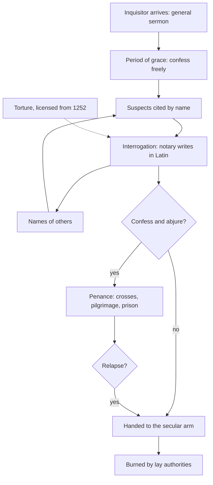

# Church History · Lesson 5.3: Heresy, inquisition, and the Jews

> ⏱ ~15 min · Module 5: Papal monarchy and its crisis · Builds on: [5.1 Papal monarchy](05-01-papal-monarchy-innocent-iii-to-boniface-viii.md), [5.2 Friars and universities](05-02-friars-and-universities.md) · Unlocks: [5.4 Avignon, the Great Schism, and the councils](05-04-avignon-the-great-schism-and-the-councils.md), [6.5 The Spanish and Roman Inquisitions](06-05-the-spanish-and-roman-inquisitions.md)

## Why this matters

Between about 1140 and 1320 the Latin Church built machinery for finding, judging and punishing Christians who dissented from it: a crusade against fellow Christians, papally commissioned inquisitors, and, from 1252, papal permission for torture. In the same decades Jewish books were burned in Paris and whole Jewish communities were expelled from England and France. The order here is facts, then the historians' debate, then the Church's later acknowledgement. The evidence has an unusual problem: much of what we know about the dissenters comes from the records of the people who hunted them. So the hard question is not only *what was done* but *whether the enemy was what the prosecutors said it was*.

## The idea

Keep three categories apart, as medieval lawyers did.

- **Heretics** were baptized Christians who obstinately held what the Church had condemned. Because baptism made them members, the Church claimed jurisdiction over them. The two movements that mattered most were the **Waldensians**, followers of Valdes, a Lyon merchant who gave away his wealth around 1173 to preach poverty, and the **Cathars** of Languedoc and northern Italy, whom their opponents described as dualists who held the material world to be evil. Both were condemned in Lucius III's decretal *Ad abolendam* (Verona, 4 November 1184), the Waldensians for preaching without licence. The Cathars' holy men called themselves "good men"; their opponents called them "perfect".
- **Jews** were not heretics, because they had never been baptized. Teaching going back to Augustine held that they were to be tolerated as witnesses to the Scriptures. Papal letters opening with the words *Sicut Judaeis*, first issued around 1120 and reissued by many popes, forbade forced baptism and violence against them. The pressure on Jews in this period came through other channels: Lateran IV's distinguishing dress (1215, told in [5.1](05-01-papal-monarchy-innocent-iii-to-boniface-viii.md)), attacks on the Talmud, and the fiscal policy of kings.
- **Inquisition** first names a *procedure*, not an office. In the older *accusatio* a private accuser brought the case and risked punishment if it failed. In *inquisitio* the judge opened the case himself, on public rumour, and questioned witnesses. The "medieval Inquisition" was never a single institution. It was a series of papal commissions to individual inquisitors, mostly Dominican and Franciscan friars ([5.2](05-02-friars-and-universities.md)). A central Roman office came only in 1542 ([6.5](06-05-the-spanish-and-roman-inquisitions.md)).

## Source

Caesarius of Heisterbach, a Cistercian monk in the Rhineland, *Dialogue on Miracles* 5.21, written c. 1219–1223 (trans. H. von E. Scott and C. C. Swinton Bland, 1929):

> In the year of our Lord 1210, a crusade was preached against the Albigenses throughout Germany and France ... When they came to the great city of Beziers; which is said to have contained more than a hundred thousand men, they laid siege to it ... When they discovered, from the admissions of some of them, that there were Catholics mingled with the heretics, they said to the abbot, "Sir, what shall we do, for we cannot distinguish between the faithful and the heretics." The abbot, like the others, was afraid that many, in fear of death, would pretend to be Catholics, and after their departure, would return to their heresy, and is said to have replied: "Kill them all; for the Lord knoweth them that are His (2 Tim. ii. 19)!" and so countless numbers in that town were slain.

The most famous sentence in medieval church history: apply the [four questions](../reference.md#four-questions-for-a-source) before quoting it, as Example 2 does.

## What happened

1. **1208–1209: the crusade is called.** After the papal legate Peter of Castelnau was murdered in January 1208, Innocent III called for a crusade against the heretics of Languedoc and the lords who sheltered them. This was the [Albigensian Crusade](../reference.md#albigensian-crusade). *In words:* the crusade indulgence of [4.3](04-03-the-crusades.md), turned inward.
2. **22 July 1209: Béziers.** The crusading army, whose spiritual leader was Arnaud Amalric, abbot of Cîteaux and papal legate, took the town by assault and killed its people, including those who had sheltered in the churches. Arnaud's own report to Innocent put the dead at nearly 20,000. The massacre itself is not in doubt. The figure is: modern estimates of the town's whole population run to about 10,000–14,500, and some inhabitants escaped. The true toll was in the thousands, certainly fewer than Arnaud claimed.
3. **1209–1229: a war of conquest.** Under Simon de Montfort the crusade became a northern French conquest of the south. The Treaty of Paris (1229) ended it and bound the count of Toulouse to pursue heresy. The Cathar refuge of Montségur fell in March 1244, and about 200 of those inside who refused to recant were burned.
4. **1231–1233: papal inquisitors.** Gregory IX's *Excommunicamus* (1231) set penalties for heretics, and from 1233 he commissioned Dominicans as inquisitors for southern France. In 1245–1246 two of them questioned more than five thousand people from the Lauragais at Toulouse.
5. **15 May 1252: *Ad extirpanda*.** After Peter of Verona, an inquisitor in Lombardy, was murdered in April 1252, Innocent IV authorized the civil authorities of Italian cities to use [torture](../reference.md#ad-extirpanda) to extract confessions and names from suspected heretics. The bull set limits: no loss of limb and no danger to life. Lay officials, not friars, applied it. *In words:* Roman law already used torture; the bull brought it into heresy proceedings with papal sanction.
6. **1239–1242: the Talmud on trial.** Nicholas Donin, a convert from Judaism, sent Gregory IX charges against the Talmud; of the rulers the pope wrote to, only Louis IX acted. After a hearing in Paris in June 1240 in which rabbis led by Yehiel of Paris answered Donin, some twenty-four cartloads of Hebrew manuscripts were burned in Paris in 1242.
7. **1290 and 1306: expulsions.** Edward I expelled the roughly 2,000–3,000 Jews of England by edict of 18 July 1290. Philip IV expelled France's far larger community on 22 July 1306, seizing its property and the debts owed to it. Both were royal acts with fiscal motives, not papal ones. The English case is told as a credit story in [`history-of-debt` 2.2](../../history-of-debt/lessons/02-02-jewish-lenders-and-the-monti-di-pieta.md).
8. **1307–1325: the inquisitors' records at their fullest.** Bernard Gui was inquisitor at Toulouse from 1307 to 1323 and probably finished his manual, the *Practica*, by early 1324. Jacques Fournier, bishop of Pamiers and later Pope Benedict XII, ran an inquisition from 1318 to 1325 whose [register](../reference.md#fournier-register) survives in the Vatican Library.

## Picture: the inquisitorial procedure

The procedure, as the manuals describe it:

Two features matter. The loop from D back to C: each confession supplied the next suspects. And the Church never itself executed anyone. It "relinquished" the obstinate and the relapsed to lay authorities, knowing what they would do. The distinction was real to canonists; it does not reduce the Church's responsibility for the outcome.

## The historians' debate

**Moore's [persecuting society](../reference.md#persecuting-society).** R. I. Moore's *The Formation of a Persecuting Society* (1987; revised 2007) argues that between about 950 and 1250 Latin Europe learned to persecute. Heretics, Jews and lepers were defined as threats and pursued by similar methods, driven less by popular hatred than by the clerks of expanding papal and royal governments, for whom a defined enemy justified new power. Critics grant the pattern but doubt the direction: the Rhineland massacres of 1096 ([4.3](04-03-the-crusades.md)) were popular violence that some bishops tried to stop.

**Was there a Cathar church?** This is the sharper dispute, the [Cathar church debate](../reference.md#cathar-church-debate).

| Position | Claim | Key evidence |
|---|---|---|
| **Pegg** (*The Corruption of Angels*, 2001; *A Most Holy War*, 2008) | No organized dualist "Cathar church" existed in Languedoc. The "good men" were local holy men in a world where orthodox and heterodox piety mixed. The system of dualist doctrine was supplied largely by polemicists and by inquisitors' questions. | The 1245–1246 depositions: villagers describe honouring good men, rarely a theology. The questions were fixed in advance, and the answers were translated from Occitan into Latin by notaries. |
| **Hamilton** (on Saint-Félix, 1978, and on the Bogomils) | A real dualist church existed, with bishops and dioceses, linked to the Bogomils of the Balkans and Byzantium. | Texts written by dualists themselves, such as the Italian *Book of the Two Principles* and Cathar rituals in Latin and Occitan. The account of a council at Saint-Félix where the Bogomil *papa* Nicetas ordained bishops, which Hamilton defends as genuine and dates to about 1174–1177. |

Moore's later *The War on Heresy* (2012) moved to the sceptical side. Both sides argued it out in *Cathars in Question* (ed. Antonio Sennis, 2016). The crux is what the inquisitors' records can bear. If testimony was shaped by the questions, the records show the prosecutors' categories. If the independent dualist texts describe the same church, the categories were not invented. Neither side denies the persecution: the people killed at Béziers and Montségur, and those sentenced at Toulouse, were real either way.

**The later acknowledgement.** On the Day of Pardon, 12 March 2000, John Paul II's liturgy included a confession of sins "committed in the service of truth", naming intolerance and violence against dissenters, and a separate confession of sins against the Jewish people. In a letter of 15 June 2004, on the proceedings of a 1998 Vatican symposium on the Inquisition, he wrote that asking forgiveness requires first knowing the facts exactly (section 2): this lesson's order.

## Worked examples

**Example 1 (clean: reading the Gui figures).** Gui's *Book of Sentences* records his public verdicts at Toulouse, 1308–1323. Modern studies count about 636 people convicted, on some 900 or more counts. At most 45 were handed to the secular arm and burned; some counts give 41 or 42, depending on how the relapsed and the dead are classed. Some 307 were sentenced to prison and 143 to wear crosses sewn on their clothes. Fournier's tribunal, over roughly seven years and 578 interrogations, sent five people to be burned. Execution was the exception, reserved chiefly for the relapsed and the obstinate. Whether that made the system mild, the counts alone cannot say.

**Example 2 (hard: "Kill them all").** *Author:* a Rhineland Cistercian who never went to Languedoc. *Date:* c. 1219–1223, a decade or more after 1209. *Audience and purpose:* novices, in a book of edifying stories. *What it can establish:* what a German monk believed, and approved of, about the massacre. Now the text's own signals. He misdates the crusade to 1210–1211. He inflates the town to more than a hundred thousand. And he hedges the saying itself: the abbot "is said to have replied". Neither Arnaud's own report nor the contemporary crusade chronicler Peter of Vaux-de-Cernay records the words. So most historians treat the line as unverified and probably apocryphal. The opposite error is harder to see: dismissing the quotation acquits no one. The massacre is documented by the legate's own letter, which reports the killing as part of the victory. And Caesarius's gloss, that the abbot feared false Catholics would slip away, shows that a Cistercian audience could find such an order reasonable. The saying is weak evidence about Arnaud and strong evidence about attitudes.

## Watch out

- **"The Inquisition" was not one body in this period.** Say "papal inquisitors" or name the tribunal; the Spanish (1478) and Roman (1542) institutions came later ([6.5](06-05-the-spanish-and-roman-inquisitions.md)).
- **Relinquishment is not innocence.** Handing the condemned to the secular arm assigned the act to lay officials, but Lateran IV (canon 3) threatened rulers who failed to purge heresy with the loss of their lands.
- **Don't fold the Jews into heresy.** Inquisitors could act against Jews only in narrow cases, such as converts who returned to Judaism. The Talmud trial and the expulsions came through papal letters and royal power.

## One-liner

> The medieval Church built a procedure to find heretics, and the records it made are the best evidence both of what it did and of how far it invented whom it was hunting.

## Problems

**P1 (🟢) *(Formal (a) · Exegetical (b).)*** Bernard Gui convicted about 636 people at Toulouse (1308–1323). Counts of those handed to the secular arm range from 41 to 45; 307 were sentenced to prison.
(a) Compute the share of convicted people executed at the low and high counts, and the share imprisoned, each to one decimal place of a percent.
(b) An invented tour-guide script: *"Gui's own record proves that the medieval inquisitors were lenient."* Name one thing in the figures that tells against the claim, and one thing the claim needs that the figures cannot show. 100 words or fewer.

**P2 (🟡) *(Exegetical.)*** Pegg and Hamilton disagree about whether a Cathar church existed. (a) Name the single premise about the inquisitorial records that Pegg needs and Hamilton must deny or weaken. (b) Name one kind of evidence each side can cite that does *not* depend on inquisitors' questions, or say why that kind of evidence is scarce for one side. 150 words or fewer in total.

**P3 (🔴, optional) *(Exegetical (a) · Evaluative (b).)*** An invented placard in a museum in Languedoc:

> "On 22 July 1209 the abbot Arnaud Amalric ordered the crusaders to kill all 20,000 people of Béziers, crying 'Kill them all, God will know his own.' His words, reported by those who heard them, sum up the Church's war on the Cathars."

(a) Identify three claims in the placard the evidence does not support, and give the correction for each. (b) Is "sum up the Church's war on the Cathars" a defensible judgement even if the words were never spoken? 150 words or fewer, any verdict.

Solutions

**P1** *(Formal (a) · Exegetical (b).)*

(a) Low count: $41/636 = 0.0645$, so **6.4 percent**. High count: $45/636 = 0.0708$, so **7.1 percent**. Prison: $307/636 = 0.4827$, so **48.3 percent**. (Computed in Python; 42 gives 6.6 percent.)

**Must hit, strict (b):** *against the claim, from the figures:* nearly half of those convicted (48.3 percent) were imprisoned, and 143 more were sentenced to wear crosses, so a low execution rate is not a low punishment rate. *What the figures cannot show:* any one of (1) the *severity* of the non-capital penalties, such as how long and how harsh the prison terms were (some were for life) and what years of wearing crosses cost; (2) the *deterrent* effect, since the threat of burning for relapse is what made penance enforceable; (3) *representativeness*, since this is one tribunal in one period and excludes the crusade's killings at Béziers and Montségur; (4) *who was never tried*, such as those who fled.
**Wrong turns:** treating a low execution rate as proof of a lenient system; computing shares of the roughly 900 counts instead of the 636 people; saying the figures are unreliable, when they are the tribunal's own record.
**Model answer:** (a) 6.4 percent at 41 executions, 7.1 percent at 45, and 48.3 percent imprisoned. (b) Against the claim: almost half of those convicted went to prison, and 143 more wore crosses, so few executions does not mean light punishment. What the claim needs and the figures cannot show: how harsh the lesser penalties were in practice. The counts do not say how long prisoners were held or in what conditions, and they cannot measure deterrence. The fire for relapse is what made every lesser sentence stick.

---

**P2** *(Exegetical.)*

**Must hit, strict (a):** Pegg needs the premise that the inquisitors' fixed questions (and the notaries' Latin translation) shaped the testimony, so that the dualist system in the records reflects the prosecutors' categories more than the deponents' beliefs. Hamilton must deny or weaken it: the records largely report something that was really there.
**Must hit, strict (b):** for Hamilton, texts written by dualists themselves, such as the *Book of the Two Principles* and the Cathar rituals, or the Saint-Félix account and the links to the Bogomils. For Pegg, the scarcity point: villagers' own beliefs survive almost only in depositions, so independent evidence from Languedoc's ordinary believers is thin. That thinness is the ground of his argument.
**Wrong turns:** saying Pegg denies that anyone was persecuted; treating a text from a hostile polemicist as independent of the prosecutors' categories; saying Hamilton accepts the records uncritically.
**Model answer:** (a) The premise is that the questions produced the answers: the dualist system in the depositions came from the inquisitors' questionnaires and the notaries' translation, not from the villagers. Hamilton must weaken it. (b) Hamilton can point to dualist texts written by insiders, such as the *Book of the Two Principles* and the rituals, and to the Saint-Félix account of Nicetas ordaining bishops. Independent evidence for Pegg is scarce by nature, since villagers left few records of their own. His case rests on reading the depositions against their questions.

---

**P3** *(Exegetical (a) · Evaluative (b).)*

**Must hit, strict (a):** (1) "reported by those who heard them": the only source is Caesarius of Heisterbach, writing c. 1219–1223 in the Rhineland, who says the abbot "is said to have replied"; no eyewitness records it. (2) "all 20,000 people": 20,000 is Arnaud's own report of the dead, not the population; the town probably held about 10,000–14,500, and some escaped. (3) "ordered": that Arnaud gave such an order is unverified; the massacre is documented, the command is not. The date and place are correct, so an answer that merges (1) and (3) has found only two errors.
**Must hit, any verdict (b):** separate the saying's historicity from its representativeness; weigh what the documented record shows, such as the legate's own report of the killing as a victory, Caesarius's approving gloss, and later sieges and burnings, against the parts of the war it would misdescribe, such as the conquest's political aims and the later inquisitors' preference for penance over killing.
**Wrong turns:** concluding that because the quotation is doubtful the massacre is too; treating Caesarius as an eyewitness; grading the placard wrong for using the quotation at all rather than for presenting it as attested.
**Model answer (a):** The words are not reported by hearers: the only source is Caesarius, a Rhineland monk writing a decade later, who says the abbot "is said to have replied". 20,000 is Arnaud's own inflated count of the dead, not the town's population, which was probably 10,000–14,500, and some escaped. And no reliable source shows Arnaud giving the order; the massacre is documented, the command is not.
**Model answer (b), one of several:** Partly. The saying is unverified, but the attitude it expresses is documented: Arnaud reported the slaughter to the pope as part of a victory, and Caesarius, writing for novices, thought the reasoning sound. As a summary of 1209 it is fair. As a summary of the whole war it is not. The war was also a northern conquest of the south, and the inquisitors who followed mostly imposed penance, not death. A defensible placard would quote it as "attributed, a decade later" and let the legate's letter carry the charge.

## Flashback

**From Lesson [5.1](05-01-papal-monarchy-innocent-iii-to-boniface-viii.md) (Papal monarchy: Innocent III to Boniface VIII):** *(Exegetical.)* (a) Put these in chronological order, with a year for each: *Unam Sanctam*; John of England resigns his kingdom to the pope as a fief; *Etsi de statu*; the seizure of Boniface VIII at Anagni; Innocent III annuls Magna Carta (*Etsi carissimus*); *Meruit*; *Clericis laicos*. (b) Two of these documents are later papal texts that narrowed an earlier one on the list. Name both pairs, and say in one sentence each what the later text conceded.

Solution

**Must hit, strict (a):** John's resignation of England and Ireland (1213); annulment of Magna Carta (1215); *Clericis laicos* (1296); *Etsi de statu* (1297); *Unam Sanctam* (1302); Anagni (1303); *Meruit* (1306). Years must be right; month-level precision is not required.
**Must hit, strict (b):** (1) *Clericis laicos* narrowed by *Etsi de statu*, both Boniface VIII's: the king could tax his clergy without consulting Rome in a case of necessity, and the king himself judged the necessity. (2) *Unam Sanctam* narrowed by Clement V's *Meruit*: the bull was declared to have placed France under the Roman Church no differently than before, so it created no new subjection of the French king or kingdom.
**Wrong turns:** pairing the Magna Carta annulment with John's surrender (the annulment defended the fief; it did not narrow it); naming *Rex gloriae* (1311) as the text that narrowed *Unam Sanctam*, when that bull exonerated Philip's zeal and closed the posthumous trial of Boniface; placing *Etsi de statu* after Anagni.
**Model answer:** (a) 1213 John's surrender; 1215 Magna Carta annulled; 1296 *Clericis laicos*; 1297 *Etsi de statu*; 1302 *Unam Sanctam*; 1303 Anagni; 1306 *Meruit*. (b) *Etsi de statu* narrowed *Clericis laicos*: in an emergency the French king could tax his clergy without papal consent, and he decided when the emergency existed. *Meruit* narrowed *Unam Sanctam*: Clement V declared that the bull left France subject to the Roman Church no differently than it had been before 1302.

## Connections

- **Backward:** [5.1](05-01-papal-monarchy-innocent-iii-to-boniface-viii.md) gave Innocent III's papacy and Lateran IV's canons on heresy and on Jews' dress; this lesson follows the machinery they set up. [5.2](05-02-friars-and-universities.md) founded the Dominicans who staffed it. [4.3](04-03-the-crusades.md) supplied the crusade indulgence, here turned on Christians, and the 1096 massacres that test Moore's thesis.
- **Forward:** [5.4](05-04-avignon-the-great-schism-and-the-councils.md) moves to the Avignon papacy, where Jacques Fournier reigned as Benedict XII from 1334, and to the suppression of the Templars. [6.5](06-05-the-spanish-and-roman-inquisitions.md) takes up the early modern inquisitions and the popular body counts. The Day of Pardon returns in [9.3](09-03-after-the-council.md).
- **Sideways:** the credit history behind the English expulsion is [`history-of-debt` 2.2](../../history-of-debt/lessons/02-02-jewish-lenders-and-the-monti-di-pieta.md). [`apologetics-foundations`](../../apologetics-foundations/syllabus.md) 6.4 is assigned the expulsions and the Talmud burnings as the record a Catholic must concede before stating the Church's teaching on the Jewish people.
