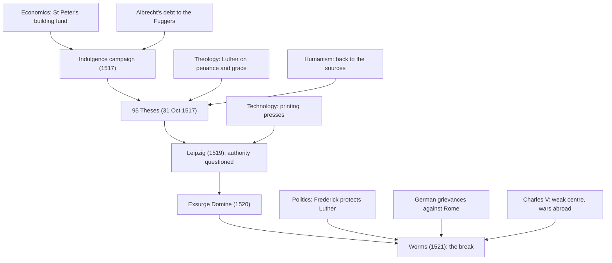

# Church History · Lesson 6.1: The late medieval Church and Luther's protest

> ⏱ ~15 min · Module 6: The Reformations · Builds on: [5.4 Avignon, the Great Schism, and the councils](05-04-avignon-the-great-schism-and-the-councils.md) · Unlocks: [6.2 Reformations beyond Wittenberg](06-02-reformations-beyond-wittenberg.md), [6.3 The English Reformations](06-03-the-english-reformations.md), [6.4 Trent and Catholic reform](06-04-trent-and-catholic-reform.md)

## Why this matters

In October 1517 an Augustinian friar who taught Bible at a small new university sent a Latin disputation on indulgences to his archbishop. Within four years he had been condemned by the pope, excommunicated, and put under the emperor's ban. Western Christendom never reunited. The popular explanation is simple: the Church was rotten, and Luther pushed over something already falling. Most historians working since the 1960s think that story is wrong, or at least badly incomplete. This lesson is about why, and about how an academic protest became a break.

## The idea

Keep two questions apart. **Was the Church on the eve of 1517 in decay?** And **why did this protest, unlike earlier ones, become a schism?** The popular story answers the second question with the first. The evidence does not allow that shortcut.

On the first question, the record splits in two. **At the top**, the scandals were real and are not in dispute. Alexander VI (Rodrigo Borgia, pope 1492–1503) had acknowledged children, among them Cesare and Lucrezia, and advanced them openly. Julius II (1503–1513) led papal armies in person; he also laid the foundation stone of the new St Peter's in 1506. Leo X (Giovanni de' Medici, 1513–1521) had been made a cardinal at thirteen. Bishops held several sees at once and lived away from them. The Fifth Lateran Council (1512–1517) passed reform decrees that were barely enforced; it closed in March 1517.

**At the bottom**, the picture looks different. Bernd Moeller, a Protestant church historian, argued in a 1965 essay that Germany around 1500 was one of the most churchly societies of the Middle Ages: a boom in pious foundations, confraternities and church building in the later fifteenth century. Eamon Duffy's *The Stripping of the Altars* (1992) made the same case for England, from wills, churchwardens' accounts and devotional books: traditional religion was vigorous and popular, not hollow. Diarmaid MacCulloch, no Catholic apologist, agrees that the old Church was strong, and that only an idea of great force could have overcome it. This is the [decay debate](../reference.md#the-decay-debate). Its current consensus is that there were real abuses and a thriving piety, both at once.

Humanism belongs to both sides of that line. Erasmus mocked worldly clergy and mechanical devotion in *The Praise of Folly* (1511), and his Greek New Testament (1516) sent readers back to the sources. He wanted the Church reformed from within, and later refused to follow Luther out of it.

So the second question needs its own answer: a particular indulgence, a particular theology, a particular prince, and the printing press.

## Source

Luther's *Disputation on the Power and Efficacy of Indulgences* (the 95 Theses), 31 October 1517, theses 27 and 50, in the translation of the *Works of Martin Luther* (Philadelphia, 1915), public domain:

> 27. They preach man who say that so soon as the penny jingles into the money-box, the soul flies out [of purgatory].
>
> 50. Christians are to be taught that if the pope knew the exactions of the pardon-preachers, he would rather that St. Peter's church should go to ashes, than that it should be built up with the skin, flesh and bones of his sheep.

"They preach man" renders the Latin *hominem praedicant*: they preach a human invention, not the Church's teaching. Notice where thesis 50 places the pope. He is someone who *would* object *if he knew*. In October 1517 Luther wrote as a critic of the preachers, appealing to the pope against them. Both theses are aimed at preaching; neither says a word about the pope's authority as such. How fast that changed is the story of 1518–1521.

## The record

1. **The St Peter's indulgence.** An [indulgence](../reference.md#st-peters-indulgence) was a remission, granted by the Church, of the temporal punishment still due for sins already forgiven, applicable to oneself or, by way of intercession, to the dead in purgatory. Julius II had proclaimed one to fund the rebuilding of St Peter's; Leo X renewed it. *In words:* this was a normal instrument of church finance, not a novelty invented in 1517. The doctrine behind it, the treasury of merit, belongs to [`theology-of-debt`](../../theology-of-debt/syllabus.md) (3.5–3.6).
2. **Albrecht's bargain.** Albrecht of Brandenburg became archbishop of Magdeburg and administrator of Halberstadt in 1513, and was elected archbishop of Mainz in 1514, holding three sees against canon law. The dispensation and the fees for Mainz were paid with money borrowed from the Fugger bank of Augsburg (the figures in the literature vary). A papal grant of 1515 let the indulgence be preached in his provinces, with half the proceeds going to Albrecht to repay the Fuggers. *In words:* the campaign joined a pluralist archbishop's debt to the basilica's building fund, and a Fugger agent held a key to the collection chest.
3. **Tetzel.** The Dominican Johann Tetzel preached it in 1517. Frederick the Wise, elector of Saxony, barred the campaign from his lands, but Tetzel preached at Jüterbog, just over the border, from April, and Wittenbergers went there to buy letters.
4. **31 October 1517.** Luther sent the theses to Albrecht with a covering letter dated that day, which survives. Albrecht forwarded them to Rome. By the turn of the year they were in print at Leipzig, Nuremberg and Basel.
5. **Print.** In spring 1518 Luther put the argument into a short German pamphlet, the *Sermon on Indulgence and Grace*. It was reprinted about fourteen times in 1518 alone (Andrew Pettegree, *Brand Luther*, 2015). *In words:* a Latin disputation for scholars became a German argument for everyone who could read or be read to.
6. **Escalation, 1518–1519.** Cardinal Cajetan examined Luther at Augsburg in October 1518 and failed to get a recantation. At the Leipzig disputation (June–July 1519), Johann Eck drew Luther into saying that the papacy's primacy was of human right and that the Council of Constance had erred in condemning Hus ([5.4](05-04-avignon-the-great-schism-and-the-councils.md)). *In words:* the quarrel moved from how indulgences were preached to who decides what the Church teaches.
7. **Condemnation.** Leo X's bull [*Exsurge Domine*](../reference.md#exsurge-domine) (15 June 1520) condemned 41 propositions from Luther's writings under a string of censures (heretical, scandalous, false, offensive to pious ears, misleading to the simple) without saying which censure fit which proposition, and gave him sixty days to submit. Luther burned it at Wittenberg on 10 December 1520. *Decet Romanum Pontificem* excommunicated him on 3 January 1521.
8. **Worms.** Summoned under safe conduct to the imperial [Diet of Worms](../reference.md#diet-of-worms), Luther appeared before Charles V on 17 April 1521, asked for time, and on 18 April refused to recant unless convinced by Scripture or plain reason. The Edict of Worms (May 1521) put him under the imperial ban. Frederick had him seized on the road and hidden in the Wartburg.

What each side held about justification, the treasury and authority, argued out, is [`apologetics-catholic-claims`](../../apologetics-catholic-claims/syllabus.md) (Module 3, 6.3). Here the question is only how the dispute moved events.

## The causal chain

Four kinds of cause, and where they meet. No single strand produces the break.

Read the arrows as "made possible", not "made inevitable". Luther's protest ran on theology and money. His survival ran on politics: Hus in 1415 had also had a safe conduct and was burned, while Luther had a prince who would not hand him over and an emperor who could not afford to alienate the German princes.

## Worked examples

**Example 1 (clean): why this indulgence?** Indulgences had been preached for centuries without a schism. Run the chain. The money went partly to a building in Rome and partly to service an archbishop's debt for an uncanonical accumulation of sees, which put the Church's financial machinery in plain view. Its preacher pressed the offer for the dead hard. The Catholic Encyclopedia (1912), following the Catholic historian Nikolaus Paulus, concluded that Tetzel's teaching on indulgences for the living was correct. But his teaching for the dead rested on a school opinion that went beyond the papal bulls and that Cajetan rejected. Wittenberg lay a few miles from where he preached, and the man who objected held a chair of theology. Every link is ordinary; together they are unusual. That is what a multi-causal explanation looks like.

**Example 2 (hard): did Luther post the theses, and did he say "Here I stand"?** Two famous images, and the evidence strains under both.

*The posting.* The Catholic historian Erwin Iserloh argued in 1961 that Luther never nailed the theses to the castle-church door. Luther himself never describes doing so. The first account is Philip Melanchthon's, in a 1546 preface to Luther's collected Latin works, written after Luther's death. Melanchthon did not reach Wittenberg until August 1518. On Iserloh's reading, Luther went through proper channels and published only when the bishops did not reply. In 2006 Martin Treu drew attention to a handwritten note by Luther's secretary Georg Rörer, probably from 1544: theses on indulgences were posted on the doors of the Wittenberg *churches* on the eve of All Saints, 1517. Rörer was not an eyewitness either. But he wrote in Luther's lifetime, and his plural matches the university's rule that disputation notices went up on church doors. Many historians now think a posting probably happened, as routine academic practice rather than a defiant act. This is the [posting dispute](../reference.md#the-posting-dispute).

*The words.* The notes taken in the hall end Luther's reply with a plea for God's help and an Amen. "Here I stand, I cannot do otherwise" first appears in the earliest printed Wittenberg report. Roland Bainton, Luther's great Protestant biographer, conceded that the words were "not recorded on the spot", and argued only that they might still be genuine. The substance of the refusal is certain; the famous sentence is not.

## Watch out

- **Decay at the top is not decay throughout.** Papal and episcopal scandal is well documented; so is intense lay piety. A thesis that argues from Alexander VI to "people had stopped believing" has changed its evidence halfway.
- **1517 was not a break.** In 1517 Luther was a friar asking for a disputation, appealing to the pope against the preachers (thesis 50). The break comes in 1519–1521.
- **Two Johanns.** The Eck of Leipzig (1519) was Johann Eck, the Ingolstadt theologian. The official who questioned Luther at Worms was Johann von der Ecken, of the archbishop of Trier's household.
- **The Tetzel couplet is attributed, not attested.** "As soon as the gold in the casket rings, / The rescued soul to heaven springs" (in the Catholic Encyclopedia's rendering) survives in no text of Tetzel's. Put it in quotation marks as his words and you have overclaimed.

## One-liner

> The late medieval Church was both scandalous at the top and devout at the bottom; an indulgence campaign built on an archbishop's debt set off an academic protest, and printing, princes and a papacy that answered with condemnation turned it into a break.

## Problems

**P1 (🟢)** Thesis 27 (1915 translation) reads: "They preach man who say that so soon as the penny jingles into the money-box, the soul flies out [of purgatory]." A museum placard beside an indulgence chest reads: *Tetzel told the crowds: "As soon as the coin in the coffer rings, the soul from purgatory springs."*
(a) *(Exegetical)* Does thesis 27 name Tetzel? Say what it establishes about indulgence preaching in 1517 and what it cannot establish.
(b) *(Exegetical)* Using the lesson's evidence, say what is wrong with the placard's wording and rewrite its caption accurately.
Two sentences per part.

**P2 (🟡)** The posting dispute.
(a) *(Exegetical)* For Melanchthon's 1546 account and Rörer's note, give each one's approximate date and whether its author was an eyewitness. Then name two features of Rörer's note that give it weight Melanchthon's account lacks.
(b) *(Evaluative)* Does it matter to the history of the Reformation whether the theses were posted on a door? 150 words or fewer, any verdict.

**P3 (🔴, optional) *(Exegetical)*** An invented documentary voice-over:

> "By 1517 the Church was rotten to its roots. Popes kept mistresses and fought wars, priests sold salvation for cash, and ordinary Christians had long since stopped believing any of it. Luther only had to push. The Reformation was simply waiting to happen."

Name the assumption doing the work, give two pieces of evidence from the lesson that strain it (from different kinds of source), and say what the voice-over gets right. 150 words or fewer.

Solutions

**P1** *(Exegetical (a) · Exegetical (b))*

**Must hit, strict (a):** it does not name Tetzel or anyone else; it attacks "they" who preach. It establishes that Luther believed, in October 1517, that some preachers were promising instant release of souls for payment, and that he judged this contrary to church teaching ("they preach man"). It cannot establish the exact words any preacher used, or that Tetzel himself used them.
**Must hit, strict (b):** the couplet is attributed, not attested. No text of Tetzel's contains it, and the Catholic Encyclopedia (1912), following Paulus, called it verbally spurious while holding that Tetzel did teach its substance for the dead. An accurate caption marks it as a saying attributed to him, or as a summary of his teaching.
**Wrong turns:** reading thesis 27 as an eyewitness transcript of Tetzel; overcorrecting to "Tetzel never taught anything like this", which the Paulus/Catholic Encyclopedia judgement about his teaching for the dead contradicts.
**Model answer:** (a) No; thesis 27 attacks unnamed preachers, so it shows only that Luther believed some were promising instant release for the dead in exchange for money, and that he called this a human invention. It cannot show what words anyone used, or that Tetzel used these. (b) The placard presents an attributed rhyme as Tetzel's recorded words, though no text of his contains it. Better: *A couplet later attributed to Tetzel ran: "As soon as the coin in the coffer rings, the soul from purgatory springs." Its words are not his, but he did teach that a payment for the dead could win their release.*

---

**P2** *(Exegetical (a) · Evaluative (b))*

**Must hit, strict (a):** Melanchthon: 1546, after Luther's death; not an eyewitness, since he arrived in Wittenberg in August 1518. Rörer: probably 1544, in Luther's lifetime; not an eyewitness either. Rörer's weight: (i) it is earlier, written while Luther was alive and among his closest collaborators, so it does not derive from Melanchthon's published account; (ii) its plural, "doors of the churches", matches the university's rule that disputation notices went up on church doors, so it describes routine practice rather than a set-piece legend.
**Must hit, any verdict (b):** say what the posting question could change: whether the act of 31 October was a public challenge or a private appeal through proper channels. Say what it does not change: the letter to Albrecht, the forwarding to Rome, and the printings of late 1517 and 1518 are what actually spread the theses. Reach a verdict about how much weight the posting carries.
**Wrong turns:** calling Rörer an eyewitness; treating Iserloh as having proved that no posting happened; arguing that the posting was the cause of the Reformation's spread.
**Model answer (b), one of several:** It matters less than its fame suggests. What the posting could decide is the character of Luther's act. A notice nailed up for all to see reads as a public challenge; a letter to the archbishop reads as a loyal appeal through channels. Iserloh cared about this because it bears on whether Luther meant to provoke a break. But even a posting would have been routine, since the university's disputation notices went up on church doors, as Rörer's plural implies. And the theses did not travel by the door. They travelled through Albrecht's forwarding to Rome, the printings in Leipzig, Nuremberg and Basel, and the German *Sermon* of 1518. So the question changes how we picture 31 October, not how the protest spread.

---

**P3** *(Exegetical)*

**Must hit, strict:** the assumption is that scandal at the top means religious decay throughout, and that decay makes a break inevitable. Two strains from different kinds of evidence: (i) lay piety: Moeller's evidence of booming foundations, confraternities and church building in Germany; Duffy's wills and churchwardens' accounts for England; or the fact that the indulgence itself sold well, which shows demand, not unbelief; (ii) the contingent path: in 1517 Luther appealed to the pope (thesis 50); the break came through Leipzig, *Exsurge Domine* and Worms; and Luther survived because Frederick protected him and Charles V could not act freely (contrast Hus). What it gets right: the papal scandals (Alexander VI's children, Julius II's wars) and the pluralism behind Albrecht's campaign are real.
**Wrong turns:** denying the scandals; offering two pieces of evidence of the same kind (two papal facts) as if they were different kinds; treating "priests sold salvation" as accurate. The dispute was over remission of temporal punishment, and even Luther's thesis 27 attacks preaching, not the whole Church.
**Model answer:** The voice-over assumes that corruption at the top means decay throughout, and that decay makes a break inevitable. Two kinds of evidence strain it. First, lay religion: Moeller found German foundations, confraternities and church building booming before 1517, and Duffy's wills and parish accounts show English traditional religion flourishing. People who had stopped believing do not endow Masses. Second, the path: in 1517 Luther appealed to the pope against the preachers, and a break came only after Leipzig, *Exsurge Domine* and Worms. He survived because Frederick protected him and Charles V needed the princes, whereas Hus, with a safe conduct, was burned. What it gets right: the Renaissance popes' conduct and Albrecht's uncanonical sees are real and help explain the anger.

## Flashback

**From Lesson [5.4](05-04-avignon-the-great-schism-and-the-councils.md) (Avignon, the Great Schism, and the councils):** *(Evaluative.)* Test the popular claim "During the Great Schism, Christians followed whichever pope they believed had been validly elected." Take as given the obediences around 1390. *Rome:* England, most of the Empire, Hungary, Poland, northern and central Italy, Flanders, Portugal (from 1385). *Avignon:* France, Scotland, Savoy, Castile (from 1381), Aragon (from 1387), Navarre (from 1390). Say what in the record supports the claim, what tells against it, and reach a verdict. 150 words or fewer, any verdict.

Solution

**Must hit, any verdict:** (1) **Evidence against, from the pattern:** the lines follow alliances in the Hundred Years' War. England was Roman, so its enemy Scotland, and France, were Avignonese. Rulers chose, and their clergy and people followed. University theologians mostly sided with their own country. (2) **Evidence for, or at least for sincerity:** the validity of the 1378 election was a real question of fact about fear, and the witnesses were split. The same cardinals testified first one way and then the other, and even Valois, the great modern student of the schism, at first judged it beyond history's power to decide. Saints stood on both sides. (3) **A distinction either verdict needs:** the belief of *individuals* against the choice of *realms*. The map shows how realms chose; it cannot show that individuals chose insincerely.
**Wrong turns:** reading the obediences as a theological split; concluding that because rulers chose, no one believed in his pope; using the modern official list, which counts the Roman line, as if contemporaries could have consulted it.
**Model answer, one of several:** The claim fails for realms and may hold for persons. The obediences track the Hundred Years' War too neatly to be a map of conviction: England Roman, so Scotland Avignonese, with France on Avignon's side. Castile, Aragon and Navarre committed only years later. Rulers chose, clergy and people followed, and theologians mostly backed their own country. But the underlying question was genuinely open. Whether fear voided the vote of April 1378 was disputed by the very cardinals who cast it, and a modern expert long thought it undecidable. So individual Christians, saints included, could sincerely believe in either pope. Verdict: belief was real, but geography decided which belief most people held.

## Connections

- **Backward:** [5.4](05-04-avignon-the-great-schism-and-the-councils.md) supplied the precedents Luther and Eck fought over at Leipzig: Constance's condemnation of Hus under a safe conduct, and the unsettled question of council against pope.
- **Forward:** [6.2](06-02-reformations-beyond-wittenberg.md) follows the protest into the Peasants' War, Zurich, Geneva and the princes' settlement of 1555; [6.3](06-03-the-english-reformations.md) takes up the English case, where Duffy's evidence from parish records is fought over; [6.4](06-04-trent-and-catholic-reform.md) asks how much of Catholic reform was already under way before 1517, and Trent's reform of indulgence preaching.
- **Sideways:** the doctrine of indulgences and the treasury of merit, and Luther's Theses 56–62 against it, are [`theology-of-debt`](../../theology-of-debt/syllabus.md) 3.5–3.6. The Fuggers reappear as lenders to Charles V's 1519 imperial election in [`history-of-debt` 2.4](../../history-of-debt/lessons/02-04-lending-to-kings.md). The doctrinal disputes argued out, including what the Catholic case must concede about the sale of indulgences, are [`apologetics-catholic-claims`](../../apologetics-catholic-claims/syllabus.md). Finding the crux between Iserloh and his critics is the method of [`philosophical-method` 4.3](../../philosophical-method/lessons/04-03-finding-the-crux.md).
