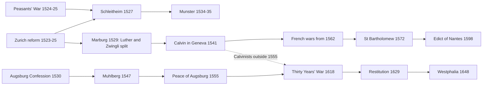

# Church History · Lesson 6.2: Reformations beyond Wittenberg

> ⏱ ~15 min · Module 6: The Reformations · Builds on: [6.1 The late medieval Church and Luther's protest](06-01-the-late-medieval-church-and-luthers-protest.md) · Unlocks: [6.3 The English Reformations](06-03-the-english-reformations.md), [6.4 Trent and Catholic reform](06-04-trent-and-catholic-reform.md)

## Why this matters

By 1600 a child born in Dresden was raised Lutheran, one born in Munich Catholic, one born in Heidelberg Reformed, and none of them had chosen. What decided it was mostly who ruled the ground they were born on. That fact explains why the Catholic Church lost half of Germany but kept Bavaria, Austria and France, and why a century of argument over the Gospel ended in treaties among princes. This lesson maps those reformations and asks how religion came to follow rulers.

## The idea

Luther's protest raised a question he could not settle alone: **who decides what reform means?** Within a decade there were three answers.

- **The magistrate.** Princes in Saxony and Hesse, city councils in Zurich and later Geneva, reformed their churches by law. Historians call this the *magisterial* Reformation. Its theologians disagreed, sometimes bitterly, but all expected Christian rulers to establish true religion.
- **The gathered congregation.** The Anabaptists held that the Church is a community of adult believers who separate from "the world," including its sword. That made them subversive in the eyes of Catholic and Protestant rulers alike.
- **The commons.** In 1524–25 peasants across southern and central Germany read the Gospel as a charter against serfdom and new dues.

The first answer won, because the holders of the sword crushed the other two, Catholic and Protestant princes often fighting side by side. Everything that followed was an argument about *which* rulers could decide, and for whom. The Peace of Augsburg (1555) gave the German princes the choice between two religions and no more. France showed what happened where the ruler could not impose his choice. The Thirty Years' War showed what happened when the 1555 formula stopped fitting the map.

## Source

The Religious [Peace of Augsburg](../reference.md#peace-of-augsburg), 25 September 1555, signed by King Ferdinand on his brother Charles V's authority. Emil Reich's translation (*Select Documents Illustrating Mediaeval and Modern History*, 1905), articles 15, 17 and 24:

> 15. ... let neither his Imperial Majesty nor the Electors, Princes &c. do any violence or harm to any estate of the empire on account of the Augsburg Confession, but let them enjoy their religious belief, liturgy and ceremonies as well as their estates and other rights and privileges in peace ...
>
> 17. However all such as do not belong to the two above named religions shall not be included in the present peace but be totally excluded from it.
>
> 24. In case our subjects whether belonging to the old religion or the Augsburg Confession should intend leaving their homes with their wives and children in order to settle in another place, they shall be hindered neither in the sale of their estates after due payment of the local taxes nor injured in their honour.

Notice who is protected in article 15: *estates*, the princes and cities who sat in the imperial diet. Subjects appear only in article 24, and what they get is the right to leave. Article 17 shuts out everyone else: Anabaptists, and, as Catholics and Lutherans would argue for the next ninety years, Calvinists. The famous formula ***[cuius regio, eius religio](../reference.md#cuius-regio-eius-religio)*** ("whose the realm, his the religion") appears nowhere in the text. A Protestant jurist, Joachim Stephani, coined it around 1600 as a summary.

## What happened

1. **The Peasants' War (1524–25).** Risings in Swabia, Franconia and Thuringia. The Twelve Articles (Memmingen, March 1525) grounded demands on Scripture: an elected pastor, the end of serfdom. Luther's *Admonition to Peace* (April) blamed lords and peasants both. Once the violence spread he wrote *Against the Robbing and Murdering Hordes of Peasants* (May), urging the princes to strike the rebels down. The princes crushed the peasant army at Frankenhausen on 15 May 1525, and Thomas Müntzer was executed later that month. Around 100,000 people died in the war, a commonly cited but rough figure. *In words:* the Reformation would not be a social revolution, and Luther tied his cause to the princes.
2. **Zwingli's Zurich (1519–31).** Zwingli began preaching at the Grossmünster in 1519. The city council ran the Reformation through public disputations (1523) and abolished the Mass in 1525. At Marburg (1529) Luther and Zwingli agreed on fourteen of fifteen articles and split on the Eucharist, so the Protestant camp was already two. Zwingli died in battle at Kappel in 1531.
3. **The Anabaptists (1525–35).** Zwingli's radical students performed the first adult baptisms in Zurich in January 1525. Zurich drowned Felix Manz in January 1527. That February the Schleitheim articles, drafted mainly by Michael Sattler, set out believers' baptism, separation from the world, and refusal of the sword and the oath. Catholic Austrian authorities burned Sattler that May. Then an exception defined the movement in its enemies' eyes: apocalyptic Anabaptists seized Münster (1534–35), proclaimed a New Jerusalem, imposed polygamy and a "king," and were besieged by the Catholic bishop with Lutheran help. The city fell in June 1535.
4. **Calvin's Geneva (1541 on).** Expelled in 1538, Calvin returned in September 1541. His *Ecclesiastical Ordinances* set up pastors, doctors, elders and deacons, and a **consistory** of ministers and lay elders to supervise morals. Geneva burned Michael Servetus for denying the Trinity (1553) and opened its Academy (1559). Its trained pastors carried Reformed Christianity to France, the Netherlands, Scotland, Hungary and the Palatinate. This was an international church ordered by synods, not by the prince who happened to rule.
5. **Emperor versus princes (1530–55).** The Lutheran estates presented the Augsburg Confession in 1530. The emperor beat their Schmalkaldic League at Mühlberg (1547) but could not impose a settlement. A princes' revolt in 1552 forced the Treaty of Passau and then the Peace of Augsburg (1555). Its [ecclesiastical reservation](../reference.md#ecclesiastical-reservation) (article 18) required a Catholic bishop who converted to give up his see, so church lands would not follow him.
6. **France (1562–98).** A king who stayed Catholic faced a Huguenot minority strong among the nobility. Eight wars followed the massacre at Vassy (1562). In the St Bartholomew's Day massacre, from 24 August 1572, Parisian crowds and royal troops killed perhaps 2,000–3,000 Protestants in the capital and thousands more in the provinces; totals are disputed. Henry of Navarre, a Protestant heir, became Catholic in 1593 and granted the [Edict of Nantes](../reference.md#edict-of-nantes) (April 1598): Catholic worship everywhere, Reformed worship in named places, civil rights, and fortified towns for the Huguenots. Louis XIV revoked it in 1685.
7. **The Thirty Years' War (1618–48).** The Bohemian revolt (1618) grew into a European war. Ferdinand II's **Edict of Restitution** (1629) tried to reclaim church lands and shut the Calvinists out. Catholic France then fought Catholic Habsburgs alongside Protestant Sweden. The Empire lost roughly a fifth of its population, mostly to plague and hunger (Peter Wilson's estimate; others run higher).
8. **The [Peace of Westphalia](../reference.md#peace-of-westphalia) (24 October 1648).** The Reformed were admitted to the religious peace. Church property and public worship were fixed as they stood on 1 January 1624, the "normative year," which curbed a ruler's power to convert his subjects. Innocent X protested in the brief *[Zelo domus Dei](../reference.md#zelo-domus-dei)*, dated 26 November 1648 and published about two years later, declaring the clauses that harmed the Church null. The treaty had already declared such protests void, and the protest changed nothing on the ground.

### Why religion followed rulers

Heinz Schilling and Wolfgang Reinhard, working in parallel from the late 1970s, proposed the **[confessionalization](../reference.md#confessionalization)** thesis. Lutheran, Reformed and Catholic territories, they argued, did structurally the *same* things between about 1555 and 1648. Each wrote a confession of faith, trained and inspected its clergy, catechized the young, disciplined morals through consistories or visitations, and policed its borders against the other churches. Rulers backed all this because a uniform church made obedient, identifiable subjects. On this view confessional churches and early modern states built each other. The Electoral Palatinate is the textbook case: Reformed under Frederick III (Heidelberg Catechism, 1563), Lutheran under his son Louis VI (1576), who expelled the Reformed clergy, and Reformed again under the regent John Casimir (1583).

The critics grant much of the machinery and dispute the direction of force. The thesis reads religion from the top down. It struggles with minorities who kept their faith against their ruler, and with parishes that took what they wanted from official reform. It fits the German territories better than France, where a Catholic crown could not produce confessional unity. And it can flatten real theological differences into one "modernizing" process.

## Timeline

Three streams: the radical one is crushed by 1535; the Lutheran-imperial one runs through Augsburg to the war; the Reformed one from Geneva feeds France and the war. The dashed edge is the gap in 1555 that helped make 1618 possible.

## Worked examples

**Example 1 (clean: a Lutheran in Bavaria, 1560).** A Lutheran weaver lives under the Catholic duke of Bavaria. Run the 1555 articles. Article 15 protects his duke's religion, not the weaver's. Article 24 lets him sell his goods, pay the customary dues, and move with his family to a Lutheran territory without loss of honour. That is all. Nothing lets him worship publicly where he is, and a serf could not even rely on leaving without his lord's consent. A Catholic in Saxony gets exactly the same. The peace ended war between *estates*. It gave individuals no freedom of conscience, only of exit.

**Example 2 (hard: France, where the ruler could not decide).** The confessionalization model predicts that the crown's religion becomes the kingdom's. France strains it at every point. The Catholic crown could not suppress a Protestant nobility with armies of its own. The wars' most notorious event, the St Bartholomew's Day massacre, began as a royal strike at Huguenot leaders and spread into popular killing that the court did not control. In Rome, Gregory XIII, told by the French court that a Huguenot plot against the king had been foiled, had a *Te Deum* sung and a commemorative medal struck. Historians still weigh how much the court planned and the crowd did. Then the model inverts: the *heir* changed religion to fit the majority, and his settlement protected a minority rather than imposing one faith.

A confessionalization historian replies that Nantes was a royal act of state, revoked in 1685 by a stronger crown that set out to enforce one faith after all. So the state may have lost the sixteenth century and won the seventeenth. Whether France is a counterexample or a late case is the live question. The Church's acknowledgement came much later. On the eve of the anniversary in 1997, John Paul II told the young people gathered in Paris for World Youth Day that in the massacre Christians had done things the Gospel condemns.

## Watch out

- **"Cuius regio, eius religio" is not in the treaty.** It is a later lawyer's summary, and it overstates the text. Imperial cities that were already mixed had to keep both confessions, and bishops' lands fell under the ecclesiastical reservation.
- **Augsburg was not religious toleration.** It was a truce between two recognized churches, enforced by princes. The only individual right in it was the right to leave.
- **Münster is not "the Anabaptists."** Schleitheim's Anabaptists refused the sword entirely. Treating Münster as typical was the polemic that justified executing pacifists, by Catholics and Protestants alike.
- **Mind the documents' authority.** *Zelo domus Dei* was a brief, not a bull. It was a juridical protest over rights and properties and defined no doctrine. It was dated 1648 but published about two years later.
- **"Paris is well worth a Mass"** is attributed to Henry with no contemporary source.

## One-liner

> The magisterial reformers won because rulers held the sword, and the peace of 1555 made that victory law: the prince chose, the subject could leave, and whoever the treaty left out paid for its gaps until 1648.

## Problems

**P1 (🟢) *(Exegetical.)*** Ferdinand II's Edict of Restitution (6 March 1629), in Emil Reich's translation (1905):

> We are determined for the realisation both of the religious and profane peace to despatch our imperial commissioners into the Empire; to reclaim all the archbishoprics, bishoprics prelacies, monasteries, hospitals and endowments which the Catholics had possessed at the time of the treaty of Passau (1552) and of which they have been illegally deprived ... We herewith declare that the religious peace (of 1555) refers only to the Augsburg Confession as it was submitted to our Ancestor Emperor Charles Vth twenty-fifth of June 1530; and that all other doctrines and sects, whatever names they may have, not included in the Peace are forbidden and cannot be tolerated.

(a) Which article of the 1555 peace quoted in the lesson does the second sentence rely on, and which words in the edict decide which territory is most exposed? (b) Name the two provisions of Westphalia (1648) that undid each of the edict's two moves. Two sentences per part.

**P2 (🟡) *(Exegetical.)*** An invented museum placard:

> "In 1555 the Peace of Augsburg declared *cuius regio, eius religio* and gave every German freedom of religion. Only the Anabaptists, violent fanatics as their seizure of Münster proved, were left out. Peace lasted until 1618, when a Catholic emperor attacked the Protestants."

Identify four factual or interpretive errors, and for each give the correction from the lesson. 150 words or fewer.

**P3 (🔴, optional) *(Exegetical (a) · Evaluative (b).)*** (a) Name the single premise about the *direction* of influence that the confessionalization thesis needs and its critics deny. (b) Evaluate the claim "Europe's religious map in 1600 was drawn by princes, not by preachers," using at least two of the lesson's cases. 150 words or fewer for (b).

Solutions

**P1** *(Exegetical.)*

**Must hit, strict (a):** Article 17, which excludes "all such as do not belong to the two above named religions." The deciding words are "as it was submitted to ... Emperor Charles Vth twenty-fifth of June 1530." Pinning the Augsburg Confession to the 1530 text denies the peace to the Reformed, who claimed its protection. So the Calvinist territories, above all the Palatinate, Reformed since the 1560s, are most exposed. The first sentence's Passau date (1552) adds the church lands taken since then.
**Must hit, strict (b):** Westphalia admitted the Reformed to the religious peace, which answers the second sentence. It fixed church property and worship as of 1 January 1624 (the normative year) instead of 1552, which answers the first.
**Wrong turns:** citing article 24 (emigration), which the edict does not touch; saying the edict aimed at Lutherans generally (it protects the 1530 confession); giving 1648's date of 1555 or 1552 as the normative year.
**Model answer:** (a) It relies on article 17's exclusion of everyone outside "the two above named religions," and the words "as it was submitted ... twenty-fifth of June 1530" make Calvinist territories like the Palatinate the ones shut out. The Passau date then reaches back for every church land secularized since 1552. (b) Westphalia brought the Reformed into the peace, reversing the exclusion. It replaced 1552 with the normative year of 1 January 1624, which left most of the lands the edict claimed in Protestant hands.

---

**P2** *(Exegetical.)*

**Must hit, strict:** any four of: (1) the formula is not in the treaty; Stephani coined it around 1600. (2) The peace gave *estates* the choice, not individuals; subjects got only the right to emigrate (art. 24). (3) Calvinists were also outside it (art. 17 as read by Catholics and Lutherans), not only Anabaptists. (4) Münster was an apocalyptic exception; the Schleitheim Anabaptists refused the sword. (5) The war began with a Bohemian Protestant revolt (1618), not an unprovoked Catholic attack, and the Calvinist gap in the 1555 peace helped cause it.
**Wrong turns:** calling Münster invented (it happened, 1534–35); saying Augsburg protected Calvinists; counting one error twice.
**Model answer:** First, *cuius regio* is a later jurist's summary, not the treaty's words. Second, the peace protected princes and cities, and gave subjects only the right to sell up and leave. Third, Calvinists were also shut out by article 17, and that gap mattered more than the Anabaptists. Fourth, Münster was an apocalyptic exception; mainstream Anabaptists, as at Schleitheim, renounced the sword. (Also: the war began with a Bohemian revolt in 1618, not an emperor's unprovoked attack.)

---

**P3** *(Exegetical (a) · Evaluative (b).)*

**Must hit, strict (a):** that confessional identity was formed mainly from *above*, by rulers and their churches imposing doctrine and discipline. Critics hold that it was also, or chiefly, formed from below and could persist against the ruler.
**Must hit, any verdict (b):** state what "drawn by princes" means (the ruler's choice decided the territory's church). Test it on a case that fits (Germany under 1555, the Palatinate switching with its rulers in 1563, 1576 and 1583) and one that strains (France: a Catholic crown that could not impose, an heir who converted to fit the majority; or Reformed churches spreading by synods and pastors against rulers). Say whether the strain is a counterexample or a delay (1685).
**Wrong turns:** treating "preachers" as irrelevant because princes signed treaties; ignoring that Geneva-trained pastors built churches under hostile kings; grading the verdict.
**Model answer (b), one of several:** In Germany the claim is nearly right. After 1555 the prince chose, and the Palatinate's subjects changed confession three times in twenty years as its rulers did. But the Reformed map outside Germany was drawn by preachers first. Geneva-trained pastors built churches in France under a Catholic crown, strong enough that the crown fought eight wars and conceded Nantes. There the ruler followed the religion: Henry converted to fit the majority. The best verdict is that princes drew the borders wherever they had the force to, and preachers drew them wherever princes did not. 1685 shows that a stronger crown could redraw them later.

## Flashback

**From Lesson [6.1](06-01-the-late-medieval-church-and-luthers-protest.md) (The late medieval Church and Luther's protest):** *(Exegetical.)* Two invented seminar voices. *A:* "Printing made the Reformation. Without the presses, Luther would have been another Hus." *B:* "Politics made it. Without Frederick the Wise, Luther would have burned like Hus, presses or no presses." (a) Say what each voice is actually explaining, using the lesson's distinction between two things that needed explaining after 1517. (b) Name the one premise on which they genuinely clash, and one piece of evidence in the lesson that bears on it. Two sentences per part.

Solution

**Must hit, strict (a):** A explains the **spread** of the protest: the theses in print at Leipzig, Nuremberg and Basel by the turn of the year, and the German *Sermon on Indulgence and Grace*, reprinted about fourteen times in 1518. B explains Luther's **survival**. Hus also had a safe conduct and was burned, whereas Luther had a prince who would not hand him over (Frederick hid him in the Wartburg) and an emperor who could not afford to alienate the princes. The lesson's point is that the protest ran on theology, money and print, and the survival ran on politics, so the two voices partly answer different questions.
**Must hit, strict (b):** the clash is over whether Luther's political protection **depended on** his public following, or would have held without it. A needs it to depend on print (Hus "would have" been Luther's fate because Hus lacked the presses). B needs protection to be independent of print. Relevant evidence, any one: Frederick had barred the indulgence campaign from Saxony before Luther wrote, which suggests interests of his own; the German grievances against Rome and Charles V's weakness existed apart from the pamphlets; or the speed and scale of the 1518 reprints, which made Luther a public cause before Worms.
**Wrong turns:** treating the two voices as simply contradictory; saying Hus lacked a safe conduct; making the posting of the theses the clash (neither voice depends on it).
**Model answer:** (a) A explains why the protest spread: the theses were in print by the end of 1517, and the German *Sermon* ran to about fourteen reprints in 1518. B explains why Luther survived to lead it: Hus had a safe conduct and burned, while Luther had Frederick's protection and an emperor who needed the princes. (b) They clash only on whether that protection depended on Luther's printed following. Frederick had barred the indulgence from Saxony before the theses existed, which suggests reasons of his own, while the reprints of 1518 show Luther was already a public cause by the time he needed protecting.

## Connections

- **Backward:** [6.1](06-01-the-late-medieval-church-and-luthers-protest.md) took Luther to Worms. This lesson follows the question his protest opened, who governs reform, into Zurich, Geneva, Münster and the princely courts. The doctrinal disputes themselves (justification, the Eucharist that split Marburg) are argued out in [`apologetics-catholic-claims`](../../apologetics-catholic-claims/syllabus.md).
- **Forward:** [6.3](06-03-the-english-reformations.md) is the clearest case of a ruler choosing a kingdom's religion, and then choosing again. [6.4](06-04-trent-and-catholic-reform.md) is the Catholic side of confessionalization: seminaries, visitations and catechisms. [6.5](06-05-the-spanish-and-roman-inquisitions.md) covers the tribunals Catholic rulers used to keep their territories uniform.
- **Sideways:** Westphalia is where [`international-relations`](../../international-relations/syllabus.md) starts, and its lesson 1.2 asks how much "Westphalian sovereignty" the treaties actually created. Hobbes's *Leviathan* (1651), written after England's own civil war over religion, answers the same question by making the sovereign the church's supreme pastor: [`history-of-political-thought` 3.4](../../history-of-political-thought/lessons/03-04-hobbes-the-sovereign-and-the-church.md). Locke's toleration, with its exclusions, is the next step in [4.2](../../history-of-political-thought/lessons/04-02-locke-limited-government-and-toleration.md). The sociology of confessional discipline and secularization belongs to [`social-theory`](../../social-theory/syllabus.md).
