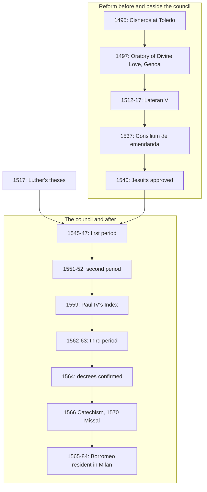

# Church History · Lesson 6.4: Trent and Catholic reform

> ⏱ ~15 min · Module 6: The Reformations · Builds on: [6.1 The late medieval Church and Luther's protest](06-01-the-late-medieval-church-and-luthers-protest.md), [6.3 The English Reformations](06-03-the-english-reformations.md) · Unlocks: [6.5 The Spanish and Roman Inquisitions](06-05-the-spanish-and-roman-inquisitions.md)

## Why this matters

For four hundred years Catholics spoke of the "Tridentine" Church: the Mass, the catechism, the seminary-trained priest, the parish. Much of that shape really does go back to a council that met on and off at Trent between 1545 and 1563. But the council did not do all of it, did not do it at once, and did not start it. This lesson asks what Trent actually did, how its decrees reached a parish, and what historians should call the whole movement.

## The idea

A council is a piece of legislation, not a change of heart. Trent passed two kinds of decree. **Doctrinal decrees**, with canons attached, answered the Reformers' questions: Scripture and tradition, justification, the sacraments. **Reform decrees** were disciplinary law. They told bishops to live in their dioceses, to preach, to visit their parishes, and to train their clergy, and they told parish priests to keep books.

The doctrinal decrees took effect when they were promulgated. The reform decrees took effect only as fast as a bishop, a king and a budget allowed. So "what Trent did" has two answers. On paper it was done by December 1563. In the parishes it was still being done in the eighteenth century.

The second idea is that Catholic reform did not wait for Luther. Reforming bishops, lay confraternities and a reform council were at work before 1517. The Protestant break then changed the pressure, the agenda and the speed. Historians have argued since 1946 over how to name a movement with both roots.

## Source

[Session 23](../reference.md#council-of-trent) (15 July 1563), decree on reformation, chapter 18: the [seminary decree](../reference.md#seminary-decree-of-trent). Waterworth's translation (1848), public domain, abridged:

> the holy Synod ordains, that all cathedral, metropolitan, and other churches greater than these, shall be bound, each according to its means and the extent of the diocese, to maintain, to educate religiously, and to train in ecclesiastical discipline, a certain number of youths of their city and diocese, … in a college to be chosen by the bishop for this purpose … Into this college shall be received such as are at least twelve years old, born in lawful wedlock, and who know how to read and write competently … And It wishes that the children of the poor be principally selected; … that so this college may be a perpetual seminary of ministers of God.

Read it as a historian. It is a **chapter of a reform decree**, not a canon. The duty falls on the **cathedral church**, so the bishop and his chapter must pay. The rest of the chapter taxes benefices, monasteries and confraternities to fund the college, which is why it was so often resisted. Nothing in it says when the college must open. The word itself was not new. Reginald Pole's London synod of 1556, in Mary's England ([6.3](06-03-the-english-reformations.md)), had ordered a *seminarium* at each cathedral, and its decrees were circulated to the fathers at Trent in 1562.

## The record

1. **Before the council: reform without Luther.** Francisco Jiménez de Cisneros, archbishop of Toledo from 1495, pressed his clergy to reside and preach, reformed the religious orders, founded the university of Alcalá and paid for the Complutensian Polyglot Bible. The Oratory of Divine Love began in Genoa in 1497 and reached Rome between about 1514 and 1517. Its members included Gaetano da Thiene and Gian Pietro Carafa, who founded the Theatines (1524); Carafa later became Paul IV. The Fifth Lateran Council (1512–17) passed reform decrees that were largely not enforced. Giles of Viterbo's opening sermon (1512) gave the reformers their motto, here in the lesson's translation: "men must be changed by holy things, not holy things by men." *In words:* the program of residence, preaching and clerical training existed first. What it lacked was enforcement.

2. **Why the council came late.** Luther appealed to a general council in 1518. The popes, remembering Constance and Basel ([5.4](05-04-avignon-the-great-schism-and-the-councils.md)), feared a council that might claim to be above them. Charles V wanted one in Germany, and France wanted none that would strengthen him. Summonses to Mantua (1537) and Vicenza (1538) failed. Meanwhile Paul III's reform commission produced a frank report on the Curia's abuses, the *Consilium de emendanda ecclesia* (1537). He approved the Jesuits in 1540 and set up the [Roman Inquisition](06-05-the-spanish-and-roman-inquisitions.md) in 1542.

3. **First period, 1545–47 (Paul III).** The council opened on 13 December 1545 at Trent, an imperial city on the Italian side of the Alps, with about thirty prelates. Charles V wanted reform debated first, to keep a door open to the Lutherans; the pope wanted doctrine first. The fathers did both side by side. Session IV (April 1546) settled the canon of Scripture and its relation to tradition ([`fundamental-theology` 3.3](../../fundamental-theology/lessons/03-03-the-canon-as-defined.md)). Session VI (13 January 1547) issued the decree on justification, whose doctrine belongs to [`creation-grace-last-things`](../../creation-grace-last-things/syllabus.md). An epidemic and war in Germany gave the legates grounds to move the council to Bologna in March 1547. The emperor's bishops stayed behind and would not recognize the move, and in 1549 Paul III suspended it.

4. **Second period, 1551–52 (Julius III).** Session XIII (October 1551) issued the decree on the Eucharist; sacramental doctrine belongs to [`sacraments-and-liturgy`](../../sacraments-and-liturgy/syllabus.md). Envoys from Protestant princes came to Trent in early 1552, but no theological meeting took place. Henry II of France kept his bishops away. When Maurice of Saxony turned on Charles V, the council suspended itself (April 1552).

5. **The gap, 1555–59 (Paul IV).** Carafa, now pope, reformed from Rome by decree and had no wish to reconvene. His [Index of Prohibited Books](../reference.md#index-of-prohibited-books) (1559) was so severe that it was softened within months.

6. **Third period, 1562–63 (Pius IV).** The council nearly broke over [residence](../reference.md#episcopal-residence). Was a bishop's duty to live in his diocese of divine law? If so, the pope could not freely dispense from it, and the question became one about papal power over bishops. The legate Giovanni Morone brokered a way through, and the reform decrees poured out: residence and seminaries in Session XXIII, and on marriage in Session XXIV (11 November 1563), including [*Tametsi*](../reference.md#tametsi). The council closed on 4 December 1563 and handed the missal, the breviary, a catechism and the Index to the pope. More than two hundred fathers signed. Pius IV confirmed the decrees in January 1564.

7. **Implementation from Rome.** The Tridentine Index (1564), the Roman Catechism (1566), the Breviary (1568) and the Missal of Pius V (*Quo primum*, 14 July 1570) were papal acts carrying out the council's mandate. Reception was uneven. Spain received the decrees with royal reservations. The French crown never formally promulgated them, and the French clergy accepted them on their own in 1615.

## Timeline

## Naming it

Hubert Jedin's pamphlet *Katholische Reformation oder Gegenreformation?* (1946), written for the council's four-hundredth anniversary, sorted a confusion of labels into [two](../reference.md#catholic-reform-and-counter-reformation). **Catholic Reform** was the Church's self-renewal from its own sources, beginning in the late Middle Ages. **Counter-Reformation** was its self-defence against Protestantism from the mid-sixteenth century. Jedin used both terms together, related roughly as soul to body, and made Trent the point where they met.

John O'Malley's *Trent and All That: Renaming Catholicism in the Early Modern Era* (2000) argued that both labels distort. His test case was the Jesuits. On his reading, fighting Protestantism was incidental to their program until about the mid-1550s and marginal in most of their missions. And "reforming the Church" was not their aim, because Trent's instruments of reform were bishops and parish priests, offices the early Jesuits refused. He proposed [early modern Catholicism](../reference.md#early-modern-catholicism) as an umbrella under which "reform", "counter-reformation" and "confessional age" could all sit, alongside everything else Catholics did in the period: missions, art, schooling, new orders.

Social historians added a third view from below. John Bossy (*Past and Present*, 1970) read Tridentine discipline as an attempt to make the parish, rather than kin and community, the unit of religious life. The "confessionalization" historians (Heinz Schilling, Wolfgang Reinhard) set Catholic and Protestant church discipline side by side, both working with the early modern state.

## Worked examples

**Example 1 (clean: Borromeo's Milan).** Run the reform decrees on one diocese. Charles Borromeo, Pius IV's nephew, was made archbishop of Milan while serving in Rome. In 1564 his vicar held a synod to promulgate the decrees and opened a seminary, staffed by Jesuits. Borromeo entered the city in September 1565, the first resident archbishop in about eighty years, and held his first provincial council that October. He then lived there until his death in 1584. He held eleven diocesan synods, visited his parishes and stayed in the city through the plague of 1576. Every item maps onto a decree: residence (Session XXIII, ch. 1), the seminary (ch. 18), synods and visitation. Canonized in 1610, he became the model the decrees had imagined. The case is clean because one determined, rich and well-connected bishop was willing to pay.

**Example 2 (hard: France).** Now run them where the crown said no. The French monarchy, defending the Gallican liberties, never promulgated the decrees. So *Tametsi*, which bound only in parishes where it was published, did not straightforwardly bind there. The crown made its own marriage law instead. The Ordinance of Blois (1579) demanded banns, witnesses and registration by the parish priest, on royal rather than conciliar authority. Seminaries came slowly: on one count only about sixteen were founded between 1580 and 1620, for more than a hundred dioceses. The real wave came after the 1640s, with Vincent de Paul and Jean-Jacques Olier. Was France "Tridentine"? In doctrine, yes. In discipline, it reached Trent's goals by a French route, two to three generations late. That gap is O'Malley's point: "Tridentine" often names a century of bishops, kings and new orders, not a council's decrees.

## Watch out

- **Trent did not write the Missal, the Catechism or the Index.** It asked the pope to produce them, and Pius IV and Pius V did so between 1564 and 1570. The "Tridentine Mass" is Pius V's 1570 missal, which largely standardized the existing Roman use. Its liturgical history belongs to [`sacraments-and-liturgy`](../../sacraments-and-liturgy/syllabus.md).
- **Reform decrees are discipline, not dogma.** *Tametsi* says outright that clandestine marriages had been valid "so long as the Church has not rendered them invalid". A later law could therefore replace it, and *Ne temere* (1907, in force 1908) did. On [`fundamental-theology`'s](../../fundamental-theology/lessons/04-05-reading-a-documents-weight.md) ladder, a disciplinary rule binds but sits on no doctrinal rung. Promoting one to a doctrinal level is an error.
- **"Canon 18" is a slip.** The seminary decree is chapter 18 of Session XXIII's reform decree. Trent's canons, the numbered anathemas, belong to its doctrinal decrees.
- **The Jesuits were not founded to fight Luther.** Approved in 1540 for missions, preaching, the sacraments and works of charity, they turned to schools and to Germany later. Their mission history is in [7.2](07-02-accommodation-in-asia.md).

## One-liner

> Trent wrote the laws of Catholic reform in eighteen interrupted years; bishops, kings and new orders took a further century to make them true in the parishes.

## Problems

**P1 (🟢) *(Exegetical.)*** From *Tametsi*, Session XXIV (11 November 1563), decree on the reformation of marriage, ch. 1 (Waterworth, 1848; abridged):

> whereas it takes into account the grievous sins which arise from the said clandestine marriages, … when, having left their former wife, with whom they had contracted marriage secretly, they publicly marry another, …; an evil which the Church, which judges not of what is hidden, cannot rectify, unless some more efficacious remedy be applied; … Those who shall attempt to contract marriage otherwise than in the presence of the parish priest, or of some other priest by permission of the said parish priest, or of the Ordinary, and in the presence of two or three witnesses; the holy Synod renders such wholly incapable of thus contracting … The parish priest shall have a book … in which he shall register the names of the persons married, and of the witnesses, and the day on which, and the place where, the marriage was contracted.

(a) State exactly what the decree requires for a valid marriage from now on. (b) Name the problem the passage says it solves, and quote the three to six words that explain why the old rules could not solve it. (c) Explain what the register adds that the witnesses alone do not. Two sentences or fewer per part.

**P2 (🟡) *(Evaluative.)*** Take as given: surviving baptismal registers in Italy begin at Gemona (1379), Siena (1381) and Florence (fifteenth century). Thomas Cromwell's injunction of 1538 ordered every English parish to register baptisms, marriages and burials. Trent's Session XXIV ordered a register of marriages (*Tametsi*) and the recording of godparents' names at baptism (ch. 2). The Roman Ritual of 1614 prescribed five parish books: baptisms, confirmations, marriages, deaths, and a household census (*status animarum*). Evaluate the popular claim "the Council of Trent invented the parish register." 150 words or fewer, any verdict.

**P3 (🔴, optional) *(Exegetical.)*** An invented tour-guide script from Milan cathedral:

> "When the Council of Trent closed in 1563, the Church changed overnight. From then on every bishop lived in his diocese, every diocese trained its priests in a seminary, and the Latin Mass that the council composed was said everywhere. Our Cardinal Borromeo simply did in Milan what every bishop in Europe was now doing."

(a) Name the single assumption about how a council works that the whole script relies on. (b) Give three distinct corrections from this lesson, each with its evidence. 150 words or fewer in total.

Solutions

**P1** *(Exegetical.)*

**Must hit, strict (a):** the marriage must be contracted in the presence of the parish priest (or another priest with his permission or the Ordinary's) **and** of two or three witnesses. Anything else is declared invalid and null, not merely forbidden.
**Must hit, strict (b):** the problem is a man who married one woman secretly, abandoned her, and publicly married another, with no way to prove the first marriage. The words: "judges not of what is hidden". A secret marriage left no evidence a church court could act on.
**Must hit, strict (c):** witnesses die, move away or forget. The book is a lasting written record kept by the parish priest, giving names, witnesses, date and place, so a prior marriage can be proved years later and elsewhere.
**Wrong turns:** saying the decree made clandestine marriages sinful for the first time (the text says the Church had always prohibited them; what changes is **validity**); leaving out the witnesses; saying the parish priest must perform the marriage in person, when another priest with his permission suffices.
**Model answer:** (a) From now on, a marriage is valid only if contracted before the parish priest, or a priest he or the bishop authorizes, and two or three witnesses; otherwise it is null. (b) It targets men who married secretly and then publicly married someone else, which the Church could not correct because it "judges not of what is hidden". (c) The register turns a spoken event into a permanent record of who, when, where and before whom, so a prior marriage can still be proved after the witnesses are gone.

---

**P2** *(Evaluative.)*

**Must hit, any verdict:** (1) split the claim: registers *as a practice* versus registers *as universal Church law*. (2) Use the earlier evidence (Italian baptismal registers from 1379, Cromwell's 1538 order) against invention as a practice. (3) State what Trent itself required, which is only marriages and godparents' names, and note that the full system of five books came in 1614 from Rome, not from the council. (4) Say what Trent did add, for example universal law for the Catholic Church, the parish priest as keeper, and a register tied to the *validity* of marriage. (5) Give a verdict with its reason.
**Wrong turns:** crediting Trent with burial or confirmation registers; treating Cromwell's order as a Catholic measure or ignoring that it came 25 years earlier; accepting or rejecting the claim wholesale without making the split.
**Model answer (one of several):** As stated, the claim is false. Italian cities kept baptismal registers from 1379, and Cromwell ordered them for every English parish in 1538, a generation before Trent. The council itself required only a marriage register and the names of godparents. The five-book system came from the Roman Ritual of 1614. What Trent did invent was a register with legal force across the whole Church: under *Tametsi* the book recorded the act that made a marriage valid at all, and the parish priest became its keeper. So "Trent universalized and weaponized the register" survives; "Trent invented it" does not.

---

**P3** *(Exegetical.)*

**Must hit, strict (a):** the script assumes that promulgating a decree is the same as implementing it: a council's law takes effect everywhere at once, with the council as the only agent.
**Must hit, strict (b):** any three distinct points, each with evidence. (i) **Timing and reception:** reform decrees depended on bishops, rulers and money. In France the crown never promulgated the decrees, and about sixteen seminaries were founded between 1580 and 1620 for more than a hundred dioceses. (ii) **The Mass:** the council did not compose it. It handed the missal to the pope, and Pius V's 1570 missal largely standardized the existing Roman use. (iii) **Borromeo as exception:** he was the first resident archbishop of Milan in about eighty years, and he became a model because he was unusual. (iv) **Residence:** the council nearly broke over it in 1562–63, so residence was contested, not settled overnight. (v) *Tametsi* bound only where it was published.
**Wrong turns:** turning the answer into an argument about whether Trent was a reaction to Protestantism, which the script does not claim and the question does not ask; offering one correction three times (for example, three examples of slow seminary foundation).
**Model answer:** (a) The script assumes that a council's decree is the same as its implementation, so a law passed in 1563 was in force everywhere from 1564. (b) First, reception depended on rulers and money: France's crown never promulgated the decrees, and France founded only about sixteen seminaries between 1580 and 1620 for more than a hundred dioceses. Second, the council composed no Mass. It handed the missal to the pope, and Pius V's 1570 missal standardized the existing Roman use. Third, Borromeo was the exception: he was Milan's first resident archbishop in about eighty years, and that is why he became a model.

## Flashback

**From Lesson [6.3](06-03-the-english-reformations.md) (The English Reformations):** *(Exegetical.)* Ordering. Six events of the English Reformations, scrambled: **A.** Pius V's bull *Regnans in Excelsis*; **B.** the Pilgrimage of Grace; **C.** Cardinal Pole absolves the realm and reconciles England to Rome; **D.** the Northern Rising; **E.** the Act in Restraint of Appeals; **F.** the Prayer Book Rebellion in Devon and Cornwall. (a) Put them in chronological order, giving each its year and the monarch reigning at the time. (b) In two sentences, say why the order of the last two events in your list matters for the Elizabethan charge that Catholic priests were traitors.

Solution

**Must hit, strict (a):** E, 1533 (Henry VIII); B, 1536 (Henry VIII); F, 1549 (Edward VI); C, 1554 (Mary I); D, 1569 (Elizabeth I); A, 1570 (Elizabeth I). A year off by one is a slip; swapping D and A is a conceptual error, because (b) depends on it.
**Must hit, strict (b):** the Northern Rising (November 1569) had already failed when the bull was issued (25 February 1570), so the bull did not cause it. The bull's effect came afterwards: by absolving subjects of their allegiance and forbidding obedience, it let the government treat a priest acting on Rome's authority as a traitor, and Parliament answered with the statutes of 1571, 1581 and 1585.
**Wrong turns:** putting the bull before the rising, as its cause; placing Pole's reconciliation under Henry or Edward; concluding from the correct order that the bull was irrelevant to the treason charge, when it made the loyalty question far worse after 1570.
**Model answer:** (a) E, Restraint of Appeals, 1533, Henry VIII; B, Pilgrimage of Grace, 1536, Henry VIII; F, Prayer Book Rebellion, 1549, Edward VI; C, Pole's reconciliation, 1554, Mary I; D, Northern Rising, 1569, Elizabeth I; A, *Regnans in Excelsis*, 1570, Elizabeth I. (b) The bull came after the rising had failed, so it did not launch the rising, and the rising cannot show the bull's effect. What the bull did was later and larger: by releasing English Catholics from obedience it gave the government its case that priests acting for Rome were traitors, written into the statutes of 1571, 1581 and 1585.

## Connections

- **Backward:** [6.1](06-01-the-late-medieval-church-and-luthers-protest.md) gave the Renaissance papacy and the decay debate. This lesson shows that the reform program predates 1517 and explains why a council took nearly three decades to follow Luther's appeal. [6.3](06-03-the-english-reformations.md) supplies Pole, whose 1556 synod coined the seminary. [5.4](05-04-avignon-the-great-schism-and-the-councils.md) explains the popes' fear of councils.
- **Forward:** [6.5](06-05-the-spanish-and-roman-inquisitions.md) takes up the Roman Inquisition (1542) and the Index. [7.2](07-02-accommodation-in-asia.md) follows the Jesuits abroad. Session IV's rule on interpreting Scripture returns in the Galileo affair ([7.3](07-03-the-galileo-affair.md)), and O'Malley, historian of both councils, returns with Vatican II ([9.2](09-02-the-second-vatican-council.md)).
- **Sideways:** what Trent defined is taught by its owners: the canon and tradition in [`fundamental-theology` 3.3](../../fundamental-theology/lessons/03-03-the-canon-as-defined.md), justification in [`creation-grace-last-things`](../../creation-grace-last-things/syllabus.md), and the sacraments and marriage in [`sacraments-and-liturgy`](../../sacraments-and-liturgy/syllabus.md). The Reformation disputes are argued out in [`apologetics-catholic-claims`](../../apologetics-catholic-claims/syllabus.md). Session XXV's decree on indulgences is taken up by [`theology-of-debt`](../../theology-of-debt/syllabus.md).
