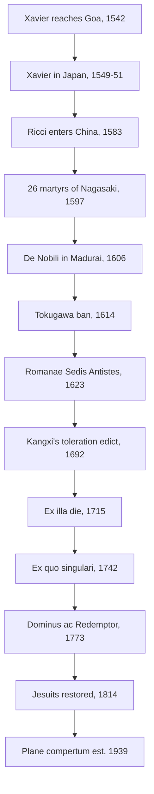

# Church History · Lesson 7.2: Accommodation in Asia

> ⏱ ~15 min · Module 7: A Church in new worlds · Builds on: [7.1 Conquest and conscience in the Americas](07-01-conquest-and-conscience-in-the-americas.md), [6.4 Trent and Catholic reform](06-04-trent-and-catholic-reform.md) · Unlocks: [7.3 The Galileo affair](07-03-the-galileo-affair.md)

## Why this matters

In the Americas the missionaries came with conquerors ([7.1](07-01-conquest-and-conscience-in-the-americas.md)). In Japan, China and inland India they came as guests of literate states that could expel them, and sometimes did. The Jesuits' answer was **accommodation**: keep the faith, and change everything else. They changed dress, language, manners, even the word for God. For a century Rome argued over whether they had gone too far. It ruled against the Chinese and Malabar rites in the 1700s and reversed itself on the Chinese rites in 1939. Between those rulings came the suppression of the whole Jesuit order in 1773. The story is often told as bold missionaries betrayed by a narrow Rome; the record is less simple.

## The idea

Every missionary has to draw a line between the faith itself and the culture that happens to carry it. Latin, European clothes and European table manners are not the Gospel. Idolatry is ruled out on every account. Most practices fall somewhere in between. Is bowing before a tablet bearing a dead father's name worship or filial respect? Is the Confucius ceremony a sacrifice to a god or a civic honour to a teacher?

The Jesuits and their critics agreed on the rule: no Christian may take part in idolatry. They disagreed on the **facts**, on what a given act *meant* to the people who performed it. It was a dispute about evidence: which informants to trust, which texts to read, and whether a rite's meaning is fixed by its origin or by its present use. Keep that in view and the 1939 reversal makes sense. Rome did not change the rule. It changed its judgement of the facts.

## Source

Francis Xavier to the Jesuits at Goa, from Kagoshima, 5 November 1549, a few weeks after landing (tr. H. J. Coleridge, *The Life and Letters of St. Francis Xavier*, 1872, vol. 2, p. 237):

> In the first place, the nation with which we have had to do here surpasses in goodness any of the nations lately discovered. I really think that among barbarous nations there can be none that has more natural goodness than the Japanese. They are of a kindly disposition, not at all given to cheating, wonderfully desirous of honour and rank. Honour with them is placed above everything else. There are a great many poor among them, but poverty is not a disgrace to any one.

Read it for two things. First, the praise is real, but it sits inside a European frame: the Japanese are the best of the "barbarous nations." Second, Xavier has seen what Japanese society rewards: **honour and rank**. That observation became policy. He first rendered God as *Dainichi*, a name from Shingon Buddhism, and dropped it for the Latin-derived *Deusu* once he saw it made Christianity sound like a Buddhist sect. The problem of what to call God follows the whole story.

## The record

1. **Xavier (1542–1552).** Xavier sailed under the Portuguese crown's patronage and reached Goa in May 1542. He worked on the Pearl Fishery Coast, landed at Kagoshima in August 1549, and spent about two years in Japan. He died on Shangchuan Island in December 1552, waiting to be smuggled into China.
2. **Valignano, the architect (Visitor of the Asian missions from 1573; died 1606).** He required missionaries to learn the language, trained Japanese clergy in seminaries, and wrote an etiquette code for Jesuits in Japan that matched them to the ranks of Zen monks. He also had Michele Ruggieri and then Matteo Ricci sent to Macau to learn Chinese.
3. **Ricci in China (1583–1610).** Ricci settled at Zhaoqing in 1583, dressed as a Buddhist monk. In 1595, with Valignano's approval, he switched to the silk robes of the Confucian literati. His *True Meaning of the Lord of Heaven* (1603) argued that the ancient Confucian classics already knew a supreme God, the *Shangdi* of the classics, and that Buddhism and later Neo-Confucianism had obscured him. From 1601 he lived in Beijing with imperial patronage. He treated ancestor rites and the honours paid to Confucius as civil, not religious, and let converts keep them. He died in 1610 and was allowed burial in Beijing.
4. **Japan: growth, then suppression.** A Christian daimyo handed Nagasaki to the Jesuits in 1580. By about 1600 there were perhaps 300,000 Christians; the figure is an estimate. Hideyoshi ordered the missionaries out in 1587. On 5 February 1597 he had twenty-six Christians crucified at Nagasaki: six Franciscans, three Japanese Jesuits and seventeen Japanese lay Christians. The Tokugawa ban of 1614 was enforced far more thoroughly. After the Shimabara rising (1637–38), Christianity survived only underground, among the [hidden Christians](../reference.md#kakure-kirishitan), who showed themselves to a French priest at Nagasaki in 1865.
5. **De Nobili in Madurai (from 1606).** Roberto de Nobili lived as a Brahmin *sannyasi*, an ascetic. He let high-caste converts keep the sacred thread, the tuft of hair and sandalwood paste, and he held separate churches by caste. Gregory XV allowed the thread and tuft, with conditions, in *Romanae Sedis Antistes* (1623). These were the [Malabar rites](../reference.md#malabar-rites).
6. **The [Chinese rites controversy](../reference.md#chinese-rites-controversy).** Dominicans and Franciscans arriving from the Philippines reported the Jesuit practice to Rome. Rome's rulings swung with the question put to it: against the rites in 1645, for them in 1656, and in 1669 it held that both decrees stood "according to circumstances." Kangxi's edict of 1692 tolerated Christianity. In 1700 the Jesuits obtained his statement that the rites were civil. The Holy Office ruled against the rites in 1704 (*Cum Deus optimus*). After the legate Tournon's embassy, Kangxi required from 1706 that every missionary hold a permit pledging to follow Ricci's practice. Tournon published the ban in 1707; Kangxi expelled him to Macau, where the Portuguese held him until his death in 1710. Clement XI's bull [*Ex illa die*](../reference.md#ex-illa-die) (19 March 1715) forbade the terms *Tian* and *Shangdi* and any part in the sacrifices to Confucius and to ancestors. It left only a narrow allowance for passive presence where staying away would provoke hostility, and it kept *Tianzhu*, "Lord of Heaven." When the legate Mezzabarba presented the bull at court, the emperor's written comment of 1721 declared that Westerners should no longer preach in China. Yongzheng proscribed Christianity in 1724. Benedict XIV's *Ex quo singulari* (11 July 1742) confirmed the ban and required every missionary to swear an oath to enforce it. *Omnium sollicitudinum* (1744) settled the Malabar rites, confirming most of Rome's restrictions.
7. **The [suppression](../reference.md#suppression-of-the-jesuits) (1759–1814).** The Jesuits' enemies were in the Catholic courts. Pombal expelled them from Portugal and its empire (1759), followed by France (1764) and Spain (1767). The Bourbon courts then pressed Rome to finish the order. Clement XIV's brief *Dominus ac Redemptor* (21 July 1773) dissolved it for the sake of the Church's peace. The brief lists quarrels over mission rites among many others, but it does not condemn the Society's doctrine. Russia and Prussia refused to publish it, and Pius VII restored the order on 7 August 1814.
8. **The reversal: [*Plane compertum est*](../reference.md#plane-compertum-est) (8 December 1939).** This instruction of the Congregation of Propaganda Fide, approved by Pius XII, permitted Catholics to attend Confucius ceremonies, to bow before the dead, and to keep a Confucius tablet in Catholic schools. It dropped the 1742 oath. Its stated ground was that ceremonies once bound up with pagan rites had, as customs and ideas changed over the centuries, come to carry only civil meaning: piety to ancestors, love of country, courtesy. It built on similar instructions for Manchukuo (1935) and Japan (1936).

The counterpoint is Goa, where the Portuguese ran an Inquisition from 1560 to 1812, with a gap in 1774–78, chiefly over converts suspected of relapse ([6.5](06-05-the-spanish-and-roman-inquisitions.md)). Accommodation was a Jesuit strategy in places the Church did not rule. Where it did rule, it acted differently.

## Timeline

## Worked examples

**Example 1 (clean: the ancestral tablet).** A Chinese convert keeps a wooden tablet for his father in the family hall, with the usual inscription naming it the seat of the father's spirit. He bows and sets out food before it at the set seasons. Run the three positions.

- **The Jesuit reading:** the bow is filial respect, which Confucius taught as moral duty, and educated Chinese do not think the dead eat the food.
- **The mendicant reading:** the inscription locates a spirit in the tablet and the food is an offering to it, and that is what ordinary people believe whatever the literati say.
- **The 1715 ruling:** no offerings or rites before the tablet. A tablet bearing only the name, with a Christian inscription, is allowed.

The case shows the crux: whose understanding fixes a rite's meaning, the scholar's or the villager's?

**Example 2 (hard: did Rome's ban destroy the China mission?).** Here is the popular claim at its strongest. The mission grew under accommodation, to about 200,000 Christians by 1700 on the missionaries' own counts. It collapsed after 1715, and the emperor's anger at the bull closed China.

The record strains it three ways.

1. **Timing.** Kangxi's permit system dates from 1706. Tournon's embassy provoked it nine years before the bull. His hostility was to a foreign ruler legislating for his subjects, and it was set before *Ex illa die* existed.
2. **Causes.** The effective proscription came from Yongzheng in 1724. It followed a provincial governor's complaint, under an emperor who distrusted the Jesuits for their ties to a defeated rival for the throne.
3. **Survival.** Christianity did not vanish. Liam Brockey (*Journey to the East*, 2007) shows that the Jesuits' converts were mostly not literati at all, and communities kept going through the proscription. Eugenio Menegon (*Ancestors, Virgins, and Friars*, 2009) traces one such community, in Fujian, where it was Dominicans who served it.

A defender of the claim can reply that the ban took away the one argument that made Christianity acceptable to officials, that it was compatible with being Chinese. Nicolas Standaert has shown that Chinese Christians themselves wrote into the controversy, mostly on the Jesuit side. Jacques Gernet (*China and the Christian Impact*, 1982) poses the deeper question. He argued that the Chinese critics of Christianity saw an incompatibility that accommodation had papered over, in which case no ruling could have saved it. Verdict open. The honest version of the claim is "the ban made a hard mission harder," not "the ban destroyed it."

## Watch out

- **Rome did not ban accommodation.** The bull of 1715 kept *Tianzhu*, Chinese dress and the Chinese language, and it exempted customs with no trace of superstition. Propaganda Fide's instructions of 1659 had told missionaries not to import Europe. What Rome forbade was a specific list of terms and rites.
- **The suppression was not a verdict on the rites.** Portugal, France and Spain expelled the Jesuits for their own reasons, among them regalism, Jansenist hostility, money and colonial conflict in Paraguay. *Dominus ac Redemptor* cites peace, not heresy.
- **1939 did not say 1715 was wrong.** Its stated ground was that the rites' meaning had changed. Whether that is the whole truth is a fair historical question. The rulings on either side were disciplinary judgements about what particular practices meant, not definitions of doctrine. How to weigh such acts is taught in [`fundamental-theology` 4.5](../../fundamental-theology/lessons/04-05-reading-a-documents-weight.md), not here.
- **"Inculturation" is anachronism.** Accommodation worked from the top down. It ranked Jesuits like Zen abbots, aimed at literati and Brahmins, and tolerated caste separation in de Nobili's churches. It was a strategy of its time, not an early form of modern pluralism.

## One-liner

> The Jesuits and their critics agreed that idolatry was forbidden and fought for a century over what a bow meant; Rome answered in 1715 that it was worship and in 1939 that it no longer was.

## Problems

**P1 (🟢) *(Exegetical.)*** (a) Under Clement XI's *Ex illa die* (1715), classify each practice as **permitted** or **forbidden**, with a reason of a few words: (i) a missionary wearing the silk robes of a Confucian scholar; (ii) calling God *Tianzhu*; (iii) calling God *Shangdi*; (iv) hanging a "Revere Heaven" (*Jing Tian*) plaque in a church; (v) a newly appointed Christian magistrate performing the customary worship in the Confucian temple; (vi) a family keeping a tablet that bears only the dead parent's name and a Christian inscription. (b) In one or two sentences, state the ground *Plane compertum est* (1939) gave for permitting practices like (v).

**P2 (🟡) *(Exegetical (a) · Evaluative (b).)*** In paraphrase: in 1721, having read a Chinese translation of *Ex illa die* made at his court, the Kangxi emperor wrote on it that Westerners were petty men who understood nothing of Chinese learning, that the bull made their religion look like a narrow heterodox sect, and that they should no longer be allowed to preach in China. (a) Name three things a historian must establish about this document before using it as "China's answer to the pope," and say why each matters. (b) Evaluate the claim "Rome's ruling made the emperor ban Christianity." 150 words or fewer in total.

**P3 (🔴, optional) *(Exegetical.)*** An invented museum placard:

> "In 1773 Pope Clement XIV, siding with the Dominicans against Jesuit compromises with Chinese paganism, dissolved the Society of Jesus. Only in 1939 did Rome finally admit that the Jesuits had been right all along."

Identify three distinct errors or overstatements, and for each give the correction from the record. 150 words or fewer.

Solutions

**P1** *(Exegetical.)*

**Must hit, strict (a):** (i) permitted: dress is a civil custom and the bull does not touch it. (ii) permitted: the bull expressly keeps *Tianzhu*. (iii) forbidden: *Tian* and *Shangdi* are both banned as names for God. (iv) forbidden: the bull orders such plaques taken down from churches. (v) forbidden: the bull names officials' worship in Confucian temples, as well as the seasonal sacrifices, among the banned acts. (vi) permitted: a tablet with only the name and a Christian inscription is allowed; offerings and rites before it are not.
**Must hit, strict (b):** customs and ideas had changed over the centuries, so ceremonies once tied to pagan religion now carried only civil meaning (piety toward ancestors, love of country, courtesy). The instruction did not declare the 1715 judgement mistaken for its own time.
**Wrong turns:** marking (i) forbidden because "Rome banned accommodation"; marking (ii) forbidden because Ricci chose it; marking (v) permitted because the bull tolerated passive presence in narrow cases (performing the worship is not passive presence), or because 1939 allowed attendance (that is 1939's rule, not 1715's); saying 1939 declared the rites "never religious."
**Model answer:** (a) (i) permitted, civil dress; (ii) permitted, the term the bull approves; (iii) forbidden, named in the ban; (iv) forbidden, plaques to come down; (v) forbidden, officials' temple worship is named; (vi) permitted, name-only tablet with Christian inscription. (b) The instruction held that with the change of customs and thinking over centuries, these ceremonies had come to express only civil respect for ancestors, country and neighbours, so Catholics could take part.

---

**P2** *(Exegetical (a) · Evaluative (b).)*

**Must hit, strict (a):** any three of: (1) **the translation**: the emperor reacted to a Chinese version made at his court by missionaries, not to the Latin, so its wording shaped his reaction; (2) **the genre**: a written comment on a document inside the palace, not a promulgated edict, so it shows his view but is not itself the law of the empire; (3) **the context**: it came at the end of a process that began with Tournon (1705–07) and the permit system of 1706, so it is not a first response; (4) **transmission**: it survives in Qing palace records and reaches most readers through modern English paraphrase, so check the Chinese before resting weight on a word.
**Must hit, any verdict (b):** state the case for the claim (the comment's timing and wording tie the order to the bull) and the case against (the hostility predates 1715; the enforced proscription came from Yongzheng in 1724 with other causes), and say what the claim would need to hold.
**Wrong turns:** treating the English wording as the emperor's exact words; ignoring the 1706 permits; treating 1721 as the end of Christianity in China.
**Model answer, (b) one of several:** (a) Who translated the bull, since he read their Chinese, not Clement's Latin. What kind of text this is, since a comment written on a document is not a public edict. And where it sits in time, since the permits of 1706 show his stance was already set by Tournon. (b) The bull was the last straw, not the cause. Kangxi's objection was to a foreign ruler ordering his subjects' conduct, which was settled in 1706. The comment of 1721 hardened it, and the proscription that bit came in 1724 under a different emperor. The claim holds only in the weak form "the ruling removed the compromise that had kept the peace."

---

**P3** *(Exegetical.)*

**Must hit, strict:** three of: (1) the suppression was driven by the Catholic crowns (Portugal 1759, France 1764, Spain 1767, the Bourbon courts' pressure on the pope), not by a Dominican victory on the rites; (2) *Dominus ac Redemptor* gives the Church's peace as its ground and mentions the rites only among many quarrels, without condemning Jesuit doctrine; (3) the rites had already been settled against the Jesuits in 1715, 1742 and 1744, decades earlier, so 1773 decided nothing about them; (4) 1939 did not say the Jesuits had been right; it said the rites' meaning had changed; (5) the order had been restored in 1814, so its standing did not wait for 1939.
**Wrong turns:** saying Clement XIV condemned Jesuit doctrine; saying 1939 reversed the suppression; giving one error three times in different words.
**Model answer:** First, the suppression came from the Catholic crowns, not the Dominicans: Pombal's Portugal, then France and Spain, whose ambassadors pressed Clement XIV. Second, the brief suppressed the order for the Church's peace and did not condemn its doctrine or rule on China; the rites had been decided in 1715, 1742 and 1744. Third, *Plane compertum est* did not vindicate the Jesuits. It held that the ceremonies' meaning had changed over the centuries to something civil, and it left the earlier rulings standing for their time.

## Flashback

**From Lesson [6.5](06-05-the-spanish-and-roman-inquisitions.md) (The Spanish and Roman Inquisitions):** *(Exegetical.)* Classification. (a) For each event, name the body whose decision it was (the Spanish Inquisition, the Roman Inquisition, the Portuguese Inquisition, the Spanish crown, or some other authority), with a reason of a few words: (i) Giordano Bruno sent to the stake in Rome, 17 February 1600; (ii) six accused witches burned in person at Logroño, November 1610; (iii) the expulsion of the Moriscos, 1609–14; (iv) the execution of the schoolteacher Cayetano Ripoll, 26 July 1826; (v) the tribunal that sat at Goa from 1560 to 1812. (b) In one sentence, give the rule of jurisdiction that explains why the unbaptized Jews expelled in 1492 never came before the tribunal.

Solution

**Must hit, strict (a):** (i) Roman Inquisition: Paul III's congregation of cardinals (1542) supervised the Italian tribunals and condemned him. (ii) Spanish Inquisition: the Logroño tribunal's sentence, before Salazar's investigation and the Suprema's rules of 1614 ended the burning of witches. (iii) Spanish crown: an act of Philip III, not a sentence of the tribunal. (iv) Another authority: a diocesan "junta of faith" standing in for the Inquisition, which had been suspended in 1820. (v) Portuguese Inquisition: founded in 1536 on the Spanish model, it opened the Goa tribunal in 1560.
**Must hit, strict (b):** an inquisition had jurisdiction only over the baptized, so unbaptized Jews could be expelled by royal decree but not tried for heresy.
**Wrong turns:** assigning (i) to the Spanish Inquisition, or treating Rome and Spain as one "Inquisition"; assigning (iii) to the tribunal because the Moriscos, as baptized Christians, fell under its jurisdiction (trying them and expelling them are different acts, and the expulsion was the crown's); assigning (iv) to the Spanish Inquisition proper. Adding that the secular arm carried out the burnings in (i) and (ii) is correct and does not change the answer.
**Model answer:** (a) (i) Roman Inquisition, the papal tribunal; (ii) Spanish Inquisition, the Logroño tribunal; (iii) the Spanish crown, a royal expulsion; (iv) a diocesan junta of faith, since the tribunal was suspended; (v) the Portuguese Inquisition, its tribunal in Asia. (b) The tribunals judged only baptized Christians suspected of heresy, so Jews who had never been baptized were outside their jurisdiction and were dealt with by the crown's decree.

## Connections

- **Backward:** Gregory the Great's letter to Mellitus ([3.1](03-01-gregory-the-great-and-the-conversion-of-the-peoples.md)) is the old precedent: keep the temple, destroy the idol. The Jesuits were founded in 1540 ([6.4](06-04-trent-and-catholic-reform.md)). The Portuguese royal patronage that carried Xavier to Goa is the Asian counterpart of the Spanish system in [7.1](07-01-conquest-and-conscience-in-the-americas.md). The Goa tribunal belongs to [6.5](06-05-the-spanish-and-roman-inquisitions.md).
- **Forward:** Ricci learned his mathematics from Christopher Clavius at the Roman College; the new astronomy's collision with Scripture is [7.3](07-03-the-galileo-affair.md). The Bourbon states that crushed the Jesuits turn on the Church itself in [8.1](08-01-enlightenment-revolution-and-napoleon.md), which ends with the restoration of 1814.
- **Sideways:** inculturation as liturgical law (*Varietates Legitimae*, 1994, and its limits) is assigned to [`sacraments-and-liturgy`](../../sacraments-and-liturgy/syllabus.md) 7.2, and catholicity as the capacity to receive every culture, with inculturation's limits, to [`ecclesiology-and-mariology`](../../ecclesiology-and-mariology/syllabus.md) 2.3. How much weight a disciplinary ruling like *Ex illa die* carries is a question for [`fundamental-theology` 4.5](../../fundamental-theology/lessons/04-05-reading-a-documents-weight.md).
