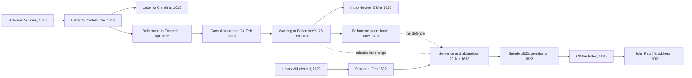

# Church History · Lesson 7.3: The Galileo affair

> ⏱ ~15 min · Module 7: A Church in new worlds · Builds on: [6.5 The Spanish and Roman Inquisitions](06-05-the-spanish-and-roman-inquisitions.md), [7.2 Accommodation in Asia](07-02-accommodation-in-asia.md) · Unlocks: [8.1 Enlightenment, Revolution, and Napoleon](08-01-enlightenment-revolution-and-napoleon.md)

## Why this matters

Ask for one example of the Church against science and you will hear Galileo. Since the 1870s the case has carried a theory of history: religion and science are enemies, and 1633 was a battle in their war. The documents tell a stranger story. Jesuit astronomers confirmed Galileo's discoveries, a cardinal conceded that proof would force Scripture to be reread, and the pope who condemned him had admired him. Yet a Roman congregation declared a true proposition about nature contrary to Scripture, and Copernicus stayed on the Index for two centuries. This lesson tells what happened and tests the war story.

## The idea

Two stories compete. The **[conflict thesis](../reference.md#conflict-thesis)** was built by John William Draper's *History of the Conflict between Religion and Science* (1874) and Andrew Dickson White's *History of the Warfare of Science with Theology in Christendom* (1896). For them Galileo is reason's martyr. Historians of science have largely abandoned the thesis. John Hedley Brooke's *Science and Religion: Some Historical Perspectives* (1991) replaced it with what is usually called the **[complexity thesis](../reference.md#complexity-thesis)**: religion and science have related in many ways (conflict, support, indifference), and each episode must be read on its own terms. Ronald Numbers's *Galileo Goes to Jail and Other Myths about Science and Religion* (2009) takes its title from the most famous myth.

The complexity reading does not make the affair innocent; it changes the questions:

1. **What was condemned:** a claim about nature, a way of reading Scripture, or one man's disobedience?
2. **By whom:** a council, a pope defining doctrine, or a Roman congregation acting as a court?
3. **What was known:** was the earth's motion proved in 1633?

Most bad history of the affair runs them together.

## Source

Cardinal Robert Bellarmine to the Carmelite Paolo Antonio Foscarini, 12 April 1615, point 3 (the lesson's translation from the Italian, Favaro's edition, vol. XII):

> I say that if there were a true demonstration that the sun is at the centre of the world and the earth in the third heaven, and that the sun does not circle the earth but the earth circles the sun, then one would have to proceed with great care in explaining the Scriptures that seem contrary, and rather say that we do not understand them than say that what is demonstrated is false. But I will not believe that there is such a demonstration until it is shown to me. Nor is it the same thing to demonstrate that, supposing the sun at the centre and the earth in the heaven, the appearances are saved, and to demonstrate that in truth the sun is at the centre and the earth in the heaven. The first demonstration I believe may be had; of the second I have very great doubt, and in case of doubt one must not abandon Holy Scripture as expounded by the holy Fathers.

Bellarmine concedes the principle Galileo needed: a demonstrated truth about nature obliges Scripture's interpreters to give way. They part over the **burden of proof**. In his Letter to the Grand Duchess Christina (1615), Galileo argued that before a natural proposition is condemned, *its opponents* must show it is not demonstrated. For Bellarmine, until a demonstration is shown, the Fathers' reading stands. Bellarmine (point 2) also held that everything Scripture says is a matter of faith *on the part of the speaker*, the Holy Spirit, down to the number of Jacob's sons. Galileo answered with a line he credited to Cardinal Baronius: the Holy Spirit's intention is "to teach us how one goes to heaven, and not how heaven goes." And by Bellarmine's own distinction between saving the appearances and showing how things are, Galileo in 1615 had done only the first.

## What happened

1. **The telescope (1610–11).** *Sidereus Nuncius* (Venice, March 1610) reported mountains on the Moon and moons circling Jupiter; the phases of Venus followed. This finished Ptolemy's system but did not prove the earth moves: Tycho Brahe's, with the planets circling the sun and the sun circling a fixed earth, fitted it too. In 1611 the Roman College's Jesuit astronomers confirmed the observations.
2. **Scripture enters (1613–15).** Galileo's Letter to Castelli (21 December 1613) argued that Scripture cannot err but its interpreters can. In February 1615 a Florentine Dominican, Niccolò Lorini, sent it to the Inquisition. Galileo expanded it into the Letter to Christina (printed only in 1636), and Foscarini's book reconciling Copernicus with Scripture drew [Bellarmine's reply](../reference.md#bellarmine-to-foscarini). The fight was now over who may interpret Scripture: Trent's Session IV (1546) forbade interpretations, in matters of faith and morals, against the unanimous consent of the Fathers ([6.4](06-04-trent-and-catholic-reform.md)).
3. **February–March 1616.** On 24 February eleven consultors of the Holy Office ([Roman Inquisition](../reference.md#roman-inquisition)) judged the sun's immobility absurd in philosophy and formally heretical, and the earth's motion absurd and at least erroneous in faith. On 26 February Galileo was called to Bellarmine's residence and warned to abandon the opinion. On 5 March the Congregation of the Index ([Index decree of 1616](../reference.md#index-decree-of-1616)) called the doctrine false and wholly contrary to Scripture, suspended Copernicus's *De revolutionibus* until corrected (corrections followed in 1620), prohibited Foscarini's book, and banned all others teaching the same. Galileo was not named or tried, and abjured nothing.
4. **The injunction problem.** Paul V's order of 25 February was conditional: only *if Galileo refused* Bellarmine's warning was the Commissary of the Holy Office, before a notary and witnesses, to forbid him to teach, defend or discuss the doctrine. The file holds a minute saying that the Commissary, Michelangelo Seghizzi, gave the stricter order *immediately* after the warning. It records no refusal and bears no signatures. Bellarmine's certificate of 26 May, requested by Galileo to quash rumours that he had abjured, says only that he was told of the Index's declaration. This is the **[special injunction of 1616](../reference.md#special-injunction-of-1616)**. Emil Wohlwill (1870) and Karl von Gebler thought the minute forged in 1632; Gebler examined the manuscript in 1877 and concluded it was written in 1616, though still a false record. Sergio Pagano, Prefect of the Vatican Archives since 2007, has argued it authentic; Maurice Finocchiaro agrees, but insists that *authentic* is not *accurate* or *legitimate*.
5. **Urban VIII and the *Dialogue* (1623–32).** Maffeo Barberini, an admirer, became Urban VIII in 1623. From audiences in 1624 Galileo understood that he might discuss the two systems as hypotheses, and Urban wanted his own argument included: God could produce the same effects by means beyond our knowing. The *Dialogue on the Two Chief World Systems* (Florence, 1632), licensed by censors who knew nothing of the injunction, was a brilliant case for Copernicus. Its chief physical proof, from the tides, was wrong, and the pope's argument appeared at the end in the mouth of Simplicio, its slow-witted Aristotelian.
6. **The trial (1633).** First examined on 12 April, Galileo faced a prosecution resting on the minute: he had broken a personal injunction and hidden it from the licensers. He produced Bellarmine's certificate and, after an out-of-court arrangement with the Commissary, Vincenzo Maculano, conceded that the book could read as a defence of Copernicus. On 16 June the pope ordered him examined on his intention under threat of torture; the "rigorous examination" of 21 June went no further than the threat. On 22 June, at Santa Maria sopra Minerva, the sentence found him **[vehemently suspected of heresy](../reference.md#vehement-suspicion-of-heresy)**: of holding that the sun is the centre and the earth moves, and that an opinion may be held probable after being declared contrary to Scripture. It noted that the certificate lacked the words "to teach" and "in any way". He abjured on his knees; the *Dialogue* was banned and he was sentenced to formal imprisonment. Seven of the ten cardinal judges signed.
7. **Afterwards.** Within days the imprisonment was commuted to confinement, from December 1633 at his villa at Arcetri, where he wrote the *Two New Sciences* (1638) and died on 8 January 1642. "Eppur si muove" first appears in Giuseppe Baretti's *Italian Library* (London, 1757).
8. **The long reversal.** The Index of 1758 dropped the general ban on books teaching the earth's motion. In 1820 the Holy Office let Canon Giuseppe Settele teach it as fact, and in 1822, with Pius VII's approval, it permitted such books generally. The 1835 Index omitted Copernicus and the *Dialogue*. John Paul II asked in 1979 for a re-examination. On 31 October 1992 he told the Pontifical Academy of Sciences that most theologians then had made a question of scientific fact one of faith, that Galileo read Scripture more perceptively, and that the 1633 sentence was not irreformable, the debate having closed in 1820 (§§5, 9, 12). The word "rehabilitation" does not appear.

## Timeline

The dashed edges are the trial in miniature: two documents of 1616 disagreeing about what Galileo had been told.

## Worked examples

**Example 1 (clean): what did 1616 condemn, and with what authority?** *What:* a proposition (the sun still, the earth moving), declared false and contrary to Scripture, and a way of reading Scripture, since Foscarini was banned for reconciling the two. *By whom:* the Congregation of the Index, by a decree Paul V approved. The consultors' "formally heretical" was advice, and the published decree did not repeat it. No council or papal definition was involved. What such acts weigh is `fundamental-theology`'s question ([the ladder](../../fundamental-theology/lessons/04-04-the-ladder-of-doctrinal-authority.md)); this course names the act and leaves its level there. *What was known:* nothing decisive. So a Church body did rule a scientific proposition contrary to Scripture (no myth), and did not make geocentrism a dogma.

**Example 2 (hard): why was Galileo condemned in 1633?** Three causes are on offer.

- **The Copernican question.** The sentence names the doctrine as its object, and the 1616 decree was in force.
- **Urban's sense of betrayal.** He permitted a hypothetical treatment and got an advocate's brief, his own argument given to Simplicio. The Tuscan ambassador reported his anger.
- **Counter-Reformation politics.** On 8 March 1632, in consistory, the Spanish Cardinal Gaspar Borgia accused Urban of failing the Catholic cause in the Thirty Years' War. A pope attacked as soft on heresy could not tolerate a Copernican book printed with Roman approval.

(Pietro Redondi's 1983 atomism-and-Eucharist thesis has been mostly rejected.) Each explains a different part: the first why there was a case, the second why it was pressed against a licensed book, the third its severity. The crux is a counterfactual: would a deferential book with the same content have been prosecuted? Urban's 1624 permission suggests not; the still-binding 1616 decree suggests it might. The conflict thesis needs the first cause alone. Its critics can show the formal charge was disobedience and suspected heresy, but cannot make the scientific question disappear.

## Watch out

- **"Galileo was condemned as a heretic."** He was judged *vehemently suspected* of heresy, the middle of three grades (formal heresy, vehement suspicion, light suspicion), which required an abjuration *de vehementi*. A second offence would have risked treatment as a relapse, which was far graver.
- **"Galileo had proved the earth moves."** Not in 1633. The Tychonic system fitted the evidence and the tidal argument was wrong; direct evidence came with the aberration of starlight (James Bradley, 1729) and stellar parallax (Friedrich Bessel, 1838). The live dispute is who bore the burden of proof.
- **"The Church defined geocentrism."** A congregational decree and a judicial sentence are not definitions. Name the act; cite `fundamental-theology` for its weight.
- **"The reversal came in 1992."** The books came back between 1758 and 1835; 1992 added an admission that the theologians had erred.

## One-liner

> Rome condemned Galileo in 1633 for defending, before it could be proved, a truth it had declared contrary to Scripture in 1616: the condemnation is real, the war story built on it is not.

## Problems

**P1 (🟢) *(Exegetical (a) · Formal (b)–(c).)*** (a) Put these in order and give the year of each: the Holy Office's general permission for books teaching the earth's motion; Bellarmine's certificate to Galileo; the Letter to Castelli; the *Dialogue*; the Index decree suspending Copernicus; the Index edition that omitted Copernicus and the *Dialogue*. (b) How many years separate the 1616 decree from the 1835 Index, the 1616 decree from the 1758 Index, and the general permission from the 1835 Index? (c) In one sentence, what does the last interval show about the relation between a Roman decree and the printed Index?

**P2 (🟡) *(Exegetical (a)–(b) · Evaluative (c).)*** Two documents of 1616, in Gebler's translation (1879). The minute of 26 February:

> ... the said Galileo ... was ... by the said Cardinal warned of the error of the aforesaid opinion, and admonished to abandon it; and immediately thereafter, before me and before witnesses, the Lord Cardinal Bellarmine being still present, the said Galileo was by the said Commissary commanded and enjoined ... to relinquish altogether the said opinion ... nor henceforth to hold, teach, or defend it in any way whatsoever, verbally or in writing ...

Bellarmine's certificate of 26 May:

> ... neither has any salutary penance been imposed upon him; but only the declaration made by the Holy Father and published by the sacred Congregation of the Index, has been intimated to him, wherein it is set forth that the doctrine attributed to Copernicus ... is contrary to the Holy Scriptures, and therefore cannot be defended or held.

(a) What does the minute forbid that the certificate does not, and why did the difference matter for a book presenting Copernicanism in dialogue? (b) Give two reasons, one from the minute's form and one from Paul V's order of 25 February, why historians have suspected it. Two sentences per part. (c) The minute is now generally accepted as written in 1616. Does that settle whether Galileo was bound by the stricter injunction? 150 words or fewer.

**P3 (🔴, optional) *(Exegetical.)*** Draper, *History of the Conflict between Religion and Science* (1874), on 1616 and then 1633:

> He was summoned before the Holy Inquisition, under an accusation of having taught that the earth moves round the sun, a doctrine "utterly contrary to the Scriptures." He was ordered to renounce that heresy, on pain of being imprisoned. ... Knowing well that Truth has no need of martyrs, he assented to the required recantation, and gave the promise demanded. ... He was declared to have brought upon himself the penalties of heresy. On his knees, with his hand on the Bible, he was compelled to abjure and curse the doctrine of the movement of the earth. What a spectacle! This venerable man ... forced by the threat of death to deny facts which his judges as well as himself knew to be true!

(a) Name two things in Draper's account of 1616 that the 1616 documents contradict, and say which later event he seems to have read back into 1616. (b) Test "facts which his judges as well as himself knew to be true" against the state of the evidence in 1633. (c) Classify the 1633 verdict correctly, and say how it differs from what Draper implies. Two sentences per part.

Solutions

**P1** *(Exegetical (a) · Formal (b)–(c).)*

**Must hit, strict (a):** Letter to Castelli (1613) → Index decree (1616, 5 March) → Bellarmine's certificate (1616, 26 May) → *Dialogue* (1632) → general permission (1822) → Index omitting Copernicus and the *Dialogue* (1835). Decree before certificate: the certificate reports the Index's declaration, so it must follow it.
**Must hit, strict (b):** computed in Python: $1835 - 1616 = 219$ years; $1758 - 1616 = 142$ years; $1835 - 1822 = 13$ years.
**Must hit, strict (c):** permission granted by decree (1820 for Settele, 1822 generally) took effect before the printed list caught up. The Index was a periodically reissued catalogue, and books could be licit before they came off it.
**Wrong turns:** giving 1820 as the general permission (1820 was Settele's case, 1822 the general decree); treating 1758 as the date Copernicus came off the list (1758 dropped the *general* ban, and the named books stayed until 1835); placing the certificate before the decree.
**Model answer:** (a) Castelli 1613; Index decree 1616; certificate 1616; *Dialogue* 1632; permission 1822; 1835 Index. (b) 219, 142 and 13 years. (c) The Holy Office had already made such books licit in 1822; the printed Index recorded the change only in its next edition.

---

**P2** *(Exegetical (a)–(b) · Evaluative (c).)*

**Must hit, strict (a):** the minute adds "teach" and "in any way whatsoever" (with "verbally or in writing") to "hold" and "defend". Under the certificate's terms a hypothetical discussion was arguably allowed, and Galileo had understood Urban to permit one in 1624. Under the minute's terms any treatment was forbidden, and he had not disclosed it to the licensers. The 1633 sentence itself names the two missing phrases.
**Must hit, strict (b):** form: it is signed by no one, neither Galileo, nor the notary, nor the witnesses. Procedure: Paul V's order made the Commissary's injunction conditional on Galileo's refusing Bellarmine's warning, but the minute has it follow "immediately thereafter" and records no refusal.
**Must hit, any verdict (c):** separate **authenticity** (the paper dates from 1616) from **accuracy** (did the Commissary actually say this, with Galileo present?) and **legitimacy** (was an injunction issued without a refusal valid under the pope's conditional order?). Name evidence bearing on at least one of the last two: the named witnesses and Galileo's 1633 testimony that the words "struck me as quite novel", which is not a flat denial; Bellarmine's certificate, which is silent; the conditional order of 25 February. Then give a verdict.
**Wrong turns:** asserting that the minute was forged in 1632 (Gebler himself retracted this in 1877); treating the certificate as proof that no injunction was given (it was written to rebut the abjuration rumour, not to list every order); grading (c) on the verdict.
**Model answer (c), one of several:** No. Authenticity shows that someone in 1616 wrote that the injunction was given. It does not show that the Commissary spoke those words, or that he could lawfully do so. The minute names witnesses, and Galileo in 1633 said only that he did not remember the phrases, which slightly favours accuracy. But Paul V had authorized the injunction only if Galileo refused, and nothing records a refusal. So even an accurate minute records an order issued outside its terms. Bellarmine's certificate, which Galileo held in the cardinal's own hand, stated the milder obligation. I think the injunction was probably spoken but not validly binding, and the court treated the question of fact as if it settled the question of law.

---

**P3** *(Exegetical.)*

**Must hit, strict (a):** any two of: there was no summons, accusation or trial in 1616 (he was called to Bellarmine's residence and warned); no recantation (Bellarmine's certificate says he abjured nothing and received no penance); the published decree called the doctrine false and contrary to Scripture, not heresy (only the unpublished consultors' opinion said "formally heretical"). He has read the 1633 abjuration, and the injunction as the 1633 sentence narrated it, back into 1616. Credit for noting that "utterly contrary to the Scriptures" is close to the Index decree's own wording, so that detail is accurate.
**Must hit, strict (b):** the motion was not proved in 1633. The Tychonic system fitted the telescopic evidence, Galileo's tidal proof was wrong, and direct evidence came with aberration (1729) and parallax (1838). Galileo believed it; his judges held the opposite.
**Must hit, strict (c):** "vehemently suspected of heresy", the middle of three grades, requiring abjuration *de vehementi*, not a conviction for formal heresy. The threat in the rigorous examination was of torture, not death.
**Wrong turns:** claiming he was never threatened at all (he was, formally, on 21 June); saying the Church never called the doctrine heretical (the consultors did, in 1616); treating Draper's whole passage as invented (the abjuration on his knees happened).
**Model answer:** (a) In 1616 Galileo was warned at Bellarmine's residence, not tried, and Bellarmine certified that he abjured nothing; the published decree also called the doctrine false, not heretical. Draper has folded the 1633 abjuration back into 1616. (b) Nobody knew it in 1633: Tycho's system fitted the evidence and Galileo's tidal proof failed, and aberration (1729) and parallax (1838) came later. Galileo was convinced, not his judges. (c) The verdict was vehement suspicion of heresy, the middle grade, which required abjuration *de vehementi*; he was not convicted of heresy. And the threat was of torture, never carried out, not of death.

## Flashback

**From Lesson [7.1](07-01-conquest-and-conscience-in-the-americas.md) (Conquest and conscience in the Americas):** *(Exegetical.)* Six acts from the Spanish Indies, in no particular order: the New Laws; the annulment of the brief *Pastorale officium*; Antonio Montesinos's Advent sermon in Santo Domingo; the revocation of the New Laws' inheritance clause; the Laws of Burgos; Paul III's bull *Sublimis Deus*. (a) Pair them into three rounds of "protest, then a law or a retreat," and give the year of each act. (b) In one round the retreat came from Rome itself. Using the *patronato real* and the ground on which Castile claimed the Indies, explain why the fight over native peoples was fought mainly in the crown's councils, and why the friars' arguments threatened the crown and not only the colonists. Three sentences or fewer for (b).

Solution

**Must hit, strict (a):** Montesinos's sermon (1511), then the Laws of Burgos (1512). *Sublimis Deus* (1537), then the annulment of *Pastorale officium* (1538). The New Laws (1542), then the revocation of the inheritance clause (1545), amid the encomenderos' resistance and the Peruvian rising under Gonzalo Pizarro.
**Must hit, strict (b):** (1) The patronato: Rome had granted the Castilian crown the tithes of the Indies (1501) and the nomination of every bishop and benefice (1508), and the crown claimed that papal letters for the Indies needed its approval. So Charles V could protest that the 1537 brief infringed his patronage, and Paul III annulled it. (2) The title: Castile's claim rested on *Inter caetera* (1493), a papal grant tied to the duty of converting the peoples. A friar who showed that conquest and forced labour blocked conversion and were mortal sins was attacking the crown's title, which is why the king's conscience and the confessional were the critics' levers.
**Wrong turns:** pairing Montesinos with the New Laws, or *Sublimis Deus* with the New Laws; dating Burgos to 1542; saying *Sublimis Deus* itself was annulled (the annulled document was the companion brief, and whether the bull fell with it is disputed); describing the struggle as mainly Rome against Madrid.
**Model answer:** (a) Montesinos 1511 and Burgos 1512; *Sublimis Deus* 1537 and the annulment of *Pastorale officium* 1538; the New Laws 1542 and the revoked inheritance clause 1545. (b) Under the patronato the crown held the Indies' tithes and appointments and claimed to screen papal letters, so the real decisions were made in the king's councils, and Charles V could make Paul III withdraw the enforcing brief within a year. Castile's title was a papal grant for the sake of conversion, so the friars' charge that conquest and forced labour obstructed conversion and were mortal sins struck at the title itself.

## Connections

- **Backward:** [6.5](06-05-the-spanish-and-roman-inquisitions.md) set up the Roman Inquisition and the [Index](../reference.md#index-of-prohibited-books), the two bodies that acted here. [6.4](06-04-trent-and-catholic-reform.md) met Trent's Session IV, whose rule on interpreting Scripture Bellarmine invoked. [7.2](07-02-accommodation-in-asia.md) followed Ricci, trained in mathematics at the Roman College, where the Jesuit astronomers confirmed Galileo's observations.
- **Forward:** [8.1](08-01-enlightenment-revolution-and-napoleon.md) opens the century from which, as John Paul II put it in 1992 (§10), the case became a kind of myth. [8.3](08-03-leo-xiii-and-the-modernist-crisis.md) meets Leo XIII's *Providentissimus Deus* (1893), whose line that truth cannot contradict truth John Paul II quoted in 1992.
- **Sideways:** the affair is `fundamental-theology`'s test case for faith and reason. What the 1616 and 1633 acts weigh belongs to its [ladder of authority](../../fundamental-theology/lessons/04-04-the-ladder-of-doctrinal-authority.md). The principle Bellarmine rejected later in his letter, that the sacred writers described sensible appearances in ordinary speech, is the one *Providentissimus Deus* teaches in [`fundamental-theology` 3.2](../../fundamental-theology/lessons/03-02-inerrancy.md). Weighing rival causes of 1633 uses the crux-finding method of [`philosophical-method` 4.3](../../philosophical-method/lessons/04-03-finding-the-crux.md).
