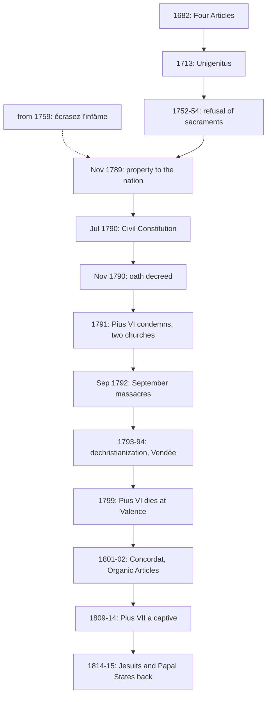

# Church History · Lesson 8.1: Enlightenment, Revolution, and Napoleon

> ⏱ ~15 min · Module 8: Revolution and the Roman Question · Builds on: [7.2 Accommodation in Asia](07-02-accommodation-in-asia.md), [5.4 Avignon, the Great Schism, and the councils](05-04-avignon-the-great-schism-and-the-councils.md) · Unlocks: [8.2 Pius IX, Vatican I, and the fall of Rome](08-02-pius-ix-vatican-i-and-the-fall-of-rome.md)

## Why this matters

In 1789 the French Church collected tithes and owned somewhere between about 6 and 10 percent of the land. Five years later, public Catholic worship had been driven out of most of France, a Festival of Reason had been staged in Notre-Dame, and some hundreds of priests had been killed. In 1799 a pope died a prisoner in a French citadel. In 1801 Bonaparte signed a treaty with the next pope, and the Church came back, on the state's terms and without its lands. Every later church-state struggle starts here. The historical question is where it broke: was the break made certain by the Enlightenment, or was it an avoidable mistake of 1790?

## The idea

The Revolution did not begin as an attack on religion. Its first church reforms were drafted by men who considered themselves good Catholics. Many were steeped in two French traditions that set them against Rome:

- **Gallicanism.** The conviction that the French Church had its own "liberties" against papal interference. It was codified in the Four Articles adopted by the Assembly of the Clergy on 19 March 1682, at Louis XIV's urging. They held that (1) the pope has no power over kings in temporal matters; (2) the decrees of Constance on the authority of councils remain in force; (3) papal power is bounded by the canons and customs of the French Church; and (4) a papal judgement in matters of faith is not irreformable until the Church consents to it. See [Gallicanism](../reference.md#gallicanism).
- **Jansenism.** A rigorist Augustinian movement. Clement XI's bull *Unigenitus* (8 September 1713) condemned 101 propositions from the Jansenist Pasquier Quesnel ([Unigenitus](../reference.md#unigenitus)). The bull then became a political weapon. In 1752 the archbishop of Paris, Christophe de Beaumont, began having the sacraments refused to dying people who could not show they accepted it. The Parlement of Paris intervened on behalf of the dying. The crown exiled the Parlement in 1753–54, imposed silence on the quarrel in September 1754, and exiled the archbishop too.

Dale Van Kley (*The Religious Origins of the French Revolution*, 1996) argues that these fights did much of the Revolution's ideological work in advance. They taught magistrates and their public to resist crown and bishops in the name of the nation and the "true" Church, and produced the Jansenist-Gallican program the Civil Constitution wrote into law. Critics doubt it outweighs fiscal and social causes. Treat it as a strong thesis, not a settled result.

Over these quarrels lay the **Enlightenment critique**. From about 1759 Voltaire repeated *écrasez l'infâme* ("crush the infamous thing") in his letters, sometimes as a sign-off. His target was persecuting superstition, as in the Calas case (a Toulouse Protestant executed in 1762, rehabilitated in 1765 after Voltaire's campaign). Scholars disagree about whether *l'infâme* meant Christianity itself or its intolerant establishment. Either way, it cast the clergy as a problem for the state to solve.

## Source

The Civil Constitution of the Clergy (voted 12 July 1790), Title II, in J. H. Robinson's translation as printed in F. M. Anderson, *The Constitutions and Other Select Documents Illustrative of the History of France* (1908). Public domain.

> **1.** Beginning with the day of publication of the present decree there shall be but one mode of choosing bishops and cures, namely that of election. …
> **3.** The election of bishops shall take place according to the forms and by the electoral body designated in the decree of December 22, 1789, for the election of members of the departmental assembly. …
> **17.** The archbishop or senior bishop of the province shall have the right to examine the bishop-elect … If he deems him fit for the position he shall give him the canonical institution. …
> **19.** The new bishop shall not apply to the Pope for any form of confirmation, but shall write to him as the Visible Head of the Universal Church, as a testimony to the unity of faith and communion maintained with him.

Read it in three steps. **Who chooses?** The same lay electors who chose the department's administrators (art. 3), with no requirement that they be Catholic. **Who makes the choice canonical?** The metropolitan (art. 17). **What does the pope do?** He receives a letter (art. 19). The pope stays a symbol of unity and leaves the appointment of bishops. A Gallican could read art. 19 as restoring the ancient Church; Rome read it as schism.

## What happened

1. **Property and vows (1789–90).** The tithe was abolished in August 1789. On 2 November 1789 all church property was placed at the nation's disposal, to be sold to back the *assignats*. In February 1790 solemn monastic vows lost legal recognition. *In words:* the state took the Church's income and with it the cost of its clergy.
2. **The Civil Constitution (July 1790).** It set one diocese per department (83 in place of about 130), elected clergy, and paid them salaries. Thirty bishop-deputies answered with an *Exposition des principes* (October 1790): not a rejection of reform, but an objection that the Assembly had reorganized the Church with no Church authority, pope or council, taking part. See [Civil Constitution of the Clergy](../reference.md#civil-constitution-of-the-clergy).
3. **The oath (27 November 1790).** Every office-holding cleric had to swear to maintain the constitution, Civil Constitution included, or be deemed to have resigned. The king assented on 26 December, and parish clergy swore or refused through January and February 1791. Only seven bishops took the oath. Among parish clergy the jurors were roughly half; estimates run up to 55–60 percent, depending on the date counted and on retractions. John McManners (*The French Revolution and the Church*, 1969) wrote that if the Revolution "went wrong" at any one point, it was at this oath decree.
4. **The map of the oath.** Timothy Tackett (*Religion, Revolution, and Regional Culture in Eighteenth-Century France*, 1986) mapped the oath by district. Jurors predominated in the Paris basin, the centre and the southeast. Refusers predominated in the west (Brittany, Anjou, the future Vendée), in the north and northeast (Flanders, Alsace, Lorraine), and in the southern Massif Central. His central finding is that this map matches the map of religious practice and political allegiance into the twentieth century, and he argues that priests' choices were heavily shaped by their parishioners' attitudes and by regional clerical cultures. See [Juring and refractory clergy](../reference.md#juring-and-refractory-clergy).
5. **Rome condemns (1791).** Pius VI condemned the Civil Constitution in *Quod aliquantum* (10 March) and *Charitas* (13 April 1791). *Charitas* suspended jurors who did not retract within forty days, and it declared the elections of the new bishops void and their consecrations illicit. Talleyrand, bishop of Autun, had consecrated the first of them on 24 February. France now had two Catholic churches.
6. **From schism to persecution (1792–94).** Refractory priests became political suspects. In the September massacres (2–6 September 1792), crowds killed between about 1,100 and 1,600 Paris prisoners, over two hundred of them priests. In 1926 the Church beatified 191 of the victims. Dechristianization in 1793–94 went beyond the refractories: it closed churches, pressured priests of both kinds to renounce their orders, brought in a republican calendar without Sundays, and staged the Festival of Reason in Notre-Dame (10 November 1793). Robespierre answered with the Festival of the Supreme Being (8 June 1794). See [Dechristianization](../reference.md#dechristianization). In the Vendée a rising of March 1793 over conscription and religion was crushed with mass killings: about 170,000 dead in the insurgent region on the standard estimate, though others vary widely. Most specialists reject the label genocide.
7. **A pope dies a prisoner (1798–99).** French troops proclaimed a Roman Republic in February 1798 and carried Pius VI off. He died at Valence on 29 August 1799.
8. **Concordat and empire (1801–15).** Pius VII (elected at Venice, 14 March 1800) and Bonaparte signed the [Concordat of 1801](../reference.md#concordat-of-1801) on 15 July. It recognized Catholicism as the religion of most French citizens, not of the state. The First Consul would nominate bishops and the pope would institute them. The state would pay the clergy, and the Church would never reclaim its sold lands (art. 13). The pope called on every sitting bishop to resign; several dozen old-regime bishops refused (counts vary from about 36 to 45). Bonaparte then published the Concordat on 8 April 1802 bundled with the [Organic Articles](../reference.md#organic-articles). Rome never accepted them. They required government permission before any papal document could be published and obliged seminary teachers to subscribe to the Four Articles of 1682. Pius VII attended Napoleon's coronation (2 December 1804), where Napoleon crowned himself. The Papal States were annexed in May 1809; the pope excommunicated the invaders and was arrested on the night of 5–6 July, then held at Savona and Fontainebleau. He re-entered Rome in May 1814, restored the Jesuits worldwide (7 August 1814), and through Consalvi recovered most of the Papal States at Vienna (1815).

## The causal chain

The dashed arrow marks the Enlightenment as climate, not single cause; weighing it against the top boxes is the Van Kley question.

## Worked examples

**Example 1 (clean): why a Catholic deputy could vote for the Civil Constitution and a bishop could not.**

Run the Source through the Four Articles. Article 3 of 1682 bounds papal power by the canons and customs of the French Church, and the early Church elected its bishops and had metropolitans confirm them. So a Gallican such as Armand-Gaston Camus, a leading defender of the plan, could read arts. 17 and 19 as a return to ancient discipline, with the pope still "Visible Head."

Now run it as the thirty bishops did. No Gallican had held that a *lay assembly* could redraw dioceses and change how bishops were made without any Church authority agreeing. The Concordat of Bologna (1516), which the Revolution replaced, gave the king nomination and the pope institution. The Civil Constitution gave the first to lay electors and abolished the second. The dispute was not reform against no reform but who had authority to reform. The oath turned that question into one of personal conscience, and so split the clergy as the law itself had not.

**Example 2 (hard): was the Concordat a restoration or a surrender?**

*Restoration:* public worship returned and the two clergies were reunited. Above all, a pope removed an entire national episcopate by his own act, which no pope had done before. The *Catholic Encyclopedia*'s article on Gallicanism (1909) called the Concordat "itself the most dazzling manifestation of the pope's supreme power."

*Surrender:* the state named every bishop, paid every priest, kept the lands, and through the Organic Articles revived the very Gallican controls the Church had fought. Eight years later the same state annexed Rome and imprisoned the pope.

Both readings rest on true facts. They measure different things: the Church's legal position in France (a surrender) or the pope's authority *within* the Church (a gain). Say which you are judging before you judge.

## Watch out

- **Jurors were not apostates.** Constitutional priests saw themselves as Catholic clergy, many as convinced Gallicans. Rome's charge was that they lacked canonical mission, not that they had abandoned the faith, and in 1801 every constitutional bishop resigned when the pope asked.
- **Don't grade *Charitas* yourself.** It judged the Civil Constitution's principles to be derived from heresy. Its doctrinal weight is for `fundamental-theology`'s ladder to state, not this course.
- **Overreading Tackett.** A correlation between the oath map and later regional patterns does not show that priests had no convictions of their own, only that they chose inside communities.

## One-liner

> The Revolution's quarrel with the Church began as a Gallican reform, became a schism with the oath of 1790, turned into persecution in 1793, and ended in a Concordat that gave Paris the bishops and Rome the Church.

## Problems

**P1 (🟢) *(Exegetical.)*** Close reading. The Concordat of 1801, arts. 4–5, and the Organic Articles (8 April 1802), art. 1, in Anderson's translation (public domain):

> **Concordat 4.** The First Consul of the Republic shall make appointments, within the three months which shall follow the publication of the bull of His Holiness, to the archbishoprics and bishoprics of the new circumscription. His Holiness shall confer the canonical institution, following the forms established in relation to France before the change of government.
> **5.** The nominations to the bishoprics which shall be vacant in the future shall likewise be made by the First Consul, and the canonical institution shall be given by the holy see, in conformity with the preceding article.
> **Organic Articles 1.** No bull, brief, rescript, decree, injunction, provision, signature serving as a provision, nor other documents from the court of Rome, even concerning individuals only, can be received, published, printed, or otherwise put into effect, without the authorisation of the government.

(a) Under the Concordat, who chooses a bishop and who makes him a bishop canonically? Compare each answer with the Civil Constitution (the lesson's Source). (b) Which Gallican principle does Organic Article 1 revive, and why did Rome refuse to treat the Organic Articles as part of the agreement? Two sentences per part.

**P2 (🟡) *(Exegetical.)*** Diagnose. An invented museum placard:

> "THE REVOLUTION AGAINST GOD. Answering Voltaire's call to crush Christianity, the revolutionaries of 1789 set out to abolish the Catholic Church. The Civil Constitution of 1790 replaced it with a state religion, and priests who refused to worship the Goddess Reason were sent to the guillotine. Only in 1801 did Napoleon restore the Church and return its lands."

(a) Name the historical assumption that holds the placard together. (b) Identify three factual errors and correct each, with a date where one applies. 150 words or fewer in total.

**P3 (🔴, optional) *(Evaluative.)*** Evaluate the claim: "The Revolution's war with the Church was made by the oath of November 1790, not by Enlightenment hostility to religion." Any verdict, 150 words or fewer.

Solutions

**P1** *(Exegetical.)*

**Must hit, strict (a):** the First Consul, the head of the state, **nominates** (arts. 4–5), and the **pope confers canonical institution**, "following the forms established … before the change of government," meaning the arrangement of the Concordat of Bologna (1516). Compared with 1790, choosing passes from elected lay electors to the head of state, and institution passes from the metropolitan back to the pope, who in 1790 only received a letter (Title II arts. 17, 19).
**Must hit, strict (b):** the Gallican principle that papal acts take effect in France only with the sovereign's consent. This is the old *placet*, in line with 1682's third article bounding papal power by the customs of the French Church, and the Organic Articles also made seminaries teach the Four Articles. Rome refused them because they were added unilaterally by the French government and published together with the Concordat as if agreed. The pope never signed them and protested them.
**Wrong turns:** saying the Concordat restored election of bishops; saying the pope nominates; treating the Organic Articles as a negotiated part of the treaty.
**Model answer:** (a) The First Consul chooses the bishop and the pope institutes him, as under the old Bologna arrangement. In 1790 lay electors chose and the metropolitan instituted, with the pope merely informed. (b) Article 1 revives the Gallican *placet*: no papal act runs in France without the government's authorisation, the principle of the 1682 articles that papal power is bounded by French custom. Rome rejected the Organic Articles because Bonaparte added them unilaterally to a bilateral treaty and published them as if they belonged to it.

---

**P2** *(Exegetical.)*

**Must hit, strict (a):** the assumption is **continuity of intent**: that one anti-Christian design ran from Voltaire through 1789 to the Terror, so that every measure from 1789 to 1794 expressed it. It hides the Gallican and Catholic character of the first reforms and the turn made by the oath and the war.
**Must hit, strict (b), any three:** (1) the Civil Constitution (July 1790) did not replace the Church with a state religion; it reorganized the *Catholic* Church (one diocese per department, elected clergy, state salaries). (2) Refractory priests refused the **oath to the constitution** (decreed 27 November 1790), not worship of Reason; the Festival of Reason came in November 1793, and dechristianizers struck juring clergy too. (3) The Concordat (1801) did **not** return church lands; art. 13 confirmed the buyers' ownership. Also acceptable: (4) 1789 did not "abolish" the Church; it nationalized church property (2 November 1789). (5) Whether *écrasez l'infâme* meant Christianity itself is disputed; the placard asserts the contested reading as fact.
**Wrong turns:** listing the executions as the error (priests were executed, and the placard's mistake is the reason given); calling the Cult of the Supreme Being part of the Civil Constitution; treating "restore the Church" in 1801 as itself the error, when the Concordat did re-establish public worship and the hierarchy; the error is the lands.
**Model answer:** (a) It assumes a single anti-Christian intention ran from Voltaire to the Terror, so the reforms of 1789–90 were steps toward 1793. (b) First, the Civil Constitution of July 1790 reorganized the Catholic Church, with elected clergy on state salaries; it did not replace it. Second, refractory priests refused the oath to the constitution decreed in November 1790, and the Festival of Reason came only in November 1793. Third, the 1801 Concordat did not return church lands; article 13 guaranteed the purchasers' titles.

---

**P3** *(Evaluative.)*

**Must hit, any verdict:** (i) State what the oath did. It made a dispute over authority into a public test of loyalty, split the clergy into two churches, and turned refractories into political suspects, which led to the deportation decree of 1792, the prison killings of September 1792 and the Vendée. McManners's "went wrong" judgement is the case at its strongest. (ii) State the rival case. Enlightenment anticlericalism and the Jansenist-Gallican quarrels (Van Kley) had already made the clergy a problem the state felt entitled to solve, and the Civil Constitution itself came out of that climate. (iii) Deal with 1793–94. Dechristianization struck constitutional clergy too, and it grew out of war and Terror, which neither the oath nor Voltaire fully explains. (iv) Say what evidence would move the question, e.g. whether the targets and timing of repression tracked refractory resistance, or whether the Assembly could have enforced the Civil Constitution without an oath.
**Wrong turns:** treating the oath and the Enlightenment as mutually exclusive when the claim is about weight; ignoring dechristianization's attack on jurors; assuming Voltaire called for violence against clergy.
**Model answer (one of several):** Mostly true. The Assembly's first reforms were Gallican, and many Catholic deputies voted for them. What turned reform into war was the oath of 27 November 1790. It forced every priest into a public choice, created two churches, and made the refractory clergy suspects, which led to the deportations, the September massacres and the Vendée. Enlightenment hostility supplied a climate, and Van Kley shows that older Jansenist-Gallican quarrels shaped the Civil Constitution. But climate did not require a schism: a reform without the oath might have been absorbed, as Rome later absorbed an even more sweeping one in 1801. The weakness of my verdict is 1793–94. Dechristianization hit jurors too and owed more to war and Terror than to the oath. Evidence that repression tracked refractory resistance would strengthen the claim, and evidence that it did not would weaken it.

## Flashback

**From Lesson [7.2](07-02-accommodation-in-asia.md) (Accommodation in Asia):** *(Exegetical.)* Find the crux. From 1606 Roberto de Nobili, in Madurai, let high-caste converts keep the sacred thread, the tuft of hair and sandalwood paste. His critics called these signs of Hindu religion; his defenders called them marks of caste and rank. (a) State the rule both sides accepted and the kind of question they actually disputed. (b) Name two questions of method on which such a dispute turns, and say how each would apply to the thread. 100 words or fewer in total.

Solution

**Must hit, strict (a):** the shared rule is that no Christian may take part in idolatry. The dispute was over a fact, not a principle: what the thread and the other marks *meant* to the people who wore them.
**Must hit, strict (b):** any two of the following, each applied to the thread rather than merely named: (1) *origin or present use*: if a practice's religious origin fixes its meaning, the critics win whatever converts intend; if present use fixes it, the question is what wearers in Madurai took the thread to signify; (2) *whose understanding counts*: the learned elite's account of their own marks (here the Brahmins') or the understanding of ordinary people; (3) *which informants and texts to trust*: whose reports reached Rome, and on what evidence.
**Wrong turns:** saying the Jesuits held idolatry permissible for the sake of conversions; treating the dispute as a disagreement about doctrine; saying Rome banned the thread outright in 1623 (Gregory XV allowed the thread and tuft, with conditions; *Omnium sollicitudinum*, 1744, settled the Malabar rites and confirmed most of Rome's restrictions).
**Model answer:** (a) Both sides held that a Christian may never take part in idolatry; they disagreed about a fact, whether the thread was a religious sign or a social one. (b) First, origin against present use: if the thread began as a religious sign and origin fixes meaning, it is forbidden whatever converts intend; if present use fixes it, the question is what wearers took it to mean. Second, whose understanding counts: the Brahmins' account of their own marks, or how ordinary people, and the missionaries' informants, understood them.

## Connections

- **Backward:** the Four Articles' appeal to Constance's decrees is the conciliarism of [5.4](05-04-avignon-the-great-schism-and-the-councils.md), revived as royal policy. The Jesuits whom Pius VII restored in 1814 were the order Clement XIV had suppressed in 1773 under Bourbon pressure ([7.2](07-02-accommodation-in-asia.md)). The seminaries the Revolution closed and the Concordat reopened were Trent's creation ([6.4](06-04-trent-and-catholic-reform.md)).
- **Forward:** [8.2](08-02-pius-ix-vatican-i-and-the-fall-of-rome.md) follows the ultramontane turn the Concordat began and the Papal States that Vienna restored, to their loss in 1870. [8.3](08-03-leo-xiii-and-the-modernist-crisis.md) ends the Concordat with the French separation of 1905. Vatican I's clause that papal definitions are irreformable "not from the consent of the Church" was aimed at the fourth of the 1682 articles. See [`fundamental-theology` 4.2](../../fundamental-theology/lessons/04-02-infallibility-and-its-conditions.md).
- **Sideways:** the Civil Constitution has a precedent in theory in Rousseau's civil religion, a creed fixed by the sovereign ([`history-of-political-thought` 4.4](../../history-of-political-thought/lessons/04-04-rousseau-the-social-contract.md)). Burke's defence of the French Church's lands by prescription is the contemporary conservative reply ([`history-of-political-thought` 5.3](../../history-of-political-thought/lessons/05-03-burke-prescription-against-abstract-rights.md)). Whether the Revolution began the long secularization of Europe is an empirical question for [`social-theory`](../../social-theory/syllabus.md) (Module 7), and the theology of church and state belongs to [`catholic-social-teaching`](../../catholic-social-teaching/syllabus.md).
