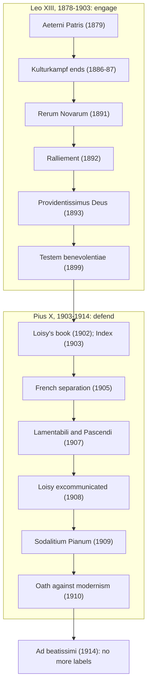

# Church History · Lesson 8.3: Leo XIII and the modernist crisis

> ⏱ ~15 min · Module 8: Revolution and the Roman Question · Builds on: [8.2 Pius IX, Vatican I, and the fall of Rome](08-02-pius-ix-vatican-i-and-the-fall-of-rome.md), [8.1 Enlightenment, Revolution, and Napoleon](08-01-enlightenment-revolution-and-napoleon.md) · Unlocks: [9.1 The Church and the totalitarian states](09-01-the-church-and-the-totalitarian-states.md)

## Why this matters

In 1878 the papacy had no state, a council's worth of new authority, and a list of condemned modern errors. Within thirty years it had made peace with Bismarck, told French Catholics to accept the Republic, launched modern Catholic social teaching, opened its archives to scholars, and then required clergy in teaching and pastoral office to swear an oath against "modernism." The same Church did both, in one generation. How the opening led to the crackdown, and how far the crackdown reached, shaped Catholic scholarship until the eve of Vatican II.

## The idea

Two popes, two strategies. **Leo XIII** (1878–1903) accepted that the Papal States were gone and tried to win influence another way: diplomacy with governments, an intellectual programme built on Aquinas, and encyclicals that addressed the modern world's own questions (labour, the state, the Bible) in the Church's terms. He never withdrew the principles of the Syllabus. He changed the posture: engage, don't only refuse.

A generation of Catholic scholars took the engagement further than Leo meant. Historical criticism of the Bible, the history of dogma, and new philosophies of religious experience were being developed mostly by Protestants in Germany. Catholics such as Alfred Loisy in France and George Tyrrell in England argued that the Church could adopt those methods and survive them, if doctrine was understood as something that grows.

**Pius X** (1903–1914) judged that the growth they described was really a dissolution: dogma reduced to religious experience, and history cut loose from faith. In 1907 he condemned "modernism" as a single system and built machinery to enforce the condemnation. The historical questions this lesson trains are two. Was "modernism" a movement, or a construct of the document that named it? And how far did enforcement go beyond what the pope ordered?

## Source

Alfred Loisy, *The Gospel and the Church* (1902; English translation by Christopher Home, 1903, pp. 166–167). Loisy wrote it as a Catholic reply to Adolf von Harnack's Protestant lectures *What Is Christianity?*, which found Christianity's essence in Jesus's simple message and treated the Church as a later overgrowth.

> It is certain, for instance, that Jesus did not systematize beforehand the constitution of the Church as that of a government established on earth and destined to endure for a long series of centuries. [...] Jesus foretold the kingdom, and it was the Church that came; she came, enlarging the form of the gospel, which it was impossible to preserve as it was, as soon as the Passion closed the ministry of Jesus. There is no institution on the earth or in history whose status and value may not be questioned if the principle is established that nothing may exist except in its original form.

Read the famous middle sentence in context before reading it as a sneer. Loisy's target is Harnack's principle that only the original form is legitimate, and he defends the Church against it: growth is the law of life. What alarmed Rome was the price of the defence. Jesus is said *not* to have planned the Church's constitution, and legitimacy comes from development, not from institution by Christ. The Oath of 1910 would require clergy to affirm the opposite: that Christ personally instituted the Church.

## The record

1. **Leo's diplomacy (1878–1892).** Elected at 67 on 20 February 1878, Leo negotiated an end to Prussia's Kulturkampf. Peace laws in 1886 and 1887 dismantled most of the anti-Catholic legislation, and Bismarck asked him to mediate the Carolines dispute with Spain (1885). In France, after Cardinal Lavigerie's toast at Algiers (12 November 1890), Leo's encyclical *Au milieu des sollicitudes* (16 February 1892) told Catholics to accept the Republic as the constituted power while opposing its anticlerical laws: the **[ralliement](../reference.md#ralliement)**. *In words:* accept the form of the regime; fight its legislation from inside.
2. **The intellectual programme (1879–1902).** *Aeterni Patris* (4 August 1879) made Aquinas the model for Catholic philosophy and theology. *Rerum Novarum* (15 May 1891) addressed the condition of industrial workers; its content belongs to [`catholic-social-teaching`](../../catholic-social-teaching/syllabus.md). Leo opened the Vatican archives to researchers in 1881. *Providentissimus Deus* (18 November 1893) encouraged Catholic biblical study but taught that inspiration extends to the whole of Scripture and excludes error (read as doctrine in [`fundamental-theology` 3.2](../../fundamental-theology/lessons/03-02-inerrancy.md)). He created the Pontifical Biblical Commission (30 October 1902).
3. **[Americanism](../reference.md#americanism) (1899).** A French translation of a life of Isaac Hecker, founder of the Paulists, appeared with Abbé Félix Klein's preface presenting Hecker as a model of adapting the Church to the age. Leo's letter *Testem benevolentiae* to Cardinal Gibbons (22 January 1899) rejected a cluster of views that some called Americanism: softening doctrine to win converts, dispensing with external spiritual direction, preferring active to passive virtues. It explicitly did *not* condemn American political institutions. American bishops largely denied that anyone held the views, and Klein later titled his account of the affair *Une hérésie fantôme* (a phantom heresy, 1949).
4. **Loisy and Tyrrell (1902–1909).** *The Gospel and the Church* appeared in 1902; five of Loisy's books were put on the Index in December 1903. Tyrrell was dismissed from the Jesuits in 1906, cut off from the sacraments in 1907, and refused Catholic burial on his death in 1909.
5. **Separation in France (1905–1906).** The law of 9 December 1905 ended the Napoleonic Concordat of 1801: no state salaries for clergy, and church buildings owned by the state and communes, to be run by lay "associations for worship." Pius X condemned the law in *Vehementer nos* (11 February 1906) and forbade the associations (August 1906). The French Church lost its endowments and gained freedom from state appointment of bishops ([separation law of 1905](../reference.md#french-separation-law-of-1905)).
6. **The condemnations (1907).** The Holy Office decree *Lamentabili sane exitu* (3 July 1907) condemned 65 propositions, many drawn from Loisy. The encyclical **[Pascendi Dominici gregis](../reference.md#pascendi-dominici-gregis)** (8 September 1907) set out **[modernism](../reference.md#modernism)** as a system built on agnosticism and *vital immanence* (faith as a felt need rising from the subconscious), and called it the "synthesis of all heresies" (§39). Its remedies: scholastic philosophy as the basis of seminary study, diocesan censors, secret diocesan "Councils of Vigilance" meeting every two months, and a sworn report from each bishop to Rome every three years. Loisy was excommunicated *vitandus* ("to be shunned") on 7 March 1908.
7. **The oath and the informers (1909–1914).** The motu proprio *Sacrorum antistitum* (1 September 1910) imposed the **[oath against modernism](../reference.md#oath-against-modernism)** on clergy, confessors, preachers, religious superiors and seminary professors; it remained required until 1967. From 1909 Mgr Umberto Benigni ran the **[Sodalitium Pianum](../reference.md#sodalitium-pianum)** (known in France as *La Sapinière*), a small, partly secret network of **[integralist](../reference.md#integralism)** informers, never more than about fifty members, reporting suspected modernists to Roman offices. Pius X blessed its aims in handwritten letters of 1911, 1912 and 1914, but it never received canonical approval; papers seized by German troops in occupied Ghent reached Rome in 1921 and helped bring its end. Lagrange's École biblique in Jerusalem, founded 1890, was under suspicion: he was recalled to France in 1912 and allowed back a year later.
8. **The calming (1914).** Pius X died on 20 August 1914. Benedict XV's first encyclical, *Ad beatissimi* (1 November 1914), renewed the condemnation of modernism. It also forbade Catholics to brand those who merely disagreed with them as disloyal, and told them to drop party labels distinguishing one group of Catholics from another. The Sodalitium was suppressed in November 1921.

## Timeline

Read the arrow between the two boxes as a question, not a cause. The brakes were Leo's before they were Pius X's: the 1899 letter, strict inerrancy in 1893, and a Biblical Commission meant to supervise as well as promote. Pius X pressed on them harder and added machinery.

## Worked examples

**Example 1 (clean: reading *Testem benevolentiae* as a document).** Ask what the letter condemns, and of whom. It names no American. It condemns a set of opinions taken together, then adds a conditional: if the word means the national character or the political order of the United States, the pope has no objection to it. So the strict content is narrow: specific theses about doctrine, grace and religious life, attributed to unnamed lovers of novelty. The American bishops' reply that no one held them is therefore not a defiance of the letter; it is a claim about its object. The pattern to carry forward: a Roman document may define a position so as to condemn it, and whether anyone held it is a separate historical question.

**Example 2 (hard: was modernism a system?).** *Pascendi* §39 says the modernists' ideas form one tightly joined body, so that no one can admit one part without admitting all. That is a claim of fact about the modernists, and historians can test it. Loisy tested it at once. In *Simples réflexions* (1908) he conceded that he had supplied more of the material than any other Catholic, but called the system "a compilation of bits and pieces" (lesson's translation), assembled by Roman theologians from writers who disagreed with one another. Blondel's philosophy of action, Le Roy's account of dogma, and Loisy's exegesis did not form one doctrine. Gabriel Daly (*Transcendence and Immanence*, 1980) accordingly defines a modernist loosely: a Catholic whose thinking challenged the reigning neo-scholastic scheme at some significant point.

A defender of the encyclical has a real reply. A pope condemning a *tendency* has to state it at the level of its premises. The premises the encyclical isolated (knowledge cannot reach beyond phenomena; faith begins in a felt need; dogma is the changing expression of that need) did run through several of the writers, even if no one held all of them. The crux: is "modernism" judged as a description of persons, where Loisy wins easily, or as a logical reconstruction of where shared premises lead, where the encyclical's method is defensible? The weight of *Pascendi* and *Lamentabili* as acts of teaching is read in [`fundamental-theology` 4.5](../../fundamental-theology/lessons/04-05-reading-a-documents-weight.md); this course assigns no level. Development as theory, including the version the modernists were condemned for, is [`fundamental-theology` 5.2](../../fundamental-theology/lessons/05-02-newmans-theory-of-development.md).

## Watch out

- **You might think *Pascendi* attacked natural science.** Its targets are philosophy of religion, the history of dogma, and biblical criticism; the evolution it condemns is the evolution of *dogma*. Its remedies even repeat Leo XIII's instruction that seminaries study the natural sciences energetically.
- **You might think Leo XIII was a liberal and Pius X reversed him.** Leo condemned Americanism, taught strict inerrancy, and kept the Syllabus's principles. The ralliement accepted a regime, not a theory of the state. The difference is posture and priority, not doctrine.
- **You might think the oath was a doctrinal definition.** It was a formula imposed by papal act on clergy and dropped as a requirement in 1967. See [`fundamental-theology` 1.2](../../fundamental-theology/lessons/01-02-natural-knowledge-of-god.md) for why overstating its level is an error.
- **Don't date the informers to 1907.** *Pascendi* created official councils of vigilance under bishops; Benigni's private network began in 1909 and was never canonically approved.

## One-liner

> Leo XIII engaged the modern world on the Church's terms; when Catholic scholars took the engagement further, Pius X named their work a single system, condemned it, and let an apparatus of vigilance run past what any document ordered.

## Problems

**P1 (🟢) *(Exegetical.)*** *Pascendi* §3 (1908 English version, T. E. Judge ed.):

> "no one can justly be surprised that We number such men among the enemies of the Church, if, leaving out of consideration the internal disposition of soul, of which God alone is the judge, he is acquainted with their tenets, their manner of speech, their conduct. [...] they put their designs for her ruin into operation not from without but from within [...] for they double the parts of rationalist and Catholic, and this so craftily that they easily lead the unwary into error [...] they lead a life of the greatest activity, of assiduous and ardent application to every branch of learning, and [...] they possess, as a rule, a reputation for the strictest morality."

(a) On what evidence does the passage say the judgment rests, and what does it expressly exclude? (b) The passage concedes two things in the modernists' favour. Name them and say how the passage turns them into part of the charge. Two sentences per part.

**P2 (🟡) *(Exegetical.)*** Historians disagree over how far Pius X knew and approved the Sodalitium Pianum's methods. One reading, found in standard Catholic reference works such as the *New Catholic Encyclopedia*: he knew the network existed and blessed its aims, but did not know the full extent of its methods. Another: the network's methods were the logical extension of his own policy, and the documentary record shows personal backing. (a) Name the premise each side must hold about the relation between *Pascendi*'s official machinery and Benigni's network. (b) Name two kinds of evidence that would move the question, and say which way each would push. 150 words or fewer in total.

**P3 (🔴, optional) *(Exegetical (a) · Evaluative (b).)*** An invented documentary voice-over:

> "In 1907 Pope Pius X declared war on modern science. His encyclical *Pascendi* condemned evolution and made every priest swear an oath against the modern world. Catholic scholarship was frozen until the Second Vatican Council finally let historians and scientists back in."

(a) Identify three factual errors or distortions, correcting each against the record. (b) A defender says: "Fix the details and the core stands: the Church suppressed modern *historical* scholarship for half a century." In 100 words or fewer, assess that revised claim. Any verdict passes if the required moves are made.

Solutions

**P1** *(Exegetical.)*

**Must hit, strict (a):** the judgment rests on observable things: their "tenets," their "manner of speech," and their "conduct." It expressly excludes the "internal disposition of soul," which it leaves to God. The encyclical judges doctrines and behaviour, not sincerity.
**Must hit, strict (b):** it concedes that they are intensely active in learning and that they have, as a rule, a reputation for the strictest morality. It turns both into aggravations: combined with working "from within" and doubling "the parts of rationalist and Catholic," learning and good repute are what make them persuasive to "the unwary." Their virtues become the vehicle of the danger.
**Wrong turns:** saying the passage accuses the modernists of bad faith or immorality; it disclaims judging the interior and grants the good reputation. Treating "from within" as a charge of secret membership in an organization; the passage means Catholic insiders, priests and laity.
**Model answer:** (a) The judgment rests on their tenets, speech and conduct, and it sets aside their interior disposition, which only God judges. So it condemns what they teach and do, not their sincerity. (b) It grants that they are learned and hard-working and usually have a reputation for strict morality. It then makes these part of the danger: insiders who play both rationalist and Catholic, and whose learning and good name mislead the unwary.

---

**P2** *(Exegetical.)*

**Must hit, strict (a):** the first reading must hold that the official machinery (bishops' censors and councils of vigilance under *Pascendi*) and Benigni's private network were distinct, so that approval of anti-modernist aims did not extend to the network's methods. The second must hold that the network was a channel the pope himself used to get round slow or reluctant bishops and curial offices, so that its methods fell within the policy.
**Must hit, strict (b):** two kinds of evidence, each with a direction. Examples: documents showing the pope received or acted on the network's reports, or gave its members tasks directly (pushes toward knowledge and backing); his three letters of blessing (1911, 1912, 1914) and the annual subsidy the network received (show support, but for aims or methods depends on their wording); the absence of canonical approval and curial resistance to it (pushes toward limited endorsement); the Ghent papers, seized in the war and sent to Rome in 1921, read for what Rome was told.
**Wrong turns:** treating the 1907 councils of vigilance as the Sodalitium; treating canonization as settling a historical question; naming evidence without saying which way it pushes.
**Model answer:** (a) The "aims, not methods" reading must hold that Benigni's network was separate from *Pascendi*'s official machinery, so that blessing its aims did not approve its spying. The "policy" reading must hold that the pope used the network to bypass bishops and officials who were slow to enforce, which makes its methods part of the policy. (b) Evidence that he read its reports or gave members missions himself would push toward the second. Whether his letters of 1911, 1912 and 1914 bless methods or only loyalty cuts either way, while the network's failure to gain canonical approval pushes toward the first.

---

**P3** *(Exegetical (a) · Evaluative (b).)*

**Must hit, strict (a):** any three of: *Pascendi* targeted philosophy of religion, the history of dogma and biblical criticism, not natural science; "evolution" in it is the evolution of dogma, not biology. The oath came in 1910 by *Sacrorum antistitum*, not in 1907 or by *Pascendi*, and it was a profession of specific doctrinal propositions (for instance, that God can be known by reason and that Christ instituted the Church), not an oath "against the modern world." Relief did not wait for Vatican II: *Ad beatissimi* (1914) curbed the labelling, the Sodalitium was suppressed in 1921, and *Divino Afflante Spiritu* (1943) opened biblical study before the council. "War on science" also leaves out Leo XIII's opening of the archives and his encouragement of biblical study.
**Must hit, any verdict (b):** say what "suppressed" must mean (condemnations of specific theses, the Index, removals such as Lagrange's recall, censorship, the oath's chilling effect) and weigh it against what continued (the École biblique survived, and church history and archival scholarship went on). Also address the time span: 1907 to 1943 for biblical study, and the oath until 1967.
**Wrong turns:** answering (b) only by repeating (a)'s corrections; treating Lagrange's return as proof nothing was suppressed, or his recall as proof everything was.
**Model answer (b), one of several:** Largely defensible for biblical and doctrinal history, not for historical scholarship as a whole. Condemned theses, the Index, censors, the oath, and Lagrange's recall made critical exegesis and the history of dogma dangerous for Catholic clergy until *Divino Afflante Spiritu* in 1943. But archival history of the Church flourished after 1881, the École biblique survived, and the labelling was curbed in 1914. "Suppressed" overstates the case; "sharply constrained, in the disciplines touching doctrine" fits the record.

## Flashback

**From Lesson [8.1](08-01-enlightenment-revolution-and-napoleon.md) (Enlightenment, Revolution, and Napoleon):** *(Exegetical.)* A popular claim about the clerical oath decreed in November 1790: "The priests who swore were the ones who had given up the faith. The faithful refused, and that is why refusers were concentrated in the pious regions." (a) Give the approximate share of parish clergy who swore, name two regions where jurors predominated and two where refusers did, and state Timothy Tackett's explanation of the pattern. (b) Give two pieces of evidence against "had given up the faith", and say what Tackett's work adds to "the faithful refused". 150 words or fewer in total.

Solution

**Must hit, strict (a):** roughly half the parish clergy swore; estimates run up to 55–60 percent, depending on the date counted and on retractions (only seven bishops swore). Jurors predominated in the Paris basin, the centre and the southeast. Refusers predominated in the west (Brittany, Anjou, the future Vendée), the north and northeast (Flanders, Alsace, Lorraine) and the southern Massif Central. Tackett argues that priests' choices were heavily shaped by their parishioners' attitudes and by regional clerical cultures, and that the oath map matches the map of religious practice and political allegiance into the twentieth century.
**Must hit, strict (b):** against "given up the faith", any two of: constitutional priests saw themselves as Catholic clergy, many as convinced Gallicans; Rome's charge was that they lacked canonical mission, not that they had abandoned the faith; in 1801 every constitutional bishop resigned when the pope asked; dechristianization in 1793–94 struck jurors too. Tackett adds that refusal was largely a communal and regional choice, not only a test of each priest's personal faith, so the geography does not show that refusers were individually more devout.
**Wrong turns:** treating the correlation with later practice as proof that the claim is right (it describes regions, not motives); over-reading Tackett the other way, as if priests had no convictions of their own; calling the jurors a small minority.
**Model answer:** About half the parish clergy swore, perhaps up to 55–60 percent. Jurors predominated around Paris and in the southeast, refusers in the west and the northeast. Tackett argues that priests chose within their communities, shaped by parishioners and regional clerical cultures, which is why his map still matches religious practice a century later. Against apostasy: Rome charged the jurors with lacking canonical mission, not with losing the faith, and in 1801 the constitutional bishops resigned at the pope's request. So "the faithful refused" describes regions better than individual priests.

## Connections

- **Backward:** [8.2](08-02-pius-ix-vatican-i-and-the-fall-of-rome.md) left a papacy without a state but with Vatican I's authority and the Syllabus; Leo's ralliement can be read as Dupanloup's "thesis and hypothesis" put into practice. [8.1](08-01-enlightenment-revolution-and-napoleon.md) made the Concordat of 1801 that the 1905 law ended.
- **Forward:** [9.1](09-01-the-church-and-the-totalitarian-states.md) begins with Benedict XV, whose 1914 encyclical closed this lesson, and follows Leo's diplomatic method into the concordats of the 1920s and 1930s. [9.2](09-02-the-second-vatican-council.md) asks how far the council reversed the defensive posture set here.
- **Sideways:** the doctrinal questions belong to [`fundamental-theology`](../../fundamental-theology/syllabus.md): development in [5.2](../../fundamental-theology/lessons/05-02-newmans-theory-of-development.md), inerrancy and *Providentissimus Deus* in [3.2](../../fundamental-theology/lessons/03-02-inerrancy.md), and the oath's weight in [1.2](../../fundamental-theology/lessons/01-02-natural-knowledge-of-god.md). *Aeterni Patris*'s Thomism is taught as philosophy in [`thomistic-synthesis`](../../thomistic-synthesis/syllabus.md), and *Rerum Novarum*'s content in [`catholic-social-teaching`](../../catholic-social-teaching/syllabus.md).
