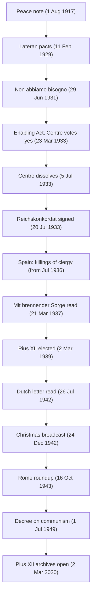

# Church History · Lesson 9.1: The Church and the totalitarian states

> ⏱ ~15 min · Module 9: The twentieth century and after · Builds on: [8.2 Pius IX, Vatican I, and the fall of Rome](08-02-pius-ix-vatican-i-and-the-fall-of-rome.md), [8.3 Leo XIII and the modernist crisis](08-03-leo-xiii-and-the-modernist-crisis.md) · Unlocks: [9.2 The Second Vatican Council](09-02-the-second-vatican-council.md)

## Why this matters

Between 1914 and 1958 the papacy faced states that claimed the whole person: Fascist Italy, Nazi Germany, Soviet communism and its postwar satellites. Its tools were treaties, encyclicals, diplomacy and a network of religious houses. It had no army, and after 1870 it had almost no territory. The most bitter dispute in modern Catholic history, whether Pius XII failed the Jews of Europe, is a dispute about how he used those tools. You cannot weigh it without knowing what the tools were, what each one bought, and what each one cost.

## The idea

A pope in this period had three instruments, and each worked on a different stage.

1. **The treaty.** A concordat is a contract between the Holy See and a state. The Church gets legal guarantees: its sacraments, schools, clergy and associations are protected. The state gets recognition and, usually, the Church's withdrawal from party politics. A concordat protects the institution quietly, and it is only as good as the state's willingness to keep it.
2. **The public word.** An encyclical or broadcast can name an evil before the world. It costs nothing to write. It can be very costly to the Catholics who live under the regime being named.
3. **The institution.** Nuncios, bishops, convents and parishes can hide, feed and plead for people. This works best unseen, so much of it left few records.

Every papal choice in these decades trades among the three. Historians disagree about the trades, not about the fact that trade-offs were made.

## Source

Benedict XV's note "To the heads of the belligerent peoples," 1 August 1917 (an English translation of the period):

> First of all, the fundamental point should be that for the material force of arms should be substituted the moral force of law; hence a just agreement by all for the simultaneous and reciprocal reduction of armaments, according to rules and guarantees to be established to the degree necessary and sufficient for the maintenance of public order in each State; then, instead of armies, the institution of arbitration, with its lofty peacemaking function, according to the standards to be agreed upon and with sanctions to be decided against the State which might refuse to submit international questions to arbitration or to accept its decisions.

The pope does not judge either side's war aims. Elsewhere in the note he insists on "absolute impartiality." He proposes a machinery of law: disarmament, arbitration, sanctions. Further on, the note asks for mutual renunciation of war damages, the evacuation of Belgium and occupied France, and the return of Germany's colonies. It calls the war a "useless massacre" (*inutile strage*). Impartiality was his method, and it was why he failed. Each side heard the note as a plea for the other.

## The record

**1. The Great War (1914–1918).** By Article 15 of the secret Treaty of London (1915), the Allies promised to back Italy in keeping any representative of the Holy See out of the peace negotiations. The peace note won no government. Wilson's reply of 27 August 1917 refused to negotiate with the German regime as it stood. The Holy See was absent from Versailles. *In words:* the papacy's first modern peace initiative showed that moral authority without a seat at the table could be ignored.

**2. The Lateran pacts (11 February 1929).** Cardinal Gasparri and Mussolini signed three instruments. The first was a **Treaty**, which created the sovereign State of Vatican City (about 44 hectares). The second was a **Concordat** regulating the Church in Italy. The third was a **Financial Convention**: 750 million lire in cash and 1 billion lire in 5 percent state bonds, as compensation for 1870. Pius IX had refused the 3,225,000 lire a year offered by the Law of Guarantees (1871). The [Roman Question](08-02-pius-ix-vatican-i-and-the-fall-of-rome.md) was over. See [Lateran pacts](../reference.md#lateran-pacts).

**3. The first clash (1931).** The regime then dissolved Catholic Action's youth groups. Pius XI answered with *Non abbiamo bisogno* (29 June 1931). It was written in Italian, and Mgr Francis Spellman carried it out to Paris for publication. It condemned the regime's worship of the state while stopping short of condemning the Fascist party as such. A settlement on 2 September restored Catholic Action in a reduced, diocesan form. *Quadragesimo Anno*'s vocational bodies (1931) were read against interwar corporatism ([`catholic-social-teaching`](../../catholic-social-teaching/syllabus.md) 2.2).

**4. Germany (1933).** The Enabling Act passed on 23 March with the votes of the Catholic Centre Party. On 28 March the bishops withdrew their earlier warnings against National Socialism. The Centre dissolved itself on 5 July. On 20 July Cardinal Pacelli, the secretary of state, and Vice-Chancellor von Papen signed the [Reichskonkordat](../reference.md#reichskonkordat), which was ratified on 10 September. Article 31 protected Catholic organizations with religious, cultural and charitable aims. Article 32 had the Holy See bar clergy and religious from membership of, and work for, political parties. Were the Centre's votes in March traded for the treaty? Klaus Scholder argued there was a link. Konrad Repgen argued the Centre voted on its own reckoning. Later work in the Vatican files (Brechenmacher) has not proved the link.

**5. Protest (1937).** The regime broke the concordat from the start: youth groups, schools and the press were squeezed. [*Mit brennender Sorge*](../reference.md#mit-brennender-sorge) was drafted from Cardinal Faulhaber's text and revised by Pacelli. It bears the date 14 March 1937, and it was written in German. Smuggled in by courier and printed secretly in some 300,000 copies, it was read from the pulpits on Palm Sunday, 21 March. It charged the government with breaking the treaty. It condemned anyone who raised race, people or state to an idol. It named neither Hitler nor the party, and it did not renounce the concordat. The Gestapo seized the twelve presses that had printed it. Five days later, *Divini Redemptoris* (19 March) condemned atheistic communism.

**6. Spain (1936–1939).** In the Republican zone, above all in the first months of the war, 6,832 clergy and religious were killed. That is Antonio Montero Moreno's count (1961): twelve bishops and an apostolic administrator, 4,184 diocesan clergy, 2,365 male religious and 283 women religious. The bishops' collective letter dated 1 July 1937 backed the Nationalist side. Cardinal Vidal i Barraquer refused to sign it. Bishop Múgica of Vitoria objected that it passed over the Basque priests shot by Franco's forces (about fourteen to sixteen, depending on the count).

**7. Pius XII and the war (1939–1945).** In July 1942 the Dutch churches protested against the deportations of Jews. The occupiers offered to exempt baptized Jews. The Reformed leadership largely held back, but the Catholic bishops had their letter read on 26 July. On 2 August Catholics of Jewish descent were arrested in reprisal (about 200–250 on the usual counts). Among them was the Carmelite Edith Stein, who was murdered at Auschwitz on 9 August. See [the Dutch bishops' protest](../reference.md#dutch-bishops-protest). On 14 December 1942 the Jesuit Lothar König wrote to the pope's secretary that thousands were being killed daily at Bełżec, and he asked that the source be protected. The letter was found in 2023. Pius's Christmas broadcast on 24 December spoke of hundreds of thousands condemned to death or slow decline, without fault of their own, sometimes only because of their nationality or race. It named neither the Jews nor the killers.

**8. After the war.** Communist governments tried Archbishop Stepinac (sentenced in October 1946 to sixteen years) and Cardinal Mindszenty (arrested 26 December 1948, sentenced to life on 8 February 1949). Stepinac's record under the Ustaša state is contested. Critics point to the forced conversions of Orthodox Serbs and his closeness to the regime. Defenders point to his sermons against racial persecution and his interventions for victims. He was beatified in 1998, and a joint Catholic–Serbian Orthodox commission (2016–17) could not agree about him. The Holy Office's [decree against communism](../reference.md#decree-against-communism), published 1 July 1949, forbade Catholics to join or support communist parties. It declared that those who professed materialist communism incurred excommunication as apostates.

## Timeline

## Worked examples

**Example 1 (clean): the Reichskonkordat as a trade.** Here is what the Holy See gained on paper: legal protection for Catholic schools, associations, clergy and pastoral care, from a government that could otherwise abolish them by decree. The regime gained a treaty with the Holy See, a mark of international respectability its press was quick to advertise. It also gained Article 32, which confirmed in law what 5 July had already done in fact: political Catholicism was gone. This is instrument 1 at its purest, institutional guarantees bought with political withdrawal. Its weakness showed within four years. The guarantees depended on the state keeping its word, and the only remedy for breach was instrument 2, the protest of 1937.

**Example 2 (hard): Rome, 16–18 October 1943.** All three instruments were in play in one week. The record is this. The SS arrested 1,259 people. After releases, above all of non-Jews, of baptized Jews and of Jews in mixed marriages, 1,023 were deported to Auschwitz. Sixteen came back. Cardinal Maglione, the secretary of state, spoke privately to the German ambassador, von Weizsäcker, on the day of the raid. No public papal protest followed. In the months that followed, some 155 religious houses sheltered about 4,300 people, more than 3,200 of them Jews. A Jesuit's list compiled in 1944–45 records them. It was found in 2023, and it is the source Renzo De Felice drew on for his figures of 1961. The **silence critique** takes the absence of public protest as the fact that matters. That line runs from Hochhuth's play *The Deputy* (1963) to John Cornwell's *Hitler's Pope* (1999), a charge Cornwell softened in 2004. The **prudence defence** takes the sheltering and the private channel as the fact that matters. Its writers include Ronald Rychlak and the Vatican archivist Johan Ickx. Ickx's *Le Bureau* (2020) draws on about 2,800 requests for help the Secretariat of State handled. David Kertzer's *The Pope at War* (2022) reads the files opened on [2 March 2020](../reference.md#the-silence-debate) as showing a pope driven by fear for the institution and cautious to the point of paralysis, not by antisemitism. On his reading, the Vatican's interventions that weekend went chiefly to the baptized and to those in mixed marriages. Nobody disputes these facts. The dispute is about what a louder word would have caused, and the documents cannot settle a counterfactual.

## Watch out

- **"The concordat made Hitler legitimate" and "the concordat saved the German Church" are both claims about causes.** The treaty was signed after the Enabling Act and the Centre's dissolution, so it caused neither. Whether the negotiations did is the Scholder–Repgen question, and it is still open.
- **An encyclical is not a definition.** On [`fundamental-theology`](../../fundamental-theology/lessons/04-04-the-ladder-of-doctrinal-authority.md)'s ladder most encyclical teaching sits at the authentic, non-definitive rung, and neither 1937 encyclical defines anything. The 1949 decree is a Holy Office response imposing a penalty. Calling either a dogmatic condemnation overstates its level.
- **Victim and ally at once.** The Spanish Church suffered one of the largest anticlerical killings in modern Europe and also the Nationalists' public ally. One fact does not cancel the other.
- **Don't flatten the archives.** The 2020 opening added documents on both sides of the ledger: the König letter and the private channel to Hitler in 1939 on one side, the requests-for-help files and the convent lists on the other. "The archives proved…" in either direction overstates the case.

## One-liner

> The popes met the totalitarian states with treaties, words and hiding places; they are judged by which of the three they reached for, and when.

## Problems

**P1 (🟢) *(Exegetical (a) · Formal (b))*** (a) Assign each provision to the Lateran instrument it belongs to (Treaty, Concordat or Financial Convention), with a one-line reason each: (i) the Holy See's sovereignty over Vatican City; (ii) civil effect for marriages celebrated in church; (iii) the Catholic religion as the sole religion of the Italian state; (iv) Italy's recognition of Catholic Action's organizations so long as they stay outside party politics; (v) 750 million lire in cash. (b) Compute the annual interest on the bond portion of the Financial Convention, and express it as a multiple of the Law of Guarantees' annual sum of 3,225,000 lire (to one decimal). In one sentence, say why this comparison flatters the 1929 settlement less than the multiple suggests.

**P2 (🟡) *(Exegetical)*** An invented museum placard:

> "In 1937 Pius XI broke with Hitler. His Latin encyclical *Mit brennender Sorge*, sent openly through diplomatic channels, condemned National Socialism by name and ended the concordat of 1933. Stung, the regime could do nothing but ignore it."

Identify four factual errors and correct each. Then say, in one sentence, what the encyclical's actual mode of delivery tells you about the relation between instruments 1 and 2 in 1937. 150 words or fewer.

**P3 (🔴) *(Evaluative)*** Test the popular claim "In the Spanish Civil War the Catholic Church was simply Franco's ally" against the record. Any verdict passes. 150 words or fewer.

Solutions

**P1** *(Exegetical (a) · Formal (b))*

**Must hit, strict (a):** (i) **Treaty**: it creates and recognizes the new state, and sovereignty is the Treaty's business. (ii) **Concordat**: it regulates the Church's life inside Italy. (iii) **Treaty**: Article 1 of the Treaty reaffirms the principle of the 1848 Statute that Catholicism is the sole religion of the state. (iv) **Concordat**: Article 43 on Catholic Action, the clause the 1931 clash was fought over. (v) **Financial Convention**: the compensation for 1870.
**Must hit, strict (b):** coupon $= 0.05 \times 1{,}000{,}000{,}000 = 50{,}000{,}000$ lire a year. Multiple: $50{,}000{,}000 / 3{,}225{,}000 = 15.503\ldots \approx$ **15.5** (computed in Python). The lira of 1929 was worth far less than the lira of 1871, because of the First World War's inflation above all, so a nominal comparison across 58 years overstates the real gain.
**Wrong turns:** putting (iii) in the Concordat. It sounds like church–state regulation, but it is Article 1 of the Treaty (the 1984 revision later declared the principle no longer in force in an additional protocol). Adding the 750 million cash to the annual figure. Treating 15.5 as a real-terms ratio.
**Model answer:** (a) (i) Treaty, since it founds the state; (ii) Concordat, since it concerns Church life in Italy; (iii) Treaty, its Article 1; (iv) Concordat, Article 43; (v) Financial Convention, the compensation. (b) 50 million lire a year, about 15.5 times the 1871 annuity. Prices had risen steeply since 1871, so the real multiple is much smaller.

---

**P2** *(Exegetical)*

**Must hit, strict:** four of these five errors, each corrected. (1) It was written in **German**, not Latin. (2) It was **smuggled in and printed secretly**, some 300,000 copies, and read from the pulpits on Palm Sunday, 21 March. It was not sent openly through diplomatic channels. (3) It **named neither Hitler nor National Socialism**. It condemned exalting race, people or state into an idol. (4) It **did not end the concordat**. It accused the regime of breaking it and appealed to fidelity to treaties, and the concordat stayed in force. (5) The regime did not merely ignore it: the **Gestapo seized the presses** (twelve) and arrested people involved in the distribution. For the final sentence: secret delivery shows the Church could no longer rely on the treaty's own guarantee (Article 4: pastoral letters may be published without hindrance) to carry its public word. Instrument 1 had failed, and instrument 2 had to route around the state.
**Wrong turns:** counting "1937" or "Pius XI" as errors, since both are right. Saying the encyclical condemned communism, which is *Divini Redemptoris*, five days later. Saying it was drafted by Pacelli alone, when it came from Faulhaber's draft with Pacelli's revisions.
**Model answer:** It was in German, not Latin. It was smuggled in, printed secretly and read from pulpits on 21 March, not sent through diplomatic channels. It named neither Hitler nor National Socialism, attacking instead the idolizing of race, people and state. It did not end the concordat, which it accused the regime of breaking. It was not ignored, either: the Gestapo closed the twelve presses that printed it. The secrecy shows that by 1937 the treaty's promise of free communication with the faithful could not even carry the pope's own letter.

---

**P3** *(Evaluative)*

**Must hit, any verdict:** (1) State the claim's evidence at its strongest: the bishops' collective letter of July 1937 backed the Nationalists, and the hierarchy's public alignment with Franco's side was real. (2) State the evidence that strains "simply": 6,832 clergy and religious killed in the Republican zone (Montero Moreno), which makes the Church a victim before it was an ally; Vidal i Barraquer's refusal to sign; Múgica's objection over the Basque priests shot by Nationalists. (3) Separate *why* the hierarchy aligned (persecution) from *whether* it aligned, and say which the claim is about. (4) Give a verdict on "simply," and say what evidence would move it.
**Wrong turns:** answering whether the alignment was justified, which was not asked. Citing the killings as if they disproved the alignment, or the alignment as if it discounted the killings. Treating the hierarchy as one voice.
**Model answer, one of several:** The claim is right about the public stance. The collective letter of 1 July 1937 put nearly all the bishops behind the Nationalists. "Simply" fails on two counts. First, the alignment followed the killing of 6,832 clergy and religious in the Republican zone, most in the war's first months, so the Church entered the alliance as a persecuted body, not a neutral one. Second, the hierarchy was not unanimous. Vidal i Barraquer refused to sign, and Múgica protested the Nationalists' shooting of Basque priests. A fair version reads: "the Spanish hierarchy, persecuted by one side, publicly allied with the other, with dissent at its edges." Evidence of wide clerical support for the rising before July 1936 would push back toward the original claim.

## Flashback

**From Lesson [8.2](08-02-pius-ix-vatican-i-and-the-fall-of-rome.md) (Pius IX, Vatican I, and the fall of Rome):** *(Exegetical.)* (a) Put these events of Pius IX's early reign in order, with month and year: his minister Pellegrino Rossi is stabbed to death; Pius returns to Rome; he grants a constitution for the Papal States; a Roman Republic is proclaimed; he flees to Gaeta; in an allocution he refuses to make war on Austria; he grants an amnesty to political prisoners. (b) Which of these turned Italian nationalist opinion against him, and why? On what did his restored rule in Rome then depend, and how did that dependence end in 1870? Two sentences per question in (b).

Solution

**Must hit, strict (a):** amnesty (July 1846) → constitution (March 1848) → allocution refusing war on Austria (April 1848) → Rossi killed (November 1848) → flight to Gaeta (November 1848, nine days after Rossi's death) → Roman Republic proclaimed (February 1849) → return to Rome (April 1850).
**Must hit, strict (b):** the allocution of 29 April 1848: he would not make war on Catholic Austria for Italian unity, and nationalist enthusiasm for the "liberal pope" turned against him. His restoration depended on France: French troops took Rome in the summer of 1849, and a French garrison guarded the city for most of the next twenty years. France declared war on Prussia on 19 July 1870 and recalled the garrison in early August; after Sedan (2 September), Italian troops entered Rome on 20 September.
**Wrong turns:** putting the Roman Republic before the flight (the Republic was proclaimed after Pius had left); placing the constitution before the amnesty; naming Rossi's murder as the turning point of opinion (the turn came with the allocution, seven months earlier); saying Italian troops defeated the French garrison.
**Model answer:** (a) Amnesty, July 1846; constitution, March 1848; allocution, April 1848; Rossi stabbed, November 1848; flight to Gaeta, November 1848; Roman Republic, February 1849; return, April 1850. (b) The allocution of April 1848 did it: a pope who would not fight Catholic Austria for Italy could not lead the national cause. After 1849 his rule in Rome rested on French troops, and when France recalled them for its war with Prussia in 1870, Italian troops entered Rome on 20 September.

## Connections

- **Backward:** [8.2](08-02-pius-ix-vatican-i-and-the-fall-of-rome.md) left the papacy without territory after 1870, and the Lateran pacts closed that question. [8.3](08-03-leo-xiii-and-the-modernist-crisis.md) showed Leo XIII's diplomacy, the concordat method this lesson follows into harder times. [8.1](08-01-enlightenment-revolution-and-napoleon.md) gives the model concordat, Napoleon's of 1801.
- **Forward:** [9.2](09-02-the-second-vatican-council.md) is where *Nostra Aetate* (1965) changes the Church's teaching about the Jewish people. [9.3](09-03-after-the-council.md) carries the Day of Pardon (2000) and follows communism's end. The Pius XII evidence is set out for judgment in this module's boss problem ([syllabus](../syllabus.md)).
- **Sideways:** [`catholic-social-teaching`](../../catholic-social-teaching/syllabus.md) 2.2 reads *Quadragesimo Anno* as teaching and hands its corporatist entanglement back here. [`apologetics-foundations`](../../apologetics-foundations/syllabus.md) 6.4 weighs *We Remember* (1998) and asks what the record requires a Catholic to concede. Communism's own theory of the state is read as political theory in [`history-of-political-thought` 6.6](../../history-of-political-thought/lessons/06-06-marx-the-state-revolution-and-after.md).
