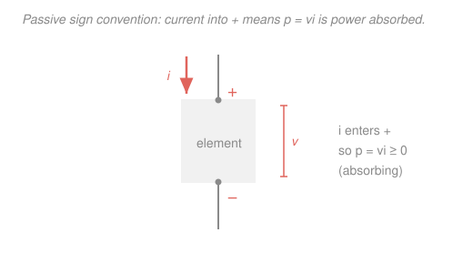

# Circuit Analysis · Lesson 1.1: Charge, current, voltage, power

> ⏱ ~15 min · Module 1: Resistive circuits and the fundamental laws · Builds on: [`calc-refresher`](../../calc-refresher/syllabus.md) · Unlocks: [1.2 Ohm's law & equivalent resistance](01-02-ohms-law-equivalent-resistance.md)

## Why this matters

Every circuit you will ever analyze is bookkeeping about four quantities: how much charge there is, how fast it flows, how much energy each unit of charge carries, and how fast that energy moves. Get these four straight — and get their **signs** straight — and the rest of the course is applying two conservation laws to them. This first lesson is short on machinery and long on precision: the single most common mistake in circuits isn't algebra, it's a dropped minus sign that turns a battery *delivering* power into one *absorbing* it. We fix the convention now so it never bites you.

## The idea

Picture charge as water and a wire as a pipe. **Current** is the flow rate — how much charge passes a point per second. **Voltage** between two points is the *pressure difference* pushing that charge; more precisely, it's the energy each unit of charge picks up (or gives up) in going from one point to the other. **Power** is how fast energy is being delivered: a lot of charge per second (current) each carrying a lot of energy (voltage) means a lot of power, so $p = vi$.

The one genuinely new idea is the **sign convention**. A resistor *takes* energy out of the circuit (it warms up); a battery *puts* energy in. Both obey $p = vi$ — the difference is only whether the current is flowing "downhill" through the element (absorbing) or being pushed "uphill" (delivering). To avoid guessing, engineers adopt one rule for labeling every element the same way, and then let the *sign* of the computed power tell them which kind it is. Positive power absorbed; negative power delivered. That rule is the **passive sign convention**, and it's the whole point of this lesson.

## The formal version

**Charge** $q$ is measured in coulombs (C). It comes in multiples of the electron charge $1.602\times10^{-19}\,\text{C}$, but we treat it as a continuous quantity.

**Current** is the rate charge flows past a point:

$$i = \frac{dq}{dt}, \qquad \text{units: amperes (A)} = \text{coulombs per second}.$$

*In words: current is how many coulombs cross a cross-section of wire each second.* Reading it the other way, the charge that has passed between times $t_0$ and $t$ is the integral $q = \int_{t_0}^{t} i\,dt'$. By convention $i$ points in the direction **positive** charge moves (opposite the electrons — a historical choice we're stuck with, and it never matters for the math).

**Voltage** is energy transferred per unit charge:

$$v = \frac{dw}{dq}, \qquad \text{units: volts (V)} = \text{joules per coulomb},$$

where $w$ is energy in joules (J). *In words: the voltage across an element is how much energy each coulomb gains or loses passing through it.* Voltage is always *between two points* and carries a **polarity**: we mark one terminal $+$ and the other $-$, and $v>0$ means the $+$ terminal is at the higher potential. Flip the labels and the number flips sign — the physics is identical, only the bookkeeping changed.

**Power** is the rate energy is delivered. Using the chain rule on $w$:

$$p = \frac{dw}{dt} = \frac{dw}{dq}\cdot\frac{dq}{dt} = v\,i, \qquad \text{units: watts (W)} = \text{joules per second}.$$

*In words: power is voltage times current — energy-per-charge times charge-per-second gives energy-per-second.*

**The passive sign convention.** Label every element so that the current arrow **enters the $+$ voltage terminal**. Then compute $p = vi$:

- $p > 0$ &nbsp;⟹&nbsp; the element is **absorbing** (consuming) power — a load, like a resistor.
- $p < 0$ &nbsp;⟹&nbsp; the element is **delivering** (supplying) power — a source, like a battery.

*In words: point the current into the plus sign, and a positive answer means the element is soaking up energy.* If you'd rather label a source with current leaving its $+$ terminal (natural for a battery), that's the same convention with a sign flip: its absorbed power is $-vi$, which comes out negative — it delivers.

**Conservation of power.** Energy is neither created nor destroyed inside a circuit, so at every instant the powers absorbed by all elements sum to zero:

$$\sum_{\text{all elements}} p_k = 0.$$

*In words: whatever the sources deliver, the rest of the circuit absorbs — down to the watt.* This is your free error check: compute every element's power with the passive convention and the total must be $0$. (It's a theorem — Tellegen's — and it holds for *any* circuit, linear or not.)

## Picture

The current arrow points *into* the $+$ terminal. With the element labeled this way, $p = vi$ is the power it **absorbs** — a positive answer means load, a negative answer means source. Every element in every later lesson gets labeled exactly like this box.

## Worked examples

**Example 1 (current, charge, power from a charge history).** The charge entering the $+$ terminal of an element is $q(t) = 2t^2\,\text{C}$ (with $t$ in seconds), and the voltage across it (measured $+$ where the charge enters) is a constant $v = 5\,\text{V}$.

*Current.* Differentiate:

$$i(t) = \frac{dq}{dt} = 4t\,\text{A}.$$

*Charge transferred in the first 2 s.* That's just $q(2) - q(0) = 2(2)^2 - 0 = 8\,\text{C}$ (or $\int_0^2 4t\,dt = 8\,\text{C}$ — same thing).

*Instantaneous power at $t = 2\,\text{s}$.* Current enters the $+$ terminal, so the passive convention applies directly:

$$p(2) = v\,i(2) = 5 \times (4\cdot 2) = 40\,\text{W} > 0 \;\Rightarrow\; \text{absorbing}.$$

*Average power over $[0,2]\,\text{s}$.* Average power is total energy over elapsed time. The energy absorbed is

$$w = \int_0^2 p\,dt = \int_0^2 5\cdot 4t\,dt = \int_0^2 20t\,dt = \big[10t^2\big]_0^2 = 40\,\text{J},$$

so $p_{\text{avg}} = w / \Delta t = 40 / 2 = 20\,\text{W}$. Sanity: $p(t) = 20t$ rises linearly from $0$ to $40\,\text{W}$, whose average is $20\,\text{W}$ ✓.

**Example 2 (power balance in a small circuit).** A source drives a current of $i = 1\,\text{A}$ around a single loop through two resistors in series. A voltmeter reads $8\,\text{V}$ across $R_1$ and $4\,\text{V}$ across $R_2$; the source is $12\,\text{V}$. (Notice $8 + 4 = 12$ — that the resistor voltages add up to the source is Kirchhoff's voltage law, [Lesson 1.3](01-03-kirchhoffs-laws-kcl-kvl.md); where each *individual* voltage comes from is Ohm's law, [1.2](01-02-ohms-law-equivalent-resistance.md). Here we just take the readings and do the power accounting.)

Label all three elements with the passive sign convention (current into $+$) and compute $p = vi$ for each.

- **$R_1$:** current flows into its $+$ terminal — a load. $\;p_1 = (8)(1) = +8\,\text{W}$ (absorbs).
- **$R_2$:** same. $\;p_2 = (4)(1) = +4\,\text{W}$ (absorbs).
- **Source:** the source *pushes* current out of its $+$ terminal, so relative to the passive convention the current enters its $-$ terminal. Its absorbed power is therefore $p_s = -(12)(1) = -12\,\text{W}$ — negative, so it **delivers** $12\,\text{W}$.

Check conservation:

$$\sum p = p_s + p_1 + p_2 = -12 + 8 + 4 = 0 \;\checkmark$$

The source delivers $12\,\text{W}$; the resistors absorb $8 + 4 = 12\,\text{W}$. They balance to the watt — as they must.

## Watch out

- **You might think power is always positive because $v$ and $i$ are "positive quantities."** They're not — $v$, $i$, and $p$ are *signed* labels tied to your chosen reference arrows and polarity. A source computed under the passive convention gives $p<0$, and that negative sign is information (it delivers), not an error.
- **You might apply $p=vi$ blindly without checking the arrow direction.** The formula $p=vi$ gives *absorbed* power **only** when the current enters the $+$ terminal. If your diagram has current entering the $-$ terminal, either use $p = -vi$ or relabel — but do one of them, consistently.
- **You might confuse charge and current.** Current is the *derivative* of charge, $i = dq/dt$; charge is the *integral* of current. A steady $2\,\text{A}$ means $2$ coulombs cross every second, so the charge keeps piling up even though the current is constant.

## One-liner

> Label every element with the current entering its $+$ terminal; then $p=vi>0$ means it soaks up power and $p<0$ means it supplies it — and across the whole circuit those powers sum to exactly zero.

## Problems

**P1 (🟢)** A battery pushes a steady current of $2\,\text{A}$ out of its $+$ terminal at a terminal voltage of $9\,\text{V}$. (a) How much charge does it move in one hour? (b) What power does it deliver, and is that "absorbing" or "delivering" under the passive sign convention?

**P2 (🟡)** The current into the $+$ terminal of an element is $i(t) = 10e^{-2t}\,\text{mA}$ for $t \ge 0$, and the voltage across it (same polarity) is a constant $v = 5\,\text{V}$. Find (a) the total charge delivered to the element as $t \to \infty$, (b) the total energy it absorbs, and (c) the peak power. *(This is the improper integral $\int_0^\infty e^{-2t}\,dt$ from [`calc-refresher`](../../calc-refresher/syllabus.md) wearing a circuits uniform.)*

**P3 (🔴, optional)** Four two-terminal elements are wired into one circuit. Labeled with the passive sign convention, three of them have powers $p_1 = +12\,\text{W}$, $p_2 = +6\,\text{W}$, and $p_3 = -25\,\text{W}$. (a) Find $p_4$. (b) Which element(s) are sources and which are loads, and verify the circuit balances.

Solutions

**P1** (a) Current is constant, so charge is just rate times time: $q = i\,t = 2\,\text{A} \times 3600\,\text{s} = 7200\,\text{C}$. (b) $p = vi = 9 \times 2 = 18\,\text{W}$. The battery pushes current *out* of its $+$ terminal, so under the passive convention (current into $+$) its absorbed power is $-18\,\text{W}$ — it **delivers** $18\,\text{W}$.

*Check.* Units: $\text{A}\cdot\text{s} = \text{C}$ ✓ and $\text{V}\cdot\text{A} = (\text{J/C})(\text{C/s}) = \text{J/s} = \text{W}$ ✓.

**P2** Work in SI: $i(t) = 0.010\,e^{-2t}\,\text{A}$.

(a) Total charge is the current integrated over all time:

$$Q = \int_0^\infty i\,dt = 0.010\int_0^\infty e^{-2t}\,dt = 0.010\cdot\Big[-\tfrac12 e^{-2t}\Big]_0^\infty = 0.010\cdot\tfrac12 = 0.005\,\text{C} = 5\,\text{mC}.$$

(b) Since $v$ is constant at $5\,\text{V}$, the energy is $W = \int_0^\infty v\,i\,dt = v\!\int_0^\infty i\,dt = vQ = 5 \times 0.005 = 0.025\,\text{J} = 25\,\text{mJ}$. Current enters the $+$ terminal, so this is energy **absorbed**.

(c) $p(t) = vi = 5\cdot 0.010\,e^{-2t} = 0.05\,e^{-2t}\,\text{W}$, which is largest at $t = 0$: $p_{\text{peak}} = 0.05\,\text{W} = 50\,\text{mW}$.

*Check.* The charge and energy are finite even though current flows forever — the exponential tail has finite area, exactly the improper-integral idea. Cross-check the energy a second way: $W = vQ = 5\,\text{V} \times 5\,\text{mC} = 25\,\text{mJ}$ ✓.

**P3** (a) Conservation of power says every element's power sums to zero:

$$p_1 + p_2 + p_3 + p_4 = 0 \;\Rightarrow\; p_4 = -(12 + 6 - 25) = -(-7) = +7\,\text{W}.$$

(b) Under the passive convention, positive power = absorbing (load), negative = delivering (source). So element 3 is the lone **source**, delivering $25\,\text{W}$; elements 1, 2, and 4 are **loads**, absorbing $12 + 6 + 7 = 25\,\text{W}$. Delivered equals absorbed ✓, and the signed total is $12 + 6 - 25 + 7 = 0$ ✓.

## Connections

- **Backward:** current is a derivative and charge/energy are integrals — this is [`calc-refresher`](../../calc-refresher/syllabus.md) applied to $q$, $i$, and $w$. P2's "finite total from an unbounded time window" is exactly the improper-integral convergence from that course.
- **Forward:** [1.2 Ohm's law](01-02-ohms-law-equivalent-resistance.md) supplies the missing link $v = iR$, turning $p = vi$ into a resistor's $p = i^2R = v^2/R$; and the power-balance check you just learned reappears as a sanity test at the end of *every* method in this course — nodal, mesh, Thévenin — while [4.3](04-03-ac-power-power-factor.md) splits $p = vi$ into real and reactive parts for AC.
- **Sideways:** voltage-as-energy-per-charge is the electric potential of electromagnetism (the field picture behind $v$ and $i$), and "powers sum to zero" is the same energy conservation you used for the block-on-a-ramp in mechanics — accounting for joules, whether they're gravitational or electrical.
