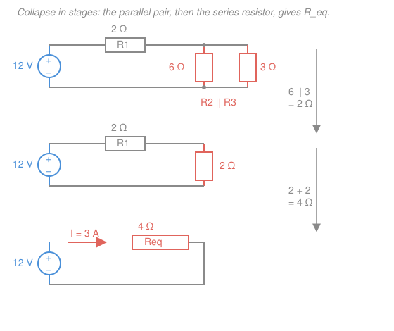

# Circuit Analysis · Lesson 1.2: Ohm's law and equivalent resistance

> ⏱ ~15 min · Module 1: Resistive circuits and the fundamental laws · Builds on: [1.1 Charge, current, voltage, power](01-01-charge-current-voltage-power.md) · Unlocks: [1.3 Kirchhoff's laws: KCL & KVL](01-03-kirchhoffs-laws-kcl-kvl.md)

## Why this matters

Point at any tangle of resistors — the volume knob in a stereo, the pull-down resistors on a chip's pins, the sensor divider in your phone — and the first question is always the same: *what single resistance does the source actually see?* Answer that, and Ohm's law hands you the current in one division. This lesson is the workhorse move of the whole course: **shrink a network to one number, then read off everything else.** Later methods (nodal, mesh, Thévenin) exist for the circuits where this shortcut runs out — but you'll reach for series–parallel reduction first, every time, because it's free.

## The idea

A resistor is a thing that *pushes back* against current: shove more charge through per second and it demands a bigger voltage to do it. The constant of proportionality is the **resistance** $R$. That's Ohm's law, and it's the simplest possible element law — a straight line through the origin relating voltage and current.

Now the magic of series and parallel. Two resistors **in series** (end to end, sharing one node, so the *same current* must flow through both) act like one longer resistor — their resistances just add. Two resistors **in parallel** (both ends tied together, sharing the *same voltage*, so the current splits between them) act like one *wider* resistor — the current has two lanes, so the combination is *easier* to push through than either alone. The clean way to see parallel is through **conductance** $G = 1/R$, "how easily current flows": parallel conductances add, because you're just adding lanes. Series adds resistance; parallel adds conductance. Every reduction is one of these two moves, applied over and over until a whole schematic becomes a single box.

## The formal version

**Ohm's law.** For an ideal resistor, the voltage $v$ across it and the current $i$ through it (with $i$ entering the $+$ terminal — the passive sign convention from [1.1](01-01-charge-current-voltage-power.md)) satisfy

$$v = iR,$$

where $R$ is the **resistance** in ohms ($\Omega$, volts per ampere). *In words: the voltage needed is proportional to the current you push.* Its reciprocal is the **conductance**

$$G = \frac{1}{R} \quad (\text{siemens, S}), \qquad\text{so}\qquad i = Gv.$$

**Power in a resistor.** Combining $p = vi$ (from [1.1](01-01-charge-current-voltage-power.md)) with $v = iR$ gives

$$p = vi = i^2 R = \frac{v^2}{R}.$$

*In words: a resistor always absorbs power (turns it to heat) — never negative, since $i^2R \ge 0$.* This is why resistors get warm and why $i^2 R$ is called "resistive loss."

**Ideal vs. real sources.** An **ideal voltage source** holds its voltage $V_s$ fixed no matter what current it delivers; an **ideal current source** holds its current $I_s$ fixed no matter the voltage. *In words: ideal sources are stubborn — one quantity is nailed down, the other is whatever the circuit demands.* Real sources aren't quite that stubborn: a real battery is modeled as an ideal source $V_s$ **in series with a small internal resistance** $R_s$, so its **terminal voltage** droops under load, $v_\text{term} = V_s - i R_s$.

**Series resistors add.** Resistors carrying the *same current* (in series) combine as

$$R_\text{eq} = R_1 + R_2 + \cdots + R_n = \sum_i R_i.$$

**Parallel resistors add as conductances.** Resistors sharing the *same voltage* (in parallel) combine as

$$\frac{1}{R_\text{eq}} = \frac{1}{R_1} + \cdots + \frac{1}{R_n}, \qquad\text{i.e.}\qquad G_\text{eq} = \sum_i G_i.$$

*In words: series resistances sum; parallel conductances sum.* For exactly **two** in parallel this rearranges into the **product-over-sum** shortcut you'll use constantly:

$$R_\text{eq} = \frac{R_1 R_2}{R_1 + R_2}.$$

**Two limiting cases.** A **short circuit** is $R = 0$ (an ideal wire: any current, zero voltage). An **open circuit** is $R = \infty$ (a gap: any voltage, zero current). *In words: a short is a resistor that isn't there; an open is a wire that's been cut.* A resistor in parallel with a short is bypassed ($R_\text{eq} = 0$); a resistor in series with an open carries no current.

## Picture

The reduction is always local: find any pure series or pure parallel pair, replace it with its equivalent, redraw, repeat. Here the coral parallel pair $6\,\Omega \| 3\,\Omega$ becomes $2\,\Omega$, which is in series with $R_1 = 2\,\Omega$, giving $R_\text{eq} = 4\,\Omega$ — and now the source current is one division away.

## Worked examples

**Example 1 — reduce a ladder, find the source current.** An $8\,\text{V}$ source drives $R_1 = 1\,\Omega$ in series with the parallel combination of $R_2 = 6\,\Omega$ and a branch made of $R_3 = 2\,\Omega$ and $R_4 = 4\,\Omega$ in series. Find $R_\text{eq}$ and the source current $I_s$.

Work from the *inside out* — the part farthest from the source first.

1. **Series inside the branch:** $R_3$ and $R_4$ carry the same current, so
$$R_{34} = R_3 + R_4 = 2 + 4 = 6\,\Omega.$$
2. **Parallel:** that $6\,\Omega$ branch sits across the same two nodes as $R_2 = 6\,\Omega$, so
$$R_2 \| R_{34} = \frac{6 \times 6}{6 + 6} = \frac{36}{12} = 3\,\Omega.$$
(Two *equal* resistors in parallel always halve: $R\|R = R/2$.)
3. **Series with $R_1$:**
$$R_\text{eq} = R_1 + 3 = 1 + 3 = 4\,\Omega.$$

Now Ohm's law on the whole thing:

$$I_s = \frac{V_s}{R_\text{eq}} = \frac{8}{4} = 2\,\text{A}.$$

As a bonus, the voltage across the parallel section is $I_s \times 3\,\Omega = 6\,\text{V}$ — the leftover $8 - 6 = 2\,\text{V}$ drops across $R_1$ ($2\,\text{A} \times 1\,\Omega$ ✓).

**Example 2 — parallel pair plus a series resistor, with power.** This is the figure's circuit: a $12\,\text{V}$ source, $R_1 = 2\,\Omega$ in series with $R_2 = 6\,\Omega \| R_3 = 3\,\Omega$. Find the source current and the total power delivered.

**Reduce.** Product-over-sum on the pair:

$$R_2 \| R_3 = \frac{6 \times 3}{6 + 3} = \frac{18}{9} = 2\,\Omega, \qquad R_\text{eq} = 2 + 2 = 4\,\Omega.$$

**Source current.**

$$I_s = \frac{12}{4} = 3\,\text{A}.$$

**Power** delivered by the source:

$$P = V_s I_s = 12 \times 3 = 36\,\text{W} \quad(\text{check: } I_s^2 R_\text{eq} = 3^2 \times 4 = 36\,\text{W} \;\checkmark).$$

Where does it go? $R_1$ eats $I_s^2 R_1 = 9 \times 2 = 18\,\text{W}$. The parallel pair shares the remaining $6\,\text{V}$ (since $I_s \times 2\,\Omega = 6\,\text{V}$): $P_{R_2} = 6^2/6 = 6\,\text{W}$ and $P_{R_3} = 6^2/3 = 12\,\text{W}$. The tally $18 + 6 + 12 = 36\,\text{W}$ matches the source exactly — conservation of power, the sanity check you should run every time.

## Watch out

- **You might think you can add resistances in parallel.** You can't — parallel *conductances* add. Two $6\,\Omega$ resistors in parallel give $3\,\Omega$ (smaller than either), not $12\,\Omega$. Rule of thumb: a parallel combination is always *smaller* than the smallest resistor in it; a series combination is always *larger* than the largest.
- **You might apply product-over-sum to three resistors.** $\frac{R_1 R_2}{R_1+R_2}$ is a two-resistor-only shortcut. For three or more, either use $\frac{1}{R_\text{eq}} = \sum \frac{1}{R_i}$ directly, or combine two at a time.
- **You might call two resistors "in series" just because they're drawn next to each other.** Series means they share a node with *nothing else connected there*, so the identical current is forced through both. If a third wire taps that middle node, the current can split and they are *not* in series. (Reading the topology, not the drawing, is exactly what [1.3](01-03-kirchhoffs-laws-kcl-kvl.md) makes rigorous.)

## One-liner

> Series resistances add, parallel conductances add — collapse the network to one $R_\text{eq}$, and Ohm's law $v = iR$ gives you everything else in a single division.

## Problems

**P1 (🟢)** A $24\,\text{V}$ source drives $R_1 = 8\,\Omega$ in series with the parallel combination of $R_2 = 6\,\Omega$ and $R_3 = 12\,\Omega$. Find the equivalent resistance seen by the source, the source current, and the power the source delivers.

**P2 (🟡)** A real battery is modeled as an ideal $12\,\text{V}$ source in series with an internal resistance $R_s = 0.5\,\Omega$. It drives a $5.5\,\Omega$ load. Find the load current and the battery's terminal voltage (the voltage across its two external posts). By how many volts has the terminal voltage drooped below the ideal $12\,\text{V}$?

**P3 (🔴)** Same real battery ($V_s = 12\,\text{V}$, $R_s = 2\,\Omega$ this time). (a) What current flows if you **short** the terminals with an ideal wire? (b) What voltage appears across the terminals when they're left **open**? These two numbers — the short-circuit current and the open-circuit voltage — are the seeds of the Thévenin equivalent you'll meet in [2.4](02-04-thevenin-norton-max-power.md).

Solutions

**P1** Combine the parallel pair with product-over-sum:

$$R_2 \| R_3 = \frac{6 \times 12}{6 + 12} = \frac{72}{18} = 4\,\Omega, \qquad R_\text{eq} = 8 + 4 = 12\,\Omega.$$

Source current and power:

$$I_s = \frac{24}{12} = 2\,\text{A}, \qquad P = V_s I_s = 24 \times 2 = 48\,\text{W}.$$

*Check.* $I_s^2 R_\text{eq} = 2^2 \times 12 = 48\,\text{W}$ ✓. And the parallel pair ($4\,\Omega$) is smaller than either $6$ or $12\,\Omega$, as a parallel combination must be.

**P2** Load and internal resistance are in series (same current), so

$$I = \frac{V_s}{R_s + R_\text{load}} = \frac{12}{0.5 + 5.5} = \frac{12}{6} = 2\,\text{A}.$$

The terminal voltage is the source voltage minus the internal drop — equivalently, the voltage across the load:

$$v_\text{term} = V_s - I R_s = 12 - 2 \times 0.5 = 11\,\text{V} \quad(\text{check: } I R_\text{load} = 2 \times 5.5 = 11\,\text{V} \;\checkmark).$$

So the terminal voltage has drooped by $1\,\text{V}$ below the ideal $12\,\text{V}$. *That droop is why a car's headlights dim when the starter motor (a very low-resistance load, huge $I$) kicks in.*

**P3** (a) A short is $R_\text{load} = 0$, so the only resistance left is the internal $R_s$:

$$I_\text{sc} = \frac{V_s}{R_s} = \frac{12}{2} = 6\,\text{A}.$$

This is the largest current the battery can source — the **short-circuit current** (and why shorting a battery is a bad idea: all that power, $I_\text{sc}^2 R_s = 72\,\text{W}$, dumps into the battery itself).

(b) An open is $R_\text{load} = \infty$, so **no current flows**. With $I = 0$ there's no drop across $R_s$, and the terminal voltage equals the full source:

$$v_\text{oc} = V_s - 0 \times R_s = 12\,\text{V}.$$

*Check.* Notice $R_s = v_\text{oc}/I_\text{sc} = 12/6 = 2\,\Omega$ recovers the internal resistance from the two measurements alone — precisely the trick behind finding $R_\text{th}$ in [2.4](02-04-thevenin-norton-max-power.md).

## Connections

- **Backward:** power here is just [1.1](01-01-charge-current-voltage-power.md)'s $p = vi$ fed through $v = iR$, giving $i^2R = v^2/R$; because a resistor always *absorbs* (never delivers), the passive sign convention never bites you. The conservation-of-power check in Example 2 is the same bookkeeping from that lesson.
- **Forward:** [1.3](01-03-kirchhoffs-laws-kcl-kvl.md) proves *why* series and parallel work (they're KVL and KCL in disguise) and handles the networks that *aren't* purely series–parallel; [1.4](01-04-voltage-current-dividers.md) turns "same current / same voltage" into the one-line divider formulas; and the short/open reasoning in P3 grows into the Thévenin and Norton equivalents of [2.4](02-04-thevenin-norton-max-power.md).
- **Sideways:** Ohm's law $v = iR$ is the circuit-level face of the *microscopic* Ohm's law $\mathbf{J} = \sigma \mathbf{E}$ (current density proportional to field) — resistance is what you get when you integrate conductivity $\sigma$ over a wire's geometry, a bridge back to the fields in the [`em-refresher`](../../em-refresher/syllabus.md) course.
