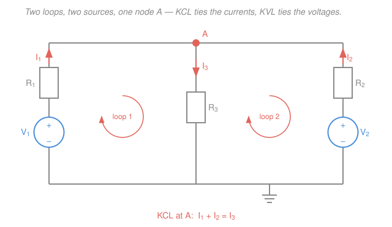

# Circuit Analysis · Lesson 1.3: Kirchhoff's laws — KCL and KVL

> ⏱ ~15 min · Module 1: Resistive circuits and the fundamental laws · Builds on: [1.2 Ohm's law & equivalent resistance](01-02-ohms-law-equivalent-resistance.md) · Unlocks: [1.4 Voltage & current dividers](01-04-voltage-current-dividers.md), [2.1 Nodal analysis](02-01-nodal-analysis.md)

## Why this matters

Ohm's law tells you what one resistor does. But a real circuit — the power path inside your phone, a sensor bridge, the ladder of resistors setting an amplifier's gain — is a *web* of elements, and the current through any one of them depends on all the others. Kirchhoff's two laws are the glue: they say charge doesn't pile up and energy doesn't appear from nowhere, and that is exactly enough to pin down every voltage and current. Turn the crank — Ohm at each element, Kirchhoff at each junction and loop — and any resistive circuit becomes a system of linear equations you can solve. Everything systematic that follows (nodal, mesh, Thévenin) is just a tidier way to write these same two laws.

## The idea

A schematic has three kinds of feature, and naming them is half the battle:

- A **node** is a junction — any point (or stretch of wire) where two or more elements connect. All wire touching a node is *the same node*; a plain wire has no voltage across it.
- A **branch** is a single element (a resistor, a source) carrying one current between two nodes.
- A **loop** is any closed path you can trace through the circuit and return to your start without retracing.

Now the two conservation laws, in plain words first:

**KCL (current, at a node):** water in equals water out. Charge can't accumulate at a junction — whatever current flows *into* a node must, at every instant, flow back *out*. If three wires meet and two pour current in, the third must carry it all away.

**KVL (voltage, around a loop):** it's like altitude on a hike. Voltage is energy per unit charge — a "height." Walk a charge all the way around a closed loop and back to where it started, and it must return to the same height: every rise across a source is spent as drops across the elements. The climbs and the descents cancel exactly.

That's the whole lesson. The only thing that trips people is **signs** — you must pick reference directions *first* and then bookkeep every term consistently. Get the bookkeeping right and the physics is trivial.

## The formal version

Fix a reference (positive) direction for each branch current, and a $+/-$ polarity for each element's voltage. Then:

**Kirchhoff's Current Law.** At any node,
$$\sum_{k} i_k = 0,$$
where currents *into* the node count as $+$ and currents *out* count as $-$ (or flip the convention — just be consistent).

In words: the algebraic sum of currents at a node is zero, because charge is conserved and nothing can store up at a dimensionless point.

**Kirchhoff's Voltage Law.** Around any closed loop,
$$\sum_{k} v_k = 0,$$
summing the voltage *drops* as you traverse the loop in a chosen direction.

In words: the algebraic sum of voltage changes around any loop is zero, because voltage is an energy-per-charge height and a round trip returns you to the same height.

**The sign rule you will actually use** — traverse the loop in your chosen direction and add:

- a resistor entered *along* its current: a **drop** $+iR$ (against the current: $-iR$);
- a source entered from $-$ to $+$: a **rise**, contributing $-V$; entered from $+$ to $-$: a **drop**, contributing $+V$.

Set the running total to zero. **Ohm + KCL + KVL is a complete toolkit:** for a circuit with $b$ branches you have $b$ unknown currents; KCL and KVL supply exactly $b$ independent equations, and Ohm's law relates each resistor's voltage to its current. The system always has a unique solution. Nodal and mesh analysis (Module 2) are just bookkeeping schemes that pick the *independent* equations for you so you never write a redundant one.

## Picture

Two branches ($V_1$ through $R_1$, $V_2$ through $R_2$) pour current into node A; one branch ($R_3$) carries it back to ground. KCL lives at the coral node; KVL lives around each coral loop. The whole top wire is a *single* node A (wire is free), and the whole bottom wire is the reference/ground node.

## Worked examples

**Example 1 (single loop — KVL and the sign bookkeeping).** One loop in series: a $15\,\text{V}$ source $V_1$ driving the loop, a $3\,\text{V}$ source $V_2$ wired to *oppose* it (think of a battery being charged), and two resistors $R_1 = 2\,\Omega$, $R_2 = 4\,\Omega$. There's only one current; guess it runs clockwise and call it $I$.

Traverse the loop clockwise, writing each drop:

- through $V_1$, from $-$ to $+$ (a rise): $-15$
- through $R_1$, along $I$ (a drop): $+2I$
- through $R_2$, along $I$ (a drop): $+4I$
- through $V_2$, from $+$ to $-$ (a drop, since it opposes us): $+3$

KVL sets the sum to zero:
$$-15 + 2I + 4I + 3 = 0 \;\Longrightarrow\; 6I = 12 \;\Longrightarrow\; I = 2\,\text{A}.$$

$I$ came out positive, so our guessed direction was right. Element voltages follow from Ohm:
$$V_{R_1} = IR_1 = 4\,\text{V}, \qquad V_{R_2} = IR_2 = 8\,\text{V}.$$

Sanity check with power: $V_1$ delivers $15 \times 2 = 30\,\text{W}$; the resistors dissipate $I^2R_1 + I^2R_2 = 8 + 16 = 24\,\text{W}$; and $V_2$, with current pushed *into* its $+$ terminal, **absorbs** $3 \times 2 = 6\,\text{W}$ (it's being charged). Powers balance: $30 = 24 + 6$. ✓ A source doesn't always deliver — the signs tell you.

**Example 2 (two loops, two sources — the full crank).** The circuit in the Picture, with $V_1 = 12\,\text{V}$, $R_1 = 3\,\Omega$; $V_2 = 10\,\text{V}$, $R_2 = 4\,\Omega$; and $R_3 = 2\,\Omega$ in the shared middle branch. This is *not* series–parallel reducible (two sources), so dividers are useless — but KCL + KVL never care.

Label three branch currents, all as drawn: $I_1$ and $I_2$ up into node A, $I_3$ down through $R_3$.

**KCL at node A** (in $=$ out):
$$I_1 + I_2 = I_3.$$

**KVL, loop 1** (left source, up $R_1$, down $R_3$): a rise $V_1$, a drop $I_1R_1$, a drop $I_3R_3$:
$$V_1 = I_1R_1 + I_3R_3 \;\Longrightarrow\; 12 = 3I_1 + 2I_3.$$

**KVL, loop 2** (right source, up $R_2$, down $R_3$):
$$V_2 = I_2R_2 + I_3R_3 \;\Longrightarrow\; 10 = 4I_2 + 2I_3.$$

Three equations, three unknowns. Substitute $I_3 = I_1 + I_2$:
$$12 = 5I_1 + 2I_2, \qquad 10 = 2I_1 + 6I_2.$$

From the second, $I_1 = 5 - 3I_2$; plug into the first: $12 = 5(5-3I_2) + 2I_2 = 25 - 13I_2$, so $I_2 = 1\,\text{A}$, then $I_1 = 2\,\text{A}$ and $I_3 = 3\,\text{A}$.

The node voltage is $V_A = I_3R_3 = 6\,\text{V}$ — a fact we never assumed, just derived. Power check: sources deliver $12(2) + 10(1) = 34\,\text{W}$; resistors dissipate $I_1^2R_1 + I_2^2R_2 + I_3^2R_3 = 12 + 4 + 18 = 34\,\text{W}$. ✓ Everything closes.

## Watch out

- **You might think** a node is just a single dot, **but actually** it's *every* point joined by unbroken wire. Two "dots" at opposite ends of a plain wire are the **same node** at the **same voltage** — count nodes by connectivity, not by how the schematic happens to be drawn, or you'll write too many equations.
- **You might think** a negative current or a positive-looking source means you made an error, **but actually** it just means reality runs opposite to your guessed reference direction — the magnitude is still correct. And a "source" with current forced into its $+$ terminal *absorbs* power. Never rush to "fix" a sign; interpret it.
- **You might think** more loops means more independent KVL equations to grab, **but actually** only the loops that each introduce a *new* branch count. Writing KVL around the big outer loop of Example 2 gives $V_1 - I_1R_1 + I_2R_2 - V_2 = 0$, which is just loop 1 minus loop 2 — no new information. A circuit gives exactly enough independent equations, and no more.

## One-liner

> KCL says charge can't pile up at a junction and KVL says voltage can't gain altitude on a round trip — pick your reference directions once, bookkeep every sign, and the crank turns any resistive circuit into equations.

## Problems

**P1 (🟢)** A single loop: a $9\,\text{V}$ source in series with $R_1 = 1\,\Omega$ and $R_2 = 2\,\Omega$. Find the loop current $I$, the voltage across each resistor, and confirm KVL closes. Which element dissipates the most power?

**P2 (🟡)** A two-loop circuit like Example 2: $V_1 = 10\,\text{V}$ through $R_1 = 4\,\Omega$ into node A, $V_2 = 10\,\text{V}$ through $R_2 = 2\,\Omega$ into node A, and $R_3 = 2\,\Omega$ from A to ground. Write KCL at A and KVL around each loop, and solve for $I_1$, $I_2$, $I_3$. Verify that the total power delivered equals the total dissipated.

**P3 (🔴, optional)** *A first taste of nodal analysis.* Node A connects three branches to ground: a $12\,\text{V}$ source through $2\,\Omega$, a $3\,\text{V}$ source through $3\,\Omega$, and a $3\,\Omega$ resistor straight to ground. Instead of naming branch currents, write **one** KCL equation at A using only the unknown node voltage $V_A$ (each branch current is $\frac{V_\text{far} - V_A}{R}$), and solve for $V_A$. Then find all three branch currents and say what the $3\,\text{V}$ source is doing (delivering or absorbing?).

Solutions

**P1** One current, so KVL around the loop with a clockwise $I$: $-9 + 1\cdot I + 2\cdot I = 0 \Rightarrow 3I = 9 \Rightarrow I = 3\,\text{A}$. Resistor voltages: $V_{R_1} = 3\,\text{V}$, $V_{R_2} = 6\,\text{V}$. KVL check: the two drops $3 + 6 = 9\,\text{V}$ exactly balance the source's $9\,\text{V}$ rise. ✓ Power: $R_2$ dissipates $I^2R_2 = 9 \times 2 = 18\,\text{W}$ versus $R_1$'s $9\,\text{W}$ — the **larger resistor** dissipates more (same current, so power scales with $R$). The source delivers $9 \times 3 = 27 = 18 + 9$. ✓

**P2** Currents $I_1, I_2$ into A, $I_3$ out through $R_3$.
KCL: $I_1 + I_2 = I_3$.
Loop 1: $10 = 4I_1 + 2I_3$. Loop 2: $10 = 2I_2 + 2I_3$.
Substitute $I_3 = I_1 + I_2$: $\;10 = 6I_1 + 2I_2\;$ and $\;10 = 2I_1 + 4I_2$. Halve each: $5 = 3I_1 + I_2$ and $5 = I_1 + 2I_2$. From the first $I_2 = 5 - 3I_1$; substitute: $5 = I_1 + 2(5 - 3I_1) = 10 - 5I_1 \Rightarrow I_1 = 1\,\text{A}$, then $I_2 = 2\,\text{A}$, $I_3 = 3\,\text{A}$.
Power delivered: $10(1) + 10(2) = 30\,\text{W}$. Dissipated: $I_1^2R_1 + I_2^2R_2 + I_3^2R_3 = 4 + 8 + 18 = 30\,\text{W}$. ✓ (Node voltage $V_A = I_3R_3 = 6\,\text{V}$.)

**P3** Each source-branch current *into* A is $\frac{V_\text{far} - V_A}{R}$; the ground branch carries $\frac{V_A}{3}$ *out*. KCL (in $=$ out):
$$\frac{12 - V_A}{2} + \frac{3 - V_A}{3} = \frac{V_A}{3}.$$
Multiply through by $6$: $\;3(12 - V_A) + 2(3 - V_A) = 2V_A \Rightarrow 36 - 3V_A + 6 - 2V_A = 2V_A \Rightarrow 42 - 5V_A = 2V_A \Rightarrow V_A = 6\,\text{V}.$
Branch currents: $I_1 = \frac{12 - 6}{2} = 3\,\text{A}$ into A; $I_2 = \frac{3 - 6}{3} = -1\,\text{A}$ — the minus means $1\,\text{A}$ actually flows *out* of A **into** the $3\,\text{V}$ source; ground branch $I_3 = \frac{6}{3} = 2\,\text{A}$ out. KCL check: $3 + (-1) = 2$. ✓ Because current is forced into the $3\,\text{V}$ source's $+$ terminal, it **absorbs** power ($3 \times 1 = 3\,\text{W}$) — it's being charged, not driving. (That single equation in $V_A$ *is* nodal analysis, which [2.1](02-01-nodal-analysis.md) will formalize.)

## Flashback

**From Lesson 1.2 (Ohm's law & equivalent resistance):** A $24\,\text{V}$ source drives $R_1 = 4\,\Omega$ in series with the parallel combination of $R_2 = 12\,\Omega$ and $R_3 = 6\,\Omega$. Find the equivalent resistance seen by the source, the source current, and the voltage across the parallel pair.

Solution

Parallel pair: $R_2 \| R_3 = \dfrac{12 \times 6}{12 + 6} = \dfrac{72}{18} = 4\,\Omega$. In series with $R_1$: $R_\text{eq} = 4 + 4 = 8\,\Omega$. Source current $I_s = \dfrac{24}{8} = 3\,\text{A}$. Voltage across the parallel pair is the current times its resistance: $3 \times 4 = 12\,\text{V}$ (the other $12\,\text{V}$ drops across $R_1$, and $12 + 12 = 24$ — KVL, already lurking). ✓

## Connections

- **Backward:** KVL is the loop-level statement of what [1.2](01-02-ohms-law-equivalent-resistance.md) proved for two special cases — series resistors add because the *same* current drops through each and KVL sums those drops; parallel resistors share a voltage because KVL around their little loop forces it. And the power balance in every example is [1.1](01-01-charge-current-voltage-power.md)'s conservation of power, now guaranteed by these two laws.
- **Forward:** [1.4](01-04-voltage-current-dividers.md)'s divider formulas are KVL and KCL solved once, symbolically. [2.1 nodal](02-01-nodal-analysis.md) and [2.2 mesh](02-02-mesh-analysis.md) are algorithms that write *only the independent* KCL/KVL equations — P3 above is nodal analysis in embryo.
- **Sideways:** KCL is conservation of charge at a point — the circuit-sized version of the continuity equation and "current in $=$ current out" that the em-refresher derives from a divergence-free current density; KVL is that a static field is conservative (voltage is a genuine potential, path-independent). And "$b$ branch currents, $b$ independent linear equations, one unique solution" is a square linear system — the conductance-matrix form the linalg-refresher's row-reduction and matrix inverse solve wholesale.
