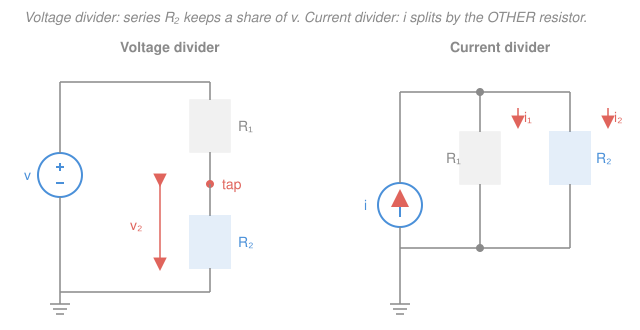

# Circuit Analysis · Lesson 1.4: Voltage and current dividers

> ⏱ ~15 min · Module 1: Resistive circuits and the fundamental laws · Builds on: [1.2 Ohm's law and equivalent resistance](01-02-ohms-law-equivalent-resistance.md), [1.3 Kirchhoff's laws: KCL and KVL](01-03-kirchhoffs-laws-kcl-kvl.md) · Unlocks: [Module 2 — Nodal analysis](02-01-nodal-analysis.md)

## Why this matters

Half the "circuits" inside a phone, a sensor, or an audio knob are just two resistors splitting a voltage — that's how you scale a 3.3 V rail down to the 1.8 V a chip wants, or how a volume slider taps off a fraction of a signal. Dividers are the fastest tool in circuit analysis: once you recognize the pattern, you read a branch voltage or current off the schematic in **one line**, no equations to solve. This lesson turns Kirchhoff's laws from [1.3](01-03-kirchhoffs-laws-kcl-kvl.md) into two reusable shortcuts — and warns you exactly when the shortcut lies.

## The idea

Two ideas, mirror images of each other.

**Series resistors share voltage.** Put resistors in a line and push one current through all of them. The same current $i$ flows through each, so by Ohm's law each drops a voltage $iR$ — bigger resistor, bigger drop. The source voltage gets **divided up in proportion to resistance**. A resistor that's half the total soaks up half the voltage.

**Parallel resistors share current.** Tie resistors between the same two nodes and they all feel the same voltage $v$. Each pulls a current $v/R = vG$ — bigger *conductance* $G = 1/R$ (i.e. *smaller* resistance) pulls more current. The incoming current gets **divided up in proportion to conductance**. The easy path grabs the bigger share.

The water analogy: voltage is like pressure, current like flow. Resistors in series are pipes end-to-end — same flow, and the pressure drop piles up across the narrowest ones. Resistors in parallel are pipes side-by-side across the same pressure — the widest pipe carries the most flow. Series splits pressure; parallel splits flow.

## The formal version

**Voltage divider.** For resistors $R_1, R_2, \dots, R_n$ in **series** across a voltage $v$ (with no other branch drawing current between them), the voltage across resistor $R_k$ is

$$v_k = v\cdot\frac{R_k}{R_1 + R_2 + \cdots + R_n} = v\cdot\frac{R_k}{\sum R}.$$

*In words: each series resistor keeps the same fraction of the source voltage as it is of the total resistance.* Here $v$ is the total voltage across the string (volts), $R_k$ the resistance of the branch you want (ohms), and $\sum R$ the sum of all the series resistances. Two-resistor case: $v_2 = v\cdot\frac{R_2}{R_1+R_2}$.

**Current divider.** For resistors in **parallel** sharing a total current $i$, the current through resistor $R_k$ (conductance $G_k = 1/R_k$, siemens) is

$$i_k = i\cdot\frac{G_k}{G_1 + G_2 + \cdots + G_n} = i\cdot\frac{G_k}{\sum G}.$$

*In words: each parallel resistor takes the same fraction of the total current as its conductance is of the total conductance.* For exactly **two** resistors this collapses to a form worth memorizing:

$$i_1 = i\cdot\frac{R_2}{R_1 + R_2}, \qquad i_2 = i\cdot\frac{R_1}{R_1 + R_2}.$$

*In words: with two resistors, each branch's current is set by the* **other** *resistor.* Read that twice — the current in $R_1$ carries $R_2$ on top. (It makes sense: a big $R_2$ blocks its own branch, shoving more current into $R_1$.) This two-resistor swap is the single most common divider slip, so the picture marks it.

Both formulas are just Ohm's law plus one Kirchhoff law. Voltage divider: KVL says the drops add to $v$, and the shared current is $i = v/\sum R$, so $v_k = iR_k$. Current divider: KCL says the branch currents add to $i$, and the shared voltage is $v = i/\sum G$ (since parallel conductances add), so $i_k = vG_k$.

## Picture

Left, the tap sits between two series resistors and reports $v_2 = v\,R_2/(R_1+R_2)$. Right, the source current forks into two parallel branches, each taking a share set by the *other* resistor.

## Worked examples

**Example 1 (voltage divider — and why a load spoils it).** A $12\,\text{V}$ source drives $R_1 = 4\,\text{k}\Omega$ in series with $R_2 = 8\,\text{k}\Omega$; we tap the voltage across $R_2$.

The same current runs through both (nothing else is connected), so the divider applies directly:

$$v_2 = 12\cdot\frac{R_2}{R_1 + R_2} = 12\cdot\frac{8}{4 + 8} = 12\cdot\frac{8}{12} = 8\,\text{V}.$$

One line, done. Now **connect a load** $R_L = 8\,\text{k}\Omega$ from the tap to ground — say the input of the next stage. The tap current no longer flows only through $R_2$; it splits between $R_2$ and $R_L$. So the "bottom" of the divider is now $R_2 \parallel R_L$:

$$R_2 \parallel R_L = \frac{8\cdot 8}{8 + 8} = 4\,\text{k}\Omega, \qquad v_2 = 12\cdot\frac{4}{4 + 4} = 6\,\text{V}.$$

The tap sagged from $8\,\text{V}$ to $6\,\text{V}$ — a 25% error — just by attaching something to it. **The bare divider formula assumes nothing draws current at the tap.** Fold the load into the bottom resistance and the divider is exact again.

**Example 2 (current divider — the two-resistor "other resistor" rule).** A $3\,\text{A}$ source feeds the parallel pair $R_1 = 6\,\Omega$ and $R_2 = 3\,\Omega$. Find the current in the $6\,\Omega$ resistor. (This is the split at the heart of [the Module 1 boss problem](../../circuits/syllabus.md).)

The current in $R_1$ is set by the **other** resistor, $R_2$:

$$i_{6\Omega} = i\cdot\frac{R_2}{R_1 + R_2} = 3\cdot\frac{3}{6 + 3} = 3\cdot\frac{3}{9} = 1\,\text{A}.$$

The other branch takes the rest: $i_{3\Omega} = 3\cdot\frac{6}{9} = 2\,\text{A}$. Sanity: they sum to $3\,\text{A}$ ✓ (KCL), and the smaller resistor ($3\,\Omega$) hogs the larger current, as it should. Cross-check with a voltage: $6\parallel 3 = 2\,\Omega$, so the pair sits at $v = 3\times 2 = 6\,\text{V}$, giving $i_{6\Omega} = 6/6 = 1\,\text{A}$ ✓ and $i_{3\Omega} = 6/3 = 2\,\text{A}$ ✓.

## Watch out

- **You might grab the wrong resistor in the current divider.** The current in $R_1$ is proportional to $R_2$ — the *other* one — not $R_1$. (For voltages it's the intuitive way: the voltage across $R_1$ is proportional to $R_1$.) The clean rule: voltage divider uses the branch's *own* resistance on top; two-resistor current divider uses the *opposite* resistance on top. When in doubt, drop to conductances, where every branch honestly uses its own $G_k$.
- **You might apply a voltage divider when the tap is loaded.** The formula $v_k = v\,R_k/\sum R$ holds only while the *same* current flows through every series resistor. The instant a branch pulls current out of the tap (a load, a meter, the next stage), that's no longer true — as Example 1 showed. Absorb the load into the divider (parallel-combine it) before you divide.
- **You might force a divider onto the wrong topology.** Voltage dividers need resistors truly in **series** (one shared current); current dividers need them truly in **parallel** (one shared voltage). A resistor with a source or another branch tapped into its middle is neither. Check the topology first — dividers are a reward for recognizing series/parallel, not a substitute for it.

## One-liner

> Series resistors split voltage by their own share of $\sum R$; parallel resistors split current by their share of $\sum G$ — and for two in parallel, each branch rides on the *other* resistor.

## Problems

**P1 (🟢)** A $10\,\text{V}$ source drives $R_1 = 3\,\Omega$ in series with $R_2 = 2\,\Omega$. Use the voltage divider to find the voltage across $R_2$, then across $R_1$. Do they add to $10\,\text{V}$?

**P2 (🟡)** A $12\,\text{A}$ current source feeds **three** parallel resistors: $R_1 = 2\,\Omega$, $R_2 = 4\,\Omega$, $R_3 = 4\,\Omega$. Find the current in each. (The two-resistor "other resistor" trick doesn't apply to three branches — use conductances.)

**P3 (🔴)** A **resistor ladder**: a $12\,\text{V}$ source drives $R_1 = 2\,\Omega$ in series to node $A$; from $A$ a shunt resistor $R_2 = 3\,\Omega$ goes to ground; also from $A$, $R_3 = 2\,\Omega$ goes in series to node $B$; from $B$ a shunt $R_4 = 4\,\Omega$ goes to ground. Find the voltage at node $B$ and the current through $R_4$. (Hint: collapse the ladder from the far end back to the source, then divide forward.)

Solutions

**P1** Same current through both, so the divider applies:

$$v_2 = 10\cdot\frac{R_2}{R_1 + R_2} = 10\cdot\frac{2}{3 + 2} = 10\cdot\frac{2}{5} = 4\,\text{V},$$
$$v_1 = 10\cdot\frac{R_1}{R_1 + R_2} = 10\cdot\frac{3}{5} = 6\,\text{V}.$$

They add to $4 + 6 = 10\,\text{V}$ ✓ — that's KVL, and it's the reason the two fractions $R_1/\sum R$ and $R_2/\sum R$ must sum to 1. *Check.* The bigger resistor ($R_1$) takes the bigger drop, as expected. Current in the loop: $i = 10/5 = 2\,\text{A}$, and $iR_2 = 2\times 2 = 4\,\text{V}$ ✓.

**P2** With three branches, use conductances $G_k = 1/R_k$:

$$G_1 = \tfrac{1}{2} = 0.5\,\text{S}, \quad G_2 = \tfrac{1}{4} = 0.25\,\text{S}, \quad G_3 = \tfrac{1}{4} = 0.25\,\text{S}, \qquad \sum G = 1\,\text{S}.$$

Then $i_k = i\,G_k/\sum G$:

$$i_1 = 12\cdot\frac{0.5}{1} = 6\,\text{A}, \qquad i_2 = 12\cdot\frac{0.25}{1} = 3\,\text{A}, \qquad i_3 = 12\cdot\frac{0.25}{1} = 3\,\text{A}.$$

*Check.* They sum to $6 + 3 + 3 = 12\,\text{A}$ ✓ (KCL). Equivalent-resistance cross-check: $\sum G = 1\,\text{S}$ so $R_\text{eq} = 1\,\Omega$, the pair sits at $v = 12\times 1 = 12\,\text{V}$, and $i_1 = 12/2 = 6\,\text{A}$, $i_2 = i_3 = 12/4 = 3\,\text{A}$ ✓. The smallest resistor ($R_1$) grabs the largest current.

**P3** Collapse from the far (right) end. At node $B$ the only thing to ground is $R_4 = 4\,\Omega$. Looking *into* node $A$ toward $B$, the path is $R_3$ in series with $R_4$: $R_3 + R_4 = 2 + 4 = 6\,\Omega$. That $6\,\Omega$ is in parallel with the shunt $R_2 = 3\,\Omega$ at node $A$:

$$R_2 \parallel (R_3 + R_4) = 3 \parallel 6 = \frac{3\cdot 6}{3 + 6} = 2\,\Omega.$$

Now the source sees $R_1 = 2\,\Omega$ in series with that $2\,\Omega$, total $4\,\Omega$. Voltage-divide to get node $A$ (the tap between $R_1$ and the $2\,\Omega$ block):

$$V_A = 12\cdot\frac{2}{2 + 2} = 6\,\text{V}.$$

From $A$, the branch to $B$ is a clean two-resistor voltage divider ($R_3$ then $R_4$), because beyond $R_4$ nothing draws current:

$$V_B = V_A\cdot\frac{R_4}{R_3 + R_4} = 6\cdot\frac{4}{2 + 4} = 6\cdot\frac{4}{6} = 4\,\text{V}, \qquad i_{R_4} = \frac{V_B}{R_4} = \frac{4}{4} = 1\,\text{A}.$$

*Check.* Currents balance at $A$: the branch toward $B$ carries $V_A/(R_3+R_4) = 6/6 = 1\,\text{A}$, and the shunt $R_2$ carries $V_A/R_2 = 6/3 = 2\,\text{A}$, summing to $3\,\text{A}$ — which equals the source current $V_A\!\ldots$ let's confirm: source current $= 12/4 = 3\,\text{A}$ ✓ (KCL at $A$). Note we could **not** have divided $V_A$ straight from $12\,\text{V}$ using only $R_1, R_2$ and ignored $R_3, R_4$ — the ladder to the right loads node $A$, exactly the Example-1 caveat. Folding it in first is what makes the forward divide exact.

## Flashback

**From [Lesson 1.3](01-03-kirchhoffs-laws-kcl-kvl.md) (KVL around a loop, fresh numbers):** A single loop contains two batteries opposing each other — a $20\,\text{V}$ source and an $8\,\text{V}$ source wired so they push current in opposite directions — and two resistors $R_1 = 3\,\Omega$ and $R_2 = 1\,\Omega$. Find the loop current $i$ and the voltage across $R_1$.

Solution

Pick a loop direction (say clockwise, the direction the $20\,\text{V}$ source drives) and write KVL — the algebraic sum of voltage changes around the loop is zero. Going around: the $20\,\text{V}$ source is a rise ($+20$), each resistor is a drop ($-iR_1$, $-iR_2$), and the opposing $8\,\text{V}$ source is a drop ($-8$):

$$20 - iR_1 - 8 - iR_2 = 0 \;\Longrightarrow\; 20 - 8 = i(R_1 + R_2) \;\Longrightarrow\; 12 = i(3 + 1).$$

$$i = \frac{12}{4} = 3\,\text{A}, \qquad v_{R_1} = iR_1 = 3\times 3 = 9\,\text{V}.$$

*Check.* Net driving voltage $20 - 8 = 12\,\text{V}$ across total resistance $4\,\Omega$ gives $3\,\text{A}$ ✓. The two resistor drops $iR_1 + iR_2 = 9 + 3 = 12\,\text{V}$ exactly absorb the net source voltage — KVL closes. This is the series-loop reasoning the voltage divider is built on: the $20-8=12\,\text{V}$ net gets divided $9\!:\!3$ between the $3\,\Omega$ and $1\,\Omega$ resistors.

## Connections

- **Backward:** dividers are nothing but [1.2](01-02-ohms-law-equivalent-resistance.md)'s series/parallel combining and Ohm's law wrapped around [1.3](01-03-kirchhoffs-laws-kcl-kvl.md)'s KVL and KCL — the voltage divider *is* KVL sharing one current; the current divider *is* KCL sharing one voltage. Recognizing the topology (series vs. parallel) is the whole prerequisite.
- **Forward:** [Module 2 — nodal analysis](02-01-nodal-analysis.md) and mesh analysis are the general algorithms for when dividers run out — circuits with multiple sources or non-series/parallel structure. Dividers stay useful inside them as a quick read-off, and the same divider ratios reappear in [Module 4](04-02-impedance-phasor-analysis.md) with resistances replaced by complex impedances $Z$ (an AC voltage divider is how every passive filter works).
- **Sideways:** the same "share in proportion to the easy path" pattern is everywhere — in [`em-refresher`](../../em-refresher/syllabus.md), field energy splits across series/parallel capacitors by exactly this logic, and in mechanics a force divides between parallel springs in proportion to their stiffness (the spring-network analogue of parallel conductances). The proportional-split idea is one piece of math wearing many uniforms.
