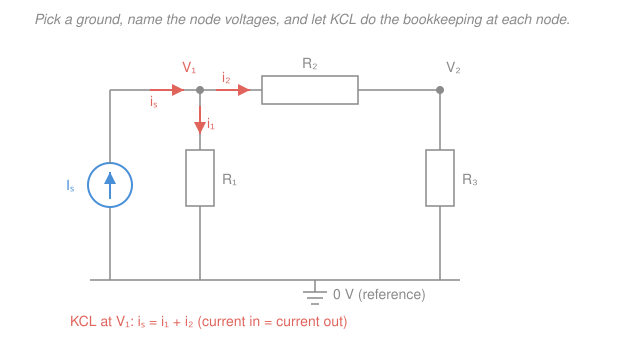

# Circuit Analysis · Lesson 2.1: Nodal analysis

> ⏱ ~15 min · Module 2: Systematic analysis and network theorems · Builds on: [1.3 Kirchhoff's laws: KCL & KVL](01-03-kirchhoffs-laws-kcl-kvl.md), [1.4 Voltage & current dividers](01-04-voltage-current-dividers.md) · Unlocks: [2.2 Mesh analysis](02-02-mesh-analysis.md), [2.3 Superposition & source transformation](02-03-superposition-source-transformation.md)

## Why this matters

Dividers and series–parallel tricks solve tidy circuits, but the moment you have two sources, or resistors wired in a mesh that isn't cleanly series-or-parallel, you need an *algorithm* — a recipe that never gets stuck. Nodal analysis is that algorithm, and it's the one a computer runs: every SPICE simulation of a chip with a billion transistors is, underneath, KCL written at every node and a giant linear system solved. Learn it once and you can predict any linear circuit's behavior mechanically, no cleverness required.

## The idea

Here's the whole trick. Instead of hunting for a dozen unknown branch currents, pick **one** node and call its voltage zero — that's your **reference** (ground). Every other node's voltage is measured relative to it. Now the *node voltages* are your only unknowns, and there are far fewer of them than there are branches.

Why does this help? Because once you know the voltage at both ends of a resistor, Ohm's law hands you its current for free: the current flowing from node $a$ to node $b$ through resistance $R$ is just $(v_a - v_b)/R$. So you never solve for currents directly — you write them all in terms of node voltages, then enforce the one law that must hold at every node: **whatever current flows in must flow out** (KCL, charge can't pile up). One KCL equation per unknown node, one linear system, done.

A one-node taste before the machinery. Suppose a node $V$ connects to three things: a $12\,\text{V}$ source through a $6\,\Omega$ resistor, a $3\,\text{A}$ source pushing current *in*, and a $12\,\Omega$ resistor down to ground. Balance the currents at $V$:

$$\underbrace{\frac{12 - V}{6}}_{\text{in via }6\,\Omega} + \underbrace{3}_{\text{source}} = \underbrace{\frac{V}{12}}_{\text{out via }12\,\Omega} \;\;\Longrightarrow\;\; V = 20\,\text{V}.$$

No loops, no branch-current bookkeeping — one equation, one answer.

## The formal version

**Setup.** A circuit with $N$ nodes. Choose one as the reference; its voltage is $0$. Label the remaining $N-1$ node voltages $V_1, V_2, \dots$ — these are the unknowns.

**Node-voltage equations.** At each non-reference node, write **KCL**: the sum of currents leaving the node equals the sum of source currents injected into it. Express every resistor current with **Ohm's law** — the current leaving node $k$ toward a neighbor node $j$ through resistance $R$ is $(V_k - V_j)/R$; toward ground it is $V_k/R$.

*In words: at every node, add up "my voltage minus my neighbor's, over the resistor between us," and set that equal to whatever the current sources push in.*

**Matrix form.** For a circuit of resistors and current sources, the $N-1$ equations collapse into

$$\mathbf{G}\,\mathbf{v} = \mathbf{i},$$

where $\mathbf{v}$ is the vector of node voltages, $\mathbf{i}$ is the vector of source currents injected at each node, and $\mathbf{G}$ is the **conductance matrix**, built by inspection:

- **Diagonal** $G_{kk}$ = sum of *all* conductances touching node $k$ (recall conductance $= 1/R$).
- **Off-diagonal** $G_{kj}$ = *minus* the conductance connecting nodes $k$ and $j$.

*In words: the diagonal is "everything attached to me," the off-diagonals are "what I share with each neighbor," negated.* Because the resistor between $k$ and $j$ is the same resistor as between $j$ and $k$, $\mathbf{G}$ is **symmetric** ($G_{kj} = G_{jk}$) — a fact worth its own line, because it's exactly the kind of structured linear system you met in [`linalg-refresher`](../../linalg-refresher/syllabus.md), and symmetry means the whole apparatus of that course (positive-definiteness, guaranteed unique solution) applies here.

**The supernode.** A current source's current is *known*, so it slots straight into $\mathbf{i}$. But a **voltage source between two non-reference nodes** is trouble: the current *through* it is unknown, so you can't write a clean KCL at either node alone. The fix: draw a bubble enclosing **both** nodes and the source — a **supernode** — and write KCL for the whole bubble (the unknown source current is internal, so it cancels). That's one equation; the source itself gives the second, a **constraint** $V_a - V_b = V_s$. Two equations, two nodes.

*In words: if a voltage source blocks you from writing KCL at a node, swallow both its nodes into one super-node, balance currents across the whole blob, and add the fact that the source fixes the difference between the two voltages.*

## Picture

The reference node is the bottom rail ($0\,\text{V}$). Everything else is measured against it. At node $V_1$ (coral) the current source pushes $i_s$ in; that same charge must leave — some down through $R_1$ as $i_1$, the rest across $R_2$ toward $V_2$ as $i_2$. Writing $i_s = i_1 + i_2$ with each current as a voltage difference over a resistance *is* the node equation.

## Worked examples

### Example 1 — Two nodes, two current sources

Take the figure's shape with real numbers: $R_1 = 2\,\Omega$ (node 1 to ground), $R_2 = 4\,\Omega$ (node 1 to node 2), $R_3 = 2\,\Omega$ (node 2 to ground). A $5\,\text{A}$ source injects into node 1, a $1\,\text{A}$ source into node 2. Find $V_1$ and $V_2$.

**KCL at node 1** (currents leaving = source in):

$$\frac{V_1}{2} + \frac{V_1 - V_2}{4} = 5.$$

**KCL at node 2:**

$$\frac{V_2}{2} + \frac{V_2 - V_1}{4} = 1.$$

Assemble the matrix by inspection. Node 1 sees conductances $\tfrac12 + \tfrac14 = \tfrac34$; node 2 the same; they share $\tfrac14$:

$$\begin{pmatrix} \tfrac34 & -\tfrac14 \\[2pt] -\tfrac14 & \tfrac34 \end{pmatrix}\begin{pmatrix} V_1 \\ V_2 \end{pmatrix} = \begin{pmatrix} 5 \\ 1 \end{pmatrix}.$$

(Note the symmetry — the $-\tfrac14$ appears twice.) Clear fractions by multiplying each row by $4$: $\;3V_1 - V_2 = 20\;$ and $\;-V_1 + 3V_2 = 4$. From the first, $V_2 = 3V_1 - 20$; substitute into the second:

$$-V_1 + 3(3V_1 - 20) = 4 \;\Longrightarrow\; 8V_1 = 64 \;\Longrightarrow\; V_1 = 8\,\text{V}, \quad V_2 = 4\,\text{V}.$$

**Sanity check (power balances).** Resistor powers: $V_1^2/R_1 = 64/2 = 32\,\text{W}$, $V_2^2/R_3 = 16/2 = 8\,\text{W}$, $(V_1-V_2)^2/R_2 = 16/4 = 4\,\text{W}$ — total $44\,\text{W}$ dissipated. Sources deliver $5(8) + 1(4) = 44\,\text{W}$. ✓

### Example 2 — A supernode

Now a $6\,\text{V}$ source sits **between** two non-reference nodes. Node 1 connects to ground through $R_a = 2\,\Omega$; node 2 connects to ground through $R_b = 4\,\Omega$; the $6\,\text{V}$ source links node 1 (its $+$ terminal) to node 2, so $V_1 - V_2 = 6$. A $6\,\text{A}$ current source injects into node 1. Find $V_1$ and $V_2$.

You **can't** write an isolated KCL at node 1 — the current through the voltage source is unknown. So enclose nodes 1 and 2 in a **supernode** and balance *all* current crossing its boundary. Current in: $6\,\text{A}$. Current out: down through $R_a$ and $R_b$ to ground:

$$\frac{V_1}{2} + \frac{V_2}{4} = 6. \qquad\text{(supernode KCL)}$$

The source supplies the second equation:

$$V_1 - V_2 = 6. \qquad\text{(constraint)}$$

Substitute $V_1 = V_2 + 6$ into the supernode equation and multiply by $4$:

$$2(V_2 + 6) + V_2 = 24 \;\Longrightarrow\; 3V_2 = 12 \;\Longrightarrow\; V_2 = 4\,\text{V}, \quad V_1 = 10\,\text{V}.$$

**Check.** $V_1 - V_2 = 6$ ✓. Currents to ground: $10/2 = 5\,\text{A}$ and $4/4 = 1\,\text{A}$, totaling $6\,\text{A}$ — exactly what the current source pushes in. ✓ (The $1\,\text{A}$ imbalance at each node individually is carried by the source's own internal current — which is precisely why we couldn't split them.)

## Watch out

- **You might think** you need a ground somewhere special. **Actually** any node works as the reference — the *differences* between node voltages are physical, the absolute zero is your free choice. Pick the node touching the most branches (often the source's negative terminal) to simplify the algebra.
- **You might think** a voltage source between a node and ground needs a supernode. **Actually** no — that node's voltage is simply *fixed* by the source (e.g. $V_1 = 12\,\text{V}$), so it stops being an unknown. Supernodes are only for a source floating between two **non-reference** nodes.
- **You might think** the sign of the off-diagonal $G_{kj}$ is a choice. **Actually** it's always **negative** for a resistor shared between two nodes (and the diagonal always **positive**). If your assembled $\mathbf{G}$ isn't symmetric with negative off-diagonals, you've made a bookkeeping error — that structure is a built-in error check.

## One-liner

> Ground one node, make the rest your unknowns, and write "current in = current out" at each — the circuit becomes a symmetric linear system $\mathbf{G}\mathbf{v} = \mathbf{i}$.

## Problems

**P1 (🟢)** A node $V$ connects to a $24\,\text{V}$ source through a $4\,\Omega$ resistor, to a $2\,\text{A}$ current source injecting into the node, and to ground through an $8\,\Omega$ resistor. Write KCL at $V$ and solve for $V$.

**P2 (🟡)** A $5\,\text{A}$ current source injects into node 1. An $8\,\text{V}$ source connects node 1 ($+$) to node 2. Node 1 reaches ground through $R_1 = 4\,\Omega$; node 2 reaches ground through $R_2 = 2\,\Omega$. Find $V_1$ and $V_2$ using a supernode.

**P3 (🔴, optional — links to `linalg-refresher`)** For the two-node circuit of Example 1 ($\mathbf{G}\mathbf{v} = \mathbf{i}$ with the same $5\,\text{A}$ and $1\,\text{A}$ sources), suppose you *double every resistance*. Without re-solving from scratch, predict the new node voltages by reasoning about what happens to $\mathbf{G}$.

Solutions

**P1** Balance "current in = current out" at $V$. Current in from the $24\,\text{V}$ branch is $(24 - V)/4$, plus the $2\,\text{A}$ source; current out is $V/8$:

$$\frac{24 - V}{4} + 2 = \frac{V}{8}.$$

Multiply by $8$: $\;2(24 - V) + 16 = V \Rightarrow 48 - 2V + 16 = V \Rightarrow 64 = 3V \Rightarrow \boxed{V = \tfrac{64}{3} \approx 21.3\,\text{V}}.$

(Quick check: current from the source branch $(24 - 21.3)/4 \approx 0.67\,\text{A}$, plus $2\,\text{A}$, gives $\approx 2.67\,\text{A}$ in; out through $8\,\Omega$ is $21.3/8 \approx 2.67\,\text{A}$. ✓)

**P2** The $8\,\text{V}$ source floats between two non-reference nodes, so use a supernode enclosing nodes 1 and 2. Supernode KCL ($5\,\text{A}$ injected = current out to ground):

$$\frac{V_1}{4} + \frac{V_2}{2} = 5.$$

Constraint from the source: $\;V_1 - V_2 = 8 \Rightarrow V_1 = V_2 + 8$. Substitute and multiply by $4$:

$$(V_2 + 8) + 2V_2 = 20 \;\Longrightarrow\; 3V_2 = 12 \;\Longrightarrow\; \boxed{V_2 = 4\,\text{V}, \quad V_1 = 12\,\text{V}}.$$

Check: to ground, $12/4 = 3\,\text{A}$ and $4/2 = 2\,\text{A}$, total $5\,\text{A}$ = source injection. ✓

**P3** Doubling every resistance halves every conductance, so $\mathbf{G} \to \tfrac12\mathbf{G}$. The source currents $\mathbf{i}$ are unchanged (current sources, not affected by the resistors). The system becomes

$$\tfrac12\mathbf{G}\,\mathbf{v}' = \mathbf{i} \;\Longrightarrow\; \mathbf{G}\,\mathbf{v}' = 2\mathbf{i} \;\Longrightarrow\; \mathbf{v}' = 2\mathbf{v}.$$

So the node voltages **double**: $V_1 = 16\,\text{V}$, $V_2 = 8\,\text{V}$. Intuition: same current pushed through twice the resistance produces twice the voltage — linearity in matrix form. (This scaling is why current sources + resistors are so clean, and it's a preview of the superposition/linearity ideas in [2.3](02-03-superposition-source-transformation.md).)

## Flashback

**From Lesson 1.4 (Current dividers):** A $12\,\text{A}$ current source feeds two resistors in parallel, $R_1 = 2\,\Omega$ and $R_2 = 6\,\Omega$. How much current flows through $R_2$?

Solution

The current divider sends *more* current to the *smaller* resistor, so each branch gets a share proportional to the *other* resistor's value:

$$i_{R_2} = I \cdot \frac{R_1}{R_1 + R_2} = 12 \cdot \frac{2}{2 + 6} = 12 \cdot \frac{1}{4} = 3\,\text{A}.$$

(Check: $i_{R_1} = 12 \cdot \tfrac{6}{8} = 9\,\text{A}$, and $9 + 3 = 12\,\text{A}$ ✓. The $2\,\Omega$ branch, being an easier path, hogs the current.) This is the same current-splitting that nodal analysis automates: writing KCL at the shared node with each branch current as $V/R$ reproduces the divider exactly.

## Connections

- **Backward:** This is just [1.3's KCL](01-03-kirchhoffs-laws-kcl-kvl.md) applied systematically, with every branch current rewritten via [1.2's Ohm's law](01-02-ohms-law-equivalent-resistance.md) as a node-voltage difference — nothing new, only organized.
- **Forward:** [2.2 Mesh analysis](02-02-mesh-analysis.md) is the dual method (KVL around loops, mesh currents as unknowns, and a *supermesh* mirroring the supernode); [2.4 Thévenin/Norton](02-04-thevenin-norton-max-power.md) uses nodal analysis to find equivalent sources; in Module 4 the very same equations run with complex **impedances** replacing resistances.
- **Sideways:** The conductance system $\mathbf{G}\mathbf{v} = \mathbf{i}$ is a symmetric positive-definite linear system straight out of [`linalg-refresher`](../../linalg-refresher/syllabus.md) — the same structure appears in finite-element methods, spring networks in mechanics, and steady-state heat/diffusion problems, where a symmetric "stiffness" or "conductance" matrix relates a potential to a flux.
