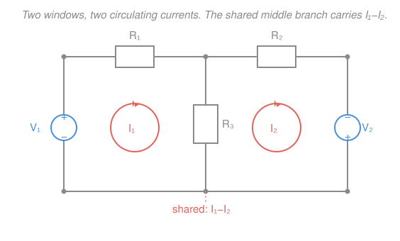
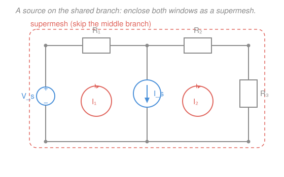

# Circuit Analysis · Lesson 2.2: Mesh analysis

> ⏱ ~15 min · Module 2: Systematic analysis and network theorems · Builds on: [2.1 Nodal analysis](02-01-nodal-analysis.md), [1.3 Kirchhoff's laws: KCL & KVL](01-03-kirchhoffs-laws-kcl-kvl.md) · Unlocks: [2.3 Superposition & source transformation](02-03-superposition-source-transformation.md)

## Why this matters

Nodal analysis ([2.1](02-01-nodal-analysis.md)) attacks a circuit node by node with KCL. Mesh analysis is its mirror image: it attacks the circuit **loop by loop** with KVL, and for a lot of real schematics — a ladder filter, a bridge, the two-source amplifier bias network you'll meet in electronics — it needs *fewer* equations to get the same answer. Knowing both, and picking the shorter one, is what separates "I can eventually solve it" from "I wrote three equations and I'm done." This is the second of the two general-purpose algorithms; after it, every resistive circuit in the course is just arithmetic.

## The idea

Here's the trick that makes mesh analysis worth learning. In a **planar** circuit — one you can draw flat with no wires crossing — the schematic carves the page into little enclosed windows, like panes in a window frame. Mesh analysis assigns **one current to each window**, imagined as circulating all the way around that loop (say, clockwise). Call them $I_1, I_2, \dots$ — these are the **mesh currents**.

Why is that clever? Because a circulating loop current *automatically obeys KCL*. Whatever flows into a node from one side of the loop flows right back out the other side — the loop closes on itself, so charge can't pile up anywhere. You get KCL for free and never write it. All that's left is KVL, one equation per window.

The one subtlety: a branch on the **border between two windows** belongs to *both* loops. The real current in that shared branch is the **difference** of the two mesh currents circulating through it (they run in opposite directions there, so they partly cancel). A branch on the outer edge, touched by only one loop, just carries that single mesh current. Solve for the mesh currents, then any actual branch current is a mesh current or a difference of two.

## The formal version

**Mesh current.** A current $I_k$ imagined to circulate around the $k$-th mesh (window) of a planar circuit. The **actual** current in a branch is the sum of the mesh currents passing through it, each taken with the sign of its circulation direction. *In words: give every window its own loop current; a real branch current is built from the loop currents that ride through it.*

**Mesh (KVL) equation.** Around each mesh, the signed voltage drops sum to zero (KVL, from [1.3](01-03-kirchhoffs-laws-kcl-kvl.md)). Traversing mesh $k$ clockwise, a resistor $R$ on the boundary with mesh $j$ contributes a drop $R\,(I_k - I_j)$ — its own loop current minus the neighbor's; a resistor touched only by mesh $k$ contributes $R\,I_k$; an independent voltage source contributes $+V$ if you traverse it as a drop (enter $+$, leave $-$) and $-V$ if as a rise. *In words: walk each loop once, add up $IR$ drops with shared resistors carrying the current difference, subtract any source that pushes you along, set the total to zero.*

For a circuit of $N$ meshes with only resistors and voltage sources, the $N$ equations collect into a beautifully regular matrix form:

$$\mathbf{R}\,\mathbf{i} = \mathbf{v}, \qquad \begin{pmatrix} R_{11} & R_{12} & \cdots \\ R_{21} & R_{22} & \cdots \\ \vdots & & \ddots \end{pmatrix}\begin{pmatrix} I_1 \\ I_2 \\ \vdots \end{pmatrix} = \begin{pmatrix} V_1 \\ V_2 \\ \vdots \end{pmatrix}.$$

Written **by inspection** (all mesh currents clockwise): the diagonal $R_{kk}$ is the **sum of all resistances** in mesh $k$; the off-diagonal $R_{jk}=R_{kj}$ is $-1\times$ the resistance **shared** between meshes $j$ and $k$ (and $0$ if they share none); and $V_k$ is the **net source voltage driving mesh $k$ clockwise**. *In words: diagonal = total resistance in the loop, off-diagonal = minus the shared resistance, right side = the push.* The matrix is symmetric — a fact worth trusting as an error check, and one you'll recognize again in [`linalg-refresher`](../../linalg-refresher/syllabus.md).

**Two cautions built into the method:**

- **Planar only.** Mesh analysis needs "windows," so the circuit must be drawable without crossings. Truly non-planar circuits (a five-node fully-connected mess, some bridge stacks) have no clean mesh set — use nodal there.
- **Current source on a shared branch → supermesh.** You can't write an ordinary KVL drop across a current source (its voltage is unknown). If a current source sits on the boundary between two meshes, merge those two windows into one **supermesh**: write KVL around the *outer* boundary of the combined loop, skipping the shared source branch, and add the **constraint equation** the source imposes — the difference of the two mesh currents equals the source current. Two windows, still two equations: one supermesh KVL + one constraint.

**Nodal or mesh?** Same answer, so pick the one with fewer unknowns. Nodal gives (number of nodes $-1$) equations; mesh gives (for a planar circuit) the number of windows. Fewer nodes → nodal; fewer windows → mesh. Circuits rich in *voltage* sources often favor mesh; circuits rich in *current* sources often favor nodal.

## Picture

Two windows, mesh currents $I_1$ and $I_2$ both circulating clockwise (coral). The two sources (blue) each push their own loop clockwise; the middle resistor $R_3$ (grey) is the shared branch, and its real current is $I_1 - I_2$.

## Worked examples

**Example 1 — two meshes, voltage sources.** Use the circuit above: $V_1 = 10\,\text{V}$ and $V_2 = 4\,\text{V}$ each oriented to drive their window clockwise, $R_1 = 4\,\Omega$ (top left), $R_2 = 6\,\Omega$ (top right), and the shared $R_3 = 2\,\Omega$ (middle). Find both mesh currents and the current in $R_3$.

*Write KVL around mesh 1, clockwise* (up through $V_1$, across $R_1$, down through the shared $R_3$). Going up through $V_1$ we enter $-$ and leave $+$: a rise, so $-V_1$. The shared branch is traversed downward, in mesh 1's direction, so its drop is $R_3(I_1 - I_2)$:

$$-V_1 + R_1 I_1 + R_3(I_1 - I_2) = 0 \;\Longrightarrow\; (R_1 + R_3)\,I_1 - R_3\,I_2 = V_1.$$

*Mesh 2, clockwise,* the same way (up through the shared $R_3$, across $R_2$, and $V_2$ oriented to aid the clockwise loop):

$$-R_3\,I_1 + (R_2 + R_3)\,I_2 = V_2.$$

Notice these match the by-inspection recipe exactly. Plug in numbers:

$$\begin{pmatrix} R_1+R_3 & -R_3 \\ -R_3 & R_2+R_3 \end{pmatrix}\begin{pmatrix} I_1 \\ I_2 \end{pmatrix} = \begin{pmatrix} V_1 \\ V_2 \end{pmatrix} \;\Longrightarrow\; \begin{pmatrix} 6 & -2 \\ -2 & 8 \end{pmatrix}\begin{pmatrix} I_1 \\ I_2 \end{pmatrix} = \begin{pmatrix} 10 \\ 4 \end{pmatrix}.$$

The determinant is $6\cdot 8 - (-2)(-2) = 48 - 4 = 44$. By Cramer's rule,

$$I_1 = \frac{\begin{vmatrix} 10 & -2 \\ 4 & 8 \end{vmatrix}}{44} = \frac{80 + 8}{44} = 2\,\text{A}, \qquad I_2 = \frac{\begin{vmatrix} 6 & 10 \\ -2 & 4 \end{vmatrix}}{44} = \frac{24 + 20}{44} = 1\,\text{A}.$$

The current in the shared branch $R_3$, downward (mesh 1's direction), is $I_1 - I_2 = 2 - 1 = 1\,\text{A}$.

*Check (power balances).* Resistor power: $I_1^2 R_1 = 4\cdot 4 = 16\,\text{W}$, $I_2^2 R_2 = 1\cdot 6 = 6\,\text{W}$, $(I_1-I_2)^2 R_3 = 1\cdot 2 = 2\,\text{W}$, total $24\,\text{W}$. Source power: $V_1 I_1 = 10\cdot 2 = 20\,\text{W}$ and $V_2 I_2 = 4\cdot 1 = 4\,\text{W}$, total $24\,\text{W}$. Delivered equals absorbed. ✓

**Example 2 — a supermesh (shared current source).** Now the middle branch is a **current source** $I_s = 2\,\text{A}$ pointing *downward*, with a voltage source $V_s = 10\,\text{V}$ (+ up) on the left branch, $R_1 = 2\,\Omega$ (top left), $R_2 = 1\,\Omega$ (top right), and $R_3 = 3\,\Omega$ on the right branch. Find $I_1$ and $I_2$.

We can't write a KVL drop across the current source, so we don't cross it. **Combine both windows into one supermesh** and write KVL around the *outer* boundary — up through $V_s$, across $R_1$ (carries $I_1$), across $R_2$ (carries $I_2$), down through $R_3$ (carries $I_2$), back along the bottom:

$$-V_s + R_1 I_1 + R_2 I_2 + R_3 I_2 = 0 \;\Longrightarrow\; R_1 I_1 + (R_2 + R_3)\,I_2 = V_s.$$

That's one equation in two unknowns. The **constraint** supplies the second: the source sits on the shared branch, where clockwise $I_1$ runs downward and clockwise $I_2$ runs upward, so the net downward current is $I_1 - I_2$, and the source fixes it at $I_s$ (downward):

$$I_1 - I_2 = I_s.$$

Plug in: $2 I_1 + 4 I_2 = 10$ and $I_1 - I_2 = 2$. From the constraint $I_1 = I_2 + 2$; substitute:

$$2(I_2 + 2) + 4 I_2 = 10 \;\Longrightarrow\; 6 I_2 = 6 \;\Longrightarrow\; I_2 = 1\,\text{A}, \quad I_1 = 3\,\text{A}.$$

*Check.* Constraint: $I_1 - I_2 = 3 - 1 = 2 = I_s$ ✓. Supermesh KVL: $2(3) + 4(1) = 10 = V_s$ ✓. (If you also chase node voltages, the current source turns out to *absorb* $8\,\text{W}$ while $V_s$ delivers $V_s I_1 = 30\,\text{W}$ and the resistors dissipate $22\,\text{W}$ — $30 = 22 + 8$, balanced.)

## Watch out

- **A shared branch carries a *difference*, not a sum.** With both loops clockwise, the two mesh currents run *opposite* ways through the shared branch, so its current is $I_j - I_k$. Writing $I_j + I_k$ (or dropping the sign) is the single most common mesh mistake. Keep every mesh current clockwise and the pattern stays automatic.
- **You might try to write KVL straight through a current source.** You can't — its terminal voltage is whatever the rest of the circuit demands, an unknown. That's the whole reason the supermesh exists: route KVL *around* the source and let the constraint $I_j - I_k = I_s$ carry the source's information instead.
- **A current source on the *outer* edge is even easier — no supermesh needed.** If a current source is touched by only one mesh, it *sets that mesh current outright*: $I_k = \pm I_s$ (sign from whether the source arrow agrees with the clockwise loop). That's one unknown eliminated for free.

## One-liner

> Give every window a clockwise loop current, write KVL around each (shared resistors drop $(I_j-I_k)R$), and when a current source straddles two windows, fuse them into a supermesh plus the constraint $I_j - I_k = I_s$.

## Problems

**P1 (🟢)** A two-mesh circuit (both mesh currents clockwise) has $R_1 = 6\,\Omega$ in the top of mesh 1, $R_2 = 2\,\Omega$ in the top of mesh 2, and a shared middle resistor $R_3 = 2\,\Omega$. The sources driving the loops clockwise are $V_1 = 2\,\text{V}$ (mesh 1) and $V_2 = 10\,\text{V}$ (mesh 2). Write the two mesh equations, solve for $I_1$ and $I_2$, and find the current in the shared $R_3$.

**P2 (🟡)** A supermesh circuit: a $V_s = 10\,\text{V}$ source (+ up) on the left branch, $R_1 = 1\,\Omega$ across the top of mesh 1, $R_2 = 2\,\Omega$ across the top of mesh 2, and $R_3 = 1\,\Omega$ on the right branch. The shared middle branch is a current source $I_s = 2\,\text{A}$ pointing downward, so that $I_1 - I_2 = I_s$. Find $I_1$ and $I_2$.

**P3 (🔴)** *(Setup only — connects to linear algebra and the matrix form.)* Three meshes sit in a row, all clockwise. Mesh 1 has its own $R_a = 2\,\Omega$ and a source $V_1 = 10\,\text{V}$; it shares $R_{12} = 4\,\Omega$ with mesh 2. Mesh 2 also has its own $R_b = 1\,\Omega$ and shares $R_{23} = 3\,\Omega$ with mesh 3. Mesh 3 has its own $R_c = 5\,\Omega$ and a source $V_3 = 5\,\text{V}$; meshes 1 and 3 touch nothing directly. Write the $\mathbf{R}\,\mathbf{i} = \mathbf{v}$ system **by inspection** (do not solve), and state what feature of $\mathbf{R}$ acts as a built-in error check.

Solutions

**P1.** By inspection (clockwise), diagonal = total resistance in the loop, off-diagonal = $-R_3$:

$$\begin{pmatrix} R_1+R_3 & -R_3 \\ -R_3 & R_2+R_3 \end{pmatrix}\begin{pmatrix} I_1 \\ I_2 \end{pmatrix} = \begin{pmatrix} V_1 \\ V_2 \end{pmatrix} \;\Longrightarrow\; \begin{pmatrix} 8 & -2 \\ -2 & 4 \end{pmatrix}\begin{pmatrix} I_1 \\ I_2 \end{pmatrix} = \begin{pmatrix} 2 \\ 10 \end{pmatrix}.$$

Determinant $= 8\cdot 4 - (-2)(-2) = 32 - 4 = 28$. Then

$$I_1 = \frac{\begin{vmatrix} 2 & -2 \\ 10 & 4 \end{vmatrix}}{28} = \frac{8 + 20}{28} = 1\,\text{A}, \qquad I_2 = \frac{\begin{vmatrix} 8 & 2 \\ -2 & 10 \end{vmatrix}}{28} = \frac{80 + 4}{28} = 3\,\text{A}.$$

The shared $R_3$ carries $I_1 - I_2 = 1 - 3 = -2\,\text{A}$ in mesh 1's (downward) direction — i.e. $2\,\text{A}$ flowing *upward*. *Check:* power in $= V_1 I_1 + V_2 I_2 = 2 + 30 = 32\,\text{W}$; power out $= I_1^2 R_1 + I_2^2 R_2 + (I_1-I_2)^2 R_3 = 6 + 18 + 8 = 32\,\text{W}$ ✓.

**P2.** Don't cross the current source. Supermesh KVL around the outer loop (up through $V_s$, across $R_1$ carrying $I_1$, across $R_2$ and down $R_3$ both carrying $I_2$):

$$R_1 I_1 + (R_2 + R_3)\,I_2 = V_s \;\Longrightarrow\; 1\cdot I_1 + (2+1)\,I_2 = 10 \;\Longrightarrow\; I_1 + 3 I_2 = 10.$$

Constraint from the source: $I_1 - I_2 = 2$, so $I_1 = I_2 + 2$. Substitute:

$$(I_2 + 2) + 3 I_2 = 10 \;\Longrightarrow\; 4 I_2 = 8 \;\Longrightarrow\; I_2 = 2\,\text{A}, \quad I_1 = 4\,\text{A}.$$

*Check:* constraint $I_1 - I_2 = 4 - 2 = 2 = I_s$ ✓; supermesh $4 + 3(2) = 10 = V_s$ ✓.

**P3.** Diagonal = sum of resistances in each mesh; off-diagonals = minus the shared resistance (zero for the non-adjacent pair 1–3); right-hand side = net clockwise source in each mesh (mesh 2 has none):

$$\begin{pmatrix} R_a + R_{12} & -R_{12} & 0 \\ -R_{12} & R_{12} + R_b + R_{23} & -R_{23} \\ 0 & -R_{23} & R_{23} + R_c \end{pmatrix}\begin{pmatrix} I_1 \\ I_2 \\ I_3 \end{pmatrix} = \begin{pmatrix} V_1 \\ 0 \\ V_3 \end{pmatrix},$$

$$\text{i.e.}\qquad \begin{pmatrix} 6 & -4 & 0 \\ -4 & 8 & -3 \\ 0 & -3 & 8 \end{pmatrix}\begin{pmatrix} I_1 \\ I_2 \\ I_3 \end{pmatrix} = \begin{pmatrix} 10 \\ 0 \\ 5 \end{pmatrix}.$$

The built-in check: $\mathbf{R}$ is **symmetric** ($R_{jk} = R_{kj}$) — a consequence of resistors being reciprocal, and true for any all-resistor mesh network. The zero at positions (1,3) and (3,1) correctly records that meshes 1 and 3 share no branch. If your matrix comes out non-symmetric, you made a sign or bookkeeping error.

## Flashback

**From Lesson 2.1 (Nodal analysis) — fresh variant.** A single non-reference node $A$ connects to four things: a $12\,\text{V}$ source through a $2\,\Omega$ resistor, a $6\,\Omega$ resistor to ground, a $3\,\Omega$ resistor to ground, and a $3\,\text{A}$ current source injecting current *into* $A$. Find the node voltage $V_A$ by KCL.

Solution

Take ground as reference and sum currents *leaving* node $A$ (the injected source current leaves as $-3$):

$$\frac{V_A - 12}{2} + \frac{V_A}{6} + \frac{V_A}{3} - 3 = 0.$$

Multiply through by 6:

$$3(V_A - 12) + V_A + 2 V_A - 18 = 0 \;\Longrightarrow\; 6 V_A - 54 = 0 \;\Longrightarrow\; V_A = 9\,\text{V}.$$

*Check:* the three branch currents leaving are $\tfrac{9-12}{2} = -1.5$, $\tfrac{9}{6} = 1.5$, $\tfrac{9}{3} = 3$, summing to $3\,\text{A}$ — exactly the current the source pushes in. KCL balances. ✓ (This is the KCL-at-a-node counterpart to the KVL-around-a-loop bookkeeping you just did for meshes.)

## Connections

- **Backward:** every mesh equation is just KVL from [1.3](01-03-kirchhoffs-laws-kcl-kvl.md) applied to a window, and the whole method is the loop-based dual of [2.1 nodal analysis](02-01-nodal-analysis.md) — KCL-at-nodes ↔ KVL-around-loops, node voltages ↔ mesh currents, conductance matrix $\mathbf{G}\mathbf{v}=\mathbf{i}$ ↔ resistance matrix $\mathbf{R}\mathbf{i}=\mathbf{v}$.
- **Forward:** [2.3 Superposition & source transformation](02-03-superposition-source-transformation.md) and [2.4 Thévenin & Norton](02-04-thevenin-norton-max-power.md) lean on the mesh/nodal machinery to find equivalents; in Module 4 the very same equations reappear with impedances $Z$ in place of resistances $R$ for AC circuits.
- **Sideways (linear algebra):** $\mathbf{R}\mathbf{i}=\mathbf{v}$ is a symmetric, positive-definite linear system — solved with the determinant/Cramer or elimination tools of [`linalg-refresher`](../../linalg-refresher/syllabus.md); the symmetry of $\mathbf{R}$ is the circuit fingerprint of resistor reciprocity, and it's what makes these systems so well-behaved to solve.
