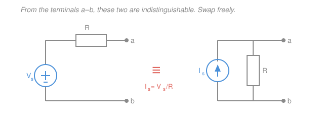
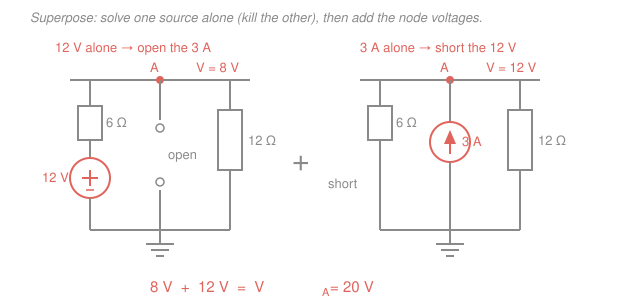

# Circuit Analysis · Lesson 2.3: Superposition and source transformation

> ⏱ ~15 min · Module 2: Systematic analysis and network theorems · Builds on: [2.1 Nodal analysis](02-01-nodal-analysis.md), [1.2 Ohm's law & equivalent resistance](01-02-ohms-law-equivalent-resistance.md) · Unlocks: [2.4 Thévenin, Norton & max power](02-04-thevenin-norton-max-power.md)

## Why this matters

Nodal and mesh analysis always work, but "always works" can mean "grind through a $4\times4$ system by hand." When a circuit has several independent sources, two shortcuts often beat the machinery: **superposition** lets you answer one source at a time and add the answers, and **source transformation** lets you swap a voltage source for an equivalent current source (or back) so a tangle collapses into a single loop. Both rest on one fact — resistive circuits are *linear* — and that same fact is what makes the Thévenin equivalent of the next lesson possible.

## The idea

A resistive circuit is a linear machine: double every source and every voltage and current doubles; add two sources and the response is the *sum* of what each would produce alone. So instead of solving a circuit with a $12\,\text{V}$ battery **and** a $3\,\text{A}$ source both switched on, solve it twice — once with only the battery, once with only the current source — and add the two answers. That's **superposition**. Turning a source "off" is literal: a dead voltage source is a wire (a **short**, $0\,\text{V}$ across it), and a dead current source is a gap (an **open**, $0\,\text{A}$ through it).

The second trick is a disguise. A real battery is a voltage source $V_s$ with some series resistance $R$; from *outside*, at its two terminals, it is indistinguishable from a current source $I_s = V_s/R$ with the *same* $R$ sitting in parallel. Nothing you could measure at the terminals tells the two apart. So you're free to redraw whichever form makes the circuit simpler — usually converting everything to current sources in parallel so you can just add currents and combine resistors.

## The formal version

**Linearity.** In a circuit of resistors and independent sources, every branch current and node voltage is a linear combination of the source values: scale all sources by $k$ and every response scales by $k$; superpose sources and responses superpose.

*In words: the circuit is a straight-line amplifier from "sources in" to "voltages and currents out" — no bends, no products.*

**Superposition.** The response (a chosen current or voltage) equals the sum of the responses to each independent source acting alone, with all *other* independent sources **deactivated**:

$$x = x_1 + x_2 + \cdots + x_n,\qquad \text{voltage source} \to \text{short},\quad \text{current source} \to \text{open}.$$

*In words: switch on one source at a time, solve, and add — killing a voltage source means replacing it by a wire, killing a current source means cutting its branch.*

**Superposition does NOT apply to power.** Power is $p = i^2R = v^2/R$ — quadratic, not linear. The current in a resistor superposes; its *square* does not, because $(i_1+i_2)^2 \neq i_1^2 + i_2^2$. Always superpose to get the current or voltage first, *then* square.

**Source transformation.** A voltage source $V_s$ in series with $R$ and a current source $I_s$ in parallel with $R$ are equivalent at their terminals when

$$I_s = \frac{V_s}{R}, \qquad V_s = I_s R \qquad (\text{same } R \text{ in both}).$$

*In words: a battery-plus-series-resistor and a current-source-plus-parallel-resistor look identical from outside — swap freely to simplify.* (This is exactly the Thévenin $\leftrightarrow$ Norton pair of Lesson 2.4. The equivalence holds only *at the terminals* — the power dissipated inside the two versions differs, so never use it to compute internal power.)

## Picture

## Worked examples

**Example 1 (superposition — the two-source node).** A $12\,\text{V}$ source connects through a $6\,\Omega$ resistor to node $A$; a $3\,\text{A}$ current source injects current into $A$; and a $12\,\Omega$ resistor runs from $A$ to ground. Find the node voltage $V_A$ by superposition.

*Source 1 — the $12\,\text{V}$ alone.* Deactivate the current source: **open** its branch (remove it). What's left is a series path: $12\,\text{V}$ through $6\,\Omega$ into node $A$, with $12\,\Omega$ from $A$ to ground. That's a voltage divider,

$$V_A^{(1)} = 12\cdot\frac{12}{6+12} = 12\cdot\frac{12}{18} = 8\,\text{V}.$$

*Source 2 — the $3\,\text{A}$ alone.* Deactivate the voltage source: **short** it. Now the $6\,\Omega$ runs from $A$ straight to ground, in parallel with the $12\,\Omega$. The $3\,\text{A}$ drives that parallel pair:

$$6\,\Omega \,\|\, 12\,\Omega = \frac{6\cdot 12}{6+12} = 4\,\Omega, \qquad V_A^{(2)} = 3\cdot 4 = 12\,\text{V}.$$

*Add:* $\;V_A = V_A^{(1)} + V_A^{(2)} = 8 + 12 = 20\,\text{V}.$

Cross-check with a single nodal equation (Lesson 2.1): $\dfrac{12-V_A}{6} + 3 = \dfrac{V_A}{12}$. Multiply by $12$: $2(12-V_A)+36 = V_A \Rightarrow 60 = 3V_A \Rightarrow V_A = 20\,\text{V}$. ✓

**Example 2 (source transformation — collapse to one loop).** Node $a$ has four things tied to it: a $12\,\text{V}$ source in series with $4\,\Omega$ (from ground up to $a$), a $2\,\text{A}$ current source injecting into $a$, a $12\,\Omega$ resistor from $a$ to ground, and a $2\,\Omega$ **load** from $a$ to ground. Find the current in the load.

*Step 1 — transform the voltage source.* The $12\,\text{V}$ in series with $4\,\Omega$ becomes a current source $I_s = 12/4 = 3\,\text{A}$ in parallel with $4\,\Omega$, both feeding node $a$.

*Step 2 — merge the current sources.* Two current sources now push into $a$; parallel current sources just add: $3\,\text{A} + 2\,\text{A} = 5\,\text{A}$.

*Step 3 — merge the source-side resistors.* Combine the resistors that aren't the load: the transformed $4\,\Omega$ in parallel with the standing $12\,\Omega$ gives $4\,\|\,12 = \dfrac{4\cdot 12}{16} = 3\,\Omega$. The network feeding the load is now $5\,\text{A}$ in parallel with $3\,\Omega$.

*Step 4 — transform back and close the loop.* Convert $5\,\text{A}\,\|\,3\,\Omega$ into a voltage source $V = 5\cdot 3 = 15\,\text{V}$ in series with $3\,\Omega$. With the $2\,\Omega$ load in series, one loop remains:

$$i_{\text{load}} = \frac{15}{3+2} = 3\,\text{A}.$$

Cross-check by nodal (Lesson 2.1): $\dfrac{12-V_a}{4} + 2 = \dfrac{V_a}{12} + \dfrac{V_a}{2}$. Multiply by $12$: $3(12-V_a) + 24 = V_a + 6V_a \Rightarrow 60 = 10V_a \Rightarrow V_a = 6\,\text{V}$, so $i_{\text{load}} = V_a/2 = 3\,\text{A}$. ✓

The moral: transform every voltage source to a current source, add the current sources, combine the parallel resistors into one, transform back to a single voltage source, and read the answer off a single series loop — no simultaneous equations.

## Watch out

- **You might think** deactivating a source means setting it to zero *and leaving its resistor's branch as-is is optional* — **but** the rule is exact: a dead voltage source becomes a **short** (wire), a dead current source becomes an **open** (gap). Any *series* resistor of the voltage source and any *parallel* resistor of the current source stays in the circuit; only the source symbol changes.
- **You might think** you can superpose power — find each source's power in a resistor and add — **but** power is quadratic. In Example 1 the $12\,\Omega$ sees $20\,\text{V}$, so $P = 20^2/12 = 33.3\,\text{W}$, whereas naively adding $8^2/12 + 12^2/12 = 5.3 + 12 = 17.3\,\text{W}$ is flat wrong. Superpose the *voltage*, then square.
- **You might think** a source transformation changes the whole circuit — **but** it only preserves behavior *at the two terminals*. The internal power of the $V_s+R$ form and the $I_s\,\|\,R$ form differ. Use it to find external currents and voltages, never to bookkeep the source's own dissipation.

## One-liner

> Linearity buys you two moves: solve one source at a time and add (superposition), and wear whichever source costume simplifies the wiring ($V_s + R \leftrightarrow I_s = V_s/R \,\|\, R$).

## Problems

**P1 (🟢)** A $6\,\text{V}$ source connects through a $3\,\Omega$ resistor to node $A$; a $2\,\text{A}$ current source injects into $A$; and a $6\,\Omega$ resistor runs from $A$ to ground. Use **superposition** to find $V_A$.

**P2 (🟡)** Node $a$ has: a $12\,\text{V}$ source in series with $4\,\Omega$ (ground to $a$), a $2\,\text{A}$ current source into $a$, a $4\,\Omega$ resistor from $a$ to ground, and a $3\,\Omega$ resistor from $a$ to ground. Use **source transformation** to find the current in the $3\,\Omega$ resistor.

**P3 (🔴, optional)** Using source transformation only, reduce this network as seen from terminals $a$–$b$ to a single voltage source in series with one resistor (its Thévenin equivalent, previewing [2.4](02-04-thevenin-norton-max-power.md)): a $9\,\text{V}$ source in series with $3\,\Omega$ connects to node $a$, and a $6\,\Omega$ resistor runs from $a$ to $b$ (ground). What single $V_\text{th}$ and $R_\text{th}$ would a load between $a$ and $b$ see?

Solutions

**P1.** *$6\,\text{V}$ alone* (open the $2\,\text{A}$): voltage divider, $V_A^{(1)} = 6\cdot\dfrac{6}{3+6} = 6\cdot\dfrac{6}{9} = 4\,\text{V}$. *$2\,\text{A}$ alone* (short the $6\,\text{V}$): the $3\,\Omega$ and $6\,\Omega$ are now both from $A$ to ground, $3\,\|\,6 = 2\,\Omega$, so $V_A^{(2)} = 2\cdot 2 = 4\,\text{V}$. **Sum:** $V_A = 4 + 4 = 8\,\text{V}$. Check by nodal: $\dfrac{6-V_A}{3} + 2 = \dfrac{V_A}{6}$; times $6$: $2(6-V_A)+12 = V_A \Rightarrow 24 = 3V_A \Rightarrow V_A = 8\,\text{V}$. ✓

**P2.** Transform the $12\,\text{V}$–$4\,\Omega$ branch into $I_s = 12/4 = 3\,\text{A}$ in parallel with $4\,\Omega$. Now two current sources feed $a$: $3 + 2 = 5\,\text{A}$. The two source-side resistors — the transformed $4\,\Omega$ and the standing $4\,\Omega$ — are in parallel: $4\,\|\,4 = 2\,\Omega$. Transform back: $5\,\text{A}\,\|\,2\,\Omega \Rightarrow V = 5\cdot 2 = 10\,\text{V}$ in series with $2\,\Omega$. With the $3\,\Omega$ load in series, $i = \dfrac{10}{2+3} = 2\,\text{A}$. Check by nodal: $\dfrac{12-V_a}{4} + 2 = \dfrac{V_a}{4} + \dfrac{V_a}{3}$; times $12$: $3(12-V_a)+24 = 3V_a + 4V_a \Rightarrow 60 = 10V_a \Rightarrow V_a = 6\,\text{V}$, so $i = 6/3 = 2\,\text{A}$. ✓

**P3.** Transform the $9\,\text{V}$–$3\,\Omega$ source into $I_s = 9/3 = 3\,\text{A}$ in parallel with $3\,\Omega$. This $3\,\Omega$ is now in parallel with the $6\,\Omega$ across $a$–$b$: $3\,\|\,6 = 2\,\Omega$. So the network is $3\,\text{A}\,\|\,2\,\Omega$. Transform back to a voltage source: $V_\text{th} = 3\cdot 2 = 6\,\text{V}$ in series with $R_\text{th} = 2\,\Omega$. (Sanity check: open-circuit voltage at $a$ is the divider $9\cdot\frac{6}{3+6} = 6\,\text{V}$ ✓, and with sources dead the resistance seen is $3\,\|\,6 = 2\,\Omega$ ✓.) A load $R_L = R_\text{th} = 2\,\Omega$ would draw maximum power — the punchline of Lesson 2.4.

## Flashback

**From Lesson 2.1 (Nodal analysis):** A $24\,\text{V}$ source connects through a $4\,\Omega$ resistor to node $A$; from $A$, a $6\,\Omega$ resistor and a $12\,\Omega$ resistor each go to ground. Find $V_A$ and the current delivered by the source.

Solution

KCL at $A$: $\dfrac{24 - V_A}{4} = \dfrac{V_A}{6} + \dfrac{V_A}{12}$. Multiply by $12$: $3(24 - V_A) = 2V_A + V_A \Rightarrow 72 - 3V_A = 3V_A \Rightarrow 72 = 6V_A \Rightarrow V_A = 12\,\text{V}$. Source current $= \dfrac{24 - 12}{4} = 3\,\text{A}$. (Check: the two ground resistors carry $12/6 = 2\,\text{A}$ and $12/12 = 1\,\text{A}$, summing to $3\,\text{A}$ ✓.)

## Connections

- **Backward:** superposition *is* the linearity that dividers ([1.4](01-04-voltage-current-dividers.md)) and Ohm's law ([1.2](01-02-ohms-law-equivalent-resistance.md)) already assumed; source transformation is just series/parallel reduction with a source dragged along.
- **Forward:** source transformation is literally the Thévenin $\leftrightarrow$ Norton conversion of [2.4](02-04-thevenin-norton-max-power.md); superposition is the standard tool for AC circuits with sources at *different frequencies* ([4.2](04-02-impedance-phasor-analysis.md)), where you must solve each frequency separately and add.
- **Sideways:** "the response is a linear function of the inputs, so you can decompose the input and superpose the outputs" is the same principle behind superposition of forces in the [mechanics-refresher](../../mechanics-refresher/syllabus.md) and the linearity of the solution map in [linalg-refresher](../../linalg-refresher/syllabus.md) — a circuit's sources-to-responses map is exactly a matrix.
