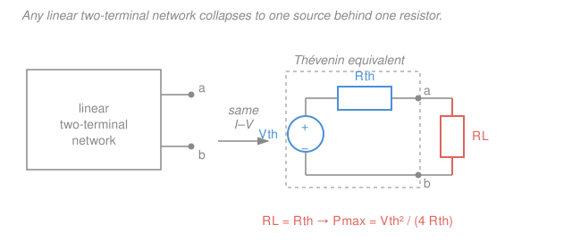

# Circuit Analysis · Lesson 2.4: Thévenin, Norton, and maximum power transfer

> ⏱ ~15 min · Module 2: Systematic analysis and network theorems · Builds on: [2.3 Superposition and source transformation](02-03-superposition-source-transformation.md), [2.1 Nodal analysis](02-01-nodal-analysis.md) · Unlocks: Module 3 (transients — replace everything-but-the-storage-element by its equivalent) and later AC Thévenin [4.2](04-02-impedance-phasor-analysis.md)

## Why this matters

You have a wall wart, a sensor, an audio amp, a solar panel — some tangle of sources and resistors — and all you actually care about is *what it does at two terminals*. Thévenin's theorem says you never need the tangle: **any** linear two-terminal network, no matter how many sources and resistors inside, behaves at its terminals *exactly* like one voltage source in series with one resistor. That single fact is why a datasheet can summarize a whole power supply as "5 V, 0.2 Ω output impedance," why you can analyze a complicated circuit by hiding most of it inside a box, and why matching a speaker to an amplifier is a one-line calculation. It's the ultimate divide-and-conquer.

## The idea

Stand at two terminals and poke the network. Leave the terminals open (draw no current) and you measure some voltage — call it the **open-circuit voltage** $V_\text{oc}$. Short the terminals together (force the voltage to zero) and some current flows — the **short-circuit current** $I_\text{sc}$. In between, because the network is *linear*, the terminal voltage falls off in a perfectly straight line as you draw more current. A straight line through two points is completely pinned down: one number for where it starts ($V_\text{oc}$) and one for its slope. That slope *is* a resistance.

So from the outside the network is indistinguishable from a battery $V_\text{oc}$ with a resistor in front of it — the resistor being what makes the terminal voltage sag as you pull current. That's the **Thévenin equivalent**. Flip the same line around and describe it instead by the current it would push into a short ($I_\text{sc}$) *diverted* through a parallel resistor — that's the **Norton equivalent**. Two descriptions of one straight line; converting between them is just the source transformation you met in [2.3](02-03-superposition-source-transformation.md), applied to the whole box at once.

## The formal version

**Thévenin's theorem.** Any linear two-terminal network is equivalent, at its terminals, to a voltage source $V_\text{th}$ in series with a resistance $R_\text{th}$, where

$$V_\text{th} = V_\text{oc} \quad(\text{open-circuit terminal voltage}), \qquad R_\text{th} = \frac{V_\text{oc}}{I_\text{sc}}.$$

*In words: the equivalent battery equals whatever the open terminals read, and the equivalent resistance is how fast that reading collapses when you load it down.*

**Norton's theorem.** The same network is equivalent to a current source $I_N$ in parallel with the *same* resistance $R_\text{th}$, where

$$I_N = I_\text{sc} = \frac{V_\text{th}}{R_\text{th}}.$$

*In words: Norton is Thévenin turned inside out — the short-circuit current in parallel with the identical resistor.* The two are a source transformation of each other: $V_\text{th} = I_N R_\text{th}$.

**Three ways to get $R_\text{th}$.** Pick the one that fits the network:

1. **Deactivate and reduce.** If all sources are *independent*, turn them off — short every voltage source, open every current source (from [2.3](02-03-superposition-source-transformation.md)) — and collapse the leftover resistor network to one equivalent resistance seen from the terminals. Fastest when it applies.
2. **$V_\text{oc}/I_\text{sc}$.** Compute the open-circuit voltage and the short-circuit current (by nodal, mesh, or superposition) and divide. Always works.
3. **Test source.** If the network has *dependent* sources you cannot deactivate them (they follow their controlling variable). Kill only the independent sources, apply a test source — say $1\,\text{A}$ — at the terminals, solve for the resulting terminal voltage $v$, and take $R_\text{th} = v / 1\,\text{A}$. (If the network has *only* dependent sources, then $V_\text{th}=0$ and this is the *only* way.)

**Maximum power transfer.** Attach a load $R_L$ across a Thévenin source. The current is $I = V_\text{th}/(R_\text{th}+R_L)$, so the load power is

$$P_L = I^2 R_L = \frac{V_\text{th}^2\, R_L}{(R_\text{th}+R_L)^2}.$$

Set $dP_L/dR_L = 0$: the numerator's growth and the denominator's growth cancel exactly at

$$\boxed{\,R_L = R_\text{th}\,}, \qquad P_\text{max} = \frac{V_\text{th}^2}{4R_\text{th}}.$$

*In words: a load draws the most power when it matches the source's own internal resistance* — too small and it can't develop voltage, too large and it chokes off the current. At the match the load and $R_\text{th}$ split the voltage evenly, so exactly half the delivered power is burned inside $R_\text{th}$: max power transfer runs at **50% efficiency** (that's a separate goal from efficiency — see Watch out).

## Picture

## Worked examples

**Example 1 (find the Thévenin equivalent, then the best load).** At terminals $a$–$b$: a $12\,\text{V}$ source feeds node $a$ through $R_1 = 6\,\Omega$; a $3\,\text{A}$ current source pushes current into $a$; and $R_2 = 12\,\Omega$ runs from $a$ to ground ($b$).

*Step 1 — $V_\text{th}$ (open circuit).* With the terminals open, write KCL at $a$ (currents leaving $=0$), letting $V$ be the node voltage:

$$\frac{V - 12}{6} + \frac{V}{12} - 3 = 0 \;\Longrightarrow\; 2(V-12) + V - 36 = 0 \;\Longrightarrow\; 3V = 60 \;\Longrightarrow\; V_\text{th} = 20\,\text{V}.$$

*Step 2 — $R_\text{th}$ (deactivate and reduce).* Short the $12\,\text{V}$ source and open the $3\,\text{A}$ source. Now $R_1$ (from $a$ to ground through the short) sits in parallel with $R_2$:

$$R_\text{th} = 6 \,\|\, 12 = \frac{6\cdot 12}{6+12} = 4\,\Omega.$$

*Cross-check with $V_\text{oc}/I_\text{sc}$.* Short $a$ to $b$ so $V=0$: the $12\,\text{V}$ source drives $12/6 = 2\,\text{A}$ into the short, the current source adds $3\,\text{A}$, and $R_2$ carries nothing (no voltage across it), so $I_\text{sc} = 5\,\text{A}$. Then $R_\text{th} = V_\text{oc}/I_\text{sc} = 20/5 = 4\,\Omega$ ✓ — the two methods agree.

*Step 3 — maximum power.* The best load matches $R_\text{th}$:

$$R_L = R_\text{th} = 4\,\Omega, \qquad P_\text{max} = \frac{V_\text{th}^2}{4R_\text{th}} = \frac{20^2}{4\cdot 4} = \frac{400}{16} = 25\,\text{W}.$$

The whole tangle, as far as any load is concerned, is a $20\,\text{V}$ battery behind $4\,\Omega$.

**Example 2 (Norton by source transformation, and the round trip back).** Find the Norton equivalent at $a$–$b$: a $24\,\text{V}$ source in series with $R_1 = 4\,\Omega$ reaching node $a$, and $R_2 = 12\,\Omega$ from $a$ to ground.

Rather than compute $V_\text{oc}$ and $I_\text{sc}$ separately, *transform the box directly*. The $24\,\text{V}$-in-series-with-$4\,\Omega$ branch is a Thévenin source; convert it to its Norton form (from [2.3](02-03-superposition-source-transformation.md)):

$$I = \frac{24}{4} = 6\,\text{A} \ \text{in parallel with}\ 4\,\Omega.$$

Now that $4\,\Omega$ sits in parallel with $R_2 = 12\,\Omega$, and the $6\,\text{A}$ source sees the combination:

$$R_\text{th} = 4 \,\|\, 12 = 3\,\Omega, \qquad I_N = 6\,\text{A}.$$

That *is* the Norton equivalent: $6\,\text{A} \parallel 3\,\Omega$.

*Round trip — convert to Thévenin and confirm.* A source transformation of the Norton form gives

$$V_\text{th} = I_N R_\text{th} = 6 \cdot 3 = 18\,\text{V} \ \text{in series with}\ 3\,\Omega.$$

Independent check by the divider: open-circuit, $V_\text{oc} = 24 \cdot \dfrac{12}{4+12} = 18\,\text{V}$, and deactivating gives $R_\text{th} = 4\|12 = 3\,\Omega$ ✓. Norton and Thévenin are the same line described two ways.

## Watch out

- **You might deactivate the sources to find $V_\text{th}$. Don't.** Sources are *on* for $V_\text{oc}$ and $I_\text{sc}$ — those numbers *are* the sources' effect. You deactivate sources *only* for the "reduce the resistors" route to $R_\text{th}$, never for the voltages and currents themselves.
- **You might think max power transfer means maximum efficiency. It's the opposite trade.** Matching $R_L=R_\text{th}$ dumps as much power as possible *into the load*, but burns an equal amount inside $R_\text{th}$ — only 50% efficient. Great for a signal delivered to a receiver (you want every microwatt), terrible for a power grid (where you want $R_L \gg R_\text{th}$ so almost none is wasted in the lines). Different goals, different design.
- **You might try to "turn off" a dependent source. You can't.** A dependent source is slaved to a controlling voltage or current elsewhere in the circuit; it only goes to zero if that variable does. With dependent sources present, use $V_\text{oc}/I_\text{sc}$ or a test source — never the deactivate-and-reduce shortcut.

## One-liner

> Any linear two-terminal network is just one source hiding behind one resistor — and it hands a load the most power exactly when the load matches that resistor, $R_L=R_\text{th}$.

## Problems

**P1 (🟢)** A network's Thévenin equivalent is $V_\text{th} = 12\,\text{V}$, $R_\text{th} = 3\,\Omega$. (a) Write its Norton equivalent. (b) What load $R_L$ draws maximum power, and how much power is that?

**P2 (🟡)** At terminals $a$–$b$: an $18\,\text{V}$ source feeds node $c$ through $R_1 = 6\,\Omega$; $R_2 = 3\,\Omega$ runs from $c$ to ground; and a series resistor $R_3 = 1\,\Omega$ connects node $c$ out to terminal $a$ (terminal $b$ is ground). Find $V_\text{th}$ and $R_\text{th}$ at $a$–$b$, then the load for maximum power and $P_\text{max}$.

**P3 (🔴)** A network at $a$–$b$ contains only a $6\,\Omega$ resistor from $a$ to $b$ carrying a (downward) current $i_x$, in parallel with a dependent current source $3i_x$ that also points from $a$ to $b$. There are no independent sources. Find $R_\text{th}$ using a test source. (This is exactly the case where deactivate-and-reduce fails.)

Solutions

**P1** (a) Norton current $I_N = V_\text{th}/R_\text{th} = 12/3 = 4\,\text{A}$, in parallel with the same $R_\text{th} = 3\,\Omega$. So: **$4\,\text{A} \parallel 3\,\Omega$.**

(b) Maximum power at $R_L = R_\text{th} = 3\,\Omega$, giving

$$P_\text{max} = \frac{V_\text{th}^2}{4R_\text{th}} = \frac{12^2}{4\cdot 3} = \frac{144}{12} = 12\,\text{W}.$$

*Check.* At the match the load current is $I = 12/(3+3) = 2\,\text{A}$, so $P_L = I^2 R_L = 4\cdot 3 = 12\,\text{W}$ ✓, and an equal $12\,\text{W}$ is burned in $R_\text{th}$ (50% efficiency).

**P2** *Open-circuit voltage.* With $a$ open, no current flows through $R_3$ (it goes nowhere), so there is *no voltage drop across $R_3$* and $V_\text{th}$ equals the voltage at node $c$. Node $c$ is a simple divider of the $18\,\text{V}$ source across $R_1$ and $R_2$:

$$V_c = 18 \cdot \frac{R_2}{R_1+R_2} = 18 \cdot \frac{3}{6+3} = 18\cdot\frac13 = 6\,\text{V} = V_\text{th}.$$

*Thévenin resistance.* Deactivate the $18\,\text{V}$ source (short it). Looking in from $a$: first $R_3 = 1\,\Omega$ in series, then $R_1$ and $R_2$ appear in parallel to ground:

$$R_\text{th} = R_3 + (R_1 \,\|\, R_2) = 1 + (6\,\|\,3) = 1 + \frac{6\cdot 3}{9} = 1 + 2 = 3\,\Omega.$$

*Maximum power.* $R_L = R_\text{th} = 3\,\Omega$, and

$$P_\text{max} = \frac{V_\text{th}^2}{4R_\text{th}} = \frac{6^2}{4\cdot 3} = \frac{36}{12} = 3\,\text{W}.$$

*Check.* The series $R_3$ is invisible to $V_\text{th}$ (no open-circuit current) but very much visible to $R_\text{th}$ — a classic trap. $V_\text{oc}/I_\text{sc}$ agrees: shorting $a$–$b$, node $c$ sees $R_2\|R_3 = 3\|1 = 0.75\,\Omega$, so $V_c = 18\cdot 0.75/(6+0.75) = 2\,\text{V}$ and $I_\text{sc} = V_c/R_3 = 2/1 = 2\,\text{A}$; then $R_\text{th} = 6/2 = 3\,\Omega$ ✓.

**P3** No independent sources means $V_\text{th}=0$, so we need $R_\text{th}$ from a test source. Apply a test current $I_T = 1\,\text{A}$ into terminal $a$ and let $V$ be the resulting terminal voltage. The $6\,\Omega$ resistor carries $i_x = V/6$ downward; the dependent source carries $3i_x$ downward alongside it. KCL at $a$ (all injected test current leaves through the two downward branches):

$$I_T = i_x + 3i_x = 4i_x = 4\cdot\frac{V}{6} = \frac{2V}{3} \;\Longrightarrow\; V = \frac{3}{2}I_T.$$

$$R_\text{th} = \frac{V}{I_T} = \frac{3}{2} = 1.5\,\Omega.$$

*Check.* With $I_T = 1\,\text{A}$: $V = 1.5\,\text{V}$, so $i_x = 0.25\,\text{A}$ and the dependent source carries $0.75\,\text{A}$, summing to the injected $1\,\text{A}$ ✓. Notice $R_\text{th} = 1.5\,\Omega$ is *below* the bare $6\,\Omega$ resistor: the dependent source shoulders three-quarters of the test current, so the terminals feel "stiffer" than the resistor alone. You could never have gotten this by shorting/opening — the dependent source refuses to be switched off.

## Flashback

**From Lesson 2.3 (superposition) — fresh numbers.** At node $A$: a $9\,\text{V}$ source connects through an $8\,\Omega$ resistor, a $2\,\text{A}$ current source injects current into $A$, and a $4\,\Omega$ resistor runs from $A$ to ground. Use **superposition** to find $V_A$.

Solution

*$9\,\text{V}$ source alone* (open the $2\,\text{A}$ source): $A$ is a divider of $9\,\text{V}$ across $8\,\Omega$ and $4\,\Omega$,

$$V_A' = 9\cdot\frac{4}{8+4} = 9\cdot\frac13 = 3\,\text{V}.$$

*$2\,\text{A}$ source alone* (short the $9\,\text{V}$ source): the current sees $8\,\Omega \| 4\,\Omega = \frac{8\cdot 4}{12} = \frac{8}{3}\,\Omega$,

$$V_A'' = 2\cdot\frac{8}{3} = \frac{16}{3}\,\text{V} \approx 5.33\,\text{V}.$$

*Add:* $V_A = 3 + \dfrac{16}{3} = \dfrac{9+16}{3} = \dfrac{25}{3} \approx 8.33\,\text{V}.$

*Check (nodal).* $\frac{V_A-9}{8} + \frac{V_A}{4} - 2 = 0 \Rightarrow (V_A-9) + 2V_A - 16 = 0 \Rightarrow 3V_A = 25 \Rightarrow V_A = 25/3$ ✓. (This is exactly a $V_\text{oc}$ calculation — superposition and nodal are just two roads to the Thévenin voltage.)

## Connections

- **Backward:** the Thévenin↔Norton conversion *is* the source transformation of [2.3](02-03-superposition-source-transformation.md) applied to the whole network, and $V_\text{th}=V_\text{oc}$, $I_N=I_\text{sc}$ are found with the nodal method of [2.1](02-01-nodal-analysis.md), mesh [2.2](02-02-mesh-analysis.md), or superposition — Example 1's KCL and the Flashback are both just $V_\text{oc}$ in disguise.
- **Forward:** in [Module 3](03-01-capacitors-and-inductors.md) you'll replace *everything except* the capacitor or inductor by its Thévenin equivalent, so a first-order transient's time constant is simply $\tau = R_\text{th}C$ or $L/R_\text{th}$ — the whole circuit reduces to one resistor and one storage element. In [4.2](04-02-impedance-phasor-analysis.md) $R_\text{th}$ becomes a complex $Z_\text{th}$, and maximum power then needs a *conjugate* match, $Z_L = Z_\text{th}^*$.
- **Sideways:** "black box → one source plus one resistance" is the *output impedance* model behind every amplifier and op-amp datasheet in electronics (the sequel course) and semiconductor devices; the matching condition $R_L=R_\text{th}$ is impedance matching, the same idea that sizes antennas and transmission-line terminations in RF and communications, and matches speakers to amplifiers in audio. Under the hood it's linear algebra: because the terminal $I$–$V$ relation is affine in the sources, two evaluations ($V_\text{oc}$, $I_\text{sc}$) fix the entire line — the linearity you leaned on in [`linalg-refresher`](../../linalg-refresher/syllabus.md).
