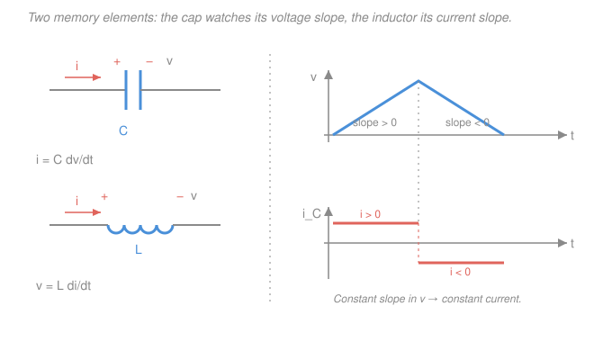

# Circuit Analysis · Lesson 3.1: Capacitors and inductors

> ⏱ ~15 min · Module 3: Energy storage and transients · Builds on: [1.1 Charge, current, voltage, power](01-01-charge-current-voltage-power.md), calculus from [calc-refresher](../../calc-refresher/syllabus.md) · Unlocks: [3.2 First-order RC & RL transients](03-02-first-order-rc-rl-transients.md)

## Why this matters

Every resistor you've met so far is memoryless: tell it the voltage *now* and Ohm's law tells you the current *now*, no history required. That's why nothing in Modules 1–2 ever *changed over time* — flip a switch and the answer jumps instantly. Real circuits don't do that. A camera flash charges for a second and dumps in a millisecond; a phone's power supply smooths a jagged rectified wave into clean DC; every filter that separates bass from treble does it with these two parts. Capacitors and inductors are the elements with **memory** — they store energy and respond to the *rate of change* of a signal, not its instantaneous value. They're what make a circuit able to have a past, and therefore a transient.

## The idea

A **capacitor** is two conducting plates with a gap. Push charge onto one plate and it builds up — you can't cram charge on instantly, so its voltage rises *gradually*. The more charge $q$ you've delivered, the higher the voltage: $q = Cv$. Since current is the *flow* of charge ($i = dq/dt$ from Lesson 1.1), the current into a capacitor is exactly how fast you're changing its voltage. Sitting at a steady voltage? No charge moving, no current — it looks like a broken wire (an **open**). The capacitor's slogan: **it resists changes in voltage.**

An **inductor** is a coil of wire. Run current through it and it wraps itself in a magnetic field; that stored field *fights any change* to the current (Lenz's law — the field induces a voltage opposing the change). The faster you try to change the current, the bigger the voltage it throws up in protest. Hold the current steady and the field is constant, so it protests nothing — it looks like a plain wire (a **short**). The inductor is the mirror image of the capacitor. Its slogan: **it resists changes in current.**

That mirror symmetry is the whole lesson: swap "voltage" for "current" and "charge" for "flux" and a capacitor *becomes* an inductor. Learn one, transpose it, get the other free.

## The formal version

**Capacitor.** With current and voltage in the passive sign convention (current enters the $+$ terminal),

$$q = Cv, \qquad i = C\frac{dv}{dt}, \qquad w = \tfrac12 C v^2.$$

Here $C$ is the **capacitance** in farads (F), $q$ the stored charge (C), and $w$ the stored energy (J). *In words:* charge is proportional to voltage; the current is the capacitance times the **slope** of the voltage; and the energy is squirreled away in the electric field between the plates.

**Inductor.** By the same convention,

$$\lambda = Li, \qquad v = L\frac{di}{dt}, \qquad w = \tfrac12 L i^2.$$

$L$ is the **inductance** in henries (H), $\lambda = Li$ the magnetic flux linkage (Wb). *In words:* the voltage across an inductor is the inductance times the **slope** of the current, and the energy lives in the magnetic field of the coil.

**What can't jump.** Look at the two laws as demands for infinite quantities:

- $v_C$ **cannot jump.** A jump in voltage means $dv/dt = \infty$, so $i = C\,dv/dt = \infty$ — no real source delivers infinite current. So **a capacitor's voltage is continuous:** $v_C(0^+) = v_C(0^-)$.
- $i_L$ **cannot jump.** A jump in current means $di/dt = \infty$, so $v = L\,di/dt = \infty$. So **an inductor's current is continuous:** $i_L(0^+) = i_L(0^-)$.

*In words:* whatever the switch does at $t=0$, the capacitor holds its voltage and the inductor holds its current across the instant. These two facts are the *initial conditions* for every transient in Lesson 3.2 — memorize them.

**DC steady state.** When everything has settled and nothing is changing, all slopes are zero. Then $i_C = C\cdot 0 = 0$ (a capacitor passes no current — an **open**) and $v_L = L\cdot 0 = 0$ (an inductor drops no voltage — a **short**). *In words:* long after a switch flips, redraw the circuit with **every capacitor erased (open) and every inductor replaced by a wire (short)**, then solve it as a pure resistor problem.

**Series and parallel.** Because a capacitor's law involves $1/C$ where a resistor's involves $R$, capacitors combine like resistors *turned inside out*, while inductors combine *exactly like resistors*:

$$\text{Capacitors: } \quad C_\text{par}=\sum C_k, \qquad \frac{1}{C_\text{ser}}=\sum \frac{1}{C_k}.$$
$$\text{Inductors: } \quad L_\text{ser}=\sum L_k, \qquad \frac{1}{L_\text{par}}=\sum \frac{1}{L_k}.$$

*In words:* parallel capacitances add (more plate area) and series ones combine by reciprocals; inductors follow the ordinary series-adds, parallel-reciprocals rule you already know for resistance.

## Picture

The right half is the law made visible: while $v$ ramps up at a *constant* slope the capacitor current is a *constant* positive value; the instant $v$ turns over and starts falling, the current flips sign. Current tracks the **slope** of voltage, not its height.

## Worked examples

**Example 1 — capacitor: from voltage to current and energy.** A $C = 0.25\,\text{F}$ capacitor has a voltage that ramps linearly from $0$ to $8\,\text{V}$ over $0 < t < 2\,\text{s}$, then holds at $8\,\text{V}$.

*Current.* On the ramp, the slope is $dv/dt = 8/2 = 4\,\text{V/s}$, so

$$i = C\frac{dv}{dt} = 0.25 \times 4 = 1\,\text{A} \quad (0<t<2\,\text{s}).$$

Once the voltage holds flat, $dv/dt = 0$, so $i = 0$ — the fully charged capacitor stops drawing current and behaves like an open. (This is precisely the square-then-zero current in the Picture.)

*Energy at $t = 2\,\text{s}$.* The voltage is now $8\,\text{V}$:

$$w = \tfrac12 C v^2 = \tfrac12 (0.25)(8)^2 = 8\,\text{J}.$$

All of that energy came in during the ramp (power $p = vi$ was positive while charging) and now sits in the field, ready to be released.

**Example 2 — inductor: from current to voltage, then a DC steady state.**

*(a) Dynamic.* An inductor $L = 0.5\,\text{H}$ carries $i(t) = 6\left(1 - e^{-4t}\right)\,\text{A}$. Then

$$\frac{di}{dt} = 6\cdot 4\,e^{-4t} = 24\,e^{-4t}, \qquad v = L\frac{di}{dt} = 0.5 \times 24\,e^{-4t} = 12\,e^{-4t}\,\text{V}.$$

Notice what happens as $t\to\infty$: the current levels off at $6\,\text{A}$, its slope dies to zero, and $v \to 0$. The inductor is becoming a short. That limit *is* the DC steady state — let's use it on a full circuit.

*(b) Steady state.* A $12\,\text{V}$ source connects through $R_1 = 4\,\Omega$ to node A; an inductor $L$ runs from A to node B; $R_2 = 2\,\Omega$ runs from B to ground; and a branch of $R_3 = 3\,\Omega$ **in series with** a capacitor $C = 0.5\,\text{F}$ also hangs from B to ground. Find the steady-state $i_L$, $v_C$, and stored energies.

Redraw for DC steady state: **inductor → wire, capacitor → open.** With the capacitor open, its whole branch (including $R_3$) carries **zero current**, so there is no drop across $R_3$ — the capacitor sees whatever voltage node B sits at. The only current path is source → $R_1$ → (shorted $L$) → $R_2$ → ground, a simple series loop:

$$i_L = \frac{12}{R_1 + R_2} = \frac{12}{4+2} = 2\,\text{A}, \qquad V_B = i_L R_2 = 2 \times 2 = 4\,\text{V}.$$

Since no current flows through $R_3$, $v_C = V_B = 4\,\text{V}$ (a common trap — see Watch out). The stored energies:

$$w_L = \tfrac12 L i_L^2 = \tfrac12 (0.5)(2)^2 = 1\,\text{J}, \qquad w_C = \tfrac12 C v_C^2 = \tfrac12 (0.5)(4)^2 = 4\,\text{J}.$$

## Watch out

- **You might think a capacitor's current depends on its voltage** (like a resistor). It depends on the *rate of change* of voltage. A capacitor sitting at a rock-steady $100\,\text{V}$ carries **zero** current; a capacitor at $0\,\text{V}$ but rising fast can carry a lot. Height is irrelevant; slope is everything.
- **You might think a resistor in series with a capacitor drops voltage at steady state.** At DC the capacitor is open, so that branch carries no current, so the series resistor drops *nothing* ($v = iR = 0$) — the capacitor gets the full node voltage (Example 2b). Same logic in reverse: a resistor in *parallel* with a shorted inductor is bypassed entirely.
- **You might think the "can't jump" rules apply to the other variable too.** They don't, and it matters. A capacitor's **current** can jump instantly (the current in the Picture snaps from $+$ to $-$); it's the **voltage** that's forced to be continuous. For an inductor it's the reverse: voltage can spike, current cannot. Pin the continuous one, let the other do whatever it must.

## One-liner

> A capacitor answers to the slope of its voltage and refuses to let that voltage jump; an inductor answers to the slope of its current and refuses to let that current jump — and at DC the first is an open, the second a wire.

## Problems

**P1 (🟢)** Reduce each bank to one equivalent element. (a) Capacitors $C_1 = 2\,\text{F}$ and $C_2 = 4\,\text{F}$ in *series*, that pair in *parallel* with $C_3 = 1\,\text{F}$. (b) Inductors $L_1 = 3\,\text{H}$ and $L_2 = 6\,\text{H}$ in *parallel*, that pair in *series* with $L_3 = 4\,\text{H}$.

**P2 (🟡)** In a series loop, a $10\,\text{V}$ source connects through $R_1 = 6\,\Omega$, then an inductor $L = 2\,\text{H}$, then $R_2 = 4\,\Omega$ back to the source. A capacitor $C = 0.1\,\text{F}$ is connected across $R_2$. The circuit has reached DC steady state. Find $i_L$, $v_C$, and the energy stored in each element.

**P3 (🔴, optional — previews 3.2)** A capacitor $C = 0.1\,\text{F}$ is charged to $v_C(0^-) = 4\,\text{V}$. At $t = 0$ it is connected across a $10\,\text{V}$ source through $R = 5\,\Omega$. Find (a) $v_C(0^+)$, (b) the current $i(0^+)$ right after the switch closes, (c) the final values $v_C(\infty)$ and $i(\infty)$, and (d) the total energy the capacitor gains from start to finish.

Solutions

**P1** (a) Series capacitors combine by reciprocals: $\dfrac{1}{C_{12}} = \dfrac12 + \dfrac14 = \dfrac34$, so $C_{12} = \dfrac43\,\text{F}$. Parallel adds: $C_\text{eq} = C_{12} + C_3 = \dfrac43 + 1 = \dfrac73 \approx 2.33\,\text{F}$.
(b) Parallel inductors combine by reciprocals (like resistors): $L_{12} = \dfrac{3\times 6}{3+6} = \dfrac{18}{9} = 2\,\text{H}$. Series adds: $L_\text{eq} = L_{12} + L_3 = 2 + 4 = 6\,\text{H}$.
(The two elements use *opposite* rules — that's the one thing to remember.)

**P2** DC steady state: inductor → short, capacitor → open. The capacitor is across $R_2$, so it draws no current and simply reads $R_2$'s voltage. The series current is
$$i_L = \frac{10}{R_1 + R_2} = \frac{10}{6+4} = 1\,\text{A}.$$
Voltage across $R_2$ (and hence the capacitor): $v_C = i_L R_2 = 1 \times 4 = 4\,\text{V}.$
Energies: $w_L = \tfrac12 L i_L^2 = \tfrac12 (2)(1)^2 = 1\,\text{J}$, and $w_C = \tfrac12 C v_C^2 = \tfrac12 (0.1)(4)^2 = 0.8\,\text{J}.$

**P3** (a) Voltage across a capacitor cannot jump, so $v_C(0^+) = v_C(0^-) = 4\,\text{V}.$
(b) Just after closing, KVL around the loop: the source is $10\,\text{V}$, the capacitor holds $4\,\text{V}$, so the resistor takes the difference. $i(0^+) = \dfrac{10 - v_C(0^+)}{R} = \dfrac{10 - 4}{5} = 1.2\,\text{A}.$
(c) At steady state the capacitor is fully charged and open, so $i(\infty) = 0$; with no current there is no drop across $R$, so the capacitor sees the whole source: $v_C(\infty) = 10\,\text{V}.$
(d) Energy gained $= \tfrac12 C\left[v_C(\infty)^2 - v_C(0^-)^2\right] = \tfrac12 (0.1)\left[10^2 - 4^2\right] = \tfrac12 (0.1)(84) = 4.2\,\text{J}.$
(That the current *starts* at $1.2\,\text{A}$ and *decays* to $0$ is the whole story of Lesson 3.2 — an exponential set by $\tau = RC$.)

## Flashback

**From Lesson 2.4 (Thévenin, Norton & max power):** A two-terminal network at terminals $a$–$b$ contains a $24\,\text{V}$ source in series with $R_1 = 4\,\Omega$ feeding node $a$, and $R_2 = 12\,\Omega$ from $a$ to $b$ (the reference). Find the Thévenin equivalent seen at $a$–$b$, then the load resistance that draws maximum power and the value of that power.

Solution

**Thévenin voltage** = open-circuit voltage at $a$–$b$. With the terminals open, no current is drawn out, so $R_1$ and $R_2$ form a simple divider across the $24\,\text{V}$ source:
$$V_\text{th} = 24 \cdot \frac{R_2}{R_1 + R_2} = 24 \cdot \frac{12}{16} = 18\,\text{V}.$$
**Thévenin resistance** = resistance looking in with the source deactivated (voltage source → short). Then $R_1$ and $R_2$ are in parallel:
$$R_\text{th} = R_1 \| R_2 = \frac{4 \times 12}{4 + 12} = 3\,\Omega.$$
**Maximum power transfer** occurs at $R_L = R_\text{th} = 3\,\Omega$, delivering
$$P_\text{max} = \frac{V_\text{th}^2}{4 R_\text{th}} = \frac{18^2}{4 \times 3} = \frac{324}{12} = 27\,\text{W}.$$

## Connections

- **Backward:** the capacitor law is Lesson [1.1](01-01-charge-current-voltage-power.md)'s $i = dq/dt$ with $q = Cv$ substituted in — differentiate and out drops $i = C\,dv/dt$. The series/parallel rules are the reciprocal-swapped cousins of the resistor combining you did in 1.2, and the DC-steady-state reduction turns any of these circuits back into the pure-resistor problems of Modules 1–2.
- **Forward:** [3.2](03-02-first-order-rc-rl-transients.md) flips one switch and watches $v_C$ or $i_L$ slide from its (continuous!) initial value to its DC-steady-state final value along an exponential — the "can't jump" rules here *are* the initial conditions there, and 3.3 adds a second storage element for oscillation. In Module 4 the derivative $C\,dv/dt$ becomes a multiply-by-$j\omega C$ once we go to phasors.
- **Sideways (mechanics):** the two energy formulas are a spring and a mass in disguise. A capacitor's $\tfrac12 C v^2$ mirrors a spring's $\tfrac12 k x^2$ (potential, position-like), and an inductor's $\tfrac12 L i^2$ mirrors kinetic energy $\tfrac12 m v^2$ (motion-like) — which is exactly why an LC circuit oscillates like the mass-spring in [mechanics-refresher](../../mechanics-refresher/syllabus.md) simple harmonic motion. Hold that analogy; it makes the RLC damping zoo of 3.3 free.
