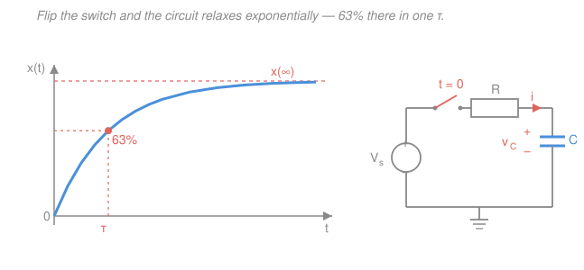

# Circuit Analysis · Lesson 3.2: First-order circuits — RC and RL transients

> ⏱ ~15 min · Module 3: Energy storage and transients · Builds on: [3.1 Capacitors and inductors](03-01-capacitors-and-inductors.md), first-order ODEs from [`ode-refresher`](../../ode-refresher/syllabus.md) · Unlocks: [3.3 Second-order RLC](03-03-second-order-rlc.md)

## Why this matters

Every time you flip a switch, plug in a charger, or a logic gate flips a bit, a circuit doesn't jump to its new state — it *slides* there on an exponential curve. That slide is set by one number, the **time constant**, and it governs how fast a camera flash recharges, how quickly a filter reacts, and the maximum speed a digital chip can clock. Better still: once you have one storage element (a single capacitor or inductor), you never have to touch a differential equation again. Three numbers — where the quantity starts, where it ends, and how long it takes — pin the whole response.

## The idea

A capacitor holds voltage; an inductor holds current. Neither can change *instantly* — that's the continuity rule from [3.1](03-01-capacitors-and-inductors.md) (a jump in $v_C$ would need infinite current, a jump in $i_L$ infinite voltage). So the moment a switch flips, the storage element is *stuck* at its old value and the circuit is momentarily out of equilibrium. Over time it relaxes toward the new DC state the sources demand.

The relaxation is always the same shape: an exponential. Think of it like a cup of coffee cooling toward room temperature — fast at first (big gap to close), then slower and slower as it nears the end, never quite arriving but close enough after a few "time constants." The circuit does the same, and the pace is set entirely by how much resistance the storage element sees and how big it is: a big capacitor through a big resistor charges slowly; a small one through a small resistor snaps.

So you don't solve an ODE. You answer three questions — **Where does the quantity start? Where does it end? How fast?** — and read the answer off a universal formula.

## The formal version

Let $x(t)$ be *any* voltage or current in a circuit with a single capacitor or inductor. It obeys

$$\boxed{\,x(t) = x(\infty) + \big[\,x(0^+) - x(\infty)\,\big]\,e^{-t/\tau}\,}$$

*In words: the quantity is its final value, plus the leftover initial gap, shrinking away exponentially.* At $t=0^+$ the exponential is $1$, so $x = x(0^+)$; as $t\to\infty$ it dies, so $x\to x(\infty)$. The three ingredients:

**1. Initial value $x(0^+)$** — the value just after the switch, at $t=0^+$. Anchor it with the continuity rule: the capacitor voltage $v_C$ and inductor current $i_L$ are the *same* just after the switch as just before,

$$v_C(0^+) = v_C(0^-), \qquad i_L(0^+) = i_L(0^-).$$

*In words: find what the stored quantity was doing the instant before, and it hasn't moved yet.* Everything else at $0^+$ you then read off the circuit, treating the capacitor as a fixed voltage source of value $v_C(0^+)$ and the inductor as a fixed current source of value $i_L(0^+)$.

**2. Final value $x(\infty)$** — the new DC steady state, long after the switch. At DC nothing changes, so $C\frac{dv}{dt}=0$ (no current: **a capacitor looks like an open circuit**) and $L\frac{di}{dt}=0$ (no voltage: **an inductor looks like a short circuit**). Replace the element accordingly and solve the resistive circuit.

**3. Time constant $\tau$** — how long the exponential takes. It is

$$\tau = R_\text{th}C \quad(\text{RC}), \qquad \tau = \frac{L}{R_\text{th}} \quad(\text{RL}),$$

where $R_\text{th}$ is the **Thévenin (equivalent) resistance seen from the storage element's own terminals**, with the element removed and independent sources deactivated (voltage sources shorted, current sources opened) — exactly the $R_\text{th}$ from [2.4](02-04-thevenin-norton-max-power.md). *In words: pull out the capacitor or inductor, look back into the two holes, and that resistance sets the clock.* Units check: $[\Omega][\text{F}] = \text{s}$ and $[\text{H}]/[\Omega] = \text{s}$.

Two names for the same formula: with no source driving it, $x(\infty)=0$ and the response is pure decay — the **natural response**. With a source setting a nonzero $x(\infty)$, the element charges toward it — the **step response**. Same equation either way.

One tidy fact for reading graphs: after one time constant the gap has shrunk by $e^{-1}\approx 0.368$, so the quantity has covered $1-e^{-1}\approx 63\%$ of its journey. After $5\tau$ it is within $0.7\%$ — "done," for engineering purposes.

## Picture

## Worked examples

**Example 1 (RL step — the boss shape).** A $10\,\text{V}$ source, $R=5\,\Omega$, and $L=2\,\text{H}$ sit in series with an open switch that **closes at $t=0$**. No current flows beforehand. Find $i(t)$ through the inductor.

*Three numbers.*
- **Initial:** the switch was open, so $i_L(0^-)=0$, and current is continuous: $i(0^+)=0$.
- **Final:** at DC the inductor is a short, leaving just the source and $R$: $i(\infty)=\dfrac{V}{R}=\dfrac{10}{5}=2\,\text{A}$.
- **Time constant:** the inductor looks back and sees only $R=5\,\Omega$, so $\tau=\dfrac{L}{R}=\dfrac{2}{5}=0.4\,\text{s}$.

Drop them into the formula:

$$i(t) = 2 + (0-2)e^{-t/0.4} = 2\big(1-e^{-2.5t}\big)\,\text{A}.$$

At one time constant, $t=0.4\,\text{s}$: $i = 2(1-e^{-1}) = 2(0.632) \approx 1.26\,\text{A}$ — 63% of the way to $2\,\text{A}$, exactly as the graph promises.

*A quantity that jumps.* The inductor voltage is **not** continuous. At $t=0^+$ the current is still $0$, so there's no drop across $R$ and the full source appears across the inductor: $v_L(0^+)=10\,\text{V}$. It then decays: $v_L(t)=L\frac{di}{dt}=2\cdot(2)(2.5)e^{-2.5t}=10e^{-2.5t}\,\text{V}$. The current eases in continuously; the voltage snaps up then fades.

**Example 2 (RC charge through a divider — finding $R_\text{th}$).** A $12\,\text{V}$ source feeds node $A$ through $R_1=3\,\text{k}\Omega$; from $A$ a resistor $R_2=6\,\text{k}\Omega$ goes to ground and a capacitor $C=100\,\mu\text{F}$ also goes to ground. The switch connects the source at $t=0$; the capacitor starts **uncharged**. Find $v_C(t)$ and the time to reach $90\%$ of its final value.

*Three numbers.*
- **Initial:** uncharged, so $v_C(0^+)=0$.
- **Final:** at DC the capacitor is an open circuit, so no current is diverted and node $A$ is a plain voltage divider: $v_C(\infty)=12\cdot\dfrac{R_2}{R_1+R_2}=12\cdot\dfrac{6}{9}=8\,\text{V}$.
- **Time constant:** remove the capacitor and look into node $A$ with the source shorted. The two holes now see $R_1$ and $R_2$ *in parallel*: $R_\text{th}=R_1\Vert R_2=\dfrac{3\cdot6}{3+6}=2\,\text{k}\Omega$. So $\tau=R_\text{th}C=(2000)(100\times10^{-6})=0.2\,\text{s}$.

The nearest resistor is $R_1=3\,\text{k}\Omega$, but the capacitor doesn't charge through that alone — it's the $2\,\text{k}\Omega$ Thévenin resistance that sets the pace. The response:

$$v_C(t) = 8 + (0-8)e^{-t/0.2} = 8\big(1-e^{-5t}\big)\,\text{V}.$$

Time to reach $90\%$, i.e. $v_C=7.2\,\text{V}$:

$$8(1-e^{-5t})=7.2 \;\Rightarrow\; e^{-5t}=0.1 \;\Rightarrow\; 5t=\ln 10 \;\Rightarrow\; t=\frac{\ln 10}{5}\approx 0.46\,\text{s}\;(=2.3\,\tau).$$

Reaching $90\%$ always takes $\approx 2.3\tau$ — a handy constant, since $\ln 10 \approx 2.303$.

## Watch out

- **Only $v_C$ and $i_L$ are continuous — nothing else is.** Resistor currents, the capacitor's *current*, the inductor's *voltage* can all jump the instant the switch moves (Example 1's $v_L$ leaps to $10\,\text{V}$). Anchor $x(0^+)$ through the stored quantity, then compute the rest of the $0^+$ circuit from it.
- **$R$ in $\tau$ is the resistance the element *sees*, not the resistor next to it.** Deactivate the independent sources and find the Thévenin resistance looking back into the storage element's terminals (Example 2: $2\,\text{k}\Omega$, not $3\,\text{k}\Omega$). Miss this and every timing number is wrong.
- **"Reaches final at $5\tau$" is engineering shorthand.** Mathematically the exponential is an asymptote — it never *equals* $x(\infty)$. And the one formula fits every variable in the circuit, but each variable has its **own** $x(0^+)$ and $x(\infty)$; only $\tau$ is shared.

## One-liner

> Any single-storage circuit relaxes exponentially — find where the quantity starts, where it ends, and the time constant $\tau$, and $x(t)=x(\infty)+[x(0^+)-x(\infty)]e^{-t/\tau}$ hands you the rest.

## Problems

**P1 (🟢) — RC natural response.** A capacitor $C=500\,\mu\text{F}$ is charged to $20\,\text{V}$, then at $t=0$ is left to discharge through $R=10\,\text{k}\Omega$. Find $\tau$ and $v_C(t)$, and the time for the voltage to fall to $5\,\text{V}$.

**P2 (🟡) — RL step.** A $24\,\text{V}$ source, $R=8\,\Omega$, and $L=4\,\text{H}$ are in series; the switch closes at $t=0$ with zero initial current. Find $\tau$, the final current $i(\infty)$, the full $i(t)$, and the current at $t=1\,\text{s}$. What is the inductor voltage at $t=0^+$?

**P3 (🔴) — Two-phase switch (connects to ODEs).** For a long time a $50\,\text{V}$ source has charged a capacitor $C=0.02\,\text{F}$ through $R_1=25\,\Omega$ (series, no other path), so the capacitor is fully charged. At $t=0$ the source is disconnected and the capacitor discharges through a different resistor $R_2=100\,\Omega$. Find $v_C(0^+)$, the new $\tau$, $v_C(t)$ for $t>0$, and the time to reach $10\,\text{V}$.

Solutions

**P1.** Source-free discharge, so $v_C(\infty)=0$ (natural response), and continuity gives $v_C(0^+)=20\,\text{V}$.

$$\tau = RC = (10{,}000)(500\times10^{-6}) = 5\,\text{s}, \qquad v_C(t) = 20\,e^{-t/5}\,\text{V}.$$

Fall to $5\,\text{V}$:

$$20\,e^{-t/5}=5 \;\Rightarrow\; e^{-t/5}=\tfrac14 \;\Rightarrow\; \frac{t}{5}=\ln 4 \;\Rightarrow\; t = 5\ln 4 \approx 6.93\,\text{s}.$$

*Check.* $\ln 4 = 2\ln 2 \approx 1.386$; the drop to a quarter takes just under $1.4\tau$, and $v_C(5)=20e^{-1}\approx 7.4\,\text{V}$, still above $5\,\text{V}$ — consistent with reaching $5\,\text{V}$ a bit after $\tau$. ✓

**P2.** Continuity: $i(0^+)=0$. At DC the inductor is a short, so $i(\infty)=\dfrac{24}{8}=3\,\text{A}$. The inductor sees $R=8\,\Omega$, so $\tau=\dfrac{L}{R}=\dfrac{4}{8}=0.5\,\text{s}$.

$$i(t) = 3 + (0-3)e^{-t/0.5} = 3\big(1-e^{-2t}\big)\,\text{A}.$$

At $t=1\,\text{s}$: $i = 3(1-e^{-2}) = 3(1-0.135) \approx 2.59\,\text{A}$.

Inductor voltage at $t=0^+$: current is still $0$, so no drop across $R$ and the full source is across $L$: $v_L(0^+)=24\,\text{V}$. (Confirm: $v_L=L\frac{di}{dt}=4\cdot 3\cdot 2\,e^{-2t}=24e^{-2t}$, which is $24\,\text{V}$ at $t=0$. ✓)

*Check.* $t=1\,\text{s}=2\tau$, so the current should be at $1-e^{-2}\approx 86.5\%$ of $3\,\text{A}$, i.e. $\approx 2.59\,\text{A}$. ✓

**P3.** *Before $t=0$:* fully charged means steady state, so no current flows, no drop across $R_1$, and the capacitor sits at the full source voltage: $v_C(0^-)=50\,\text{V}$. By continuity, $v_C(0^+)=50\,\text{V}$.

*After $t=0$:* the source is gone; the capacitor discharges through $R_2$ alone, a source-free (natural) response with $v_C(\infty)=0$. The resistance seen is now $R_2=100\,\Omega$, so

$$\tau = R_2 C = (100)(0.02) = 2\,\text{s}, \qquad v_C(t) = 50\,e^{-t/2}\,\text{V}.$$

Time to reach $10\,\text{V}$:

$$50\,e^{-t/2}=10 \;\Rightarrow\; e^{-t/2}=\tfrac15 \;\Rightarrow\; \frac{t}{2}=\ln 5 \;\Rightarrow\; t = 2\ln 5 \approx 3.22\,\text{s}.$$

Note $R_1$ never appears in the answer — it only set up the initial charge; the discharge clock is $R_2$'s alone. Under the hood this is precisely the first-order linear ODE $R_2C\,\dot v_C + v_C = 0$ from [`ode-refresher`](../../ode-refresher/syllabus.md), whose solution $v_C(0)e^{-t/\tau}$ we wrote down without ever setting it up.

*Check.* $\ln 5 \approx 1.609$, so reaching a fifth takes $\approx 1.6\tau$; and $v_C(2)=50e^{-1}\approx 18.4\,\text{V}$, still above $10\,\text{V}$, so $t>\tau=2\,\text{s}$ — consistent. ✓

## Flashback

**From Lesson 3.1 (Capacitors and inductors).** A capacitor $C=10\,\mu\text{F}$ has a voltage ramped as $v(t)=100t\,\text{V}$ (with $t$ in seconds) across it. Find the current $i(t)$ through it, and the energy stored at $t=0.5\,\text{s}$.

Solution

The capacitor $i$–$v$ law is $i = C\dfrac{dv}{dt}$. With $\dfrac{dv}{dt}=100\,\text{V/s}$,

$$i = (10\times10^{-6})(100) = 1\times10^{-3}\,\text{A} = 1\,\text{mA}\ (\text{constant}).$$

At $t=0.5\,\text{s}$ the voltage is $v=100(0.5)=50\,\text{V}$, so the stored energy is

$$W = \tfrac12 C v^2 = \tfrac12 (10\times10^{-6})(50)^2 = \tfrac12(10\times10^{-6})(2500) = 1.25\times10^{-2}\,\text{J} = 12.5\,\text{mJ}.$$

*Check.* A steadily rising voltage means a steady charging current — a *constant* $i$, matching $i=C\,dv/dt$ with constant slope. ✓

## Connections

- **Backward:** the whole method rests on [3.1](03-01-capacitors-and-inductors.md) — the continuity of $v_C$ and $i_L$ fixes $x(0^+)$, and the DC limits (capacitor open, inductor short) fix $x(\infty)$. The Thévenin resistance $R_\text{th}$ that sets $\tau$ is straight from [2.4](02-04-thevenin-norton-max-power.md).
- **Forward:** [3.3 Second-order RLC](03-03-second-order-rlc.md) adds a *second* storage element, so one time constant is no longer enough — the response becomes a characteristic equation with two roots, and the exponential can pick up oscillation (over-, critically-, and under-damped).
- **Sideways (ODEs):** this lesson is the first-order linear ODE $\tau\dot x + x = x(\infty)$ from [`ode-refresher`](../../ode-refresher/syllabus.md), solved by inspection. The same exponential relaxation drives radioactive decay, RC-timed circuits in electronics, and the overdamped limit of the mechanics spring-mass system — one $e^{-t/\tau}$ shape wearing many uniforms.
