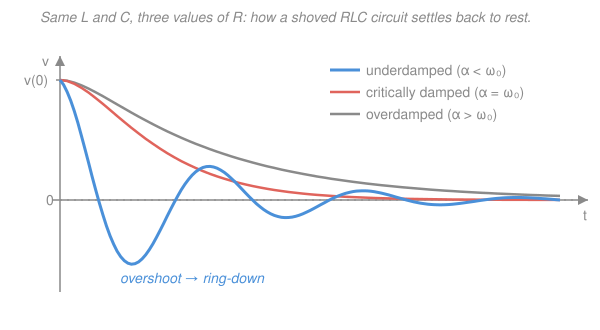

# Circuit Analysis · Lesson 3.3: Second-order circuits — the RLC response

> ⏱ ~15 min · Module 3: Dynamic elements · Builds on: [3.2 First-order RC & RL transients](03-02-first-order-rc-rl-transients.md), second-order ODEs from [`ode-refresher`](../../ode-refresher/syllabus.md) · Unlocks: [4.1 Sinusoids & phasors](04-01-sinusoids-and-phasors.md) and AC resonance

## Why this matters

Put a capacitor *and* an inductor in the same circuit and something new happens: the energy doesn't just leak away, it **sloshes** — the inductor's magnetic field dumps into the capacitor's electric field and back again, while the resistor quietly drains the pool. That sloshing is why a plucked circuit can *ring* like a bell, why a car's suspension either bounces or settles, and why every clock, radio tuner, and switching power supply lives or dies on getting this balance right. This one lesson also hands you the entire vocabulary — damping, natural frequency, resonance — that Module 4 spends on AC.

## The idea

A first-order circuit ([3.2](03-02-first-order-rc-rl-transients.md)) had *one* memory element and *one* way to relax: a plain exponential decay, no drama. Add a second memory element — now L and C — and the circuit can do something an exponential never can: **overshoot**. Push it, and it can swing *past* rest before coming back, because the inductor, once current is flowing, refuses to stop instantly, so it drives the capacitor the other way.

Whether it overshoots comes down to a tug-of-war between two effects: the L–C pair *wants* to oscillate (energy trading back and forth), and the resistor *wants* to kill motion (draining energy as heat). Three outcomes:

- **Resistor wins big** — the circuit oozes back to rest, no overshoot. *Overdamped.*
- **Resistor wins by a hair** — fastest possible settle with still no overshoot. *Critically damped.*
- **Oscillation wins** — the circuit overshoots and rings, each swing smaller than the last as the resistor bleeds it down. *Underdamped.*

If that reads exactly like a mass on a spring with a shock absorber, that's not a coincidence — it's the *same equation*, which we'll cash in below.

## The formal version

Take a **source-free series RLC** loop: a resistor $R$ (ohms), inductor $L$ (henries), and capacitor $C$ (farads) in a single loop, carrying a common current $i(t)$. Kirchhoff's voltage law around the loop (the inductor drops $L\,di/dt$, the resistor $Ri$, the capacitor $\frac1C\int i\,dt$) gives

$$L\frac{di}{dt} + Ri + \frac{1}{C}\int i\,dt = 0.$$

Differentiate once to clear the integral and divide by $L$:

$$\frac{d^2 i}{dt^2} + \frac{R}{L}\frac{di}{dt} + \frac{1}{LC}\,i = 0.$$

*In words: a circuit with both L and C obeys a **second-order** linear ODE — the same kind you solved for a spring.* Guess $i = e^{st}$ (that's what [`ode-refresher`](../../ode-refresher/syllabus.md) tells you to do) and you get the **characteristic equation**

$$s^2 + \frac{R}{L}s + \frac{1}{LC} = 0 \quad\Longrightarrow\quad s^2 + 2\alpha s + \omega_0^2 = 0,$$

where we name the two numbers that run everything:

$$\boxed{\;\alpha = \frac{R}{2L}\;}\ \text{(series)}\qquad \boxed{\;\omega_0 = \frac{1}{\sqrt{LC}}\;}$$

- $\alpha$ — the **neper (damping) frequency**, in $\text{rad/s} = \text{Np/s}$: how fast the resistor bleeds energy. Bigger $R$ (in series), more damping.
- $\omega_0$ — the **undamped natural frequency** (rad/s): the tempo the L–C pair *would* ring at with no resistor.

The quadratic formula hands you the two **characteristic roots**:

$$\boxed{\;s = -\alpha \pm \sqrt{\alpha^2 - \omega_0^2}\;}$$

*In words: the whole behavior is decided by the sign of $\alpha^2 - \omega_0^2$ — that is, by whether $\alpha$ or $\omega_0$ is bigger.* Three cases:

| Case | Condition | Roots | Natural response $x(t)$ |
|---|---|---|---|
| **Overdamped** | $\alpha > \omega_0$ | two real, $s_{1,2}=-\alpha\pm\sqrt{\alpha^2-\omega_0^2}$ | $A e^{s_1 t} + B e^{s_2 t}$ |
| **Critically damped** | $\alpha = \omega_0$ | one repeated, $s=-\alpha$ | $(A + Bt)\,e^{-\alpha t}$ |
| **Underdamped** | $\alpha < \omega_0$ | complex, $-\alpha\pm j\omega_d$ | $e^{-\alpha t}\!\left(A\cos\omega_d t + B\sin\omega_d t\right)$ |

Here $x(t)$ is any circuit variable (a capacitor voltage $v$, a current $i$…), the constants $A,B$ are fixed by initial conditions, and the underdamped case introduces the **damped natural frequency**

$$\boxed{\;\omega_d = \sqrt{\omega_0^2 - \alpha^2}\;}$$

*In words: an underdamped circuit rings at $\omega_d$ — always a bit **slower** than the undamped $\omega_0$, because damping drags the tempo down — inside a decaying envelope $e^{-\alpha t}$.* (Engineering $j=\sqrt{-1}$ here, since $i$ is already current.)

**One caution on the sign of $\alpha$ — series vs. parallel.** For a **parallel** RLC circuit the same three cases and the same $\omega_0=1/\sqrt{LC}$ apply, but the damping constant flips its dependence on $R$:

$$\alpha_{\text{parallel}} = \frac{1}{2RC}.$$

*In words: in series, big $R$ damps hard; in parallel, **small** $R$ damps hard* (a small parallel resistor is a fat leak). Pick the right $\alpha$ for the topology; everything downstream is identical.

## Picture

All three start at the same shove $v(0)$ and end at rest. Only the blue underdamped curve crosses zero and overshoots; coral (critical) is the quickest settle *without* overshoot; grey (over) is the sluggish crawl home.

## Worked examples

**Example 1 — classify and write the response (the series case).** A source-free series RLC circuit has $R = 2\,\Omega$, $L = 1\,\text{H}$, $C = 0.25\,\text{F}$. Find $\alpha$, $\omega_0$, classify the damping, and write the form of the natural response.

$$\alpha = \frac{R}{2L} = \frac{2}{2\cdot 1} = 1\ \text{rad/s}, \qquad \omega_0 = \frac{1}{\sqrt{LC}} = \frac{1}{\sqrt{1\cdot 0.25}} = \frac{1}{0.5} = 2\ \text{rad/s}.$$

Since $\alpha = 1 < \omega_0 = 2$, the circuit is **underdamped** — it rings. The damped frequency is

$$\omega_d = \sqrt{\omega_0^2 - \alpha^2} = \sqrt{4 - 1} = \sqrt{3}\ \text{rad/s},$$

and the roots are $s = -1 \pm j\sqrt3$. So any variable in this circuit follows

$$v(t) = e^{-t}\!\left(A\cos\sqrt3\,t + B\sin\sqrt3\,t\right).$$

*Read it off:* the envelope $e^{-t}$ decays with time constant $1/\alpha = 1\,\text{s}$, and inside it the circuit oscillates at $\sqrt3 \approx 1.73\,\text{rad/s}$ — a hair below the undamped $\omega_0 = 2$. The constants $A,B$ would come from the initial capacitor voltage and inductor current.

**Example 2 — tune $R$ to kill the ringing (critical damping).** Keep $L = 1\,\text{H}$ and $C = 0.25\,\text{F}$ but ask: *what $R$ makes this circuit settle as fast as possible with no overshoot?* That's the critically damped condition $\alpha = \omega_0$. We already have $\omega_0 = 2$, so we need

$$\alpha = \frac{R}{2L} = 2 \quad\Longrightarrow\quad R = 2L\cdot 2 = 4\,\Omega.$$

At $R = 4\,\Omega$: $\alpha = \omega_0 = 2$, the two roots collapse to a single repeated root $s = -2$, and the response is

$$v(t) = (A + Bt)\,e^{-2t}.$$

*Sanity on the boundary:* nudge $R$ **below** $4\,\Omega$ and $\alpha < \omega_0$ — back to underdamped ringing (Example 1's $R=2\,\Omega$ lives here). Nudge $R$ **above** $4\,\Omega$, say $R = 5\,\Omega$: then $\alpha = 2.5 > 2 = \omega_0$, two real roots, **overdamped** — a slow crawl home. The critical $R = 4\,\Omega$ is exactly the knife's edge between ring and crawl, and it's the fastest settle you can get. That's precisely how you'd size the resistor in a relay snubber or a meter movement so the needle snaps to its reading without wobbling.

## Watch out

- **You might think more resistance always means faster settling.** Only up to critical. Past $R=4\,\Omega$ in Example 2 the circuit is overdamped and gets *slower*, because the sluggish root $s_1 = -\alpha + \sqrt{\alpha^2-\omega_0^2}$ creeps toward zero as $R$ grows — a heavily overdamped circuit is dominated by that one lazy exponential.
- **You might reuse $\alpha = R/2L$ for a parallel circuit.** Don't — parallel uses $\alpha = 1/(2RC)$, and the dependence on $R$ is *inverted*. Always ask "series or parallel?" before writing $\alpha$. ($\omega_0 = 1/\sqrt{LC}$ is the same for both.)
- **You might think $v_C$ or $i_L$ can jump at $t=0$.** They can't — a capacitor's voltage and an inductor's current are continuous ([3.1](03-01-capacitors-and-inductors.md)). Those two continuity facts are exactly the two initial conditions a second-order ODE needs to pin down $A$ and $B$.

## One-liner

> A circuit with both L and C is a second-order ODE whose roots $s = -\alpha \pm \sqrt{\alpha^2 - \omega_0^2}$ decide everything: $\alpha > \omega_0$ crawls, $\alpha = \omega_0$ snaps, $\alpha < \omega_0$ rings at $\omega_d = \sqrt{\omega_0^2 - \alpha^2}$.

## Problems

**P1 (🟢)** A source-free series RLC circuit has $R = 5\,\Omega$, $L = 1\,\text{H}$, $C = \tfrac16\,\text{F}$. Find $\alpha$ and $\omega_0$, classify the damping, find the characteristic roots, and write the form of the natural response.

**P2 (🟡)** A series RLC circuit has $L = 2\,\text{H}$ and $C = 0.5\,\text{F}$. What value of $R$ makes it critically damped? Write the resulting natural response.

**P3 (🔴)** A shock absorber problem in disguise. A mass–spring–damper obeys $m\ddot x + b\dot x + kx = 0$ with $m = 1\,\text{kg}$, $b = 2\,\text{N·s/m}$, $k = 5\,\text{N/m}$. By matching it term-for-term to the series RLC equation, identify the mechanical $\alpha$ and $\omega_0$, classify the motion, and write $x(t)$. Which electrical quantity plays the role of the mass?

Solutions

**P1** Series, so $\alpha = R/2L$:

$$\alpha = \frac{5}{2\cdot 1} = 2.5\ \text{rad/s}, \qquad \omega_0 = \frac{1}{\sqrt{LC}} = \frac{1}{\sqrt{1\cdot \tfrac16}} = \sqrt{6} \approx 2.449\ \text{rad/s}.$$

Since $\alpha = 2.5 > \omega_0 = \sqrt6$, the circuit is **overdamped**. Roots:

$$s = -\alpha \pm \sqrt{\alpha^2 - \omega_0^2} = -2.5 \pm \sqrt{6.25 - 6} = -2.5 \pm \sqrt{0.25} = -2.5 \pm 0.5,$$

so $s_1 = -2$, $s_2 = -3$, both real and negative. Natural response:

$$i(t) = A e^{-2t} + B e^{-3t}.$$

*Check.* Two distinct real negative roots ⇒ a sum of two decaying exponentials, no oscillation — the signature of overdamping. ✓

**P2** Critical damping means $\alpha = \omega_0$. First $\omega_0 = 1/\sqrt{LC} = 1/\sqrt{2\cdot 0.5} = 1/\sqrt1 = 1\ \text{rad/s}$. Set $\alpha = 1$:

$$\frac{R}{2L} = 1 \quad\Longrightarrow\quad R = 2L = 2\cdot 2 = 4\,\Omega.$$

The repeated root is $s = -\alpha = -1$, so

$$v(t) = (A + Bt)\,e^{-t}.$$

*Check.* At $R=4\,\Omega$: $\alpha = 4/4 = 1 = \omega_0$ ✓. Any smaller $R$ would ring; any larger would crawl.

**P3** Matching $m\ddot x + b\dot x + kx = 0$ to the series form $L\ddot i + R\dot i + \tfrac1C i = 0$, the dictionary is $L \leftrightarrow m$, $R \leftrightarrow b$, $\tfrac1C \leftrightarrow k$. So **inductance plays the role of mass** (inertia — it resists changes in current just as mass resists changes in velocity), resistance ↔ damping, and inverse capacitance ↔ stiffness. Then

$$\alpha = \frac{b}{2m} = \frac{2}{2\cdot 1} = 1\ \text{rad/s}, \qquad \omega_0 = \sqrt{\frac{k}{m}} = \sqrt{\frac{5}{1}} = \sqrt5 \approx 2.236\ \text{rad/s}.$$

Since $\alpha = 1 < \omega_0 = \sqrt5$, the motion is **underdamped** (the shock absorber is too soft — the car will bounce). Damped frequency:

$$\omega_d = \sqrt{\omega_0^2 - \alpha^2} = \sqrt{5 - 1} = 2\ \text{rad/s},$$

so

$$x(t) = e^{-t}\!\left(A\cos 2t + B\sin 2t\right).$$

*Check.* This is the identical machinery from [`mechanics-refresher`](../../mechanics-refresher/syllabus.md) SHM-with-damping and [`engineering-dynamics`](../../engineering-dynamics/syllabus.md) vibrations — $\alpha = b/2m$ is the exact twin of $R/2L$. Same ODE, different costume. ✓

## Flashback

**From Lesson 3.2 (First-order RC & RL transients):** A $20\,\text{V}$ source charges an initially uncharged capacitor $C = 100\,\mu\text{F}$ through a resistor $R = 10\,\text{k}\Omega$; the switch closes at $t = 0$. Find the time constant $\tau$, the final capacitor voltage, the expression $v_C(t)$, and $v_C$ at one time constant.

Solution

First-order RC charging, so the capacitor voltage relaxes exponentially from $0$ to its final value with time constant $\tau = RC$:

$$\tau = RC = (10{,}000\,\Omega)(100\times 10^{-6}\,\text{F}) = 1\ \text{s}.$$

At $t\to\infty$ no current flows (capacitor fully charged), so it sits at the full source voltage: $v_C(\infty) = 20\,\text{V}$. With $v_C(0)=0$,

$$v_C(t) = 20\left(1 - e^{-t/\tau}\right) = 20\left(1 - e^{-t}\right)\ \text{V}.$$

At one time constant, $t = \tau = 1\,\text{s}$:

$$v_C(1) = 20\left(1 - e^{-1}\right) = 20(1 - 0.368) \approx 12.6\ \text{V}.$$

*Check.* The classic "$63\%$ charged after one $\tau$" rule: $0.632\times 20 = 12.6\,\text{V}$ ✓. Units: $\Omega\cdot\text{F} = \text{s}$ ✓.

## Connections

- **Backward:** this is [3.2](03-02-first-order-rc-rl-transients.md)'s exponential transient promoted to second order — two memory elements, so two roots and two initial conditions (the continuous $v_C$ and $i_L$ from [3.1](03-01-capacitors-and-inductors.md)). The characteristic-equation method is straight out of [`ode-refresher`](../../ode-refresher/syllabus.md).
- **Forward:** [4.1 Sinusoids & phasors](04-01-sinusoids-and-phasors.md) and [4.2](04-02-impedance-phasor-analysis.md) turn $\omega_0 = 1/\sqrt{LC}$ into the **resonant** frequency — the same L–C pair, now *driven* by a sine wave instead of left to ring on its own, where the response peaks. This lesson closes Module 3.
- **Sideways (mechanics):** the series RLC equation is term-for-term the damped spring–mass ([`mechanics-refresher`](../../mechanics-refresher/syllabus.md) SHM, [`engineering-dynamics`](../../engineering-dynamics/syllabus.md) vibrations): $L\leftrightarrow m$, $R\leftrightarrow b$, $1/C\leftrightarrow k$, and $\alpha = R/2L$ is the twin of $b/2m$. Over/critical/underdamped are the shock absorber that's mushy, just right, or stiff.
