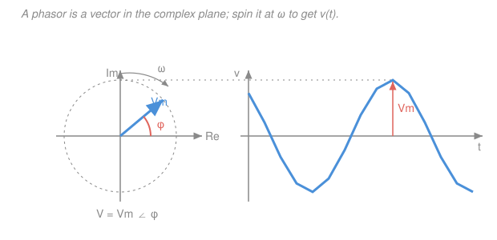

# Circuit Analysis · Lesson 4.1: Sinusoids and phasors

> ⏱ ~15 min · Module 4: Sinusoidal steady state and AC power · Builds on: [3.3 Second-order RLC](03-03-second-order-rlc.md), [`ode-refresher`](../../ode-refresher/syllabus.md), sinusoids from [`mechanics-refresher`](../../mechanics-refresher/syllabus.md) · Unlocks: [4.2 Impedance and phasor analysis](04-02-impedance-phasor-analysis.md)

## Why this matters

The wall socket, the power grid, every radio and Wi-Fi carrier, the AC coupling inside your phone — all of it is sinusoids. And once you drive a linear circuit with a sine wave and wait for the startup transient to die, *every* voltage and current in it is a sine wave at the **same frequency**, differing only in amplitude and phase. That is a huge simplification, and phasors cash it in: they replace the calculus of Module 3 (differentiating and integrating sinusoids) with the algebra of complex numbers. A differential equation becomes a division. This lesson builds the translator; [4.2](04-02-impedance-phasor-analysis.md) uses it to solve whole circuits by complex Ohm's law.

## The idea

A sinusoid at a fixed frequency is really just **two numbers**: how tall it is (amplitude) and how shifted it is (phase). The frequency is shared by everything in the circuit, so it's along for the ride — you can factor it out and carry only the amplitude-and-phase pair. Package those two numbers as the length and angle of an arrow in a plane, and that arrow is the **phasor**.

Here's the picture that makes it click: draw an arrow of length $V_m$ in the complex plane and spin it counterclockwise at rate $\omega$. Its shadow on the real axis — the horizontal projection — slides back and forth, and it traces *exactly* $V_m\cos(\omega t+\phi)$. The spinning is the same for every signal in the circuit (same $\omega$), so we freeze it at $t=0$ and just record where each arrow points. Adding two sine waves of the same frequency, which is ugly trigonometry, becomes adding two arrows — tip to tail. Differentiating becomes rotating the arrow by $90^\circ$ and stretching it by $\omega$. The hard operations of calculus turn into the easy operations of vectors.

## The formal version

**A sinusoid** is written in the standard cosine form

$$v(t) = V_m\cos(\omega t + \phi),$$

with three pieces: the **amplitude** $V_m$ (peak value, volts), the **angular frequency** $\omega$ (radians per second — related to ordinary frequency by $\omega = 2\pi f$), and the **phase** $\phi$ (radians or degrees, where the wave sits at $t=0$). *In words: how tall, how fast, and how shifted.*

**Euler's formula** is the bridge to complex numbers: $e^{j\theta} = \cos\theta + j\sin\theta$, so $\cos\theta = \mathrm{Re}\{e^{j\theta}\}$. (Engineers write $j = \sqrt{-1}$, saving $i$ for current.) Apply it:

$$v(t) = V_m\cos(\omega t + \phi) = \mathrm{Re}\big\{V_m e^{j(\omega t+\phi)}\big\} = \mathrm{Re}\big\{\underbrace{V_m e^{j\phi}}_{\text{phasor}}\,e^{j\omega t}\big\}.$$

*In words: peel the signal into a constant complex amplitude times a universal spinning factor $e^{j\omega t}$.* The constant part is the **phasor**:

$$\boxed{\;\mathbf V = V_m e^{j\phi} = V_m\angle\phi\;}$$

*In words: the phasor is one complex number holding the amplitude and phase; the shared $\omega$ is dropped and restored at the end.* Bold $\mathbf V$ (a complex number) is the phasor; $v(t)$ (a real function of time) is the actual waveform. To go back, reattach $e^{j\omega t}$ and take the real part.

**Complex arithmetic — two coordinate systems.** A complex number lives in the plane two ways:

$$z = \underbrace{a + jb}_{\text{rectangular}} = \underbrace{r\angle\theta}_{\text{polar}},\qquad r = \sqrt{a^2+b^2},\quad \theta = \tan^{-1}\!\frac{b}{a},\quad a = r\cos\theta,\quad b = r\sin\theta.$$

Use whichever makes the operation easy:

- **Add or subtract** in rectangular: $(a_1+jb_1)+(a_2+jb_2) = (a_1+a_2)+j(b_1+b_2)$. *(Line up real with real, imaginary with imaginary — like adding vector components.)*
- **Multiply or divide** in polar: $(r_1\angle\theta_1)(r_2\angle\theta_2) = r_1r_2\angle(\theta_1+\theta_2)$, and $\dfrac{r_1\angle\theta_1}{r_2\angle\theta_2} = \dfrac{r_1}{r_2}\angle(\theta_1-\theta_2)$. *(Multiply the lengths, add the angles.)*

**The payoff — derivatives become multiplication.** Differentiate $v(t) = \mathrm{Re}\{\mathbf V e^{j\omega t}\}$:

$$\frac{dv}{dt} = \mathrm{Re}\Big\{\mathbf V\,\frac{d}{dt}e^{j\omega t}\Big\} = \mathrm{Re}\big\{j\omega\,\mathbf V\,e^{j\omega t}\big\}.$$

So in phasor-land the operator $\dfrac{d}{dt}$ is just **multiply by $j\omega$**:

$$\boxed{\;\frac{d}{dt}\;\longrightarrow\;j\omega\;}\qquad\text{(and integration $\displaystyle\int dt \to \tfrac{1}{j\omega}$).}$$

*In words: differentiating a steady-state sinusoid scales it by $\omega$ and rotates it $90^\circ$ ahead — because $j = 1\angle 90^\circ$.* This is the whole reason phasors exist: the derivatives in a capacitor's $i = C\,dv/dt$ and an inductor's $v = L\,di/dt$ turn into plain multiplication, so the circuit's differential equation collapses into algebra (that's [4.2](04-02-impedance-phasor-analysis.md)).

**Leading and lagging.** Compare two sinusoids at the same $\omega$. If $\mathbf V_1$'s angle is greater than $\mathbf V_2$'s, wave 1 reaches its peak earlier in time — we say $v_1$ **leads** $v_2$ by $(\phi_1-\phi_2)$; equivalently $v_2$ **lags** $v_1$. *In words: bigger phase angle = ahead in time.* A $90^\circ$ lead is exactly what $j$ does, which is why a capacitor's current leads its voltage.

## Picture

The blue arrow is the phasor $\mathbf V = V_m\angle\phi$; the coral wedge is its phase $\phi$. Spin it counterclockwise at $\omega$ and the blue curve on the right is what its projection paints in time. Notice the arrow's length and the wave's peak are the same height $V_m$ — that's all a phasor is: the frozen snapshot of a spinning vector.

## Worked examples

**Example 1 — converting, and the classic "adding sines is hard, adding phasors is easy."**

*Conversion drill first.* Take $v(t) = 8\cos(377t - 30^\circ)\,\text{V}$ (a 60 Hz line voltage, since $\omega = 377 = 2\pi\cdot 60$). Strip the $\cos$, keep amplitude and phase:

$$\mathbf V = 8\angle{-}30^\circ\,\text{V}.$$

Going back, reattach $\omega t$ inside the cosine: $\mathbf V = 8\angle{-}30^\circ \Rightarrow v(t) = 8\cos(377t - 30^\circ)\,\text{V}$. That's the whole round trip.

*Now add two sinusoids of the same frequency.* Suppose two currents meet at a node (KCL), $i_1 = 5\cos(\omega t + 0^\circ)$ and $i_2 = 5\cos(\omega t + 90^\circ)$, both in amps. Adding them with trig identities is a slog. Phasors make it one line each way.

**Step 1 — to phasors:** $\mathbf I_1 = 5\angle 0^\circ$, $\mathbf I_2 = 5\angle 90^\circ$.

**Step 2 — to rectangular, then add:**

$$\mathbf I_1 = 5 + j0,\qquad \mathbf I_2 = 5\cos 90^\circ + j5\sin 90^\circ = 0 + j5,$$
$$\mathbf I = \mathbf I_1 + \mathbf I_2 = 5 + j5.$$

**Step 3 — back to polar:** $r = \sqrt{5^2+5^2} = \sqrt{50} = 5\sqrt2 \approx 7.07$, $\theta = \tan^{-1}(5/5) = 45^\circ$, so $\mathbf I = 7.07\angle 45^\circ\,\text{A}$.

**Step 4 — back to time:** $i(t) = 7.07\cos(\omega t + 45^\circ)\,\text{A}$.

Two equal peaks $90^\circ$ apart don't add to $10$ — they add to $5\sqrt2$, split the difference in phase, and land at $45^\circ$. That's the parallelogram of two perpendicular arrows, read straight off the diagram.

**Example 2 — the derivative is a $90^\circ$ lead (confirming $d/dt\to j\omega$).**

Let $v(t) = 4\cos(\omega t + 20^\circ)\,\text{V}$, phasor $\mathbf V = 4\angle 20^\circ$. Its derivative should, by the rule, be $j\omega\,\mathbf V$. Check it directly.

*By calculus:* $\dfrac{dv}{dt} = -4\omega\sin(\omega t + 20^\circ)$. Convert the sine to a cosine using $-\sin\theta = \cos(\theta + 90^\circ)$:

$$\frac{dv}{dt} = 4\omega\cos(\omega t + 20^\circ + 90^\circ) = 4\omega\cos(\omega t + 110^\circ).$$

Its phasor is $4\omega\angle 110^\circ$.

*By the rule:* $j\omega\,\mathbf V = (\omega\angle 90^\circ)(4\angle 20^\circ) = 4\omega\angle 110^\circ$ — multiply lengths ($\omega\cdot 4$), add angles ($90^\circ + 20^\circ$). **Identical.** The derivative has the same shape, amplitude scaled by $\omega$, phase advanced by exactly $90^\circ$: it *leads* the original. Multiplying by $j$ is a quarter-turn counterclockwise, and that quarter-turn is a $90^\circ$ phase lead in time.

## Watch out

- **You might mix sine and cosine forms.** The phasor recipe assumes the **cosine** reference. Before reading off a phasor, convert any sine with $\sin(\omega t) = \cos(\omega t - 90^\circ)$ — otherwise every phase is off by $90^\circ$. (And keep amplitudes as peak values unless you deliberately switch to RMS, which is [4.3](04-03-ac-power-power-factor.md)'s convention.)
- **You might try to add sinusoids in polar form.** You can't add $r\angle\theta$ terms by adding lengths and angles — that's only for multiply/divide. Convert to rectangular $a+jb$, add components, then convert back. Multiply/divide, on the other hand, is painful in rectangular and trivial in polar. Pick the coordinate system that fits the operation.
- **You might think phasors work for any input.** They only describe the **steady-state** response to a *single* sinusoidal frequency — after transients die. Different frequencies can't share one phasor diagram (their arrows spin at different rates), and the startup transient from Module 3 is invisible to this method. Phasors are a steady-state tool.

## One-liner

> A phasor freezes a sinusoid into one complex number $V_m\angle\phi$, turning "add sines / differentiate" into "add vectors / multiply by $j\omega$."

## Problems

**P1 (🟢)** (a) Write the phasor for $v(t) = 12\cos(100t + 60^\circ)\,\text{V}$. (b) Write the time-domain signal for the current phasor $\mathbf I = 3\angle{-}45^\circ\,\text{A}$ at $\omega = 100\,\text{rad/s}$. (c) Does $v$ lead or lag $i$, and by how much?

**P2 (🟡)** Add $v_1(t) = 6\cos(\omega t + 30^\circ)\,\text{V}$ and $v_2(t) = 8\cos(\omega t - 60^\circ)\,\text{V}$ by converting to phasors, adding in rectangular, and converting back. Give the result as a single sinusoid.

**P3 (🔴)** A capacitor obeys $i_C = C\,\dfrac{dv_C}{dt}$. If $v_C(t) = 10\cos(\omega t)\,\text{V}$ across $C = 2\,\text{mF}$ at $\omega = 500\,\text{rad/s}$, use the $d/dt\to j\omega$ rule to find the current phasor $\mathbf I_C$ and hence $i_C(t)$. Confirm the current *leads* the voltage by $90^\circ$.

Solutions

**P1.** (a) Strip the cosine, keep amplitude and phase: $\mathbf V = 12\angle 60^\circ\,\text{V}$.

(b) Reattach $\omega t = 100t$ inside a cosine: $i(t) = 3\cos(100t - 45^\circ)\,\text{A}$.

(c) Compare phases: $\phi_v = 60^\circ$, $\phi_i = -45^\circ$, difference $60^\circ - (-45^\circ) = 105^\circ > 0$. So $v$ **leads** $i$ by $105^\circ$ (equivalently, $i$ lags $v$ by $105^\circ$).

*Check.* A positive phase difference means the voltage peaks earlier in time — consistent with "bigger angle = ahead." ✓

**P2.** To phasors: $\mathbf V_1 = 6\angle 30^\circ$, $\mathbf V_2 = 8\angle{-}60^\circ$.

To rectangular:
$$\mathbf V_1 = 6\cos 30^\circ + j6\sin 30^\circ = 5.196 + j3.000,$$
$$\mathbf V_2 = 8\cos(-60^\circ) + j8\sin(-60^\circ) = 4.000 - j6.928.$$

Add components:
$$\mathbf V = (5.196 + 4.000) + j(3.000 - 6.928) = 9.196 - j3.928.$$

Back to polar: $r = \sqrt{9.196^2 + 3.928^2} = \sqrt{84.57 + 15.43} = \sqrt{100.0} = 10.0$, and $\theta = \tan^{-1}\!\dfrac{-3.928}{9.196} = -23.1^\circ$ (real part positive, so the angle is in the fourth quadrant — no adjustment needed).

$$\mathbf V = 10.0\angle{-}23.1^\circ\,\text{V}\quad\Longrightarrow\quad v(t) = 10\cos(\omega t - 23.1^\circ)\,\text{V}.$$

*Check.* The magnitudes $6$ and $8$ are $90^\circ$ apart in phase ($30^\circ$ vs $-60^\circ$), so like a right triangle the resultant magnitude is $\sqrt{6^2+8^2} = 10$ exactly — a satisfying confirmation. ✓

**P3.** Voltage phasor: $\mathbf V_C = 10\angle 0^\circ\,\text{V}$. The $i$–$v$ law $i_C = C\,dv_C/dt$ becomes, with $d/dt\to j\omega$,

$$\mathbf I_C = j\omega C\,\mathbf V_C = (j)(500)(2\times 10^{-3})(10\angle 0^\circ) = j\cdot 10 = 10\angle 90^\circ\,\text{A}.$$

(Here $\omega C = 500\times 0.002 = 1$, so $\mathbf I_C = j\cdot 1\cdot 10\angle 0^\circ$; multiplying by $j = 1\angle 90^\circ$ rotates by $90^\circ$.) Back to time:

$$i_C(t) = 10\cos(\omega t + 90^\circ)\,\text{A}.$$

The current's phase is $+90^\circ$ against the voltage's $0^\circ$, so the current **leads** the voltage by $90^\circ$ — the hallmark of a capacitor ("ICE": in a capacitor, I leads E). 

*Check.* Amplitude scaled by $\omega C = 1$ gives $10\,\text{A}$; the $90^\circ$ lead is exactly the quarter-turn from multiplying by $j$, matching Example 2's derivative rule. ✓

## Flashback

**From Lesson 3.3 (Second-order RLC):** A series RLC circuit has $R = 6\,\Omega$, $L = 1\,\text{H}$, and $C = 0.04\,\text{F}$. Compute the damping coefficient $\alpha$ and the undamped natural frequency $\omega_0$, classify the damping, and (if it applies) find the damped frequency $\omega_d$.

Solution

For a **series** RLC circuit, $\alpha = \dfrac{R}{2L}$ and $\omega_0 = \dfrac{1}{\sqrt{LC}}$:

$$\alpha = \frac{6}{2\cdot 1} = 3\,\text{rad/s},\qquad \omega_0 = \frac{1}{\sqrt{1\cdot 0.04}} = \frac{1}{0.2} = 5\,\text{rad/s}.$$

Since $\alpha < \omega_0$ ($3 < 5$), the circuit is **underdamped** — it rings while decaying. The damped frequency is

$$\omega_d = \sqrt{\omega_0^2 - \alpha^2} = \sqrt{25 - 9} = \sqrt{16} = 4\,\text{rad/s},$$

so the natural response has the form $x(t) = e^{-3t}\big(A\cos 4t + B\sin 4t\big)$.

*Check.* $\alpha < \omega_0 \Rightarrow$ underdamped, and $\omega_d = 4 < \omega_0 = 5$ as it must be (damping always slows the ringing). ✓ This is the same ring-that-decays as a damped spring-mass — and its steady-state *driven* version is exactly what phasors handle in [4.2](04-02-impedance-phasor-analysis.md).

## Connections

- **Backward:** the $d/dt\to j\omega$ rule is aimed straight at the capacitor and inductor laws from [3.1](03-01-capacitors-and-inductors.md), $i = C\,dv/dt$ and $v = L\,di/dt$ — the derivatives that made [3.2](03-02-first-order-rc-rl-transients.md) and [3.3](03-03-second-order-rlc.md) into ODEs. In steady state those derivatives become multiplications, which is the setup for impedance.
- **Forward:** [4.2 Impedance and phasor analysis](04-02-impedance-phasor-analysis.md) turns $j\omega L$ and $1/j\omega C$ into complex resistances, so all of Module 2's nodal, mesh, and Thévenin machinery runs unchanged on complex numbers.
- **Sideways (complex analysis):** the whole method *is* Euler's formula $e^{j\theta} = \cos\theta + j\sin\theta$ and the polar/rectangular algebra of [`complex-analysis`](../../complex-analysis/syllabus.md); the rotating phasor is the same spinning vector as an undamped oscillator's $A\cos(\omega t+\phi)$ in [`mechanics-refresher`](../../mechanics-refresher/syllabus.md), and the underlying $y''+\omega^2 y = 0$ is [`ode-refresher`](../../ode-refresher/syllabus.md)'s imaginary-roots case.
