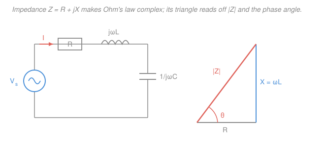

# Circuit Analysis · Lesson 4.2: Impedance and phasor circuit analysis

> ⏱ ~15 min · Module 4: Sinusoidal steady state and AC power · Builds on: [4.1 Sinusoids and phasors](04-01-sinusoids-and-phasors.md), [2.1 Nodal analysis](02-01-nodal-analysis.md) · Unlocks: [4.3 AC power](04-03-ac-power-power-factor.md)

## Why this matters

Every filter in your headphones, every radio that picks *one* station out of the air, every power line humming at 60 Hz — all of them are AC circuits, and none of them can be solved with plain $V=IR$, because capacitors and inductors care about *how fast* the voltage changes, not just how big it is. In [4.1](04-01-sinusoids-and-phasors.md) you learned the trick that tames this: represent each sinusoid by a complex **phasor**, and the calculus of $\frac{d}{dt}$ collapses into multiplying by $j\omega$. This lesson cashes that in. We define one complex number per element — its **impedance** — and suddenly Ohm's law, series/parallel rules, dividers, nodal, mesh, and Thévenin *all come back exactly as they were in Modules 1–2*, just with complex arithmetic. And at the end, a first taste of **resonance**: the frequency where a circuit's reactances cancel and it springs to life.

## The idea

In a DC resistor circuit the ratio of voltage to current is a single real number, $R$. In AC steady state, each element still has a fixed ratio of *voltage phasor* to *current phasor* — but now that ratio is a **complex number**, because it must encode two facts: how much the amplitude scales, *and* how much the current's timing shifts relative to the voltage.

Think about why an inductor is different from a resistor. A resistor's voltage tracks its current instantly ($v=Ri$), so they peak together — same phase. An inductor's voltage is $L\frac{di}{dt}$, proportional to the *slope* of the current; a cosine's slope peaks a quarter-cycle before the cosine does, so the inductor's voltage runs $90^\circ$ *ahead* of its current. A capacitor is the mirror image: its current is $C\frac{dv}{dt}$, so the current leads the voltage by $90^\circ$. A single real number can't say "scale by this *and* rotate by $90^\circ$" — but a complex number can. That complex ratio is impedance, and once you have it, the whole subject is just complex Ohm's law.

## The formal version

**Impedance.** For any element in AC steady state, the **impedance** $Z$ is the ratio of its voltage phasor $\mathbf V$ to its current phasor $\mathbf I$:

$$Z = \frac{\mathbf V}{\mathbf I} \qquad\Longleftrightarrow\qquad \boxed{\,\mathbf V = \mathbf I\,Z\,}$$

*In words: complex Ohm's law — voltage phasor equals current phasor times impedance.* $Z$ is measured in ohms ($\Omega$) and is complex, but it is **not** a phasor: it doesn't stand for a sinusoid in time, it's a fixed ratio at one frequency $\omega$.

**The three element impedances.** Applying $\mathbf V = \mathbf I Z$ to each element law (with the $\frac{d}{dt}\to j\omega$ rule from [4.1](04-01-sinusoids-and-phasors.md)):

$$Z_R = R, \qquad Z_L = j\omega L, \qquad Z_C = \frac{1}{j\omega C} = -\frac{j}{\omega C}.$$

*In words: a resistor's impedance is just $R$; an inductor's is $j\omega L$; a capacitor's is $\frac{1}{j\omega C}$.* The $\pm j$ carries the $90^\circ$ phase: $Z_L=j\omega L$ has angle $+90^\circ$, so **voltage leads current** in an inductor; $Z_C=-\frac{j}{\omega C}$ has angle $-90^\circ$, so **current leads voltage** in a capacitor. (Mnemonic: *ELI the ICE man* — in an inductor L, voltage E leads current I; in a capacitor C, current I leads voltage E.) Notice inductors "grow" with frequency ($j\omega L$) while capacitors "shrink" ($\frac{1}{\omega C}$): at high $\omega$ an inductor blocks and a capacitor passes.

**Resistance and reactance.** Any impedance splits into a real and imaginary part:

$$Z = R + jX,$$

where $R$ is the **resistance** (the part that dissipates energy) and $X$ is the **reactance** (the part that stores and returns it), both in ohms. For an inductor $X = \omega L > 0$; for a capacitor $X = -\frac{1}{\omega C} < 0$. In polar form $Z = |Z|\angle\theta$ with $|Z| = \sqrt{R^2 + X^2}$ and $\theta = \arctan\frac{X}{R}$ — this is the **impedance triangle** (Picture below).

**Everything from Modules 1–2 carries over.** Because $\mathbf V = \mathbf I Z$ has the exact algebraic form of $V=IR$, every rule you already know works with $Z$ replacing $R$:

$$Z_\text{series} = Z_1 + Z_2 + \cdots, \qquad \frac{1}{Z_\text{parallel}} = \frac{1}{Z_1} + \frac{1}{Z_2} + \cdots,$$

and voltage/current dividers, nodal analysis, mesh analysis, superposition, and Thévenin/Norton all hold verbatim — you just do complex arithmetic. *In words: AC steady-state analysis is DC analysis with complex numbers.*

**A first look at resonance.** In a series RLC branch the total reactance is $X = \omega L - \frac{1}{\omega C}$. It vanishes at one special frequency, the **resonant frequency**:

$$\omega L = \frac{1}{\omega C} \;\Longrightarrow\; \boxed{\,\omega_0 = \frac{1}{\sqrt{LC}}\,}.$$

*In words: at $\omega_0$ the inductor and capacitor reactances are equal and opposite, so they cancel and $Z = R$ is purely real.* For a series circuit that's the **minimum** impedance, hence **maximum** current — the same $\omega_0=1/\sqrt{LC}$ that set the natural frequency of the [RLC transient in 3.3](03-03-second-order-rlc.md), now the frequency a driven circuit responds to most strongly.

## Picture

## Worked examples

**Example 1 (mechanical — series RL, complex Ohm's law end to end).** A source $v(t) = 100\cos(1000t)\,\text{V}$ drives $R = 30\,\Omega$ in series with $L = 40\,\text{mH}$. Find the current $i(t)$.

*Step 1 — phasors and $\omega$.* The source phasor is $\mathbf V = 100\angle 0^\circ\,\text{V}$ and $\omega = 1000\,\text{rad/s}$.

*Step 2 — impedances.* $Z_R = 30\,\Omega$ and $Z_L = j\omega L = j(1000)(0.040) = j40\,\Omega$. In series they add:

$$Z = 30 + j40\,\Omega = \sqrt{30^2+40^2}\,\angle\arctan\tfrac{40}{30} = 50\angle 53.13^\circ\,\Omega.$$

*Step 3 — divide.* Complex Ohm's law $\mathbf I = \mathbf V / Z$:

$$\mathbf I = \frac{100\angle 0^\circ}{50\angle 53.13^\circ} = 2\angle{-}53.13^\circ\,\text{A}.$$

*Step 4 — back to time.* $i(t) = 2\cos(1000t - 53.13^\circ)\,\text{A}$. The current **lags** the voltage by $53.13^\circ$ — the circuit is inductive ($X>0$), exactly as $Z$'s positive angle predicted. Dividing two polar numbers is *divide magnitudes, subtract angles* — the whole solve is one line once you have $Z$.

**Example 2 (why you'd care — series resonance).** A series RLC circuit has $R = 10\,\Omega$, $L = 10\,\text{mH}$, $C = 1\,\mu\text{F}$, driven by $v(t) = 10\cos(\omega t)\,\text{V}$. (a) Find the resonant frequency. (b) At resonance, find $Z$ and the current. (c) Find the voltage across the inductor.

(a) $\displaystyle \omega_0 = \frac{1}{\sqrt{LC}} = \frac{1}{\sqrt{(0.010)(10^{-6})}} = \frac{1}{\sqrt{10^{-8}}} = \frac{1}{10^{-4}} = 10{,}000\,\text{rad/s}.$

(b) At $\omega_0$: $Z_L = j\omega_0 L = j(10^4)(0.010) = j100\,\Omega$ and $Z_C = -\frac{j}{\omega_0 C} = -\frac{j}{(10^4)(10^{-6})} = -j100\,\Omega$. They cancel:

$$Z = R + j100 - j100 = 10\,\Omega \;(\text{purely real}), \qquad \mathbf I = \frac{10\angle 0^\circ}{10} = 1\angle 0^\circ\,\text{A}.$$

The current is in phase with the source and as large as it can be — impedance bottomed out at $R$.

(c) The inductor voltage is $\mathbf V_L = \mathbf I\, Z_L = (1\angle 0^\circ)(100\angle 90^\circ) = 100\angle 90^\circ\,\text{V}$ — amplitude $100\,\text{V}$, **ten times the source**. The reactances cancel *in the sum*, but each still holds a large voltage individually; they're just $180^\circ$ out of phase and erase each other around the loop. That voltage magnification (here a factor $Q = \frac{\omega_0 L}{R} = \frac{100}{10} = 10$) is how a radio's tuned circuit plucks a faint station out of the noise.

## Watch out

- **You might add impedance magnitudes.** In Example 1, $|Z|$ is $50\,\Omega$, not $30 + 40 = 70$. Impedances add as **complex numbers** (real parts with real, imaginary with imaginary): $30 + j40$. Convert to polar only for the final multiply or divide, never to combine a series/parallel network.
- **You might drop the minus sign on the capacitor.** $Z_C = \frac{1}{j\omega C} = -\frac{j}{\omega C}$ — the reciprocal of $j$ is $-j$ (since $\frac{1}{j}=\frac{j}{j^2}=-j$). A capacitor's reactance is **negative**; get the sign wrong and your circuit looks inductive and every phase flips.
- **You might treat $Z$ as a phasor.** A phasor stands for a sinusoid $A\cos(\omega t+\phi)$; impedance stands for a *ratio* and has no time-domain waveform. It also depends on frequency — the same inductor is $j40\,\Omega$ at $\omega=1000$ but $j400\,\Omega$ at $\omega=10{,}000$. Recompute $Z$ whenever $\omega$ changes.

## One-liner

> Give every element a complex resistance $Z$ — $R$, $j\omega L$, or $\frac{1}{j\omega C}$ — and all of DC circuit analysis returns unchanged, right down to the resonance where $Z_L$ and $Z_C$ annihilate.

## Problems

**P1 (🟢)** A source $v(t) = 100\cos(1000t)\,\text{V}$ drives $R = 40\,\Omega$ in series with $C = 25\,\mu\text{F}$. Find $Z$ in polar form, the current phasor $\mathbf I$, and $i(t)$. Does the current lead or lag?

**P2 (🟡)** A series RLC circuit has $R = 5\,\Omega$, $L = 2\,\text{mH}$, $C = 20\,\mu\text{F}$, driven by $v(t) = 10\cos(\omega t)\,\text{V}$. (a) Find the resonant frequency $\omega_0$. (b) At $\omega_0$, find $Z$ and the current amplitude. (c) Find the amplitude of the voltage across the inductor.

**P3 (🔴, optional — an RC filter, the divider that carries over)** A source $\mathbf V_s = 10\angle 0^\circ\,\text{V}$ at $\omega = 1000\,\text{rad/s}$ drives $R = 1\,\text{k}\Omega$ in series with $C = 1\,\mu\text{F}$; the output is the voltage across the capacitor. Use the **voltage divider** with impedances to find $\mathbf V_\text{out}$. What is its amplitude relative to the source, and its phase shift?

Solutions

**P1** Impedances: $Z_R = 40\,\Omega$, and $Z_C = -\frac{j}{\omega C} = -\frac{j}{(1000)(25\times10^{-6})} = -\frac{j}{0.025} = -j40\,\Omega$. Series sum:

$$Z = 40 - j40\,\Omega = \sqrt{40^2 + 40^2}\,\angle\arctan\tfrac{-40}{40} = 40\sqrt2\,\angle{-}45^\circ \approx 56.57\angle{-}45^\circ\,\Omega.$$

Current: $\displaystyle \mathbf I = \frac{100\angle 0^\circ}{56.57\angle{-}45^\circ} = 1.77\angle 45^\circ\,\text{A}$, so $i(t) = 1.77\cos(1000t + 45^\circ)\,\text{A}$.

The current **leads** the voltage by $45^\circ$ — the circuit is capacitive ($X = -40 < 0$, $Z$'s angle negative), consistent with "ICE." *Check:* $|\mathbf I| = 100/(40\sqrt2) = 2.5/\sqrt2 \approx 1.77\,\text{A}$ ✓.

**P2** (a) $\displaystyle \omega_0 = \frac{1}{\sqrt{LC}} = \frac{1}{\sqrt{(2\times10^{-3})(20\times10^{-6})}} = \frac{1}{\sqrt{4\times10^{-8}}} = \frac{1}{2\times10^{-4}} = 5000\,\text{rad/s}.$

(b) At $\omega_0$: $Z_L = j\omega_0 L = j(5000)(2\times10^{-3}) = j10\,\Omega$; $Z_C = -\frac{j}{\omega_0 C} = -\frac{j}{(5000)(20\times10^{-6})} = -\frac{j}{0.1} = -j10\,\Omega$. They cancel, so $Z = R = 5\,\Omega$ and

$$|\mathbf I| = \frac{10}{5} = 2\,\text{A} \quad(\text{in phase with the source}).$$

(c) $|\mathbf V_L| = |\mathbf I|\,|Z_L| = (2)(10) = 20\,\text{V}$ — twice the source amplitude (quality factor $Q = \omega_0 L / R = 10/5 = 2$). *Check:* $|\mathbf V_C| = (2)(10) = 20\,\text{V}$ too, and being $180^\circ$ apart they cancel in the loop, leaving all $10\,\text{V}$ across $R$ ✓.

**P3** Capacitor impedance: $Z_C = -\frac{j}{\omega C} = -\frac{j}{(1000)(10^{-6})} = -j1000\,\Omega$. Voltage divider (output across $C$):

$$\mathbf V_\text{out} = \mathbf V_s\,\frac{Z_C}{Z_R + Z_C} = 10\,\frac{-j1000}{1000 - j1000} = 10\,\frac{-j}{1 - j}.$$

Rationalize by multiplying top and bottom by $(1+j)$: $\dfrac{-j(1+j)}{(1-j)(1+j)} = \dfrac{-j - j^2}{2} = \dfrac{1 - j}{2} = \tfrac12 - \tfrac12 j = \tfrac{1}{\sqrt2}\angle{-}45^\circ$. So

$$\mathbf V_\text{out} = 10\cdot\tfrac{1}{\sqrt2}\angle{-}45^\circ = 7.07\angle{-}45^\circ\,\text{V}.$$

The output amplitude is $\frac{1}{\sqrt2} \approx 0.707$ of the source (the "half-power point") with a $45^\circ$ lag. This is an **RC low-pass filter** sitting exactly at its corner frequency $\omega = \frac{1}{RC} = \frac{1}{(1000)(10^{-6})} = 1000\,\text{rad/s}$ — the same $Z$-divider machinery from [1.4](01-04-voltage-current-dividers.md), now doing frequency-selective work. *Check:* $|\mathbf V_\text{out}| = 10\cdot\frac{|Z_C|}{|Z_R+Z_C|} = 10\cdot\frac{1000}{1000\sqrt2} = \frac{10}{\sqrt2} \approx 7.07\,\text{V}$ ✓.

## Flashback

**From Lesson 4.1 (Sinusoids and phasors):** Express $v(t) = 3\cos(\omega t) + 4\sin(\omega t)$ as a single sinusoid $A\cos(\omega t + \phi)$. (Convert each term to a phasor, add, convert back.)

Solution

Write both as cosines: $4\sin(\omega t) = 4\cos(\omega t - 90^\circ)$ (a sine lags its cosine by $90^\circ$). Phasors:

$$\mathbf V = 3\angle 0^\circ + 4\angle{-}90^\circ = 3 - j4 = \sqrt{3^2+4^2}\,\angle\arctan\tfrac{-4}{3} = 5\angle{-}53.13^\circ.$$

So $v(t) = 5\cos(\omega t - 53.13^\circ)$. *Check* against the identity $A\cos\omega t + B\sin\omega t = \sqrt{A^2+B^2}\,\cos(\omega t - \arctan\frac{B}{A})$: amplitude $\sqrt{9+16} = 5$ ✓ and phase $-\arctan\frac{4}{3} = -53.13^\circ$ ✓. Adding sinusoids of the same frequency is just adding vectors in the complex plane — the payoff phasors were built for.

## Connections

- **Backward:** this is [2.1 nodal analysis](02-01-nodal-analysis.md) (and mesh, and [Thévenin from 2.4](02-04-thevenin-norton-max-power.md)) with $Z$ in place of $R$ — the conductance matrix becomes an *admittance* matrix of complex entries, solved the same way. The resonant $\omega_0 = 1/\sqrt{LC}$ is exactly the [second-order RLC](03-03-second-order-rlc.md) natural frequency, now seen from the frequency domain.
- **Forward:** [4.3 AC power](04-03-ac-power-power-factor.md) uses these phasors and impedances to split power into the real part that does work and the reactive part that just sloshes — the angle of $Z$ *is* the power-factor angle.
- **Sideways (signals & filters):** P3's RC divider is a first filter; sweeping $\omega$ turns $Z$-dividers into frequency responses, the gateway to signals-and-systems and the transfer functions of control theory. And the complex algebra itself — magnitudes multiply, angles add — is the polar arithmetic of `complex-analysis` doing engineering work.
