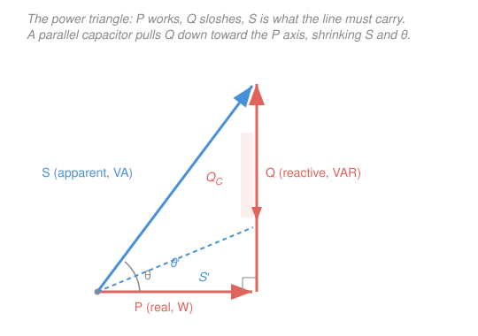

# Circuit Analysis · Lesson 4.3: AC power — real, reactive, apparent, and power factor

> ⏱ ~15 min · Module 4: Sinusoidal steady state and AC power · Builds on: [4.2 Impedance and phasor analysis](04-02-impedance-phasor-analysis.md), [4.1 Sinusoids and phasors](04-01-sinusoids-and-phasors.md) · Unlocks: [`power-systems`](../../power-systems/syllabus.md), [`electronics`](../../electronics/syllabus.md)

## Why this matters

Your electric bill is charged for **real power** — the watts that actually heat, spin, and light things. But the wires, transformers, and generators feeding you have to carry *more* current than those watts alone demand, because motors and other inductive loads pull current that surges in and does no net work. The utility hates this: it means fatter cables and bigger generators for the same useful output. So they measure your **power factor** and, if it's bad, either charge you a penalty or make you fix it — with a single well-chosen capacitor. This lesson is where "what does the circuit do" finally becomes "what does it *cost*," and it closes the course.

## The idea

In a purely resistive circuit, power is simple: voltage and current rise and fall together, so $p = vi$ is always positive — energy flows one way, from source to resistor, and turns into heat. Nothing comes back.

Add an inductor or capacitor and something new happens. These elements **store** energy (in a magnetic field or an electric field) and then **give it back**. Over each cycle, current runs a bit ahead of or behind the voltage, so for part of the cycle $p = vi$ is *negative* — the element is shoving energy back toward the source. Averaged over a full cycle that back-and-forth nets to **zero work**, but while it's sloshing it still occupies the wires with real current.

So AC power splits cleanly in two:

- **Real power $P$** — the part that gets used up (heat, torque, light). The average of $p(t)$. Measured in watts.
- **Reactive power $Q$** — the part that just sloshes in and out of inductors and capacitors, doing no net work but hogging current. Measured in VAR.

The **apparent power $S$** is what a naive "volts times amps" meter reads — the *total* burden on the line — and it's the hypotenuse of these two. The **power factor** tells you what fraction of that burden is actually working.

Here's the beautiful part, and the whole reason for this lesson: an inductor's sloshing and a capacitor's sloshing are **exactly out of phase**. When the inductor is dumping energy back, a capacitor is hungry to absorb it, and vice versa. So you can bolt a capacitor across an inductive load and let the two trade energy *locally* — off the utility's wires entirely. The reactive current stops traveling all the way back to the generator. That's **power-factor correction**.

## The formal version

Take a load driven at angular frequency $\omega$ (rad/s), with voltage and current

$$v(t) = V_m\cos(\omega t), \qquad i(t) = I_m\cos(\omega t - \theta),$$

where $V_m, I_m$ are the peak amplitudes (volts, amps) and $\theta$ is the phase by which the current *lags* the voltage — exactly the angle of the load impedance $Z = |Z|\angle\theta$ from [4.2](04-02-impedance-phasor-analysis.md).

**RMS values.** Because the useful measure of a sinusoid is its heating effect, not its peak, we use the **root-mean-square** value. For any sinusoid,

$$V_{rms} = \frac{V_m}{\sqrt2}, \qquad I_{rms} = \frac{I_m}{\sqrt2}.$$

*In words: the RMS value is the DC voltage that would deliver the same average power to a resistor.* (It comes from averaging $\cos^2$, whose mean is $\tfrac12$; hence the $\sqrt2$.) A 120 V wall outlet is 120 V **rms** — its peak is $120\sqrt2 \approx 170$ V.

**Instantaneous power** is just the product moment by moment:

$$p(t) = v(t)\,i(t) = V_m I_m\cos(\omega t)\cos(\omega t - \theta).$$

Apply the identity $\cos A\cos B = \tfrac12[\cos(A-B) + \cos(A+B)]$:

$$p(t) = \underbrace{V_{rms}I_{rms}\cos\theta}_{\text{constant — real power}} \;+\; \underbrace{V_{rms}I_{rms}\cos(2\omega t - \theta)}_{\text{oscillates at }2\omega\text{, averages to }0}.$$

*In words: instantaneous power is a steady piece plus a piece that wobbles at twice the line frequency and cancels itself out over a cycle.* The steady piece is the **real (average) power**:

$$\boxed{\,P = V_{rms}I_{rms}\cos\theta\,} \qquad (\text{watts, W}).$$

The wobble carries the reactive sloshing. Its amplitude is the **reactive power**:

$$\boxed{\,Q = V_{rms}I_{rms}\sin\theta\,} \qquad (\text{volt-amperes reactive, VAR}).$$

*In words: $P$ is the average power actually consumed; $Q$ measures how much energy swings in and out of the load's fields each cycle without being consumed.* By convention $Q > 0$ for an **inductive** load (current lags, $\theta > 0$) and $Q < 0$ for a **capacitive** one (current leads, $\theta < 0$).

The **apparent power** is the plain product of RMS magnitudes:

$$\boxed{\,S = V_{rms}I_{rms}\,} \qquad (\text{volt-amperes, VA}).$$

These three combine into **complex power**, which packages both parts as one phasor:

$$\mathbf{S} = \tfrac12\,\mathbf{V}\,\mathbf{I}^{*} = V_{rms}I_{rms}\angle\theta = P + jQ, \qquad |\mathbf{S}| = S = \sqrt{P^2 + Q^2}.$$

*In words: multiply the voltage phasor by the conjugate of the current phasor; the real part is watts, the imaginary part is VAR.* (The conjugate $\mathbf{I}^{*}$ flips the current's angle, so the product's angle is $\theta$, the voltage-minus-current phase.) These three quantities form the **power triangle** — $P$ along the base, $Q$ vertical, $S$ the hypotenuse, angle $\theta$ at the corner.

The **power factor** is what fraction of the apparent power is real:

$$\boxed{\,\text{pf} = \cos\theta = \frac{P}{S}\,}, \qquad 0 \le \text{pf} \le 1.$$

*In words: power factor is the cosine of the impedance angle — the efficiency with which the line current is turned into useful power.* Since $\cos\theta$ is the same for $\pm\theta$, you must say **lagging** (inductive, current behind voltage) or **leading** (capacitive, current ahead) to pin it down. pf $= 1$ is a pure resistor: all real, no slosh.

Two identities make the arithmetic fall out fast — for a load carrying line current $I_{rms}$ with reactance $X$ and resistance $R$:

$$P = I_{rms}^2\,R, \qquad Q = I_{rms}^2\,X, \qquad S = I_{rms}^2\,|Z|.$$

*In words: the real power lands in the resistance, the reactive power lands in the reactance — same current through both, split by which part of the impedance it flows in.*

## Picture

## Worked examples

**Example 1 — reading the whole triangle off one load.** A load is a series $R = 30\,\Omega$ and inductive reactance $X_L = 40\,\Omega$, carrying line current $I_{rms} = \sqrt2\,\text{A}$. Find $P$, $Q$, $S$, and the power factor.

First the impedance, from [4.2](04-02-impedance-phasor-analysis.md):

$$Z = R + jX_L = 30 + j40 = 50\angle 53.13^\circ\,\Omega, \qquad |Z| = \sqrt{30^2 + 40^2} = 50\,\Omega, \quad \theta = \arctan\tfrac{40}{30} = 53.13^\circ.$$

The impedance angle *is* the phase between voltage and current, so use $\theta = 53.13^\circ$ (so $\cos\theta = 0.6$, $\sin\theta = 0.8$). Now use the current-squared identities — cleanest when you know $I_{rms}$:

$$P = I_{rms}^2 R = (\sqrt2)^2(30) = 2\times 30 = 60\,\text{W},$$
$$Q = I_{rms}^2 X_L = (\sqrt2)^2(40) = 2\times 40 = 80\,\text{VAR},$$
$$S = I_{rms}^2 |Z| = 2\times 50 = 100\,\text{VA}.$$

Power factor:

$$\text{pf} = \cos\theta = 0.6\ \text{lagging} \qquad(\text{lagging because the load is inductive}).$$

**Cross-check three ways.** (1) $S = \sqrt{P^2 + Q^2} = \sqrt{60^2 + 80^2} = \sqrt{10000} = 100\,\text{VA}$ ✓ — a 6-8-10 triangle. (2) $\text{pf} = P/S = 60/100 = 0.6$ ✓. (3) Via RMS voltage: $V_{rms} = I_{rms}|Z| = \sqrt2\cdot 50 = 70.7\,\text{V}$, so $P = V_{rms}I_{rms}\cos\theta = 70.7\times\sqrt2\times 0.6 = 60\,\text{W}$ ✓. Every road leads to the same triangle.

**Example 2 — fixing the power factor with one capacitor.** Keep that same load, and say it's fed from the source $v(t) = 100\cos(1000t)\,\text{V}$, so $V_{rms} = 100/\sqrt2 \approx 70.7\,\text{V}$ and $\omega = 1000\,\text{rad/s}$. It draws $P = 60\,\text{W}$ at pf $= 0.6$ lagging, i.e. $Q = 80\,\text{VAR}$ of inductive slosh. Add a capacitor **in parallel** with the load to raise the power factor to $0.95$. Find the capacitance, and show the line current drops.

Adding a parallel element doesn't change the voltage across the load, so **$P$ stays fixed at 60 W** — we only reshape $Q$. Work along the power triangle:

- **Now:** $\theta_1 = \arccos(0.6) = 53.13^\circ$, and $Q_1 = P\tan\theta_1 = 60\times\tfrac{80}{60} = 80\,\text{VAR}$.
- **Target:** $\theta_2 = \arccos(0.95) = 18.19^\circ$, so the load-plus-cap should present $Q_2 = P\tan\theta_2 = 60\times\tan(18.19^\circ) = 60\times 0.329 = 19.7\,\text{VAR}$.

A capacitor supplies **negative** reactive power, so it must cancel the difference:

$$Q_C = Q_1 - Q_2 = 80 - 19.7 = 60.3\,\text{VAR}.$$

A capacitor across voltage $V_{rms}$ delivers $Q_C = V_{rms}^2/X_C = V_{rms}^2\,\omega C$. Solve for $C$:

$$C = \frac{Q_C}{\omega\,V_{rms}^2} = \frac{60.3}{(1000)(70.7^2)} = \frac{60.3}{(1000)(5000)} = 1.21\times 10^{-5}\,\text{F} \approx 12.1\,\mu\text{F}.$$

**Did the current drop?** The new apparent power is $S_2 = P/\text{pf}_2 = 60/0.95 = 63.2\,\text{VA}$, versus the old $S_1 = 100\,\text{VA}$. Since $I_{rms} = S/V_{rms}$ at fixed voltage,

$$I_{\text{new}} = \frac{S_2}{V_{rms}} = \frac{63.2}{70.7} = 0.89\,\text{A} \quad\text{vs.}\quad I_{\text{old}} = \frac{S_1}{V_{rms}} = \frac{100}{70.7} = 1.41\,\text{A}.$$

The line current falls from $1.41\,\text{A}$ to $0.89\,\text{A}$ — a **37% cut** — while the load still gets its full 60 W. Same work, thinner wire. That single capacitor is why the power grid runs on economics as much as physics.

## Watch out

- **You might think reactive power is "lost" or "wasted."** It isn't consumed at all — over a full cycle its net energy transfer is exactly zero. Its cost is indirect: the current that carries it still heats the *transmission* wires ($I^2R$ line loss) and forces the utility to oversize everything. You pay for the traffic, not the destination.
- **You might add the apparent powers of two loads to get the total.** Never add $S$ (or currents) arithmetically — they're phasors at different angles. Add $P$'s and add $Q$'s separately, *then* recombine: $S_{\text{total}} = \sqrt{(\sum P)^2 + (\sum Q)^2}$. This is exactly why correction works: the cap's $Q_C$ subtracts from the load's $Q$ before the hypotenuse is taken.
- **You might correct a lagging load with an inductor, or over-correct with too big a capacitor.** An inductive load needs a *capacitor* (opposite sign of $Q$). And overshooting past unity swings you to a *leading* pf, which is just as far from 1 on the other side — the current climbs again. The target is to land near pf $= 1$, not blow past it.

## One-liner

> Real power $P$ does the work, reactive power $Q$ just sloshes in the fields, apparent power $S=\sqrt{P^2+Q^2}$ is what the wires must carry — and a parallel capacitor pays off an inductive load's $Q$ locally so the line stops hauling it.

## Problems

**P1 (🟢)** A load draws $I_{rms} = 5\,\text{A}$ from a $120\,\text{V}$ rms line at a power factor of $0.8$ lagging. Find the apparent power $S$, the real power $P$, and the reactive power $Q$.

**P2 (🟡)** A factory motor draws apparent power $S = 1000\,\text{VA}$ at pf $= 0.8$ lagging from a $200\,\text{V}$ rms, $60\,\text{Hz}$ supply (so $\omega = 2\pi\cdot 60 = 377\,\text{rad/s}$). (a) Find its $P$ and $Q$. (b) Size a parallel capacitor to bring the *overall* power factor to unity, and find the new line current.

**P3 (🔴, optional — a bridge to power systems)** A $10\,\text{kW}$ load runs at $480\,\text{V}$ rms. Compare the line current, and the $I^2R$ loss in the feeder wires, when the load operates at pf $= 0.70$ versus after correction to pf $= 0.95$. By what fraction do the feeder losses drop? (This is the utility's whole motivation for correction.)

Solutions

**P1** Apparent power is just the RMS product:

$$S = V_{rms}I_{rms} = 120\times 5 = 600\,\text{VA}.$$

Real power scales by the power factor; reactive by $\sin\theta$. With $\cos\theta = 0.8$, $\sin\theta = \sqrt{1 - 0.8^2} = 0.6$:

$$P = S\cos\theta = 600\times 0.8 = 480\,\text{W}, \qquad Q = S\sin\theta = 600\times 0.6 = 360\,\text{VAR (lagging)}.$$

*Check.* $\sqrt{P^2 + Q^2} = \sqrt{480^2 + 360^2} = \sqrt{230400 + 129600} = \sqrt{360000} = 600 = S$ ✓ — a scaled 3-4-5 triangle.

**P2** (a) With $\cos\theta = 0.8$, $\sin\theta = 0.6$:

$$P = S\cos\theta = 1000\times 0.8 = 800\,\text{W}, \qquad Q = S\sin\theta = 1000\times 0.6 = 600\,\text{VAR (lagging)}.$$

(b) Unity pf means the capacitor must cancel *all* of the load's reactive power: $Q_C = 600\,\text{VAR}$. From $Q_C = V_{rms}^2\,\omega C$:

$$C = \frac{Q_C}{\omega V_{rms}^2} = \frac{600}{(377)(200^2)} = \frac{600}{(377)(40000)} = \frac{600}{1.508\times 10^7} = 3.98\times 10^{-5}\,\text{F} \approx 39.8\,\mu\text{F}.$$

At unity pf, $S_{\text{new}} = P = 800\,\text{VA}$, so the new line current is

$$I_{\text{new}} = \frac{S_{\text{new}}}{V_{rms}} = \frac{800}{200} = 4\,\text{A}, \qquad\text{down from}\qquad I_{\text{old}} = \frac{1000}{200} = 5\,\text{A}.$$

*Check.* The motor still gets its 800 W; only the reactive current went away, trimming the line from $5\,\text{A}$ to $4\,\text{A}$ (a 20% reduction). ✓

**P3** At fixed voltage and real power, line current is $I = P/(V_{rms}\cdot\text{pf})$, so it scales as $1/\text{pf}$:

$$I_{0.70} = \frac{10000}{480\times 0.70} = 29.8\,\text{A}, \qquad I_{0.95} = \frac{10000}{480\times 0.95} = 21.9\,\text{A}.$$

Feeder loss is $I^2 R_{\text{line}}$ with the *same* wire $R_{\text{line}}$ both times, so the loss ratio is the current ratio squared:

$$\frac{\text{loss}_{0.70}}{\text{loss}_{0.95}} = \left(\frac{I_{0.70}}{I_{0.95}}\right)^2 = \left(\frac{0.95}{0.70}\right)^2 = (1.357)^2 = 1.84.$$

So correcting to $0.95$ cuts feeder losses to $1/1.84 = 0.543$ of their old value — a drop of about **46%**.

*Check.* Losses fall with the *square* of current, so even a modest current reduction (from 29.8 to 21.9 A, about 26%) nearly halves the wasted heat. This — not the load's own consumption — is why utilities demand good power factor. ✓

## Flashback

**From Lesson 4.2 (Impedance and phasor analysis):** A source $v(t) = 50\cos(2000t)\,\text{V}$ drives a series combination of $R = 60\,\Omega$ and a capacitor with $C = 6.25\,\mu\text{F}$. Find the impedance $Z$ in polar form and the steady-state current $i(t)$. Does the current lead or lag?

Solution

The capacitor's reactance is $X_C = \dfrac{1}{\omega C} = \dfrac{1}{(2000)(6.25\times 10^{-6})} = \dfrac{1}{0.0125} = 80\,\Omega$, and a capacitor's impedance is $-jX_C$:

$$Z = R - jX_C = 60 - j80\,\Omega = \sqrt{60^2 + 80^2}\;\angle\!\arctan\!\tfrac{-80}{60} = 100\angle{-}53.13^\circ\,\Omega.$$

With the source phasor $\mathbf{V} = 50\angle 0^\circ\,\text{V}$, complex Ohm's law gives

$$\mathbf{I} = \frac{\mathbf{V}}{Z} = \frac{50\angle 0^\circ}{100\angle{-}53.13^\circ} = 0.5\angle 53.13^\circ\,\text{A} \quad\Longrightarrow\quad i(t) = 0.5\cos(2000t + 53.13^\circ)\,\text{A}.$$

The current phase is $+53.13^\circ$ while the voltage is at $0^\circ$, so the current **leads** the voltage — as it must for a capacitive load. (This is exactly the leading power factor of the lesson: here pf $= \cos(53.13^\circ) = 0.6$ leading.)

*Check.* $|I| = |V|/|Z| = 50/100 = 0.5\,\text{A}$ ✓, and the angle is $0^\circ - (-53.13^\circ) = +53.13^\circ$ ✓.

## Connections

- **Backward:** the phase angle $\theta$ driving everything here is precisely the impedance angle of $Z = R + jX$ from [4.2](04-02-impedance-phasor-analysis.md), computed from the phasors of [4.1](04-01-sinusoids-and-phasors.md). And the energy that sloshes as $Q$ is the $\tfrac12 Li^2$ and $\tfrac12 Cv^2$ field energy you first met in [3.1](03-01-capacitors-and-inductors.md) — reactive power is just that stored energy breathing in and out at $2\omega$.
- **Forward:** [`power-systems`](../../power-systems/syllabus.md) scales this up to three-phase grids, transformers, and transmission where power-factor correction and VAR management are daily engineering; [`electronics`](../../electronics/syllabus.md) takes the same phasor/impedance machinery into amplifiers and filters where you care about power delivered to a load.
- **Sideways (mechanics):** reactive power's endless trade between magnetic ($L$) and electric ($C$) fields is the *same* bookkeeping as the kinetic-vs-potential energy swap in [simple harmonic motion](../../mechanics-refresher/lessons/03-01-simple-harmonic-motion.md) — energy conserved, sloshing between two stores, net-zero over a cycle. The complex-power algebra $\mathbf{S} = \tfrac12\mathbf{V}\mathbf{I}^*$ is the same conjugate-product move that computes signal power throughout complex analysis and signals-and-systems.
