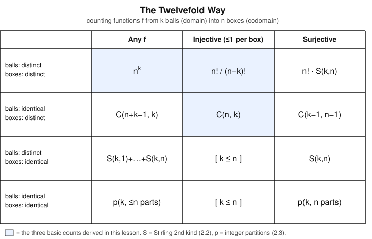

# Enumerative & Algebraic Combinatorics · Lesson 1.1: The four rules & the twelvefold way

> ⏱ ~15 min · Module 1: Counting foundations & inclusion–exclusion · Builds on: nothing (course start) · Unlocks: [Lesson 1.2](01-02-binomial-multinomial-coefficients.md) (binomial & multinomial coefficients)

## Why this matters

"How many?" is the first question of probability (a probability is a count over a count), of statistical physics (entropy is the *logarithm* of a count of microstates), and of algorithm analysis (how many operations?). This whole course is a campaign to answer it without re-inventing a clever trick each time. Two ideas do almost all the work: four combining rules that decompose any count into pieces you can already do, and a single 3×4 chart — the *twelvefold way* — that tells you which of a dozen standard formulas a "put things in slots" problem needs. That chart is not an accident of math: its rows are literally the three quantum statistics (Maxwell–Boltzmann, Bose–Einstein, Fermi–Dirac), which differ only in whether the particles are distinguishable and whether two may share a state.

## The idea

Counting a big set directly is hopeless; counting it *by construction* is easy. Every count in this course is assembled from four moves:

- **Sum** — if your objects split into non-overlapping *cases*, count each case and add. ("Red things or blue things.")
- **Product** — if building an object means making a *sequence of independent choices*, multiply the number of options at each stage. ("Pick a shirt, then a hat.")
- **Bijection** — if you can pair your objects one-to-one with those of an easier set, the two sets have the same size. Count the easy one instead.
- **Division** — if you accidentally counted every object the *same* number of times $d$ (a "$d$-to-1" overcount from some symmetry), divide by $d$.

The first two are the "and/or" of counting: product is *and* (this **and** then that), sum is *or* (this case **or** that case). The last two are the subtle ones — bijection lets you *change the problem*, and division is how "unordered" counts are born from "ordered" ones.

From just these, three counts appear so often they get names. Selecting $k$ items from $n$ distinct options:

- if order matters and repeats are allowed: $n^k$ (product rule, $k$ free choices);
- if order matters and repeats are banned: $n(n-1)\cdots(n-k+1)$ (product rule with shrinking options);
- if order does *not* matter and repeats are banned: $\binom{n}{k}$ (take the previous count, then divide out the $k!$ orderings you overcounted).

## The formal version

**Sum rule.** If $A_1,\dots,A_m$ are pairwise disjoint finite sets, then
$$\bigl|A_1 \cup \cdots \cup A_m\bigr| = |A_1| + \cdots + |A_m|.$$
*In words:* split into cases that can't overlap, and add. (When they *can* overlap, you need inclusion–exclusion — [Lesson 1.3](01-03-inclusion-exclusion.md).)

**Product rule.** For finite sets, $|A_1 \times \cdots \times A_k| = |A_1|\cdot |A_2| \cdots |A_k|$. More usefully: if an object is built by $k$ successive choices where step $i$ always has $n_i$ options *regardless of earlier choices*, the number of objects is $n_1 n_2 \cdots n_k$.
*In words:* independent choices multiply.

**Bijection principle.** If there exists a bijection $f\colon A \to B$ between finite sets, then $|A| = |B|$.
*In words:* a perfect matching between two sets proves they're the same size — so replace a hard set with an easy one it matches. (This is the engine of Module 4.)

**Division principle.** If $f\colon A \to B$ is a surjection that is exactly **$d$-to-1** (every element of $B$ has precisely $d$ preimages), then $|A| = d\,|B|$, so $|B| = |A|/d$.
*In words:* if you counted each thing $d$ times over, divide by $d$ — but only when the overcount is the *same* $d$ everywhere.

**The three basic counts.** Fix a set of $n$ distinct symbols and select $k$ of them.

- **Sequences (order matters, repeats allowed):** $k$ independent choices of $n$ options each, so by the product rule there are $n^k$.
- **Injective sequences / arrangements (order matters, no repeats):** the first choice has $n$ options, the next $n-1$, down to $n-k+1$, giving the **falling factorial**
$$n^{\underline{k}} := n(n-1)\cdots(n-k+1) = \frac{n!}{(n-k)!}.$$
*In words:* $n^{\underline k}$ is "$n$ things, $k$ slots, no reuse."
- **Subsets (order doesn't matter, no repeats):** every $k$-element subset can be written as an arrangement in exactly $k!$ orders, so the map {arrangements} $\to$ {subsets} is $k!$-to-1. By the division principle,
$$\binom{n}{k} = \frac{n^{\underline k}}{k!} = \frac{n!}{k!\,(n-k)!}.$$
*In words:* the binomial coefficient is the arrangement count with the ordering overcount divided out.

**The twelvefold way.** Package "put things in slots" as a **function** $f$ from a set of $k$ **balls** (the domain) to a set of $n$ **boxes** (the codomain): $f(\text{ball}) = $ its box. Then two binary switches and one three-way switch classify the problem:

- are the **balls** distinguishable or identical?
- are the **boxes** distinguishable or identical?
- is $f$ **arbitrary**, **injective** (at most one ball per box), or **surjective** (no box empty)?

That is $2 \times 2 \times 3 = 12$ cells — each a standard formula. Three of them are exactly the basic counts above: distinguishable-into-distinguishable arbitrary is $n^k$, the injective version is $n^{\underline k}$, and identical-balls-into-distinguishable-boxes injective is $\binom{n}{k}$ (choosing *which* $k$ boxes are occupied).

## Picture

Read the table as a decision: pick the row (are the balls / boxes distinct?) and the column (any / injective / surjective), and the cell is your formula. The shaded cells are the three you can already derive; the rest are named now and *earned* later — $S(k,n)$ (Stirling numbers of the second kind, [Lesson 2.2](02-02-set-partitions-stirling-bell.md)), the multiset count $\binom{n+k-1}{k}$ via stars-and-bars ([Lesson 1.2](01-02-binomial-multinomial-coefficients.md)), and $p(k,\dots)$ (integer partitions, [Lesson 2.3](02-03-integer-partitions-ferrers.md)). The whole first half of the course is, in a sense, the project of filling in this table.

## Worked examples

**Example 1 (all four rules on one problem).** How many 3-letter strings over the 26-letter alphabet have *no repeated letter*? And how many 3-letter *sets*?

By the product rule with shrinking options, the arrangements number $26 \cdot 25 \cdot 24 = 26^{\underline 3} = 15{,}600$. Each unordered 3-letter *set* $\{a,b,c\}$ corresponds to exactly $3! = 6$ of these strings (its orderings), so the string-to-set map is $6$-to-1; by the division principle the number of sets is $15{,}600 / 6 = 2{,}600 = \binom{26}{3}$. Now suppose we also want strings that are *either* all-distinct *or* all-the-same-letter: those two cases are disjoint, so by the sum rule add $15{,}600 + 26 = 15{,}626$. Product, division, and sum — and the bijection was hiding in "each set matches its $3!$ orderings."

**Example 2 (why the twelvefold way earns its keep — three physics counts).** Put $k$ particles into $n$ energy states. Physics gives three answers, and they are three cells of the chart:

- **Maxwell–Boltzmann** (classical, distinguishable particles, any occupancy): distinguishable balls into distinguishable boxes, arbitrary $f$ — that's $n^k$.
- **Fermi–Dirac** (electrons; the Pauli exclusion principle forbids two particles in one state): identical balls, distinguishable boxes, *injective* — that's $\binom{n}{k}$, the number of ways to choose which $k$ states are occupied.
- **Bose–Einstein** (photons; identical particles, any number per state): identical balls, distinguishable boxes, arbitrary — that's the multiset count $\binom{n+k-1}{k}$ (Lesson 1.2).

Same chart, three rows of physics. Recognizing *which cell* a problem sits in is 80% of counting it.

## Watch out

- You might think you divide by $k!$ whenever a count feels "unordered" — but the division principle applies **only when every object is overcounted by the *same* factor**. If some arrangements have internal symmetry (repeated letters, a palindrome) they're overcounted *less*, and naive division is wrong. Uneven overcounting is exactly what inclusion–exclusion ([Lesson 1.3](01-03-inclusion-exclusion.md)) exists to fix.
- You might think "balls in boxes" and "functions" are different problems — they're the same problem: a ball is a domain element, its box is its image. Then "no box holds two balls" *is* injective, and "no box is empty" *is* surjective. When you're stuck, translate the words into which set is the balls (domain) and which is the boxes (codomain).
- You might think order "obviously" does or doesn't matter — but it's a modeling choice you must make explicit. A podium (gold/silver/bronze) is ordered; a committee of three is not. The only difference between $n^{\underline k}$ and $\binom nk$ is whether swapping two chosen elements yields a genuinely different object.

## One-liner

> Every count is four rules in disguise — add disjoint cases, multiply independent choices, match to a known set, divide out symmetry — and a balls-in-boxes problem is pinned down by two questions: does order matter, and can you repeat?

## Problems

**P1 (🟢)** Eight sprinters run a final. (a) How many possible gold/silver/bronze podiums are there (all runners distinct, order matters)? (b) How many ways to pick a set of 3 *finalists* to advance, order irrelevant? (c) Your two answers differ by a factor — name it and explain it in one sentence using the division principle.

**P2 (🟡)** Show that the number of ways to split $2n$ distinguishable people into $n$ *unordered* pairs is $\dfrac{(2n)!}{2^n\, n!}$. (Start by lining everyone up, then identify what you overcounted and by how much.)

**P3 (🔴)** The distinguishable-into-distinguishable *surjective* cell of the twelvefold way is $n!\,S(k,n)$, where $S(k,n)$ is the number of ways to partition a $k$-element set into $n$ **nonempty, unlabeled** blocks. Prove this formula. (Hint: a surjection $f\colon \{k \text{ balls}\} \to \{n \text{ boxes}\}$ determines its *fibers* $f^{-1}(\text{box})$; use the product principle on "choose the partition, then label the blocks.")

Solutions

**P1** (a) Product rule with shrinking options: $8 \cdot 7 \cdot 6 = 336 = 8^{\underline 3} = 8!/5!$. (b) $\binom{8}{3} = \frac{8\cdot 7\cdot 6}{3!} = \frac{336}{6} = 56$. (c) The factor is $3! = 6$. Each unordered trio of finalists corresponds to exactly $3! = 6$ ordered podiums (its arrangements), so the podium-to-trio map is $6$-to-1 and the division principle gives $336/6 = 56$. $\blacksquare$

**P2** Line all $2n$ people up in a row: $(2n)!$ orders. Read off a pairing by pairing positions $(1,2),(3,4),\dots,(2n-1,2n)$. This produces a valid unordered pairing, but it overcounts. Two independent symmetries leave the *same* pairing:
- inside each of the $n$ pairs, the two people can appear in either order — a factor of $2$ per pair, so $2^n$ in total;
- the $n$ pairs themselves can be listed in any order — a factor of $n!$.

These choices are independent, so by the product rule each unordered pairing arises from exactly $2^n \cdot n!$ of the $(2n)!$ line-ups; the overcount is uniform. By the division principle the number of pairings is $\dfrac{(2n)!}{2^n\, n!}$. (Sanity check $n=2$: $\frac{4!}{2^2\cdot 2!} = \frac{24}{8} = 3$, and indeed $\{ab,cd\},\{ac,bd\},\{ad,bc\}$ are the only three pairings of 4 people.) $\blacksquare$

**P3** Let $f\colon B \to X$ be a surjection from the $k$-ball set $B$ onto the $n$-box set $X$. Its **fibers** $f^{-1}(x) = \{\,b \in B : f(b) = x\,\}$ for $x \in X$ are pairwise disjoint (each ball maps to one box), their union is all of $B$, and each is *nonempty* precisely because $f$ is surjective. So the fibers form a partition of $B$ into exactly $n$ nonempty blocks, *together with* a labeling that says which block goes to which box.

Now count such labeled objects by the product rule, in two independent stages:
1. Choose the underlying unlabeled partition of $B$ into $n$ nonempty blocks: $S(k,n)$ ways, by definition.
2. Assign the $n$ blocks bijectively to the $n$ distinct boxes: this is an arrangement of $n$ blocks into $n$ boxes with no reuse, i.e. $n^{\underline n} = n!$ ways.

Every surjection yields exactly one (partition, labeling) pair, and every such pair reconstructs exactly one surjection (send each ball to the box its block was assigned) — a bijection. Hence the number of surjections is $S(k,n)\cdot n! = n!\,S(k,n)$. $\blacksquare$
*(Edge check: if $n > k$ no surjection exists, and indeed $S(k,n)=0$ — you can't split $k$ elements into more than $k$ nonempty blocks.)*

## Connections

- **Forward:** [Lesson 1.2](01-02-binomial-multinomial-coefficients.md) develops $\binom{n}{k}$ into a full algebra — Pascal's rule, the binomial theorem, and stars-and-bars, which fills in the multiset cell $\binom{n+k-1}{k}$ of the chart above.
- **Forward:** the unshaded cells are the spine of Module 2: Stirling numbers $S(k,n)$ (set partitions, [Lesson 2.2](02-02-set-partitions-stirling-bell.md)) and integer partitions $p(k,\dots)$ ([Lesson 2.3](02-03-integer-partitions-ferrers.md)). P3 is your first Stirling encounter; [Lesson 1.3](01-03-inclusion-exclusion.md) will re-derive $n!\,S(k,n)$ a second way, by sieving out the empty boxes.
- **Sideways (probability):** in [probability-theory](../../probability-theory/syllabus.md), a finite equiprobable sample space makes every probability a ratio of two of these counts — the division principle wearing a different hat.
- **Sideways (physics):** the three rows of the twelvefold way with distinguishable boxes are Maxwell–Boltzmann, Bose–Einstein, and Fermi–Dirac statistics; distinguishability of particles and the exclusion principle are precisely the balls-identical and injective switches.
