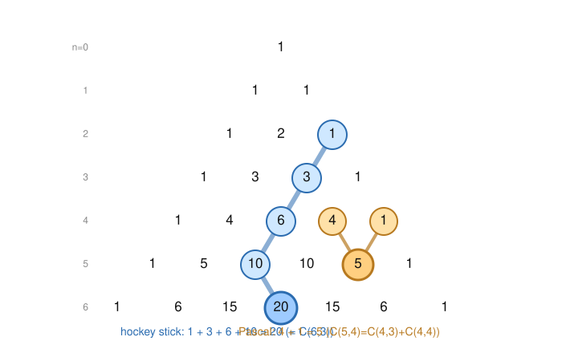

# Enumerative & Algebraic Combinatorics · Lesson 1.2: Binomial & multinomial coefficients

> ⏱ ~15 min · Module 1: Counting foundations & inclusion–exclusion · Builds on: [Lesson 1.1](01-01-four-rules-twelvefold-way.md) · Unlocks: [Lesson 1.3](01-03-inclusion-exclusion.md)

## Why this matters

$\binom{n}{k}$ is the single most reused number in this course — it counts subsets, appears in the binomial theorem, seeds Pascal's triangle, and reappears disguised in probability (the binomial and hypergeometric distributions), in physics (how indistinguishable bosons fill energy levels), and in algebra (coefficients of $(1+x)^n$). But the real skill this lesson trains isn't computing it — it's **proving an identity three different ways**: by pushing factorials around (algebra), by counting one set two ways (double counting), and by peeling off one element (Pascal's recurrence). A course grader wants all three in your toolkit, because each exposes a different reason the identity is *true*.

## The idea

$\binom{n}{k}$ — read "$n$ choose $k$" — is the number of ways to pick a $k$-element subset from $n$ objects, order irrelevant. That's the *definition worth carrying in your head*; the factorial formula is just one way to compute it.

Three lenses, and you should learn to switch between them at will:

- **Algebra.** Treat $\binom{n}{k}=\frac{n!}{k!(n-k)!}$ as a symbol and manipulate factorials. Fast, mechanical, but tells you nothing about *why*.
- **Double counting.** Count one carefully chosen set in two ways; the two answers must agree. Reveals the combinatorial meaning.
- **Pascal's recurrence.** Ask a single yes/no question about one distinguished element ("is element $n$ in my subset?"), split the count accordingly, and induct. This is the engine behind Pascal's triangle.

Everything below is these three lenses aimed at one target after another.

## The formal version

**Definition (binomial coefficient).** For integers $0 \le k \le n$,
$$\binom{n}{k} = \frac{n!}{k!\,(n-k)!},$$
the number of $k$-element subsets of an $n$-element set. By convention $\binom{n}{k}=0$ when $k<0$ or $k>n$, and $\binom{n}{0}=\binom{n}{n}=1$.

*In words:* $\binom{n}{k}$ counts unordered selections of $k$ items from $n$.

**Symmetry.** $\binom{n}{k}=\binom{n}{n-k}$. *Double-count proof:* choosing the $k$ elements you keep is the same act as choosing the $n-k$ you discard, so the two selections are in bijection.

**Pascal's rule.** For $0 < k < n$,
$$\binom{n}{k}=\binom{n-1}{k-1}+\binom{n-1}{k}.$$
*In words:* a size-$k$ subset either uses the last element or it doesn't. *Combinatorial proof:* fix the distinguished element $n$. Among the $\binom{n}{k}$ subsets of size $k$, those that **contain** $n$ are built by choosing the other $k-1$ members from $\{1,\dots,n-1\}$ — there are $\binom{n-1}{k-1}$ of them. Those that **omit** $n$ choose all $k$ members from $\{1,\dots,n-1\}$ — $\binom{n-1}{k}$ of them. Every subset is in exactly one group, so the sum rule gives the identity. $\blacksquare$

**Binomial theorem.** For $n\ge 0$,
$$(x+y)^n = \sum_{k=0}^{n}\binom{n}{k}\,x^k y^{n-k}.$$
*In words:* expanding the product $(x+y)(x+y)\cdots(x+y)$, the coefficient of $x^k y^{n-k}$ counts the ways to pick "$x$" from exactly $k$ of the $n$ factors — that's $\binom{n}{k}$.

**Vandermonde's identity.**
$$\binom{m+n}{k}=\sum_{j=0}^{k}\binom{m}{j}\binom{n}{k-j}.$$
*In words:* to pick $k$ from a group of $m$ men and $n$ women, split by how many are men. *Double-count proof:* the left side chooses $k$ from all $m+n$ people at once. The right side conditions on choosing $j$ men (in $\binom{m}{j}$ ways) and the remaining $k-j$ women (in $\binom{n}{k-j}$ ways); summing over the possible $j$ recounts the exact same selections. $\blacksquare$

**Hockey-stick identity.** For $0 \le r \le n$,
$$\sum_{i=r}^{n}\binom{i}{r}=\binom{n+1}{r+1}.$$
*In words:* a diagonal run of entries in Pascal's triangle sums to the entry just below the bottom of the run — the "stick," ending in a "blade." (Proof: telescope Pascal's rule; see the Picture and P2.)

**Multinomial coefficient.** For $k_1+\cdots+k_m=n$,
$$\binom{n}{k_1,\dots,k_m}=\frac{n!}{k_1!\,k_2!\cdots k_m!},$$
the number of ways to deal $n$ distinct objects into $m$ labeled bins with bin $i$ receiving exactly $k_i$. The binomial coefficient is the two-bin case: $\binom{n}{k}=\binom{n}{k,\,n-k}$. It generalizes the binomial theorem to $(x_1+\cdots+x_m)^n=\sum \binom{n}{k_1,\dots,k_m}x_1^{k_1}\cdots x_m^{k_m}$.

**Compositions and stars-and-bars.** A **weak composition** of $n$ into $k$ parts is an ordered tuple $(x_1,\dots,x_k)$ of *nonnegative* integers with $x_1+\cdots+x_k=n$. Their count is
$$\binom{n+k-1}{k-1}.$$
*Stars-and-bars proof:* lay down $n$ identical stars in a row and insert $k-1$ bars to cut them into $k$ groups; part $x_i$ is the number of stars in the $i$-th gap. Every arrangement of $n$ stars and $k-1$ bars — there are $\binom{n+k-1}{k-1}$ of them, choosing which of the $n+k-1$ positions hold bars — encodes exactly one weak composition. $\blacksquare$ (Requiring every part $\ge 1$ instead gives a **strong composition**, counted by $\binom{n-1}{k-1}$: put a bar in only the $n-1$ internal gaps.)

### Three proofs of one identity: $\sum_{k=0}^{n}\binom{n}{k}=2^{n}$

Watch the same fact fall to each lens.

- **Algebra.** Set $x=y=1$ in the binomial theorem: $2^n=(1+1)^n=\sum_k \binom{n}{k}1^k 1^{n-k}=\sum_k\binom{n}{k}$.
- **Double counting.** The right side, $2^n$, counts *all* subsets of an $n$-set (each element is independently in or out). The left side counts those same subsets grouped by size $k$. Same set, two tallies. ✓
- **Pascal's recurrence.** Let $f(n)=\sum_k\binom{n}{k}$. Using Pascal's rule on each term, every $\binom{n-1}{j}$ gets counted twice (once as the "$k-1$" neighbor, once as the "$k$" neighbor), so $f(n)=2f(n-1)$; with $f(0)=1$, induction gives $f(n)=2^n$.

None is "the" proof — keep all three, because the next identity might only yield to one of them.

## Picture

Pascal's triangle stacks the coefficients: row $n$ is $\binom{n}{0},\binom{n}{1},\dots,\binom{n}{n}$, and Pascal's rule says **each entry is the sum of the two above it**. The amber cell shows one instance of the rule; the blue diagonal is a hockey stick — a run of entries summing to the highlighted blade below.

## Worked examples

**Example 1 (mechanical — read coefficients off the triangle).** Expand $(x+y)^4$. Row $4$ of the triangle is $1,4,6,4,1$, so the binomial theorem gives
$$(x+y)^4 = x^4 + 4x^3y + 6x^2y^2 + 4xy^3 + y^4.$$
Check one coefficient by hand: the $x^2y^2$ term needs "$x$" from exactly $2$ of the $4$ factors, and $\binom{4}{2}=\frac{4!}{2!2!}=6$. ✓ Setting $x=y=1$ recovers $1+4+6+4+1=16=2^4$, the identity above.

**Example 2 (why you'd care — stars and bars).** How many ways can $10$ identical coins be handed to $4$ children (a child may get none)? This is exactly a weak composition of $10$ into $4$ parts, $x_1+x_2+x_3+x_4=10$ with each $x_i\ge 0$. By stars-and-bars,
$$\binom{10+4-1}{4-1}=\binom{13}{3}=\frac{13\cdot 12\cdot 11}{6}=286.$$
The physics echo: this is the count of ways to place $10$ indistinguishable quanta into $4$ states — Bose–Einstein statistics is stars-and-bars wearing a lab coat. Contrast Lesson 1.1's $\binom{n}{k}$ for *distinct* objects without repetition; here repetition is allowed and the objects are identical, so the "$n+k-1$" bookkeeping is what changes.

## Watch out

- You might think $\binom{n}{k}$ requires the factorial formula to compute — but for small cases Pascal's rule is faster and never overflows: $\binom{6}{3}$ is just the row-6 entry $20$, no $720$ in sight. Reach for factorials only when a symbolic manipulation demands it.
- You might think the sum in Vandermonde runs over "all $j$" — it's automatically finite because $\binom{m}{j}=0$ once $j>m$ and $\binom{n}{k-j}=0$ once $j>k$ or $j<k-n$. The convention "$\binom{n}{k}=0$ outside $0\le k\le n$" is what lets you write clean sums without fussing over limits.
- You might think weak and strong compositions use the same formula — they don't. Weak (parts $\ge 0$) gives $\binom{n+k-1}{k-1}$; strong (parts $\ge 1$) gives $\binom{n-1}{k-1}$. Decide whether empty parts are allowed *before* you reach for a formula.
- You might think $\binom{n}{k_1,\dots,k_m}$ needs $m$ separate choices — it's a single division. Equivalently it *is* a product of binomials, $\binom{n}{k_1}\binom{n-k_1}{k_2}\cdots$, which telescopes to $\frac{n!}{k_1!\cdots k_m!}$; either view is fine.

## One-liner

> $\binom{n}{k}$ counts subsets — and every identity about it can be proved by algebra, by counting one set two ways, or by asking whether the last element is in.

## Problems

**P1 (🟢)** (a) Write out row $7$ of Pascal's triangle using only Pascal's rule applied to row $6$ ($1,6,15,20,15,6,1$). (b) Evaluate $\displaystyle\sum_{k=0}^{7}(-1)^k\binom{7}{k}$ and justify the value in one line using the binomial theorem.

**P2 (🟡)** Prove the hockey-stick identity $\displaystyle\sum_{i=r}^{n}\binom{i}{r}=\binom{n+1}{r+1}$ by telescoping Pascal's rule. (Hint: write $\binom{i}{r}=\binom{i+1}{r+1}-\binom{i}{r+1}$ and sum.)

**P3 (🔴, optional)** Prove $\displaystyle\sum_{k=0}^{n}\binom{n}{k}^2=\binom{2n}{n}$. (Hint: it's Vandermonde in disguise — combine with symmetry $\binom{n}{k}=\binom{n}{n-k}$.)

Solutions

**P1** (a) Each row-7 entry is the sum of the two row-6 entries above it (with an implicit $0$ off each end), i.e. Pascal's rule $\binom{7}{k}=\binom{6}{k-1}+\binom{6}{k}$:
$$1,\ \underbrace{1+6}_{7},\ \underbrace{6+15}_{21},\ \underbrace{15+20}_{35},\ \underbrace{20+15}_{35},\ \underbrace{15+6}_{21},\ \underbrace{6+1}_{7},\ 1.$$
So row $7$ is $1,7,21,35,35,21,7,1$.

(b) $\displaystyle\sum_{k=0}^{7}(-1)^k\binom{7}{k}=(1-1)^7=0.$ This is the binomial theorem with $x=-1,\ y=1$: $\sum_k \binom{7}{k}(-1)^k 1^{7-k}=(-1+1)^7=0$. (Combinatorially: a nonempty set has equally many even- and odd-sized subsets.)

**P2** Using $\binom{i}{r}=\binom{i+1}{r+1}-\binom{i}{r+1}$ (which is Pascal's rule $\binom{i+1}{r+1}=\binom{i}{r}+\binom{i}{r+1}$ rearranged), the sum telescopes:
$$\sum_{i=r}^{n}\binom{i}{r}=\sum_{i=r}^{n}\left[\binom{i+1}{r+1}-\binom{i}{r+1}\right]=\binom{n+1}{r+1}-\binom{r}{r+1}.$$
The last term $\binom{r}{r+1}=0$ (choosing $r+1$ from $r$), leaving $\binom{n+1}{r+1}$. $\blacksquare$ Sanity check against the figure with $r=2,\ n=5$: $1+3+6+10=20=\binom{6}{3}$. ✓

**P3** Start from Vandermonde with $m=n$ and total drawn $k=n$:
$$\binom{2n}{n}=\binom{n+n}{n}=\sum_{j=0}^{n}\binom{n}{j}\binom{n}{n-j}.$$
Now apply symmetry $\binom{n}{n-j}=\binom{n}{j}$ to each term:
$$\binom{2n}{n}=\sum_{j=0}^{n}\binom{n}{j}\binom{n}{j}=\sum_{j=0}^{n}\binom{n}{j}^2. \qquad\blacksquare$$
Combinatorial reading: to choose $n$ people from $n$ men and $n$ women, choose $j$ men and (by symmetry, $n-j$ women $=$) $j$ "kept" women — squaring $\binom{n}{j}$ — then sum over $j$. Check $n=2$: $\binom{2}{0}^2+\binom{2}{1}^2+\binom{2}{2}^2=1+4+1=6=\binom{4}{2}$. ✓

## Connections

- **Backward:** this refines [Lesson 1.1](01-01-four-rules-twelvefold-way.md) — $\binom{n}{k}$ was one cell of the twelvefold way (unordered, no repetition); stars-and-bars fills in the *unordered-with-repetition* cell, and the multinomial handles labeled bins.
- **Forward:** [Lesson 1.3](01-03-inclusion-exclusion.md) uses the alternating sums you met in P1(b) — the sign pattern $(-1)^k\binom{n}{k}$ is the skeleton of inclusion–exclusion, which counts surjections and derangements. Vandermonde and generating functions (Module 3) will re-derive these identities a fourth way, by multiplying series.
- **Sideways (probability):** the binomial theorem is the normalization $\sum_k\binom{n}{k}p^k(1-p)^{n-k}=1$ of the binomial distribution, and Vandermonde's identity is the statement that the hypergeometric probabilities sum to $1$ — see `probability-theory`.
- **Sideways (physics):** stars-and-bars is Bose–Einstein counting — the number of ways indistinguishable particles occupy distinguishable states — so Example 2's coins-to-children count is literally a quantum state count.
