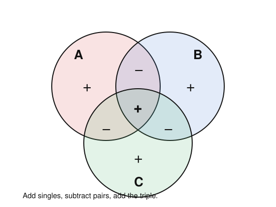

# Enumerative & Algebraic Combinatorics · Lesson 1.3: Inclusion–exclusion

> ⏱ ~15 min · Module 1: Counting foundations & inclusion–exclusion · Builds on: [Lesson 1.2](01-02-binomial-multinomial-coefficients.md) (binomial coefficients & the identity $\sum_j (-1)^j \binom{m}{j}=0$) · Unlocks: Module 2 — [Lesson 2.1](02-01-permutations-cycle-structure.md) (permutations & cycle structure)

## Why this matters

A huge fraction of counting questions are secretly of the form "how many things avoid *all* of these bad properties?" — permutations with no fixed point, functions that hit every output, integers coprime to $n$, sequences dodging a forbidden pattern. Counting the "avoid everything" set directly is a nightmare of cases. Inclusion–exclusion flips it: count the *overlaps* of the bad properties, which are easy, and alternate signs to cancel the overcounting. It's the tool behind derangements (the hat-check problem), Euler's totient $\varphi(n)$ in number theory, and the sieve of Eratosthenes — all one idea.

## The idea

Start with two sets. If you want $|A \cup B|$ and you naively add $|A| + |B|$, you've counted everything in the overlap $A \cap B$ **twice**. Subtract it back once:
$$|A \cup B| = |A| + |B| - |A \cap B|.$$
Three sets: add the three singles, but now every pairwise overlap is double-counted, so subtract all three pairwise intersections — except that gouges the triple overlap $A \cap B \cap C$ too many times (it was added $3$, subtracted $3$, leaving $0$), so add it back once. The pattern is an alternating tug-of-war: **add odds, subtract evens**, each correction fixing the previous over/under-count.

The cleanest way to *think* about it: fix an element $x$ and ask "with what net coefficient did I count $x$?" If $x$ lies in exactly $m \ge 1$ of the sets, the alternating sum hands it coefficient $\binom{m}{0}-\binom{m}{1}+\binom{m}{2}-\cdots = (1-1)^m = 0$ once you include the "$1$" for the whole universe — so every element in at least one set gets counted a net **once**, and elements in none get counted zero times. That single cancellation *is* the theorem.

## The formal version

Let $A_1, \dots, A_n$ be finite sets. For a subset of indices $S \subseteq \{1,\dots,n\}$ write $A_S := \bigcap_{i \in S} A_i$ (with the convention $A_\varnothing = U$, the whole universe).

**Inclusion–exclusion (union form).**
$$\left|\bigcup_{i=1}^n A_i\right| = \sum_{\varnothing \ne S \subseteq [n]} (-1)^{|S|-1}\, |A_S| = \sum_i |A_i| - \sum_{i<j} |A_i \cap A_j| + \sum_{i<j<k}|A_i\cap A_j\cap A_k| - \cdots$$

*In words:* the size of the union is the alternating sum over all nonempty index-subsets — add single sets, subtract pairwise overlaps, add triple overlaps, and so on.

More useful in practice is the **complementary form**. Think of $A_i$ as "objects having bad property $i$." The objects with **none** of the properties are $U \setminus \bigcup A_i$, and moving the union formula to the other side (absorbing the sign into $S=\varnothing$) gives:

**Inclusion–exclusion (sieve / "none of the properties" form).**
$$\Big|\,\overline{A_1} \cap \cdots \cap \overline{A_n}\,\Big| \;=\; \sum_{S \subseteq [n]} (-1)^{|S|}\, |A_S| \;=\; |U| - \sum_i |A_i| + \sum_{i<j}|A_i \cap A_j| - \cdots$$

*In words:* to count objects with none of the bad properties, start from the whole universe and alternately subtract and add the counts of objects forced to have each growing set of properties.

**Proof (indicator / binomial cancellation).** For any object $x \in U$, let $m = m(x)$ be the number of the properties it has, i.e. the number of $A_i$ containing $x$. We show $x$ contributes exactly $\mathbf{1}[m=0]$ to the right side, matching the left. The subsets $S$ with $x \in A_S$ (equivalently $x$ has all properties in $S$) are exactly the subsets of the $m$ indices for which $x \in A_i$; there are $\binom{m}{k}$ of size $k$. So $x$'s total contribution is
$$\sum_{k=0}^{m} (-1)^k \binom{m}{k} = (1-1)^m = \begin{cases} 1 & m = 0,\\ 0 & m \ge 1,\end{cases}$$
by the binomial theorem — precisely the identity $\sum_k (-1)^k\binom{m}{k}=0$ for $m\ge 1$ from [Lesson 1.2](01-02-binomial-multinomial-coefficients.md). Summing over all $x$ gives the sieve form; rearranging gives the union form. $\blacksquare$

## Picture

Each region is labeled with the *net* sign it carries in $|A\cup B\cup C| = |A|+|B|+|C| - |A\cap B| - |A\cap C| - |B\cap C| + |A\cap B\cap C|$. Follow a point in the central triple region: it sits inside all three singles ($+3$), all three pairwise overlaps ($-3$), and the triple ($+1$) — net $+1$, counted exactly once. A point in just $A$ gets $+1$ and nothing else. That's the cancellation made visible.

## Worked examples

**Example 1 (surjections — mechanical).** Count the surjections (onto functions) from an $n$-set to a $k$-set. A function $f:[n]\to[k]$ is surjective iff it misses **no** target value. Let bad property $i$ be "value $i$ is never hit," so $A_i = \{f : i \notin \operatorname{im} f\}$. A function avoiding a fixed set $S$ of $j$ values is just a function into the remaining $k-j$ values, so $|A_S| = (k-j)^n$ depends only on $j = |S|$, and there are $\binom{k}{j}$ such $S$. The sieve form (surjections = functions with none of the "missing" properties) gives
$$\operatorname{Surj}(n,k) = \sum_{j=0}^{k} (-1)^j \binom{k}{j}(k-j)^n.$$
*In words:* all $k^n$ functions, minus those missing at least one value, corrected by inclusion–exclusion. Check the Boss-problem value $n=6, k=3$:
$$\binom{3}{0}3^6 - \binom{3}{1}2^6 + \binom{3}{2}1^6 - \binom{3}{3}0^6 = 729 - 3\cdot 64 + 3\cdot 1 - 0 = 729 - 192 + 3 = 540.\ ✓$$

**Example 2 (derangements — why you'd care).** A *derangement* is a permutation with **no fixed point** — nobody gets their own hat back. Let $A_i = \{\text{permutations fixing } i\}$. Fixing a chosen set of $j$ positions and permuting the rest freely gives $|A_S| = (n-j)!$, again depending only on $j$, with $\binom{n}{j}$ choices of $S$. Derangements have none of the "fixes $i$" properties:
$$!n \;=\; \sum_{j=0}^{n} (-1)^j \binom{n}{j}(n-j)! \;=\; \sum_{j=0}^{n}(-1)^j \frac{n!}{j!} \;=\; n!\sum_{k=0}^{n}\frac{(-1)^k}{k!},$$
using $\binom{n}{j}(n-j)! = \frac{n!}{j!}$. For $n=5$:
$$!5 = 5!\left(1 - 1 + \tfrac12 - \tfrac16 + \tfrac{1}{24} - \tfrac{1}{120}\right) = 120\cdot\tfrac{44}{120} = 44.\ ✓$$
The tail $\sum (-1)^k/k! \to e^{-1}$, so $!n \approx n!/e$: about $37\%$ of all shuffles leave *nothing* in place. Both examples are the same move — a surjection forbids empty target-values, a derangement forbids fixed points; each "forbidden-position" count is inclusion–exclusion over which forbidden things happen.

## Watch out

- **You might think** you subtract every pairwise intersection *and* keep going only if sets happen to overlap — **but** the formula is unconditional: you write down *all* $\binom{n}{2}$ pairwise, all $\binom{n}{3}$ triple terms, etc. If some intersection is empty, its term is just $0$; you never decide term-by-term whether to include it.
- **You might think** the sign is $(-1)^{|S|-1}$ everywhere — **but** that's the *union* form. In the "none of the properties" (sieve) form the sign is $(-1)^{|S|}$, and the $S=\varnothing$ term $|U|$ is present with a $+$. Mixing the two conventions is the #1 sign error; decide up front whether you're counting the union or its complement.
- **You might think** $|A_S|$ requires listing which specific sets you intersect — **but** in the clean problems (surjections, derangements, totient) it depends only on $|S|=j$, collapsing $\sum_S$ into $\sum_j \binom{n}{j}(\cdots)$. Spotting that symmetry is what turns the $2^n$-term sieve into a short closed form.

## One-liner

> To count what avoids *all* the bad properties, add and subtract the counts of what *has* growing sets of them — odds add, evens subtract, and everything counted more than once cancels to exactly once.

## Problems

**P1 (🟢)** Use inclusion–exclusion to count the integers in $\{1, 2, \dots, 100\}$ divisible by **none** of $2$, $3$, or $5$. (Let $A_2, A_3, A_5$ be the multiples of each; $|A_d| = \lfloor 100/d\rfloor$, and $A_d \cap A_e$ is the multiples of $\operatorname{lcm}(d,e)$.)

**P2 (🟡)** Recompute the number of surjections $[5]\to[3]$ two ways: (a) directly from $\operatorname{Surj}(n,k)=\sum_j(-1)^j\binom{k}{j}(k-j)^n$, and (b) as $3!\,S(5,3)$ where $S(5,3)=25$ is the Stirling number of the second kind (surjections = ordered set partitions into $3$ nonempty blocks). Confirm the two agree.

**P3 (🔴, optional)** Let $D_n = {!n}$ be the number of derangements. Prove the recurrence $D_n = (n-1)\left(D_{n-1} + D_{n-2}\right)$ for $n \ge 2$ by a direct combinatorial argument (condition on where element $1$ is sent, and split on whether that target maps back to $1$). Verify it reproduces $!5 = 44$ from $!4 = 9$ and $!3 = 2$.

Solutions

**P1** The universe is $U = \{1,\dots,100\}$, $|U| = 100$. Singles: $|A_2| = \lfloor 100/2\rfloor = 50$, $|A_3| = \lfloor 100/3\rfloor = 33$, $|A_5| = \lfloor 100/5\rfloor = 20$. Pairwise (multiples of the lcm): $|A_2 \cap A_3| = \lfloor 100/6\rfloor = 16$, $|A_2\cap A_5| = \lfloor 100/10\rfloor = 10$, $|A_3\cap A_5| = \lfloor 100/15\rfloor = 6$. Triple: $|A_2\cap A_3\cap A_5| = \lfloor 100/30\rfloor = 3$. Sieve form:
$$100 - (50+33+20) + (16+10+6) - 3 = 100 - 103 + 32 - 3 = 26.$$
So $26$ integers in $[1,100]$ are divisible by none of $2,3,5$. (Sanity check: this is exactly the sieve of Eratosthenes bookkeeping — and $100\cdot\tfrac12\cdot\tfrac23\cdot\tfrac45 = 26.\overline6$, close to $26$.)

**P2** (a) $\operatorname{Surj}(5,3) = \binom{3}{0}3^5 - \binom{3}{1}2^5 + \binom{3}{2}1^5 - \binom{3}{3}0^5 = 243 - 3\cdot 32 + 3\cdot 1 - 0 = 243 - 96 + 3 = 150.$
(b) $3!\,S(5,3) = 6 \cdot 25 = 150.$ They agree. The bridge: a surjection onto $3$ labeled values is a partition of the $5$-set into $3$ nonempty blocks (the preimages), $S(5,3)=25$ of them, times the $3!$ ways to attach the $3$ labels to the blocks. $✓$

**P3** Consider a derangement $\sigma$ of $[n]$, $n\ge 2$. Element $1$ is sent to some $\sigma(1) = k \ne 1$; there are $n-1$ choices of $k$. Split on the value of $\sigma(k)$:

- **Case $\sigma(k) = 1$** (elements $1$ and $k$ swap with each other). Deleting both leaves a derangement of the remaining $n-2$ elements: $D_{n-2}$ ways.
- **Case $\sigma(k) \ne 1$.** Let $j = \sigma^{-1}(1)$ be the element that maps to $1$; note $j \ne 1$ (since $\sigma(1)=k\ne 1$) and $j \ne k$ (since $\sigma(k)\ne 1$). Reroute $j$'s arrow from $1$ to $k$: define $\tau$ on $\{2,\dots,n\}$ by $\tau(j) = k$ and $\tau(i) = \sigma(i)$ for every other $i$. Then $\tau$ maps $\{2,\dots,n\}$ into itself (only $j$ used to hit $1$, and now it hits $k$) with no fixed point ($\tau(j)=k\ne j$, and $\tau(i)=\sigma(i)\ne i$ elsewhere). This is a bijection onto derangements of the $n-1$ elements $\{2,\dots,n\}$: $D_{n-1}$ ways.

Each of the $n-1$ choices of $k$ contributes $D_{n-1} + D_{n-2}$, so $D_n = (n-1)(D_{n-1} + D_{n-2})$. Check with $D_1=0,\,D_2=1$: $D_3 = 2(D_2+D_1)=2(1+0)=2$; $D_4 = 3(D_3+D_2)=3(2+1)=9$; $D_5 = 4(D_4+D_3)=4(9+2)=44.\ ✓$

## Flashback

**From [Lesson 1.2](01-02-binomial-multinomial-coefficients.md) (binomial & multinomial coefficients):** State Vandermonde's identity $\sum_{k=0}^{r}\binom{m}{k}\binom{n}{r-k} = \binom{m+n}{r}$, give its one-sentence double-counting proof, and use it to evaluate $\sum_{k=0}^{3}\binom{4}{k}\binom{5}{3-k}$.

Solution

**Statement & proof.** Vandermonde: $\sum_{k=0}^{r}\binom{m}{k}\binom{n}{r-k} = \binom{m+n}{r}$. *Double-counting:* to choose $r$ people from a room of $m$ women and $n$ men (so $\binom{m+n}{r}$ ways), split by how many $k$ of the chosen are women — $\binom{m}{k}$ ways to pick them and $\binom{n}{r-k}$ to pick the remaining men — then sum over $k$.

**Evaluation.** Here $m=4$, $n=5$, $r=3$, so the sum is $\binom{4+5}{3} = \binom{9}{3} = 84$. Direct check: $\binom40\binom53 + \binom41\binom52 + \binom42\binom51 + \binom43\binom50 = 1\cdot10 + 4\cdot10 + 6\cdot5 + 4\cdot1 = 10+40+30+4 = 84.\ ✓$

## Connections

- **Backward:** the proof runs entirely on the alternating binomial identity $\sum_k(-1)^k\binom{m}{k}=(1-1)^m=0$ from [Lesson 1.2](01-02-binomial-multinomial-coefficients.md) — inclusion–exclusion is that one cancellation, applied element by element.
- **Forward:** the surjection count $\operatorname{Surj}(n,k) = k!\,S(n,k)$ reappears in [Lesson 2.2](02-02-set-partitions-stirling-bell.md) as the definition of Stirling numbers of the second kind, and derangements return in [Lesson 3.3](03-03-exponential-generating-functions.md) with the clean EGF $\sum !n\,\frac{x^n}{n!} = \frac{e^{-x}}{1-x}$. Structurally, inclusion–exclusion is a special case of Möbius inversion on the Boolean lattice — the punchline of [Lesson 5.2](05-02-mobius-inversion.md).
- **Sideways (number theory):** Euler's totient $\varphi(n) = n\prod_{p\mid n}(1 - \tfrac1p)$ is inclusion–exclusion over the primes dividing $n$ — exactly P1's sieve, with "divisible by $p$" as the bad properties. This same Boolean-lattice sieve is what `number-theory`'s Möbius function $\mu$ formalizes, the bridge made explicit in Lesson 5.2.
