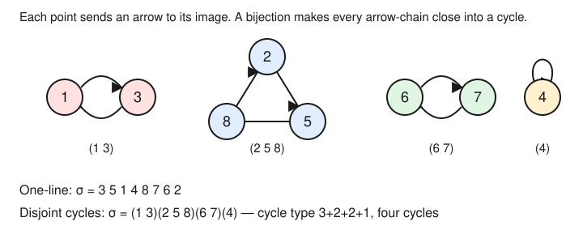

# Enumerative & Algebraic Combinatorics · Lesson 2.1: Permutations & cycle structure

> ⏱ ~15 min · Module 2: Permutations & partitions · Builds on: [Lesson 1.1](01-01-four-rules-twelvefold-way.md) · Unlocks: [Lesson 2.2](02-02-set-partitions-stirling-bell.md)

## Why this matters

A permutation is the most basic object we count — Lesson 1.1 told you there are $n!$ of them — but *how* they are built matters as much as how many there are. Break a permutation into its cycles and you can read off its order, its parity (the sign that runs every determinant in `linalg-refresher`), and how it splits the set it acts on. And the count of permutations by their number of cycles turns out to be the coefficients of a single clean polynomial, the rising factorial. That count, the **Stirling numbers of the first kind**, is the permutation half of a story whose partition half is Lesson 2.2, and its cycle-type bookkeeping is the doorway to the representation theory of $S_n$ (`representation-theory`), where those same partitions label the irreducible representations.

## The idea

A permutation of $[n] = \{1,2,\dots,n\}$ is just a bijection $\sigma:[n]\to[n]$ — a rule that rearranges the labels. The lazy way to write it is **one-line notation**: list the images $\sigma(1)\,\sigma(2)\,\cdots\,\sigma(n)$ in order.

But there is a better picture. Draw a dot for each element and an arrow from every $i$ to its image $\sigma(i)$. Because $\sigma$ is a bijection, every dot has exactly one arrow out *and* exactly one arrow in — so if you start anywhere and keep following arrows, you can never branch, never hit a dead end, and never revisit a dot until you close the loop back to where you began. The whole picture shatters into disjoint **cycles**. That is the one structural fact of the lesson: *a permutation is nothing but a bag of disjoint cycles.* The lengths of those cycles — a list of positive numbers adding to $n$ — is its fingerprint.

## The formal version

Write $S_n$ for the group of all permutations of $[n]$. A **cycle** $(a_1\,a_2\,\cdots\,a_\ell)$ is the permutation sending $a_1\mapsto a_2\mapsto\cdots\mapsto a_\ell\mapsto a_1$ and fixing everything else; $\ell$ is its **length**. A length-$1$ cycle $(a)$ is a **fixed point**. Two cycles are **disjoint** if they share no elements.

**Theorem (disjoint cycle decomposition).** Every $\sigma\in S_n$ factors as a product of disjoint cycles, and this factorization is unique up to the order of the factors and a cyclic rotation of the entries within each cycle.

*In words:* every permutation is a bag of disjoint cycles, and the bag is determined by $\sigma$.

*Proof.* Following the arrows *is* the proof. Fix $a\in[n]$ and look at $a,\ \sigma(a),\ \sigma^2(a),\dots$. Since $[n]$ is finite these repeat; let $\sigma^p(a)=\sigma^q(a)$ be the first repeat with $p<q$. Applying $\sigma^{-p}$ (a bijection, so cancellable) gives $a=\sigma^{q-p}(a)$, so the *first* repeat is a return to $a$ itself: the orbit of $a$ is a genuine cycle $(a\ \sigma(a)\ \cdots\ \sigma^{\ell-1}(a))$. The orbits of distinct starting points are either identical or disjoint (if two orbits met, they would agree from the meeting point backward and forward), so the orbits partition $[n]$, and $\sigma$ acts as the corresponding cycle on each. Uniqueness is forced: the orbits are intrinsic to $\sigma$, and a cycle is determined by its orbit up to where you start reading it. $\blacksquare$

**Cycle type.** Collect the cycle lengths into a weakly decreasing list $\lambda=(\lambda_1\ge\lambda_2\ge\cdots\ge\lambda_r)$ with $\lambda_1+\cdots+\lambda_r=n$. This is a **partition of $n$**, written $\lambda\vdash n$, called the **cycle type** of $\sigma$. (When it's handier, record it in exponential form $1^{m_1}2^{m_2}\cdots$, meaning $m_i$ cycles of length $i$; then $\sum_i i\,m_i=n$.)

**Conjugacy.** Two permutations $\sigma,\tau$ are **conjugate** if $\tau=\pi\sigma\pi^{-1}$ for some $\pi\in S_n$. Conjugating just *relabels*: if $\sigma$ has a cycle $(a_1\,\cdots\,a_\ell)$, then $\pi\sigma\pi^{-1}$ has the cycle $(\pi(a_1)\,\cdots\,\pi(a_\ell))$ — same shape, renamed entries. Hence:

**Proposition.** $\sigma$ and $\tau$ are conjugate in $S_n$ $\iff$ they have the same cycle type. So the **conjugacy classes of $S_n$ are exactly the partitions of $n$.**

*In words:* cycle type is the *only* thing preserved by relabeling, so it is a complete invariant of "same shape."

**Counting by cycles.** Let $c(n,k)$ be the number of permutations of $[n]$ with **exactly $k$ cycles** (fixed points included). These are the **unsigned Stirling numbers of the first kind**.

**Recurrence.** For $n\ge 1$,
$$c(n,k)=c(n-1,k-1)+(n-1)\,c(n-1,k),\qquad c(0,0)=1,\ \ c(n,0)=0\ (n\ge1).$$

*In words:* build a permutation of $[n]$ from one of $[n-1]$ by deciding what to do with the new element $n$.

*Proof.* Look at the cycle containing $n$.
- **$n$ is a fixed point** — its own $1$-cycle. Deleting it leaves a permutation of $[n-1]$ with $k-1$ cycles, and this is reversible. Count: $c(n-1,k-1)$.
- **$n$ shares a cycle** with others. Splice $n$ *out* — have its predecessor point directly to its successor — leaving a permutation of $[n-1]$ with still $k$ cycles. To reverse this, take any permutation of $[n-1]$ with $k$ cycles and *insert* $n$ immediately after one of the $n-1$ elements. That's $(n-1)$ choices, each giving a different permutation with $n$ non-fixed. Count: $(n-1)\,c(n-1,k)$.

Every permutation of $[n]$ falls in exactly one case, so the two counts add. $\blacksquare$

**Two consequences.** Summing over all cycle counts recovers Lesson 1.1:
$$\sum_{k=0}^{n} c(n,k)=n!,$$
since every one of the $n!$ permutations has *some* number of cycles. And the numbers assemble into the **rising factorial**:
$$\sum_{k=0}^{n} c(n,k)\,x^{k}=x(x+1)(x+2)\cdots(x+n-1)=:x^{\overline{n}}.$$

*Proof (induction on $n$).* Let $P_n(x)=\sum_k c(n,k)x^k$. Base: $P_1(x)=x$. Feeding the recurrence in,
$$P_n(x)=\sum_k\big[c(n-1,k-1)+(n-1)c(n-1,k)\big]x^k = x\,P_{n-1}(x)+(n-1)P_{n-1}(x)=(x+n-1)P_{n-1}(x),$$
and unrolling gives $x(x+1)\cdots(x+n-1)$. Setting $x=1$ reproduces $\sum_k c(n,k)=1\cdot2\cdots n=n!$. $\blacksquare$

## Picture

The permutation $\sigma$ with one-line form $3\,5\,1\,4\,8\,7\,6\,2$ decomposes into $(1\,3)(2\,5\,8)(6\,7)(4)$: a $2$-cycle, a $3$-cycle, another $2$-cycle, and a fixed point. Its cycle type is $3+2+2+1$ (exponential form $1^{1}2^{2}3^{1}$), and it has $k=4$ cycles. Every arrow chain closes because each dot has one arrow in and one out.

## Worked examples

**Example 1 (mechanical — decompose and classify).** Take $\sigma\in S_6$ with one-line form $3\,1\,2\,6\,4\,5$, i.e. $\sigma(1)=3,\sigma(2)=1,\sigma(3)=2,\sigma(4)=6,\sigma(5)=4,\sigma(6)=5$. Follow arrows: $1\to3\to2\to1$ closes the cycle $(1\,3\,2)$; then $4\to6\to5\to4$ closes $(4\,6\,5)$. So
$$\sigma=(1\,3\,2)(4\,6\,5),\qquad \text{cycle type } 3+3=1^{0}2^{0}3^{2},\qquad k=2\text{ cycles.}$$

How big is its conjugacy class — how many permutations of $[6]$ share this shape? Choose which $3$ of the $6$ elements form the first block and arrange each block into a cycle, dividing by the symmetry. The general formula for the number of permutations of cycle type $1^{m_1}2^{m_2}\cdots$ is
$$\frac{n!}{\prod_i i^{m_i}\,m_i!}.$$
Here $n=6$, $m_3=2$: $\dfrac{6!}{3^{2}\cdot 2!}=\dfrac{720}{18}=40$ permutations of type $3+3$.

**Example 2 (why you'd care — the row $n=4$).** Build $c(4,k)$ from the recurrence, starting from row $n=3$, which is $c(3,1)=2,\ c(3,2)=3,\ c(3,3)=1$ (the two $3$-cycles, the three products "transposition $\times$ fixed point," and the identity). Using $c(4,k)=c(3,k-1)+3\,c(3,k)$:
$$c(4,1)=0+3\cdot2=6,\quad c(4,2)=2+3\cdot3=11,\quad c(4,3)=3+3\cdot1=6,\quad c(4,4)=1+0=1.$$
Check both consequences at once. Sum: $6+11+6+1=24=4!$. ✓ Polynomial:
$$x(x+1)(x+2)(x+3)=x^{4}+6x^{3}+11x^{2}+6x,$$
whose coefficients $6,11,6,1$ are exactly $c(4,1),c(4,2),c(4,3),c(4,4)$ — the sequence read off the rising factorial. Notice the endpoints make sense on their own: $c(4,1)=6=(4-1)!$ counts the single $4$-cycles (there are $(n-1)!$ ways to arrange $n$ elements in a cycle), and $c(4,4)=1$ is the identity, all fixed points.

## Watch out

- **Cycle notation isn't literally unique — the *decomposition* is.** $(1\,3\,2)=(3\,2\,1)=(2\,1\,3)$ are the same cycle (rotate the start), and the disjoint factors commute so their order is free. Uniqueness in the theorem means *up to* these. Also, people often drop fixed points when writing $\sigma$; then you must be told $n$ to recover the type — the "missing" elements are the $1$-cycles.
- **Don't confuse a decomposition with a composition.** "$\sigma=(1\,3)(2\,5\,8)$" is a factorization into *disjoint* cycles, read all at once. Composing *overlapping* cycles like $(1\,2)(2\,3)$ is a different operation — you must apply them in order (convention here: right-to-left) and simplify, getting $(1\,2\,3)$, not a disjoint product.
- **Unsigned vs. signed Stirling first kind.** We count with $c(n,k)\ge 0$. The *signed* version $s(n,k)=(-1)^{n-k}c(n,k)$ is what appears in the *falling* factorial $x^{\underline{n}}=x(x-1)\cdots(x-n+1)=\sum_k s(n,k)x^k$. Same magnitudes, alternating signs — don't quote one when you mean the other.
- **$c(n,k)$ is its own animal.** It is not a binomial coefficient and not the Stirling number of the *second* kind $S(n,k)$ from Lesson 2.2 (which counts *set partitions*, unordered blocks). Cycles carry a rotational order the blocks of a set partition do not — that's exactly why $c(n,k)\ge S(n,k)$.

## One-liner

> A permutation is a bag of disjoint cycles; counting them by how many cycles they carry gives the coefficients of $x(x+1)\cdots(x+n-1)$.

## Problems

**P1 (🟢)** Let $\sigma\in S_7$ have one-line form $4\,3\,7\,1\,5\,2\,6$. Write its disjoint cycle decomposition, state its cycle type as a partition of $7$, and give its number of cycles $k$.

**P2 (🟡)** Build the $n=5$ row of the Stirling numbers of the first kind from the $n=4$ row $\big(c(4,\cdot)=6,11,6,1\big)$ using the recurrence. Then verify your row two ways: that $\sum_k c(5,k)=120$, and that it lists the coefficients of $x(x+1)(x+2)(x+3)(x+4)$.

**P3 (🔴, optional)** Prove that the number of permutations of $[n]$ with exactly two cycles is
$$c(n,2)=(n-1)!\,H_{n-1},\qquad H_{m}=\sum_{j=1}^{m}\frac1j.$$
(Use the recurrence to set up a first-order relation, then divide by $(n-1)!$.) Check it against $c(4,2)=11$ and $c(5,2)=50$.

Solutions

**P1** Follow arrows. $1\to4\to1$ gives $(1\,4)$. $2\to3\to7\to6\to2$ (since $\sigma(2)=3,\sigma(3)=7,\sigma(7)=6,\sigma(6)=2$) gives $(2\,3\,7\,6)$. $5\to5$ is the fixed point $(5)$. So
$$\sigma=(1\,4)(2\,3\,7\,6)(5),\qquad \text{cycle type } 4+2+1,\qquad k=3\text{ cycles.}$$
(As a sanity check on the conjugacy-class formula, this type $1^{1}2^{1}4^{1}$ has $\tfrac{7!}{1\cdot 2\cdot 4}=\tfrac{5040}{8}=630$ permutations.)

**P2** With $c(5,k)=c(4,k-1)+4\,c(4,k)$ and $c(4,\cdot)=(6,11,6,1)$, $c(4,0)=0$:
$$c(5,1)=0+4\cdot6=24,\ \ c(5,2)=6+4\cdot11=50,\ \ c(5,3)=11+4\cdot6=35,\ \ c(5,4)=6+4\cdot1=10,\ \ c(5,5)=1+0=1.$$
Sum: $24+50+35+10+1=120=5!$. ✓ And
$$x(x+1)(x+2)(x+3)(x+4)=(x^{4}+6x^{3}+11x^{2}+6x)(x+4)=x^{5}+10x^{4}+35x^{3}+50x^{2}+24x,$$
with coefficients $24,50,35,10,1=c(5,1),\dots,c(5,5)$. ✓

**P3** Set $a_n=c(n,2)$. The recurrence with $k=2$ gives $a_n=c(n-1,1)+(n-1)\,c(n-1,2)$. Since $c(n-1,1)=(n-2)!$ (the $(n-1)$-cycles),
$$a_n=(n-1)\,a_{n-1}+(n-2)!.$$
Divide through by $(n-1)!$ and set $b_n=a_n/(n-1)!$:
$$b_n=\frac{(n-1)a_{n-1}}{(n-1)!}+\frac{(n-2)!}{(n-1)!}=\frac{a_{n-1}}{(n-2)!}+\frac{1}{n-1}=b_{n-1}+\frac1{n-1}.$$
The base case is $b_2=a_2/1!=c(2,2)/1=1=H_1$. Telescoping, $b_n=H_1+\sum_{j=2}^{n-1}\tfrac1{j}=H_{n-1}$, so
$$c(n,2)=a_n=(n-1)!\,H_{n-1}. \qquad\blacksquare$$
Checks: $c(4,2)=3!\,H_3=6\big(1+\tfrac12+\tfrac13\big)=6\cdot\tfrac{11}{6}=11$ ✓, and $c(5,2)=4!\,H_4=24\big(\tfrac{25}{12}\big)=50$ ✓.

## Flashback

**From Lesson 1.1 (the four rules & the twelvefold way):** A gallery hangs $4$ distinct paintings on a wall with $9$ distinct numbered hooks, at most one painting per hook. How many arrangements are possible? (This is counting injections from a $4$-set into a $9$-set — a *falling* factorial, order-and-no-repetition.)

Solution

Place the paintings one at a time (product rule): the first has $9$ hook choices, the second $8$ (one hook now used), then $7$, then $6$. So
$$9\cdot 8\cdot 7\cdot 6 = 3024 = \frac{9!}{5!}=9^{\underline{4}},$$
the number of injections $[4]\hookrightarrow[9]$, i.e. the falling factorial $9^{\underline 4}$. (Had the paintings been identical, you'd divide by $4!$ and get $\binom{9}{4}=126$ — the order-doesn't-matter cell of the twelvefold way.)

## Connections

- **Backward:** this is Lesson 1.1's bijection principle turned on a permutation's *own* action — the orbits of $\sigma$ partition $[n]$ — and $\sum_k c(n,k)=n!$ is that lesson's permutation count, now resolved by cycle number. The falling factorial from 1.1 reappears as the *signed* Stirling first kind.
- **Forward:** Lesson 2.2 counts **set partitions** (unordered blocks) with the Stirling numbers of the *second* kind $S(n,k)$ — the "forget the cyclic order" shadow of $c(n,k)$, with a twin recurrence $S(n,k)=k\,S(n-1,k)+S(n-1,k-1)$. Cycle structure returns in Lesson 3.3 (exponential generating functions), where the EGF of "connected" pieces (cycles) exponentiates into the EGF of all permutations.
- **Sideways (representation theory):** conjugacy classes of $S_n$ = cycle types = partitions of $n$ — and the *irreducible representations* of $S_n$ are indexed by the very same partitions (`representation-theory`). That "classes = irreps count" coincidence is the seed of the whole subject.
- **Sideways (linear algebra):** the sign of a permutation is $\operatorname{sgn}(\sigma)=(-1)^{\,n-k}$, with $k$ its number of cycles — so cycle counting *is* parity counting, and parity is exactly the alternating sign in the Leibniz formula for the determinant in `linalg-refresher`.
