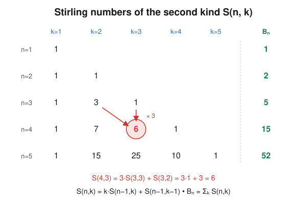

# Enumerative & Algebraic Combinatorics · Lesson 2.2: Set partitions — Stirling & Bell numbers

> ⏱ ~15 min · Module 2: Permutations & partitions · Builds on: [2.1](02-01-permutations-cycle-structure.md), [1.3](01-03-inclusion-exclusion.md) · Unlocks: [2.3](02-03-integer-partitions-ferrers.md)

## Why this matters

"How many ways can I sort these distinct things into groups?" is one of the most common counting questions in the wild — clustering data points, splitting students into project teams, grouping particles into indistinguishable energy states, listing every equivalence relation on a set (a partition *is* an equivalence relation). Last lesson you broke a set apart by **rearranging** it into cycles; this lesson breaks a set apart by **grouping** it into blocks. The two families of numbers that fall out — Stirling numbers of the second kind and Bell numbers — sit right next to the first-kind Stirling numbers of [Lesson 2.1](02-01-permutations-cycle-structure.md), and they hand you a second, cleaner formula for the surjections you counted with inclusion–exclusion in [Lesson 1.3](01-03-inclusion-exclusion.md).

## The idea

A **set partition** chops a set into piles. Three rules, all natural: every pile is nonempty, the piles don't overlap, and together they use up every element. The piles (called **blocks**) are *unordered* — there's no "first block" — and there's no order *within* a block either. What distinguishes one partition from another is only **who sits with whom**.

Concretely, partition $\{1,2,3\}$: you can keep everyone together $\{123\}$; split off one person three ways $\{1\}\{23\}$, $\{2\}\{13\}$, $\{3\}\{12\}$; or separate all three $\{1\}\{2\}\{3\}$. That's $5$ partitions total — the **Bell number** $B_3$.

Now add one dial. If you *fix the number of blocks* at $k$, you get the **Stirling number of the second kind** $S(n,k)$. Above, $S(3,1)=1$, $S(3,2)=3$, $S(3,3)=1$, and summing across all $k$ recovers $B_3 = 1+3+1 = 5$. So the Bell number is just "how many partitions, any block count," and the Stirling numbers are "how many with exactly $k$ blocks."

One contrast to hold onto from [Lesson 2.1](02-01-permutations-cycle-structure.md): a **cycle** remembers a cyclic order of its elements, a **block** does not. That's the whole difference between the first kind $c(n,k)$ (cycles) and the second kind $S(n,k)$ (blocks) — and it's why $c(n,k) \ge S(n,k)$ always.

## The formal version

**Definition (set partition).** A partition of the set $[n]=\{1,2,\dots,n\}$ into $k$ blocks is a collection of $k$ nonempty, pairwise-disjoint subsets $B_1,\dots,B_k$ whose union is $[n]$, where the blocks are unordered.

**Definition (Stirling number, second kind).** $S(n,k)$ is the number of partitions of $[n]$ into exactly $k$ blocks. Boundary values: $S(n,n)=1$ (everyone alone), $S(n,1)=1$ (everyone together), $S(0,0)=1$ (the empty partition of the empty set), and $S(n,0)=0$ for $n\ge 1$.

*In words:* $S(n,k)$ counts the ways to seat $n$ distinguishable people at $k$ identical, nonempty tables.

**The recurrence.**
$$S(n,k) = k\,S(n-1,k) + S(n-1,k-1).$$

*In words:* build a partition by deciding what happens to the last element $n$ — it either joins an existing block or starts a new one.

*Proof.* Focus on where element $n$ lands in a partition of $[n]$ into $k$ blocks. Exactly one of two things happens.

- **$n$ is alone in its own block.** Removing that singleton leaves a partition of $[n-1]$ into $k-1$ blocks — and every such partition arises exactly once this way. Count: $S(n-1,k-1)$.
- **$n$ shares its block with someone.** Removing $n$ leaves a partition of $[n-1]$ into $k$ blocks (its block is still nonempty). To rebuild, take any such partition and drop $n$ into one of its $k$ blocks — $k$ choices, each giving a distinct partition of $[n]$. Count: $k\,S(n-1,k)$.

These two cases are disjoint and exhaustive, so by the sum rule $S(n,k)=k\,S(n-1,k)+S(n-1,k-1)$. $\blacksquare$

**Definition (Bell number).** $B_n = \sum_{k=0}^{n} S(n,k)$ is the total number of partitions of $[n]$ (any number of blocks). First values: $B_0,B_1,B_2,\dots = 1,1,2,5,15,52,\dots$

**The Bell recurrence.**
$$B_{n+1} = \sum_{j=0}^{n} \binom{n}{j}\,B_j.$$

*In words:* build a partition of $[n+1]$ by choosing the block that contains the newest element $n+1$, then freely partitioning whatever is left.

*Proof.* In a partition of $[n+1]$, look at the block containing element $n+1$. Say $j$ of the other $n$ elements are **not** in that block. Choose which $j$ they are in $\binom{n}{j}$ ways; the remaining $n-j$ elements fill out the block with $n+1$. The $j$ leftover elements can be partitioned among themselves in $B_j$ ways, independently. Summing over $j=0,\dots,n$ gives the formula. $\blacksquare$

**The surjection link.** Recall from [Lesson 1.3](01-03-inclusion-exclusion.md) that a surjection $f:[n]\twoheadrightarrow[k]$ is an onto function — every one of the $k$ targets is hit. Then
$$k!\;S(n,k) = \operatorname{Surj}(n,k),$$
the number of surjections from an $n$-set onto a $k$-set.

*In words:* a surjection is a set partition whose $k$ blocks have been **labeled** $1$ through $k$.

*Why:* the fibers $f^{-1}(1),\dots,f^{-1}(k)$ of a surjection are $k$ nonempty disjoint sets covering $[n]$ — a partition into $k$ blocks — plus a labeling of which block maps to which target. Any partition into $k$ blocks yields $k!$ surjections by choosing that labeling. Combined with the inclusion–exclusion count of surjections from [Lesson 1.3](01-03-inclusion-exclusion.md), this gives a **closed form**:
$$S(n,k) = \frac{1}{k!}\sum_{i=0}^{k}(-1)^i\binom{k}{i}(k-i)^n.$$

## Picture

The triangle of second-kind Stirling numbers. Each entry is $k$ times the one directly above it plus the one above-and-to-the-left (the recurrence). The green column on the right is the row sum — the Bell number.

## Worked examples

**Example 1 (mechanical — two ways to get $S(4,2)=7$).**

*By the recurrence:* $S(4,2) = 2\,S(3,2) + S(3,1) = 2\cdot 3 + 1 = 7.$

*By brute force:* partition $\{1,2,3,4\}$ into $2$ blocks. Either one block is a singleton (4 ways: split off $1$, $2$, $3$, or $4$) or the blocks split $2$–$2$. A $2$–$2$ split is determined by which two elements sit with $1$: partner $1$ with $2$, $3$, or $4$ — that's $3$ ways, and it's automatically unordered. Total $4+3=7$:
$$\{1\}\{234\},\ \{2\}\{134\},\ \{3\}\{124\},\ \{4\}\{123\},\ \{12\}\{34\},\ \{13\}\{24\},\ \{14\}\{23\}.\ \checkmark$$

**Example 2 (why you'd care — surjections, two ways).** Four distinct gifts are handed to three children, and *every* child must get at least one. How many distributions?

The children are labeled (they're distinct people), so this is a surjection count $\operatorname{Surj}(4,3)$, and the surjection link says
$$\operatorname{Surj}(4,3) = 3!\;S(4,3) = 6\cdot 6 = 36.$$
Here $S(4,3)=6$ (partition the four gifts into three nonempty piles), and $3!$ assigns the piles to the three children. Cross-check with inclusion–exclusion from [Lesson 1.3](01-03-inclusion-exclusion.md):
$$\operatorname{Surj}(4,3) = \sum_{i=0}^{3}(-1)^i\binom{3}{i}(3-i)^4 = 3^4 - 3\cdot 2^4 + 3\cdot 1^4 - 0 = 81 - 48 + 3 = 36.\ \checkmark$$
Two roads, same answer — that agreement *is* the surjection link.

## Watch out

- **Blocks are unordered — don't overcount by labeling them.** $S(3,2)=3$, not $6$. If you find yourself multiplying by $k!$, you've switched from partitions to surjections (labeled boxes). The $k!$ is exactly the bridge between them.
- **Nonempty is not optional.** $S(n,k)$ forbids empty blocks — that's the entire reason it's harder than "split $n$ elements into $k$ *possibly-empty* groups." Empty blocks are what inclusion–exclusion sieves *out* in the closed form.
- **Second kind (blocks) vs. first kind (cycles).** $S(n,k)$ counts set partitions; $c(n,k)$ from [Lesson 2.1](02-01-permutations-cycle-structure.md) counts permutations with $k$ cycles. A block of size $m$ can be wound into a cycle in $(m-1)!$ ways, so $c(n,k)\ge S(n,k)$: e.g. $c(4,2)=11$ but $S(4,2)=7$.
- **Distinguishable elements.** This is *set* partition — which specific elements share a block matters. Next lesson's **integer** partitions ([2.3](02-03-integer-partitions-ferrers.md)) forget the labels and count only block *sizes*; don't conflate the two.

## One-liner

> $S(n,k)$ counts unordered ways to group $n$ labeled things into $k$ nonempty blocks; sum over $k$ for the Bell number $B_n$, and multiply by $k!$ to label the blocks into a surjection.

## Problems

**P1 (🟢)** (a) Use the recurrence to compute $S(5,3)$ from row $4$ of the triangle. (b) Compute $B_4$ by summing its Stirling row, then confirm it with the Bell recurrence $B_4 = \sum_{j=0}^{3}\binom{3}{j}B_j$.

**P2 (🟡)** Prove that $S(n,2) = 2^{n-1} - 1$ for all $n\ge 1$, by a direct combinatorial argument (not the recurrence).

**P3 (🔴, optional)** Prove the surjection link $k!\,S(n,k)=\operatorname{Surj}(n,k)$ carefully, then combine it with the inclusion–exclusion surjection count from [Lesson 1.3](01-03-inclusion-exclusion.md) to derive the closed form $S(n,k)=\frac{1}{k!}\sum_{i=0}^{k}(-1)^i\binom{k}{i}(k-i)^n$, and verify it gives $S(4,2)=7$.

Solutions

**P1** (a) From row $4$: $S(4,3)=6$ and $S(4,2)=7$. The recurrence with $n=5,k=3$ gives
$$S(5,3) = 3\,S(4,3) + S(4,2) = 3\cdot 6 + 7 = 25.\ \checkmark$$

(b) Row $4$ of the triangle is $S(4,1),\dots,S(4,4) = 1,7,6,1$, so $B_4 = 1+7+6+1 = 15$. Bell recurrence, using $B_0,B_1,B_2,B_3 = 1,1,2,5$:
$$B_4 = \binom{3}{0}B_0 + \binom{3}{1}B_1 + \binom{3}{2}B_2 + \binom{3}{3}B_3 = 1\cdot 1 + 3\cdot 1 + 3\cdot 2 + 1\cdot 5 = 1+3+6+5 = 15.\ \checkmark$$

**P2** A partition into exactly $2$ blocks splits $[n]$ into a nonempty set $A$ and its nonempty complement $[n]\setminus A$. Count the ordered version first: assign each element to "side 1" or "side 2," which is $2^n$ colorings, then throw out the two illegal all-on-one-side colorings (which would leave a block empty), giving $2^n - 2$ *ordered* splits. Since the two blocks are unordered, each unordered partition was counted twice (as $A$ vs. $[n]\setminus A$), so
$$S(n,2) = \frac{2^n - 2}{2} = 2^{n-1} - 1.$$
Sanity check: $S(4,2) = 2^3 - 1 = 7.\ \checkmark\ \blacksquare$

*(Equivalent framing: fix element $1$ to "side 1"; the other $n-1$ elements each freely choose a side — $2^{n-1}$ ways — minus the $1$ way that leaves side 2 empty, giving $2^{n-1}-1$ directly, with no double-counting to undo.)*

**P3** *The link.* Given a surjection $f:[n]\twoheadrightarrow[k]$, its fibers $f^{-1}(1),\dots,f^{-1}(k)$ are nonempty (surjectivity), pairwise disjoint (each element maps to one target), and cover $[n]$ — a partition into exactly $k$ blocks. Conversely, take any partition of $[n]$ into $k$ blocks and any bijection from the set of blocks to $[k]$: sending each element to the label of its block gives a surjection, and *every* surjection arises exactly once this way. There are $k!$ bijections (labelings) per partition, and different labelings give different functions, so the surjections split into groups of $k!$, one group per partition. Hence $\operatorname{Surj}(n,k) = k!\,S(n,k)$. $\blacksquare$

*The closed form.* From [Lesson 1.3](01-03-inclusion-exclusion.md), sieving out the "target $i$ is missed" events gives $\operatorname{Surj}(n,k) = \sum_{i=0}^{k}(-1)^i\binom{k}{i}(k-i)^n$. Divide by $k!$:
$$S(n,k) = \frac{1}{k!}\sum_{i=0}^{k}(-1)^i\binom{k}{i}(k-i)^n.$$
Check at $n=4,k=2$:
$$S(4,2) = \frac{1}{2}\Big[\binom{2}{0}2^4 - \binom{2}{1}1^4 + \binom{2}{2}0^4\Big] = \frac{1}{2}\big[16 - 2 + 0\big] = 7.\ \checkmark$$

## Flashback

**From [Lesson 1.3](01-03-inclusion-exclusion.md) (inclusion–exclusion):** Five letters are placed at random, one into each of five pre-addressed envelopes. In how many arrangements does *no* letter land in its own correct envelope? (These are the **derangements** of $5$ elements, $!5$.)

Solution

Let $A_i$ be the set of arrangements where letter $i$ *is* in its correct envelope. We want the arrangements in none of the $A_i$. By inclusion–exclusion, the number with at least one correct placement is $\sum|A_i| - \sum|A_i\cap A_j| + \cdots$, and fixing any $i$ of the letters leaves $(5-i)!$ arrangements of the rest, with $\binom{5}{i}$ ways to choose which are fixed. So
$$!5 = \sum_{i=0}^{5}(-1)^i\binom{5}{i}(5-i)! = 5!\sum_{i=0}^{5}\frac{(-1)^i}{i!}.$$
Compute term by term: $120 - 120 + 60 - 20 + 5 - 1 = 44.$ So $!5 = 44$.

(This is the same sieve as the surjection count in Example 2 — inclusion–exclusion forbidding "correct positions" instead of forbidding "missed targets.")

## Connections

- **Backward:** this generalizes the surjection count of [Lesson 1.3](01-03-inclusion-exclusion.md) — $S(n,k)=\operatorname{Surj}(n,k)/k!$ strips the labels off the boxes — and reuses that lesson's inclusion–exclusion sieve to get a closed form. It also sits directly beside the first-kind Stirling numbers $c(n,k)$ of [Lesson 2.1](02-01-permutations-cycle-structure.md): same "break a set apart" theme, blocks instead of cycles.
- **Forward:** [Lesson 2.3](02-03-integer-partitions-ferrers.md) keeps the word "partition" but forgets element identities, counting only the multiset of block *sizes*. And in [Lesson 3.3](03-03-exponential-generating-functions.md), exponential generating functions package the entire Bell/Stirling family into one clean identity ($\sum_n B_n \frac{x^n}{n!} = e^{\,e^x - 1}$), turning the recurrences here into algebra.
- **Sideways (discrete math / logic):** a set partition is exactly the same data as an **equivalence relation** on $[n]$ — blocks are equivalence classes — so $B_n$ counts the equivalence relations on an $n$-element set, a fact `discrete-mathematics` uses when it builds quotients and relations.
