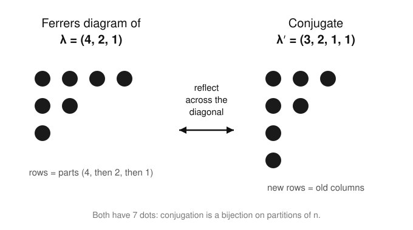

# Enumerative & Algebraic Combinatorics · Lesson 2.3: Integer partitions & Ferrers diagrams

> ⏱ ~15 min · Module 2: Permutations & partitions · Builds on: [Lesson 2.2](02-02-set-partitions-stirling-bell.md) (set partitions, Stirling & Bell numbers) · Unlocks: Module 3 — [Lesson 3.1](03-01-ordinary-generating-functions.md) (ordinary generating functions)

## Why this matters

In Lesson 2.2 you split a *labeled* set into blocks — the elements $\{a,b,c\}$ were distinguishable. Strip the labels off and ask only "how many blocks of each size?" and you get an **integer partition**: a way of writing $n$ as a sum of positive integers. This is the humblest-looking object in the course and one of the deepest — the partition function $p(n)$ has no elementary closed form, yet its identities fall out of a single visual trick (flip the picture across a diagonal). Partitions run the representation theory of the symmetric group (Module 5), the energy-level counting of quantum statistical mechanics (a boson gas *is* a generating function over partitions), and they are the natural first playground for the generating functions that dominate Module 3.

## The idea

A **partition** of $n$ is a way to write $n$ as an unordered sum of positive integers. Order does not matter, so we always list the parts in nonincreasing order: $6 = 4+2 = 2+4$ is *one* partition, written $(4,2)$.

The magic is that every partition has a *picture*. Stack the parts as rows of dots, biggest on top: the partition $(4,2,1)$ becomes a staircase of $4$, then $2$, then $1$ dots. That picture is a **Ferrers diagram**. Now do the one move that makes the whole theory work — **flip it across the main diagonal**, turning rows into columns. You get the Ferrers diagram of a *different* partition, the **conjugate**. Reading rows became reading columns, so "number of parts" swapped with "size of the largest part." Two questions that looked unrelated are now the same question seen from two sides. That single reflection proves a fistful of identities for free, and it is your first taste of a **bijective proof** (Module 4): don't compute two numbers and check they match — build a reversible correspondence and they *must* match.

## The formal version

**Definition (integer partition).** A partition of a positive integer $n$ is a tuple $\lambda = (\lambda_1, \lambda_2, \dots, \lambda_r)$ of integers with $\lambda_1 \ge \lambda_2 \ge \dots \ge \lambda_r \ge 1$ and $\lambda_1 + \dots + \lambda_r = n$. The $\lambda_i$ are the **parts**, $r$ is the **number of parts**, and we write $\lambda \vdash n$ ("$\lambda$ partitions $n$"). The **partition function** $p(n)$ counts them: $p(n) = \#\{\lambda : \lambda \vdash n\}$, with $p(0) = 1$ (the empty partition).

*In words:* a partition is $n$ broken into a bag of positive pieces; $p(n)$ counts the distinct bags.

For example $p(5) = 7$: the partitions are $(5),\,(4,1),\,(3,2),\,(3,1,1),\,(2,2,1),\,(2,1,1,1),\,(1,1,1,1,1)$.

**Definition (Ferrers diagram).** The Ferrers diagram of $\lambda = (\lambda_1,\dots,\lambda_r)$ is $r$ left-justified rows of dots, the $i$-th row holding $\lambda_i$ dots.

**Definition (conjugate partition).** The **conjugate** $\lambda'$ is the partition whose Ferrers diagram is the transpose (rows $\leftrightarrow$ columns) of $\lambda$'s. Equivalently,
$$\lambda'_j = \#\{\, i : \lambda_i \ge j \,\},$$
the number of parts of $\lambda$ that are at least $j$ — i.e. the height of the $j$-th column.

*In words:* $\lambda'_j$ counts how many rows reach at least out to column $j$, which is exactly the length of that column.

Conjugation is an **involution**: transposing twice returns the original diagram, so $(\lambda')' = \lambda$. Because it sends each partition of $n$ to another partition of $n$ and is its own inverse, it is a bijection from the partitions of $n$ to themselves. Reading off what the transpose swaps gives two theorems at once.

**Conjugation Theorem.** For every $n$ and $k$:
1. the number of partitions of $n$ into **at most $k$ parts** equals the number into **parts each $\le k$**;
2. the number of partitions of $n$ whose **largest part is exactly $k$** equals the number with **exactly $k$ parts**.

*In words:* "few rows" mirrors to "short rows," and "the tallest column has height $k$" mirrors to "there are $k$ rows."

*Proof.* Transposing a diagram turns its $i$-th **row** into its $i$-th **column**, so it exchanges the two statistics
$$\text{(number of parts of }\lambda) \;\longleftrightarrow\; \text{(largest part of }\lambda').$$
For (1): $\lambda$ has at most $k$ parts $\iff$ its diagram has at most $k$ rows $\iff$ the transpose has all columns... i.e. all rows of length $\le k$ $\iff$ $\lambda'$ has every part $\le k$. Since $\lambda \mapsto \lambda'$ is a bijection on partitions of $n$, the two described sets are equinumerous. For (2): largest part of $\lambda$ is $k$ $\iff$ the diagram has exactly $k$ columns $\iff$ $\lambda'$ has exactly $k$ rows, i.e. exactly $k$ parts. $\blacksquare$

## Picture

The left diagram is $\lambda = (4,2,1)$: rows of $4,2,1$ dots. Its columns have heights $3,2,1,1$ — read those off and you get the conjugate $\lambda' = (3,2,1,1)$ on the right. The largest part $4$ of $\lambda$ became the number of parts of $\lambda'$; the $3$ parts of $\lambda$ became the largest part of $\lambda'$. Both diagrams hold $7$ dots because reflection never adds or removes a dot — that is why conjugation preserves $n$.

## Worked examples

**Example 1 (conjugate mechanically, and self-conjugates).** Take $\lambda = (5,3,3,1) \vdash 12$. Column heights: column $1$ is hit by all $4$ rows $\to 4$; column $2$ by the rows $\ge 2$, namely $5,3,3 \to 3$; column $3$ likewise $\to 3$; column $4$ only by the $5 \to 1$; column $5$ only by the $5 \to 1$. So $\lambda' = (4,3,3,1,1) \vdash 12$. Check the theorem: $\lambda$ has $4$ parts and largest part $5$; $\lambda'$ has largest part $4$ and $5$ parts — swapped, as promised.

A partition with $\lambda = \lambda'$ is **self-conjugate** — its diagram is symmetric across the diagonal. Example: $(3,2,1) \vdash 6$ transposes to $(3,2,1)$. Self-conjugate partitions will reappear as a slick special case (they biject with partitions of $n$ into distinct *odd* parts — peel each symmetric "hook" off the diagonal).

**Example 2 (Euler's theorem: distinct = odd).** Here is the identity worth remembering. Let $p_{\text{dist}}(n)$ count partitions of $n$ into **distinct** parts (all parts different) and $p_{\text{odd}}(n)$ count those into **odd** parts (every part odd). Euler's theorem says
$$p_{\text{dist}}(n) = p_{\text{odd}}(n) \quad\text{for all } n.$$

*Verify at $n = 6$.* Distinct parts: $(6),\,(5,1),\,(4,2),\,(3,2,1)$ — that's $\mathbf{4}$. Odd parts: $(5,1),\,(3,3),\,(3,1,1,1),\,(1,1,1,1,1,1)$ — also $\mathbf{4}$. They match.

*The telescoping intuition (why it's true).* The full proof is a generating-function one-liner you'll write in Module 3, but the mechanism is visible now. Each part $k$ can be tracked by a factor. Allowing every part to appear **at most once** contributes, for part-size $k$, a factor $(1+x^k)$ — "use it or don't." Allowing **odd** parts any number of times contributes $\frac{1}{1-x^{2k-1}}$ — a geometric series over how many copies. The bridge is the telescoping identity
$$1 + x^k = \frac{1 - x^{2k}}{1 - x^k},$$
so the whole distinct-parts product collapses onto the odd-parts product as the even factors in numerator and denominator cancel in cascade. The exponents $x^n$ track the integer being partitioned; equal coefficients mean equal counts. Full derivation: [Lesson 3.1](03-01-ordinary-generating-functions.md).

## Watch out

- You might think a partition is *ordered* like the compositions from [Lesson 1.2](01-02-binomial-multinomial-coefficients.md) — but it is not. $(3,1)$ and $(1,3)$ are the **same** partition; as *compositions* they are different. That is exactly why $p(n)$ is far smaller than $2^{n-1}$ (the composition count) and has no simple closed form.
- You might think conjugation is some elaborate operation — but it is *only* transposing the picture. If you find yourself doing arithmetic, stop and just reflect the diagram: rows become columns.
- You might think "distinct parts" and "odd parts" should obviously differ — but Euler's theorem says they are perfectly matched for **every** $n$. Distinct-vs-odd is a genuine coincidence-that-isn't, not an approximation.
- Don't confuse $p(n)$ (integer partitions, labels gone) with $B_n$ (set partitions, labels kept, [Lesson 2.2](02-02-set-partitions-stirling-bell.md)). For $n=3$: $p(3)=3$ but $B_3=5$. Forgetting the labels merges distinct set partitions of the same block-size profile.

## One-liner

> A partition is $n$ drawn as a staircase of dots, and flipping that staircase across its diagonal — conjugation — proves partition identities without computing a single number.

## Problems

**P1 (🟢)** (a) List all partitions of $6$; confirm $p(6) = 11$. (b) Write the Ferrers diagram of $\lambda = (4,4,1)$ and compute its conjugate $\lambda'$. (c) Which partitions of $6$ are self-conjugate? (Find them by symmetry of the diagram.)

**P2 (🟡)** Using the Conjugation Theorem, show that the number of partitions of $n$ into **exactly $2$ parts** equals the number of partitions of $n$ whose **largest part is exactly $2$**. Then give a direct formula for each count and check they agree at $n = 7$.

**P3 (🔴, optional)** Prove that the number of partitions of $n$ into parts of size **at most $2$** equals $\lfloor n/2 \rfloor + 1$. Then, using conjugation, state the partition-counting fact this is equivalent to, and confirm it for $n = 6$.

Solutions

**P1** (a) In nonincreasing order: $(6),\,(5,1),\,(4,2),\,(4,1,1),\,(3,3),\,(3,2,1),\,(3,1,1,1),\,(2,2,2),\,(2,2,1,1),\,(2,1,1,1,1),\,(1,1,1,1,1,1)$. That is $11$ partitions, so $p(6) = 11$. ✓

(b) $\lambda = (4,4,1)$ has rows of $4,4,1$ dots. Column heights: column $1$ is met by all $3$ rows $\to 3$; column $2$ by the two $4$'s $\to 2$; column $3 \to 2$; column $4 \to 2$. So $\lambda' = (3,2,2,2) \vdash 9$. (Check: $\lambda$ has largest part $4$ and $3$ parts; $\lambda'$ has $4$ parts and largest part $3$ — swapped.)

(c) A partition of $6$ is self-conjugate iff its diagram is symmetric across the diagonal. Checking the list, the only one is $(3,2,1)$: its columns have heights $3,2,1$, so $\lambda' = (3,2,1) = \lambda$. (No other partition of $6$ is symmetric — e.g. $(4,1,1)$ conjugates to $(3,1,1,1) \ne \lambda$.) So exactly **one** self-conjugate partition of $6$. As a cross-check, self-conjugate partitions of $6$ biject with partitions of $6$ into distinct odd parts: those are just $(5,1)$ — one of them. ✓

**P2** By Conjugation Theorem part (2) with $k = 2$: partitions with largest part exactly $2$ correspond bijectively (via conjugation) to partitions with exactly $2$ parts. So the counts are equal. 

Direct formula: a partition of $n$ into exactly $2$ parts is $(a,b)$ with $a \ge b \ge 1$ and $a + b = n$. Then $b$ ranges over $1 \le b \le \lfloor n/2 \rfloor$ (once $b > n/2$ we'd need $a < b$), and $a = n - b$ is determined. So the count is $\lfloor n/2 \rfloor$. 

Sanity check on the mirror side: a partition with largest part exactly $2$ uses some $2$'s and some $1$'s with at least one $2$; if there are $j \ge 1$ twos then $2j \le n$ and the rest are $1$'s, giving $j \in \{1,\dots,\lfloor n/2\rfloor\}$ — again $\lfloor n/2 \rfloor$ choices. 

At $n = 7$: exactly-$2$-parts partitions are $(6,1),(5,2),(4,3)$ — that's $3 = \lfloor 7/2 \rfloor$. Largest-part-exactly-$2$: $(2,2,2,1),(2,2,1,1,1),(2,1,1,1,1,1)$ — also $3$. ✓

**P3** A partition of $n$ into parts of size at most $2$ is determined by how many $2$'s it uses. If it uses $j$ twos ($j \ge 0$) then $2j \le n$, and the remaining $n - 2j$ is filled with $1$'s (uniquely). So $j$ ranges over $0, 1, \dots, \lfloor n/2 \rfloor$, giving $\lfloor n/2 \rfloor + 1$ partitions. $\blacksquare$

Equivalent fact via conjugation: "parts each $\le 2$" is the mirror (Conjugation Theorem part 1, $k = 2$) of "at most $2$ parts." So the number of partitions of $n$ into **at most $2$ parts** is also $\lfloor n/2 \rfloor + 1$. 

Check at $n = 6$: parts $\le 2$ are $(2,2,2),(2,2,1,1),(2,1,1,1,1),(1,1,1,1,1,1)$ — that's $4 = \lfloor 6/2\rfloor + 1$. At most $2$ parts: $(6),(5,1),(4,2),(3,3)$ — also $4$. ✓

## Flashback

**From [Lesson 2.2](02-02-set-partitions-stirling-bell.md) (set partitions: Stirling & Bell numbers):** Compute the Stirling number of the second kind $S(4,2)$ — the number of ways to partition the labeled set $\{1,2,3,4\}$ into exactly $2$ nonempty blocks — using the recurrence $S(n,k) = k\,S(n-1,k) + S(n-1,k-1)$. Then contrast: how many **integer** partitions of $4$ have exactly $2$ parts?

Solution

Base values: $S(n,1) = 1$ (one block: everything together) and $S(n,n) = 1$ (all singletons). So $S(3,1) = 1$ and $S(3,2) = 2\,S(2,2) + S(2,1) = 2(1) + 1 = 3$.

Now $S(4,2) = 2\,S(3,2) + S(3,1) = 2(3) + 1 = \mathbf{7}$. (Direct check: the two blocks split $4$ elements as sizes $3{+}1$ — there are $\binom{4}{1} = 4$ ways to pick the singleton — or $2{+}2$ — there are $\tfrac{1}{2}\binom{4}{2} = 3$ ways, halving because the two size-$2$ blocks are interchangeable. Total $4 + 3 = 7$. ✓)

Contrast with integer partitions of $4$ into exactly $2$ parts: $(3,1)$ and $(2,2)$ — just **$2$** of them. The gap ($7$ vs $2$) is precisely the labels: the integer partition $(3,1)$ blurs together all $4$ labeled set partitions with a size-$3$ and a size-$1$ block, and $(2,2)$ blurs the $3$ labeled ones with two size-$2$ blocks. Strip the labels and $7$ collapses to $2$.

## Connections

- **Backward:** this is [Lesson 2.2](02-02-set-partitions-stirling-bell.md) with the labels erased — set partitions (counted by $S(n,k)$, $B_n$) become integer partitions (counted by $p(n)$) once you forget *which* elements sit in each block and keep only the block sizes.
- **Forward:** the factors $(1+x^k)$ and $\frac{1}{1-x^k}$ in Example 2 are ordinary generating functions — [Lesson 3.1](03-01-ordinary-generating-functions.md) makes $\prod_k \frac{1}{1-x^k}$ the official generating function of $p(n)$ and turns Euler's telescoping into a two-line proof.
- **Sideways (bijective proof):** conjugation is a model **involution**, the technique that powers [Lesson 4.1](04-01-bijective-proof.md); "reflect the diagram" is the same move as "toggle element $1$" in a sign-reversing involution — build the reversible map, get the identity free.
- **Sideways (representation theory):** partitions of $n$ index the irreducible representations of the symmetric group $S_n$, and their Ferrers/Young diagrams become Young tableaux — the objects behind the Schur functions previewed in [Lesson 5.3](05-03-symmetric-functions.md) and studied for real in the field of `representation-theory`.
