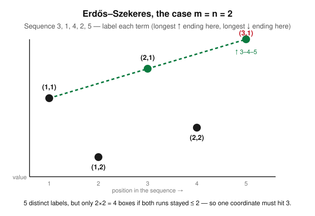

# Enumerative & Algebraic Combinatorics · Lesson 4.2: Pigeonhole principle

> ⏱ ~15 min · Module 4: Bijective proof, pigeonhole & Ramsey · Builds on: [4.1 (bijective proof)](04-01-bijective-proof.md) · Unlocks: [4.3 (Ramsey theory)](04-03-ramsey-theory.md)

## Why this matters

A bijection (Lesson 4.1) proves two counts are *equal*. The pigeonhole principle proves something softer but stranger: that a coincidence is *unavoidable* — not because you arranged it, but because the numbers left no room to avoid it. It is the purest example of extracting structure from size alone, and it is the seed of the whole next lesson: Ramsey theory (4.3) is pigeonhole applied over and over until order is forced out of chaos. The same one-line argument proves two guests at any party know the same number of people, that some run of days had a divisible total, and — via Erdős–Szekeres — that every long-enough list of numbers hides a long sorted sublist.

## The idea

If you have more pigeons than pigeonholes and every pigeon must roost, some hole holds at least two. That's the entire principle. What makes it powerful is not the statement but the *modeling*: the art is choosing what the pigeons are and what the holes are so that "two in one hole" becomes exactly the coincidence you want.

Two refinements make it bite harder. First, **more pigeons per hole**: cram $100$ pigeons into $12$ holes and some hole has at least $\lceil 100/12 \rceil = 9$ — you can't keep everyone under the average. Second, the **averaging view**: box-counts are just numbers, and *some number in any list is at least the average*. Read that backwards and pigeonhole is nothing but the obvious fact that you cannot have every value below the mean.

## The formal version

**Basic pigeonhole.** If $n+1$ objects are placed into $n$ boxes, some box contains at least $2$ objects.

*In words:* one more object than boxes forces a repeat.

*Proof.* If every box held $\le 1$ object, the total would be $\le n$; but we placed $n+1$. Contradiction. $\blacksquare$

**Generalized pigeonhole.** If $N$ objects are placed into $n$ boxes, some box contains at least $\left\lceil N/n \right\rceil$ objects. (Here $\lceil x \rceil$ is the least integer $\ge x$.)

*In words:* something always beats the average, rounded up.

*Proof.* If every box held $\le \lceil N/n\rceil - 1$ objects, the total would be at most $n\big(\lceil N/n\rceil - 1\big) < n\cdot \tfrac{N}{n} = N$, using $\lceil N/n\rceil < \tfrac{N}{n}+1$. That undercounts the $N$ objects. $\blacksquare$

**Averaging form.** If real numbers $x_1,\dots,x_n$ have mean $\bar x = \frac1n\sum_i x_i$, then some $x_i \ge \bar x$ and some $x_j \le \bar x$.

*In words:* not everything can sit strictly below (or strictly above) the average.

*Proof.* If every $x_i < \bar x$, then $\sum_i x_i < n\bar x = \sum_i x_i$, impossible; symmetrically for $\le$. $\blacksquare$ Generalized pigeonhole is exactly this applied to the box-counts, whose mean is $N/n$.

## Picture

The **Erdős–Szekeres theorem** is pigeonhole's showpiece: *any sequence of $mn+1$ distinct reals contains an increasing subsequence of length $m+1$ or a decreasing subsequence of length $n+1$.* (A *subsequence* keeps the original order but may skip terms.) Below, $m=n=2$, so $mn+1 = 5$ terms force a monotone run of length $3$.

*The proof, read off the labels.* Tag each term $a_i$ with a pair $(u_i, v_i)$: $u_i$ is the length of the longest increasing subsequence *ending* at $a_i$, and $v_i$ the longest decreasing one ending there. The key fact is that **these labels are all distinct**: for $i<j$, if $a_i < a_j$ then any increasing run ending at $a_i$ extends to $a_j$, so $u_j > u_i$; if $a_i > a_j$ then likewise $v_j > v_i$. Either way $(u_i,v_i)\ne(u_j,v_j)$.

Now suppose, for contradiction, there is *no* increasing run of length $m+1$ and *no* decreasing run of length $n+1$. Then every $u_i \in \{1,\dots,m\}$ and every $v_i \in \{1,\dots,n\}$ — only $mn$ possible label-pairs (the boxes). But we have $mn+1$ distinct labels (the pigeons). Pigeonhole forces two equal, contradicting distinctness. $\blacksquare$

## Worked examples

**Example 1 (mechanical — generalized form).** Twenty-five identical letters are dropped into $6$ mailboxes. Some mailbox receives at least
$$\left\lceil \tfrac{25}{6} \right\rceil = \lceil 4.16\ldots\rceil = 5$$
letters. And $5$ is sharp: $25 = 5+5+5+4+3+3$ shows a distribution whose *maximum* is exactly $5$, so no smaller bound is provable. Pigeonhole tells you the peak is unavoidable, not that it's large.

**Example 2 (why you'd care — the party theorem).** In any group of $n \ge 2$ people, two people have exactly the same number of acquaintances inside the group (acquaintance is mutual, and nobody is their own). Each person's acquaintance count lies in $\{0,1,\dots,n-1\}$ — that's $n$ possible values for $n$ people, so naive pigeonhole *just barely fails*. The fix is to notice the two extremes cannot coexist: if someone knows all $n-1$ others, then nobody can have count $0$; if someone knows nobody, then no one can have count $n-1$. So the counts actually live in a set of size $n-1$. Now $n$ people into $n-1$ possible values force a repeat. $\blacksquare$ The whole trick was *shrinking the box set by one* — a move you'll reuse constantly.

## Watch out

- You might think the generalized bound $\lceil N/n\rceil$ tells you a box is *big* — but it only pins the maximum, and it's often close to the average. The content is "you can't keep everyone at or below $\lceil N/n\rceil - 1$," nothing more. Don't over-claim.
- You might think you should apply pigeonhole to the *obvious* objects and boxes — but the win is almost always in a clever choice. In the party theorem the boxes were acquaintance-*counts*, not people; in the subset problem (P2) they'll be *remainders of prefix sums*, not the numbers themselves. If the direct setup gives "$n$ into $n$," look for a reason to delete one box.
- You might think Erdős–Szekeres promises *both* a long increasing and a long decreasing run — it promises (at least) *one of the two*. The sequence $3,1,4,2,5$ has an increasing run of length $3$ but its longest decreasing run is only $2$.

## One-liner

> More pigeons than holes forces a shared hole — so pick your pigeons and holes to make the coincidence you want inevitable.

## Problems

**P1 (🟢)** Six distinct numbers are chosen from $\{1,2,\dots,10\}$. Prove that two of them sum to $11$. (Hint: what are the natural "holes"?)

**P2 (🟡)** Let $a_1, a_2, \dots, a_n$ be any integers (not necessarily distinct). Prove that some nonempty *consecutive block* $a_{i+1} + a_{i+2} + \cdots + a_j$ is divisible by $n$. (Hint: look at the $n+1$ prefix sums $s_0=0,\ s_k = a_1+\cdots+a_k$ modulo $n$.)

**P3 (🔴)** Choose any $n+1$ numbers from $\{1,2,\dots,2n\}$. Prove that one of them divides another. (Hint: write each chosen number as $2^{k}\cdot m$ with $m$ odd; how many possible values can the odd part $m$ take?)

Solutions

**P1** Partition $\{1,\dots,10\}$ into the five pairs that sum to $11$:
$$\{1,10\},\ \{2,9\},\ \{3,8\},\ \{4,7\},\ \{5,6\}.$$
These five pairs are the holes; the six chosen numbers are the pigeons. Six numbers into five pairs force two chosen numbers to land in the *same* pair, and every pair sums to $11$. So those two chosen numbers sum to $11$. $\blacksquare$ (Note six is sharp: choosing $\{1,2,3,4,5\}$ — one from each pair plus one — avoids it with only five numbers.)

**P2** Form the $n+1$ prefix sums $s_0 = 0,\ s_1 = a_1,\ \dots,\ s_n = a_1+\cdots+a_n$. Reduce each modulo $n$: each $s_k \bmod n$ is one of the $n$ residues $\{0,1,\dots,n-1\}$. That's $n+1$ pigeons (the prefix sums) into $n$ holes (the residues), so by pigeonhole two prefix sums share a residue: $s_i \equiv s_j \pmod n$ for some $0 \le i < j \le n$. Then
$$s_j - s_i = a_{i+1} + a_{i+2} + \cdots + a_j \equiv 0 \pmod n,$$
a nonempty consecutive block (nonempty because $i<j$) divisible by $n$. $\blacksquare$

**P3** Every positive integer factors uniquely as $2^{k}\cdot m$ with $m$ odd (strip out all factors of $2$). For a number in $\{1,\dots,2n\}$, the odd part $m$ is an odd number in $\{1,3,5,\dots,2n-1\}$ — exactly $n$ possible values. We chose $n+1$ numbers (pigeons) but there are only $n$ possible odd parts (holes), so two chosen numbers share the same odd part $m$: say they are $2^{a}m$ and $2^{b}m$ with $a < b$. Then
$$2^{b}m = 2^{\,b-a}\cdot\big(2^{a}m\big),$$
so $2^{a}m$ divides $2^{b}m$. $\blacksquare$ (Sharp: $\{n+1, n+2, \dots, 2n\}$ is $n$ numbers with no divisibility, so $n+1$ is the true threshold.)

## Flashback

**From Lesson 1.1 (the four rules & the twelvefold way):** How many $4$-digit PINs can be formed from the digits $\{1,2,3,4,5,6\}$ if no digit may repeat? Which cell of the twelvefold way is this?

Solution

This is an ordered selection *without* repetition — an injection from the $4$ positions into the $6$ digits — so it's the falling factorial $n!/(n-k)!$ with $n=6,\ k=4$:
$$6 \cdot 5 \cdot 4 \cdot 3 = 360.$$
By the product rule: $6$ choices for the first digit, then $5$, $4$, $3$ as each used digit is removed. In the twelvefold way this is the "distinct balls into distinct boxes, at most one per box" cell — injective functions from a $4$-set to a $6$-set. (Allowing repeats would instead give $6^4 = 1296$, the $n^k$ cell.) $\blacksquare$

## Connections

- **Backward:** Lesson 4.1 proved equalities by exhibiting a bijection; pigeonhole is the *failure* of injectivity — $n+1$ into $n$ can't be one-to-one, so a fiber has size $\ge 2$. Same map, opposite reading. The Erdős–Szekeres labels being distinct is itself a small injectivity argument.
- **Forward:** Lesson 4.3 iterates pigeonhole to prove Ramsey's theorem — "fix a vertex; three of its five edges share a color" (for $R(3,3)=6$) is pigeonhole with $5$ edges in $2$ color-holes, $\lceil 5/2\rceil = 3$.
- **Sideways (number theory):** P2 and P3 are pure `number-theory` — P2 is the prefix-sum / pigeonhole proof underlying results on subset sums modulo $n$, and P3 leans on the $2^k\cdot m$ factorization that Lesson 1.1 of `number-theory` builds. Pigeonhole is where combinatorics and number theory meet most often.
