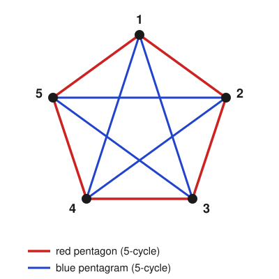

# Enumerative & Algebraic Combinatorics · Lesson 4.3: Ramsey theory

> ⏱ ~15 min · Module 4: Bijective proof, pigeonhole & Ramsey · Builds on: [4.2 (pigeonhole)](04-02-pigeonhole.md) · Unlocks: 5.1 (posets, lattices, chains & antichains)

## Why this matters

Pigeonhole (Lesson 4.2) forces *one* coincidence from a counting bound. Ramsey theory forces an entire *ordered substructure* from nothing but size — "complete disorder is impossible." The slogan version is the party puzzle: among any six people, three are mutual acquaintances or three are mutual strangers, and no smaller party guarantees it. That "you can't avoid all patterns forever" phenomenon runs through logic, number theory (Schur's theorem, van der Waerden's theorem on arithmetic progressions), and theoretical CS (lower bounds that say some structure is unavoidable). Here it's the capstone of the counting toolkit: a proof engine built almost entirely out of pigeonhole.

## The idea

Take $n$ dots and draw *every* line between them — the complete graph $K_n$. Now color each line one of two colors, say red and blue, however maliciously you like. Ramsey's insight: once $n$ is large enough, you *cannot* stop a monochromatic clique from appearing — a set of vertices with all internal edges the same color. Disorder has a ceiling.

The party version is exactly this with $s = t = 3$: people are vertices, "acquainted" is a red edge, "strangers" is a blue edge, and a monochromatic triangle is three mutual acquaintances or three mutual strangers. The magic number is six. With only five people you *can* dodge it — arrange the acquaintances in a pentagon and the strangers in a pentagram — but the sixth person breaks the spell. The whole game is pinning down that threshold.

## The formal version

**Definition (2-coloring).** A **2-coloring** of $K_n$ assigns each edge one of two colors (red/blue). A **monochromatic $K_s$** is a set of $s$ vertices whose $\binom{s}{2}$ connecting edges are all the same color.

**Definition (Ramsey number).** $R(s,t)$ is the least integer $n$ such that *every* 2-coloring of the edges of $K_n$ contains a red $K_s$ **or** a blue $K_t$.

*In words:* $R(s,t)$ is the smallest crowd in which you can no longer avoid both an $s$-clique of red and a $t$-clique of blue. Below it, some clever coloring escapes; at it, escape is impossible.

By symmetry (swap the two colors) $R(s,t) = R(t,s)$, and $R(s,2) = s$ (a blue $K_2$ is a single blue edge, so either some edge is blue or the whole thing is red $K_s$).

### The party number: $R(3,3) = 6$

This has two halves — an upper bound (6 always works) and a lower bound (5 doesn't).

**Upper bound, $R(3,3) \le 6$.** Take any 2-coloring of $K_6$ and fix one vertex $v$. It has $5$ edges in $2$ colors, so by the generalized pigeonhole (Lesson 4.2) at least $\lceil 5/2 \rceil = 3$ of them share a color — say $v$ is joined in **red** to three vertices $a, b, c$. Now look at the three edges *among* $a, b, c$:

- If **any** of $ab, bc, ca$ is red, that edge together with $v$ closes a **red triangle**.
- If **none** is red, then $ab, bc, ca$ are all blue — a **blue triangle**.

Either way a monochromatic triangle appears. So six vertices always force one.

**Lower bound, $R(3,3) > 5$.** Exhibit one coloring of $K_5$ with *no* monochromatic triangle. Put the five vertices on a circle. Color the five "pentagon" edges (neighbors on the circle) red and the five "pentagram" edges (the skips) blue — see the Picture. The red edges form a single 5-cycle and the blue edges form another 5-cycle; a 5-cycle contains no triangle, so neither color has one. Five vertices can dodge the pattern.

Together: $R(3,3) = 6$. $\blacksquare$

### The general bound

The same "fix a vertex, pigeonhole its edges" move recurses.

**Erdős–Szekeres recurrence.** For $s, t \ge 2$,
$$R(s,t) \le R(s-1,t) + R(s,t-1).$$

*In words:* the threshold for $(s,t)$ is no worse than the sum of the two thresholds one step down.

*Proof.* Let $n = R(s-1,t) + R(s,t-1)$ and fix a vertex $v$ in a 2-colored $K_n$. Its $n-1$ edges split into red neighbors (set $A$) and blue neighbors (set $B$), and $|A| + |B| = n - 1 = R(s-1,t) + R(s,t-1) - 1$. If both $|A| \le R(s-1,t) - 1$ and $|B| \le R(s,t-1) - 1$ held, they'd sum to $\le n - 2$, too small — so **at least one** is large: either $|A| \ge R(s-1,t)$ or $|B| \ge R(s,t-1)$.

Say $|A| \ge R(s-1,t)$. By definition, $A$ already contains a blue $K_t$ (done) or a red $K_{s-1}$ — and every vertex of $A$ is joined to $v$ in red, so that red $K_{s-1}$ plus $v$ is a red $K_s$. The blue-heavy case is symmetric. $\blacksquare$

With the base cases $R(s,2) = s$, $R(2,t) = t$, this recurrence plus Pascal's rule (Lesson 1.2) gives the clean closed bound:

**Binomial bound.** For $s, t \ge 2$,
$$R(s,t) \le \binom{s+t-2}{s-1}.$$

*Proof by induction on $s+t$.* Base: $R(s,2) = s = \binom{s}{s-1}$ ✓. Step: by the recurrence and the inductive hypothesis,
$$R(s,t) \le R(s-1,t) + R(s,t-1) \le \binom{s+t-3}{s-2} + \binom{s+t-3}{s-1} = \binom{s+t-2}{s-1},$$
the last equality being Pascal's rule. $\blacksquare$

For $s = t = 3$ this reads $R(3,3) \le \binom{4}{2} = 6$ — recovering the upper bound with zero case-work.

**Ramsey's theorem (existence).** For every $s, t$, the number $R(s,t)$ is **finite** — the binomial bound is an explicit finite ceiling, so the threshold always exists. (The full theorem goes further: it holds for any number of colors and for coloring $k$-subsets rather than edges. We use only the 2-color edge case.)

*The catch:* these are *bounds*, and known exact values are pitifully few. $R(4,4) = 18$, but $R(5,5)$ is only known to lie in $[43, 48]$. Erdős's quip: if aliens demanded $R(5,5)$ or they destroy Earth, marshal every computer and mathematician; if they asked for $R(6,6)$, better to attack the aliens.

## Picture

The $K_5$ coloring with no monochromatic triangle: red edges trace the outer **pentagon**, blue edges the inner **pentagram**. Each color is a single 5-cycle, and a 5-cycle has no triangle — so neither color closes one. This is the explicit witness that $R(3,3) > 5$.

## Worked examples

**Example 1 (mechanical — reading a bound off the formula).** Bound $R(3,4)$. The recurrence gives $R(3,4) \le R(2,4) + R(3,3) = 4 + 6 = 10$, and the binomial bound agrees: $\binom{3+4-2}{3-1} = \binom{5}{2} = 10$. So *nine or ten* vertices certainly force a red triangle or a blue $K_4$. (The true value is $R(3,4) = 9$; the bound is close but not tight — a reminder that Ramsey bounds usually overshoot.)

**Example 2 (why you'd care — a guarantee out of thin air).** Six computers are pairwise connected, each link running on one of two frequency bands. Must there be three machines all mutually linked on the *same* band? Yes, unconditionally: this is $R(3,3) = 6$ verbatim — vertices are computers, colors are bands, a monochromatic triangle is three machines sharing a band pairwise. No assumption about *how* the bands were assigned is needed; six is simply past the disorder ceiling. With five machines the pentagon/pentagram assignment shows the guarantee can fail, so six is exactly the design threshold.

## Watch out

- You might think $R(s,t)$ is the size that *forces* a monochromatic clique of size $\max(s,t)$ — but the two colors have **separate** targets. $R(s,t)$ forces a **red** $K_s$ *or* a **blue** $K_t$; the required clique sizes and the colors are locked together. Only when $s = t$ do the two collapse into one "monochromatic $K_s$" statement.
- You might think proving $R(3,3) = 6$ needs only the $K_6$ argument — but that's *half*. The upper bound ("6 suffices") and the lower bound ("5 fails," via an explicit coloring) are separate obligations; skip the pentagon construction and you've only shown $R(3,3) \le 6$, not equality.
- You might think a bigger $n$ could somehow *lose* a forced clique — but Ramsey numbers are **monotone**: if $K_n$ forces the pattern, so does every $K_m$ with $m \ge n$ (delete extra vertices to recover the $K_n$ coloring). "Least $n$" in the definition is what makes $R(s,t)$ a sharp threshold, not just some sufficient size.

## One-liner

> Color the edges of a big enough complete graph any way you like — order wins anyway; $R(s,t)$ is exactly where you run out of room to hide it, and $R(3,3) = 6$.

## Problems

**P1 (🟢)** Prove $R(2,t) = t$ directly from the definition: (a) show every 2-coloring of $K_t$ has a red $K_2$ or a blue $K_t$, and (b) exhibit a coloring of $K_{t-1}$ with neither, so $t$ is least.

**P2 (🟡)** Prove the symmetry $R(s,t) = R(t,s)$ from the definition — no formulas, just the right observation about a coloring. Then use it plus the recurrence to bound $R(4,4)$ from $R(3,4) \le 10$; what do you get, and how does it compare to the binomial bound $\binom{6}{3}$?

**P3 (🔴, optional)** Strengthen the $K_6$ result: show every 2-coloring of $K_6$ contains **at least two** monochromatic triangles. *Hint:* call a vertex-of-a-triangle "bichromatic" if its two edges in that triangle differ in color; count bichromatic corners two ways.

Solutions

**P1** (a) Take any 2-coloring of $K_t$. If some edge is red, its two endpoints form a red $K_2$ and we're done. Otherwise *every* edge is blue, so all $t$ vertices form a blue $K_t$. Either way the pattern appears, so $R(2,t) \le t$.

(b) Color every edge of $K_{t-1}$ blue. There is no red edge, hence no red $K_2$; and there are only $t-1 < t$ vertices, so no blue $K_t$. This coloring escapes, so $t-1$ is not enough and $R(2,t) \ge t$. Combining, $R(2,t) = t$. $\blacksquare$

**P2** *Symmetry.* Suppose $R(s,t) = n$. Take any 2-coloring $C$ of $K_n$ and build $C'$ by swapping red $\leftrightarrow$ blue. A red $K_s$ in $C'$ is a blue $K_s$ in $C$, and a blue $K_t$ in $C'$ is a red $K_t$ in $C$. So "every coloring has a red $K_t$ or blue $K_s$" (the $R(t,s)$ condition) holds at $n$ iff the $R(s,t)$ condition does — the color names are just labels. Hence $R(t,s) = R(s,t)$. $\blacksquare$

*Bounding $R(4,4)$.* By the recurrence and symmetry, $R(4,4) \le R(3,4) + R(4,3) = 2\,R(3,4) \le 2 \cdot 10 = 20$. The binomial bound is $\binom{4+4-2}{4-1} = \binom{6}{3} = 20$ — identical here. (Both overshoot the true value $R(4,4) = 18$.)

**P3** Let the red degree of vertex $v$ be $r_v$, so its blue degree is $5 - r_v$ (each of $6$ vertices has $5$ incident edges). A triangle is **non-monochromatic** iff exactly two of its three corners are "bichromatic" (a corner is bichromatic when its two triangle-edges differ in color) — trace the colors around the triangle: a $2$–$1$ split of edge-colors produces exactly two such corners, while a $3$–$0$ split (monochromatic) produces none.

Count bichromatic corners globally. At vertex $v$, a bichromatic corner needs one red and one blue incident edge, so the number of such corners at $v$ is $r_v(5 - r_v)$. Over integers $0 \le r_v \le 5$, the product $r_v(5 - r_v)$ is maximized at $r_v \in \{2,3\}$, giving $6$. Summing over all $6$ vertices, the total number of bichromatic corners is
$$\sum_v r_v(5 - r_v) \le 6 \cdot 6 = 36.$$
Since each non-monochromatic triangle owns exactly two bichromatic corners, the number of non-monochromatic triangles is $\tfrac{1}{2}\sum_v r_v(5-r_v) \le 18$. There are $\binom{6}{3} = 20$ triangles in all, so the number of monochromatic ones is at least $20 - 18 = 2$. $\blacksquare$

## Flashback

**From Lesson 4.2 (pigeonhole):** Five points are placed anywhere inside a closed equilateral triangle of side length $1$. Prove that some two of them are within distance $\tfrac{1}{2}$ of each other.

Solution

Cut the triangle into four congruent smaller equilateral triangles by joining the midpoints of its three sides; each small triangle has side length $\tfrac{1}{2}$. These four regions are the pigeonholes and the five points are the pigeons, so by the basic pigeonhole principle (Lesson 4.2) at least two points, say $P$ and $Q$, lie in the *same* small triangle (points on a shared boundary may be assigned to either — pick one).

Two points inside a triangle are at most as far apart as its longest side (the diameter of a triangle is its largest side length), and each small triangle has all sides equal to $\tfrac{1}{2}$. Hence $|PQ| \le \tfrac{1}{2}$. $\blacksquare$

## Connections

- **Backward:** the entire engine is Lesson 4.2's pigeonhole — the $R(3,3) \le 6$ proof and the Erdős–Szekeres recurrence are both "fix a vertex, its edges pigeonhole into a color." Pascal's rule from Lesson 1.2 turns the recurrence into the closed $\binom{s+t-2}{s-1}$ bound.
- **Forward:** Module 5 shifts from "forced substructure" to "ordered structure by design." Lesson 5.1 (posets, chains & antichains) proves Dilworth's theorem, whose flavor — a size bound forcing a long chain or wide antichain — is the order-theoretic cousin of Ramsey's guarantee, and shares DNA with Lesson 4.2's Erdős–Szekeres monotone-subsequence theorem.
- **Sideways (graph theory):** `graph-theory` proves $R(3,3) = 6$ as a landmark of its own, phrased purely in cliques and independent sets. Here the very same theorem sits inside the *counting* toolkit — a reminder that a monochromatic clique is just a coincidence forced by size, the same way pigeonhole forces a repeated remainder.
