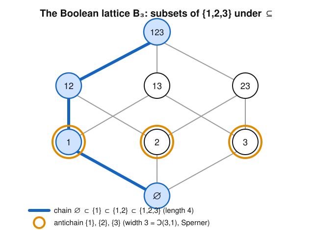

# Enumerative & Algebraic Combinatorics · Lesson 5.1: Posets, lattices, chains & antichains

> ⏱ ~15 min · Module 5: A taste of algebraic combinatorics · Builds on: [Lesson 4.2](04-02-pigeonhole.md) (extremal arguments, Erdős–Szekeres) · Unlocks: [Lesson 5.2](05-02-mobius-inversion.md) (Möbius inversion)

## Why this matters

So far we counted flat collections. But most of the objects you actually care about come pre-sorted by a *refinement* relation: one subset contains another, one integer divides another, one partition is coarser than another, one task must finish before another can start. A **partially ordered set** (poset) is the minimal structure that records "some pairs are comparable, some aren't" — and it turns out to be the right stage for the rest of algebraic combinatorics. Inclusion–exclusion, the number-theoretic Möbius function, and even Erdős–Szekeres are all *one theorem* once you see the poset underneath. This lesson builds that stage; Lesson 5.2 puts the machinery (Möbius inversion) on it.

## The idea

A **total order** — like the number line — is a single file: any two elements, you know which comes first. A **partial order** relaxes that: it's a branching hierarchy where some pairs are ordered and some are simply *incomparable*, neither above nor below the other. Think of the subsets of $\{1,2,3\}$ ordered by containment. Is $\{1,2\}$ "less than" $\{3\}$? No — but $\{3\}$ isn't less than $\{1,2\}$ either. They just don't compare.

Two shapes live inside every poset. A **chain** is a stack of elements each below the next — a straight climb up the hierarchy (like $\varnothing \subset \{1\} \subset \{1,2\} \subset \{1,2,3\}$). An **antichain** is a flat slice of mutually incomparable elements — a cross-section that never climbs (like $\{1\},\{2\},\{3\}$). The whole subject turns on the tug-of-war between these two: a poset that's hard to cover with few chains must contain a wide antichain, and vice versa. That's **Dilworth's theorem**, and it's the punchline.

## The formal version

**Definition (partial order).** A *partial order* on a set $P$ is a relation $\le$ that is
- **reflexive:** $x \le x$ for all $x$;
- **antisymmetric:** if $x \le y$ and $y \le x$ then $x = y$;
- **transitive:** if $x \le y$ and $y \le z$ then $x \le z$.

The pair $(P, \le)$ is a **poset**. We write $x < y$ for "$x \le y$ and $x \neq y$." Two elements are **comparable** if $x \le y$ or $y \le x$; otherwise **incomparable**.

*In words:* everything is $\le$ itself, two distinct things can't each be below the other, and "below" chains through — but nothing forces every pair to compare.

**Cover relation & Hasse diagram.** Say $y$ **covers** $x$, written $x \lessdot y$, if $x < y$ and no $z$ satisfies $x < z < y$ (nothing squeezes between). The **Hasse diagram** draws each element as a dot, places $y$ higher than $x$ whenever $x \lessdot y$, and connects covering pairs by a segment. All other relations are recovered by reading upward through the diagram (transitivity), so we never draw them.

**Two running examples.**
- The **Boolean lattice** $B_n$: all subsets of $\{1,\dots,n\}$ ordered by $\subseteq$. Here $A \lessdot B$ means $B = A \cup \{i\}$ for one new element $i$.
- The **divisor lattice** $D_n$: the positive divisors of $n$ ordered by divisibility, $a \le b \iff a \mid b$. Here $a \lessdot b$ means $b = a\cdot p$ for a single prime $p$.

**Chain & antichain.** A **chain** is a subset of $P$ that is totally ordered (every two elements comparable). An **antichain** is a subset in which every two distinct elements are incomparable. The length of the longest chain is the **height**; the size of the largest antichain is the **width**.

**Meet, join, lattice.** The **meet** $x \wedge y$ is the greatest lower bound: the largest $z$ with $z \le x$ and $z \le y$, if it exists. The **join** $x \vee y$ is the least upper bound. A poset is a **lattice** if *every* pair has both a meet and a join.

*In words:* meet = "biggest thing below both," join = "smallest thing above both." In $B_n$ these are exactly $A \wedge B = A \cap B$ and $A \vee B = A \cup B$; in $D_n$ they are $a \wedge b = \gcd(a,b)$ and $a \vee b = \operatorname{lcm}(a,b)$. (Both $B_n$ and $D_n$ are genuine lattices — every pair delivers.)

**Dilworth's theorem.** In a finite poset, the minimum number of chains needed to cover every element equals the maximum size of an antichain (the width).

*In words:* if the widest incomparable slice has $w$ elements, you can partition the whole poset into exactly $w$ chains — no more, no fewer.

**Mirsky's theorem (the dual).** The minimum number of antichains needed to cover the poset equals the length of the longest chain (the height).

**Sperner's theorem** (stated, proved via these ideas later). The largest antichain in $B_n$ has size $\binom{n}{\lfloor n/2\rfloor}$ — realized by taking all subsets of the middle size.

## Picture

Every subset of $\{1,2,3\}$ sits at a height equal to its size. The blue path is a **maximal chain** — one element added at each step, length $4$. The three amber-ringed singletons form an **antichain** of size $3$; so does the middle row $\{1,2\},\{1,3\},\{2,3\}$. Sperner says you can't do better than $\binom{3}{1}=3$. Notice the chain meets the antichain in exactly *one* node ($\{1\}$) — that's no accident, and it's the key to the easy half of Dilworth (Problem 2).

## Worked examples

**Example 1 (mechanical — read a divisor lattice).** Take $D_{12}$: divisors $\{1,2,3,4,6,12\}$ under $\mid$. Cover relations: $1\lessdot 2,\ 1\lessdot 3,\ 2\lessdot 4,\ 2\lessdot 6,\ 3\lessdot 6,\ 4\lessdot 12,\ 6\lessdot 12$. (Note $2$ does *not* cover $12$: the chain $2 \lessdot 4 \lessdot 12$ already squeezes $4$ between them, so no segment is drawn from $2$ to $12$.)

- **A maximal chain:** $1 \mid 2 \mid 4 \mid 12$, length $4$.
- **Meet and join:** $4 \wedge 6 = \gcd(4,6) = 2$ and $4 \vee 6 = \operatorname{lcm}(4,6) = 12$.
- **Width.** Is there an antichain of size $3$? The candidates in the "middle," $4$ and $6$, are incomparable ($4\nmid 6$, $6\nmid 4$) — an antichain of size $2$. But any third divisor either divides one of them ($2\mid 4$, $1$, $3\mid 6$) or is divided by them ($12$). So the width is $\mathbf{2}$.
- **Dilworth in action:** because the width is $2$, the six divisors split into exactly $2$ chains — e.g. $\{1,2,4,12\}$ and $\{3,6\}$. Two chains cover everything; the incomparable pair $\{4,6\}$ shows you can't do it with one.

**Example 2 (why you'd care — Erdős–Szekeres *is* Dilworth).** You proved in [Lesson 4.2](04-02-pigeonhole.md), by pigeonhole, that any sequence of $rs+1$ distinct reals has an increasing subsequence of length $r+1$ or a decreasing one of length $s+1$. Here is the *poset* proof. Given the sequence $a_1,\dots,a_N$, put a partial order on the index set by
$$i \preceq j \quad\iff\quad i \le j \ \text{ and }\ a_i \le a_j.$$
This is reflexive, antisymmetric, and transitive — a poset. Now:
- a **chain** is a set of indices increasing in both position and value — i.e. an **increasing subsequence**;
- an **antichain** is a set of indices with $i<j$ but $a_i > a_j$ throughout — i.e. a **strictly decreasing subsequence**.

Suppose the longest increasing subsequence has length $\le r$ (height $\le r$). By **Mirsky**, the $N$ indices split into $\le r$ antichains, i.e. $\le r$ decreasing subsequences. If also every decreasing subsequence has length $\le s$, those $r$ antichains hold $\le rs$ indices total — so $N \le rs$. Contrapositive: $N \ge rs+1$ forces an increasing run of $r+1$ or a decreasing run of $s+1$. Same theorem, now a two-line corollary of a structural fact about posets.

## Watch out

- **Incomparable is about the *order*, not the picture.** You might think two dots with no segment between them form an antichain — but a Hasse diagram only draws *covers*. In the chain $a \lessdot b \lessdot c$, the dots $a$ and $c$ have no direct segment, yet $a < c$ by transitivity, so $\{a,c\}$ is a **chain**, not an antichain. Always test comparability through the full relation.
- **Maximal $\neq$ maximum.** A *maximal* element has nothing strictly above it; a *maximum* (greatest) element is above *everything*. In $D_{12}$, $12$ is both. But in the poset $\{a,b\}$ with $a,b$ incomparable, both are maximal and *neither* is a maximum. Partial orders routinely have several maximal elements and no top at all.
- **Not every poset is a lattice.** $B_n$ and $D_n$ hand you meets and joins for free, but a general poset need not. Two incomparable maximal elements have *no* upper bound, hence no join — that poset isn't a lattice.
- **Dilworth pairs chains with antichains; Mirsky pairs antichains with chains — don't cross the wires.** Width (antichain size) $=$ min *chain* cover (Dilworth). Height (chain length) $=$ min *antichain* cover (Mirsky). Swap them and you'll "prove" false bounds.

## One-liner

> A poset is a hierarchy of refinement, and its whole tension is Dilworth's: the fewest chains that cover it equals the widest antichain inside it.

## Problems

**P1 (🟢)** Work in $D_{30}$, the divisors of $30 = 2\cdot 3\cdot 5$ under divisibility. (a) List all divisors and their heights (a divisor's height = its number of prime factors, counted with multiplicity). (b) Give one maximal chain. (c) Find the width, exhibit a maximum antichain, and cover $D_{30}$ with that many chains (Dilworth). (d) Compute $6 \wedge 10$ and $6 \vee 10$. *(Bonus: convince yourself $D_{30}$ is "the same poset as" $B_3$.)*

**P2 (🟡)** Prove the **easy half of Dilworth**: in any finite poset, a chain and an antichain share at most one element, and conclude that if the width is $w$ then you need *at least* $w$ chains to cover the poset. (This is the direction you can prove in three lines; the reverse — that $w$ chains always suffice — is the deep half.)

**P3 (🔴, optional)** Prove **Mirsky's theorem** constructively. For each element $x$, let $h(x)$ be the length of the longest chain whose top is $x$. Show that (i) $h$ takes finitely many values $1,2,\dots,H$ where $H$ is the height, (ii) each "level set" $A_k = \{x : h(x) = k\}$ is an antichain, and (iii) therefore the poset is covered by exactly $H$ antichains — and no fewer, since a single chain of length $H$ needs $H$ distinct antichains.

Solutions

**P1** (a) Divisors of $30$: $1,2,3,5,6,10,15,30$. Heights (prime-factor counts): $h(1)=0$; $h(2)=h(3)=h(5)=1$; $h(6)=h(10)=h(15)=2$; $h(30)=3$. The poset ranks into four levels of sizes $1,3,3,1$.

(b) A maximal chain: $1 \mid 2 \mid 6 \mid 30$ (add one prime at each step), length $4$.

(c) The middle levels have $3$ elements each and each is an antichain — e.g. the primes $\{2,3,5\}$ (no one divides another), or $\{6,10,15\}$. No antichain can beat $3$: by Dilworth it suffices to cover $D_{30}$ with $3$ chains, which pins the width at exactly $\mathbf{3}$ (Sperner: $\binom{3}{1}=3$). A covering by $3$ chains:
$$1\mid 2\mid 6\mid 30, \qquad 3\mid 15, \qquad 5\mid 10.$$
All eight divisors appear, three chains — matching the width.

(d) $6\wedge 10=\gcd(6,10)=2$ and $6\vee 10=\operatorname{lcm}(6,10)=30$.

*(Bonus.)* Map each divisor to its set of prime factors: $1\mapsto\varnothing$, $2\mapsto\{2\}$, $6\mapsto\{2,3\}$, $30\mapsto\{2,3,5\}$, etc. Divisibility becomes $\subseteq$, $\gcd$ becomes $\cap$, $\operatorname{lcm}$ becomes $\cup$ — an order-isomorphism $D_{30}\cong B_3$. (This works for any squarefree $n$ with $3$ prime factors; it fails once a prime is repeated, e.g. $D_{12}$, whose exponent structure isn't a pure Boolean cube.)

**P2** Let $C$ be a chain and $A$ an antichain, and suppose $x,y \in C\cap A$ with $x\neq y$. Since $x,y\in C$ and $C$ is a chain, $x,y$ are comparable — say $x<y$. But $x,y\in A$ and $A$ is an antichain, so $x,y$ must be incomparable — contradiction. Hence $|C\cap A|\le 1$. $\blacksquare$

Now take a maximum antichain $A$ with $|A|=w$, and any cover of the poset by chains $C_1,\dots,C_m$. Every element of $A$ lies in some $C_i$, and by the claim each $C_i$ contains at most one element of $A$. So the $w$ elements of $A$ need $w$ distinct chains: $m \ge w$. Thus any chain cover uses at least $w$ chains. $\blacksquare$

**P3** (i) Every $x$ tops at least the length-$1$ chain $\{x\}$, so $h(x)\ge 1$; and no chain exceeds the height $H$, so $1\le h(x)\le H$. Some element tops a longest chain, so the value $H$ is attained — $h$ takes exactly the values $1,\dots,H$.

(ii) Suppose $x,y\in A_k$ are comparable, say $x<y$. Take a longest chain ending at $x$; it has length $h(x)=k$. Appending $y$ (legal since $x<y$) gives a chain ending at $y$ of length $k+1$, so $h(y)\ge k+1 > k$, contradicting $y\in A_k$. Hence no two elements of $A_k$ compare: $A_k$ is an antichain.

(iii) The sets $A_1,\dots,A_H$ partition $P$ (every $x$ lands in exactly one, namely $A_{h(x)}$), so $P$ is covered by $H$ antichains. It cannot be fewer: fix a chain $x_1<x_2<\dots<x_H$ of length $H$; by P2's claim each antichain contains at most one $x_i$, so covering these $H$ elements needs $H$ antichains. Therefore the minimum antichain cover equals $H$, the height. $\blacksquare$

## Flashback

**From [Lesson 4.2](04-02-pigeonhole.md) (Pigeonhole & Erdős–Szekeres):** Show that any sequence of $10$ distinct real numbers contains a monotone subsequence — increasing or decreasing — of length $4$. (Then note where the number $10$ is tight.)

Solution

Label each term $a_i$ with the pair $(u_i, d_i)$, where $u_i$ is the length of the longest **increasing** subsequence *ending* at $a_i$ and $d_i$ the length of the longest **decreasing** subsequence ending at $a_i$. Both are $\ge 1$.

**Claim: distinct terms get distinct labels.** Take $i<j$. If $a_i < a_j$, then any increasing subsequence ending at $a_i$ extends by $a_j$, so $u_j \ge u_i+1 > u_i$. If $a_i > a_j$, then similarly $d_j \ge d_i+1 > d_i$ (the numbers are distinct, so these are the only cases). Either way $(u_i,d_i)\neq(u_j,d_j)$.

Now suppose, for contradiction, that *no* monotone subsequence reaches length $4$. Then every $u_i$ and every $d_i$ lies in $\{1,2,3\}$, so each label $(u_i,d_i)$ is one of only $3\times 3 = 9$ possible pairs. We have $10$ terms but only $9$ available labels, so by pigeonhole two terms share a label — contradicting the claim. Hence some $u_i \ge 4$ or some $d_i \ge 4$: a monotone subsequence of length $4$ exists. $\blacksquare$

**Tightness.** With only $9 = 3^2$ terms the bound can fail: arrange three decreasing blocks of three, each block increasing and placed above the next, e.g. $3,2,1,\ 6,5,4,\ 9,8,7$. The longest increasing subsequence has length $3$ (one from each block) and the longest decreasing has length $3$ (within a block) — no monotone run of $4$. So $10$ is the smallest guarantee, exactly $(4-1)^2 + 1$.

## Connections

- **Backward ([Lesson 4.2](04-02-pigeonhole.md)):** Erdős–Szekeres, which you cracked by pigeonhole, is really a corollary of Mirsky — the poset lens makes the "increasing vs. decreasing" trade-off a chain-vs-antichain trade-off. The subsets of $B_n$ are the same objects Module 1 counted; now they carry an order.
- **Forward ([Lesson 5.2](05-02-mobius-inversion.md)):** Möbius inversion is defined on *any* locally finite poset. The Boolean lattice $B_n$ recovers inclusion–exclusion and the divisor lattice $D_n$ recovers the number-theoretic Möbius function — this lesson built both stages.
- **Sideways (number theory):** the divisor lattice $D_n$ is the bridge — divisibility *is* a partial order, $\gcd/\operatorname{lcm}$ are its meet/join, and the [number-theory](../../number-theory/syllabus.md) Möbius function will fall out of $D_n$ in the next lesson.
- **Sideways (CS / optimization):** Dilworth's theorem is a duality (min chain cover $=$ max antichain) of the same flavor as max-flow/min-cut and König's theorem; "minimum chain cover of a DAG" is a standard bipartite-matching problem, and posets model type hierarchies, dependency graphs, and task scheduling.
