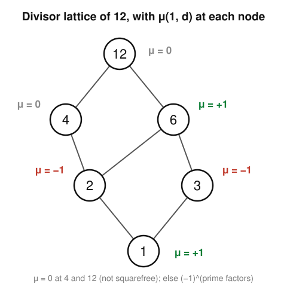

# Enumerative & Algebraic Combinatorics · Lesson 5.2: Möbius inversion on a poset

> ⏱ ~15 min · Module 5: A taste of algebraic combinatorics · Builds on: [Lesson 5.1](05-01-posets-lattices-chains-antichains.md) (posets & lattices), [Lesson 1.3](01-03-inclusion-exclusion.md) (inclusion–exclusion) · Unlocks: [Lesson 5.3](05-03-symmetric-functions.md) (symmetric functions)

## Why this matters

You have already met two "inversion" tricks that look unrelated. Inclusion–exclusion ([Lesson 1.3](01-03-inclusion-exclusion.md)) recovers "how many objects have *none* of these properties" from the easy over-counts. In number theory, the classical Möbius function inverts a sum over divisors: from $g(n)=\sum_{d\mid n} f(d)$ you can solve back for $f$. This lesson shows these are **the same theorem**, run on two different partially ordered sets. Once you see that, you get a single formula — Möbius inversion — that manufactures a sieve for *any* poset you can draw, which is exactly how algebraic combinatorics turns "sum over a structure" into "solve for the structure."

## The idea

Fix a poset $P$ (a set with a partial order $\le$; recall [Lesson 5.1](05-01-posets-lattices-chains-antichains.md)). Suppose you know a "cumulative" quantity
$$g(x) = \sum_{y \le x} f(y),$$
the running total of some unknown $f$ over everything at or below $x$. You want $f$ back. On the number line this is just "un-summing": $f(x) = g(x) - g(x-1)$. On a general poset there is no single "$x-1$" — many elements sit just below $x$, and they overlap. **Möbius inversion** is the correct difference operator for that tangled situation: it attaches a weight $\mu(y,x)$ to each $y \le x$ so that all the over-counting cancels and $f(x)$ pops back out.

The weights $\mu(y,x)$ are forced on you, not chosen. Demand that summing $\mu$ up any interval collapses to "nothing survives except the top," and the values are determined one rank at a time, bottom-up. On the Boolean lattice of subsets those weights turn out to be $(-1)^{\text{size}}$ — the signs of inclusion–exclusion. On the lattice of divisors they turn out to be the number theorist's $\mu(d)$. Same machine, two dials.

## The formal version

Assume $P$ is **locally finite**: every interval $[x,y] = \{z : x \le z \le y\}$ is finite (so the sums below are real sums). Work with functions of *two* variables $\alpha(x,y)$ defined only when $x \le y$ — think of $\alpha(x,y)$ as a label on the interval $[x,y]$. These form the **incidence algebra**, with multiplication given by *convolution*:
$$(\alpha * \beta)(x,y) \;=\; \sum_{x \le z \le y} \alpha(x,z)\,\beta(z,y).$$

*In words:* to multiply two interval-labels, split the interval $[x,y]$ at every midpoint $z$ and add up the products.

The identity for this product is the **delta function** $\delta(x,y) = [x=y]$ (1 if $x=y$, else 0), using the Iverson bracket $[\,\cdot\,]$.

Two special elements live here:

- The **zeta function** $\zeta(x,y) = 1$ for all $x \le y$. Convolving by $\zeta$ *is* summation: $(f * \zeta)$ over a one-variable $f$ reproduces $g(x)=\sum_{y\le x} f(y)$.
- The **Möbius function** $\mu$ is *defined* as the convolution inverse of $\zeta$: $\mu * \zeta = \delta$. Spelled out, that is the recursion

$$\boxed{\;\sum_{x \le z \le y} \mu(x,z) \;=\; [x=y]\;}$$

*In words:* the Möbius weights over an interval must sum to $0$ — unless the interval is a single point, where the sum is $1$. This pins them down bottom-up:
$$\mu(x,x) = 1, \qquad \mu(x,y) = -\!\!\sum_{x \le z < y} \mu(x,z) \quad (x < y).$$
Each new value is *minus the sum of everything strictly below it in the interval.*

**Theorem (Möbius inversion).** For functions $f,g : P \to \mathbb{R}$,
$$g(x) = \sum_{y \le x} f(y) \quad\Longleftrightarrow\quad f(x) = \sum_{y \le x} \mu(y,x)\, g(y).$$

*In words:* if $g$ is the down-set sum of $f$, then $f$ is recovered by the same sum re-weighted with $\mu$ — and vice versa. (Proof: $g = f*\zeta$, so $f = g*\mu$ because $\zeta*\mu=\delta$. The abstract inverse *is* the concrete formula.)

## Picture

Read $\mu(1,d)$ off the diagram by the recursion. Start at $1$ with $\mu=+1$. At each higher node, add up the $\mu$'s of everything strictly below it *inside the interval from $1$*, and negate. At $6$ the elements below are $1,2,3$ with $\mu$'s $+1,-1,-1$ summing to $-1$, so $\mu(1,6)=+1$. At $12$ the elements below are $1,2,3,4,6$ with $\mu$'s $+1,-1,-1,0,+1$ summing to $0$, so $\mu(1,12)=0$.

## Worked examples

**Example 1 (the divisor lattice of 12 = the classical $\mu$).** Order the divisors $\{1,2,3,4,6,12\}$ of $12$ by divisibility ($a \le b$ means $a \mid b$). Compute $\mu(1,d)$ bottom-up:
$$\mu(1,1)=1,\quad \mu(1,2)=-\mu(1,1)=-1,\quad \mu(1,3)=-1,$$
$$\mu(1,4)=-\big(\mu(1,1)+\mu(1,2)\big)=-(1-1)=0,$$
$$\mu(1,6)=-\big(\mu(1,1)+\mu(1,2)+\mu(1,3)\big)=-(1-1-1)=1,$$
$$\mu(1,12)=-\big(1-1-1+0+1\big)=0.$$
Now compare to the **number-theoretic Möbius function** $\mu(d)$: $\mu(d)=0$ if $d$ is divisible by a square, else $(-1)^{(\text{number of distinct prime factors})}$. That gives $\mu(1)=1,\ \mu(2)=\mu(3)=-1,\ \mu(4)=0,\ \mu(6)=+1,\ \mu(12)=0$ — **identical**. This is no coincidence: in a divisor lattice $\mu(a,b)$ depends only on the quotient $b/a$, and equals the classical $\mu(b/a)$. The bridge to `number-theory` is exact — the divisor lattice is where the number-theoretic $\mu$ *lives*, and its "nonzero only on squarefree" law is just the appearance of a repeated-prime rank (like $4$ or $12$) where the interval below is a chain that cancels to $0$.

**Example 2 (the Boolean lattice = inclusion–exclusion).** Let $B_n$ be the poset of all subsets of $\{1,\dots,n\}$ ordered by $\subseteq$. Claim: $\mu(\varnothing,S)=(-1)^{|S|}$. Check the recursion on the interval $[\varnothing,S]$ — its elements are all subsets $T\subseteq S$:
$$\sum_{T\subseteq S}(-1)^{|T|}=\sum_{k=0}^{|S|}\binom{|S|}{k}(-1)^k=(1-1)^{|S|}=[\,S=\varnothing\,],$$
by the binomial theorem — exactly the defining recursion, so $\mu(\varnothing,S)=(-1)^{|S|}$ is correct. Now feed it into Möbius inversion. Given properties $P_1,\dots,P_n$, let $f(S)$ = number of objects with *exactly* the property-set $S$, and $g(S)=\sum_{T\supseteq S}(\dots)$ the "at least $S$" over-count. Inversion returns the count with **no** properties as an alternating sum $\sum_S (-1)^{|S|}(\text{at-least-}S)$ — which is precisely the inclusion–exclusion formula from [Lesson 1.3](01-03-inclusion-exclusion.md). Inclusion–exclusion *is* Möbius inversion on $B_n$; the signs you memorized are the Möbius function.

## Watch out

- You might think $\mu(x,y)$ depends on the whole poset — but it depends **only on the interval $[x,y]$**. Two intervals that are order-isomorphic have identical $\mu$. That is why $\mu(a,b)$ in a divisor lattice cares only about $b/a$: every interval $[a,b]$ looks like the divisor lattice of $b/a$.
- You might think $\mu \in \{0,\pm 1\}$ always, because it does on Boolean and divisor lattices. Not so — on the partition lattice, for instance, $\mu$ takes values like $\pm 2$. The $0/\pm1$ pattern is special to these two families.
- You might think the "$\sum_{y\le x}$" and "$\sum_{y\ge x}$" versions are interchangeable. They are two genuinely different inversions (down-set vs. up-set); using the wrong direction gives $\mu$ evaluated as $\mu(x,y)$ vs. $\mu(y,x)$, and the two agree only because these posets are self-dual-ish. State which end you sum from.

## One-liner

> Möbius inversion is "un-summing" over any poset: the weights $\mu(y,x)$ are forced by $\sum_{[x,y]}\mu=[x{=}y]$, and they specialize to the signs of inclusion–exclusion on $B_n$ and to number theory's $\mu(d)$ on the divisor lattice.

## Problems

**P1 (🟢)** In the divisor lattice of $n=30$ (divisors ordered by divisibility), compute $\mu(1,d)$ for every divisor $d$ directly from the recursion, and confirm each equals the classical number-theoretic $\mu(d)$.

**P2 (🟡, bridge to `number-theory`)** The divisor-lattice case of the theorem reads: if $g(n)=\sum_{d\mid n} f(d)$ then $f(n)=\sum_{d\mid n}\mu(n/d)\,g(d)$, with $\mu$ the classical Möbius function. It is a standard fact that $\sum_{d\mid n}\varphi(d)=n$, where $\varphi$ is Euler's totient. Use Möbius inversion to write $\varphi(n)$ as a sum over divisors, and evaluate it at $n=12$ (you should get $\varphi(12)=4$).

**P3 (🔴)** Show that in **any finite chain** $c_0 < c_1 < c_2 < \cdots$ the Möbius function is $\mu(c_i,c_i)=1$, $\mu(c_i,c_{i+1})=-1$, and $\mu(c_i,c_j)=0$ for $j>i+1$. Then explain why this forces the classical $\mu(p^k)=0$ for every prime $p$ and $k\ge 2$.

Solutions

**P1** Divisors of $30$: $1,2,3,5,6,10,15,30$. Bottom-up:
$\mu(1,1)=1$; $\mu(1,2)=\mu(1,3)=\mu(1,5)=-1$ (each interval below is just $\{1\}$).
$\mu(1,6)=-(\mu(1,1)+\mu(1,2)+\mu(1,3))=-(1-1-1)=1$; likewise $\mu(1,10)=1$ and $\mu(1,15)=1$.
$\mu(1,30)=-\big(\mu(1,1)+\mu(1,2)+\mu(1,3)+\mu(1,5)+\mu(1,6)+\mu(1,10)+\mu(1,15)\big)=-(1-1-1-1+1+1+1)=-1.$
Classical values: $\mu(1)=1$; $\mu(2)=\mu(3)=\mu(5)=-1$ (one prime); $\mu(6)=\mu(10)=\mu(15)=+1$ (two distinct primes); $\mu(30)=-1$ (three distinct primes). Every entry matches. $\blacksquare$

**P2** Apply the inversion formula with $g(n)=n$ (since $\sum_{d\mid n}\varphi(d)=n$) and $f=\varphi$:
$$\varphi(n)=\sum_{d\mid n}\mu(n/d)\,d \;=\; \sum_{e\mid n}\mu(e)\,\frac{n}{e}.$$
At $n=12$, run over $d\mid 12$ with the classical $\mu(12/d)$ from Example 1:
$$\varphi(12)=\underbrace{\mu(12)}_{0}\cdot 1+\underbrace{\mu(6)}_{+1}\cdot 2+\underbrace{\mu(4)}_{0}\cdot 3+\underbrace{\mu(3)}_{-1}\cdot 4+\underbrace{\mu(2)}_{-1}\cdot 6+\underbrace{\mu(1)}_{+1}\cdot 12$$
$$=0+2+0-4-6+12=4.$$
Indeed $\varphi(12)=|\{1,5,7,11\}|=4$. $\blacksquare$ (This is the standard route to $\varphi(n)=n\prod_{p\mid n}(1-\tfrac1p)$.)

**P3** In a chain the interval $[c_i,c_j]$ is itself the chain $c_i<c_{i+1}<\cdots<c_j$. Induct on $j-i$. Base: $\mu(c_i,c_i)=1$. For $j=i+1$: $\mu(c_i,c_{i+1})=-\mu(c_i,c_i)=-1$. For $j\ge i+2$, the recursion gives
$$\mu(c_i,c_j)=-\sum_{i\le m<j}\mu(c_i,c_m)=-\big(\mu(c_i,c_i)+\mu(c_i,c_{i+1})+\underbrace{0+\cdots+0}_{m\ge i+2}\big)=-(1-1)=0,$$
using the inductive hypothesis that all inner terms with $m\ge i+2$ already vanish. So only the diagonal and the first step above it are nonzero.
Now, the divisors of a prime power $p^k$ are $1\mid p\mid p^2\mid\cdots\mid p^k$ — a chain. Hence $\mu(1,p^k)=0$ for $k\ge 2$, and since the classical $\mu(p^k)$ equals this poset value, $\mu(p^k)=0$ for $k\ge 2$. That single fact, made multiplicative across primes, is *why* the number-theoretic $\mu$ vanishes on every non-squarefree integer. $\blacksquare$

## Flashback

**From [Lesson 1.3](01-03-inclusion-exclusion.md) (Inclusion–exclusion):** How many integers in $\{1,2,\dots,100\}$ are divisible by **none** of $2$, $3$, $5$?

Solution

Let $A_m=\{k\le 100 : m\mid k\}$, so $|A_m|=\lfloor 100/m\rfloor$. Count "divisible by at least one" by inclusion–exclusion:
$$|A_2\cup A_3\cup A_5|=\big(50+33+20\big)-\big(\lfloor\tfrac{100}{6}\rfloor+\lfloor\tfrac{100}{10}\rfloor+\lfloor\tfrac{100}{15}\rfloor\big)+\lfloor\tfrac{100}{30}\rfloor$$
$$=103-(16+10+6)+3=103-32+3=74.$$
Divisible by none: $100-74=\boxed{26}$. (This "avoid all properties" sieve is exactly the Boolean-lattice Möbius inversion of Example 2 — the $\pm$ pattern $+,-,+$ on singletons/pairs/triple is $(-1)^{|S|}$.) $\blacksquare$

## Connections

- **Backward:** this generalizes [Lesson 1.3](01-03-inclusion-exclusion.md) — inclusion–exclusion is Möbius inversion on the Boolean lattice $B_n$, with $\mu(\varnothing,S)=(-1)^{|S|}$ — and runs on the posets and lattices built in [Lesson 5.1](05-01-posets-lattices-chains-antichains.md).
- **Forward:** [Lesson 5.3](05-03-symmetric-functions.md) continues the algebraic-combinatorics tour; the "change of basis on a structure" instinct here (weights that invert a sum) reappears as transition matrices between symmetric-function bases.
- **Sideways (`number-theory`):** the classical Möbius function and its inversion $g(n)=\sum_{d\mid n}f(d)\iff f(n)=\sum_{d\mid n}\mu(n/d)g(d)$ are *literally* this lesson on the divisor lattice — see the divisibility and multiplicative-function material in the [number theory course](../../number-theory/syllabus.md). P2's $\varphi$ computation is that bridge in action.
