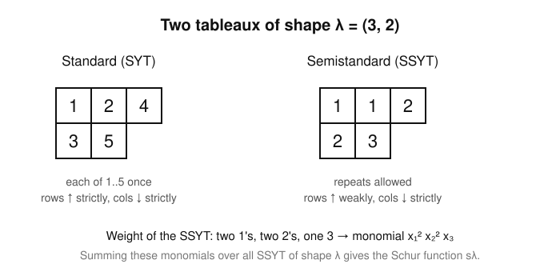

# Enumerative & Algebraic Combinatorics · Lesson 5.3: A taste of symmetric functions

> ⏱ ~15 min · Module 5: A taste of algebraic combinatorics · Builds on: [2.3](02-03-integer-partitions-ferrers.md), [5.2](05-02-mobius-inversion.md) · Unlocks: nothing — course complete 🎓

## Why this matters

Over and over this course, a partition of $n$ has quietly indexed something: conjugacy classes of permutations (2.1), integer partitions and their Ferrers diagrams (2.3), the terms of a generating-function identity. Symmetric functions are the **ring where all of those partitions live at once**, and where many separate combinatorial identities collapse into a *single* algebraic fact — "these two bases are related by this change of basis." It is also the exact place where combinatorics shakes hands with representation theory: the same objects that count tableaux are the **characters of the symmetric group $S_n$ and the general linear group $GL_n$**. This lesson is a taste — statements and tiny examples, no heavy machinery — but it points straight at the door marked `representation-theory`.

## The idea

A polynomial in $x_1, x_2, \dots, x_n$ is **symmetric** if shuffling the variables changes nothing: $x_1^2 + x_2^2 + x_3^2$ is symmetric (swap any two variables and you get the same thing), while $x_1^2 + x_2$ is not. Symmetric polynomials are exactly the quantities that don't care about the *names* of the variables, only about the multiset of their values — like the coefficients of a polynomial in terms of its roots (Vieta's formulas are the founding example).

There are several natural ways to *build* symmetric polynomials, and each gives a whole family — a **basis** — with one member for each partition $\lambda$. That's the punchline to carry: **fix a degree $n$; then each classical basis of degree-$n$ symmetric functions is indexed by the partitions of $n$**, so each has exactly $p(n)$ members (the partition count from [2.3](02-03-integer-partitions-ferrers.md)). Doing combinatorics in this ring means *changing basis*, and the change-of-basis numbers are the combinatorial content.

## The formal version

Work with polynomials in variables $x_1, x_2, \dots$ (as many as you like; "symmetric *function*" is the name for the stable-in-$n$ version). A polynomial is **symmetric** if it is unchanged under every permutation of the variables. We only ever need homogeneous pieces, so fix a degree $n$ and a partition $\lambda = (\lambda_1 \ge \lambda_2 \ge \cdots \ge \lambda_\ell)$ with $\lambda_1 + \cdots + \lambda_\ell = n$, written $\lambda \vdash n$.

Four classical bases. First the three "generators," defined on a single part $k$ and then multiplied out: for a partition $\lambda$ we set $e_\lambda = e_{\lambda_1} e_{\lambda_2}\cdots$, and likewise $h_\lambda$, $p_\lambda$.

- **Monomial** $m_\lambda$: the sum of *all distinct* monomials whose exponents are the multiset $\lambda$. Example: $m_{(2,1)} = \sum x_i^2 x_j$ over $i \ne j = x_1^2 x_2 + x_1 x_2^2 + x_1^2 x_3 + \cdots$.
- **Elementary** $e_k = \sum_{i_1 < \cdots < i_k} x_{i_1}\cdots x_{i_k}$ — one squarefree monomial per $k$-subset of variables. So $e_2 = \sum_{i<j} x_i x_j$.
- **Complete homogeneous** $h_k = \sum_{i_1 \le \cdots \le i_k} x_{i_1}\cdots x_{i_k}$ — *every* monomial of degree $k$, exactly once. So $h_2 = \sum_{i \le j} x_i x_j$.
- **Power sum** $p_k = \sum_i x_i^k = x_1^k + x_2^k + \cdots$.

*In words:* $e_k$ picks $k$ **distinct** variables, $h_k$ picks $k$ variables **with repetition**, $p_k$ takes each variable to the $k$-th power and adds. Each of $\{m_\lambda\}, \{e_\lambda\}, \{h_\lambda\}, \{p_\lambda\}_{\lambda \vdash n}$ is a basis of the degree-$n$ symmetric functions — a space of dimension $p(n)$.

**Fundamental theorem of symmetric functions.** Every symmetric polynomial is a *unique* polynomial in the elementary symmetric polynomials $e_1, e_2, \dots$.

*In words:* the $e_k$ are a complete, non-redundant set of building blocks — know a symmetric polynomial's value on the $e_k$ and you know it everywhere. (Vieta's formulas are the special case where the $e_k$ are the coefficients of $\prod_i (t - x_i)$.)

**Newton's identities.** The power sums and elementaries are locked together by
$$p_k = e_1 p_{k-1} - e_2 p_{k-2} + \cdots + (-1)^{k-1} k\, e_k .$$

*In words:* a triangular recursion that converts between the $p$-basis and the $e$-basis one degree at a time. The first few:
$$p_1 = e_1, \qquad p_2 = e_1 p_1 - 2 e_2, \qquad p_3 = e_1 p_2 - e_2 p_1 + 3 e_3 .$$
Unwinding gives $p_2 = e_1^2 - 2 e_2$ and $p_3 = e_1^3 - 3 e_1 e_2 + 3 e_3$ — clean instances of the fundamental theorem, each $p_k$ rewritten purely in $e$'s. (An identical-looking recursion, $h_n = \sum_{i=1}^{n}(-1)^{i-1} e_i\, h_{n-i}$, flips the $e$'s and $h$'s: the two are near-mirror images, which is the algebraic heart of many "distinct vs. unrestricted" combinatorial dualities.)

**Schur functions (statement level).** The bases above are convenient; the **Schur functions** $s_\lambda$ are the *right* ones. Build them from **tableaux**. A **semistandard Young tableau (SSYT)** of shape $\lambda$ fills the boxes of $\lambda$'s Young diagram with positive integers that increase **weakly along rows** and **strictly down columns**. Give each tableau $T$ the monomial $x^T = \prod_i x_i^{(\text{number of }i\text{'s in }T)}$. Then
$$s_\lambda = \sum_{T \text{ SSYT of shape } \lambda} x^{T}.$$

*In words:* $s_\lambda$ is the "generating function of tableaux of shape $\lambda$." It is symmetric (not obvious!), and $\{s_\lambda\}_{\lambda \vdash n}$ is yet another basis of degree $n$. Two boundary cases tie it to what we just built: a single row $\lambda = (n)$ gives $s_{(n)} = h_n$ (an SSYT of one row is a weakly increasing sequence — a repetition-allowed choice), and a single column $\lambda = (1^n)$ gives $s_{(1^n)} = e_n$ (strictly increasing — a distinct choice).

## Picture

Both fill the Young diagram of the partition $\lambda = (3,2) \vdash 5$. The **standard** tableau uses each of $1,\dots,5$ once (strict both ways) — these count how a structure can be "built up one box at a time," and there are exactly $5$ of shape $(3,2)$ (the hook-length formula: $5! \big/ (4\cdot 3\cdot 1\cdot 2\cdot 1) = 120/24 = 5$). The **semistandard** tableau allows repeats along rows; its variable-weight is the monomial $x_1^2 x_2^2 x_3$, and summing such monomials over *all* SSYT of shape $\lambda$ is precisely the Schur function $s_\lambda$.

## Worked examples

**Example 1 (mechanical — the bases in two variables, and the fundamental theorem in action).** Take $x, y$ only, degree $2$. The partitions of $2$ are $(2)$ and $(1,1)$, so every basis has $p(2) = 2$ members:
$$e_1 = x + y,\quad e_2 = xy,\qquad h_2 = x^2 + xy + y^2,\qquad p_2 = x^2 + y^2,\qquad m_{(1,1)} = xy .$$
Now realize $p_2$ through the elementaries, as the fundamental theorem promises:
$$e_1^2 - 2 e_2 = (x+y)^2 - 2xy = x^2 + 2xy + y^2 - 2xy = x^2 + y^2 = p_2 . \ \checkmark$$
That single line — $p_2 = e_1^2 - 2e_2$ — *is* Newton's identity $p_2 = e_1 p_1 - 2e_2$ with $p_1 = e_1$ substituted. The identity you might have proved by hand for two variables is one instance of an algebraic law holding in **every** number of variables at once.

**Example 2 (why you'd care — a Schur function, and the representation-theory bridge).** Compute $s_{(2,1)}$ in two variables $x_1, x_2$ by listing the SSYT of shape $(2,1)$ with entries in $\{1,2\}$. Row 1 has two weakly increasing boxes, row 2 one box strictly below the top-left:

- $\begin{smallmatrix}1&1\\2&\end{smallmatrix}$ → weight $x_1^2 x_2$;
- $\begin{smallmatrix}1&2\\2&\end{smallmatrix}$ → weight $x_1 x_2^2$;
- $\begin{smallmatrix}2&2\\?\end{smallmatrix}$ — the bottom box would need an entry $> 2$, impossible.

So $s_{(2,1)}(x_1,x_2) = x_1^2 x_2 + x_1 x_2^2 = x_1 x_2 (x_1 + x_2)$, a sum of $2$ monomials. Here is the payoff: that number $2$ is the **dimension of an irreducible representation of $GL_2$**, and $s_{(2,1)}$ evaluated at the eigenvalues of a matrix $g \in GL_2$ is the **character** (the trace) of $g$ on that representation. The same $s_\lambda$, fed through the Frobenius characteristic map, also encodes the **irreducible characters of the symmetric group $S_n$** — with the power sums $p_\lambda$ playing the role of conjugacy classes (cycle types, from [2.1](02-01-permutations-cycle-structure.md)). Counting tableaux and computing characters are, in this ring, the *same computation*. That is the bridge into `representation-theory`.

## Watch out

- You might think $h_k$ and $e_k$ are basically the same "sum of degree-$k$ monomials." They differ by **repetition**: $e_k$ forbids repeated variables (strictly increasing indices), $h_k$ allows them (weakly increasing). That single choice — distinct vs. with-repetition — is the same fork as $\binom{n}{k}$ vs. stars-and-bars back in [1.2](01-02-binomial-multinomial-coefficients.md), and it is why $s_{(1^n)} = e_n$ (columns are strict) while $s_{(n)} = h_n$ (rows are weak).
- You might think "symmetric polynomial in a polynomial of the $e_k$" is just a slogan — but the fundamental theorem is an *equality with uniqueness*. Uniqueness is what lets you prove an identity by checking it on the $e_k$ (or, via Newton, on the $p_k$) alone.
- You might think a Schur function is obviously symmetric because it's a sum over tableaux — it is **not** obvious; permuting variables permutes tableaux only after a nontrivial rearrangement (the Bender–Knuth involutions). Take symmetry as a stated fact here.
- You might read $\lambda = (1^n)$ as a typo. It is exponential shorthand for the partition with $n$ parts all equal to $1$, i.e. a single column of $n$ boxes.

## One-liner

> Symmetric functions are the ring where partitions become a *basis*: pick $e$, $h$, $p$, $m$, or the best-behaved Schur functions $s_\lambda$, and every change of basis is a combinatorial identity — the same objects that count tableaux compute the characters of $S_n$ and $GL_n$.

## Problems

**P1 (🟢)** Work in two variables $x, y$. (a) Write out $e_2$, $h_2$, $p_2$, and $m_{(1,1)}$ as explicit polynomials. (b) The polynomial $x^2 + y^2$ is symmetric; the fundamental theorem says it equals a polynomial in $e_1 = x+y$ and $e_2 = xy$. Find that polynomial and verify by expanding.

**P2 (🟡)** Use Newton's identities to express $p_3$ purely in terms of the elementary symmetric polynomials $e_1, e_2, e_3$. Then verify your formula in the two-variable case $x, y$ (where $e_3 = 0$) by checking it against $p_3 = x^3 + y^3$ directly.

**P3 (🔴, optional)** Compute the Schur function $s_{(2,1)}(x_1, x_2, x_3)$ by listing every semistandard Young tableau of shape $(2,1)$ with entries in $\{1,2,3\}$ and summing their weights. How many monomials appear, and what does that count equal in the language of $GL_3$ representations?

Solutions

**P1** (a) $e_2 = xy$; $h_2 = x^2 + xy + y^2$ (all degree-2 monomials); $p_2 = x^2 + y^2$; $m_{(1,1)} = xy$ (the single distinct monomial with exponents $\{1,1\}$ on two variables). Note $e_2 = m_{(1,1)} = xy$ here.

(b) $x^2 + y^2 = e_1^2 - 2e_2$. Check: $(x+y)^2 - 2xy = x^2 + 2xy + y^2 - 2xy = x^2 + y^2$. $\checkmark$ (This is Newton's $p_2 = e_1 p_1 - 2e_2$ with $p_1 = e_1$.)

**P2** Newton's identities in order:
$$p_1 = e_1, \qquad p_2 = e_1 p_1 - 2e_2 = e_1^2 - 2e_2,$$
$$p_3 = e_1 p_2 - e_2 p_1 + 3e_3 = e_1(e_1^2 - 2e_2) - e_2 e_1 + 3e_3 = e_1^3 - 3e_1 e_2 + 3e_3 .$$
So $p_3 = e_1^3 - 3e_1 e_2 + 3 e_3$.

Two-variable check: $e_1 = x+y$, $e_2 = xy$, $e_3 = 0$. Then
$$e_1^3 - 3e_1 e_2 = (x+y)^3 - 3(x+y)(xy) = x^3 + 3x^2 y + 3xy^2 + y^3 - 3x^2 y - 3xy^2 = x^3 + y^3 = p_3 . \ \checkmark$$

**P3** An SSYT of shape $(2,1)$ has entries $\begin{smallmatrix} a & b \\ c & \end{smallmatrix}$ with $a \le b$ (row weak), $a < c$ (column strict), all in $\{1,2,3\}$. Enumerate by $a$:
- $a = 1$: $b \in \{1,2,3\}$, $c \in \{2,3\}$ → the pairs $(b,c)$ give $6$ tableaux, weights $x_1^2x_2,\, x_1^2x_3,\, x_1x_2^2,\, x_1x_2x_3,\, x_1x_2x_3,\, x_1x_3^2$. (Note $b=2,c=3$ and $b=3,c=2$ both give $x_1x_2x_3$.)
- $a = 2$: $b \in \{2,3\}$, $c = 3$ → weights $x_2^2 x_3,\ x_2 x_3^2$.
- $a = 3$: $c > 3$ impossible.

Summing,
$$s_{(2,1)}(x_1,x_2,x_3) = x_1^2 x_2 + x_1^2 x_3 + x_1 x_2^2 + x_2^2 x_3 + x_1 x_3^2 + x_2 x_3^2 + 2\,x_1 x_2 x_3 = m_{(2,1)} + 2\,m_{(1,1,1)} .$$
There are $8$ tableaux (the coefficient of $x_1x_2x_3$ is $2$, from the two orderings above), so **$8$ monomials with multiplicity**. That $8$ is the **dimension of the irreducible representation of $GL_3$** indexed by $\lambda = (2,1)$ — the number of SSYT of shape $\lambda$ with entries in $\{1,\dots,n\}$ is exactly $\dim$ of the corresponding $GL_n$-irrep. (For $n=2$ it was $2$, matching Example 2.)

## Flashback

**From Lesson 2.3 (Integer partitions & Ferrers diagrams):** (a) Conjugate the partition $\lambda = (4,3,1)$ by transposing its Ferrers diagram. (b) A partition is **self-conjugate** if $\lambda' = \lambda$; find a self-conjugate partition of $8$.

Solution

(a) The conjugate $\lambda'$ has $k$-th part equal to the number of parts of $\lambda$ that are $\ge k$ (i.e. read the diagram by columns). For $\lambda = (4,3,1)$:
- parts $\ge 1$: all three → $\lambda'_1 = 3$;
- parts $\ge 2$: $4$ and $3$ → $\lambda'_2 = 2$;
- parts $\ge 3$: $4$ and $3$ → $\lambda'_3 = 2$;
- parts $\ge 4$: just $4$ → $\lambda'_4 = 1$.

So $\lambda' = (3,2,2,1)$. Check: $|\lambda'| = 3+2+2+1 = 8 = |\lambda|$ (conjugation preserves $n$).

(b) One clean choice is $\mu = (3,3,2)$: its columns have heights $3, 3, 2$, so $\mu' = (3,3,2) = \mu$. Sum $3+3+2 = 8$. $\checkmark$ (Another is $(4,1,1,1)$, an "L-shape" symmetric across the diagonal. Self-conjugate partitions of $n$ are famously equinumerous with partitions of $n$ into *distinct odd parts* — a Ferrers-diagram bijection.)

## Connections

- **Backward:** the $p(n)$ partitions of $n$ from [2.3](02-03-integer-partitions-ferrers.md) reappear here as the *index set of every basis*; cycle types from [2.1](02-01-permutations-cycle-structure.md) return as the power-sum basis $p_\lambda$; the distinct-vs-repetition fork from [1.2](01-02-binomial-multinomial-coefficients.md) is exactly $e$ vs. $h$. And like the Möbius inversion of [5.2](05-02-mobius-inversion.md), the theme is that a single algebraic gadget (there, $\mu$; here, a change of basis) subsumes many hand-proved identities at once.
- **Sideways (representation theory):** this is the headline bridge. Schur functions $s_\lambda$ are the irreducible **characters of $GL_n$**; via the Frobenius characteristic map (with $p_\lambda \leftrightarrow$ conjugacy classes) they also carry the irreducible **characters of $S_n$**. The course `representation-theory` builds exactly this dictionary — start there to turn "counting tableaux" into "decomposing representations."
- **Forward:** nothing in this course — you've reached the end. 🎓 The **Dangerous Checklist is now fully covered**: counting and the twelvefold way, three-way identity proofs, inclusion–exclusion, cycle structure, set and integer partitions, generating functions, bijections, pigeonhole and Ramsey, posets and Dilworth, Möbius inversion, and this closing taste of algebraic combinatorics. From here, two natural continuations: `representation-theory` (where symmetric functions become characters) and `graph-theory` (where the Ramsey and poset threads of Modules 4–5 grow into a field of their own).
