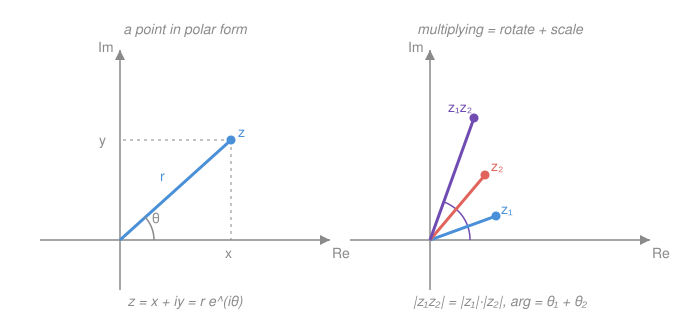

# Complex Analysis · Lesson 1.1: Complex numbers and the geometry of $\mathbb{C}$

> ⏱ ~15 min · Module 1: The complex plane · Builds on: `real-analysis` (the field axioms, $\mathbb{R}^2$, the standard trig identities) · Unlocks: [1.2 Functions, limits, and continuity on $\mathbb{C}$](01-02-functions-limits-continuity.md)

## Why this matters

Every theorem in this course — Cauchy's, Liouville's, the residue calculus — is downstream of a single geometric fact: **multiplying by a complex number rotates and scales the plane.** Not "manipulates symbols," not "combines real and imaginary parts" — *rotates*. Once that's in your bones, holomorphic functions become maps that spin little neighborhoods around, conformality becomes obvious, and the roots of any polynomial become points spaced evenly around a circle. Get this lesson right and the rest of the course is you cashing it out. Get it as bookkeeping and you'll be memorizing formulas forever.

## The idea

A complex number is a point in the plane. That's it — $z = x + iy$ is the point $(x, y)$, with the horizontal axis called *real* and the vertical axis called *imaginary*. Addition is just vector addition, tip to tail, exactly as in $\mathbb{R}^2$.

The one genuinely new operation is **multiplication**, and its meaning is entirely geometric. Describe a point not by its coordinates but by two numbers: its **length** $r$ (distance from the origin) and its **angle** $\theta$ (measured counterclockwise from the positive real axis). Then to multiply two complex numbers,

> **multiply the lengths, add the angles.**

So multiplying by a number of length $2$ at angle $30°$ means: *stretch everything to twice its size and spin it $30°$ counterclockwise.* Multiplication is a rotation-and-scaling of the whole plane. The number $i$, length $1$ at angle $90°$, is the quarter-turn — which is why $i^2 = -1$: two quarter-turns is a half-turn, and a half-turn sends $1$ to $-1$. The infamous identity isn't a definition to accept on faith; it's a rotation you can do with your hand.

## The formal version

**The field $\mathbb{C}$.** The complex numbers are $\mathbb{C} = \{\, x + iy : x, y \in \mathbb{R}\,\}$ with the single new rule $i^2 = -1$; you add and multiply as with real numbers, replacing $i^2$ by $-1$ whenever it appears. For $z = x + iy$: $x = \operatorname{Re} z$ is the **real part**, $y = \operatorname{Im} z$ the **imaginary part** (note: $\operatorname{Im} z$ is the real number $y$, not $iy$).

> In words: $\mathbb{C}$ is the plane, with a multiplication baked in.

**Conjugate and modulus.** The **conjugate** is $\bar z = x - iy$ (reflection across the real axis). The **modulus** is $|z| = \sqrt{x^2 + y^2}$ (the length $r$). A one-line identity does an enormous amount of work later:

$$z\,\bar z = (x+iy)(x-iy) = x^2 + y^2 = |z|^2.$$

> In words: a number times its mirror image is its length squared — a *real* number. This is how you divide: $\dfrac{1}{z} = \dfrac{\bar z}{|z|^2}$, turning any denominator real.

**Polar form.** Writing $x = r\cos\theta$, $y = r\sin\theta$ gives

$$z = r(\cos\theta + i\sin\theta) = r\,e^{i\theta}, \qquad r = |z|,\ \ \theta = \arg z.$$

Here $\arg z$ is the **argument** (the angle), and $e^{i\theta}$ is — *for now* — pure shorthand for $\cos\theta + i\sin\theta$. (That this shorthand is the actual exponential function, obeying $e^{i\theta}e^{i\phi} = e^{i(\theta+\phi)}$, gets proved in [1.3](01-03-exponential-log-trig.md); take it as a convenient name today.)

> In words: every complex number is "length $r$, pointing at angle $\theta$."

**Multiplication adds angles (the key fact).** For $z_1 = r_1(\cos\theta_1 + i\sin\theta_1)$ and $z_2 = r_2(\cos\theta_2 + i\sin\theta_2)$, multiply out and collect using the angle-addition formulas $\cos(\theta_1+\theta_2) = \cos\theta_1\cos\theta_2 - \sin\theta_1\sin\theta_2$ and $\sin(\theta_1+\theta_2) = \sin\theta_1\cos\theta_2 + \cos\theta_1\sin\theta_2$:

$$
z_1 z_2 = r_1 r_2\big[(\cos\theta_1\cos\theta_2 - \sin\theta_1\sin\theta_2) + i(\sin\theta_1\cos\theta_2 + \cos\theta_1\sin\theta_2)\big] = r_1 r_2\big[\cos(\theta_1+\theta_2) + i\sin(\theta_1+\theta_2)\big].
$$

Hence $|z_1 z_2| = |z_1|\,|z_2|$ and $\arg(z_1 z_2) = \arg z_1 + \arg z_2$.

> In words: the trig angle-addition formulas *are* the statement that complex multiplication adds angles. Two sacred high-school identities, revealed as one geometric fact.

**De Moivre's theorem.** Taking $z_1 = z_2 = \cdots$ (multiply a unit-length number by itself $n$ times, adding its angle each time):

$$(\cos\theta + i\sin\theta)^n = \cos n\theta + i\sin n\theta, \qquad n \in \mathbb{Z}.$$

> In words: raising to the $n$th power multiplies the angle by $n$. This is the engine for roots.

**$n$th roots.** To solve $z^n = w$ where $w = \rho\,e^{i\varphi}$: the modulus must satisfy $r^n = \rho$, so $r = \rho^{1/n}$ (a real positive root), and the angle must satisfy $n\theta = \varphi + 2\pi k$. That "$+2\pi k$" is the whole story — it produces exactly $n$ distinct answers:

$$z_k = \rho^{1/n}\exp\!\left(i\,\frac{\varphi + 2\pi k}{n}\right), \qquad k = 0, 1, \dots, n-1.$$

> In words: every nonzero number has exactly $n$ $n$th roots, equally spaced by angle $2\pi/n$ around a circle of radius $\rho^{1/n}$. The **roots of unity** ($w = 1$: solutions of $z^n = 1$) are the special case sitting on the unit circle, one of them always at $z = 1$.

**Triangle inequality.** Since addition is vector addition, one side of a triangle is no longer than the other two:

$$|z_1 + z_2| \le |z_1| + |z_2|, \qquad \text{and (reverse)} \quad \big||z_1| - |z_2|\big| \le |z_1 - z_2|.$$

> In words: the straight path beats any detour (forward); and moving your endpoints by a little can't change the distance between them by more than that little (reverse). These are the workhorses for every estimate later — the ML-inequality in Module 4 is this in disguise.

## Picture

The left panel is one number: length $r$, angle $\theta$, with its real part $x$ and imaginary part $y$ read off as shadows on the axes. The right panel is the whole course in one image — the product $z_1 z_2$ sits out at the *summed* angle $\theta_1 + \theta_2$, stretched to the *product* length $|z_1|\,|z_2|$.

## Worked examples

**Example 1 (mechanical — see the rotation happen).** Multiply $z_1 = 1 + i$ and $z_2 = \sqrt{3} + i$ two ways.

*Rectangular:* $(1+i)(\sqrt{3}+i) = \sqrt{3} + i + i\sqrt{3} + i^2 = (\sqrt{3} - 1) + (1 + \sqrt{3})i \approx 0.732 + 2.732\,i.$

*Polar:* $z_1$ has $r_1 = \sqrt{2}$, $\theta_1 = 45°$; $z_2$ has $r_2 = \sqrt{(\sqrt3)^2+1^2} = 2$, $\theta_2 = 30°$ (since $\tan\theta_2 = 1/\sqrt3$). So the product has length $\sqrt2 \cdot 2 = 2\sqrt2$ and angle $45° + 30° = 75°$:

$$z_1 z_2 = 2\sqrt{2}\,(\cos 75° + i\sin 75°) \approx 2.828\,(0.259 + 0.966\,i) \approx 0.732 + 2.732\,i. \checkmark$$

Same number. The rectangular route is blind arithmetic; the polar route *tells you what happened* — $z_2$ rotated $z_1$ by $30°$ and stretched it by a factor of $2$.

**Example 2 (why you'd care — trig identities for free).** De Moivre manufactures multiple-angle formulas with no memorization. Expand $(\cos\theta + i\sin\theta)^3$ with the binomial theorem:

$$(\cos\theta + i\sin\theta)^3 = \cos^3\theta + 3i\cos^2\theta\sin\theta - 3\cos\theta\sin^2\theta - i\sin^3\theta.$$

By De Moivre this equals $\cos 3\theta + i\sin 3\theta$. **Match real parts:** $\cos 3\theta = \cos^3\theta - 3\cos\theta\sin^2\theta$. Substitute $\sin^2\theta = 1 - \cos^2\theta$:

$$\cos 3\theta = \cos^3\theta - 3\cos\theta(1 - \cos^2\theta) = 4\cos^3\theta - 3\cos\theta.$$

Matching *imaginary* parts hands you $\sin 3\theta = 3\cos^2\theta\sin\theta - \sin^3\theta$ in the same breath. One complex computation, two real identities — this is the flavor of leverage complex methods give you all course long.

## Watch out

- You might think a number has *one* argument, but $\arg z$ is **multivalued**: $\theta$ and $\theta + 2\pi$ (and $\theta - 2\pi$, …) name the same point. So $\arg z$ is only defined *modulo* $2\pi$; pinning it to a single interval (say $(-\pi, \pi]$, the "principal value") requires a *choice*, and that choice has a seam where it jumps by $2\pi$. Harmless here, but it's the crack that becomes the **branch cut** of $\log z$ in [1.3](01-03-exponential-log-trig.md) — the multivaluedness you're waving at now is a monster later.
- You might think "$i = \sqrt{-1}$" defines $i$ and lets you write $\sqrt{z}$ freely, but $\sqrt{\ }$ is **not single-valued** on $\mathbb{C}$: every nonzero number has *two* square roots (the $n=2$ case above), and there's no consistent way to always pick "the positive one." The naive move $\sqrt{-1}\sqrt{-1} = \sqrt{(-1)(-1)} = \sqrt{1} = 1$ "proves" $-1 = 1$ precisely because it pretends $\sqrt{\ }$ is a function when it isn't. Treat $i$ as *a* number with $i^2 = -1$, full stop.
- You might think $\mathbb{C}$ inherits $<$ from $\mathbb{R}$, but **$\mathbb{C}$ is not an ordered field** — there is no consistent way to say one complex number is "less than" another. (If there were, $i > 0$ or $i < 0$; either forces $i^2 = -1 > 0$, absurd.) So "$i = \sqrt{-1}$" is a *labeling convention* for one of two roots, carrying no notion of sign or order. Inequalities in this course are always between the *real numbers* $|z|$, never between complex numbers themselves.

## One-liner

> A complex number is a point with a length and an angle, and multiplying two of them multiplies the lengths and adds the angles — everything else is a consequence.

## Problems

**P1 (🟢)** Let $z = 3 + 4i$. Compute $|z|$, $\bar z$, and $\dfrac{1}{z}$ (as $a + bi$). Then write $z$ in polar form $r(\cos\theta + i\sin\theta)$, giving $\theta$ to the nearest degree.

**P2 (🟡)** Find all solutions of $z^3 = -8$. Give each in the form $a + bi$, and describe how the three roots sit relative to each other in the plane. (Hint: put $-8$ in polar form first — what are its modulus and argument?)

**P3 (🔴, optional)** Let $\omega = e^{2\pi i/n}$ for an integer $n \ge 2$, so that $1, \omega, \omega^2, \dots, \omega^{n-1}$ are the $n$ roots of unity. Prove that they **sum to zero**:
$$1 + \omega + \omega^2 + \cdots + \omega^{n-1} = 0.$$
Then give the one-sentence *geometric* reason. (This "the roots of unity balance" fact is the seed of the discrete Fourier transform you'll meet in signal-processing and PDE work.)

Solutions

**P1** $|z| = \sqrt{3^2 + 4^2} = \sqrt{25} = 5$. Conjugate: $\bar z = 3 - 4i$. For the reciprocal, use $\dfrac{1}{z} = \dfrac{\bar z}{|z|^2}$:

$$\frac{1}{z} = \frac{3 - 4i}{25} = \frac{3}{25} - \frac{4}{25}i = 0.12 - 0.16\,i.$$

(Check: $(3+4i)(0.12 - 0.16i) = 0.36 - 0.48i + 0.48i - 0.64i^2 = 0.36 + 0.64 = 1.\ \checkmark$) Polar form: $r = 5$ and $\theta = \arctan(4/3) \approx 53°$ (first quadrant, so no adjustment needed), giving $z = 5(\cos 53° + i\sin 53°)$.

**P2** Write $-8$ in polar form: modulus $8$, argument $\pi$ (it points along the negative real axis), so $-8 = 8\,e^{i\pi}$. The cube roots have modulus $8^{1/3} = 2$ and arguments $\dfrac{\pi + 2\pi k}{3}$ for $k = 0, 1, 2$:

- $k=0$: angle $\tfrac{\pi}{3} = 60°$, root $2(\cos 60° + i\sin 60°) = 2\left(\tfrac12 + \tfrac{\sqrt3}{2}i\right) = 1 + i\sqrt{3}$.
- $k=1$: angle $\pi = 180°$, root $2(\cos 180° + i\sin 180°) = -2$.
- $k=2$: angle $\tfrac{5\pi}{3} = 300°$, root $2\left(\tfrac12 - \tfrac{\sqrt3}{2}i\right) = 1 - i\sqrt{3}$.

So the roots are $-2$ and $1 \pm i\sqrt3$. They all lie on the circle of radius $2$, spaced exactly $120°$ apart — the vertices of an equilateral triangle centered at the origin. (Sanity check on one: $(1+i\sqrt3)^3$ has modulus $2^3 = 8$ and angle $3 \cdot 60° = 180°$, i.e. $-8.\ \checkmark$)

**P3** Because $\omega \neq 1$ (as $n \ge 2$), the sum is a finite geometric series with ratio $\omega$:

$$1 + \omega + \cdots + \omega^{n-1} = \frac{\omega^n - 1}{\omega - 1}.$$

But $\omega^n = \left(e^{2\pi i/n}\right)^n = e^{2\pi i} = 1$, so the numerator is $1 - 1 = 0$, while the denominator $\omega - 1 \neq 0$. Hence the sum is $0$.

*Geometric reason:* the $n$ roots are $n$ unit vectors spaced evenly around the circle, so by symmetry their vector sum has nothing to point toward — the center of mass of equally spaced points on a circle is the center itself, i.e. the origin.

## Connections

- **Backward:** this reuses everything `real-analysis` gave you about $\mathbb{R}^2$ and the field axioms — $\mathbb{C}$ is $\mathbb{R}^2$ with a multiplication that happens to add angles. The angle-addition identities you're leaning on are the same real-variable trig facts, now doing geometric work.
- **Forward:** "length and angle" is the language the entire course speaks. [1.2](01-02-functions-limits-continuity.md) puts a topology on these points (open sets, limits, continuity); [1.3](01-03-exponential-log-trig.md) upgrades the shorthand $e^{i\theta}$ into the genuine exponential and confronts the multivalued $\arg$ head-on as the branch cut of $\log$. The roots-of-unity picture returns for real when you compute residues and count roots in Module 6.
- **Sideways (physics/signals):** "multiply = rotate" is exactly why complex numbers model oscillation and AC circuits — a steady rotation $e^{i\omega t}$ *is* a sinusoid, and multiplying phasors adds their phases. P3's balanced roots of unity are the backbone of the discrete Fourier transform.
