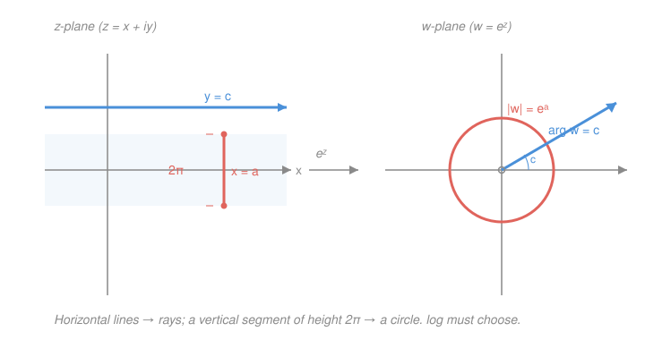

# Complex Analysis · Lesson 1.3: The exponential, logarithm, and complex trig

> ⏱ ~15 min · Module 1: The complex plane · Builds on: [1.1 Complex numbers and the geometry of $\mathbb{C}$](01-01-complex-numbers-geometry.md), [1.2 Functions, limits, and continuity](01-02-functions-limits-continuity.md) · Unlocks: Module 2 — [2.1 Complex differentiability](02-01-complex-differentiability.md)

## Why this matters

Every function you trust — $e^x$, $\ln x$, $\sin x$, $\cos x$ — was defined on the real line. Push them into the plane and two things happen. First, they fuse: $\cos$ and $e$ turn out to be the *same function* seen from two angles, which is Euler's formula and the reason electrical engineers, quantum mechanics, and Fourier analysis all speak in $e^{i\theta}$. Second, "one input, one output" quietly breaks. The complex exponential is periodic, so its inverse — the logarithm — is genuinely *multivalued*, and learning to tame that (branches, cuts) is the price of admission to everything downstream. This is where the plane earns its keep.

## The idea

Start from the one fact that makes multiplication in $\mathbb{C}$ geometric ([1.1](01-01-complex-numbers-geometry.md)): multiplying rotates and scales. We *want* an exponential whose defining trait — turning addition into multiplication, $e^{z+w}=e^z e^w$ — survives. So adding an imaginary number should *rotate*. That forces the definition: the real part $x$ controls size (via the old $e^x$), the imaginary part $y$ controls angle. Feed in $x+iy$, get a number of size $e^x$ pointed at angle $y$.

Now watch the consequences unfold on their own. Angle is only defined up to full turns, so adding $2\pi i$ to $z$ spins you all the way around and lands back where you started: **$e^z$ is periodic**, period $2\pi i$ — a feature with no real-line analogue at all. And periodic functions can't be inverted cleanly: infinitely many inputs give the same output, so "the" logarithm of a number is really a whole ladder of answers spaced $2\pi i$ apart. Meanwhile $\cos$ and $\sin$, rebuilt out of $e^{iz}$, lose their leash — on the plane they run to infinity, and "$|\cos|\le 1$" becomes a purely real superstition.

## The formal version

**The complex exponential.** For $z=x+iy$ (with $x,y$ real) define

$$e^z \;:=\; e^{x}\bigl(\cos y + i\sin y\bigr).$$

Here $e^x$ is the ordinary real exponential and $\cos,\sin$ are the ordinary real functions. In words: **size $e^x$, direction $y$ radians.** Immediately, since $\cos^2y+\sin^2y=1$ and $e^x>0$,

$$|e^z| = e^{x}, \qquad \arg e^z = y \pmod{2\pi}.$$

**It still adds correctly.** With $z=x+iy$, $w=u+iv$, the angle-addition identities from [1.1](01-01-complex-numbers-geometry.md) give

$$e^z e^w = e^{x}e^{u}(\cos y+i\sin y)(\cos v+i\sin v) = e^{x+u}\bigl(\cos(y{+}v)+i\sin(y{+}v)\bigr) = e^{z+w}.$$

In words: the law $e^{z+w}=e^ze^w$ is exactly "sizes multiply, angles add" — the geometry of complex multiplication in disguise.

**Periodicity (the new feature).** $e^{z+2\pi i}=e^{x}\bigl(\cos(y+2\pi)+i\sin(y+2\pi)\bigr)=e^z.$ So $e^z$ has period $2\pi i$. And $e^z$ is **never zero** ($|e^z|=e^x>0$).

**Euler's formula.** Set $x=0$:

$$\boxed{\,e^{i\theta}=\cos\theta+i\sin\theta\,}$$

In words: traveling angle $\theta$ around the unit circle *is* exponentiating $i\theta$. (We take this as a consequence of the definition here; the deeper proof — that the *power series* of $e^z$, $\cos z$, $\sin z$ line up — waits for [3.2 The elementary functions as power series](03-02-elementary-functions-series.md).)

**Complex sine and cosine.** For real $\theta$, adding and subtracting $e^{i\theta}=\cos\theta+i\sin\theta$ and $e^{-i\theta}=\cos\theta-i\sin\theta$ solves for $\cos,\sin$. Promote those formulas to *all* $z\in\mathbb{C}$ as definitions:

$$\cos z = \frac{e^{iz}+e^{-iz}}{2}, \qquad \sin z = \frac{e^{iz}-e^{-iz}}{2i}.$$

In words: sine and cosine are just two bookkeeping combinations of the exponential. On the real axis they agree with the functions you know — but off it they explode. Plug in $z=iy$:

$$\cos(iy)=\frac{e^{-y}+e^{y}}{2}=\cosh y, \qquad \sin(iy)=\frac{e^{-y}-e^{y}}{2i}=i\sinh y.$$

Since $\cosh y\to\infty$ as $y\to\infty$, **complex cosine is unbounded.** The hyperbolic functions aren't cousins of trig — up to a factor of $i$ they *are* trig, evaluated along the imaginary axis.

**The logarithm (multivalued).** $\log w$ should mean "any $z$ with $e^z=w$." Write $w=re^{i\theta}$ with $r=|w|>0$ and $\theta=\arg w$. Matching size and angle, $e^{z}=w$ needs $e^{x}=r$ (so $x=\ln r$) and $y=\theta+2\pi k$. Hence

$$\log w = \ln|w| + i\,\arg w = \ln|w| + i\bigl(\operatorname{Arg}w + 2\pi k\bigr),\quad k\in\mathbb{Z},$$

where $\ln$ is the real natural log and $\operatorname{Arg}w\in(-\pi,\pi]$ is the **principal argument**. In words: the log has a *real part fixed by size and an imaginary part that's a whole ladder of angles*, one rung per full turn. Selecting the middle rung gives the **principal logarithm**

$$\operatorname{Log}w = \ln|w| + i\operatorname{Arg}w, \qquad \operatorname{Arg}w\in(-\pi,\pi].$$

**Branch cut.** To make $\operatorname{Log}$ a genuine single-valued *continuous* function, you must forbid the seam where the chosen angle jumps. As $w$ swings across the **negative real axis**, $\operatorname{Arg}w$ leaps from just under $\pi$ (above) to just over $-\pi$ (below) — a jump of $2\pi$. We delete that ray (and the origin): the **branch cut** is $(-\infty,0]$. A *branch* is one continuous single-valued choice of $\log$; the *cut* is the barrier you agree never to cross so the choice stays consistent.

**Complex powers.** With a logarithm in hand, $z^{\alpha} := e^{\alpha\log z}$ for $z\ne 0$. Because $\log z$ is a ladder, so is $z^\alpha$ in general — complex powers inherit the multivaluedness.

## Picture

Read it left to right. A horizontal line $y=c$ (constant angle) is stretched into a **ray** at angle $c$; a vertical segment $x=a$ of height $2\pi$ is wrapped exactly once into a **circle** of radius $e^a$. Slide the whole picture up by $2\pi$ and nothing in the right panel moves — that repetition *is* the periodicity, and it's why the log, running the map backwards, has to pick one horizontal strip to call home.

## Worked examples

**Example 1 (mechanical — solve $e^z=-1$).** We need size $1$ and angle $\pi$. So $\ln|{-1}|=\ln 1 = 0$ and $\arg(-1)=\pi+2\pi k$:

$$z = 0 + i(\pi + 2\pi k) = i(2k+1)\pi,\quad k\in\mathbb{Z}.$$

The solutions are the odd multiples of $i\pi$: $\dots,-i\pi,\,i\pi,\,3i\pi,\dots$. Check: $e^{i\pi}=\cos\pi+i\sin\pi=-1$. ✓ There isn't one answer — there's a ladder, spaced by the period $2\pi i$.

**Example 2 (why you'd care — solve $\cos z = 2$).** Real intuition screams "impossible," but complex cosine is unbounded, so it has solutions. Let $\omega=e^{iz}$. Then $\cos z=\frac{\omega+\omega^{-1}}{2}=2$ gives $\omega^2-4\omega+1=0$, so

$$\omega = \frac{4\pm\sqrt{12}}{2}=2\pm\sqrt3.$$

Both roots are positive reals (and $(2+\sqrt3)(2-\sqrt3)=1$, so $2-\sqrt3=\tfrac{1}{2+\sqrt3}$). Now invert $\omega=e^{iz}$: since $2\pm\sqrt3>0$ has argument $0$,

$$iz=\ln(2\pm\sqrt3)+2\pi i k \;\Longrightarrow\; z = 2\pi k - i\ln(2\pm\sqrt3) = 2\pi k \mp i\ln(2+\sqrt3),\quad k\in\mathbb{Z}.$$

So $\cos z=2$ at $z=2\pi k \pm i\ln(2+\sqrt3)$. The solutions march off along horizontal lines $\operatorname{Im}z=\pm\ln(2+\sqrt3)\approx \pm1.317$ — real cosine's ceiling of $1$ was only ever a fact about the real axis.

## Watch out

- You might think $\operatorname{Log}(z_1z_2)=\operatorname{Log}z_1+\operatorname{Log}z_2$ like real logs. **It holds only for the multivalued $\log$, as sets mod $2\pi i$.** Take $z_1=z_2=-1$: $\operatorname{Log}(-1)=i\pi$, so the right side is $2\pi i$, but the left side is $\operatorname{Log}(1)=0$. They differ by a full $2\pi i$, because adding the two principal angles ($\pi+\pi$) overshot past the $(-\pi,\pi]$ window.
- You might think $\log$ and $\exp$ cancel both ways. **$e^{\log z}=z$ always, but $\log(e^z)=z$ only up to $2\pi i k$.** E.g. $\operatorname{Log}(e^{3\pi i})=\operatorname{Log}(-1)=i\pi\ne 3\pi i$ — the exponential's periodicity has already thrown away which rung you started on.
- You might think the branch cut's jump is an artifact to be smoothed away. **The discontinuity is real, not a bug.** No single-valued continuous logarithm exists on a loop around $0$ (the angle genuinely gains $2\pi$ per lap). The cut is an honest admission of that, not a failure of technique — cross it and $\operatorname{Log}$ *must* jump by $2\pi i$.

## One-liner

> $e^z$ has size $e^x$ and angle $y$, so it's $2\pi i$-periodic — which fuses $\cos$ with $\exp$ (Euler), sets $\cos$ free to be unbounded, and forces $\log$ to be a ladder you tame with a branch cut.

## Problems

**P1 (🟢)** Write each in Cartesian form $a+bi$: (a) $e^{\,i\pi/3}$, (b) $e^{\,1+i\pi}$, (c) $e^{\,2-i\pi/2}$.

**P2 (🟡)** Show by explicit example that $\operatorname{Log}(z_1z_2)\ne\operatorname{Log}z_1+\operatorname{Log}z_2$, using $z_1=z_2=-1+i\sqrt3$. Compute both sides and confirm they differ by an integer multiple of $2\pi i$. (Recall $\operatorname{Arg}\in(-\pi,\pi]$.)

**P3 (🔴, optional)** Find *all* values of $i^{\,i}$ and show they are real. (Use $z^\alpha=e^{\alpha\log z}$ with the full multivalued $\log$.) Which one is the principal value, and roughly how big is it?

Solutions

**P1** Apply $e^{x+iy}=e^x(\cos y+i\sin y)$ directly.
(a) $x=0,\ y=\pi/3$: $\cos\frac\pi3+i\sin\frac\pi3=\dfrac12+i\dfrac{\sqrt3}{2}$.
(b) $x=1,\ y=\pi$: $e(\cos\pi+i\sin\pi)=e(-1+0)=-e$.
(c) $x=2,\ y=-\pi/2$: $e^2(\cos(-\tfrac\pi2)+i\sin(-\tfrac\pi2))=e^2(0-i)=-\,e^2 i$.

**P2** First put $z_1=-1+i\sqrt3$ in polar form: $|z_1|=\sqrt{1+3}=2$, and it sits in the second quadrant with $\tan^{-1}\!\big(\tfrac{\sqrt3}{-1}\big)$ resolved to $\operatorname{Arg}z_1=\tfrac{2\pi}{3}$. So
$$\operatorname{Log}z_1=\ln 2 + i\tfrac{2\pi}{3},\qquad \operatorname{Log}z_1+\operatorname{Log}z_2 = 2\ln 2 + i\tfrac{4\pi}{3}.$$
Now the product: $z_1z_2 = \big(2e^{i2\pi/3}\big)^2 = 4\,e^{i4\pi/3}$. But $\tfrac{4\pi}{3}>\pi$, so reduce into $(-\pi,\pi]$: $\tfrac{4\pi}{3}-2\pi=-\tfrac{2\pi}{3}$, giving $\operatorname{Arg}(z_1z_2)=-\tfrac{2\pi}{3}$. Hence
$$\operatorname{Log}(z_1z_2)=\ln 4 + i\big(-\tfrac{2\pi}{3}\big)=2\ln 2 - i\tfrac{2\pi}{3}.$$
The two sides have equal real parts and imaginary parts differing by $\tfrac{4\pi}{3}-\big(-\tfrac{2\pi}{3}\big)=2\pi$, so
$$\big(\operatorname{Log}z_1+\operatorname{Log}z_2\big) - \operatorname{Log}(z_1z_2) = 2\pi i.$$
The principal branch clipped one full turn; only as multivalued sets do the two agree.

**P3** $i^{\,i}=e^{\,i\log i}$. Now $|i|=1$ so $\ln|i|=0$, and $\arg i=\tfrac\pi2+2\pi k$, giving $\log i = i\big(\tfrac\pi2+2\pi k\big)$. Then
$$i\log i = i\cdot i\Big(\tfrac\pi2+2\pi k\Big) = -\Big(\tfrac\pi2+2\pi k\Big),$$
so
$$i^{\,i}=e^{-(\pi/2+2\pi k)},\quad k\in\mathbb{Z}.$$
Every value is a positive real number — the imaginary unit raised to the imaginary unit is real, one of the great surprises of the subject. The principal value ($k=0$) is $e^{-\pi/2}\approx 0.2079$. (The others, $e^{-\pi/2\mp 2\pi}$, are the same ladder scaled by powers of $e^{2\pi}$.)

## Flashback

**From Lesson 1.1 (geometry of $\mathbb{C}$ — polar form and De Moivre):** Find all three cube roots of $-8$, in Cartesian form, and describe how they sit in the plane.

Solution

Write $-8$ in polar form: $|-8|=8$, $\arg(-8)=\pi$, so $-8=8\,e^{i(\pi+2\pi k)}$. A cube root has modulus $8^{1/3}=2$ and argument $\tfrac{\pi+2\pi k}{3}$ for $k=0,1,2$:
$$z_k = 2\,e^{\,i(\pi+2\pi k)/3},\qquad \text{angles } \tfrac\pi3,\ \pi,\ \tfrac{5\pi}{3}.$$
Evaluating:
$$z_0=2\Big(\tfrac12+i\tfrac{\sqrt3}{2}\Big)=1+i\sqrt3,\quad z_1=2(-1)=-2,\quad z_2=2\Big(\tfrac12-i\tfrac{\sqrt3}{2}\Big)=1-i\sqrt3.$$
They lie on the circle of radius $2$, equally spaced $120^\circ$ apart — the vertices of an equilateral triangle, the signature of $n$th roots. Check one: $(-2)^3=-8$. ✓

## Connections

- **Backward:** the whole lesson is [1.1](01-01-complex-numbers-geometry.md)'s "multiplication = rotate-and-scale" made into a function — $e^z$ turns the real part into scale and the imaginary part into rotation, and the multivalued $\arg$ from 1.1 is exactly what makes $\log$ multivalued now.
- **Forward:** Euler's formula and these series-free definitions get their rigorous power-series backing in [3.2](03-02-elementary-functions-series.md); and the branch/cut discipline you just met is what lets [2.1](02-01-complex-differentiability.md) and onward differentiate $\log z$ and $z^\alpha$ without ambiguity. Boss problem 1 is now fully in reach ($e^z=-1$ and $\cos z=2$ are Examples 1–2).
- **Sideways (physics/engineering):** $e^{i\theta}$ is the phasor of AC circuits and the plane wave $e^{i(kx-\omega t)}$ of optics and quantum mechanics; "unbounded complex $\cos$" and hyperbolic-trig identities are the same $e^{iz}$ machinery that later powers Fourier analysis and the residue-calculus integrals of Module 6.
