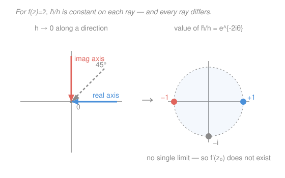

# Complex Analysis · Lesson 2.1: Complex differentiability

> ⏱ ~15 min · Module 2: Holomorphic functions · Builds on: [1.2 Functions, limits, and continuity on ℂ](01-02-functions-limits-continuity.md), [1.3 The exponential, logarithm, and complex trig](01-03-exponential-log-trig.md) · Unlocks: [2.2 The Cauchy–Riemann equations](02-02-cauchy-riemann-equations.md)

## Why this matters

This is the definition the entire course pivots on. It looks *word-for-word identical* to the derivative you already know — a limit of a difference quotient — and that resemblance is a trap, because in $\mathbb{C}$ the same words demand vastly more. A function that clears this one bar isn't just differentiable; it turns out to be infinitely differentiable, equal to its own power series, and pinned down everywhere by its values on a tiny curve (Modules 4–5). Nothing in real calculus is that rigid. All of that supernatural structure is squeezed out of a single innocent-looking requirement, and this lesson is where you meet it.

## The idea

Recall the derivative: $f'(z_0)$ is the number the ratio $\frac{f(z_0+h)-f(z_0)}{h}$ approaches as the nudge $h$ shrinks to zero. On the real line, $h$ can only shrink from two sides — left or right — and we quietly required both to agree.

In $\mathbb{C}$, the nudge $h$ is a *point in the plane*, so it can shrink to zero along infinitely many directions: straight in from the east, from the north, spiralling in, wandering. And [1.2](01-02-functions-limits-continuity.md) already warned you: a limit in $\mathbb{C}$ exists only if you get the **same value no matter the path of approach**. Combine the two and the derivative's definition inherits that demand automatically.

So "complex-differentiable" means: that difference quotient must not only converge — it must converge to the *same* number whether $h$ creeps in horizontally, vertically, or from any angle at all. That is a wildly stronger constraint than the real one, and it is the whole reason holomorphic functions are so tightly disciplined. Most functions fail it everywhere.

## The formal version

**Complex differentiability.** Let $f$ be defined on an open set containing $z_0\in\mathbb{C}$. We say $f$ is **complex-differentiable** (or **holomorphic**) at $z_0$ if the limit

$$f'(z_0)=\lim_{h\to 0}\frac{f(z_0+h)-f(z_0)}{h}$$

exists, where $h\in\mathbb{C}$ ranges over complex numbers approaching $0$.

> In words: nudge the input by a small complex $h$, measure the change in output per unit nudge, and demand that this ratio settle to one number as $h\to 0$ — *from every direction in the plane at once*.

**Holomorphic on a set; entire.** $f$ is **holomorphic on an open set** $U$ if it is complex-differentiable at *every* point of $U$. If $f$ is holomorphic on all of $\mathbb{C}$, it is called **entire**.

> In words: "holomorphic at a point" is the local fact; "holomorphic on $U$" is that fact holding across a whole open patch — and that open-set version is the one with all the power. Being differentiable at a single isolated point buys you almost nothing (see Watch out).

A note on vocabulary: you'll also hear **analytic**, which strictly means "locally equal to a convergent power series." It's a genuinely different-sounding property — yet in $\mathbb{C}$ the two coincide exactly: holomorphic $\Leftrightarrow$ analytic. We won't prove that until Module 5 (Lesson 5.1); for now treat the words as synonyms, but remember we haven't *earned* the equivalence yet.

## Picture

## Worked examples

**Example 1 (mechanical — the rules are the real rules, and one proof to show why).**
Because the difference quotient is manipulated with the *same algebra* as in real calculus — $\mathbb{C}$ is a field, so sums, products, and quotients behave identically — every familiar rule survives verbatim:

$$(f+g)'=f'+g',\quad (fg)'=f'g+fg',\quad \Big(\tfrac{f}{g}\Big)'=\tfrac{f'g-fg'}{g^2}\ (g\neq0),\quad (f\circ g)'=f'(g)\,g'.$$

Here's the **product rule**, proved exactly as you'd prove it over $\mathbb{R}$ — the field axioms are all that's used. Add and subtract $f(z_0+h)g(z_0)$ in the numerator:

$$\frac{f(z_0+h)g(z_0+h)-f(z_0)g(z_0)}{h}=\underbrace{\frac{f(z_0+h)-f(z_0)}{h}}_{\to f'(z_0)}\,g(z_0+h)+f(z_0)\underbrace{\frac{g(z_0+h)-g(z_0)}{h}}_{\to g'(z_0)}.$$

As $h\to 0$, $g(z_0+h)\to g(z_0)$ (differentiable $\Rightarrow$ continuous, below), so the limit is $f'(z_0)g(z_0)+f(z_0)g'(z_0)$. $\blacksquare$

From $\frac{d}{dz}z=1$ and the product rule, induction gives $\frac{d}{dz}z^n=nz^{n-1}$, so **every polynomial is entire**, and quotients of polynomials (rational functions) are holomorphic away from their poles. And from [1.3](01-03-exponential-log-trig.md), the series/definition of the exponential yields $\frac{d}{dz}e^{z}=e^{z}$, so **$e^z$ is entire** too. The bestiary of "nice" functions carries straight over.

**Example 2 (the decisive counterexample — conjugation is holomorphic nowhere).**
Take $f(z)=\bar z$, the reflection across the real axis — a map so tame it's smooth as a function $\mathbb{R}^2\to\mathbb{R}^2$. Fix any $z_0$ and form the quotient:

$$\frac{f(z_0+h)-f(z_0)}{h}=\frac{\overline{z_0+h}-\overline{z_0}}{h}=\frac{\bar z_0+\bar h-\bar z_0}{h}=\frac{\bar h}{h}.$$

Notice $z_0$ has vanished — the answer depends only on the *direction* of $h$. Write $h=re^{i\theta}$; then $\bar h=re^{-i\theta}$ and

$$\frac{\bar h}{h}=\frac{re^{-i\theta}}{re^{i\theta}}=e^{-2i\theta}.$$

- Approach along the **real axis** ($\theta=0$): the quotient is $e^{0}=+1$.
- Approach along the **imaginary axis** ($\theta=\tfrac{\pi}{2}$): the quotient is $e^{-i\pi}=-1$.
- Approach along the **$45^\circ$ diagonal** ($\theta=\tfrac{\pi}{4}$): the quotient is $e^{-i\pi/2}=-i$.

The value never settles — it lands on a *different* point of the unit circle for every direction of approach (the Picture). So the limit does not exist, at *any* $z_0$: **$\bar z$ is complex-differentiable nowhere.** This single computation — "the horizontal and vertical approaches disagree" — is the entire seed of the Cauchy–Riemann equations you'll derive in [2.2](02-02-cauchy-riemann-equations.md).

**A near miss — $|z|^2$ is differentiable at exactly one point.** Let $f(z)=|z|^2=z\bar z$. At $z_0$,

$$\frac{(z_0+h)\overline{(z_0+h)}-z_0\bar z_0}{h}=\frac{z_0\bar h+\bar z_0 h+h\bar h}{h}=\bar z_0+z_0\,\frac{\bar h}{h}+\bar h.$$

As $h\to 0$, the last term $\bar h\to 0$ cleanly, but the middle term $z_0\frac{\bar h}{h}$ carries the same rogue factor $\frac{\bar h}{h}$ that sank $\bar z$ — it has no limit *unless its coefficient $z_0$ is zero*. So the quotient converges iff $z_0=0$, where the limit is $\bar z_0=0$. Thus $|z|^2$ is complex-differentiable **only at the origin**, with $f'(0)=0$ — and holomorphic on *no* open set, since a lone point is never open. It's the textbook illustration of why "differentiable at a point" is nearly worthless.

**Consequence — differentiable $\Rightarrow$ continuous.** If $f'(z_0)$ exists, then

$$\lim_{h\to0}\big(f(z_0+h)-f(z_0)\big)=\lim_{h\to0}\frac{f(z_0+h)-f(z_0)}{h}\cdot h=f'(z_0)\cdot 0=0,$$

so $f(z_0+h)\to f(z_0)$: $f$ is continuous at $z_0$. Same one-line proof as over $\mathbb{R}$, because it's the same limit algebra. (Continuity does *not* run the other way — $\bar z$ is continuous everywhere and differentiable nowhere.)

## Watch out

- **Real-differentiable is far weaker than complex-differentiable.** As a map $\mathbb{R}^2\to\mathbb{R}^2$, $\bar z=(x,y)\mapsto(x,-y)$ is linear — infinitely smooth, a perfect Jacobian. Yet it's holomorphic nowhere. The gap is *direction-independence*: complex differentiability forces the local behaviour to be multiplication by a single complex number (a rotation-and-scaling), and a reflection like $\bar z$ can never be that. Smoothness as a real map buys you nothing here.
- **Don't confuse "at a point" with "on an open set."** $|z|^2$ is complex-differentiable at $z_0=0$, but calling it "holomorphic" is an abuse — holomorphy is an *open-set* notion, and no single point is open. Every powerful theorem in this course (Cauchy's theorem, power-series expansion, the identity theorem) needs holomorphy on a region, not at a stray point. When in doubt, the useful word is the open-set one.
- **"Same formula as real calculus" is a conclusion, not a license.** The rules ($z^n$, product, chain) transfer because the *field algebra* transfers — but that's precisely why $\bar z$, which is not built from field operations on $z$ alone, escapes them. If a function's formula secretly uses $\bar z$, $|z|$, $\operatorname{Re}$, or $\operatorname{Im}$, expect trouble, and check with the definition (or [2.2](02-02-cauchy-riemann-equations.md)'s test).

## One-liner

> Complex differentiability is the ordinary derivative plus one merciless clause — the limit must agree from *every* direction — and that clause, which $\bar z$ fails everywhere, is the source of all the rigidity to come.

## Problems

**P1 (🟢)** Using the rules from Example 1, differentiate $f(z)=z^3-2iz+\dfrac{1}{z}$ and state where it is holomorphic.

**P2 (🟡)** Show directly from the definition that $g(z)=\operatorname{Re}(z)$ (the real part of $z$) is complex-differentiable nowhere. (Hint: compute the quotient for a real $h$, then for a purely imaginary $h$.)

**P3 (🔴, optional)** Let $f(z)=z\,|z|^2 = z^2\bar z$. Find every point at which $f$ is complex-differentiable, and give $f'$ there. (Mirror the $|z|^2$ computation: expand the quotient and isolate the term carrying $\frac{\bar h}{h}$.)

Solutions

**P1** Term by term with the power, sum, and quotient rules ($\frac{d}{dz}z^{-1}=-z^{-2}$):

$$f'(z)=3z^2-2i-\frac{1}{z^2}.$$

$f$ is a rational function with its only trouble at $z=0$ (the $1/z$ term), so it is holomorphic on $\mathbb{C}\setminus\{0\}$ — in fact on any open set avoiding the origin.

**P2** Write $z_0=x_0+iy_0$ and take the quotient $\dfrac{\operatorname{Re}(z_0+h)-\operatorname{Re}(z_0)}{h}=\dfrac{\operatorname{Re}(h)}{h}$ (since $\operatorname{Re}$ is additive). Now:
- Let $h=t$ be **real** ($t\to0$): $\operatorname{Re}(h)=t$, so the quotient is $\frac{t}{t}=1$.
- Let $h=it$ be **purely imaginary** ($t\to0$): $\operatorname{Re}(h)=0$, so the quotient is $\frac{0}{it}=0$.

The two directions give $1$ and $0$, which disagree, so the limit fails at every $z_0$. $\operatorname{Re}(z)$ is complex-differentiable nowhere. (Same disease as $\bar z$ — indeed $\operatorname{Re}(z)=\tfrac12(z+\bar z)$ smuggles in $\bar z$.)

**P3** At $z_0$, with $f(z)=z^2\bar z$, expand using $(z_0+h)^2=z_0^2+2z_0h+h^2$ and $\overline{z_0+h}=\bar z_0+\bar h$:

$$
\begin{aligned}
f(z_0+h)-f(z_0)
&=(z_0^2+2z_0h+h^2)(\bar z_0+\bar h)-z_0^2\bar z_0\\
&=z_0^2\bar h+2z_0\bar z_0 h+2z_0 h\bar h+h^2\bar z_0+h^2\bar h.
\end{aligned}
$$

Divide by $h$:

$$\frac{f(z_0+h)-f(z_0)}{h}=z_0^2\,\frac{\bar h}{h}+2|z_0|^2+2z_0\bar h+\bar z_0 h+h\bar h.$$

Every term except the first tends to a limit as $h\to0$: the constant $2|z_0|^2$ stays, and $2z_0\bar h,\ \bar z_0 h,\ h\bar h$ all $\to0$. The first term $z_0^2\frac{\bar h}{h}$ has the direction-dependent factor $\frac{\bar h}{h}$ and converges **iff its coefficient $z_0^2=0$**, i.e. $z_0=0$. So $f$ is complex-differentiable only at $z_0=0$, where the surviving terms all vanish and $f'(0)=0$. Like $|z|^2$, it is holomorphic nowhere — differentiable at one lonely, non-open point.

## Flashback

**From Lesson 1.3 (The exponential, logarithm, and complex trig):** Find *all* complex $z$ with $e^{z}=\sqrt{3}+i$.

Solution

Solving $e^z=w$ means matching modulus and argument, and $e^z$ is $2\pi i$-periodic, so expect infinitely many solutions. Put the right side in polar form: $|\sqrt3+i|=\sqrt{3+1}=2$ and $\arg(\sqrt3+i)=\arctan\frac{1}{\sqrt3}=\frac{\pi}{6}$. Writing $z=x+iy$, we have $e^z=e^x e^{iy}$, so we need

$$e^{x}=2\ \Rightarrow\ x=\ln 2,\qquad y\equiv\frac{\pi}{6}\pmod{2\pi}\ \Rightarrow\ y=\frac{\pi}{6}+2\pi k.$$

Hence

$$z=\ln 2+i\Big(\frac{\pi}{6}+2\pi k\Big),\qquad k\in\mathbb{Z}.$$

The real part is nailed down (modulus is single-valued); the imaginary part is a whole ladder of solutions spaced $2\pi$ apart — the multivaluedness of $\log$ that [1.3](01-03-exponential-log-trig.md) forced you to confront, now as the pre-image of a single point.

## Connections

- **Backward:** the "same value from every path" rule is exactly the limit warning from [1.2](01-02-functions-limits-continuity.md), now applied to the difference quotient — that's the *only* new ingredient over the real derivative. And the entire functions you get for free ($e^z$, polynomials) are the ones you built in [1.3](01-03-exponential-log-trig.md).
- **Forward:** the horizontal-vs-vertical disagreement that killed $\bar z$ becomes a *test* in [2.2](02-02-cauchy-riemann-equations.md): force the real-axis and imaginary-axis approaches to agree and you get the Cauchy–Riemann equations $u_x=v_y,\ u_y=-v_x$. Direction-independence, made into two PDEs.
- **Sideways (physics/geometry):** "the derivative is multiplication by one complex number" means holomorphic maps act locally as a rotation-and-scaling — they preserve angles. That's *conformality* ([2.3](02-03-harmonic-functions-conformality.md), Module 7), the reason complex analysis solves steady-state heat and fluid-flow problems that resist a direct attack.
