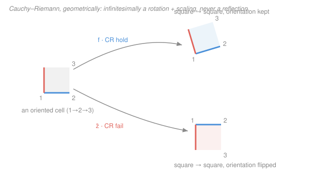

# Complex Analysis · Lesson 2.2: The Cauchy–Riemann equations

> ⏱ ~15 min · Module 2: Holomorphic functions · Builds on: [2.1 Complex differentiability](02-01-complex-differentiability.md) · Unlocks: [2.3 Harmonic functions and conformality](02-03-harmonic-functions-conformality.md)

## Why this matters

Lesson [2.1](02-01-complex-differentiability.md) defined holomorphy as a demand so severe it seemed almost untestable: the difference quotient must approach *the same limit from every direction* in the plane. That sounds like infinitely many conditions to check. The miracle of this lesson is that two of them — agreement along the real axis and agreement along the imaginary axis — already force all the rest. The result is a pair of partial differential equations, the **Cauchy–Riemann equations**, that you can check by hand. They are the working test for holomorphy, the bridge from complex analysis to the real PDEs of physics (they'll hand us Laplace's equation in [2.3](02-03-harmonic-functions-conformality.md)), and the reason "complex-differentiable" is a structural miracle rather than a mild upgrade of "real-differentiable."

## The idea

Split a complex function into its real machinery: write $f(z) = u(x,y) + i\,v(x,y)$, where $z = x+iy$, and $u$ (the real part) and $v$ (the imaginary part) are ordinary real-valued functions of the two real coordinates $x,y$.

Now recall the demand from [2.1](02-01-complex-differentiability.md): the limit

$$f'(z) = \lim_{h\to 0}\frac{f(z+h)-f(z)}{h}$$

must exist *independently of how the complex step $h$ approaches $0$*. Pick the two laziest possible approaches. Push $h$ along the **real axis** (so $h=t$, real, $t\to0$): only the $x$-coordinate moves, and the quotient becomes an $x$-partial derivative. Push $h$ along the **imaginary axis** (so $h=it$, $t\to0$): only $y$ moves, and dividing by $it$ mixes the parts differently. Holomorphy says these two computations must land on *the same complex number* $f'(z)$. Setting them equal is what generates the equations — geometry ("all directions agree") collapsed to just the two axis directions, which turns out to be enough.

## The formal version

**Necessity of Cauchy–Riemann.** Suppose $f=u+iv$ is complex-differentiable at $z=x+iy$. Compute $f'(z)$ two ways.

*Along the real axis*, $h=t\in\mathbb{R}$, $t\to0$:

$$f'(z)=\lim_{t\to0}\frac{f(x+t+iy)-f(x+iy)}{t}=\lim_{t\to0}\frac{\big(u(x+t,y)-u(x,y)\big)+i\big(v(x+t,y)-v(x,y)\big)}{t}=u_x+i\,v_x,$$

where $u_x=\partial u/\partial x$. *Along the imaginary axis*, $h=it$, $t\to0$ (so the denominator is $it$):

$$f'(z)=\lim_{t\to0}\frac{f(x+i(y+t))-f(x+iy)}{it}=\lim_{t\to0}\frac{u(x,y+t)-u(x,y)}{it}+\frac{i\big(v(x,y+t)-v(x,y)\big)}{it}=\frac{1}{i}u_y+v_y = v_y - i\,u_y,$$

using $\tfrac1i=-i$. Both expressions equal the *same* $f'(z)$, so their real and imaginary parts match:

$$\boxed{\,u_x = v_y \qquad\text{and}\qquad u_y = -v_x\,}\qquad\text{(Cauchy–Riemann)}$$

and along the way we get the derivative itself for free:

$$f'(z) = u_x + i\,v_x = v_y - i\,u_y.$$

> In words: if $f$ is holomorphic, its real and imaginary parts are locked together — the way $u$ changes east–west equals the way $v$ changes north–south, and the way $u$ changes north–south is the *negation* of how $v$ changes east–west. These are necessary conditions: every holomorphic function obeys them, no exceptions.

**Sufficiency (read the hypotheses carefully — this is a trap).** The equations alone are *not* enough. What you need:

> **Theorem.** Let $u,v$ have continuous first partial derivatives on an open set $D$, and suppose $u_x=v_y$ and $u_y=-v_x$ hold *throughout* $D$. Then $f=u+iv$ is holomorphic on $D$, with $f'=u_x+iv_x$.

> In words: continuous partials **plus** Cauchy–Riemann **on an open set** buys you holomorphy. Drop "continuous," or check the equations only at a single point, and the implication collapses (see *Watch out*).

*Why it works (sketch).* Continuity of the partials is exactly the hypothesis that makes $u$ and $v$ **real-differentiable** — i.e. each is well-approximated by its linear part:
$$u(x+\Delta x,y+\Delta y)-u(x,y)=u_x\,\Delta x+u_y\,\Delta y+o(|h|),\qquad h=\Delta x+i\Delta y,$$
and likewise for $v$. Assemble $\Delta f=\Delta u+i\,\Delta v$ and substitute the Cauchy–Riemann relations $u_y=-v_x,\ v_y=u_x$. The linear part reorganizes into
$$\Delta f = (u_x+i\,v_x)(\Delta x+i\,\Delta y)+o(|h|)=(u_x+i\,v_x)\,h+o(|h|).$$
Dividing by $h$ and letting $h\to0$, the $o(|h|)/h$ term vanishes and the quotient tends to the single number $u_x+iv_x$ — independent of direction. That is precisely complex differentiability. The Cauchy–Riemann equations are the algebraic condition that turns the real linear map $\begin{pmatrix}u_x&u_y\\ v_x&v_y\end{pmatrix}$ into *multiplication by a complex number*. $\blacksquare$

**Polar form (worth having for later).** In polar coordinates $z=re^{i\theta}$, the equations become

$$u_r=\frac1r\,v_\theta,\qquad v_r=-\frac1r\,u_\theta,\qquad\text{with}\qquad f'(z)=e^{-i\theta}\big(u_r+i\,v_r\big).$$

> In words: the same locking condition, now adapted to circles-and-rays instead of a square grid. This is the convenient form for powers $z^n$, roots, and $\log z$ — we'll reach for it when building harmonic conjugates in [2.3](02-03-harmonic-functions-conformality.md).

## Picture

The Cauchy–Riemann equations say that, infinitesimally, a holomorphic map does to a tiny grid cell exactly what multiplying by one complex number $f'(z)$ does: **rotate it and scale it uniformly**. Angles and orientation survive; little squares stay little squares. Conjugation $z\mapsto\bar z$ is the archetypal *forbidden* motion — it maps the cell to a square too, but flips its orientation (a reflection). No complex number acts as a reflection, so $\bar z$ can't be holomorphic — which is exactly what its Cauchy–Riemann failure below records.

## Worked examples

**Example 1 (mechanical — $f(z)=z^2$ passes).** Since $z^2=(x+iy)^2=x^2-y^2+2ixy$, we read off $u=x^2-y^2$ and $v=2xy$. Partials:

$$u_x=2x,\quad u_y=-2y,\qquad v_x=2y,\quad v_y=2x.$$

Check: $u_x=2x=v_y$ ✓ and $u_y=-2y=-v_x$ ✓, at *every* point, and all four partials are continuous everywhere — so by the sufficiency theorem $f$ is holomorphic on all of $\mathbb{C}$ (entire). The derivative:

$$f'(z)=u_x+i\,v_x=2x+i\,2y=2(x+iy)=2z,$$

recovering the power rule $\tfrac{d}{dz}z^2=2z$, now *earned* from the real parts rather than assumed.

**Example 2 (the diagnostic — $f(z)=\bar z$ fails everywhere).** Here $\bar z=x-iy$, so $u=x$, $v=-y$. Partials:

$$u_x=1,\quad u_y=0,\qquad v_x=0,\quad v_y=-1.$$

The first equation wants $u_x=v_y$, i.e. $1=-1$ — false at every point. So $\bar z$ satisfies Cauchy–Riemann *nowhere*, hence is holomorphic nowhere. This confirms, with a two-line computation, the harder direction-dependent-limit argument from [2.1](02-01-complex-differentiability.md): conjugation is the reflection the picture forbids.

**Example 3 (why you'd care — $f(z)=e^z$).** The complex exponential from Module 1 is $e^z=e^{x}(\cos y+i\sin y)$, so $u=e^x\cos y$ and $v=e^x\sin y$. Partials:

$$u_x=e^x\cos y,\quad u_y=-e^x\sin y,\qquad v_x=e^x\sin y,\quad v_y=e^x\cos y.$$

Check: $u_x=e^x\cos y=v_y$ ✓ and $u_y=-e^x\sin y=-v_x$ ✓ everywhere, partials continuous — so $e^z$ is entire. Its derivative:

$$f'(z)=u_x+i\,v_x=e^x\cos y+i\,e^x\sin y=e^x(\cos y+i\sin y)=e^z.$$

The exponential is its own derivative in $\mathbb{C}$, just as in $\mathbb{R}$ — but now that fact is a *consequence* of how its real and imaginary parts are wired together.

## Watch out

- You might think Cauchy–Riemann *at a point* means differentiable *at that point*, but it doesn't — you need the partials continuous on a neighborhood. Classic counterexample: $f(z)=\sqrt{|xy|}$ (so $u=\sqrt{|xy|}$, $v=0$). At the origin all four partials are $0$ (each one-variable slice through $0$ is flat), so Cauchy–Riemann holds *at* $0$ — yet $f$ is not complex-differentiable there, because the difference quotient along the diagonal $h=t(1+i)$ gives a different limit than along the axes. Cauchy–Riemann is **necessary always, sufficient only with continuous partials on an open set**.
- You might reach for a plus sign in the second equation, but it is $u_y=-v_x$, *not* $u_y=+v_x$. The minus is not cosmetic — it is the entire difference between a rotation (allowed) and a reflection or shear (forbidden). Flip that sign and you'd be describing $\bar z$, the anti-holomorphic world.
- You might think holding at *isolated points* or *along a curve* is good enough for "differentiable somewhere useful." Holomorphy is an **open-set** property: $f(z)=|z|^2$ is complex-differentiable only at the single point $z=0$ (P3), which makes it holomorphic *nowhere*, since no open disk lies inside a single point. A lone point of differentiability buys you nothing.

## One-liner

> Holomorphy = real and imaginary parts locked by $u_x=v_y,\ u_y=-v_x$ — the algebra that forces the local map to be a rotation-and-scaling, checkable by hand but binding only where the partials are continuous on an open set.

## Problems

**P1 (🟢)** For $f(z)=z^3$, expand into $u(x,y)+i\,v(x,y)$, verify the Cauchy–Riemann equations hold everywhere, and compute $f'(z)$ from $u_x+i\,v_x$. Confirm your $f'$ equals $3z^2$.

**P2 (🟡)** Let $f(z)=x^2+i\,y^2$ (so $u=x^2$, $v=y^2$). Find every point where $f$ is complex-differentiable, give $f'$ there, and explain why — despite being differentiable at infinitely many points — $f$ is holomorphic *nowhere*.

**P3 (🔴, optional)** Let $f(z)=|z|^2=x^2+y^2$ (so $u=x^2+y^2$, $v=0$). (a) Use Cauchy–Riemann to show the *only* candidate point of complex-differentiability is $z=0$. (b) Then verify directly from the difference quotient that $f$ *is* differentiable at $0$ with $f'(0)=0$. (c) Conclude $f$ is holomorphic nowhere.

Solutions

**P1** Expand $z^3=(x+iy)^3=x^3+3x^2(iy)+3x(iy)^2+(iy)^3=x^3-3xy^2+i(3x^2y-y^3)$, so
$$u=x^3-3xy^2,\qquad v=3x^2y-y^3.$$
Partials:
$$u_x=3x^2-3y^2,\quad u_y=-6xy,\qquad v_x=6xy,\quad v_y=3x^2-3y^2.$$
Then $u_x=3x^2-3y^2=v_y$ ✓ and $u_y=-6xy=-(6xy)=-v_x$ ✓, everywhere, with continuous partials — so $f$ is entire. Derivative:
$$f'(z)=u_x+i\,v_x=(3x^2-3y^2)+i\,6xy=3\big(x^2-y^2+2ixy\big)=3(x+iy)^2=3z^2.\ \checkmark$$

**P2** With $u=x^2$, $v=y^2$: $u_x=2x$, $v_y=2y$, $u_y=0$, $v_x=0$. The second equation $u_y=-v_x$ reads $0=0$ — satisfied everywhere. The first, $u_x=v_y$, reads $2x=2y$, i.e. holds exactly on the line $y=x$. The partials are continuous, so at points of that line $f$ is complex-differentiable, with
$$f'=u_x+i\,v_x=2x+0=2x\quad(\text{at }y=x).$$
But holomorphy requires the equations on an *open set*, and the line $y=x$ contains no open disk — every disk around a line point spills off the line, where Cauchy–Riemann fails. So $f$ is differentiable on a line yet **holomorphic nowhere**. (This is the *Watch out* open-set point made concrete.)

**P3** (a) $u=x^2+y^2$, $v=0$: $u_x=2x$, $u_y=2y$, $v_x=v_y=0$. Cauchy–Riemann demands $u_x=v_y\Rightarrow 2x=0$ and $u_y=-v_x\Rightarrow 2y=0$, so $x=y=0$. The only possible point is $z=0$.
(b) At $z=0$, $f(0)=0$, and for $h\to0$,
$$\frac{f(0+h)-f(0)}{h}=\frac{|h|^2}{h}=\frac{h\,\bar h}{h}=\bar h\xrightarrow[h\to0]{}0,$$
and this holds for *every* direction of approach (as $h\to0$, $\bar h\to0$). So $f'(0)=0$ exists.
(c) $f$ is complex-differentiable only at the single point $0$; no open disk fits inside a point, so $f$ is holomorphic nowhere — differentiable at exactly one place, analytic at none.

## Flashback

**From Lesson 2.1 (Complex differentiability):** Using only the direction-dependence of the difference quotient (no Cauchy–Riemann), show that $g(z)=\operatorname{Re}z$ is not complex-differentiable at any point.

Solution

Fix any $z$ and form the quotient with step $h$:
$$\frac{g(z+h)-g(z)}{h}=\frac{\operatorname{Re}(z+h)-\operatorname{Re}(z)}{h}=\frac{\operatorname{Re}(h)}{h}.$$
Approach along the **real axis**, $h=t$ (real), $t\to0$: $\ \dfrac{\operatorname{Re}(t)}{t}=\dfrac{t}{t}=1.$
Approach along the **imaginary axis**, $h=it$, $t\to0$: $\ \dfrac{\operatorname{Re}(it)}{it}=\dfrac{0}{it}=0.$
The two directional limits are $1$ and $0$, which disagree, so the limit defining $g'(z)$ cannot exist — at *any* $z$. Hence $\operatorname{Re}z$ is holomorphic nowhere. (Sanity check against this lesson: $u=x$, $v=0$ give $u_x=1\neq0=v_y$, Cauchy–Riemann fails everywhere — same verdict, one line.) $\blacksquare$

## Connections

- **Backward:** this makes the "same limit from every direction" demand of [2.1](02-01-complex-differentiability.md) *operational* — instead of testing infinitely many directions, force the two axis directions to agree and let the algebra do the rest. The $\bar z$ and $\operatorname{Re}z$ non-examples from 2.1 now fail by a one-line partial-derivative check.
- **Forward:** differentiate $u_x=v_y$ and $u_y=-v_x$ once more and cross-cancel — you get $u_{xx}+u_{yy}=0$, **Laplace's equation**. That is the entire content of [2.3](02-03-harmonic-functions-conformality.md): real and imaginary parts of holomorphic functions are harmonic, and $v$ is the "harmonic conjugate" of $u$. The polar form here is the tool for building those conjugates.
- **Sideways (physics/econ):** Laplace's equation is the master equation of steady-state heat, electrostatics, ideal fluid flow, and equilibrium potentials. Cauchy–Riemann is why a single holomorphic function packages *two* coupled harmonic fields at once — a fact Module 7 cashes out to solve Dirichlet problems that resist a direct real attack.
