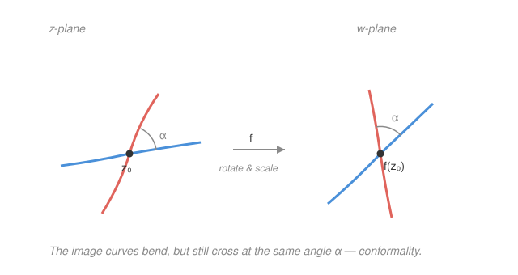

# Complex Analysis · Lesson 2.3: Harmonic functions and conformality

> ⏱ ~15 min · Module 2: Holomorphic functions · Builds on: [2.2 The Cauchy–Riemann equations](02-02-cauchy-riemann-equations.md) · Unlocks: Module 3 — [3.1 Complex power series and analytic functions](03-01-power-series-analytic.md)

## Why this matters

The Cauchy–Riemann equations looked like a bookkeeping test for holomorphy. They are secretly two of the most useful facts in applied mathematics. Squeeze them once and out falls **Laplace's equation** — meaning the real and imaginary parts of *any* holomorphic function are automatic solutions to steady-state heat flow, electrostatics, and ideal fluid flow. Squeeze them a different way and out falls **conformality**: holomorphic maps preserve angles, which is why you can bend a hard-shaped physics problem into an easy-shaped one and carry the answer back. This lesson is where complex analysis stops being self-referential and becomes an engine for the physical world.

## The idea

Cauchy–Riemann welds $u$ and $v$ together so tightly that neither is free. Watch what that buys you.

**Payoff 1 — each part solves Laplace's equation.** CR says $u_x=v_y$ and $u_y=-v_x$. Differentiate the first in $x$ and the second in $y$ and the mixed partials of $v$ collide and cancel, leaving $u_{xx}+u_{yy}=0$. That combination — second derivative in $x$ plus second derivative in $y$ — is exactly the equation governing anything that has settled into equilibrium: a temperature that no longer changes, a voltage with no charge present, the height of a stretched drumhead at rest. So *every* holomorphic function hands you two such equilibrium fields for free.

**Payoff 2 — angles survive.** Zoom in on a holomorphic $f$ near a point $z_0$. To first order $f(z)\approx f(z_0)+f'(z_0)(z-z_0)$: whatever tiny arrow $z-z_0$ you feed in, the output is that arrow multiplied by the single complex number $f'(z_0)$. And from Lesson 1.1, multiplying by a complex number is just **rotate-and-scale** — every arrow spins by the same angle $\arg f'(z_0)$ and stretches by the same factor $|f'(z_0)|$. Two curves crossing at $z_0$ have their tangent arrows spun by the *same* amount, so the angle *between* them is untouched. The map can bend space wildly in the large, but infinitesimally it is a rigid rotation times a zoom — and rotations preserve angles.

## The formal version

**Harmonic function.** A real-valued $\phi(x,y)$ with continuous second partials is **harmonic** on an open set if it satisfies **Laplace's equation**
$$\phi_{xx}+\phi_{yy}=0.$$

> In words: the pure second derivatives in the two directions cancel — bulge up one way, you must bulge down the other by exactly as much. A harmonic function has no local peaks or pits in the interior.

**Theorem (holomorphic ⟹ harmonic parts).** If $f=u+iv$ is holomorphic on an open set, then $u$ and $v$ are each harmonic there.

*Proof.* Holomorphic functions have continuous partials of all orders (proved in Module 4 via the Cauchy integral formula — take it on loan here), so mixed partials commute: $v_{yx}=v_{xy}$. Start from Cauchy–Riemann,
$$u_x=v_y,\qquad u_y=-v_x.$$
Differentiate the left equation in $x$ and the right in $y$:
$$u_{xx}=v_{yx},\qquad u_{yy}=-v_{xy}.$$
Add them: $u_{xx}+u_{yy}=v_{yx}-v_{xy}=0$. So $u$ is harmonic. The same move on the other pairing ($u_x=v_y$ differentiated in $y$, $u_y=-v_x$ in $x$) gives $v_{xx}+v_{yy}=0$. $\blacksquare$

> In words: differentiate CR once more and the second partials of the *other* function cancel against themselves, leaving Laplace's equation for the *first*.

**Harmonic conjugate.** Given a harmonic $u$, a **harmonic conjugate** of $u$ is a function $v$ such that $f=u+iv$ is holomorphic — equivalently, $v$ satisfies the CR equations against $u$. On a simply connected region (no holes) such a $v$ always exists and is **unique up to an additive real constant**.

> In words: a harmonic $u$ is always secretly the real part of some holomorphic function; its partner $v$ is pinned down except for how high you slide the whole thing.

**Conformality.** A map $f$ is **conformal** at $z_0$ if it preserves the angle (magnitude *and* orientation) between any two curves through $z_0$. **Theorem:** if $f$ is holomorphic at $z_0$ and $f'(z_0)\neq 0$, then $f$ is conformal at $z_0$.

> In words: away from points where the derivative vanishes, a holomorphic map is a local rotation-and-zoom, so it leaves every crossing angle exactly as it found it.

## Picture

## Worked examples

**Example 1 (mechanical — build a conjugate).** Take $u(x,y)=x^2-y^2$. First check it is harmonic: $u_{xx}=2$, $u_{yy}=-2$, sum $=0$. ✓ Good — only harmonic functions have conjugates, so this test is the price of admission.

Now integrate the CR equations to recover $v$. From $v_y=u_x=2x$, integrate in $y$ holding $x$ fixed:
$$v(x,y)=\int 2x\,dy = 2xy + g(x),$$
where the "constant" of integration is a whole function $g(x)$, since anything depending only on $x$ vanishes under $\partial_y$. Pin down $g$ with the *other* CR equation, $v_x=-u_y$. Here $-u_y = -(-2y)=2y$, while differentiating our expression gives $v_x = 2y + g'(x)$. Matching forces $g'(x)=0$, so $g(x)=C$, a genuine constant. Hence
$$v(x,y)=2xy+C,\qquad f=u+iv=(x^2-y^2)+i(2xy)+iC.$$
Recognize $x^2-y^2+2ixy=(x+iy)^2=z^2$. So $f(z)=z^2+iC$ — the conjugate reconstructed a familiar function, up to the promised additive constant.

**Example 2 (why you'd care — angles, and where they break).** Keep $f(z)=z^2$, so $f'(z)=2z$. Everywhere except the origin $f'(z)\neq 0$, so $f$ is conformal: the two families of curves $u=x^2-y^2=\text{const}$ and $v=2xy=\text{const}$ are orthogonal hyperbolas, meeting at right angles — a right angle in equals a right angle out. This orthogonality is no accident: $\nabla u\cdot\nabla v = u_xv_x+u_yv_y = u_x(-u_y)+u_y(u_x)=0$ by CR, so level curves of *any* holomorphic function's real and imaginary parts cross at $90^\circ$ wherever $f'\neq0$. That is the geometric fingerprint of a conjugate pair — and in physics, $u=\text{const}$ are equipotentials while $v=\text{const}$ are the field lines threading through them.

At the one exceptional point $z_0=0$ we have $f'(0)=0$, and conformality fails loudly. Feed $z^2$ two rays leaving the origin at angle $\theta$ apart; squaring **doubles** every argument, so the images leave at angle $2\theta$ apart. Angles aren't preserved — they're multiplied. Wherever the derivative dies, the first-order rotation-and-scale picture collapses and you must look at the next term.

## Watch out

- You might think every smooth $u$ has a harmonic conjugate, but **only harmonic ones do**. Laplace's equation is the *compatibility condition* for the CR system $v_y=u_x,\ v_x=-u_y$ to have a solution: equality of mixed partials $v_{xy}=v_{yx}$ demands $\partial_x(u_x)=\partial_y(-u_y)$, i.e. $u_{xx}+u_{yy}=0$. No harmonicity, no conjugate.
- You might think the conjugate is unique. It is unique **only up to an added real constant** — you can always slide $v\mapsto v+C$ (equivalently $f\mapsto f+iC$) and stay holomorphic. Don't report a conjugate as *the* answer without the $+C$.
- You might think a conjugate always exists globally. On a domain with a **hole** it can fail. The classic: $u=\ln|z|=\tfrac12\ln(x^2+y^2)$ is harmonic on the punctured plane $\mathbb{C}\setminus\{0\}$, but its only candidate conjugate is $\arg z$, which is **multivalued** — walk once around the hole and it jumps by $2\pi$. So $\ln|z|$ has no single-valued conjugate on the whole punctured plane; you must cut it, exactly the branch cut of [2.2](02-02-cauchy-riemann-equations.md)'s ancestor in Lesson 1.3. Simple connectivity (no holes) is precisely what rules this out.

## One-liner

> Cauchy–Riemann, differentiated once more, forces $u$ and $v$ to solve Laplace's equation; read the other way, it makes $f$ a local rotate-and-scale — so holomorphic maps manufacture equilibrium fields and preserve every angle (except where $f'=0$).

## Problems

**P1 (🟢)** Show $u(x,y)=e^{x}\cos y$ is harmonic, then find a harmonic conjugate $v$ and identify $f=u+iv$ as a familiar function of $z$.

**P2 (🟡)** At which points is $f(z)=z^3$ conformal? Pick a point where it fails and describe precisely what it does to the angle between two curves crossing there.

**P3 (🔴, optional)** Suppose $v$ is a harmonic conjugate of $u$ on a region, **and** $u$ is also a harmonic conjugate of $v$ (so $u+iv$ *and* $v+iu$ are both holomorphic). Show $u$ and $v$ must both be constant. (Hint: write out both sets of CR equations.)

Solutions

**P1** Harmonic check: $u_x=e^x\cos y$, $u_{xx}=e^x\cos y$; $u_y=-e^x\sin y$, $u_{yy}=-e^x\cos y$. Sum $=0$. ✓

Integrate $v_y=u_x=e^x\cos y$ in $y$: $v=e^x\sin y+g(x)$. Then $v_x=e^x\sin y+g'(x)$ must equal $-u_y=e^x\sin y$, forcing $g'(x)=0$, so $g=C$. Thus
$$v=e^x\sin y+C,\qquad f=e^x\cos y+i\,e^x\sin y+iC=e^x(\cos y+i\sin y)+iC=e^z+iC.$$
The conjugate rebuilt the complex exponential $e^z$ (up to the additive constant), matching its definition from Lesson 1.3.

**P2** $f'(z)=3z^2$, which vanishes only at $z=0$. So $f$ is conformal at **every point except the origin**. At $z=0$ it fails: in polar form $z^3$ sends $re^{i\theta}\mapsto r^3 e^{i3\theta}$, tripling arguments. Two curves whose tangents leave the origin $\theta$ apart have images leaving $3\theta$ apart — angles are tripled, not preserved. (General rule: at a zero of $f'$ of order $k$, i.e. $f'$ vanishing like $(z-z_0)^k$, angles at $z_0$ multiply by $k+1$; here $f'\sim z^2$, $k=2$, factor $3$.)

**P3** "$u+iv$ holomorphic" gives $u_x=v_y$ and $u_y=-v_x$. "$v+iu$ holomorphic" gives (same CR with roles swapped) $v_x=u_y$ and $v_y=-u_x$. Combine the two $u_x$ facts: $u_x=v_y$ and $v_y=-u_x$, so $u_x=-u_x\Rightarrow u_x=0$. Combine the $u_y$ facts: $u_y=-v_x$ and $v_x=u_y$, so $u_y=-u_y\Rightarrow u_y=0$. Both partials of $u$ vanish everywhere on the (connected) region, so $u$ is constant; the CR equations then force $v_x=v_y=0$, so $v$ is constant too. $\blacksquare$

## Flashback

**From Lesson 2.2 (The Cauchy–Riemann equations):** Let $f(z)=\bar z^2$, i.e. with $z=x+iy$, $f=(x-iy)^2=(x^2-y^2)-i(2xy)$. Does $f$ satisfy the Cauchy–Riemann equations anywhere? Where (if anywhere) is $f$ complex-differentiable, and what is $f'$ there?

Solution

Read off $u=x^2-y^2$, $v=-2xy$. Partials:
$$u_x=2x,\quad u_y=-2y,\quad v_x=-2y,\quad v_y=-2x.$$
CR needs $u_x=v_y$: $2x=-2x\Rightarrow x=0$. And $u_y=-v_x$: $-2y=2y\Rightarrow y=0$. Both hold **only at the origin** $z=0$. The partials are continuous, so CR holding at that isolated point means $f$ is complex-differentiable there (and nowhere else), with
$$f'(0)=u_x+iv_x\big|_{0}=0+i\cdot 0=0.$$
So $f=\bar z^2$ is differentiable at a single point with derivative $0$ — and being differentiable only at an isolated point, it is **holomorphic nowhere** (holomorphy needs differentiability on an open set). A clean reminder that conjugation breaks holomorphy, and that CR at one lonely point is not holomorphy.

## Connections

- **Backward:** this is [2.2](02-02-cauchy-riemann-equations.md)'s Cauchy–Riemann equations differentiated one more time (for Laplace) and read to first order (for conformality); the rotate-and-scale reading of $f'(z_0)$ is Lesson 1.1's "multiplication is rotation-and-scaling" applied to the linearization. The global-conjugate obstruction is Lesson 1.3's branch cut wearing a real-variable disguise.
- **Forward:** Module 3 ([3.1](03-01-power-series-analytic.md)) shows these holomorphic functions are locally power series — sharpening "continuous second partials" (borrowed here) into "infinitely differentiable, automatically." Conformality is the whole point of Module 7's `07-02-conformal-maps-riemann.md`, where a conformal change of variables transports a harmonic function onto an easy region and **solves the Dirichlet problem** (steady-state temperature) there.
- **Sideways (physics/econ):** harmonic $u$ = equilibrium potential (steady-state heat, electrostatic voltage, incompressible irrotational flow); its conjugate $v$ gives the orthogonal field/flow lines. The same Laplace operator $\phi_{xx}+\phi_{yy}$ is the 2-D case of the Laplacian you meet in `calc-refresher` and in the equilibrium conditions of continuous-time economic models.
