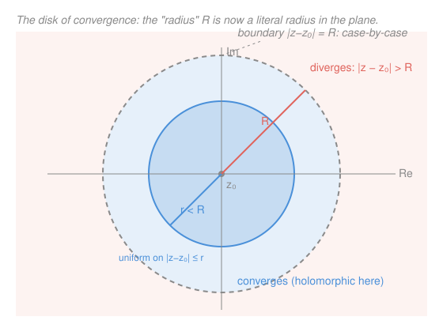

# Complex Analysis · Lesson 3.1: Complex power series and analytic functions

> ⏱ ~15 min · Module 3: Power series · Builds on: [2.1 Complex differentiability](02-01-complex-differentiability.md), `real-analysis` (power series, uniform convergence) · Unlocks: [3.2 The elementary functions as power series](03-02-elementary-functions-series.md)

## Why this matters

In `real-analysis` you built power series and asked where they converge — the answer was an *interval* $(c-R, c+R)$, and the number $R$ was called the "radius of convergence" for reasons that never quite showed themselves on a line. Move the same series into $\mathbb{C}$ and the word *radius* becomes literally true: the region of convergence is a **disk**, and $R$ is its honest radius. That one upgrade explains a mystery real calculus left dangling — why $\frac{1}{1+x^2}$, a function with no trouble anywhere on the real line, still has a Taylor series that quits at $|x|=1$. The obstruction was never on the line; it was at $\pm i$, off in the complex plane, and only complex eyes can see it. This lesson also delivers the engine of the whole course: inside its disk a power series is holomorphic and differentiates term by term, so it is automatically infinitely differentiable.

## The idea

A complex power series is not a new object. It is the *same* series you already studied, fed complex inputs. The convergence theory transfers verbatim: replace the real distance $|x-c|$ by the complex distance $|z-z_0|$ and every theorem from `real-analysis` — radius of convergence, the Cauchy–Hadamard formula, uniform convergence on compact subsets, the Weierstrass M-test — carries over word for word, because each of those proofs only ever used $|\cdot|$, and $\mathbb{C}$ has a $|\cdot|$.

What changes is the *picture*. On the line, "$|x-c| < R$" is an interval with two loose endpoints. In the plane, "$|z-z_0| < R$" is a filled circle — a disk — with a whole boundary circle instead of two stray points. Inside that disk the series converges absolutely and behaves impeccably; outside it diverges; and on the rim it's genuinely case-by-case. The headline is what happens *inside*: the series isn't just continuous there, it's holomorphic, and you can differentiate it one term at a time forever. A function that agrees with such a series near a point earns a name — **analytic** — and the astonishing Module 5 result is that in $\mathbb{C}$, analytic and holomorphic are the same thing.

## The formal version

**Complex power series.** Fix a **center** $z_0\in\mathbb{C}$ and **coefficients** $a_n\in\mathbb{C}$. The series is

$$f(z) = \sum_{n=0}^{\infty} a_n (z-z_0)^n .$$

> In words: a "polynomial of infinite degree" in the displacement $z-z_0$ from the center.

**Radius of convergence.** There is a number $R\in[0,\infty]$ such that the series converges absolutely whenever $|z-z_0| < R$ and diverges whenever $|z-z_0| > R$. The set $D(z_0,R)=\{z : |z-z_0| < R\}$ is the **disk of convergence**. The radius is given by the **Cauchy–Hadamard formula**

$$\frac{1}{R} = \limsup_{n\to\infty} |a_n|^{1/n},$$

and, when the limit exists, by the often-easier **ratio form** $R = \lim_{n\to\infty} \left|\dfrac{a_n}{a_{n+1}}\right|$.

> In words: these are exactly the `real-analysis` formulas — the only change is that $|a_n|$ is now a complex modulus. The proof is the identical comparison to a geometric series: if $|z-z_0|<R$ then eventually $|a_n(z-z_0)^n|\le \rho^n$ for some $\rho<1$, and $\sum\rho^n$ converges. The convergence set is a disk (not an interval) purely because $|z-z_0|$ measures planar distance.

**Uniform convergence on compact subdisks.** Fix any $r$ with $0\le r<R$. On the closed subdisk $|z-z_0|\le r$, the series converges **uniformly**.

> In words: pick any circle strictly inside the disk of convergence; on and within it, the partial sums close in on $f$ at one rate good for every point at once. The reason is the **Weierstrass M-test** (from `real-analysis`): for $|z-z_0|\le r$ we have $|a_n(z-z_0)^n|\le |a_n| r^n =: M_n$, and $\sum M_n$ converges because $r<R$ — a convergent numeric bound independent of $z$ forces uniform convergence.

**Continuity.** A uniform limit of continuous functions is continuous. Each partial sum is a polynomial, hence continuous; so $f$ is **continuous on all of $D(z_0,R)$** (every point sits inside some compact subdisk).

**Key theorem — holomorphic, term by term.** On $D(z_0,R)$ the sum $f$ is **holomorphic**, and its derivative is obtained by differentiating each term:

$$f'(z) = \sum_{n=1}^{\infty} n\,a_n (z-z_0)^{n-1},$$

and this differentiated series has the **same radius of convergence** $R$.

> In words: inside its disk, a power series can be differentiated one term at a time, and the result is another power series good on the very same disk. Since $\limsup |n a_n|^{1/n} = \limsup |a_n|^{1/n}$ (because $n^{1/n}\to 1$), the radius is unchanged — so we can differentiate *again*, and again. A power series is **infinitely complex-differentiable inside $R$.** The proof mirrors the `real-analysis` term-by-term differentiation theorem, which is powered by exactly the uniform convergence on compact subdisks just established.

**Analytic.** A function $f$ is **analytic at $z_0$** if there is some $r>0$ and coefficients $a_n$ with $f(z)=\sum a_n(z-z_0)^n$ for all $|z-z_0|<r$. It is analytic on an open set if it is analytic at each point.

> In words: analytic means "locally equal to a convergent power series." The theorem above says **power series $\Rightarrow$ holomorphic**, so *analytic $\Rightarrow$ holomorphic* for free. The deep converse — every holomorphic function is analytic — is the summit of Module 5, [5.1 Taylor series: holomorphic = analytic](05-01-taylor-series-analyticity.md). In $\mathbb{C}$ the two words end up meaning the same thing; that coincidence is the reason "analytic function theory" is another name for this whole subject.

## Picture

## Worked examples

**Example 1 (mechanical — the three archetypes).** The ratio form $R=\lim|a_n/a_{n+1}|$ settles the standard cases instantly.

- $\displaystyle\sum_{n=0}^\infty z^n$: here $a_n=1$, so $R = \lim \left|\tfrac{1}{1}\right| = 1$. Converges on the open unit disk $|z|<1$, and there it sums to the closed form $\dfrac{1}{1-z}$ — the complex **geometric series**, our single most-used tool going forward.
- $\displaystyle\sum_{n=0}^\infty \frac{z^n}{n!}$: here $a_n=1/n!$, so $R=\lim\left|\dfrac{1/n!}{1/(n+1)!}\right| = \lim (n+1) = \infty$. Converges for **every** $z\in\mathbb{C}$. (This is $e^z$ — an *entire* function, next lesson.)
- $\displaystyle\sum_{n=0}^\infty n!\,z^n$: here $a_n=n!$, so $R=\lim\left|\dfrac{n!}{(n+1)!}\right| = \lim\dfrac{1}{n+1} = 0$. Converges **only** at $z=0$; useless as a function. Factorial growth in the coefficients strangles the disk to a point.

Same machinery, three utterly different verdicts — $R$ can be anything in $[0,\infty]$, and it is dictated entirely by how fast $|a_n|$ grows.

**Example 2 (why you'd care — the boundary is subtle).** Two series with the *same* radius $R=1$ can behave completely differently on the rim $|z|=1$.

- $\displaystyle\sum z^n$: on $|z|=1$ the terms $z^n$ have modulus $1$ and never shrink, so the necessary condition "terms $\to 0$" fails. It **diverges at every boundary point**.
- $\displaystyle\sum \frac{z^n}{n^2}$: on $|z|=1$ we have $\left|\dfrac{z^n}{n^2}\right| = \dfrac{1}{n^2}$, and $\sum \dfrac{1}{n^2}$ converges (the $p=2$ series). By comparison the series **converges absolutely at every boundary point**.

Identical disk, opposite fates on its edge — the interior theory cannot see the boundary, and no general rule decides it. (A third pattern, $\sum z^n/n$, converges on part of the circle and diverges at $z=1$: partial credit.)

## Watch out

- You might think the boundary circle inherits the interior's good behavior, but **behavior on $|z-z_0|=R$ is genuinely case-by-case** — a series can converge everywhere on the rim, nowhere, or only on part of it (Example 2). Every theorem in this lesson is about the *open* disk; say nothing about the edge without checking it directly.
- You might think a real function's Taylor radius is set by its behavior on the real line, but **$R$ equals the distance from the center to the nearest singularity in the whole complex plane.** That's why $\dfrac{1}{1+x^2}$, perfectly smooth for all real $x$, has Taylor series (about $0$) converging only for $|x|<1$: rewrite it as $\dfrac{1}{1+z^2}$ and the singularities are at $z=\pm i$, each at distance $1$ from the origin. The real series was being throttled by *complex* poles it couldn't see. (Made precise in [5.1](05-01-taylor-series-analyticity.md).)
- You might think you can differentiate the series term by term anywhere it's written down, but the license holds **only inside the open disk**, where the uniform convergence on compact subdisks that justifies it is available. On or beyond the boundary the manipulation is unsupported.

## One-liner

> A complex power series converges on a *disk* whose radius is the distance to the nearest singularity, and inside that disk it is holomorphic — differentiable term by term, forever.

## Problems

**P1 (🟢)** Find the radius of convergence of $\displaystyle\sum_{n=1}^{\infty} n^2 z^n$ and name the largest open disk on which it defines a holomorphic function.

**P2 (🟡)** Find the radius of convergence of $\displaystyle\sum_{n=0}^{\infty} \frac{(z-2i)^n}{3^n}$, describe its disk of convergence geometrically (center and radius), and determine whether it converges or diverges at $z=0$.

**P3 (🔴, optional)** Let $f(z)=\displaystyle\sum_{n=0}^\infty \frac{z^n}{n!}$ (radius $R=\infty$, from Example 1). Using term-by-term differentiation, show $f'(z)=f(z)$ for all $z\in\mathbb{C}$. Then explain in one line why this, plus $f(0)=1$, makes $f(z)=e^z$ the only reasonable name for it.

Solutions

**P1** Coefficients $a_n=n^2$. Ratio form: $R = \lim_{n\to\infty}\left|\dfrac{n^2}{(n+1)^2}\right| = \lim \dfrac{n^2}{(n+1)^2} = 1$. (Cauchy–Hadamard agrees: $|a_n|^{1/n}=(n^2)^{1/n}=(n^{1/n})^2\to 1$, so $1/R=1$.) The series defines a holomorphic function on the **open unit disk** $D(0,1)=\{|z|<1\}$, and by the key theorem it is infinitely differentiable there.

**P2** Write it as $\sum a_n (z-2i)^n$ with center $z_0=2i$ and $a_n=1/3^n$. Ratio form: $R=\lim\left|\dfrac{1/3^n}{1/3^{n+1}}\right| = \lim 3 = 3$. The disk of convergence is $D(2i,3)$ — the open disk **centered at $2i$ of radius $3$**. Is $z=0$ inside? Its distance from the center is $|0-2i|=|{-2i}|=2 < 3$, so **yes, $z=0$ lies in the disk and the series converges there** (absolutely). (Sanity check: it's a geometric series $\sum\left(\tfrac{z-2i}{3}\right)^n$, converging iff $\left|\tfrac{z-2i}{3}\right|<1$, i.e. $|z-2i|<3$ — same disk.)

**P3** Differentiate term by term (licensed everywhere, since $R=\infty$):

$$f'(z) = \sum_{n=1}^{\infty} n\cdot\frac{z^{n-1}}{n!} = \sum_{n=1}^{\infty} \frac{z^{n-1}}{(n-1)!}.$$

Re-index with $m=n-1$ (so $m$ runs $0,1,2,\dots$):

$$f'(z) = \sum_{m=0}^{\infty} \frac{z^{m}}{m!} = f(z).$$

So $f'=f$ on all of $\mathbb{C}$. A function equal to its own derivative with value $1$ at $0$ is exactly the defining property of the exponential — the real $e^x$ is pinned down by $y'=y,\ y(0)=1$, and this series is the unique holomorphic function extending it. Hence we *define* $e^z:=\sum z^n/n!$, the subject of [3.2](03-02-elementary-functions-series.md).

## Flashback

**From Lesson 2.1 (Complex differentiability):** Consider $f(z) = \bar z = x - iy$ (the complex conjugate, where $z=x+iy$). Show $f$ is **not** complex-differentiable at $z=0$ by computing the difference quotient along two directions and getting different limits.

Solution

The difference quotient at $0$ is $\dfrac{f(h)-f(0)}{h} = \dfrac{\bar h - 0}{h} = \dfrac{\bar h}{h}$, and complex differentiability demands this approach **one** limit as $h\to 0$ from *every* direction.

- Along the real axis, $h=t$ with $t\in\mathbb{R}\to 0$: then $\bar h = t$, so $\dfrac{\bar h}{h} = \dfrac{t}{t} = 1$.
- Along the imaginary axis, $h=it$ with $t\in\mathbb{R}\to 0$: then $\bar h = \overline{it} = -it$, so $\dfrac{\bar h}{h} = \dfrac{-it}{it} = -1$.

The two directional limits are $1$ and $-1$ — different — so the limit defining $f'(0)$ does not exist. Conjugation is not holomorphic anywhere, and the direction-dependence is exactly the failure the Cauchy–Riemann equations detect ($u=x,\ v=-y$ give $u_x=1\neq v_y=-1$). This is the same "same limit from every direction" severity that makes power series — which *are* holomorphic — so special.

## Connections

- **Backward:** this lesson is `real-analysis`'s power-series theory (Cauchy–Hadamard, the Weierstrass M-test, uniform convergence on compacts, term-by-term differentiation) re-run with $|x-c|$ replaced by $|z-z_0|$ — nothing is re-proved, only re-pictured, with the interval fattening into a disk. The "holomorphic" verdict rests on the difference-quotient definition from [2.1](02-01-complex-differentiability.md).
- **Forward:** [3.2](03-02-elementary-functions-series.md) builds $e^z,\sin z,\cos z,\log(1+z)$ as concrete series and proves Euler's formula; [5.1](05-01-taylor-series-analyticity.md) proves the stunning converse (holomorphic $\Rightarrow$ analytic) and makes precise "radius = distance to nearest singularity."
- **Sideways (physics/PDE):** the term-by-term differentiability established here is what lets you solve differential equations by power-series ansatz — the standard route to the special functions (Bessel, Legendre) of mathematical physics, where a recurrence on the $a_n$ replaces the ODE.
