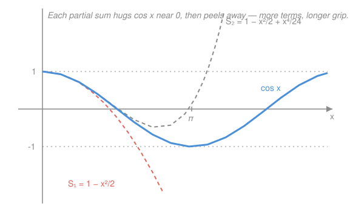

# Complex Analysis · Lesson 3.2: The elementary functions as power series

> ⏱ ~15 min · Module 3: Power series · Builds on: [3.1 Complex power series and analytic functions](03-01-power-series-analytic.md), [1.3 The exponential, logarithm, and complex trig](01-03-exponential-log-trig.md) · Unlocks: Module 4 — [4.1 Contour integrals](04-01-contour-integrals.md)

## Why this matters

In [1.3](01-03-exponential-log-trig.md) we *declared* $e^{z}=e^{x}(\cos y+i\sin y)$ and asked you to trust that Euler's formula $e^{iy}=\cos y+i\sin y$ knits the exponential to the trig functions. That was a geometric picture, not a proof — where does the "$\cos y+i\sin y$" actually come from? This lesson gives $e^z,\sin z,\cos z$ their *real* definitions as power series, and then every identity you were handed — Euler, the derivative rules, $\cos^2+\sin^2=1$, the addition law — falls out of series algebra, now fully licensed by [3.1](03-01-power-series-analytic.md)'s term-by-term theorem. It is the moment the elementary functions stop being magic and become theorems.

## The idea

A power series is the most honest way to define a function: it's just a rule for turning $z$ into a number by adding up powers, with nothing geometric assumed. So take the *real* Taylor series you already know — $e^x=1+x+\frac{x^2}{2}+\cdots$ — erase the $x$, write $z$, and **define** the complex function by that same sum. Because these series converge for *every* $z$ (radius $\infty$), the functions are **entire**: analytic on all of $\mathbb{C}$.

Once the definitions are series, Euler's formula is not a mystery — it's bookkeeping. Feed $iz$ into the exponential series. The powers of $i$ march $1,i,-1,-i,1,\dots$, sorting the terms into a real pile and an imaginary pile. The real pile *is* the cosine series; the imaginary pile *is* the sine series. So $e^{iz}=\cos z+i\sin z$ is a rearrangement — and rearranging is legal only because the series converges *absolutely* (more on that landmine below). Every other identity is the same trick: differentiate the series term by term, or multiply two series together, and read off the answer.

## The formal version

**The three series (all entire).**

$$e^{z}=\sum_{n=0}^{\infty}\frac{z^{n}}{n!},\qquad \cos z=\sum_{n=0}^{\infty}\frac{(-1)^{n}z^{2n}}{(2n)!},\qquad \sin z=\sum_{n=0}^{\infty}\frac{(-1)^{n}z^{2n+1}}{(2n+1)!}.$$

> In words: these are the familiar real Taylor series with $x$ replaced by $z$ — taken now as the *definitions* of the complex functions.

Each has radius $R=\infty$. For $e^z$ the coefficients are $a_n=1/n!$, and the ratio test from [3.1](03-01-power-series-analytic.md) gives $\left|\frac{a_{n+1}}{a_n}\right|=\frac{1}{n+1}\to 0$, so $1/R=0$, i.e. $R=\infty$. The cosine and sine coefficients are $1/(2n)!$ and $1/(2n+1)!$, which shrink even faster, so $R=\infty$ there too. **In words:** these sums converge for every complex number, so the functions live on all of $\mathbb{C}$.

**Euler's formula (rigorously).** Substitute $iz$ into the exponential series and use $i^{2k}=(-1)^k$, $i^{2k+1}=(-1)^k i$:

$$e^{iz}=\sum_{n=0}^{\infty}\frac{(iz)^{n}}{n!}=\underbrace{\sum_{k=0}^{\infty}\frac{(-1)^{k}z^{2k}}{(2k)!}}_{\cos z}+\ i\underbrace{\sum_{k=0}^{\infty}\frac{(-1)^{k}z^{2k+1}}{(2k+1)!}}_{\sin z}=\cos z+i\sin z.$$

> In words: splitting the exponential's terms into even powers and odd powers hands you exactly the cosine series and $i$ times the sine series.

The split — regrouping the single sum into two subseries — is a *rearrangement*, and rearranging an infinite sum can change its value unless the series converges **absolutely**. The exponential series does: $\sum |iz|^n/n! = e^{|z|}<\infty$ for every $z$. That absolute convergence is the permission slip; without it the manipulation above would be unjustified. This closes the loop with [1.3](01-03-exponential-log-trig.md): the $\cos y+i\sin y$ we assumed is now *derived*.

**Term-by-term consequences.** Because a power series may be differentiated term by term inside its disk of convergence ([3.1](03-01-power-series-analytic.md)), all the calculus rules are one line each:

$$\frac{d}{dz}e^{z}=\sum_{n=1}^{\infty}\frac{n z^{n-1}}{n!}=\sum_{n=1}^{\infty}\frac{z^{n-1}}{(n-1)!}=e^{z},\qquad \frac{d}{dz}\sin z=\cos z,\qquad \frac{d}{dz}\cos z=-\sin z.$$

> In words: differentiating each power and reindexing reproduces the same series — the derivative laws are now proved, not assumed.

The Pythagorean identity is fastest straight from Euler. Since $\cos$ is even and $\sin$ is odd, $e^{-iz}=\cos z-i\sin z$, so

$$1=e^{0}=e^{iz}e^{-iz}=(\cos z+i\sin z)(\cos z-i\sin z)=\cos^{2}z+\sin^{2}z.$$

> In words: multiplying $e^{iz}$ by $e^{-iz}$ collapses to $1$, and expanding the product spells out $\cos^2 z+\sin^2 z$.

That step used the **addition law** $e^{z+w}=e^{z}e^{w}$. It comes from the **Cauchy product** — multiply the two series and collect like powers:

$$e^{z}e^{w}=\left(\sum_{j}\frac{z^{j}}{j!}\right)\!\left(\sum_{k}\frac{w^{k}}{k!}\right)=\sum_{n=0}^{\infty}\sum_{j=0}^{n}\frac{z^{j}}{j!}\frac{w^{n-j}}{(n-j)!}=\sum_{n=0}^{\infty}\frac{1}{n!}\sum_{j=0}^{n}\binom{n}{j}z^{j}w^{n-j}=\sum_{n=0}^{\infty}\frac{(z+w)^{n}}{n!}=e^{z+w}.$$

The inner sum is the binomial theorem; the Cauchy product is valid because both factors converge absolutely. **In words:** the addition law for exponentials is the binomial theorem hiding inside a product of series.

**The geometric series — the workhorse.** For $|z|<1$,

$$\frac{1}{1-z}=\sum_{n=0}^{\infty}z^{n},\qquad R=1.$$

> In words: the sum of a geometric series is $1/(1-z)$, valid strictly inside the unit disk, where the single singularity $z=1$ sits on the boundary.

Two payoffs by substitution and integration:

- Replace $z$ by $-z^{2}$: $\displaystyle\frac{1}{1+z^{2}}=\sum_{n=0}^{\infty}(-1)^{n}z^{2n}$, radius $1$ — now the radius is forced by the singularities at $z=\pm i$, both at distance $1$ from $0$.
- Integrate $\frac{1}{1+z}=\sum_{n\ge0}(-1)^n z^n$ term by term from $0$: $\displaystyle\log(1+z)=\sum_{n=1}^{\infty}\frac{(-1)^{n-1}}{n}z^{n}$, radius $1$, set by the singularity of $\log$ at $z=-1$.

## Picture

Each partial sum is a polynomial, so it must eventually run off to $\pm\infty$ — yet near $0$ it clings to $\cos x$, and every extra term extends the grip. That widening interval of agreement is convergence made visible: fix any $x$ and the sums lock onto $\cos x$; the radius being $\infty$ means this happens for *every* $x$.

## Worked examples

**Example 1 (mechanical — cosine from the exponential).** Add Euler's formula to its reflection $e^{-iz}=\cos z-i\sin z$:

$$e^{iz}+e^{-iz}=2\cos z\ \Rightarrow\ \cos z=\frac{e^{iz}+e^{-iz}}{2},\qquad\text{and likewise}\qquad \sin z=\frac{e^{iz}-e^{-iz}}{2i}.$$

These are the *definitions* of complex $\cos,\sin$ you met in [1.3](01-03-exponential-log-trig.md) — here they drop out of the series in two lines, no geometry invoked.

**Example 2 (why you'd care — a series with a finite radius).** Find the Maclaurin series of $f(z)=\dfrac{1}{2-z}$ and its radius. Factor to expose a geometric series:

$$\frac{1}{2-z}=\frac{1}{2}\cdot\frac{1}{1-z/2}=\frac{1}{2}\sum_{n=0}^{\infty}\left(\frac{z}{2}\right)^{n}=\sum_{n=0}^{\infty}\frac{z^{n}}{2^{n+1}},\qquad |z/2|<1\iff|z|<2.$$

The radius is $2$ — exactly the distance from the center $0$ to the singularity at $z=2$, the general law you'll prove in [5.1](05-01-taylor-series-analyticity.md). This substitution trick — bend any $\frac{1}{a-z}$ into $\frac{1}{1-(\cdot)}$ — is how most elementary expansions get built.

## Watch out

- You might think you can split or reorder a series' terms whenever it's convenient — but that's legal *only* under **absolute** convergence. The even/odd split in Euler's proof works because $\sum|z|^n/n!=e^{|z|}<\infty$; a merely convergent (conditionally convergent) series can be rearranged to sum to *anything*. Always name the absolute convergence before you regroup.
- You might think complex $\sin,\cos$ are bounded by $1$ like their real cousins — the series look identical. They are **not**: $\cos(iy)=\cosh y\to\infty$ as $y\to\infty$ (Problem 3). The real bound $|\cos|\le1$ was an accident of the real axis, exactly the surprise flagged in [1.3](01-03-exponential-log-trig.md).
- You might think $\log(1+z)=\sum(-1)^{n-1}z^n/n$ holds wherever $\log$ is defined — but the series only converges for $|z|<1$. The radius is the distance from $0$ to the nearest singularity ($z=-1$); $\log$ exists far beyond that circle, but *this* series doesn't reach it. A function can outlive its power series.

## One-liner

> Define $e^z,\sin z,\cos z$ as their power series and everything — Euler, the derivative rules, $\cos^2+\sin^2=1$, the addition law — is just absolutely-convergent series being rearranged, differentiated, and multiplied.

## Problems

**P1 (🟢)** Using $e^{iz}=\cos z+i\sin z$ and $e^{-iz}=\cos z-i\sin z$, derive the formula $\sin z=\dfrac{e^{iz}-e^{-iz}}{2i}$, and use it to evaluate $\sin\!\left(\frac{\pi}{2}\right)$ as a check.

**P2 (🟡)** Starting from $\dfrac{1}{1-z}=\sum_{n\ge0}z^{n}$ ($|z|<1$), differentiate term by term to find the power series of $\dfrac{1}{(1-z)^{2}}$, and state its radius of convergence.

**P3 (🔴, optional)** Show complex cosine is unbounded: compute $\cos(iy)$ for real $y$ using Example 1's formula, and explain in one sentence why the real intuition "$|\cos|\le1$" fails in $\mathbb{C}$.

Solutions

**P1** Subtract the two identities: $e^{iz}-e^{-iz}=(\cos z+i\sin z)-(\cos z-i\sin z)=2i\sin z$. Divide by $2i$:

$$\sin z=\frac{e^{iz}-e^{-iz}}{2i}.$$

Check at $z=\pi/2$: $e^{i\pi/2}=i$ and $e^{-i\pi/2}=-i$, so $\sin(\pi/2)=\dfrac{i-(-i)}{2i}=\dfrac{2i}{2i}=1.$ ✓

**P2** Term-by-term differentiation is licensed inside the disk of convergence ([3.1](03-01-power-series-analytic.md)). Differentiate both sides of $\frac{1}{1-z}=\sum_{n\ge0}z^n$:

$$\frac{d}{dz}\frac{1}{1-z}=\frac{1}{(1-z)^{2}},\qquad \frac{d}{dz}\sum_{n=0}^{\infty}z^{n}=\sum_{n=1}^{\infty}n z^{n-1}=\sum_{m=0}^{\infty}(m+1)z^{m}.$$

Hence $\dfrac{1}{(1-z)^{2}}=\sum_{n=0}^{\infty}(n+1)z^{n}$. Differentiation never shrinks the radius, so it is still $R=1$ (the singularity is still at $z=1$).

**P3** By Example 1, $\cos z=\frac{1}{2}(e^{iz}+e^{-iz})$. At $z=iy$ ($y$ real), $iz=i(iy)=-y$ and $-iz=y$, so

$$\cos(iy)=\frac{e^{-y}+e^{y}}{2}=\cosh y.$$

As $y\to\infty$, $\cosh y\to\infty$, so $\cos$ is unbounded on $\mathbb{C}$. The real bound $|\cos x|\le1$ only reflects that $e^{ix}$ has modulus $1$ on the *real* axis; off it, $e^{iz}$ can grow without limit, and cosine grows with it.

## Flashback

**From Lesson 3.1 (radius of convergence):** Find the radius of convergence of $\displaystyle\sum_{n=0}^{\infty}\frac{n+1}{4^{n}}\,z^{n}$, and state its behavior on the boundary circle.

Solution

The coefficients are $a_n=(n+1)/4^n$. Apply the ratio test from [3.1](03-01-power-series-analytic.md):

$$\left|\frac{a_{n+1}}{a_{n}}\right|=\frac{n+2}{4^{n+1}}\cdot\frac{4^{n}}{n+1}=\frac{n+2}{4(n+1)}\xrightarrow{n\to\infty}\frac{1}{4}.$$

So $1/R=\tfrac14$, giving $R=4$. On the boundary $|z|=4$ the general term has modulus $\left|\frac{n+1}{4^n}z^n\right|=(n+1)\cdot\frac{|z|^n}{4^n}=n+1\to\infty$. The terms don't even approach $0$, so the series **diverges at every point of the circle $|z|=4$**. $\blacksquare$

## Connections

- **Backward:** this lesson is [3.1](03-01-power-series-analytic.md) cashed out — the abstract "term-by-term differentiation" and "radius via Cauchy–Hadamard/ratio" theorems become the concrete engines that produce $e^z$, $\sin z$, $\cos z$, and their identities. It also settles the promissory note from [1.3](01-03-exponential-log-trig.md), turning Euler's formula from a definition into a derivation.
- **Forward:** [5.1](05-01-taylor-series-analyticity.md) proves the converse master fact — *every* holomorphic function equals its Taylor series locally, with radius = distance to the nearest singularity (the pattern you already saw governing $\frac{1}{1+z^2}$ and $\log(1+z)$). The series $\frac{1}{1-z}=\sum z^n$ becomes the standard integrand for the contour computations of [4.1](04-01-contour-integrals.md).
- **Sideways:** the same generating-function algebra powers `prob-stat-refresher` (moment and probability generating functions are power series manipulated exactly like these), and Euler's formula is the workhorse of every oscillation and wave problem in `physics` — the complex exponential replaces messy sine/cosine bookkeeping with one clean $e^{i\omega t}$.
